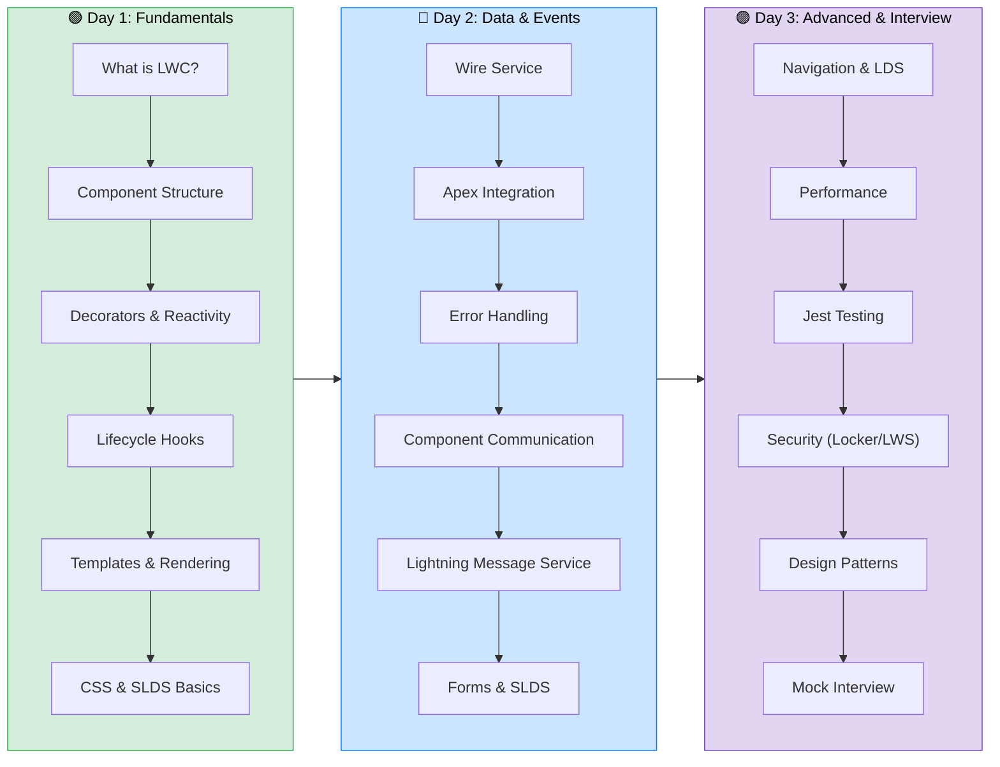
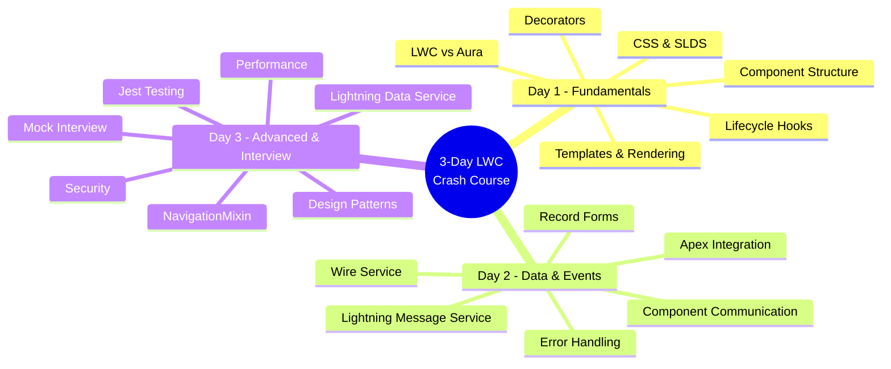
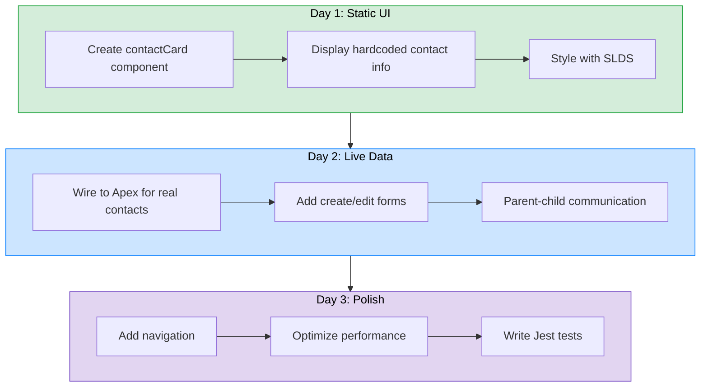

# 🚀 3-Day LWC Crash Course — Complete Study Plan

> **Goal**: Go from zero to interview-ready in Lightning Web Components in just 3 days.

> [!IMPORTANT]
> This crash course is designed for developers who already know basic JavaScript and HTML. If you're new to web development, consider spending an extra day on JS fundamentals before starting.

---

## 📋 Prerequisites Checklist

Before you begin, make sure you have the following ready:

| # | Prerequisite | Status |
|---|---|---|
| 1 | **Salesforce Developer Org** — [Sign up free](https://developer.salesforce.com/signup) | ⬜ |
| 2 | **VS Code** installed — [Download](https://code.visualstudio.com/) | ⬜ |
| 3 | **Salesforce CLI (sf)** installed — `npm install -g @salesforce/cli` | ⬜ |
| 4 | **Salesforce Extension Pack** for VS Code installed | ⬜ |
| 5 | Basic **JavaScript** knowledge (ES6+ classes, modules, Promises, arrow functions) | ⬜ |
| 6 | Basic **HTML/CSS** knowledge | ⬜ |
| 7 | Familiarity with **Salesforce objects** (Account, Contact, Opportunity) | ⬜ |
| 8 | A **quiet study space** with 6-8 hours of focused time per day | ⬜ |

---

## 🗺️ Learning Progression



---

## 📅 Day-by-Day Schedule

### 🟢 Day 1 — Fundamentals (6-8 hours)

> **Theme**: *Build your foundation — understand the building blocks of every LWC component.*

| Time Block | Duration | Topic | Activity |
|---|---|---|---|
| **9:00 - 9:45** | 45 min | What is LWC & Why it replaced Aura | Read + Notes |
| **9:45 - 10:30** | 45 min | Architecture & Component File Structure | Read + Explore |
| **10:30 - 10:45** | 15 min | ☕ Break | — |
| **10:45 - 11:30** | 45 min | Dev Environment Setup | Hands-on Setup |
| **11:30 - 12:15** | 45 min | First LWC Component (Hello World) | Code Along |
| **12:15 - 1:00** | 45 min | 🍽️ Lunch Break | — |
| **1:00 - 2:00** | 60 min | Decorators Deep-Dive (@api, @track, @wire) | Read + Code |
| **2:00 - 3:00** | 60 min | Lifecycle Hooks | Read + Code |
| **3:00 - 3:15** | 15 min | ☕ Break | — |
| **3:15 - 4:00** | 45 min | Conditional Rendering & Loops | Read + Code |
| **4:00 - 4:45** | 45 min | CSS in LWC & SLDS Integration | Read + Code |
| **4:45 - 5:30** | 45 min | Practice Questions + Quiz | Self-Assessment |
| **5:30 - 6:00** | 30 min | Review Key Takeaways | Revision |

**📁 Study Material**: [Day 1 — Fundamentals](./day-1-fundamentals/README.md)
**📝 Practice Questions**: [Day 1 — Practice](./day-1-fundamentals/practice-questions.md)
**🧪 Quiz**: [Day 1 — Quiz](./day-1-fundamentals/quiz.md)

---

### 🔵 Day 2 — Data & Events (6-8 hours)

> **Theme**: *Connect your components to data and make them talk to each other.*

| Time Block | Duration | Topic | Activity |
|---|---|---|---|
| **9:00 - 9:30** | 30 min | Quick Day 1 Recap | Review Notes |
| **9:30 - 10:30** | 60 min | Wire Service Deep-Dive | Read + Code |
| **10:30 - 10:45** | 15 min | ☕ Break | — |
| **10:45 - 11:45** | 60 min | Wire Adapters (getRecord, etc.) | Read + Code |
| **11:45 - 12:30** | 45 min | Imperative Apex Calls | Read + Code |
| **12:30 - 1:15** | 45 min | 🍽️ Lunch Break | — |
| **1:15 - 2:15** | 60 min | Error Handling Patterns | Read + Code |
| **2:15 - 3:15** | 60 min | Component Communication (All Patterns) | Read + Code |
| **3:15 - 3:30** | 15 min | ☕ Break | — |
| **3:30 - 4:15** | 45 min | Lightning Message Service | Read + Code |
| **4:15 - 5:00** | 45 min | Lightning Record Forms | Read + Code |
| **5:00 - 5:45** | 45 min | Practice Questions + Quiz | Self-Assessment |
| **5:45 - 6:15** | 30 min | Review Key Takeaways | Revision |

**📁 Study Material**: [Day 2 — Data & Events](./day-2-data-and-events/README.md)
**📝 Practice Questions**: [Day 2 — Practice](./day-2-data-and-events/practice-questions.md)
**🧪 Quiz**: [Day 2 — Quiz](./day-2-data-and-events/quiz.md)

---

### 🟣 Day 3 — Advanced Topics & Interview Prep (6-8 hours)

> **Theme**: *Master advanced patterns, test your knowledge, and prepare for the interview room.*

| Time Block | Duration | Topic | Activity |
|---|---|---|---|
| **9:00 - 9:30** | 30 min | Quick Day 1 & 2 Recap | Review Notes |
| **9:30 - 10:15** | 45 min | NavigationMixin | Read + Code |
| **10:15 - 11:00** | 45 min | Lightning Data Service Deep-Dive | Read + Code |
| **11:00 - 11:15** | 15 min | ☕ Break | — |
| **11:15 - 12:00** | 45 min | Performance Best Practices | Read + Notes |
| **12:00 - 12:45** | 45 min | Jest Testing for LWC | Read + Code |
| **12:45 - 1:30** | 45 min | 🍽️ Lunch Break | — |
| **1:30 - 2:15** | 45 min | Security: Locker Service vs LWS | Read + Notes |
| **2:15 - 3:00** | 45 min | Common Design Patterns | Read + Notes |
| **3:00 - 3:15** | 15 min | ☕ Break | — |
| **3:15 - 4:00** | 45 min | Quick Revision (All Topics) | Summary Tables |
| **4:00 - 5:00** | 60 min | Mock Interview (10 Rapid-Fire Q&A) | Self-Practice |
| **5:00 - 5:45** | 45 min | Practice Questions + Quiz | Self-Assessment |
| **5:45 - 6:30** | 45 min | Final Review & Weak Area Focus | Revision |

**📁 Study Material**: [Day 3 — Advanced & Interview](./day-3-advanced-and-interview/README.md)
**📝 Practice Questions**: [Day 3 — Practice](./day-3-advanced-and-interview/practice-questions.md)
**🧪 Quiz**: [Day 3 — Quiz](./day-3-advanced-and-interview/quiz.md)

---

## 🎯 What You'll Learn Each Day



---

## 💡 Tips for Maximizing Learning in 3 Days

### 🏗️ The "Build as You Learn" Rule

> [!TIP]
> Don't just read the material — type every code example yourself. Muscle memory is a real thing in coding. Avoid copy-paste for at least the first two days.

### 📌 Specific Strategies

| Strategy | Why It Works |
|---|---|
| **Code every example** | Reading ≠ understanding. Type it, break it, fix it. |
| **Take handwritten notes** | Writing by hand activates deeper processing than typing notes. |
| **Explain concepts aloud** | If you can teach it, you know it. Talk through each concept as if explaining to a colleague. |
| **Do quizzes BEFORE checking answers** | Struggle is where learning happens. Don't peek early. |
| **Focus on "WHY" not just "HOW"** | Interviewers love "why did Salesforce design it this way?" questions. |
| **Build a mini-project** | Create a Contact Manager app that grows across all 3 days. |
| **Time-box your study sessions** | 45-60 minute blocks with 15-minute breaks. Your brain needs rest to consolidate learning. |
| **Review before bed** | Quick 10-minute review of the day's key concepts before sleeping boosts retention. |

### 🔄 The Mini-Project Approach

Build a **Contact Manager** across 3 days to apply everything you learn:



### 🚨 Common Mistakes to Avoid

> [!WARNING]
> - **Don't skip Day 1** — Even if you "know JavaScript," LWC has specific patterns you need to internalize.
> - **Don't memorize, understand** — Interview questions are scenario-based, not trivia.
> - **Don't skip practice questions** — They reveal gaps you didn't know you had.
> - **Don't spend too long debugging one issue** — If stuck for 15+ minutes, note it down and move on. Come back later.

---

## 📊 Self-Assessment Scoring Guide

After completing all quizzes (30 questions total):

| Score | Level | Recommendation |
|---|---|---|
| **27-30** | 🌟 Interview Ready | You're well-prepared. Focus on behavioral questions now. |
| **21-26** | ✅ Good Foundation | Review the topics you missed. One more day of practice recommended. |
| **15-20** | ⚠️ Needs Work | Re-study weak areas. Give yourself 1-2 more days. |
| **Below 15** | 🔄 Start Over | Go through the material again more slowly. Consider a 5-day plan. |

---

## 🗂️ File Structure

```
3-day-plan/
├── README.md                              ← You are here
├── day-1-fundamentals/
│   ├── README.md                          ← Day 1 Study Material
│   ├── practice-questions.md              ← 15 Practice Questions
│   └── quiz.md                            ← 10-Question Quiz
├── day-2-data-and-events/
│   ├── README.md                          ← Day 2 Study Material
│   ├── practice-questions.md              ← 15 Practice Questions
│   └── quiz.md                            ← 10-Question Quiz
└── day-3-advanced-and-interview/
    ├── README.md                          ← Day 3 Study Material
    ├── practice-questions.md              ← 15 Practice Questions
    └── quiz.md                            ← 10-Question Quiz
```

---

> [!NOTE]
> This plan is optimized for someone preparing for a **Salesforce LWC developer interview**. If you're preparing for a certification exam, supplement this with the official Salesforce trailhead modules.

**Ready? Let's begin → [Day 1: Fundamentals](./day-1-fundamentals/README.md)** 🚀
