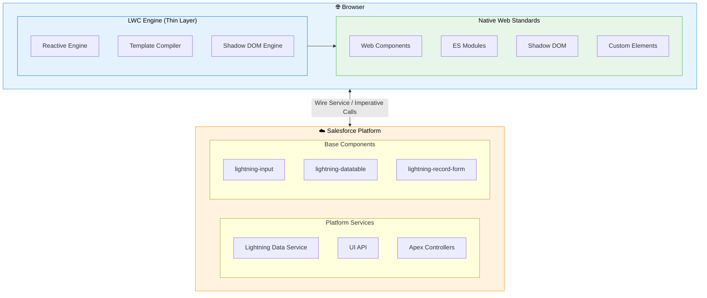
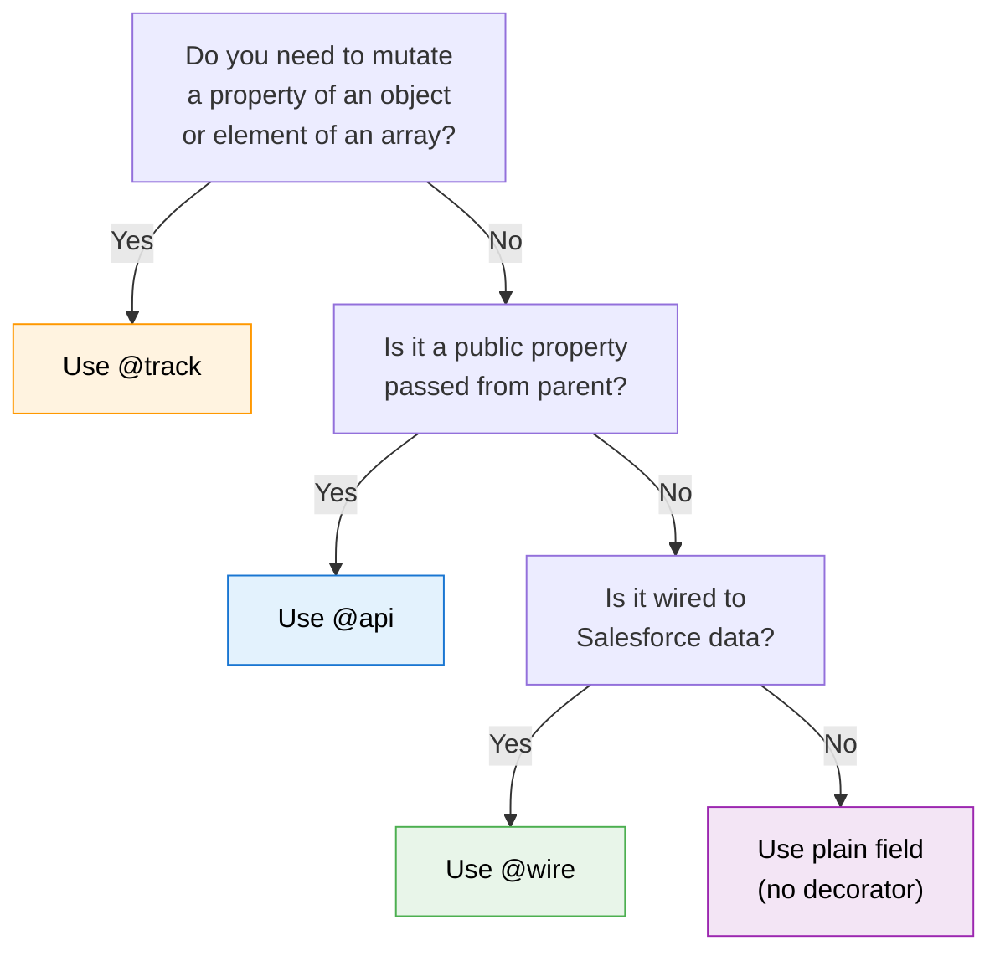
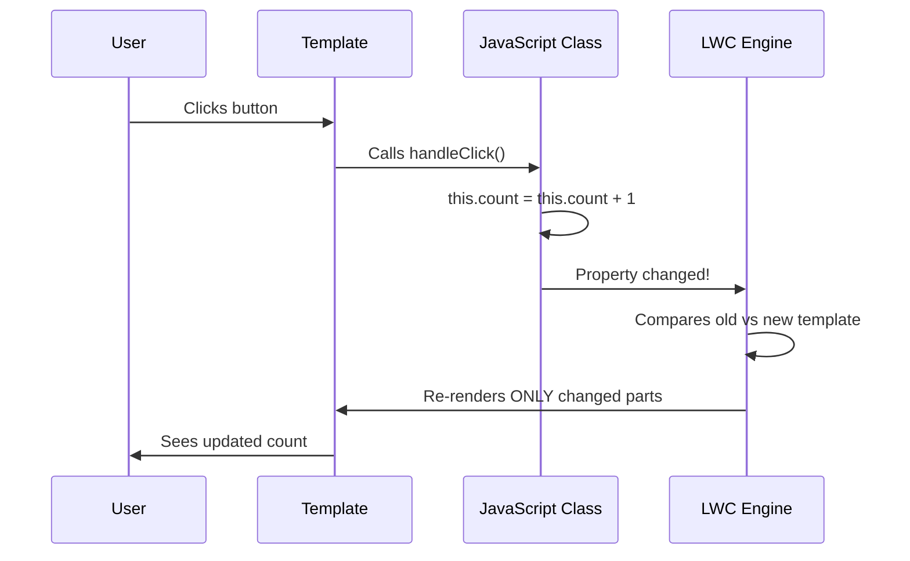
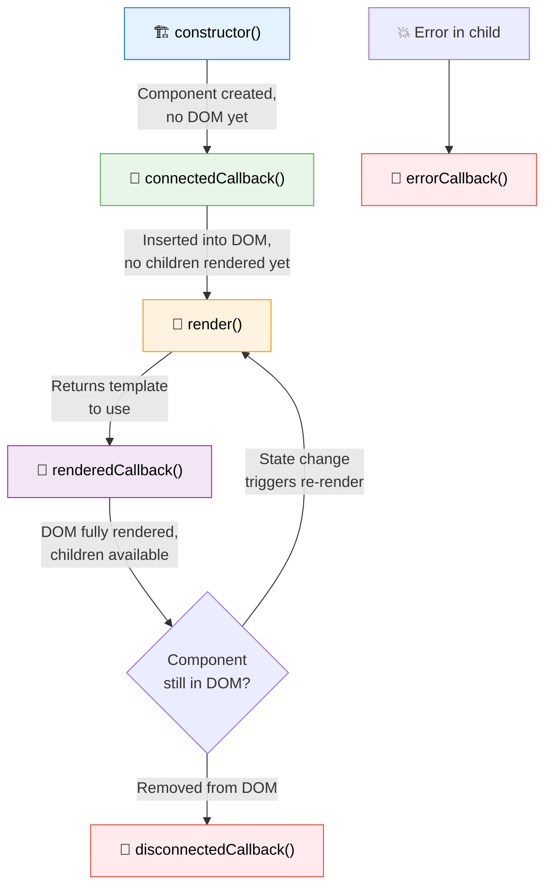
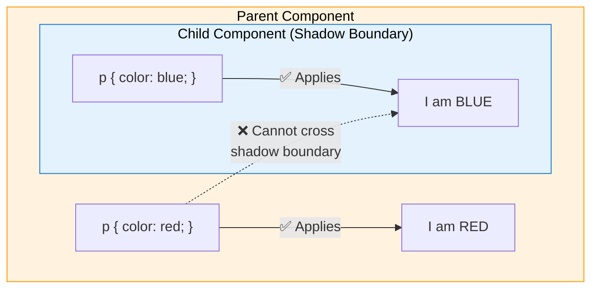

# 🟢 Day 1 — LWC Fundamentals

> **Today's Goal**: Understand the building blocks of every Lightning Web Component — from file structure to lifecycle hooks to rendering.

---

## 📚 Table of Contents

1. [What is LWC & Why It Replaced Aura](#1--what-is-lwc--why-it-replaced-aura)
2. [LWC Architecture](#2--lwc-architecture)
3. [Component File Structure](#3--component-file-structure)
4. [Setting Up Your Development Environment](#4--setting-up-your-development-environment)
5. [Your First LWC Component](#5--your-first-lwc-component)
6. [Template Syntax: Data Binding & Expressions](#6--template-syntax-data-binding--expressions)
7. [Decorators Deep-Dive: @api, @track, @wire](#7--decorators-deep-dive-api-track-wire)
8. [Reactive Properties & Rendering](#8--reactive-properties--rendering)
9. [Lifecycle Hooks](#9--lifecycle-hooks)
10. [Conditional Rendering](#10--conditional-rendering)
11. [Template Loops](#11--template-loops)
12. [CSS in LWC](#12--css-in-lwc-scoping-custom-properties--slds)
13. [Key Takeaways](#-key-takeaways)

---

## 1. 🌟 What is LWC & Why It Replaced Aura

### The Simple Analogy

Think of **Aura** as building a house with a proprietary toolset — special Aura-brand hammers, Aura-brand nails, Aura-brand everything. If you wanted to hire a new carpenter, they had to learn all your proprietary tools first.

**LWC** is like switching to standard, industry-standard tools. Any carpenter (web developer) who knows standard tools (HTML, JavaScript, CSS) can start building immediately.

### What is Lightning Web Components?

Lightning Web Components (LWC) is Salesforce's **modern UI framework** built on native web standards — specifically **Web Components**, **ES Modules**, and **Shadow DOM**. Introduced in **Spring '19 (February 2019)**, LWC leverages the browser's native capabilities rather than adding a thick abstraction layer.

### LWC vs Aura — Comparison Table

| Feature | Aura (Lightning Components) | LWC (Lightning Web Components) |
|---|---|---|
| **Released** | 2014 | 2019 |
| **Standards** | Proprietary framework | Web Standards (Web Components) |
| **Language** | Proprietary syntax + JS | Standard ES6+ JavaScript |
| **Performance** | Heavier (thick abstraction) | Faster (thin abstraction, native APIs) |
| **Learning Curve** | Steep (Aura-specific patterns) | Easier (standard web dev skills) |
| **Event Model** | Aura Events (Component/Application) | Standard DOM Events (CustomEvent) |
| **Rendering** | Client-side, full re-render | Reactive, targeted re-render |
| **Data Binding** | Two-way by default | One-way by default |
| **Module System** | Aura bundles | ES Modules (import/export) |
| **Testing** | Limited | Jest support built-in |
| **Interoperability** | Can contain LWC | Cannot contain Aura |
| **Future** | Maintenance mode | Active development |

> [!IMPORTANT]
> **Aura is NOT deprecated** — it's in maintenance mode. Existing Aura components continue to work. However, all new development should use LWC. LWC components can live inside Aura components, but not vice versa.

### Why Salesforce Made the Switch

1. **Performance**: Native browser APIs are faster than framework abstractions
2. **Developer Experience**: Millions of web developers already know HTML/JS/CSS
3. **Standards Alignment**: Web Components are a W3C standard
4. **Smaller Bundle Size**: Less framework code = faster page loads
5. **Better Tooling**: Standard tools (Jest, ESLint) work natively

---

## 2. 🏗️ LWC Architecture



### How LWC Works Under the Hood

1. **You write** `.html`, `.js`, `.css`, `.xml` files
2. **The LWC compiler** transforms your template into optimized JavaScript
3. **The LWC engine** manages reactivity and re-rendering
4. **The browser** handles everything else using native Web Component APIs
5. **The Wire Service** bridges your component to Salesforce data

> [!TIP]
> Think of the LWC engine as a very thin "translator" between your code and the browser's native Web Component APIs. Unlike Aura, it doesn't try to reinvent the wheel — it just adds Salesforce-specific sugar on top of web standards.

---

## 3. 📁 Component File Structure

Every LWC component is a **folder** containing related files. The folder name IS the component name.

```
force-app/main/default/lwc/
└── myComponent/
    ├── myComponent.html        ← Template (required*)
    ├── myComponent.js          ← Controller/Logic (required)
    ├── myComponent.css         ← Styles (optional)
    ├── myComponent.js-meta.xml ← Metadata/Config (required)
    ├── myComponent.svg         ← Custom icon (optional)
    └── __tests__/
        └── myComponent.test.js ← Jest tests (optional)
```

> [!NOTE]
> The `.html` file is technically optional — components without a template are called "service components" (they only export JavaScript). But 99% of the time, you'll have an HTML file.

### File-by-File Breakdown

#### 📄 `myComponent.html` — The Template

```html
<template>
    <lightning-card title="My Component">
        <p class="greeting">Hello, {name}!</p>
        <lightning-button
            label="Click Me"
            onclick={handleClick}>
        </lightning-button>
    </lightning-card>
</template>
```

**Key Rules:**
- Must be wrapped in a single `<template>` root tag
- Uses `{propertyName}` for data binding (single curly braces, no `this`)
- Event handlers use `on[event]={handlerName}` syntax
- No JavaScript expressions in templates (no `{a + b}` or `{condition ? x : y}`)

#### 📄 `myComponent.js` — The Controller

```javascript
import { LightningElement, api, track } from 'lwc';

export default class MyComponent extends LightningElement {
    name = 'World';

    handleClick() {
        this.name = 'Salesforce Developer';
    }
}
```

**Key Rules:**
- Class name is **PascalCase** (MyComponent)
- Folder name is **camelCase** (myComponent)
- HTML tag usage is **kebab-case** with namespace: `<c-my-component>`
- Must extend `LightningElement`
- Must use `export default`

#### Naming Convention Reference

| Context | Convention | Example |
|---|---|---|
| Folder name | camelCase | `contactCard` |
| Class name | PascalCase | `ContactCard` |
| HTML tag (in markup) | kebab-case with `c-` prefix | `<c-contact-card>` |
| File names | camelCase (match folder) | `contactCard.js` |

#### 📄 `myComponent.css` — Scoped Styles

```css
/* These styles are automatically scoped to THIS component only */
.greeting {
    font-size: 1.5rem;
    color: #333;
    padding: 1rem;
}

/* Target the host element itself */
:host {
    display: block;
    border: 1px solid #e5e5e5;
}
```

**Key Rules:**
- Styles are **automatically scoped** — they won't leak to parent or child components
- Use `:host` to style the component's outer wrapper element
- No support for global CSS (by design — prevents style conflicts)
- CSS custom properties (variables) CAN pierce the shadow boundary

#### 📄 `myComponent.js-meta.xml` — Metadata Configuration

```xml
<?xml version="1.0" encoding="UTF-8"?>
<LightningComponentBundle xmlns="http://soap.sforce.com/2006/04/metadata">
    <apiVersion>62.0</apiVersion>
    <isExposed>true</isExposed>
    <targets>
        <target>lightning__RecordPage</target>
        <target>lightning__AppPage</target>
        <target>lightning__HomePage</target>
    </targets>
    <targetConfigs>
        <targetConfig targets="lightning__RecordPage">
            <property name="title" type="String" default="My Component" />
        </targetConfig>
    </targetConfigs>
</LightningComponentBundle>
```

**Key Properties:**

| Property | Purpose | Example |
|---|---|---|
| `apiVersion` | Salesforce API version | `62.0` |
| `isExposed` | Makes component available in App Builder | `true` |
| `targets` | Where the component can be placed | `lightning__RecordPage` |
| `targetConfigs` | Design-time properties for App Builder | See above |
| `masterLabel` | Display name in App Builder | `"Contact Card"` |
| `description` | Description in App Builder | `"Displays contact info"` |

**Common Targets:**

| Target | Where It Appears |
|---|---|
| `lightning__RecordPage` | Record detail pages |
| `lightning__AppPage` | App pages |
| `lightning__HomePage` | Home page |
| `lightning__FlowScreen` | Screen flows |
| `lightning__Tab` | Custom tabs |
| `lightning__Inbox` | Outlook/Gmail integration |
| `lightningCommunity__Page` | Experience Cloud pages |

---

## 4. 🛠️ Setting Up Your Development Environment

### Step-by-Step Setup

**Step 1: Install Salesforce CLI**
```bash
npm install -g @salesforce/cli
# Verify installation
sf --version
```

**Step 2: Install VS Code Extensions**

Install the **Salesforce Extension Pack** from the VS Code marketplace. This includes:
- Salesforce CLI Integration
- Apex Language Server
- Lightning Web Components
- Apex Replay Debugger

**Step 3: Create a Salesforce DX Project**
```bash
sf project generate --name my-lwc-project
cd my-lwc-project
```

**Step 4: Authorize Your Dev Org**
```bash
sf org login web --set-default --alias myDevOrg
```

**Step 5: Create Your First Component**
```bash
sf lightning generate component --name helloWorld --output-dir force-app/main/default/lwc
```

**Step 6: Deploy to Your Org**
```bash
sf project deploy start --source-dir force-app
```

> [!TIP]
> Use `sf project deploy start --source-dir force-app --target-org myDevOrg` if you have multiple orgs configured.

---

## 5. 🎯 Your First LWC Component

Let's build a simple **Greeting Card** component step by step.

### `greetingCard.html`

```html
<template>
    <lightning-card title="Greeting Card" icon-name="standard:contact">
        <div class="slds-p-around_medium">
            <p class="slds-text-heading_small">Hello, {userName}!</p>
            <p class="slds-text-body_regular slds-m-top_small">
                Welcome to Lightning Web Components.
            </p>
            <lightning-input
                label="Your Name"
                value={userName}
                onchange={handleNameChange}>
            </lightning-input>
            <p class="slds-m-top_medium">
                <strong>Characters typed:</strong> {characterCount}
            </p>
        </div>
    </lightning-card>
</template>
```

### `greetingCard.js`

```javascript
import { LightningElement } from 'lwc';

export default class GreetingCard extends LightningElement {
    userName = 'World';

    // Getter — computed property accessible in the template
    get characterCount() {
        return this.userName.length;
    }

    handleNameChange(event) {
        this.userName = event.target.value;
    }
}
```

### `greetingCard.js-meta.xml`

```xml
<?xml version="1.0" encoding="UTF-8"?>
<LightningComponentBundle xmlns="http://soap.sforce.com/2006/04/metadata">
    <apiVersion>62.0</apiVersion>
    <isExposed>true</isExposed>
    <targets>
        <target>lightning__AppPage</target>
        <target>lightning__HomePage</target>
    </targets>
</LightningComponentBundle>
```

### What's Happening Here?

1. `{userName}` in the template binds to the `userName` property in the JS class
2. When the user types in the input, `handleNameChange` fires and updates `userName`
3. Because `userName` changed, the template **automatically re-renders** the greeting
4. `{characterCount}` calls the **getter** `get characterCount()` — it recalculates on every render

> [!NOTE]
> You don't need to call any "refresh" or "update" method. LWC's reactive engine automatically re-renders the template when tracked properties change. This is the magic of **reactivity**.

---

## 6. 🔗 Template Syntax: Data Binding & Expressions

### Data Binding with `{property}`

LWC uses **one-way data binding** by default. Data flows from JavaScript → Template.

```html
<template>
    <!-- Simple property binding -->
    <p>{message}</p>

    <!-- Getter binding (computed values) -->
    <p>{fullName}</p>

    <!-- Nested property binding -->
    <p>{contact.Name}</p>

    <!-- Binding in attributes -->
    <lightning-button label={buttonLabel} disabled={isDisabled}></lightning-button>
</template>
```

```javascript
import { LightningElement } from 'lwc';

export default class BindingDemo extends LightningElement {
    message = 'Hello from LWC!';
    firstName = 'John';
    lastName = 'Doe';
    buttonLabel = 'Click Me';
    isDisabled = false;

    contact = {
        Name: 'Jane Smith',
        Email: 'jane@example.com'
    };

    // Getter — the ONLY way to have computed values in templates
    get fullName() {
        return `${this.firstName} ${this.lastName}`;
    }
}
```

### What You CAN'T Do in Templates

> [!CAUTION]
> LWC templates are intentionally restrictive. You cannot use JavaScript expressions directly in templates. This is a design choice for performance and security.

```html
<!-- ❌ INVALID — No expressions in templates -->
<p>{firstName + ' ' + lastName}</p>
<p>{count > 0 ? 'Yes' : 'No'}</p>
<p>{items.length}</p>
<p>{price * 1.1}</p>

<!-- ✅ VALID — Use getters instead -->
<p>{fullName}</p>
<p>{hasItems}</p>
<p>{itemCount}</p>
<p>{priceWithTax}</p>
```

```javascript
// ✅ Compute everything in JavaScript using getters
get fullName() { return `${this.firstName} ${this.lastName}`; }
get hasItems() { return this.count > 0 ? 'Yes' : 'No'; }
get itemCount() { return this.items.length; }
get priceWithTax() { return this.price * 1.1; }
```

---

## 7. 🎀 Decorators Deep-Dive: @api, @track, @wire

Decorators are **special annotations** that modify the behavior of class properties. LWC provides three decorators.

### Overview Table

| Decorator | Purpose | Reactive? | Direction |
|---|---|---|---|
| `@api` | Public property — exposes to parent | ✅ Yes | Parent → Child |
| `@track` | Deep object/array tracking | ✅ Yes (deep) | Internal |
| `@wire` | Wire to Salesforce data source | ✅ Yes | Platform → Component |
| *(none)* | Private reactive field | ✅ Yes (shallow) | Internal |

> [!IMPORTANT]
> Since **Spring '20**, plain class fields (without any decorator) ARE reactive. You only need `@track` for **deep object mutation tracking**. This is a very common interview question!

### `@api` — Public Properties

The `@api` decorator makes a property **public**, allowing parent components to pass data in.

```javascript
// childComponent.js
import { LightningElement, api } from 'lwc';

export default class ChildComponent extends LightningElement {
    @api recordId;           // Parent can set this
    @api title = 'Default';  // With default value

    // Public method — parent can call this
    @api
    refresh() {
        console.log('Refreshing component...');
        // Re-fetch data, reset state, etc.
    }
}
```

```html
<!-- parentComponent.html — passing data to child -->
<template>
    <c-child-component
        record-id={selectedRecordId}
        title="Contact Details">
    </c-child-component>
</template>
```

> [!WARNING]
> **Never modify an `@api` property from inside the child component!** It's a one-way contract. The parent owns the data. If you need a local copy, clone it in `connectedCallback`:
> ```javascript
> @api recordId;
> _localRecordId;
>
> connectedCallback() {
>     this._localRecordId = this.recordId; // Make a local copy
> }
> ```

### `@track` — Deep Object Tracking

```javascript
import { LightningElement, track } from 'lwc';

export default class TrackDemo extends LightningElement {
    // ✅ Plain field — reactive for reassignment
    name = 'John';                  // Reactive when: this.name = 'Jane'

    // ✅ Plain object — reactive ONLY when reassigned entirely
    contact = { Name: 'John' };     // Reactive when: this.contact = { Name: 'Jane' }
                                    // NOT reactive when: this.contact.Name = 'Jane'

    // ✅ @track — reactive even for deep property changes
    @track trackedContact = { Name: 'John' };
    // Reactive when: this.trackedContact.Name = 'Jane'  ← THIS works now!

    handleUpdate() {
        // ❌ Won't trigger re-render (plain field, deep mutation)
        this.contact.Name = 'Jane';

        // ✅ Will trigger re-render (@track decorator)
        this.trackedContact.Name = 'Jane';

        // ✅ Alternative: reassign the whole object (works without @track)
        this.contact = { ...this.contact, Name: 'Jane' };
    }
}
```

### When to Use `@track` vs Plain Fields — Decision Flow



### `@wire` — Wire to Data (Preview)

We'll cover `@wire` in depth on Day 2, but here's a quick taste:

```javascript
import { LightningElement, wire } from 'lwc';
import getContacts from '@salesforce/apex/ContactController.getContacts';

export default class ContactList extends LightningElement {
    @wire(getContacts)
    contacts;
    // contacts.data → the results
    // contacts.error → any error
}
```

---

## 8. ⚡ Reactive Properties & Rendering

### How Reactivity Works



### What Triggers a Re-Render?

| Action | Triggers Re-Render? |
|---|---|
| Reassign a plain field (`this.x = newValue`) | ✅ Yes |
| Mutate object property (`this.obj.key = val`) | ❌ No (unless `@track`) |
| Mutate array element (`this.arr[0] = val`) | ❌ No (unless `@track`) |
| Reassign object (`this.obj = {...this.obj, key: val}`) | ✅ Yes |
| Push to array (`this.arr.push(item)`) | ❌ No (unless `@track`) |
| Reassign array (`this.arr = [...this.arr, item]`) | ✅ Yes |
| `@api` property changed by parent | ✅ Yes |
| `@wire` data changes | ✅ Yes |

> [!TIP]
> **Interview Gold**: "How do you update an array in LWC to trigger re-render?"
> Answer: Either use `@track` and mutate directly, or (more commonly) create a new array: `this.items = [...this.items, newItem]`. The spread operator approach is preferred because it's explicit and works without `@track`.

---

## 9. 🔄 Lifecycle Hooks

Lifecycle hooks let you run code at specific moments in a component's life. Think of them as milestones in a component's journey from birth to death.

### The Real-World Analogy

Imagine a component as a person joining a company:
- **constructor()** → Born/Created (fill out paperwork)
- **connectedCallback()** → First day at office (set up desk, meet team)
- **renderedCallback()** → After completing a project (review work)
- **disconnectedCallback()** → Last day (clean up desk, return badge)
- **errorCallback()** → HR handles a crisis (something went wrong)

### Lifecycle Flow



### Detailed Hook Reference

#### `constructor()`
```javascript
export default class LifecycleDemo extends LightningElement {
    constructor() {
        super(); // MUST call super() first — always!
        // ✅ Initialize fields
        this.counter = 0;
        // ❌ Do NOT access this.template (DOM doesn't exist yet)
        // ❌ Do NOT access child elements
        // ❌ Do NOT dispatch events
        console.log('1. Constructor called');
    }
}
```

#### `connectedCallback()`
```javascript
connectedCallback() {
    // ✅ Component is in the DOM now
    // ✅ Access @api properties (they're set by parent before this)
    // ✅ Fetch data, set up subscriptions, add event listeners
    // ❌ Child components may NOT be rendered yet
    console.log('2. Connected to DOM');
    console.log('Record ID from parent:', this.recordId);

    // Common use: subscribe to events
    window.addEventListener('resize', this.handleResize);
}
```

#### `renderedCallback()`
```javascript
renderedCallback() {
    // ✅ DOM is fully rendered (including children)
    // ✅ Access DOM elements via this.template.querySelector()
    // ⚠️ Fires EVERY time the component re-renders
    // ⚠️ Be careful of infinite loops — don't modify state here
    //     unless you guard with a flag
    console.log('3. Rendered');

    // Common pattern: run initialization logic only once
    if (!this._initialized) {
        this._initialized = true;
        this.initializeChart();
    }
}
```

#### `disconnectedCallback()`
```javascript
disconnectedCallback() {
    // ✅ Component removed from DOM
    // ✅ Clean up! Remove event listeners, unsubscribe, clear timers
    console.log('4. Disconnected from DOM');

    window.removeEventListener('resize', this.handleResize);
    clearInterval(this._timer);
}
```

#### `errorCallback(error, stack)`
```javascript
errorCallback(error, stack) {
    // ✅ Catches errors from CHILD components (not self)
    // ✅ Like a try/catch boundary for the component tree
    console.error('Error in child:', error.message);
    console.error('Stack:', stack);
    this.showErrorMessage = true;
}
```

### Lifecycle Hooks — Quick Reference Table

| Hook | When It Fires | Can Access DOM? | Common Use |
|---|---|---|---|
| `constructor()` | Component created | ❌ No | Initialize fields |
| `connectedCallback()` | Added to DOM | ❌ No children yet | Fetch data, subscribe |
| `renderedCallback()` | After each render | ✅ Yes | DOM manipulation, charts |
| `disconnectedCallback()` | Removed from DOM | ❌ Being removed | Cleanup |
| `errorCallback()` | Child throws error | ✅ Yes | Error boundaries |

> [!CAUTION]
> **Common Pitfall**: `renderedCallback()` fires on EVERY re-render. If you modify a reactive property inside it, you'll create an infinite loop! Always use a guard flag:
> ```javascript
> renderedCallback() {
>     if (this._hasRendered) return;
>     this._hasRendered = true;
>     // Safe initialization code here
> }
> ```

---

## 10. 🔀 Conditional Rendering

### Modern Syntax: `lwc:if`, `lwc:elseif`, `lwc:else` (Recommended)

```html
<template>
    <template lwc:if={isLoading}>
        <lightning-spinner alternative-text="Loading"></lightning-spinner>
    </template>

    <template lwc:elseif={hasError}>
        <p class="slds-text-color_error">Something went wrong: {errorMessage}</p>
    </template>

    <template lwc:elseif={hasData}>
        <p>Here is your data: {data}</p>
    </template>

    <template lwc:else>
        <p>No data available.</p>
    </template>
</template>
```

### Legacy Syntax: `if:true`, `if:false` (Deprecated but still seen)

```html
<template>
    <!-- Legacy — still works but avoid in new code -->
    <template if:true={isVisible}>
        <p>I am visible!</p>
    </template>

    <template if:false={isVisible}>
        <p>I am hidden!</p>
    </template>
</template>
```

### Comparison Table

| Feature | `lwc:if/elseif/else` | `if:true/if:false` |
|---|---|---|
| **Status** | ✅ Current (recommended) | ⚠️ Deprecated |
| **Else-if support** | ✅ Yes | ❌ No |
| **Else support** | ✅ Yes | ❌ No (use `if:false`) |
| **Performance** | Better (grouped evaluation) | Evaluates independently |
| **Available since** | Spring '23 | Since LWC launch |

> [!WARNING]
> You CANNOT mix old and new syntax on the same element. Don't use `if:true` on one element and `lwc:else` on the next. Pick one syntax and be consistent within a template.

### Using Getters for Complex Conditions

```javascript
// In your JS controller
get showWelcome() {
    return this.isLoggedIn && this.hasPermission;
}

get statusClass() {
    return this.isActive ? 'slds-text-color_success' : 'slds-text-color_error';
}
```

```html
<!-- In your template -->
<template lwc:if={showWelcome}>
    <p class={statusClass}>Welcome back!</p>
</template>
```

---

## 11. 🔁 Template Loops

### `for:each` — The Standard Loop

```html
<template>
    <ul>
        <template for:each={contacts} for:item="contact">
            <li key={contact.Id}>
                {contact.Name} — {contact.Email}
            </li>
        </template>
    </ul>
</template>
```

```javascript
import { LightningElement } from 'lwc';

export default class ContactList extends LightningElement {
    contacts = [
        { Id: '001', Name: 'John Doe', Email: 'john@example.com' },
        { Id: '002', Name: 'Jane Smith', Email: 'jane@example.com' },
        { Id: '003', Name: 'Bob Wilson', Email: 'bob@example.com' }
    ];
}
```

> [!IMPORTANT]
> The `key` attribute is **required** and must be a unique identifier (like `Id`). It helps the LWC engine efficiently track which items changed during re-renders. Never use `index` as a key if your list can be reordered.

### `iterator` — When You Need First/Last Info

```html
<template>
    <ul>
        <template iterator:it={contacts}>
            <li key={it.value.Id}>
                <template lwc:if={it.first}>
                    <span class="slds-badge">FIRST</span>
                </template>

                {it.value.Name}

                <template lwc:if={it.last}>
                    <span class="slds-badge slds-badge_inverse">LAST</span>
                </template>
            </li>
        </template>
    </ul>
</template>
```

### `for:each` vs `iterator` Comparison

| Feature | `for:each` | `iterator` |
|---|---|---|
| **Access item** | `for:item="name"` → `{name.field}` | `iterator:name` → `{name.value.field}` |
| **Index** | Use `for:index="idx"` → `{idx}` | `{name.index}` |
| **First item check** | ❌ Not available | ✅ `{name.first}` |
| **Last item check** | ❌ Not available | ✅ `{name.last}` |
| **Common use** | Simple lists | Lists needing first/last styling |

### Nested Loops

```html
<template>
    <template for:each={departments} for:item="dept">
        <div key={dept.id} class="slds-card">
            <h3>{dept.name}</h3>
            <ul>
                <template for:each={dept.employees} for:item="emp">
                    <li key={emp.id}>{emp.name} — {emp.role}</li>
                </template>
            </ul>
        </div>
    </template>
</template>
```

---

## 12. 🎨 CSS in LWC: Scoping, Custom Properties & SLDS

### Shadow DOM & Style Scoping

LWC uses **synthetic Shadow DOM** (by default) to scope styles. This means:



### Basic CSS Example

```css
/* contactCard.css */

/* Style the host element (the component tag itself) */
:host {
    display: block;
    margin: 1rem;
}

/* Conditional host styling */
:host(.highlighted) {
    border: 2px solid #ffc107;
    background: #fff8e1;
}

/* Regular scoped styles */
.card-title {
    font-size: 1.25rem;
    font-weight: 700;
    color: #16325c;
}

.card-body {
    padding: 1rem;
    line-height: 1.6;
}
```

### CSS Custom Properties (Piercing the Shadow DOM)

CSS custom properties (CSS variables) are the **only** way to pass styles through the shadow boundary.

```css
/* parentComponent.css — define the variable */
:host {
    --card-bg-color: #f4f6f9;
    --card-text-color: #333;
    --card-border-radius: 8px;
}
```

```css
/* childComponent.css — consume the variable */
.card {
    background-color: var(--card-bg-color, #fff);  /* fallback: #fff */
    color: var(--card-text-color, #000);
    border-radius: var(--card-border-radius, 4px);
}
```

### SLDS (Salesforce Lightning Design System) Integration

SLDS is automatically available in all LWC components. No imports needed!

```html
<template>
    <!-- SLDS grid system -->
    <div class="slds-grid slds-wrap slds-gutters">
        <div class="slds-col slds-size_1-of-2">
            <div class="slds-box slds-theme_shade">
                <p class="slds-text-heading_medium">Column 1</p>
                <p class="slds-text-body_regular slds-m-top_small">
                    Content here
                </p>
            </div>
        </div>
        <div class="slds-col slds-size_1-of-2">
            <div class="slds-box slds-theme_default">
                <p class="slds-text-heading_medium">Column 2</p>
                <!-- SLDS utility classes for spacing -->
                <p class="slds-m-top_small slds-p-around_small">
                    More content
                </p>
            </div>
        </div>
    </div>

    <!-- SLDS icons -->
    <lightning-icon icon-name="standard:account" size="large"></lightning-icon>

    <!-- SLDS badges -->
    <span class="slds-badge slds-badge_success">Active</span>
</template>
```

### Common SLDS Utility Classes

| Category | Class Example | Purpose |
|---|---|---|
| **Margin** | `slds-m-top_small` | Add small top margin |
| **Padding** | `slds-p-around_medium` | Add medium padding all around |
| **Text** | `slds-text-heading_large` | Large heading text |
| **Grid** | `slds-grid slds-wrap` | Flexbox grid with wrapping |
| **Theme** | `slds-theme_shade` | Light gray background |
| **Sizing** | `slds-size_1-of-3` | 1/3 width column |
| **Truncate** | `slds-truncate` | Text overflow with ellipsis |
| **Hide** | `slds-hide` | Hide element |

### Dynamic CSS Classes

```javascript
// In your JS controller
get containerClass() {
    return `slds-box ${this.isActive ? 'slds-theme_success' : 'slds-theme_default'}`;
}

get statusBadgeClass() {
    const baseClass = 'slds-badge';
    const variantMap = {
        active: 'slds-badge_success',
        inactive: 'slds-badge_light',
        error: 'slds-badge_error'
    };
    return `${baseClass} ${variantMap[this.status] || ''}`;
}
```

```html
<div class={containerClass}>
    <span class={statusBadgeClass}>{status}</span>
</div>
```

---

## 📌 Key Takeaways

> [!TIP]
> Review these before moving to Day 2. If any point is unclear, revisit the corresponding section above.

| # | Key Point |
|---|---|
| 1 | LWC is built on **web standards** (Web Components, ES Modules, Shadow DOM) — not a proprietary framework like Aura |
| 2 | Every component is a **folder** with `.html`, `.js`, `.css`, and `.js-meta.xml` files |
| 3 | Naming: folder = `camelCase`, class = `PascalCase`, HTML tag = `kebab-case` with `c-` prefix |
| 4 | **No expressions in templates** — use getters for computed values |
| 5 | Three decorators: `@api` (public), `@track` (deep tracking), `@wire` (data binding) |
| 6 | Plain fields ARE reactive (since Spring '20) — `@track` only needed for deep object mutations |
| 7 | **Never modify `@api` properties** inside the child component |
| 8 | Lifecycle order: `constructor` → `connectedCallback` → `renderedCallback` → `disconnectedCallback` |
| 9 | `renderedCallback` fires on EVERY re-render — use a guard flag to prevent infinite loops |
| 10 | `errorCallback` catches errors from **child** components, not from the component itself |
| 11 | Use `lwc:if/elseif/else` (not the deprecated `if:true/if:false`) |
| 12 | `for:each` requires a unique `key` attribute on the direct child element |
| 13 | CSS is **automatically scoped** — styles don't leak across component boundaries |
| 14 | CSS custom properties (variables) are the ONLY way to pass styles through shadow DOM |
| 15 | SLDS is automatically available — no imports needed |

---

**Up Next → [Day 2: Data & Events](../day-2-data-and-events/README.md)** 🔵
