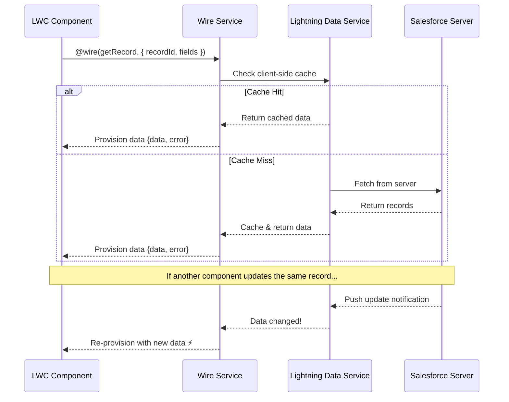
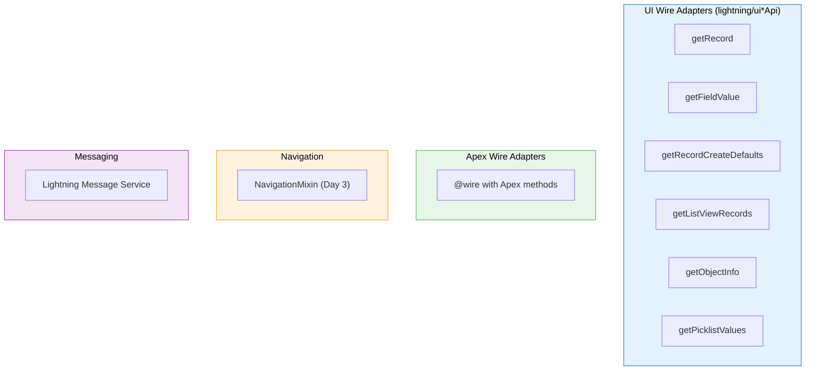
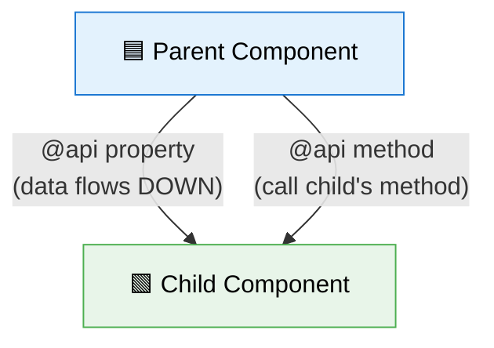
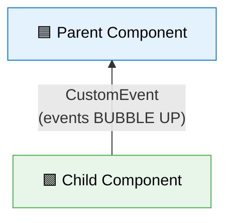
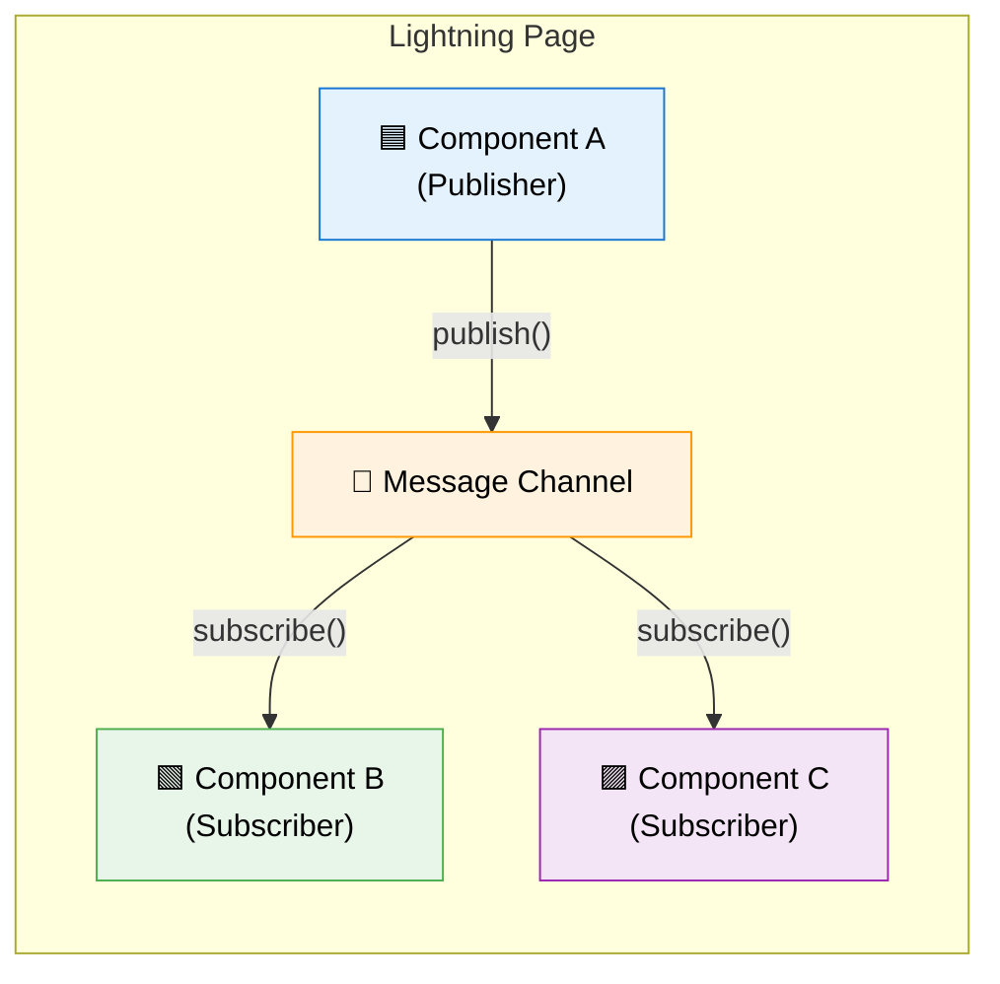

# 🔵 Day 2 — Data & Events: Connecting Components to Salesforce

> **Today's Goal**: Master the Wire Service, Apex integration, component communication patterns, and Lightning forms — the skills that make LWC components truly useful.

---

## 📚 Table of Contents

1. [Wire Service Deep-Dive](#1--wire-service-deep-dive)
2. [Wire to Property vs Wire to Function](#2--wire-to-property-vs-wire-to-function)
3. [Key Wire Adapters](#3--key-wire-adapters)
4. [Imperative Apex Calls](#4--imperative-apex-calls)
5. [Error Handling Patterns](#5--error-handling-patterns)
6. [Parent-to-Child Communication](#6--parent-to-child-communication)
7. [Child-to-Parent Communication](#7--child-to-parent-communication-custom-events)
8. [Unrelated Component Communication](#8--unrelated-component-communication)
9. [All Communication Patterns Diagram](#9--all-communication-patterns-diagram)
10. [Lightning Record Forms](#10--lightning-record-forms)
11. [Working with SLDS](#11--working-with-slds)
12. [Key Takeaways](#-key-takeaways)

---

## 1. 🔌 Wire Service Deep-Dive

### What is the Wire Service?

The Wire Service is a **reactive data pipeline** that connects your LWC components to Salesforce data sources. Think of it like a live data cable — once you plug it in, data flows automatically and stays up to date.

### The Real-World Analogy

Imagine a **news ticker** on a TV channel:
- **Wire Service** = The news feed pipeline (Reuters, AP, etc.)
- **Wire Adapter** = The specific feed you're subscribed to (sports, politics, weather)
- **Your Component** = The TV screen displaying the ticker
- When news updates → the ticker automatically refreshes (reactive!)

### How Wire Service Works



### Key Characteristics of Wire Service

| Feature | Details |
|---|---|
| **Reactive** | Automatically re-fetches when parameters change |
| **Cached** | Uses Lightning Data Service cache (shared across components) |
| **Declarative** | You declare what data you need, not how to fetch it |
| **Read-only** | Wire provides read access; mutations need imperative calls |
| **Provisioned** | Data is "pushed" to your component, not "pulled" |

> [!IMPORTANT]
> Wire Service calls are **not controllable** — you can't decide when they fire. They fire:
> 1. When the component loads
> 2. When reactive parameters (`$paramName`) change
> 3. When cached data is updated by another component

---

## 2. ⚖️ Wire to Property vs Wire to Function

### Wire to Property (Simpler)

```javascript
import { LightningElement, wire } from 'lwc';
import getContacts from '@salesforce/apex/ContactController.getContacts';

export default class ContactList extends LightningElement {
    // Wire directly to a property
    @wire(getContacts)
    contacts;
    // contacts.data → array of contacts (if success)
    // contacts.error → error object (if failure)
}
```

```html
<template>
    <template lwc:if={contacts.data}>
        <template for:each={contacts.data} for:item="contact">
            <p key={contact.Id}>{contact.Name}</p>
        </template>
    </template>
    <template lwc:elseif={contacts.error}>
        <p>Error: {contacts.error.body.message}</p>
    </template>
</template>
```

### Wire to Function (More Control)

```javascript
import { LightningElement, wire } from 'lwc';
import getContacts from '@salesforce/apex/ContactController.getContacts';

export default class ContactList extends LightningElement {
    contactList = [];
    error;
    isLoading = true;

    // Wire to a function — you get full control over data handling
    @wire(getContacts)
    wiredContacts({ error, data }) {
        this.isLoading = false;
        if (data) {
            // Transform, filter, or process the data
            this.contactList = data.map(contact => ({
                ...contact,
                initials: contact.Name.charAt(0).toUpperCase()
            }));
            this.error = undefined;
        } else if (error) {
            this.error = error;
            this.contactList = [];
        }
    }
}
```

### Comparison Table

| Feature | Wire to Property | Wire to Function |
|---|---|---|
| **Syntax** | `@wire(adapter) propName;` | `@wire(adapter) methodName({data, error}) {}` |
| **Data access** | `this.propName.data` | Direct in function params |
| **Error access** | `this.propName.error` | Direct in function params |
| **Data transformation** | ❌ Not possible | ✅ Can process/transform data |
| **Loading state** | Manually check `!data && !error` | Set your own flags |
| **Simplicity** | ✅ Simpler | More code but more flexible |
| **Re-fetch behavior** | Auto-updates property | Re-calls function |
| **Use case** | Display data as-is | Need to process, sort, filter |

> [!TIP]
> **Interview Tip**: "When would you wire to a function vs a property?"
> - **Property**: When you just need to display the data as-is
> - **Function**: When you need to transform data, merge multiple sources, update related state, or handle complex loading/error states

---

## 3. 🔧 Key Wire Adapters

### Wire Adapter Categories



### `getRecord` — Fetch a Single Record

```javascript
import { LightningElement, api, wire } from 'lwc';
import { getRecord, getFieldValue } from 'lightning/uiRecordApi';
import NAME_FIELD from '@salesforce/schema/Contact.Name';
import EMAIL_FIELD from '@salesforce/schema/Contact.Email';
import PHONE_FIELD from '@salesforce/schema/Contact.Phone';
import ACCOUNT_NAME_FIELD from '@salesforce/schema/Contact.Account.Name';

const FIELDS = [NAME_FIELD, EMAIL_FIELD, PHONE_FIELD, ACCOUNT_NAME_FIELD];

export default class ContactDetail extends LightningElement {
    @api recordId; // Automatically populated on record pages

    @wire(getRecord, { recordId: '$recordId', fields: FIELDS })
    contact;

    // Use getFieldValue helper to extract field values
    get name() {
        return getFieldValue(this.contact.data, NAME_FIELD);
    }

    get email() {
        return getFieldValue(this.contact.data, EMAIL_FIELD);
    }

    get phone() {
        return getFieldValue(this.contact.data, PHONE_FIELD);
    }

    get accountName() {
        return getFieldValue(this.contact.data, ACCOUNT_NAME_FIELD);
    }
}
```

> [!NOTE]
> The `$` prefix in `'$recordId'` makes the parameter **reactive**. When `recordId` changes, the wire automatically re-fetches. Without `$`, the value is static and set only once.

### `getFieldValue` vs `getFieldDisplayValue`

| Helper | Returns | Example |
|---|---|---|
| `getFieldValue` | Raw value | `1000000` |
| `getFieldDisplayValue` | Formatted for display | `$1,000,000.00` |

```javascript
import { getFieldValue, getFieldDisplayValue } from 'lightning/uiRecordApi';
import REVENUE_FIELD from '@salesforce/schema/Account.AnnualRevenue';

// Raw value: 1000000
getFieldValue(this.account.data, REVENUE_FIELD);

// Display value: "$1,000,000.00"
getFieldDisplayValue(this.account.data, REVENUE_FIELD);
```

### `getObjectInfo` — Object Metadata

```javascript
import { LightningElement, wire } from 'lwc';
import { getObjectInfo } from 'lightning/uiObjectInfoApi';
import ACCOUNT_OBJECT from '@salesforce/schema/Account';

export default class ObjectInfoDemo extends LightningElement {
    @wire(getObjectInfo, { objectApiName: ACCOUNT_OBJECT })
    objectInfo;

    get defaultRecordTypeId() {
        if (this.objectInfo.data) {
            return this.objectInfo.data.defaultRecordTypeId;
        }
        return '';
    }
}
```

### `getPicklistValues` — Picklist Options

```javascript
import { LightningElement, wire } from 'lwc';
import { getPicklistValues } from 'lightning/uiObjectInfoApi';
import INDUSTRY_FIELD from '@salesforce/schema/Account.Industry';

export default class PicklistDemo extends LightningElement {
    @wire(getPicklistValues, {
        recordTypeId: '012000000000000AAA', // Default record type
        fieldApiName: INDUSTRY_FIELD
    })
    industryOptions;
}
```

```html
<template>
    <lightning-combobox
        label="Industry"
        options={industryOptions.data.values}
        lwc:if={industryOptions.data}>
    </lightning-combobox>
</template>
```

---

## 4. ⚡ Imperative Apex Calls

### When to Use Imperative vs Wire

| Scenario | Use Wire | Use Imperative |
|---|---|---|
| Fetch data on load | ✅ | ⚠️ Possible but unnecessary |
| Fetch on button click | ❌ | ✅ |
| Create/Update/Delete records | ❌ | ✅ |
| Need precise control over timing | ❌ | ✅ |
| Data should auto-refresh | ✅ | ❌ |
| Need to chain multiple calls | ❌ | ✅ |

### Apex Controller

```java
// ContactController.cls
public with sharing class ContactController {

    // cacheable=true → can be used with @wire
    @AuraEnabled(cacheable=true)
    public static List<Contact> getContacts() {
        return [
            SELECT Id, Name, Email, Phone
            FROM Contact
            ORDER BY Name
            LIMIT 10
        ];
    }

    // cacheable=false (default) → imperative only, can do DML
    @AuraEnabled
    public static Contact createContact(String name, String email) {
        Contact c = new Contact(LastName = name, Email = email);
        insert c;
        return c;
    }

    // With parameters
    @AuraEnabled(cacheable=true)
    public static List<Contact> searchContacts(String searchTerm) {
        String searchKey = '%' + searchTerm + '%';
        return [
            SELECT Id, Name, Email
            FROM Contact
            WHERE Name LIKE :searchKey
            LIMIT 20
        ];
    }
}
```

> [!IMPORTANT]
> `@AuraEnabled(cacheable=true)` means:
> - Data is **cached** on the client side
> - Can be used with `@wire` adapter
> - **Cannot perform DML** (insert, update, delete) in the method
> - Data may be **stale** (use `refreshApex()` to force refresh)
>
> `@AuraEnabled` (without cacheable) means:
> - **Not cached** — fresh call every time
> - Can **only** be called imperatively
> - **Can perform DML**

### Imperative Call with async/await

```javascript
import { LightningElement } from 'lwc';
import createContact from '@salesforce/apex/ContactController.createContact';
import { ShowToastEvent } from 'lightning/platformShowToastEvent';

export default class ContactCreator extends LightningElement {
    name = '';
    email = '';
    isLoading = false;

    handleNameChange(event) {
        this.name = event.target.value;
    }

    handleEmailChange(event) {
        this.email = event.target.value;
    }

    async handleCreate() {
        this.isLoading = true;
        try {
            const result = await createContact({
                name: this.name,
                email: this.email
            });

            // Show success toast
            this.dispatchEvent(
                new ShowToastEvent({
                    title: 'Success',
                    message: `Contact "${result.Name}" created!`,
                    variant: 'success'
                })
            );

            // Reset form
            this.name = '';
            this.email = '';
        } catch (error) {
            this.dispatchEvent(
                new ShowToastEvent({
                    title: 'Error',
                    message: error.body.message,
                    variant: 'error'
                })
            );
        } finally {
            this.isLoading = false;
        }
    }
}
```

### Refreshing Wired Data After DML

```javascript
import { LightningElement, wire } from 'lwc';
import { refreshApex } from '@salesforce/apex';
import getContacts from '@salesforce/apex/ContactController.getContacts';
import createContact from '@salesforce/apex/ContactController.createContact';

export default class ContactManager extends LightningElement {
    wiredContactsResult; // Store the full wired result

    @wire(getContacts)
    wiredContacts(result) {
        this.wiredContactsResult = result; // Save for refreshApex
        const { data, error } = result;
        if (data) {
            this.contacts = data;
        }
    }

    async handleCreate() {
        try {
            await createContact({ name: 'New Contact', email: 'new@test.com' });

            // Force refresh the wired data
            await refreshApex(this.wiredContactsResult);
            // The wire function will be called again with fresh data!
        } catch (error) {
            console.error(error);
        }
    }
}
```

> [!WARNING]
> `refreshApex()` requires the **original wired result** object — not just the data. That's why we save `this.wiredContactsResult = result` in the wire function. Passing just `this.contacts` won't work!

---

## 5. 🛡️ Error Handling Patterns

### Error Structure in LWC

```javascript
// Wire/Apex errors have this structure:
{
    body: {
        message: "Error message string",
        statusCode: 400,
        // For Apex errors:
        exceptionType: "System.AuraHandledException",
        stackTrace: "..."
    },
    ok: false,
    status: 400,
    statusText: "Bad Request"
}
```

### Comprehensive Error Handling Pattern

```javascript
import { LightningElement, wire } from 'lwc';
import getContacts from '@salesforce/apex/ContactController.getContacts';
import { ShowToastEvent } from 'lightning/platformShowToastEvent';

export default class RobustComponent extends LightningElement {
    contacts = [];
    error;
    isLoading = true;

    @wire(getContacts)
    wiredContacts({ error, data }) {
        this.isLoading = false;
        if (data) {
            this.contacts = data;
            this.error = undefined;
        } else if (error) {
            this.contacts = [];
            this.error = this.reduceErrors(error);
        }
    }

    // Utility: Extract error messages from any error shape
    reduceErrors(errors) {
        if (!Array.isArray(errors)) {
            errors = [errors];
        }

        return errors
            .filter(error => !!error)
            .map(error => {
                // UI API errors
                if (Array.isArray(error.body)) {
                    return error.body.map(e => e.message);
                }
                // Apex errors / standard errors
                if (error.body && typeof error.body.message === 'string') {
                    return error.body.message;
                }
                // JS errors
                if (typeof error.message === 'string') {
                    return error.message;
                }
                // Unknown shape
                return error.statusText || 'Unknown error';
            })
            .reduce((prev, curr) => prev.concat(curr), [])
            .join(', ');
    }

    // Show toast notification for errors
    showErrorToast(message) {
        this.dispatchEvent(
            new ShowToastEvent({
                title: 'Error',
                message: message,
                variant: 'error',
                mode: 'sticky' // Won't auto-dismiss
            })
        );
    }

    get hasError() {
        return !!this.error;
    }
}
```

```html
<template>
    <!-- Loading State -->
    <template lwc:if={isLoading}>
        <lightning-spinner alternative-text="Loading" size="medium"></lightning-spinner>
    </template>

    <!-- Error State -->
    <template lwc:elseif={hasError}>
        <div class="slds-notify slds-notify_alert slds-alert_error" role="alert">
            <p>{error}</p>
        </div>
    </template>

    <!-- Success State -->
    <template lwc:else>
        <template for:each={contacts} for:item="contact">
            <p key={contact.Id}>{contact.Name}</p>
        </template>
    </template>
</template>
```

---

## 6. 👆 Parent-to-Child Communication

### Pattern: Pass Data Down via `@api` Properties



#### Passing Data via `@api` Properties

```javascript
// childCard.js
import { LightningElement, api } from 'lwc';

export default class ChildCard extends LightningElement {
    @api title = 'Default Title';
    @api description;
    @api variant = 'default'; // 'default', 'highlight', 'error'

    get cardClass() {
        const baseClass = 'slds-card';
        const variantMap = {
            highlight: 'slds-theme_shade',
            error: 'slds-theme_error'
        };
        return `${baseClass} ${variantMap[this.variant] || ''}`;
    }
}
```

```html
<!-- parentComponent.html -->
<template>
    <c-child-card
        title="Account Summary"
        description={accountDescription}
        variant="highlight">
    </c-child-card>
</template>
```

> [!NOTE]
> Property names in JS use **camelCase** (`myTitle`), but in HTML they use **kebab-case** (`my-title`). LWC automatically converts between them.
> ```html
> <!-- HTML: kebab-case -->
> <c-child max-items="5" is-active></c-child>
> ```
> ```javascript
> // JS: camelCase
> @api maxItems;
> @api isActive;
> ```

#### Calling Child Methods via `@api`

```javascript
// childTimer.js
import { LightningElement, api } from 'lwc';

export default class ChildTimer extends LightningElement {
    seconds = 0;
    _interval;

    @api
    start() {
        this._interval = setInterval(() => {
            this.seconds++;
        }, 1000);
    }

    @api
    stop() {
        clearInterval(this._interval);
    }

    @api
    reset() {
        this.stop();
        this.seconds = 0;
    }
}
```

```javascript
// parentComponent.js
import { LightningElement } from 'lwc';

export default class ParentComponent extends LightningElement {
    handleStart() {
        // Access child via querySelector and call its public method
        this.template.querySelector('c-child-timer').start();
    }

    handleStop() {
        this.template.querySelector('c-child-timer').stop();
    }

    handleReset() {
        this.template.querySelector('c-child-timer').reset();
    }
}
```

```html
<!-- parentComponent.html -->
<template>
    <c-child-timer></c-child-timer>
    <lightning-button label="Start" onclick={handleStart}></lightning-button>
    <lightning-button label="Stop" onclick={handleStop}></lightning-button>
    <lightning-button label="Reset" onclick={handleReset}></lightning-button>
</template>
```

---

## 7. 📤 Child-to-Parent Communication (Custom Events)

### Pattern: Dispatch Events Up



### Creating and Dispatching Custom Events

```javascript
// contactTile.js (Child)
import { LightningElement, api } from 'lwc';

export default class ContactTile extends LightningElement {
    @api contact;

    handleSelect() {
        // Create a custom event with data
        const selectEvent = new CustomEvent('contactselect', {
            detail: {
                contactId: this.contact.Id,
                contactName: this.contact.Name
            },
            bubbles: false,    // Only reaches immediate parent
            composed: false    // Doesn't cross Shadow DOM boundary
        });

        // Dispatch the event
        this.dispatchEvent(selectEvent);
    }

    handleDelete() {
        const deleteEvent = new CustomEvent('contactdelete', {
            detail: { contactId: this.contact.Id }
        });
        this.dispatchEvent(deleteEvent);
    }
}
```

```html
<!-- contactTile.html (Child) -->
<template>
    <div class="slds-tile" onclick={handleSelect}>
        <h3>{contact.Name}</h3>
        <p>{contact.Email}</p>
        <lightning-button
            label="Delete"
            variant="destructive"
            onclick={handleDelete}>
        </lightning-button>
    </div>
</template>
```

### Listening to Custom Events in Parent

```javascript
// contactManager.js (Parent)
import { LightningElement } from 'lwc';

export default class ContactManager extends LightningElement {
    selectedContactId;
    selectedContactName;

    handleContactSelect(event) {
        // Access event data via event.detail
        this.selectedContactId = event.detail.contactId;
        this.selectedContactName = event.detail.contactName;
    }

    handleContactDelete(event) {
        const contactId = event.detail.contactId;
        // Call Apex to delete...
    }
}
```

```html
<!-- contactManager.html (Parent) -->
<template>
    <template for:each={contacts} for:item="contact">
        <!-- Event names: oncontactselect, oncontactdelete -->
        <!-- Convention: on + eventName (all lowercase) -->
        <c-contact-tile
            key={contact.Id}
            contact={contact}
            oncontactselect={handleContactSelect}
            oncontactdelete={handleContactDelete}>
        </c-contact-tile>
    </template>

    <template lwc:if={selectedContactName}>
        <p>Selected: {selectedContactName}</p>
    </template>
</template>
```

### Event Naming Conventions

| Aspect | Rule | Example |
|---|---|---|
| Event name in `CustomEvent` | lowercase, no hyphens | `'contactselect'` |
| Handler in parent HTML | `on` + event name | `oncontactselect={handler}` |
| Handler method name | `handle` + description | `handleContactSelect` |

> [!CAUTION]
> **Event names MUST be lowercase** with no special characters. These are INVALID:
> - ❌ `'contactSelect'` (no camelCase)
> - ❌ `'contact-select'` (no hyphens)
> - ❌ `'contact_select'` (no underscores)
> - ✅ `'contactselect'` (correct!)

### Event Bubbling and Composed

| Property | Default | Effect |
|---|---|---|
| `bubbles: false` | ✅ Default | Event only reaches the direct parent |
| `bubbles: true` | — | Event bubbles up through the DOM tree |
| `composed: false` | ✅ Default | Event doesn't cross Shadow DOM boundaries |
| `composed: true` | — | Event crosses Shadow DOM boundaries |

```javascript
// Event that ONLY the direct parent can hear (most common)
new CustomEvent('myevent', { bubbles: false, composed: false });

// Event that bubbles through the DOM tree AND across Shadow DOM
new CustomEvent('myevent', { bubbles: true, composed: true });
```

---

## 8. 📡 Unrelated Component Communication

### Lightning Message Service (LMS)

For components that have **no parent-child relationship** (e.g., a component on the sidebar and one in the main body), use Lightning Message Service.



#### Step 1: Create Message Channel

```xml
<!-- force-app/main/default/messageChannels/ContactSelected.messageChannel-meta.xml -->
<?xml version="1.0" encoding="UTF-8"?>
<LightningMessageChannel xmlns="http://soap.sforce.com/2006/04/metadata">
    <masterLabel>Contact Selected</masterLabel>
    <isExposed>true</isExposed>
    <description>Channel for contact selection events</description>
    <lightningMessageFields>
        <fieldName>contactId</fieldName>
        <description>The ID of the selected contact</description>
    </lightningMessageFields>
    <lightningMessageFields>
        <fieldName>contactName</fieldName>
        <description>The name of the selected contact</description>
    </lightningMessageFields>
</LightningMessageChannel>
```

#### Step 2: Publisher Component

```javascript
// contactPublisher.js
import { LightningElement, wire } from 'lwc';
import { publish, MessageContext } from 'lightning/messageService';
import CONTACT_SELECTED_CHANNEL from '@salesforce/messageChannel/ContactSelected__c';

export default class ContactPublisher extends LightningElement {
    @wire(MessageContext)
    messageContext;

    handleContactClick(event) {
        const payload = {
            contactId: event.target.dataset.id,
            contactName: event.target.dataset.name
        };

        publish(this.messageContext, CONTACT_SELECTED_CHANNEL, payload);
    }
}
```

#### Step 3: Subscriber Component

```javascript
// contactSubscriber.js
import { LightningElement, wire } from 'lwc';
import {
    subscribe,
    unsubscribe,
    APPLICATION_SCOPE,
    MessageContext
} from 'lightning/messageService';
import CONTACT_SELECTED_CHANNEL from '@salesforce/messageChannel/ContactSelected__c';

export default class ContactSubscriber extends LightningElement {
    subscription = null;
    selectedContactId;
    selectedContactName;

    @wire(MessageContext)
    messageContext;

    connectedCallback() {
        this.subscribeToMessageChannel();
    }

    disconnectedCallback() {
        this.unsubscribeFromMessageChannel();
    }

    subscribeToMessageChannel() {
        if (!this.subscription) {
            this.subscription = subscribe(
                this.messageContext,
                CONTACT_SELECTED_CHANNEL,
                (message) => this.handleMessage(message),
                { scope: APPLICATION_SCOPE } // Receive from ANY component on the page
            );
        }
    }

    unsubscribeFromMessageChannel() {
        unsubscribe(this.subscription);
        this.subscription = null;
    }

    handleMessage(message) {
        this.selectedContactId = message.contactId;
        this.selectedContactName = message.contactName;
    }
}
```

> [!TIP]
> **APPLICATION_SCOPE** means the subscriber receives messages from ANY publisher on the page, even in different DOM subtrees. Without it, the subscription is limited to the component's own DOM tree.

---

## 9. 🗺️ All Communication Patterns Diagram

```mermaid
graph TB
    subgraph Patterns["LWC Communication Patterns"]
        direction TB

        subgraph P2C["1️⃣ Parent → Child"]
            P1["Parent"] -->|"@api properties<br/>@api methods"| C1["Child"]
        end

        subgraph C2P["2️⃣ Child → Parent"]
            C2["Child"] -->|"CustomEvent<br/>this.dispatchEvent()"| P2["Parent"]
        end

        subgraph Sibling["3️⃣ Sibling ↔ Sibling"]
            S1["Sibling A"] -->|"Event UP"| S3["Common Parent"]
            S3 -->|"@api DOWN"| S2["Sibling B"]
        end

        subgraph Unrelated["4️⃣ Unrelated Components"]
            U1["Component X"] -->|"publish()"| MC["Message Channel"]
            MC -->|"subscribe()"| U2["Component Y"]
        end
    end

    style P2C fill:#e3f2fd,stroke:#1976d2,color:#000
    style C2P fill:#e8f5e9,stroke:#4caf50,color:#000
    style Sibling fill:#fff3e0,stroke:#ff9800,color:#000
    style Unrelated fill:#f3e5f5,stroke:#9c27b0,color:#000
```



### Quick Reference: Choosing the Right Pattern

| Relationship | Pattern | Mechanism |
|---|---|---|
| Parent → Child (data) | Props down | `@api` property |
| Parent → Child (action) | Call method | `@api` method + `querySelector` |
| Child → Parent | Events up | `CustomEvent` + `dispatchEvent` |
| Sibling → Sibling | Events up, props down | Event to parent, parent passes to sibling via `@api` |
| Unrelated → Unrelated | Message Channel | Lightning Message Service (LMS) |
| Any → Any (simple) | Pub/Sub | Custom pubsub module (legacy, prefer LMS) |

---

## 10. 📝 Lightning Record Forms

LWC provides three form components that make it easy to work with Salesforce records without writing Apex.

### Comparison Table

| Feature | `lightning-record-form` | `lightning-record-edit-form` | `lightning-record-view-form` |
|---|---|---|---|
| **Purpose** | View + Edit (auto-switch) | Custom edit layout | Custom view layout |
| **Customization** | Low (auto-layout) | High (full control) | High (full control) |
| **Mode** | `view`, `edit`, `readonly` | Always edit | Always view |
| **Submit handling** | Built-in save button | Custom submit button | N/A |
| **Layout control** | Automatic | `lightning-input-field` | `lightning-output-field` |
| **Use case** | Quick forms | Complex edit forms | Custom record displays |

### `lightning-record-form` — The Quick Solution

```html
<template>
    <lightning-record-form
        record-id={recordId}
        object-api-name="Contact"
        fields={fields}
        mode="edit"
        onsuccess={handleSuccess}
        onerror={handleError}
        columns="2">
    </lightning-record-form>
</template>
```

```javascript
import { LightningElement, api } from 'lwc';
import NAME_FIELD from '@salesforce/schema/Contact.Name';
import EMAIL_FIELD from '@salesforce/schema/Contact.Email';
import PHONE_FIELD from '@salesforce/schema/Contact.Phone';
import { ShowToastEvent } from 'lightning/platformShowToastEvent';

export default class QuickContactForm extends LightningElement {
    @api recordId;

    fields = [NAME_FIELD, EMAIL_FIELD, PHONE_FIELD];

    handleSuccess(event) {
        this.dispatchEvent(
            new ShowToastEvent({
                title: 'Success',
                message: 'Contact updated!',
                variant: 'success'
            })
        );
    }

    handleError(event) {
        console.error('Error:', event.detail);
    }
}
```

### `lightning-record-edit-form` — Full Control

```html
<template>
    <lightning-record-edit-form
        record-id={recordId}
        object-api-name="Contact"
        onsuccess={handleSuccess}
        onerror={handleError}>

        <!-- Custom layout with sections -->
        <div class="slds-grid slds-wrap slds-gutters">
            <div class="slds-col slds-size_1-of-2">
                <lightning-input-field field-name="FirstName"></lightning-input-field>
                <lightning-input-field field-name="LastName"></lightning-input-field>
            </div>
            <div class="slds-col slds-size_1-of-2">
                <lightning-input-field field-name="Email"></lightning-input-field>
                <lightning-input-field field-name="Phone"></lightning-input-field>
            </div>
        </div>

        <!-- Custom buttons -->
        <div class="slds-m-top_medium">
            <lightning-button
                type="submit"
                variant="brand"
                label="Save Contact">
            </lightning-button>
            <lightning-button
                label="Cancel"
                onclick={handleCancel}
                class="slds-m-left_small">
            </lightning-button>
        </div>
    </lightning-record-edit-form>
</template>
```

### `lightning-record-view-form` — Custom Display

```html
<template>
    <lightning-record-view-form
        record-id={recordId}
        object-api-name="Contact">

        <div class="slds-grid slds-wrap">
            <div class="slds-col slds-size_1-of-2">
                <lightning-output-field field-name="Name"></lightning-output-field>
                <lightning-output-field field-name="Email"></lightning-output-field>
            </div>
            <div class="slds-col slds-size_1-of-2">
                <lightning-output-field field-name="Phone"></lightning-output-field>
                <lightning-output-field field-name="Account.Name"></lightning-output-field>
            </div>
        </div>
    </lightning-record-view-form>
</template>
```

### Creating New Records (No recordId)

```html
<!-- Omit record-id to create a new record -->
<template>
    <lightning-record-form
        object-api-name="Contact"
        fields={fields}
        onsuccess={handleSuccess}>
    </lightning-record-form>
</template>
```

> [!TIP]
> **Decision Guide for Forms:**
> - Need a quick form with minimal code? → `lightning-record-form`
> - Need custom layout, validation, or prepopulated fields? → `lightning-record-edit-form`
> - Need a custom read-only display? → `lightning-record-view-form`
> - Need complete control over every field? → Build custom inputs with imperative Apex

---

## 11. 🎨 Working with SLDS

### SLDS Grid System

```html
<template>
    <!-- 12-column grid system -->
    <div class="slds-grid slds-wrap slds-gutters">
        <!-- Full width on mobile, half on larger screens -->
        <div class="slds-col slds-size_1-of-1 slds-medium-size_1-of-2">
            <lightning-card title="Card 1">
                <p class="slds-p-around_medium">Content</p>
            </lightning-card>
        </div>
        <div class="slds-col slds-size_1-of-1 slds-medium-size_1-of-2">
            <lightning-card title="Card 2">
                <p class="slds-p-around_medium">Content</p>
            </lightning-card>
        </div>
    </div>
</template>
```

### Common SLDS Patterns

```html
<!-- Page Header -->
<div class="slds-page-header">
    <div class="slds-page-header__row">
        <div class="slds-page-header__col-title">
            <div class="slds-media">
                <div class="slds-media__figure">
                    <lightning-icon icon-name="standard:contact" size="large"></lightning-icon>
                </div>
                <div class="slds-media__body">
                    <h1 class="slds-page-header__title">Contacts</h1>
                    <p class="slds-page-header__meta-text">10 items • Updated 5 minutes ago</p>
                </div>
            </div>
        </div>
    </div>
</div>

<!-- Data Table -->
<lightning-datatable
    key-field="Id"
    data={contacts}
    columns={columns}
    onrowaction={handleRowAction}>
</lightning-datatable>
```

### Lightning Datatable Example

```javascript
import { LightningElement, wire } from 'lwc';
import getContacts from '@salesforce/apex/ContactController.getContacts';

const COLUMNS = [
    { label: 'Name', fieldName: 'Name', type: 'text', sortable: true },
    { label: 'Email', fieldName: 'Email', type: 'email' },
    { label: 'Phone', fieldName: 'Phone', type: 'phone' },
    {
        type: 'action',
        typeAttributes: {
            rowActions: [
                { label: 'Edit', name: 'edit' },
                { label: 'Delete', name: 'delete' }
            ]
        }
    }
];

export default class ContactTable extends LightningElement {
    columns = COLUMNS;

    @wire(getContacts)
    contacts;

    handleRowAction(event) {
        const action = event.detail.action;
        const row = event.detail.row;

        switch (action.name) {
            case 'edit':
                this.editContact(row.Id);
                break;
            case 'delete':
                this.deleteContact(row.Id);
                break;
        }
    }
}
```

---

## 📌 Key Takeaways

| # | Key Point |
|---|---|
| 1 | The **Wire Service** is a reactive pipeline — data is provisioned automatically, you can't control when it fires |
| 2 | **Wire to property** for simple display; **wire to function** for data transformation |
| 3 | `$paramName` makes wire parameters **reactive** (re-fetch on change) |
| 4 | `@AuraEnabled(cacheable=true)` = wire-compatible, cached, NO DML |
| 5 | `@AuraEnabled` (no cacheable) = imperative only, fresh calls, CAN do DML |
| 6 | Use `refreshApex(wiredResult)` to force-refresh cached wire data after DML |
| 7 | **Parent→Child**: `@api` properties (data) and `@api` methods (actions) |
| 8 | **Child→Parent**: `CustomEvent` with `dispatchEvent()` — events flow UP |
| 9 | Event names must be **all lowercase**, no hyphens or underscores |
| 10 | **Unrelated components**: Use Lightning Message Service (publish/subscribe pattern) |
| 11 | `APPLICATION_SCOPE` in LMS means "receive from any component on the page" |
| 12 | `lightning-record-form` = quick auto-layout; `-edit-form` = custom edit; `-view-form` = custom view |
| 13 | Omit `record-id` on forms to create new records |
| 14 | Always handle **both data and error** states in wire results |
| 15 | Use the `reduceErrors` utility pattern — error shapes vary between UI API and Apex |

---

**← Previous: [Day 1: Fundamentals](../day-1-fundamentals/README.md)** | **Next → [Day 3: Advanced & Interview](../day-3-advanced-and-interview/README.md)** 🟣
