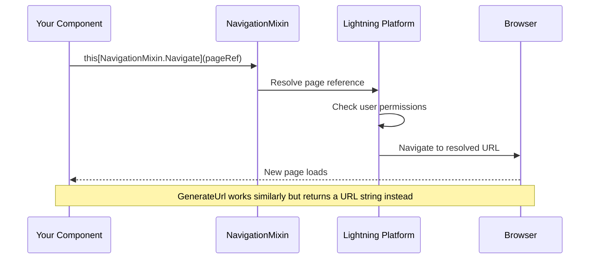
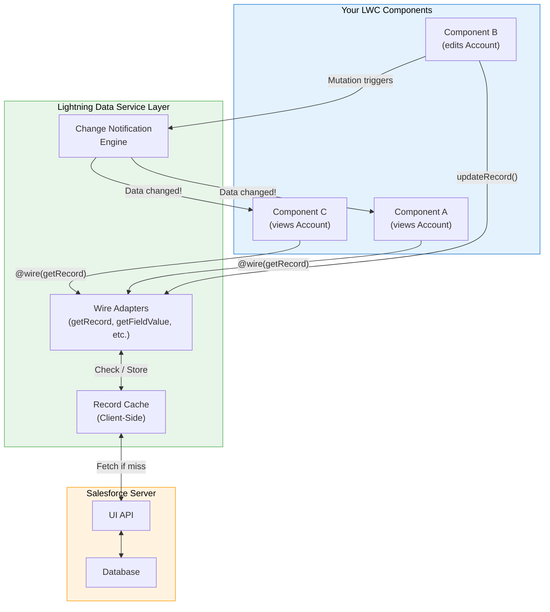
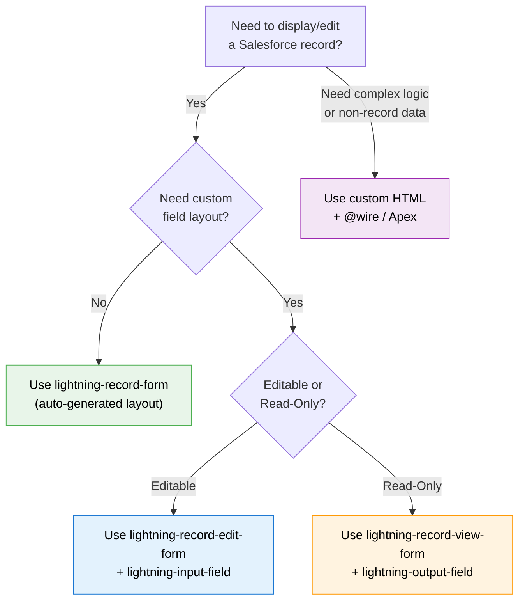
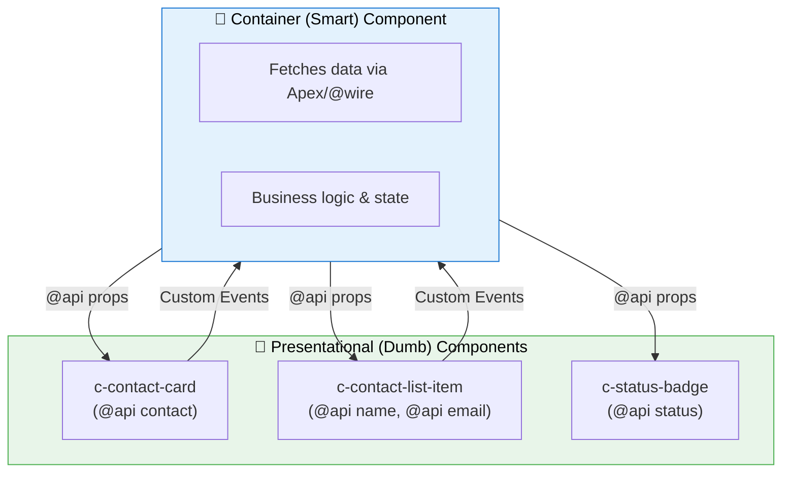
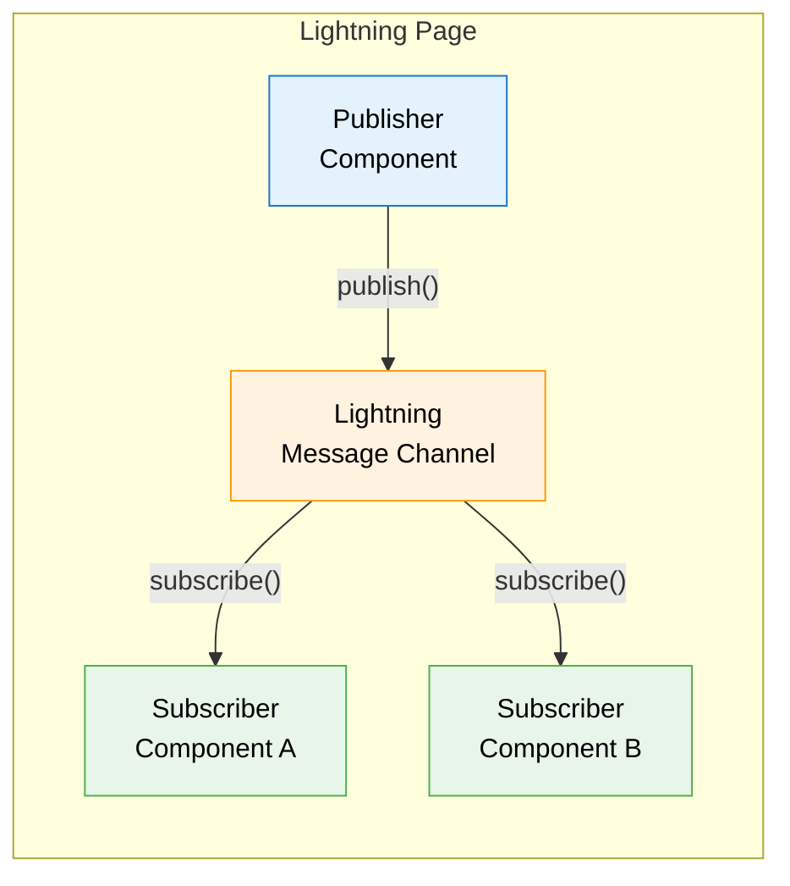

# 🔴 Day 3 — Advanced Topics & Interview Prep: Becoming Production-Ready

> **Today's Goal**: Master navigation, Lightning Data Service architecture, performance optimization, testing, security, and design patterns — then tie all 3 days together for interview success.

---

## 📚 Table of Contents

1. [NavigationMixin — Page Navigation](#1--navigationmixin--page-navigation)
2. [Lightning Data Service (LDS) Architecture](#2--lightning-data-service-lds-architecture)
3. [Record Forms Comparison](#3--record-forms-comparison)
4. [Performance Best Practices](#4--performance-best-practices)
5. [Jest Testing for LWC](#5--jest-testing-for-lwc)
6. [Security: Locker Service vs Lightning Web Security](#6--security-locker-service-vs-lightning-web-security)
7. [Common Design Patterns in LWC](#7--common-design-patterns-in-lwc)
8. [3-Day Quick Revision Summary](#8--3-day-quick-revision-summary)
9. [Mini Mock Interview — 10 Rapid-Fire Q&A](#9--mini-mock-interview--10-rapid-fire-qa)
10. [Key Takeaways](#-key-takeaways)

---

## 1. 🧭 NavigationMixin — Page Navigation

### What is NavigationMixin?

`NavigationMixin` is a JavaScript mixin provided by the Lightning platform that adds navigation capabilities to your LWC. Think of it as a **GPS system** for your component — you tell it _where_ you want to go (a record page, a list view, an external URL), and it handles _how_ to get there.

### How NavigationMixin Works



### Setup — Extending NavigationMixin

```javascript
// Always extend NavigationMixin AROUND LightningElement
import { LightningElement } from 'lwc';
import { NavigationMixin } from 'lightning/navigation';

// NavigationMixin wraps LightningElement — it's a decorator pattern
export default class MyNavigator extends NavigationMixin(LightningElement) {
    // Now you have access to:
    // this[NavigationMixin.Navigate](pageReference, replace)
    // this[NavigationMixin.GenerateUrl](pageReference)
}
```

> [!IMPORTANT]
> You MUST extend `NavigationMixin(LightningElement)`, not just `LightningElement`. The mixin adds the `Navigate` and `GenerateUrl` methods to your class. Forgetting this is a very common mistake.

### Example 1: Navigate to a Record Page

```javascript
import { LightningElement, api } from 'lwc';
import { NavigationMixin } from 'lightning/navigation';

export default class RecordNavigator extends NavigationMixin(LightningElement) {
    @api recordId;

    navigateToRecord() {
        this[NavigationMixin.Navigate]({
            type: 'standard__recordPage',
            attributes: {
                recordId: this.recordId,
                objectApiName: 'Account',
                actionName: 'view' // 'view', 'edit', or 'clone'
            }
        });
    }
}
```

```html
<template>
    <lightning-button
        label="View Account"
        onclick={navigateToRecord}>
    </lightning-button>
</template>
```

### Example 2: Navigate to a List View

```javascript
navigateToListView() {
    this[NavigationMixin.Navigate]({
        type: 'standard__objectPage',
        attributes: {
            objectApiName: 'Contact',
            actionName: 'list'
        },
        state: {
            filterName: 'Recent' // 'All', 'Recent', or a custom list view ID
        }
    });
}
```

### Example 3: Navigate to a Custom LWC Page (Named Page / Tab)

```javascript
navigateToCustomPage() {
    this[NavigationMixin.Navigate]({
        type: 'standard__navItemPage',
        attributes: {
            apiName: 'My_Custom_Tab' // API name of the tab
        }
    });
}
```

### Example 4: Navigate to an External URL

```javascript
navigateToWebUrl() {
    this[NavigationMixin.Navigate]({
        type: 'standard__webPage',
        attributes: {
            url: 'https://developer.salesforce.com'
        }
    });
}
```

### Example 5: Generate a URL (Without Navigating)

```javascript
recordUrl;

connectedCallback() {
    this[NavigationMixin.GenerateUrl]({
        type: 'standard__recordPage',
        attributes: {
            recordId: this.recordId,
            actionName: 'view'
        }
    }).then(url => {
        this.recordUrl = url; // e.g., "/lightning/r/Account/001xx000003DGb2/view"
    });
}
```

```html
<template>
    <a href={recordUrl}>Open Record</a>
</template>
```

### Example 6: Navigate to a Related List

```javascript
navigateToRelatedList() {
    this[NavigationMixin.Navigate]({
        type: 'standard__recordRelationshipPage',
        attributes: {
            recordId: this.recordId,
            objectApiName: 'Account',
            relationshipApiName: 'Contacts',
            actionName: 'view'
        }
    });
}
```

### Page Reference Types — Quick Reference

| Type | Use Case | Key Attributes |
|---|---|---|
| `standard__recordPage` | View/Edit/Clone a record | `recordId`, `objectApiName`, `actionName` |
| `standard__objectPage` | List views, new record | `objectApiName`, `actionName` |
| `standard__navItemPage` | Custom tabs | `apiName` |
| `standard__webPage` | External URLs | `url` |
| `standard__namedPage` | Standard pages (home, chatter) | `pageName` |
| `standard__recordRelationshipPage` | Related lists | `recordId`, `relationshipApiName` |
| `standard__component` | Navigate to Aura component | `componentName` |

> [!TIP]
> **Interview Tip**: "What are the two methods NavigationMixin provides?"
> 1. `Navigate(pageReference)` — Navigates to the page
> 2. `GenerateUrl(pageReference)` — Returns a Promise that resolves to a URL string (useful for `<a href>` tags)

---

## 2. 💾 Lightning Data Service (LDS) Architecture

### What is Lightning Data Service?

Lightning Data Service (LDS) is a **shared data layer** that sits between your components and the Salesforce server. Think of it as a **smart library** — when you need a book (record), it first checks if the book is already on the shelf (cache). If it is, you get it instantly. If not, it fetches it from the warehouse (server) and puts a copy on the shelf for next time.

### LDS Architecture Diagram



### Key Benefits of LDS

| Benefit | Explanation |
|---|---|
| **Shared Cache** | All components share the same cached data — no duplicate server calls |
| **Auto-Sync** | When one component updates a record, all other components viewing that record auto-refresh |
| **No Apex Needed** | CRUD operations without writing a single line of Apex |
| **FLS & CRUD Enforced** | Automatically respects Field-Level Security and CRUD permissions |
| **Offline Support** | Works with Salesforce mobile offline capabilities |

### LDS CRUD Operations

```javascript
import { LightningElement, api, wire } from 'lwc';
import { getRecord, updateRecord, createRecord, deleteRecord }
    from 'lightning/uiRecordApi';
import { ShowToastEvent } from 'lightning/platformShowToastEvent';
import NAME_FIELD from '@salesforce/schema/Account.Name';
import INDUSTRY_FIELD from '@salesforce/schema/Account.Industry';
import ACCOUNT_OBJECT from '@salesforce/schema/Account';

export default class LdsDemo extends NavigationMixin(LightningElement) {
    @api recordId;

    // READ — Wire getRecord
    @wire(getRecord, { recordId: '$recordId', fields: [NAME_FIELD, INDUSTRY_FIELD] })
    account;

    // UPDATE — Imperative updateRecord
    async handleUpdate() {
        const fields = {};
        fields.Id = this.recordId;
        fields[NAME_FIELD.fieldApiName] = 'Updated Account Name';

        try {
            await updateRecord({ fields });
            this.dispatchEvent(
                new ShowToastEvent({
                    title: 'Success',
                    message: 'Account updated!',
                    variant: 'success'
                })
            );
            // No need to manually refresh — LDS cache auto-notifies!
        } catch (error) {
            this.dispatchEvent(
                new ShowToastEvent({
                    title: 'Error',
                    message: error.body.message,
                    variant: 'error'
                })
            );
        }
    }

    // CREATE — Imperative createRecord
    async handleCreate() {
        const fields = {};
        fields[NAME_FIELD.fieldApiName] = 'New Account';
        fields[INDUSTRY_FIELD.fieldApiName] = 'Technology';

        try {
            const result = await createRecord({
                apiName: ACCOUNT_OBJECT.objectApiName,
                fields
            });
            console.log('Created record Id:', result.id);
        } catch (error) {
            console.error('Error:', error);
        }
    }

    // DELETE — Imperative deleteRecord
    async handleDelete() {
        try {
            await deleteRecord(this.recordId);
            this.dispatchEvent(
                new ShowToastEvent({
                    title: 'Deleted',
                    message: 'Record deleted',
                    variant: 'success'
                })
            );
        } catch (error) {
            console.error('Error:', error);
        }
    }
}
```

> [!NOTE]
> With LDS, after you call `updateRecord()`, any other component on the page that's wired to the same record will **automatically receive the updated data**. You don't need `refreshApex()` — LDS handles it through its cache notification engine.

---

## 3. 📋 Record Forms Comparison

LWC provides three base components for working with records — each offering a different level of control.

### Comparison Table

| Feature | `lightning-record-form` | `lightning-record-edit-form` | `lightning-record-view-form` |
|---|---|---|---|
| **Purpose** | View + Edit (auto-toggle) | Custom editable form | Custom read-only display |
| **Layout** | Auto-generated | You build it | You build it |
| **Customization** | ❌ Minimal | ✅ Full control | ✅ Full control |
| **Uses LDS?** | ✅ Yes | ✅ Yes | ✅ Yes |
| **Apex Needed?** | ❌ No | ❌ No | ❌ No |
| **Submit Handling** | Auto | Custom `onsubmit` | N/A (read-only) |
| **Validation** | Built-in | Custom + built-in | N/A |
| **Error Handling** | Built-in | Custom `onerror` | Built-in |
| **Child Component** | None | `lightning-input-field` | `lightning-output-field` |
| **Best For** | Quick prototyping | Complex edit scenarios | Custom read layouts |

### `lightning-record-form` — The Quick & Easy Option

```html
<template>
    <!-- Auto-generates both view and edit modes -->
    <lightning-record-form
        record-id={recordId}
        object-api-name="Contact"
        fields={fields}
        mode="view"
        columns="2"
        onsuccess={handleSuccess}
        onerror={handleError}>
    </lightning-record-form>
</template>
```

```javascript
import { LightningElement, api } from 'lwc';
import NAME_FIELD from '@salesforce/schema/Contact.Name';
import EMAIL_FIELD from '@salesforce/schema/Contact.Email';
import PHONE_FIELD from '@salesforce/schema/Contact.Phone';

export default class QuickForm extends LightningElement {
    @api recordId;
    fields = [NAME_FIELD, EMAIL_FIELD, PHONE_FIELD];

    handleSuccess(event) {
        console.log('Record saved:', event.detail.id);
    }

    handleError(event) {
        console.error('Save error:', event.detail);
    }
}
```

### `lightning-record-edit-form` — Full Control Over Editing

```html
<template>
    <lightning-record-edit-form
        record-id={recordId}
        object-api-name="Contact"
        onsuccess={handleSuccess}
        onsubmit={handleSubmit}
        onerror={handleError}>

        <!-- Custom layout with individual fields -->
        <lightning-messages></lightning-messages>

        <div class="slds-grid slds-wrap">
            <div class="slds-col slds-size_1-of-2 slds-p-horizontal_small">
                <lightning-input-field field-name="FirstName"></lightning-input-field>
                <lightning-input-field field-name="LastName"></lightning-input-field>
            </div>
            <div class="slds-col slds-size_1-of-2 slds-p-horizontal_small">
                <lightning-input-field field-name="Email"></lightning-input-field>
                <lightning-input-field field-name="Phone"></lightning-input-field>
            </div>
        </div>

        <!-- Custom section heading -->
        <h3 class="slds-text-heading_small slds-m-top_medium">Address Info</h3>
        <lightning-input-field field-name="MailingCity"></lightning-input-field>
        <lightning-input-field field-name="MailingState"></lightning-input-field>

        <div class="slds-m-top_medium">
            <lightning-button variant="brand" type="submit" label="Save"></lightning-button>
            <lightning-button label="Cancel" onclick={handleCancel}
                class="slds-m-left_x-small"></lightning-button>
        </div>
    </lightning-record-edit-form>
</template>
```

```javascript
import { LightningElement, api } from 'lwc';
import { ShowToastEvent } from 'lightning/platformShowToastEvent';

export default class EditForm extends LightningElement {
    @api recordId;

    handleSubmit(event) {
        event.preventDefault(); // Stop default submission
        const fields = event.detail.fields;

        // Modify fields before submission
        fields.Description = 'Updated via LWC on ' + new Date().toISOString();

        // Resume submission with modified fields
        this.template.querySelector('lightning-record-edit-form').submit(fields);
    }

    handleSuccess(event) {
        this.dispatchEvent(
            new ShowToastEvent({
                title: 'Success',
                message: 'Contact updated successfully',
                variant: 'success'
            })
        );
    }

    handleError(event) {
        console.error('Error:', JSON.stringify(event.detail));
    }

    handleCancel() {
        // Reset form fields to their original values
        const inputFields = this.template.querySelectorAll('lightning-input-field');
        inputFields.forEach(field => field.reset());
    }
}
```

### `lightning-record-view-form` — Custom Read-Only Display

```html
<template>
    <lightning-record-view-form
        record-id={recordId}
        object-api-name="Contact">

        <div class="slds-grid slds-wrap">
            <div class="slds-col slds-size_1-of-2">
                <lightning-output-field field-name="Name"></lightning-output-field>
                <lightning-output-field field-name="Email"></lightning-output-field>
            </div>
            <div class="slds-col slds-size_1-of-2">
                <lightning-output-field field-name="Phone"></lightning-output-field>
                <lightning-output-field field-name="Account.Name"></lightning-output-field>
            </div>
        </div>
    </lightning-record-view-form>
</template>
```

### Decision Flowchart: Which Form to Use?



---

## 4. ⚡ Performance Best Practices

### The Performance Mindset

Think of your LWC component as a race car. Every unnecessary DOM element is extra weight. Every re-render is a pit stop. Your goal is to make the car as light and fast as possible.

### 4.1 Lazy Loading Components

Load components only when they're needed — not all at once on page load.

```javascript
import { LightningElement } from 'lwc';

export default class LazyLoadDemo extends LightningElement {
    showExpensiveComponent = false;

    handleShowDetails() {
        // The heavy component only loads when the user clicks
        this.showExpensiveComponent = true;
    }
}
```

```html
<template>
    <lightning-button label="Show Analytics" onclick={handleShowDetails}>
    </lightning-button>

    <!-- Component is only created when showExpensiveComponent is true -->
    <template lwc:if={showExpensiveComponent}>
        <c-heavy-analytics-dashboard></c-heavy-analytics-dashboard>
    </template>
</template>
```

### 4.2 Render Optimization — Avoid Unnecessary Re-renders

```javascript
import { LightningElement, track } from 'lwc';

export default class OptimizedComponent extends LightningElement {
    // ❌ BAD: Creating new objects on every getter call forces re-render
    get badItems() {
        return this.rawItems.map(item => ({ ...item, label: item.name }));
    }

    // ✅ GOOD: Cache computed results, only recompute when source changes
    _cachedItems;
    _lastRawItems;

    get goodItems() {
        if (this.rawItems !== this._lastRawItems) {
            this._lastRawItems = this.rawItems;
            this._cachedItems = this.rawItems.map(item => ({
                ...item,
                label: item.name
            }));
        }
        return this._cachedItems;
    }

    // ✅ GOOD: Use renderedCallback with guard flags
    _isChartInitialized = false;

    renderedCallback() {
        if (this._isChartInitialized) return;
        this._isChartInitialized = true;
        this.initChart();
    }
}
```

### 4.3 Reducing DOM Size

```html
<!-- ❌ BAD: Deeply nested, unnecessary wrapper divs -->
<template>
    <div class="outer-wrapper">
        <div class="inner-wrapper">
            <div class="content-wrapper">
                <div class="item-wrapper">
                    <p>{item.name}</p>
                </div>
            </div>
        </div>
    </div>
</template>

<!-- ✅ GOOD: Flat, minimal DOM -->
<template>
    <p class="item">{item.name}</p>
</template>
```

### 4.4 Efficient List Rendering

```javascript
import { LightningElement } from 'lwc';

export default class EfficientList extends LightningElement {
    items = [];

    // ❌ BAD: This re-renders the entire list
    addItemBad(newItem) {
        this.items = [...this.items, newItem]; // New array every time
    }

    // ✅ BETTER: For large lists, use a paginated approach
    pageSize = 20;
    currentPage = 1;

    get visibleItems() {
        const start = (this.currentPage - 1) * this.pageSize;
        return this.allItems.slice(start, start + this.pageSize);
    }

    handleNextPage() {
        this.currentPage++;
    }
}
```

### 4.5 Wire Service Optimization

```javascript
import { LightningElement, wire } from 'lwc';
import { getRecord } from 'lightning/uiRecordApi';

export default class WireOptimized extends LightningElement {
    // ✅ GOOD: Request only the fields you need
    @wire(getRecord, {
        recordId: '$recordId',
        fields: ['Account.Name', 'Account.Industry']
    })
    account;

    // ❌ BAD: Using optionalFields with too many fields
    // @wire(getRecord, {
    //     recordId: '$recordId',
    //     layoutTypes: ['Full']  // Fetches ALL fields — expensive!
    // })
    // account;
}
```

### Performance Best Practices Summary

| Practice | Impact | Effort |
|---|---|---|
| Lazy load components | 🟢 High | Low |
| Minimize DOM depth | 🟢 High | Low |
| Guard `renderedCallback` | 🟡 Medium | Low |
| Cache computed getters | 🟡 Medium | Medium |
| Request minimal fields | 🟢 High | Low |
| Paginate large lists | 🟢 High | Medium |
| Use `lwc:if` instead of CSS hiding | 🟡 Medium | Low |
| Debounce search inputs | 🟡 Medium | Low |

> [!TIP]
> **Quick Win**: Replace `style="display:none"` with `lwc:if={condition}`. CSS hiding keeps elements in the DOM (consuming memory); `lwc:if` removes them entirely.

---

## 5. 🧪 Jest Testing for LWC

### Why Test LWC Components?

Testing is your **safety net**. It catches bugs before they reach production, documents expected behavior, and gives you confidence to refactor code. Salesforce recommends Jest as the testing framework for LWC.

### Setup

```bash
# Install sfdx-lwc-jest (usually comes with SFDX projects)
sf force lightning lwc test setup

# Or manually install
npm install --save-dev @salesforce/sfdx-lwc-jest
```

Your `package.json` should have:

```json
{
  "scripts": {
    "test:unit": "sfdx-lwc-jest",
    "test:unit:watch": "sfdx-lwc-jest --watch",
    "test:unit:debug": "sfdx-lwc-jest --debug",
    "test:unit:coverage": "sfdx-lwc-jest --coverage"
  }
}
```

### Test File Structure

```
force-app/main/default/lwc/
└── greetingCard/
    ├── greetingCard.html
    ├── greetingCard.js
    ├── greetingCard.js-meta.xml
    └── __tests__/
        └── greetingCard.test.js    ← Jest test file
```

### Writing Your First Test

```javascript
// greetingCard/__tests__/greetingCard.test.js
import { createElement } from 'lwc';
import GreetingCard from 'c/greetingCard';

describe('c-greeting-card', () => {

    // Clean up after each test
    afterEach(() => {
        while (document.body.firstChild) {
            document.body.removeChild(document.body.firstChild);
        }
    });

    // Test 1: Component renders successfully
    it('renders the greeting with default name', () => {
        const element = createElement('c-greeting-card', {
            is: GreetingCard
        });
        document.body.appendChild(element);

        const heading = element.shadowRoot.querySelector('p');
        expect(heading.textContent).toBe('Hello, World!');
    });

    // Test 2: Test @api property
    it('displays the name passed via @api', () => {
        const element = createElement('c-greeting-card', {
            is: GreetingCard
        });
        element.userName = 'Salesforce';
        document.body.appendChild(element);

        const heading = element.shadowRoot.querySelector('p');
        expect(heading.textContent).toBe('Hello, Salesforce!');
    });

    // Test 3: Test user interaction
    it('updates greeting when input changes', () => {
        const element = createElement('c-greeting-card', {
            is: GreetingCard
        });
        document.body.appendChild(element);

        // Simulate input change
        const input = element.shadowRoot.querySelector('lightning-input');
        input.value = 'Developer';
        input.dispatchEvent(new CustomEvent('change'));

        // Wait for re-render
        return Promise.resolve().then(() => {
            const heading = element.shadowRoot.querySelector('p');
            expect(heading.textContent).toBe('Hello, Developer!');
        });
    });
});
```

### Mocking Wire Service

```javascript
// contactList/__tests__/contactList.test.js
import { createElement } from 'lwc';
import ContactList from 'c/contactList';
import getContacts from '@salesforce/apex/ContactController.getContacts';

// Mock the Apex wire adapter
jest.mock(
    '@salesforce/apex/ContactController.getContacts',
    () => {
        const { createApexTestWireAdapter } = require('@salesforce/sfdx-lwc-jest');
        return { default: createApexTestWireAdapter(jest.fn()) };
    },
    { virtual: true }
);

// Mock data
const MOCK_CONTACTS = [
    { Id: '003xx1', Name: 'John Doe', Email: 'john@test.com' },
    { Id: '003xx2', Name: 'Jane Smith', Email: 'jane@test.com' }
];

describe('c-contact-list', () => {

    afterEach(() => {
        while (document.body.firstChild) {
            document.body.removeChild(document.body.firstChild);
        }
    });

    it('renders contacts when wire returns data', () => {
        const element = createElement('c-contact-list', {
            is: ContactList
        });
        document.body.appendChild(element);

        // Emit data through the wire adapter
        getContacts.emit(MOCK_CONTACTS);

        return Promise.resolve().then(() => {
            const items = element.shadowRoot.querySelectorAll('p');
            expect(items.length).toBe(2);
            expect(items[0].textContent).toBe('John Doe');
        });
    });

    it('shows error when wire fails', () => {
        const element = createElement('c-contact-list', {
            is: ContactList
        });
        document.body.appendChild(element);

        // Emit error through the wire adapter
        getContacts.error();

        return Promise.resolve().then(() => {
            const errorEl = element.shadowRoot.querySelector('.error-message');
            expect(errorEl).not.toBeNull();
        });
    });
});
```

### Mocking Imperative Apex

```javascript
import { createElement } from 'lwc';
import ContactCreator from 'c/contactCreator';
import createContact from '@salesforce/apex/ContactController.createContact';

// Mock the imperative Apex method
jest.mock(
    '@salesforce/apex/ContactController.createContact',
    () => ({ default: jest.fn() }),
    { virtual: true }
);

describe('c-contact-creator', () => {

    afterEach(() => {
        while (document.body.firstChild) {
            document.body.removeChild(document.body.firstChild);
        }
        jest.clearAllMocks();
    });

    it('calls createContact with correct params on submit', async () => {
        // Setup mock to resolve
        createContact.mockResolvedValue({ Id: '003xx1', Name: 'Test' });

        const element = createElement('c-contact-creator', {
            is: ContactCreator
        });
        document.body.appendChild(element);

        // Simulate filling form and clicking create
        const button = element.shadowRoot.querySelector('lightning-button');
        button.click();

        // Verify Apex was called
        await Promise.resolve();
        expect(createContact).toHaveBeenCalledWith({
            name: expect.any(String),
            email: expect.any(String)
        });
    });
});
```

### Running Tests

```bash
# Run all tests
npm run test:unit

# Watch mode (re-runs on file changes)
npm run test:unit:watch

# With code coverage report
npm run test:unit:coverage

# Run specific test file
npx sfdx-lwc-jest -- --testPathPattern="greetingCard"
```

### Jest Testing Cheat Sheet

| What to Test | How to Mock/Test |
|---|---|
| DOM rendering | `element.shadowRoot.querySelector()` |
| `@api` properties | Set property before/after `appendChild` |
| User events | `element.dispatchEvent(new CustomEvent(...))` |
| Wire data | `createApexTestWireAdapter` + `.emit()` |
| Wire errors | `.error()` on wire adapter mock |
| Imperative Apex | `jest.fn()` with `mockResolvedValue` / `mockRejectedValue` |
| Async re-renders | `return Promise.resolve().then(...)` |
| Navigation | Mock `lightning/navigation` |
| Toast events | Listen with `addEventListener` on element |

> [!WARNING]
> Jest tests run in a **Node.js environment**, not in a browser. There is no Salesforce platform available. That's why you must mock everything — wire adapters, Apex methods, navigation, etc.

---

## 6. 🔒 Security: Locker Service vs Lightning Web Security

### What Problem Do They Solve?

When multiple components from different vendors (e.g., your company's components, AppExchange packages, ISV components) run on the same page, they could potentially access each other's data or DOM — a major security risk. Locker Service and LWS are **isolation mechanisms** that prevent this.

### The Analogy

Think of a **shared office building**:
- **Locker Service** = Each company has its own floor with locked stairway doors. You can only access your floor. Strict, but sometimes makes collaboration hard.
- **Lightning Web Security (LWS)** = Each company has its own office suite on the same floor. You can see through glass walls but can't enter. More modern, better collaboration, still secure.

### Comparison Table

| Feature | Locker Service | Lightning Web Security (LWS) |
|---|---|---|
| **Architecture** | JavaScript sandboxing with wrappers | Browser-native sandboxing (ShadowRealms / Distortion) |
| **Performance** | ⚠️ Slower (proxy wrappers overhead) | ✅ Faster (native browser APIs) |
| **DOM Isolation** | Strict — components can't access other namespaces' DOM | Strict — same isolation, less overhead |
| **JavaScript API** | Restricts many global APIs | Allows more standard APIs |
| **CSS Isolation** | Shadow DOM (synthetic in Aura) | Shadow DOM (native in LWC) |
| **Third-Party Libraries** | ⚠️ Many libraries break | ✅ Better compatibility |
| **`eval()` / `Function()`** | ❌ Blocked | ✅ Allowed (sandboxed) |
| **`iframe` Access** | ❌ Very restricted | ✅ More flexible |
| **Cross-Namespace Communication** | Via Lightning Message Service | Via Lightning Message Service |
| **Applies To** | Aura + LWC | LWC (gradually replacing Locker) |
| **Status** | Current default | Gradually rolling out |

### Key Security Rules to Remember

```javascript
// ❌ BLOCKED: Can't access other namespace's DOM
document.querySelector('c-other-namespace-component'); // Returns null

// ❌ BLOCKED: Can't access global window properties from other namespaces
window.sensitiveData; // undefined

// ✅ ALLOWED: Access your own component's DOM
this.template.querySelector('.my-element');

// ✅ ALLOWED: Standard DOM APIs within your namespace
this.template.querySelectorAll('lightning-input');

// ✅ ALLOWED: Communication through official channels
// Lightning Message Service, Custom Events, @api properties
```

### Content Security Policy (CSP) in LWC

```javascript
// ❌ These will fail due to CSP
eval('alert("hacked")');                   // Blocked
new Function('return 1')();                // Blocked (in Locker)
document.createElement('script').src = '...'; // External scripts blocked

// ✅ Use static resources for third-party libraries
import chartJs from '@salesforce/resourceUrl/chartjs';
import { loadScript } from 'lightning/platformResourceLoader';

connectedCallback() {
    loadScript(this, chartJs)
        .then(() => { /* Library is now available */ })
        .catch(error => console.error(error));
}
```

> [!IMPORTANT]
> **Interview Answer**: "Lightning Web Security is the successor to Locker Service. It uses browser-native sandboxing (instead of JavaScript proxies), which results in better performance and better third-party library compatibility while maintaining the same security guarantees. LWS is gradually being enabled for LWC components across orgs."

---

## 7. 🏗️ Common Design Patterns in LWC

### Pattern 1: Container-Presentational (Smart & Dumb Components)

The most important pattern for scalable LWC apps. **Container components** handle data and logic; **Presentational components** just display what they receive.



```javascript
// Container: contactManager.js (Smart — fetches and manages data)
import { LightningElement, wire } from 'lwc';
import getContacts from '@salesforce/apex/ContactController.getContacts';

export default class ContactManager extends LightningElement {
    @wire(getContacts)
    contacts;

    selectedContact;

    handleContactSelect(event) {
        this.selectedContact = event.detail;
    }
}
```

```html
<!-- contactManager.html -->
<template>
    <div class="slds-grid">
        <div class="slds-col slds-size_1-of-3">
            <!-- Presentational: just displays a list -->
            <c-contact-list
                contacts={contacts.data}
                oncontactselect={handleContactSelect}>
            </c-contact-list>
        </div>
        <div class="slds-col slds-size_2-of-3">
            <!-- Presentational: just displays a card -->
            <c-contact-card
                lwc:if={selectedContact}
                contact={selectedContact}>
            </c-contact-card>
        </div>
    </div>
</template>
```

```javascript
// Presentational: contactList.js (Dumb — only renders, no data fetching)
import { LightningElement, api } from 'lwc';

export default class ContactList extends LightningElement {
    @api contacts = [];

    handleClick(event) {
        const contactId = event.currentTarget.dataset.id;
        const contact = this.contacts.find(c => c.Id === contactId);
        this.dispatchEvent(new CustomEvent('contactselect', {
            detail: contact
        }));
    }
}
```

### Pattern 2: Service Component (Headless Utility)

A component with **no HTML template** — it only exports utility functions.

```javascript
// utils/errorHandler.js — Service component (no template)
const reduceErrors = (errors) => {
    if (!Array.isArray(errors)) errors = [errors];
    return errors
        .filter(error => !!error)
        .map(error => {
            if (Array.isArray(error.body)) return error.body.map(e => e.message);
            if (error.body && typeof error.body.message === 'string') return error.body.message;
            if (typeof error.message === 'string') return error.message;
            return error.statusText || 'Unknown error';
        })
        .reduce((prev, curr) => prev.concat(curr), []);
};

const formatDate = (dateString) => {
    return new Intl.DateTimeFormat('en-US', {
        year: 'numeric', month: 'short', day: 'numeric'
    }).format(new Date(dateString));
};

const debounce = (fn, delay = 300) => {
    let timer;
    return (...args) => {
        clearTimeout(timer);
        timer = setTimeout(() => fn(...args), delay);
    };
};

export { reduceErrors, formatDate, debounce };
```

```javascript
// Usage in any component
import { reduceErrors, debounce } from 'c/utils';

export default class MyComponent extends LightningElement {
    handleSearch = debounce((event) => {
        this.searchTerm = event.target.value;
    }, 300);

    handleError(error) {
        const messages = reduceErrors(error);
        console.error(messages);
    }
}
```

### Pattern 3: Pub-Sub / Event Bus (Lightning Message Service)

For communication between **unrelated components** that don't share a parent-child relationship.



**Step 1: Create a Message Channel** (`RecordSelected.messageChannel-meta.xml`)

```xml
<?xml version="1.0" encoding="UTF-8"?>
<LightningMessageChannel xmlns="http://soap.sforce.com/2006/04/metadata">
    <masterLabel>Record Selected</masterLabel>
    <isExposed>true</isExposed>
    <description>Channel for record selection events</description>
    <lightningMessageFields>
        <fieldName>recordId</fieldName>
        <description>The selected record Id</description>
    </lightningMessageFields>
    <lightningMessageFields>
        <fieldName>recordName</fieldName>
        <description>The selected record name</description>
    </lightningMessageFields>
</LightningMessageChannel>
```

**Step 2: Publisher Component**

```javascript
import { LightningElement, wire } from 'lwc';
import { publish, MessageContext } from 'lightning/messageService';
import RECORD_SELECTED from '@salesforce/messageChannel/RecordSelected__c';

export default class Publisher extends LightningElement {
    @wire(MessageContext)
    messageContext;

    handleRecordClick(event) {
        const payload = {
            recordId: event.detail.recordId,
            recordName: event.detail.recordName
        };
        publish(this.messageContext, RECORD_SELECTED, payload);
    }
}
```

**Step 3: Subscriber Component**

```javascript
import { LightningElement, wire } from 'lwc';
import { subscribe, unsubscribe, MessageContext } from 'lightning/messageService';
import RECORD_SELECTED from '@salesforce/messageChannel/RecordSelected__c';

export default class Subscriber extends LightningElement {
    selectedRecordId;
    selectedRecordName;
    subscription = null;

    @wire(MessageContext)
    messageContext;

    connectedCallback() {
        this.subscribeToChannel();
    }

    subscribeToChannel() {
        if (!this.subscription) {
            this.subscription = subscribe(
                this.messageContext,
                RECORD_SELECTED,
                (message) => this.handleMessage(message)
            );
        }
    }

    handleMessage(message) {
        this.selectedRecordId = message.recordId;
        this.selectedRecordName = message.recordName;
    }

    disconnectedCallback() {
        unsubscribe(this.subscription);
        this.subscription = null;
    }
}
```

### Pattern 4: Singleton (Shared State via Module)

JavaScript modules are singletons by nature — importing the same module in multiple components gives you the **same instance**.

```javascript
// sharedState.js — Singleton module (no LightningElement)
let _currentUser = null;
let _listeners = [];

const setCurrentUser = (user) => {
    _currentUser = user;
    _listeners.forEach(fn => fn(user));
};

const getCurrentUser = () => _currentUser;

const onChange = (callback) => {
    _listeners.push(callback);
    return () => {
        _listeners = _listeners.filter(fn => fn !== callback);
    };
};

export { setCurrentUser, getCurrentUser, onChange };
```

```javascript
// componentA.js — Sets the shared state
import { setCurrentUser } from 'c/sharedState';

export default class ComponentA extends LightningElement {
    handleUserChange(event) {
        setCurrentUser({ id: '005xx1', name: 'Admin User' });
    }
}
```

```javascript
// componentB.js — Reads the shared state
import { getCurrentUser, onChange } from 'c/sharedState';

export default class ComponentB extends LightningElement {
    currentUser;
    _unsubscribe;

    connectedCallback() {
        this.currentUser = getCurrentUser();
        this._unsubscribe = onChange((user) => {
            this.currentUser = user;
        });
    }

    disconnectedCallback() {
        if (this._unsubscribe) this._unsubscribe();
    }
}
```

### Design Patterns Summary

| Pattern | When to Use | Key Benefit |
|---|---|---|
| **Container-Presentational** | Complex UIs with multiple sub-components | Separation of concerns, reusability |
| **Service Component** | Shared utility functions | Code reuse without UI coupling |
| **Pub-Sub (LMS)** | Unrelated components on same page | Decoupled communication |
| **Singleton** | Shared state across components | Centralized state management |

---

## 8. 📝 3-Day Quick Revision Summary

### Day 1 — Fundamentals Summary

| Topic | Key Points |
|---|---|
| **What is LWC?** | Modern Salesforce UI framework built on Web Components, ES Modules, Shadow DOM |
| **File Structure** | `.html` (template), `.js` (logic), `.css` (styles), `.js-meta.xml` (config) |
| **Naming** | Folder: `camelCase`, Class: `PascalCase`, HTML tag: `kebab-case` with `c-` prefix |
| **Decorators** | `@api` (public), `@track` (deep tracking), `@wire` (data binding) |
| **Reactivity** | Plain fields are reactive since Spring '20; `@track` needed only for deep mutations |
| **Lifecycle** | `constructor` → `connectedCallback` → `renderedCallback` → `disconnectedCallback` |
| **Conditionals** | Use `lwc:if/elseif/else` (not `if:true/if:false`) |
| **Loops** | `for:each={array} for:item="item"` with mandatory `key` attribute |
| **CSS** | Scoped by default; use `:host` for component root; CSS vars pierce shadow DOM |

### Day 2 — Data & Events Summary

| Topic | Key Points |
|---|---|
| **Wire Service** | Reactive, declarative, cached data pipeline; auto re-fetches on param changes |
| **Wire to Property** | Simpler: `@wire(adapter) prop;` — access via `prop.data`, `prop.error` |
| **Wire to Function** | More control: `@wire(adapter) method({data, error}){}` — transform data |
| **Key Adapters** | `getRecord`, `getFieldValue`, `getObjectInfo`, `getPicklistValues` |
| **Imperative Apex** | Use for DML, user-triggered actions; `async/await` with try/catch |
| **`refreshApex()`** | Pass the full wired result (not just `.data`) to refresh cached wire data |
| **`cacheable=true`** | Required for `@wire`; cannot do DML; data may be stale |
| **Parent → Child** | `@api` properties (data), `@api` methods (actions) |
| **Child → Parent** | `CustomEvent` with `event.detail`; parent listens with `on[eventname]` |
| **Unrelated Comms** | Lightning Message Service (pub/sub with message channels) |
| **Record Forms** | `record-form` (auto), `record-edit-form` (custom edit), `record-view-form` (custom view) |

### Day 3 — Advanced Topics Summary

| Topic | Key Points |
|---|---|
| **NavigationMixin** | Extend `NavigationMixin(LightningElement)`; provides `Navigate` + `GenerateUrl` |
| **Page References** | `standard__recordPage`, `standard__objectPage`, `standard__webPage`, etc. |
| **LDS Architecture** | Shared client-side cache; auto-sync across components; enforces FLS/CRUD |
| **LDS CRUD** | `getRecord`, `createRecord`, `updateRecord`, `deleteRecord` — no Apex needed |
| **Performance** | Lazy load, minimize DOM, guard `renderedCallback`, cache getters, paginate lists |
| **Jest Testing** | Mock wire with `createApexTestWireAdapter`; mock Apex with `jest.fn()` |
| **Locker vs LWS** | LWS is successor: browser-native sandboxing, better performance, better lib compat |
| **Design Patterns** | Container-Presentational, Service Component, Pub-Sub (LMS), Singleton |

### Must-Know Formulas for Interviews

```
LWC Component Name:
  Folder:  myComponent       (camelCase)
  Class:   MyComponent       (PascalCase)
  HTML:    <c-my-component>  (kebab-case + namespace)

Data Flow:
  Parent → Child  =  @api properties / @api methods
  Child → Parent  =  CustomEvent + event.detail
  Unrelated       =  Lightning Message Service

Wire Service Equation:
  @wire(adapter, { config }) → provisions {data, error}

Apex Cacheable Rules:
  cacheable=true  → Can use @wire, NO DML, data may be stale
  cacheable=false → Imperative only, CAN do DML, always fresh
```

---

## 9. 🎤 Mini Mock Interview — 10 Rapid-Fire Q&A

### Q1: What are the four files in an LWC component bundle?
**A**: `.html` (template), `.js` (JavaScript controller), `.css` (scoped styles), `.js-meta.xml` (metadata configuration). The `.html` and `.css` are technically optional, but the `.js` and `.js-meta.xml` are required.

---

### Q2: How do you pass data from a parent to a child component?
**A**: Using the `@api` decorator on the child's property. The parent sets it as an attribute in the HTML markup. For calling child methods, mark the method with `@api` and use `this.template.querySelector()` from the parent.

---

### Q3: What's the difference between `@wire` to a property vs a function?
**A**: Wire to **property** is simpler — data is accessible via `prop.data` and `prop.error`. Wire to **function** gives more control — you can transform, merge, or post-process the data inside the function body. Use a function when you need to manipulate data before displaying it.

---

### Q4: Can you perform DML in an `@AuraEnabled(cacheable=true)` method?
**A**: **No**. Cacheable methods are read-only. DML (insert, update, delete) is only allowed in `@AuraEnabled` methods without `cacheable=true`. This is because cached data must be idempotent — calling it multiple times should not have side effects.

---

### Q5: How do you refresh wired data after performing an imperative DML operation?
**A**: Store the full wired result in a class property (e.g., `this.wiredResult = result`), then call `refreshApex(this.wiredResult)` after the DML completes. You must pass the **full provisioned result object**, not just `.data`.

---

### Q6: What is the purpose of `NavigationMixin` and how do you use it?
**A**: NavigationMixin adds navigation capabilities to LWC components. You extend `NavigationMixin(LightningElement)` and use `this[NavigationMixin.Navigate](pageReference)` to navigate, or `this[NavigationMixin.GenerateUrl](pageReference)` to generate a URL without navigating. Page references include types like `standard__recordPage`, `standard__objectPage`, and `standard__webPage`.

---

### Q7: When would you use `@track` vs a plain field?
**A**: Since Spring '20, plain fields are reactive for **reassignment**. Use `@track` only when you need to track **deep mutations** on objects or arrays (e.g., `this.obj.nested.value = 'new'`). The alternative is to always reassign the entire object using the spread operator.

---

### Q8: What's the difference between Lightning Locker Service and Lightning Web Security?
**A**: Both provide component isolation. Locker Service uses **JavaScript proxy wrappers** (slower, can break third-party libraries). Lightning Web Security uses **browser-native sandboxing** (ShadowRealms/Distortion — faster, better library compatibility). LWS is the successor and is gradually replacing Locker Service for LWC components.

---

### Q9: Explain the Component Lifecycle in order.
**A**: `constructor()` → `connectedCallback()` → `render()` → `renderedCallback()`. On removal: `disconnectedCallback()`. On child errors: `errorCallback(error, stack)`. Key rules: no DOM access in constructor, `renderedCallback` fires on every re-render (use guards), clean up in `disconnectedCallback`.

---

### Q10: How do unrelated components communicate in LWC?
**A**: Through **Lightning Message Service (LMS)**. You create a Message Channel (XML metadata), then use `publish()` to send messages and `subscribe()` to receive them. Both publisher and subscriber wire `MessageContext`. Always `unsubscribe()` in `disconnectedCallback()` to prevent memory leaks.

---

## 🎯 Key Takeaways

> [!IMPORTANT]
> ### Day 3 Must-Remember Points
>
> 1. **NavigationMixin** requires `NavigationMixin(LightningElement)` — provides `Navigate` and `GenerateUrl`
> 2. **LDS** uses a shared cache — when one component updates a record, others auto-refresh (no `refreshApex` needed for LDS operations)
> 3. **Record Forms**: Use `lightning-record-form` for speed, `lightning-record-edit-form` for custom layouts, `lightning-record-view-form` for read-only custom display
> 4. **Performance**: Lazy load with `lwc:if`, minimize DOM depth, guard `renderedCallback`, cache computed getters
> 5. **Jest Tests**: Always clean up DOM in `afterEach`; mock wires with `createApexTestWireAdapter`; use `Promise.resolve()` for async re-renders
> 6. **LWS > Locker**: Lightning Web Security is faster and more compatible — it's the future
> 7. **Design Patterns**: Container-Presentational for separation of concerns, Service Components for shared utilities, LMS for cross-component pub/sub
> 8. **The Golden Rule**: Data flows DOWN via `@api`, Events bubble UP via `CustomEvent`, and unrelated components use LMS

> [!TIP]
> ### Final Interview Preparation Checklist
> - [ ] Can you explain LWC file structure and naming conventions?
> - [ ] Can you describe the difference between `@api`, `@track`, and `@wire`?
> - [ ] Can you explain the component lifecycle and when each hook fires?
> - [ ] Can you describe all 3 communication patterns (parent→child, child→parent, unrelated)?
> - [ ] Can you explain wire vs imperative Apex and when to use each?
> - [ ] Can you describe `refreshApex` and why you need the full wired result?
> - [ ] Can you explain NavigationMixin and its page reference types?
> - [ ] Can you describe at least 2 LWC design patterns?
> - [ ] Can you explain the difference between Locker Service and LWS?
> - [ ] Can you write a basic Jest test for an LWC component?
