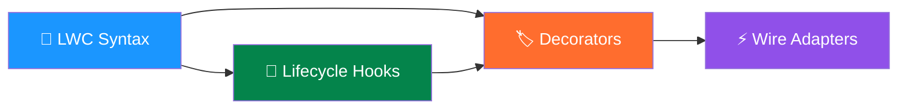

# 📋 LWC Cheat Sheets & Quick Reference

> Your one-stop revision toolkit for Lightning Web Components — scannable, visual, and exam-ready.

---

## 📑 Cheat Sheet Index

| # | Cheat Sheet | Description | Best For |
|---|------------|-------------|----------|
| 1 | [LWC Syntax](./lwc-syntax.md) | Complete syntax reference — templates, JS, CSS, XML config, imports, patterns | Quick syntax lookups during development or revision |
| 2 | [Lifecycle Hooks](./lifecycle-hooks.md) | Deep-dive into `constructor`, `connectedCallback`, `renderedCallback`, `disconnectedCallback`, `errorCallback` with flowcharts | Understanding component rendering order & hook selection |
| 3 | [Decorators](./decorators.md) | `@api`, `@track`, `@wire` — when to use, gotchas, interview Q&A | Choosing the right decorator & interview prep |
| 4 | [Wire Adapters](./wire-adapters.md) | Complete catalog of every wire adapter with import statements, params, return shapes & examples | Looking up adapter syntax and parameters |

---

## 🗺️ How These Cheat Sheets Fit Together

---

## 🎯 Quick Navigation by Topic

### When You Need To…

| Task | Go To |
|------|-------|
| Look up template syntax (`if:true`, `for:each`) | [LWC Syntax → HTML Templates](./lwc-syntax.md#-html-template-syntax) |
| Figure out which lifecycle hook to use | [Lifecycle Hooks → Decision Tree](./lifecycle-hooks.md#-decision-tree-which-hook-for-what) |
| Decide between `@api`, `@track`, or `@wire` | [Decorators → Decision Flowchart](./decorators.md#-decision-flowchart-which-decorator-to-use) |
| Wire an Apex method | [Wire Adapters → Custom Apex](./wire-adapters.md#-custom-apex-wire-adapters) |
| Show a toast notification | [LWC Syntax → Common Patterns](./lwc-syntax.md#-common-patterns) |
| Navigate to a record page | [Wire Adapters → Navigation](./wire-adapters.md#-lightningnavigation) |
| Understand parent-child render order | [Lifecycle Hooks → Rendering Order](./lifecycle-hooks.md#-parent-child-rendering-order) |
| Get picklist values dynamically | [Wire Adapters → uiObjectInfoApi](./wire-adapters.md#-lightninguiobjectinfoapi) |
| Remember XML metadata options | [LWC Syntax → XML Config](./lwc-syntax.md#-xml-configuration) |
| Avoid common decorator mistakes | [Decorators → Gotchas](./decorators.md#-gotchas-and-anti-patterns) |

---

## 📐 Study Strategy

> [!TIP]
> **Recommended study order:**
> 1. Start with **LWC Syntax** to build a solid foundation
> 2. Move to **Lifecycle Hooks** to understand *when* things happen
> 3. Study **Decorators** to understand *how* data flows
> 4. Finish with **Wire Adapters** to learn *what* data you can fetch

> [!NOTE]
> Each cheat sheet is self-contained — you can jump to any one based on your current need. They're designed for quick scanning during revision, not linear reading.

---

## 🔖 Icon Legend

Throughout these cheat sheets, you'll see these icons:

| Icon | Meaning |
|------|---------|
| ✅ | Allowed / Best practice |
| ❌ | Not allowed / Anti-pattern |
| ⚠️ | Gotcha / Easy to get wrong |
| 💡 | Pro tip |
| 🔑 | Key concept for interviews/exams |

---

## 📚 Companion Resources

| Resource | Link |
|----------|------|
| Official LWC Documentation | [developer.salesforce.com/docs/component-library](https://developer.salesforce.com/docs/component-library) |
| LWC Recipes (GitHub) | [github.com/trailheadapps/lwc-recipes](https://github.com/trailheadapps/lwc-recipes) |
| SLDS Component Blueprints | [lightningdesignsystem.com](https://www.lightningdesignsystem.com) |
| Apex Developer Guide | [developer.salesforce.com/docs/atlas.en-us.apexcode.meta](https://developer.salesforce.com/docs/atlas.en-us.apexcode.meta) |

---

*Last updated: June 2026*
