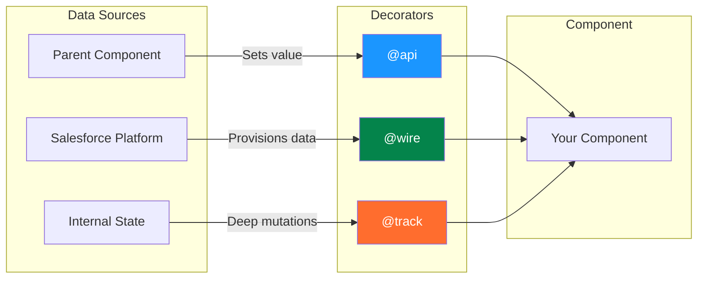
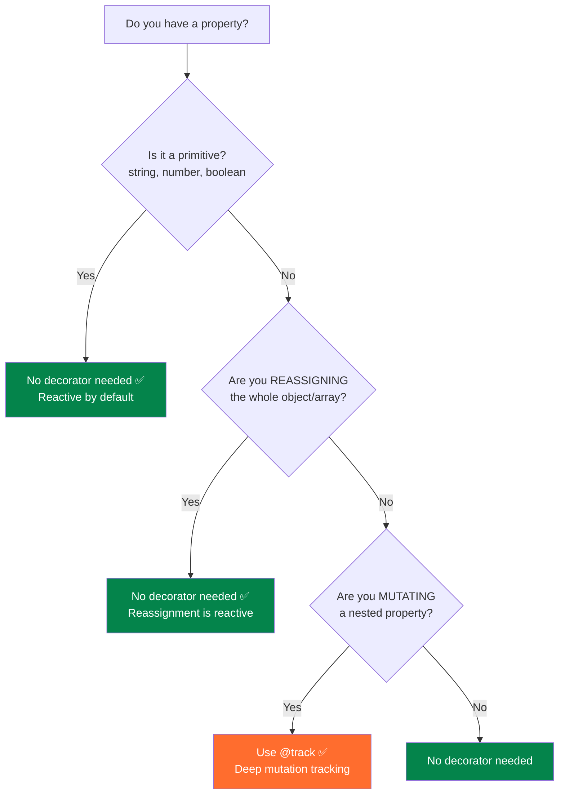
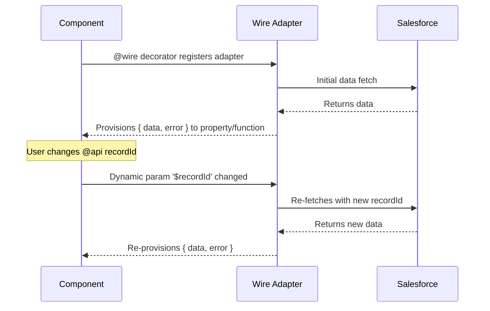
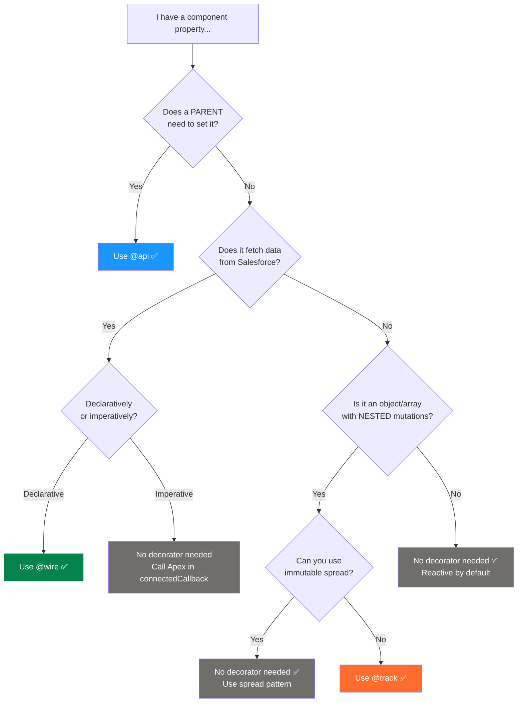

# 🏷️ LWC Decorators — Comprehensive Reference

> The three decorators that control data flow in Lightning Web Components: `@api`, `@track`, and `@wire`.

---

## 🗺️ Decorator Overview



---

## 1️⃣ `@api` — Public Properties & Methods

### What It Does
Marks a property or method as **public** — accessible by parent components and App Builder.

### Public Properties

```javascript
import { LightningElement, api } from 'lwc';

export default class UserCard extends LightningElement {
    // ── Simple public property with default ──
    @api cardTitle = 'User Info';

    // ── Required property (no default) ──
    @api recordId;

    // ── Public getter/setter pair ──
    _variant = 'standard';

    @api
    get variant() {
        return this._variant;
    }
    set variant(value) {
        // Validate or transform before storing
        const validValues = ['standard', 'compact', 'featured'];
        this._variant = validValues.includes(value) ? value : 'standard';
    }

    // ── Computed property based on @api ──
    get cardClass() {
        return `card card-${this.variant}`;
    }
}
```

```html
<!-- Parent using the child component -->
<c-user-card
    card-title="John Doe"
    record-id={selectedId}
    variant="compact">
</c-user-card>
```

> [!IMPORTANT]
> **camelCase → kebab-case mapping**: A property named `cardTitle` in JS becomes `card-title` in HTML markup. This conversion is automatic.

### Public Methods

```javascript
export default class DataTable extends LightningElement {
    data = [];

    // ── Public method — callable by parent ──
    @api
    refresh() {
        return this.loadData();
    }

    @api
    scrollToTop() {
        const container = this.template.querySelector('.table-container');
        if (container) {
            container.scrollTop = 0;
        }
    }

    @api
    getSelectedRows() {
        return this.selectedRows;
    }

    async loadData() {
        // ... fetch data
    }
}
```

```javascript
// Parent calling child's public method
export default class ParentComponent extends LightningElement {
    handleRefresh() {
        // Access child via querySelector and call its @api method
        const table = this.template.querySelector('c-data-table');
        table.refresh();
    }

    handleGetSelection() {
        const table = this.template.querySelector('c-data-table');
        const rows = table.getSelectedRows();
        console.log('Selected:', rows);
    }
}
```

### @api Rules Summary

| Rule | Details |
|------|---------|
| Reactivity | ✅ Changing an `@api` property triggers re-render |
| Who can set it? | Parent (via attribute) or App Builder (via `targetConfig`) |
| Read-only internally? | ✅ The owning component **cannot** reassign its own `@api` property |
| Can be a getter/setter? | ✅ Yes — useful for validation and transformation |
| Can be a method? | ✅ Yes — makes it callable by parent |
| Max per component? | No limit, but keep the API surface small |

> [!WARNING]
> **You cannot reassign an `@api` property inside the owning component.** It will silently fail or throw in dev mode. Use a private property if you need internal state.
>
> ```javascript
> // ❌ WRONG
> @api title = 'Default';
> handleClick() {
>     this.title = 'New Title';  // Anti-pattern! Component doesn't own this.
> }
>
> // ✅ CORRECT — mirror to private property
> @api title = 'Default';
> _internalTitle;
>
> get displayTitle() {
>     return this._internalTitle ?? this.title;
> }
> handleClick() {
>     this._internalTitle = 'New Title';  // Modify private copy
> }
> ```

---

## 2️⃣ `@track` — Deep Object/Array Reactivity

### The Spring '20 Change (🔑 Interview Favorite)

**Before Spring '20**: All properties were non-reactive. You needed `@track` for ANY reactive property.

**After Spring '20 (current behavior)**: All fields are **reactive by default** for primitive reassignment. `@track` is only needed for **deep mutation** of objects/arrays.



### When You Do NOT Need `@track`

```javascript
export default class NoTrackNeeded extends LightningElement {
    // ✅ Primitives are reactive by default
    name = 'John';
    count = 0;
    isVisible = true;

    handleClick() {
        this.name = 'Jane';     // ✅ Re-renders
        this.count++;           // ✅ Re-renders (reassignment)
        this.isVisible = false; // ✅ Re-renders
    }

    // ✅ Full object/array REASSIGNMENT is reactive
    contact = { name: 'John', email: 'john@test.com' };
    items = ['a', 'b', 'c'];

    replaceContact() {
        // ✅ This works — full reassignment
        this.contact = { name: 'Jane', email: 'jane@test.com' };
    }

    replaceItems() {
        // ✅ This works — spread creates new array
        this.items = [...this.items, 'd'];
    }
}
```

### When You NEED `@track`

```javascript
import { LightningElement, track } from 'lwc';

export default class TrackNeeded extends LightningElement {
    // ⚠️ Need @track for MUTATING nested properties
    @track formData = {
        name: '',
        address: {
            street: '',
            city: '',
            state: ''
        }
    };

    @track items = [];

    handleNameChange(event) {
        // ✅ With @track, direct mutation triggers re-render
        this.formData.name = event.target.value;
    }

    handleCityChange(event) {
        // ✅ Deep nested mutation — needs @track
        this.formData.address.city = event.target.value;
    }

    addItem() {
        // ✅ push() on @track array triggers re-render
        this.items.push({ id: Date.now(), name: 'New Item' });
    }
}
```

### The Immutable Pattern (Alternative to `@track`)

```javascript
export default class ImmutablePattern extends LightningElement {
    // No @track needed — use immutable updates instead
    formData = {
        name: '',
        address: { street: '', city: '', state: '' }
    };

    items = [];

    handleCityChange(event) {
        // ✅ Create a new object — reassignment is reactive
        this.formData = {
            ...this.formData,
            address: {
                ...this.formData.address,
                city: event.target.value
            }
        };
    }

    addItem() {
        // ✅ Spread creates new array — reactive without @track
        this.items = [...this.items, { id: Date.now(), name: 'New Item' }];
    }
}
```

| Approach | Needs `@track`? | Code Style | Performance |
|----------|----------------|------------|-------------|
| Direct mutation (`obj.prop = val`) | ✅ Yes | Simple, mutable | Good (tracks changes) |
| Spread / reassignment (`obj = {...obj}`) | ❌ No | Immutable (FP-style) | Fine for small objects; creates copies |
| `JSON.parse(JSON.stringify())` | ❌ No | Quick deep clone | Bad for large objects; loses methods |

> [!TIP]
> **Best practice**: Prefer the **immutable spread pattern** over `@track`. It's more predictable, works without a decorator, and aligns with modern JavaScript patterns.

---

## 3️⃣ `@wire` — Declarative Data Fetching

### What It Does
Connects a property or function to a **wire adapter** that reactively provisions data from Salesforce.

### Wire to Property

```javascript
import { LightningElement, api, wire } from 'lwc';
import { getRecord, getFieldValue } from 'lightning/uiRecordApi';
import NAME_FIELD from '@salesforce/schema/Account.Name';
import INDUSTRY_FIELD from '@salesforce/schema/Account.Industry';

const FIELDS = [NAME_FIELD, INDUSTRY_FIELD];

export default class AccountInfo extends LightningElement {
    @api recordId;

    // Wire to property — simplest form
    @wire(getRecord, { recordId: '$recordId', fields: FIELDS })
    account;
    //  └── Shape: { data: {...}, error: {...} }

    get accountName() {
        return getFieldValue(this.account.data, NAME_FIELD);
    }

    get accountIndustry() {
        return getFieldValue(this.account.data, INDUSTRY_FIELD);
    }

    get hasError() {
        return !!this.account.error;
    }
}
```

### Wire to Function

```javascript
import { LightningElement, api, wire } from 'lwc';
import getContacts from '@salesforce/apex/ContactController.getContacts';

export default class ContactList extends LightningElement {
    @api recordId;
    contacts = [];
    error;

    // Wire to function — more control over data handling
    @wire(getContacts, { accountId: '$recordId' })
    wiredContacts(result) {
        // ⚠️ `result` is the raw wire result — keep reference for refreshApex
        this._wiredResult = result;
        const { data, error } = result;

        if (data) {
            this.contacts = data.map(c => ({
                ...c,
                fullName: `${c.FirstName} ${c.LastName}`
            }));
            this.error = undefined;
        } else if (error) {
            this.error = error.body?.message || 'Error loading contacts';
            this.contacts = [];
        }
    }

    handleRefresh() {
        // Refresh the wired data
        return refreshApex(this._wiredResult);
    }
}
```

### Dynamic vs Static Parameters

```javascript
// Dynamic parameter — uses '$' prefix, re-fetches when value changes
@wire(getRecord, { recordId: '$recordId', fields: FIELDS })
account;
// '$recordId' means: re-invoke wire when this.recordId changes

// Static parameter — no '$' prefix, set once
@wire(getContacts, { limitCount: 10 })  // Always 10, never re-invokes
contacts;

// Mixed — dynamic and static together
@wire(getContacts, {
    accountId: '$recordId',   // Dynamic — re-fetches on change
    limitCount: 10             // Static — stays 10
})
contacts;
```

| Parameter Type | Syntax | Behavior |
|---------------|--------|----------|
| Dynamic (`$`) | `'$propertyName'` | Wire re-invokes when `this.propertyName` changes |
| Static | Direct value | Set once, never changes |
| Dynamic (nested) | `'$obj.prop'` | ⚠️ Not supported — only top-level properties |

> [!WARNING]
> **Dynamic parameters only work with top-level properties.** `'$obj.name'` does NOT work. If you need to derive a wire parameter from a nested property, use a getter:
>
> ```javascript
> // ❌ WRONG
> @wire(getRecord, { recordId: '$state.selectedId', fields: FIELDS })
>
> // ✅ CORRECT
> get selectedId() { return this.state?.selectedId; }
> @wire(getRecord, { recordId: '$selectedId', fields: FIELDS })
> ```

### Wire Lifecycle



### Wire Adapter Rules

| Rule | Details |
|------|---------|
| When does it fire? | After `connectedCallback()`, before `renderedCallback()` |
| Can it fire multiple times? | ✅ Yes — on initial load and whenever dynamic params change |
| Is the data cached? | ✅ Yes — uses Lightning Data Service (LDS) cache |
| Can I wire to an `@api` property? | ❌ No — a property can only have one decorator |
| Can I use `await` with wire? | ❌ No — wire is declarative, not imperative |
| What if param is `undefined`? | Wire adapter is not invoked until all dynamic params have values |

---

## 📊 Comparison: @api vs @track vs @wire

| Feature | `@api` | `@track` | `@wire` |
|---------|--------|----------|---------|
| **Purpose** | Public interface | Deep reactivity | Data provisioning |
| **Reactive?** | ✅ Yes | ✅ Yes (deep) | ✅ Yes |
| **Who sets value?** | Parent / App Builder | The component itself | Wire adapter (platform) |
| **Read-only in component?** | ✅ Yes | ❌ No | ✅ Yes (data) |
| **Can combine with others?** | ❌ One decorator per field | ❌ One decorator per field | ❌ One decorator per field |
| **Use for public prop** | ✅ Yes | ❌ No | ❌ No |
| **Use for public method** | ✅ Yes | ❌ No | ❌ No |
| **Use for nested mutations** | ❌ No | ✅ Yes | ❌ No |
| **Use for Apex data** | ❌ No | ❌ No | ✅ Yes |
| **Spring '20 impact** | No change | Mostly unnecessary | No change |
| **Common in new code?** | ✅ Very common | ⚠️ Rarely needed | ✅ Very common |

---

## 🔀 Decision Flowchart: Which Decorator to Use?



---

## ❓ Common Interview Questions

<details>
<summary><strong>Q1: What is the difference between @api and @track?</strong></summary>

**Answer:**
- `@api` makes a property **public** — it can be set by a parent component or configured in App Builder. The component itself cannot reassign it (read-only internally).
- `@track` enables **deep reactivity** for objects and arrays — it allows the framework to detect mutations to nested properties (like `this.obj.nested.prop = 'value'`).
- Since Spring '20, all fields are reactive for reassignment, so `@track` is only needed when you're **mutating** (not replacing) nested object/array properties.
- They solve different problems: `@api` is about component communication; `@track` is about internal reactivity.

</details>

<details>
<summary><strong>Q2: After Spring '20, is @track still needed? When?</strong></summary>

**Answer:**
`@track` is rarely needed after Spring '20. All fields are now reactive for primitive changes and object/array **reassignment**.

You still need `@track` when:
- You mutate a **nested property** directly: `this.obj.nested.value = 'new'`
- You use array **mutation methods**: `this.arr.push(item)`, `this.arr.splice()`

**Alternative**: Use the immutable spread pattern (`this.obj = { ...this.obj, nested: { ...this.obj.nested, value: 'new' } }`) to avoid `@track` entirely.

</details>

<details>
<summary><strong>Q3: Can you use @api and @wire on the same property?</strong></summary>

**Answer:**
**No.** Each property can have only one decorator. If you need to wire data based on an `@api` property, use the `@api` property as a dynamic parameter in the wire:

```javascript
@api recordId;  // @api decorator

@wire(getRecord, { recordId: '$recordId', fields: FIELDS })
account;  // @wire decorator on a DIFFERENT property
```

</details>

<details>
<summary><strong>Q4: What happens if a @wire dynamic parameter is undefined?</strong></summary>

**Answer:**
The wire adapter will **not be invoked** until all dynamic parameters (`'$param'`) have non-`undefined` values. Once the parameter gets a value, the wire adapter fires and provisions data. If the parameter becomes `undefined` again, the wire adapter may provision `undefined` data.

This is important for record pages — `recordId` is set asynchronously, so the wire waits until the page context provides it.

</details>

<details>
<summary><strong>Q5: Can you modify an @api property inside the component?</strong></summary>

**Answer:**
**No.** An `@api` property is owned by the parent. Attempting to reassign it inside the component is an anti-pattern and will log a warning in dev mode. If you need to work with a derived version, mirror it to a private property:

```javascript
@api inputValue;
_internalValue;

connectedCallback() {
    this._internalValue = this.inputValue;  // Copy once
}
```

Or use a getter/setter pair with a private backing field.

</details>

<details>
<summary><strong>Q6: How does @wire differ from imperative Apex calls?</strong></summary>

**Answer:**

| Aspect | `@wire` | Imperative |
|--------|---------|------------|
| Caching | ✅ Uses LDS cache | ❌ No automatic caching |
| Reactivity | ✅ Re-fetches on param change | Manual call required |
| Timing control | ❌ Can't control when it fires | ✅ Call when you want |
| Conditional | ❌ Always fires (if params defined) | ✅ Fire only when needed |
| Error handling | Property: `.error`; Function: callback | `try/catch` or `.catch()` |
| Refresh | `refreshApex(wiredResult)` | Call the method again |

**Rule of thumb**: Use `@wire` for data that should always be in sync with its parameters. Use imperative for user-triggered actions (save, delete) or conditional data loading.

</details>

<details>
<summary><strong>Q7: What is the difference between wiring to a property vs wiring to a function?</strong></summary>

**Answer:**
- **Wire to property**: Simplest form. The property gets an object with `{ data, error }` shape. You access data in the template or getters: `this.account.data`.
- **Wire to function**: The function receives the result as a parameter on every provision. You can transform data, run logic, or store the raw result for `refreshApex`. Gives more control.

Use **property** when you just need to display data. Use **function** when you need to transform, combine, or post-process the data.

</details>

---

## ⚠️ Gotchas and Anti-Patterns

### Anti-Pattern 1: Reassigning `@api` internally

```javascript
// ❌ DON'T — component doesn't own this value
@api title;
handleClick() {
    this.title = 'New Title';
}

// ✅ DO — use private state + fire event to request change
@api title;
_overrideTitle;

get displayTitle() {
    return this._overrideTitle ?? this.title;
}

handleClick() {
    this._overrideTitle = 'New Title';
    // Or fire event for parent to change
    this.dispatchEvent(new CustomEvent('titlechange', {
        detail: { title: 'New Title' }
    }));
}
```

### Anti-Pattern 2: Using `@track` on primitives

```javascript
// ❌ UNNECESSARY — primitives are reactive by default since Spring '20
@track name = 'John';
@track count = 0;
@track isVisible = true;

// ✅ CORRECT — no decorator needed
name = 'John';
count = 0;
isVisible = true;
```

### Anti-Pattern 3: Combining decorators

```javascript
// ❌ ERROR — only one decorator per field
@api @track myProp;

// ❌ ERROR
@api @wire(getRecord, {}) myProp;

// ✅ CORRECT — one decorator per field, each on separate fields
@api recordId;
@wire(getRecord, { recordId: '$recordId', fields: FIELDS }) account;
```

### Anti-Pattern 4: Wiring with string literals instead of `$`

```javascript
// ❌ WRONG — 'recordId' is a static string, not reactive
@wire(getRecord, { recordId: 'recordId', fields: FIELDS })
account;

// ✅ CORRECT — '$recordId' makes it reactive to this.recordId
@wire(getRecord, { recordId: '$recordId', fields: FIELDS })
account;
```

### Anti-Pattern 5: Assuming wire fires synchronously

```javascript
// ❌ WRONG — wire hasn't provisioned data yet in connectedCallback
@wire(getRecord, { recordId: '$recordId', fields: FIELDS })
account;

connectedCallback() {
    console.log(this.account.data);  // undefined!
}

// ✅ CORRECT — use renderedCallback or check in getters
get accountName() {
    return this.account?.data ? getFieldValue(this.account.data, NAME_FIELD) : '';
}
```

---

## 🔑 Key Takeaways

| # | Takeaway |
|---|----------|
| 1 | `@api` = public interface (parent ↔ child communication, App Builder config) |
| 2 | `@track` = deep reactivity for nested object/array mutations (rarely needed) |
| 3 | `@wire` = declarative data binding with reactive parameters (`$param`) |
| 4 | Since Spring '20, primitives and object reassignment are reactive WITHOUT any decorator |
| 5 | One decorator per property — they cannot be combined |
| 6 | `@api` properties are read-only inside the owning component |
| 7 | Prefer immutable spread pattern over `@track` for cleaner code |
| 8 | `@wire` parameters prefixed with `$` are dynamic; without `$` they're static |
| 9 | Wire adapters don't fire until all dynamic parameters have values |
| 10 | Use wire-to-function (not property) when you need to transform data or need `refreshApex` |

---

*Decorators are the backbone of LWC data flow — know them cold! 💪*
