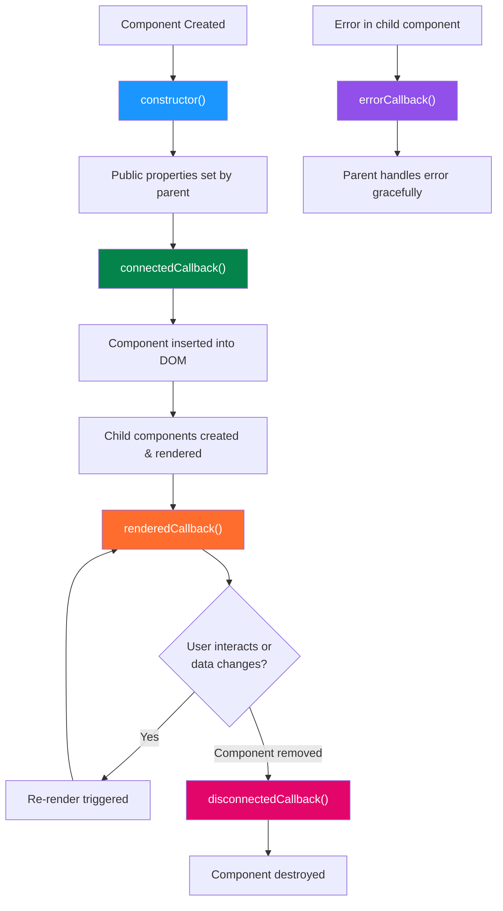
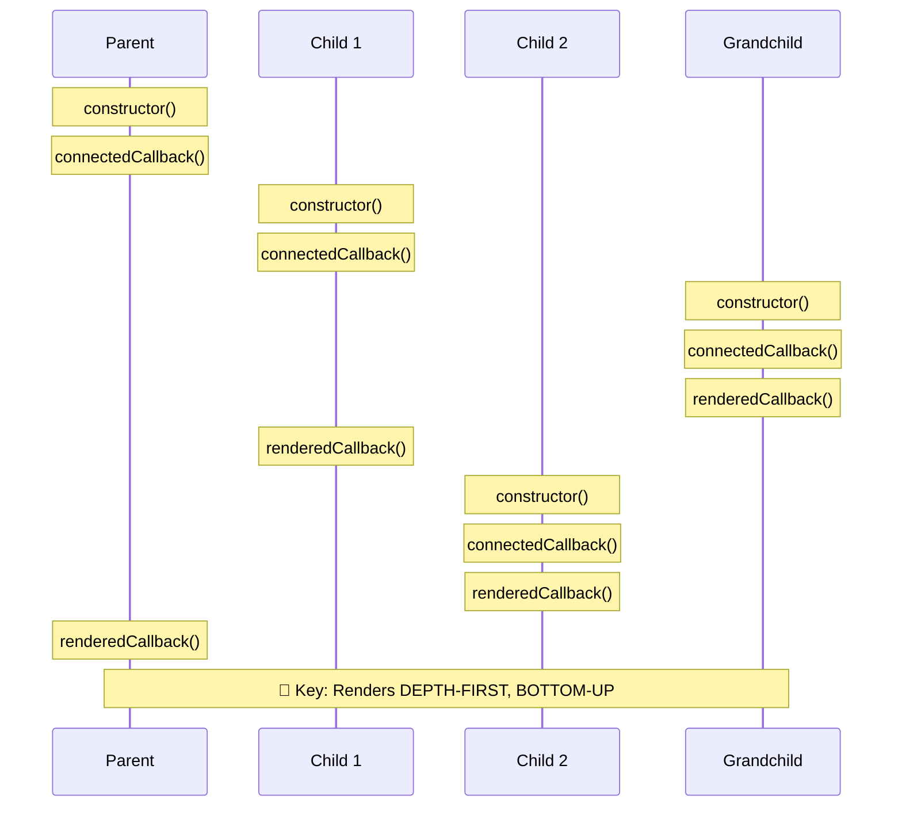
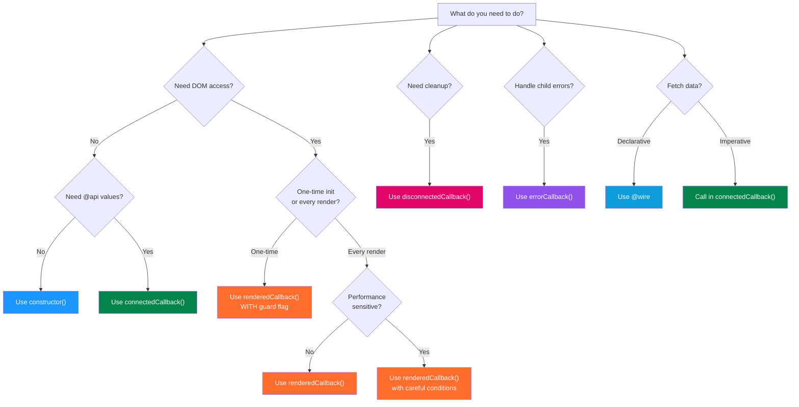

# 🔄 LWC Lifecycle Hooks — Deep-Dive Cheat Sheet

> Understand *when* things happen inside a Lightning Web Component.

---

## 🗺️ Complete Lifecycle Flowchart



---

## 📋 Hooks at a Glance

| Hook | Fires When | DOM Available? | Runs How Many Times? |
|------|-----------|----------------|---------------------|
| `constructor()` | Component instance created | ❌ No | Once |
| `connectedCallback()` | Component inserted into DOM | ⚠️ Partial (no children) | Once (unless re-inserted) |
| `renderedCallback()` | After every render/re-render | ✅ Yes (full DOM) | Many times |
| `disconnectedCallback()` | Component removed from DOM | ❌ Being torn down | Once per removal |
| `errorCallback(error, stack)` | Descendant throws error | ✅ Yes | Per error |

---

## 1️⃣ `constructor()`

### When It Fires
The very first hook — called when the component instance is created in memory, **before** it's attached to the DOM.

### What You Can / Cannot Do

| ✅ Can Do | ❌ Cannot Do |
|-----------|-------------|
| Initialize properties | Access `this.template` (it's `null`) |
| Set default values | Use `querySelector` |
| Call `super()` (required first!) | Access child elements |
| Set up initial state | Access `@api` properties (not set yet) |
| | Dispatch events |

### Code Example

```javascript
export default class UserCard extends LightningElement {
    greeting;
    timestamp;

    constructor() {
        super();  // ⚠️ MUST be first statement — no exceptions!
        this.greeting = 'Welcome';
        this.timestamp = Date.now();
        console.log('constructor: component created');

        // ❌ WRONG — DOM doesn't exist yet
        // this.template.querySelector('div');  // null!

        // ❌ WRONG — @api values not set yet
        // console.log(this.recordId);  // undefined!
    }
}
```

### 💡 Real-World Analogy
Think of `constructor()` like **buying land** for a house. You own the plot, but the house hasn't been built yet — you can plan, but you can't move furniture in.

### ⚠️ Gotchas
- `super()` **must** be the first statement — even before `console.log`
- Don't try to read `@api` properties — the parent hasn't set them yet
- Don't add attributes to the host element

---

## 2️⃣ `connectedCallback()`

### When It Fires
Called when the component is **inserted into the DOM**. The component itself is in the document, but its child components may not have rendered yet.

### What You Can / Cannot Do

| ✅ Can Do | ❌ Cannot Do |
|-----------|-------------|
| Access `@api` properties | Access child component DOM elements |
| Subscribe to events / LMS | Reliably use `querySelector` on children |
| Make imperative Apex calls | |
| Add event listeners to `document` / `window` | |
| Set up intervals / timers | |
| Access the host element | |
| Fire events | |

### Code Example

```javascript
import { LightningElement, api, wire } from 'lwc';
import { subscribe, MessageContext } from 'lightning/messageService';
import RECORD_SELECTED from '@salesforce/messageChannel/Record_Selected__c';

export default class ContactPanel extends LightningElement {
    @api recordId;         // ✅ Available here!
    subscription = null;

    @wire(MessageContext)
    messageContext;

    connectedCallback() {
        console.log('connectedCallback: recordId =', this.recordId);

        // ✅ Subscribe to Lightning Message Channel
        if (!this.subscription) {
            this.subscription = subscribe(
                this.messageContext,
                RECORD_SELECTED,
                (message) => this.handleMessage(message)
            );
        }

        // ✅ Add window-level event listener
        window.addEventListener('resize', this._handleResize);

        // ✅ Make imperative Apex call
        this.loadData();
    }

    _handleResize = () => {
        // Handle window resize
    }

    handleMessage(message) {
        this.recordId = message.recordId;
    }

    async loadData() {
        // Fetch data imperatively
    }
}
```

### 💡 Real-World Analogy
Like the **housewarming day** — the house frame is up (you're in the DOM), but interior decoration (child components) may still be in progress. You can set up utilities (subscriptions) and get your address (properties).

### ⚠️ Gotchas
- **Runs again** if a component is removed and re-inserted into the DOM
- Child component DOM is **not** available yet — don't `querySelector` for them
- If you subscribe to events here, **always** unsubscribe in `disconnectedCallback()`
- Can fire multiple times in dynamic `for:each` scenarios

---

## 3️⃣ `renderedCallback()`

### When It Fires
After **every render and re-render**. This is called after the component's template has been rendered and the DOM is ready — including child component DOM.

### What You Can / Cannot Do

| ✅ Can Do | ❌ Cannot Do |
|-----------|-------------|
| Access full DOM (`querySelector`) | Modify state without guard (infinite loop!) |
| Integrate 3rd-party libraries (Chart.js, D3) | Assume it runs only once |
| Measure DOM elements | |
| Focus elements | |
| Read computed styles | |

### Code Example

```javascript
import { LightningElement } from 'lwc';
import { loadScript } from 'lightning/platformResourceLoader';
import chartJs from '@salesforce/resourceUrl/chartJs';

export default class ChartComponent extends LightningElement {
    chartInitialized = false;  // ⚠️ Guard flag — critical!

    renderedCallback() {
        // ✅ Use a guard to prevent repeated initialization
        if (this.chartInitialized) {
            return;
        }
        this.chartInitialized = true;

        loadScript(this, chartJs)
            .then(() => {
                this.initializeChart();
            })
            .catch(error => {
                console.error('Chart load error:', error);
            });
    }

    initializeChart() {
        const canvas = this.template.querySelector('canvas');
        // Now canvas is definitely in the DOM
        new window.Chart(canvas, {
            type: 'bar',
            data: { /* ... */ }
        });
    }
}
```

### 💡 Real-World Analogy
Like a **home inspection** that runs every time you renovate. The inspector (your code) can see everything in the house (full DOM), but you should only do major work on the first visit (use a guard flag).

### ⚠️ Gotchas
- **Runs after EVERY re-render** — setting a reactive property here without a guard creates an infinite loop!
- Always use a boolean guard (`if (this.initialized) return;`)
- Performance-sensitive — keep logic minimal
- Don't confuse with `connectedCallback` — this is for DOM-dependent work, not data fetching

> [!CAUTION]
> **Infinite loop trap**: If you set a reactive property inside `renderedCallback()` without a guard, it triggers a re-render, which calls `renderedCallback()` again, which sets the property again... forever.
>
> ```javascript
> // ❌ INFINITE LOOP
> renderedCallback() {
>     this.counter = this.counter + 1;  // Triggers re-render!
> }
>
> // ✅ SAFE
> renderedCallback() {
>     if (!this.hasRendered) {
>         this.hasRendered = true;
>         this.initializeOnce();
>     }
> }
> ```

---

## 4️⃣ `disconnectedCallback()`

### When It Fires
When the component is **removed from the DOM**. This is your cleanup hook.

### What You Can / Cannot Do

| ✅ Can Do | ❌ Cannot Do |
|-----------|-------------|
| Unsubscribe from events | Guarantee DOM state |
| Clear intervals / timeouts | Access child component state |
| Release resources | |
| Unsubscribe from LMS | |

### Code Example

```javascript
import { LightningElement } from 'lwc';
import { unsubscribe } from 'lightning/messageService';

export default class LiveFeed extends LightningElement {
    subscription;
    intervalId;

    connectedCallback() {
        // Set up timer
        this.intervalId = setInterval(() => {
            this.refreshData();
        }, 30000);

        // Add global listener
        window.addEventListener('resize', this._handleResize);
    }

    disconnectedCallback() {
        // ✅ Clean up EVERYTHING you set up in connectedCallback

        // Clear interval
        if (this.intervalId) {
            clearInterval(this.intervalId);
        }

        // Remove global listener
        window.removeEventListener('resize', this._handleResize);

        // Unsubscribe from LMS
        if (this.subscription) {
            unsubscribe(this.subscription);
            this.subscription = null;
        }

        console.log('disconnectedCallback: all resources released');
    }

    _handleResize = () => { /* ... */ }
}
```

### 💡 Real-World Analogy
Like **moving out of a house** — you cancel your newspaper subscription, stop your mail forwarding, and turn off the utilities. If you forget, you'll keep paying (memory leaks)!

### ⚠️ Gotchas
- If you add a listener in `connectedCallback`, **always** remove it here
- Forgetting cleanup causes **memory leaks**
- Can fire without `connectedCallback` if the component is never inserted (edge case)

---

## 5️⃣ `errorCallback(error, stack)`

### When It Fires
When a **descendant component** (child, grandchild, etc.) throws an unhandled error during rendering or lifecycle hooks. Acts as an error boundary — similar to React's `componentDidCatch`.

### What You Can / Cannot Do

| ✅ Can Do | ❌ Cannot Do |
|-----------|-------------|
| Log the error | Catch errors in itself (only children) |
| Show a fallback UI | Catch errors in event handlers |
| Report to analytics | Prevent the error from happening |
| Recover gracefully | |

### Code Example

```javascript
// ── errorBoundary.js (Parent wrapper component) ──
import { LightningElement } from 'lwc';

export default class ErrorBoundary extends LightningElement {
    hasError = false;
    errorMessage = '';
    errorStack = '';

    errorCallback(error, stack) {
        this.hasError = true;
        this.errorMessage = error.message;
        this.errorStack = stack;
        console.error('Error caught by boundary:', error);
        console.error('Stack:', stack);
    }
}
```

```html
<!-- errorBoundary.html -->
<template>
    <template lwc:if={hasError}>
        <div class="slds-box slds-theme_error">
            <p><strong>Something went wrong</strong></p>
            <p>{errorMessage}</p>
            <lightning-button
                label="Try Again"
                variant="neutral"
                onclick={handleRetry}>
            </lightning-button>
        </div>
    </template>
    <template lwc:else>
        <slot></slot>  <!-- Child components render here -->
    </template>
</template>
```

```html
<!-- Usage in another parent -->
<template>
    <c-error-boundary>
        <c-risky-child-component></c-risky-child-component>
    </c-error-boundary>
</template>
```

### 💡 Real-World Analogy
Like a **safety net** at a circus — it doesn't prevent the acrobat (child) from falling, but it catches them so the show (app) can continue.

### ⚠️ Gotchas
- Only catches errors from **descendant** components, not from itself
- Does **not** catch errors in event handlers — use try/catch for those
- The `stack` parameter is a string, not a proper Error stack trace

---

## 🏗️ Parent-Child Rendering Order



> [!IMPORTANT]
> **Rendering order is depth-first, bottom-up:**
> 1. Parent `constructor()` → `connectedCallback()`
> 2. Children created depth-first (first child's full tree completes before second child starts)
> 3. Deepest descendant's `renderedCallback()` fires first
> 4. Parent's `renderedCallback()` fires last

---

## 🔀 Comparison: LWC vs React vs Angular

| Concept | LWC | React (Functional) | Angular |
|---------|-----|-------------------|---------|
| **Initialization** | `constructor()` | `useState()` initial value | `constructor()` |
| **Mounted/Connected** | `connectedCallback()` | `useEffect(() => {}, [])` | `ngOnInit()` |
| **After Render** | `renderedCallback()` | `useEffect()` (no deps) / `useLayoutEffect()` | `ngAfterViewInit()` / `ngAfterViewChecked()` |
| **Destroyed/Cleanup** | `disconnectedCallback()` | `useEffect` return cleanup fn | `ngOnDestroy()` |
| **Error Boundary** | `errorCallback()` | `componentDidCatch()` (class) / Error Boundary | `ErrorHandler` |
| **Property Change** | Reactive by default | `useState` setter → re-render | `ngOnChanges()` |
| **Input Props** | `@api` | `props` | `@Input()` |
| **Output Events** | `CustomEvent` | Callback props | `@Output() EventEmitter` |

---

## 🌳 Decision Tree: Which Hook for What?



---

## ❌ Common Mistakes

### Mistake 1: Missing `super()` in Constructor

```javascript
// ❌ WRONG — throws error
constructor() {
    this.name = 'test';  // ReferenceError!
    super();
}

// ✅ CORRECT
constructor() {
    super();             // Always first!
    this.name = 'test';
}
```

### Mistake 2: Accessing DOM in `connectedCallback()`

```javascript
// ❌ WRONG — child elements don't exist yet
connectedCallback() {
    const btn = this.template.querySelector('lightning-button');
    btn.focus();  // null reference!
}

// ✅ CORRECT — use renderedCallback for DOM access
renderedCallback() {
    if (!this.hasFocused) {
        this.hasFocused = true;
        const btn = this.template.querySelector('lightning-button');
        if (btn) btn.focus();
    }
}
```

### Mistake 3: Infinite Loop in `renderedCallback()`

```javascript
// ❌ WRONG — infinite re-render loop
renderedCallback() {
    this.message = 'Rendered at ' + Date.now();  // Reactive → re-render → loop!
}

// ✅ CORRECT — use a guard
renderedCallback() {
    if (!this.isInitialized) {
        this.isInitialized = true;
        this.message = 'Rendered at ' + Date.now();
    }
}
```

### Mistake 4: Forgetting to Unsubscribe

```javascript
// ❌ WRONG — memory leak!
connectedCallback() {
    window.addEventListener('scroll', this.handleScroll);
}
// No disconnectedCallback → listener persists forever

// ✅ CORRECT
connectedCallback() {
    window.addEventListener('scroll', this._handleScroll);
}
disconnectedCallback() {
    window.removeEventListener('scroll', this._handleScroll);
}
_handleScroll = () => { /* ... */ }
```

### Mistake 5: Expecting `connectedCallback` to Run Once

```javascript
// ⚠️ This can run multiple times if the component is in a conditional block
// that toggles on/off

// Template:
// <template lwc:if={showChild}>
//     <c-child></c-child>    ← destroyed and recreated each toggle!
// </template>

connectedCallback() {
    // ⚠️ This runs every time the parent shows this component
    this.fetchData();  // Might fetch data multiple times!
}
```

---

## 📊 Hook Execution Summary Table

| Scenario | constructor | connected | rendered | disconnected | error |
|----------|:-----------:|:---------:|:--------:|:------------:|:-----:|
| Component first loads | 1️⃣ | 2️⃣ | 3️⃣ | — | — |
| Property changes | — | — | 🔄 | — | — |
| Component removed | — | — | — | 4️⃣ | — |
| Component re-inserted | — | 🔄 | 🔄 | — | — |
| Child throws error | — | — | — | — | ⚡ |
| `@wire` provisions data | — | — | 🔄 | — | — |

---

## 🔑 Key Takeaways

| # | Takeaway |
|---|----------|
| 1 | `constructor()` → setup defaults; `super()` must be first; no DOM, no `@api` |
| 2 | `connectedCallback()` → component in DOM; `@api` ready; subscribe here |
| 3 | `renderedCallback()` → full DOM; runs many times; ALWAYS use a guard flag |
| 4 | `disconnectedCallback()` → cleanup everything you set up; prevent memory leaks |
| 5 | `errorCallback()` → catches child errors only; use for error boundaries |
| 6 | Rendering is depth-first, bottom-up: deepest child renders first |
| 7 | `connectedCallback` can run multiple times if component is toggled |
| 8 | For data fetching, prefer `@wire` (declarative) over imperative in `connectedCallback` |

---

*Master the lifecycle — master the component. 🎯*
