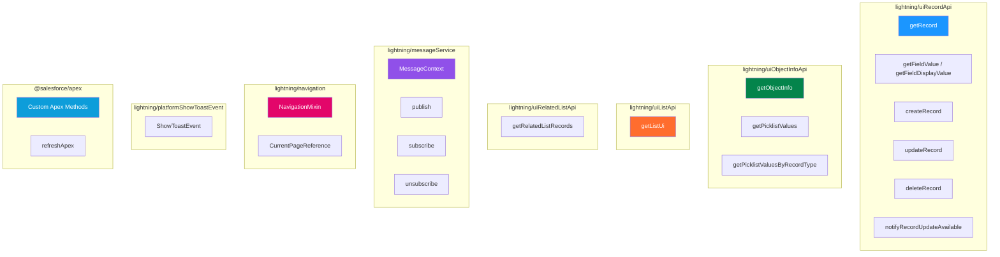

# ⚡ Wire Adapters — Complete Catalog

> Every wire adapter you need, with import statements, parameters, return shapes, and working examples.

---

## 🗺️ Wire Adapter Landscape



---

## 📦 lightning/uiRecordApi

### `getRecord`

Fetches a single record from Lightning Data Service (LDS). Cached and reactive.

**Import:**
```javascript
import { getRecord, getFieldValue, getFieldDisplayValue } from 'lightning/uiRecordApi';
import NAME_FIELD from '@salesforce/schema/Account.Name';
import INDUSTRY_FIELD from '@salesforce/schema/Account.Industry';
import OWNER_NAME from '@salesforce/schema/Account.Owner.Name';
```

**Parameters:**

| Parameter | Type | Required | Description |
|-----------|------|----------|-------------|
| `recordId` | `string` | ✅ | The 18-char record ID |
| `fields` | `string[]` or `FieldId[]` | ✅* | Fields to retrieve (respects FLS — error if no access) |
| `optionalFields` | `string[]` or `FieldId[]` | ✅* | Fields to retrieve (returns `null` if no access) |
| `modes` | `string[]` | ❌ | `['View']` or `['Edit']` |

> \* At least one of `fields` or `optionalFields` is required.

**Wire to Property:**
```javascript
import { LightningElement, api, wire } from 'lwc';
import { getRecord, getFieldValue } from 'lightning/uiRecordApi';
import NAME_FIELD from '@salesforce/schema/Account.Name';
import INDUSTRY_FIELD from '@salesforce/schema/Account.Industry';

const FIELDS = [NAME_FIELD, INDUSTRY_FIELD];

export default class AccountDetail extends LightningElement {
    @api recordId;

    @wire(getRecord, { recordId: '$recordId', fields: FIELDS })
    account;

    get name() {
        return getFieldValue(this.account.data, NAME_FIELD);
    }

    get industry() {
        return getFieldValue(this.account.data, INDUSTRY_FIELD);
    }

    get isLoading() {
        return !this.account.data && !this.account.error;
    }
}
```

**Wire to Function:**
```javascript
@wire(getRecord, { recordId: '$recordId', fields: FIELDS })
wiredAccount(result) {
    this._wiredResult = result;  // Store for refreshApex
    if (result.data) {
        this.name = getFieldValue(result.data, NAME_FIELD);
        this.error = undefined;
    } else if (result.error) {
        this.error = result.error;
        this.name = undefined;
    }
}
```

**Return Shape:**
```javascript
{
    data: {
        id: "001xx000003ABCDEF",
        apiName: "Account",
        fields: {
            Name: { value: "Acme Corp", displayValue: null },
            Industry: { value: "Technology", displayValue: "Technology" }
        }
    },
    error: undefined
}
```

> [!TIP]
> Use `getFieldValue(record, field)` for raw value and `getFieldDisplayValue(record, field)` for formatted display value (respects locale, picklist labels, etc.).

### `getFieldValue` / `getFieldDisplayValue`

Not wire adapters — they're **utility functions** for extracting field values from wired record data.

```javascript
import { getFieldValue, getFieldDisplayValue } from 'lightning/uiRecordApi';
import AMOUNT_FIELD from '@salesforce/schema/Opportunity.Amount';

// Raw value: 50000
const amount = getFieldValue(this.record.data, AMOUNT_FIELD);

// Formatted display value: "$50,000.00"
const displayAmount = getFieldDisplayValue(this.record.data, AMOUNT_FIELD);
```

| Function | Returns | Use For |
|----------|---------|---------|
| `getFieldValue` | Raw value (`50000`, `'Technology'`) | Calculations, logic |
| `getFieldDisplayValue` | Formatted string (`'$50,000.00'`, `'Technology'`) | Display in UI |

---

### `createRecord`

Creates a new record. **Not a wire adapter** — call imperatively.

**Import:**
```javascript
import { createRecord } from 'lightning/uiRecordApi';
import CONTACT_OBJECT from '@salesforce/schema/Contact';
import FIRST_NAME from '@salesforce/schema/Contact.FirstName';
import LAST_NAME from '@salesforce/schema/Contact.LastName';
import ACCOUNT_ID from '@salesforce/schema/Contact.AccountId';
```

**Example:**
```javascript
async handleCreate() {
    const fields = {};
    fields[FIRST_NAME.fieldApiName] = 'John';
    fields[LAST_NAME.fieldApiName] = 'Doe';
    fields[ACCOUNT_ID.fieldApiName] = this.recordId;

    try {
        const record = await createRecord({
            apiName: CONTACT_OBJECT.objectApiName,
            fields
        });
        this.newRecordId = record.id;
        this.dispatchEvent(new ShowToastEvent({
            title: 'Success',
            message: 'Contact created: ' + record.id,
            variant: 'success'
        }));
    } catch (error) {
        this.dispatchEvent(new ShowToastEvent({
            title: 'Error creating record',
            message: error.body?.message || 'Unknown error',
            variant: 'error'
        }));
    }
}
```

---

### `updateRecord`

Updates an existing record. **Not a wire adapter** — call imperatively.

**Import:**
```javascript
import { updateRecord } from 'lightning/uiRecordApi';
import ID_FIELD from '@salesforce/schema/Contact.Id';
import PHONE_FIELD from '@salesforce/schema/Contact.Phone';
```

**Example:**
```javascript
async handleUpdate() {
    const fields = {};
    fields[ID_FIELD.fieldApiName] = this.recordId;
    fields[PHONE_FIELD.fieldApiName] = this.newPhone;

    try {
        await updateRecord({ fields });
        this.dispatchEvent(new ShowToastEvent({
            title: 'Success',
            message: 'Record updated',
            variant: 'success'
        }));
    } catch (error) {
        this.dispatchEvent(new ShowToastEvent({
            title: 'Error',
            message: error.body?.message,
            variant: 'error'
        }));
    }
}
```

---

### `deleteRecord`

Deletes a record. **Not a wire adapter** — call imperatively.

**Import & Example:**
```javascript
import { deleteRecord } from 'lightning/uiRecordApi';

async handleDelete() {
    try {
        await deleteRecord(this.recordId);
        this.dispatchEvent(new ShowToastEvent({
            title: 'Deleted',
            message: 'Record deleted',
            variant: 'success'
        }));
        // Navigate away since the record no longer exists
        this[NavigationMixin.Navigate]({
            type: 'standard__objectPage',
            attributes: {
                objectApiName: 'Contact',
                actionName: 'list'
            }
        });
    } catch (error) {
        this.dispatchEvent(new ShowToastEvent({
            title: 'Error',
            message: error.body?.message,
            variant: 'error'
        }));
    }
}
```

---

### `notifyRecordUpdateAvailable`

Tells LDS that a record has been modified externally (e.g., by imperative Apex). LDS refreshes all components displaying that record.

**Import & Example:**
```javascript
import { notifyRecordUpdateAvailable } from 'lightning/uiRecordApi';

async handleSaveViaApex() {
    await saveContact({ contact: this.contactData });
    // Tell LDS to refresh components showing this record
    await notifyRecordUpdateAvailable([{ recordId: this.recordId }]);
}
```

---

### uiRecordApi Quick Reference

| Function | Wire Adapter? | Use Case |
|----------|:------------:|----------|
| `getRecord` | ✅ | Read a record |
| `getFieldValue` | ❌ (utility) | Extract raw value from wired data |
| `getFieldDisplayValue` | ❌ (utility) | Extract formatted value from wired data |
| `createRecord` | ❌ (imperative) | Create a new record |
| `updateRecord` | ❌ (imperative) | Update an existing record |
| `deleteRecord` | ❌ (imperative) | Delete a record |
| `notifyRecordUpdateAvailable` | ❌ (imperative) | Notify LDS of external changes |

---

## 📦 lightning/uiObjectInfoApi

### `getObjectInfo`

Retrieves metadata about a Salesforce object — field definitions, record types, theme info.

**Import:**
```javascript
import { getObjectInfo } from 'lightning/uiObjectInfoApi';
import ACCOUNT_OBJECT from '@salesforce/schema/Account';
```

**Parameters:**

| Parameter | Type | Required | Description |
|-----------|------|----------|-------------|
| `objectApiName` | `string` or `ObjectId` | ✅ | The object API name |

**Example:**
```javascript
@wire(getObjectInfo, { objectApiName: ACCOUNT_OBJECT })
objectInfo;

get defaultRecordTypeId() {
    return this.objectInfo.data?.defaultRecordTypeId;
}

get fieldMap() {
    return this.objectInfo.data?.fields;
}

// Check if a specific field exists & is accessible
get hasIndustryField() {
    return !!this.objectInfo.data?.fields?.Industry;
}
```

**Return Shape (key properties):**
```javascript
{
    data: {
        apiName: "Account",
        label: "Account",
        labelPlural: "Accounts",
        keyPrefix: "001",
        defaultRecordTypeId: "012000000000000AAA",
        recordTypeInfos: { /* ... */ },
        fields: {
            Name: {
                apiName: "Name",
                label: "Account Name",
                dataType: "String",
                required: true,
                updateable: true,
                createable: true
            }
            // ... more fields
        },
        themeInfo: {
            color: "7F8DE1",
            iconUrl: "..."
        }
    }
}
```

---

### `getPicklistValues`

Gets picklist values for a specific field, scoped to a record type.

**Import:**
```javascript
import { getPicklistValues } from 'lightning/uiObjectInfoApi';
import INDUSTRY_FIELD from '@salesforce/schema/Account.Industry';
```

**Parameters:**

| Parameter | Type | Required | Description |
|-----------|------|----------|-------------|
| `recordTypeId` | `string` | ✅ | Record type ID (use `getObjectInfo` to get it) |
| `fieldApiName` | `string` or `FieldId` | ✅ | Field API name |

**Example:**
```javascript
import { getObjectInfo, getPicklistValues } from 'lightning/uiObjectInfoApi';
import ACCOUNT_OBJECT from '@salesforce/schema/Account';
import INDUSTRY_FIELD from '@salesforce/schema/Account.Industry';

export default class IndustryPicker extends LightningElement {
    // Step 1: Get object info to get the default record type ID
    @wire(getObjectInfo, { objectApiName: ACCOUNT_OBJECT })
    objectInfo;

    // Step 2: Use the record type ID to get picklist values
    @wire(getPicklistValues, {
        recordTypeId: '$defaultRecordTypeId',
        fieldApiName: INDUSTRY_FIELD
    })
    industryPicklist;

    get defaultRecordTypeId() {
        return this.objectInfo.data?.defaultRecordTypeId;
    }

    get industryOptions() {
        return this.industryPicklist.data?.values || [];
        // Each item: { label: 'Technology', value: 'Technology', validFor: [] }
    }
}
```

```html
<template>
    <lightning-combobox
        label="Industry"
        options={industryOptions}
        onchange={handleChange}>
    </lightning-combobox>
</template>
```

---

### `getPicklistValuesByRecordType`

Gets **all** picklist values for an object, scoped to a record type. More efficient than multiple `getPicklistValues` calls.

**Import:**
```javascript
import { getPicklistValuesByRecordType } from 'lightning/uiObjectInfoApi';
import ACCOUNT_OBJECT from '@salesforce/schema/Account';
```

**Parameters:**

| Parameter | Type | Required | Description |
|-----------|------|----------|-------------|
| `objectApiName` | `string` or `ObjectId` | ✅ | The object API name |
| `recordTypeId` | `string` | ✅ | Record type ID |

**Example:**
```javascript
@wire(getPicklistValuesByRecordType, {
    objectApiName: ACCOUNT_OBJECT,
    recordTypeId: '$defaultRecordTypeId'
})
allPicklists;

get industryOptions() {
    return this.allPicklists.data?.picklistFieldValues?.Industry?.values || [];
}

get ratingOptions() {
    return this.allPicklists.data?.picklistFieldValues?.Rating?.values || [];
}

get typeOptions() {
    return this.allPicklists.data?.picklistFieldValues?.Type?.values || [];
}
```

> [!TIP]
> Use `getPicklistValuesByRecordType` when you need picklist values for **multiple** fields on the same object. It makes one API call instead of many.

---

## 📦 lightning/uiListApi

### `getListUi`

Retrieves records and metadata for a list view.

**Import:**
```javascript
import { getListUi } from 'lightning/uiListApi';
import ACCOUNT_OBJECT from '@salesforce/schema/Account';
```

**Parameters:**

| Parameter | Type | Required | Description |
|-----------|------|----------|-------------|
| `objectApiName` | `string` | ✅ | Object API name |
| `listViewApiName` | `string` | ✅ | List view developer name |
| `sortBy` | `string` | ❌ | Field to sort by |
| `pageSize` | `number` | ❌ | Records per page (default 50) |
| `pageToken` | `string` | ❌ | Pagination token |

**Example:**
```javascript
import { getListUi } from 'lightning/uiListApi';
import ACCOUNT_OBJECT from '@salesforce/schema/Account';

export default class AccountList extends LightningElement {
    @wire(getListUi, {
        objectApiName: ACCOUNT_OBJECT,
        listViewApiName: 'AllAccounts',
        pageSize: 10
    })
    listView;

    get records() {
        return this.listView.data?.records?.records || [];
    }

    get columns() {
        return this.listView.data?.info?.displayColumns?.map(col => ({
            label: col.label,
            fieldName: col.fieldApiName,
            type: col.dataType?.toLowerCase()
        })) || [];
    }
}
```

> [!WARNING]
> `getListUi` is subject to strict API limits. For large datasets or complex queries, consider using **Apex** with `@wire` instead.

---

## 📦 lightning/uiRelatedListApi

### `getRelatedListRecords`

Fetches records from a related list.

**Import:**
```javascript
import { getRelatedListRecords } from 'lightning/uiRelatedListApi';
```

**Parameters:**

| Parameter | Type | Required | Description |
|-----------|------|----------|-------------|
| `parentRecordId` | `string` | ✅ | Parent record ID |
| `relatedListId` | `string` | ✅ | Related list API name (e.g., `'Contacts'`) |
| `fields` | `string[]` | ❌ | Fields to retrieve |
| `sortBy` | `string[]` | ❌ | Sort fields |
| `where` | `object` | ❌ | Filter conditions |
| `pageSize` | `number` | ❌ | Records per page |

**Example:**
```javascript
import { getRelatedListRecords } from 'lightning/uiRelatedListApi';

export default class RelatedContacts extends LightningElement {
    @api recordId;

    @wire(getRelatedListRecords, {
        parentRecordId: '$recordId',
        relatedListId: 'Contacts',
        fields: ['Contact.Id', 'Contact.Name', 'Contact.Email', 'Contact.Phone'],
        sortBy: ['Contact.Name'],
        pageSize: 10
    })
    relatedContacts;

    get contacts() {
        return this.relatedContacts.data?.records?.map(record => ({
            id: record.fields.Id.value,
            name: record.fields.Name.value,
            email: record.fields.Email.value,
            phone: record.fields.Phone.value
        })) || [];
    }
}
```

---

## 📦 lightning/messageService

Lightning Message Service (LMS) — publish/subscribe messaging across components that may not be in a parent-child relationship.

### Imports

```javascript
import {
    publish,
    subscribe,
    unsubscribe,
    MessageContext,
    createMessageContext,
    releaseMessageContext
} from 'lightning/messageService';

// Import your message channel
import MY_CHANNEL from '@salesforce/messageChannel/MyChannel__c';
```

### Setup: Message Channel XML

Create file: `force-app/main/default/messageChannels/MyChannel__c.messageChannel-meta.xml`

```xml
<?xml version="1.0" encoding="UTF-8"?>
<LightningMessageChannel xmlns="http://soap.sforce.com/2006/04/metadata">
    <masterLabel>My Channel</masterLabel>
    <isExposed>true</isExposed>
    <description>Channel for cross-component communication</description>
    <lightningMessageFields>
        <fieldName>recordId</fieldName>
        <description>The selected record ID</description>
    </lightningMessageFields>
    <lightningMessageFields>
        <fieldName>source</fieldName>
        <description>Source component name</description>
    </lightningMessageFields>
</LightningMessageChannel>
```

### Publisher Component

```javascript
import { LightningElement, wire } from 'lwc';
import { publish, MessageContext } from 'lightning/messageService';
import RECORD_SELECTED from '@salesforce/messageChannel/Record_Selected__c';

export default class Publisher extends LightningElement {
    @wire(MessageContext)
    messageContext;

    handleSelect(event) {
        const payload = {
            recordId: event.detail.recordId,
            source: 'publisherComponent'
        };
        publish(this.messageContext, RECORD_SELECTED, payload);
    }
}
```

### Subscriber Component

```javascript
import { LightningElement, wire } from 'lwc';
import {
    subscribe,
    unsubscribe,
    MessageContext
} from 'lightning/messageService';
import RECORD_SELECTED from '@salesforce/messageChannel/Record_Selected__c';

export default class Subscriber extends LightningElement {
    selectedRecordId;
    subscription = null;

    @wire(MessageContext)
    messageContext;

    connectedCallback() {
        this.subscribeToChannel();
    }

    disconnectedCallback() {
        this.unsubscribeFromChannel();
    }

    subscribeToChannel() {
        if (!this.subscription) {
            this.subscription = subscribe(
                this.messageContext,
                RECORD_SELECTED,
                (message) => this.handleMessage(message),
                { scope: 'APPLICATION' }  // Receive from any page context
            );
        }
    }

    unsubscribeFromChannel() {
        unsubscribe(this.subscription);
        this.subscription = null;
    }

    handleMessage(message) {
        this.selectedRecordId = message.recordId;
        console.log('Received from:', message.source);
    }
}
```

### LMS Scope Options

| Scope | Behavior |
|-------|----------|
| *(default — no scope)* | Messages within same navigation context (tab/workspace) |
| `{ scope: 'APPLICATION' }` | Messages across the entire application (all tabs) |

> [!IMPORTANT]
> Always **unsubscribe** in `disconnectedCallback()` to prevent memory leaks and ghost subscriptions.

---

## 📦 lightning/navigation

### `NavigationMixin`

A mixin that provides navigation methods. Must extend your class with it.

**Import:**
```javascript
import { NavigationMixin } from 'lightning/navigation';
```

**Usage:**
```javascript
export default class MyComponent extends NavigationMixin(LightningElement) {
    // Now you have access to:
    // this[NavigationMixin.Navigate](pageRef, replace?)
    // this[NavigationMixin.GenerateUrl](pageRef)
}
```

### Common Page Reference Types

| Type | Use For | Key Attributes |
|------|---------|----------------|
| `standard__recordPage` | View/Edit/Clone a record | `recordId`, `objectApiName`, `actionName` |
| `standard__objectPage` | Object home, list views | `objectApiName`, `actionName` |
| `standard__namedPage` | Standard pages (Home, Setup) | `pageName` |
| `standard__navItemPage` | Custom tab | `apiName` |
| `standard__webPage` | External URL | `url` |
| `standard__component` | Aura component | `componentName` |
| `comm__namedPage` | Community named page | `name` |

### Navigation Examples

```javascript
// View a record
this[NavigationMixin.Navigate]({
    type: 'standard__recordPage',
    attributes: {
        recordId: '001XXXXXXXXXXXXXXX',
        objectApiName: 'Account',
        actionName: 'view'
    }
});

// Create a new record
this[NavigationMixin.Navigate]({
    type: 'standard__objectPage',
    attributes: {
        objectApiName: 'Contact',
        actionName: 'new'
    },
    state: {
        defaultFieldValues: 'FirstName=John,AccountId=001XX'
    }
});

// Navigate to a list view
this[NavigationMixin.Navigate]({
    type: 'standard__objectPage',
    attributes: {
        objectApiName: 'Account',
        actionName: 'list'
    },
    state: {
        filterName: 'MyAccounts'  // List view API name
    }
});

// Navigate to Home
this[NavigationMixin.Navigate]({
    type: 'standard__namedPage',
    attributes: {
        pageName: 'home'
    }
});

// External URL
this[NavigationMixin.Navigate]({
    type: 'standard__webPage',
    attributes: {
        url: 'https://www.salesforce.com'
    }
});
```

### `CurrentPageReference`

Wire adapter that provides the current page's reference object.

**Import:**
```javascript
import { CurrentPageReference } from 'lightning/navigation';
```

**Example:**
```javascript
import { LightningElement, wire } from 'lwc';
import { CurrentPageReference } from 'lightning/navigation';

export default class PageInfo extends LightningElement {
    @wire(CurrentPageReference)
    pageRef;

    get currentPageType() {
        return this.pageRef?.type;
    }

    get urlParams() {
        return this.pageRef?.state;  // Query parameters
    }

    get recordId() {
        return this.pageRef?.attributes?.recordId;
    }
}
```

**Return Shape:**
```javascript
{
    type: "standard__recordPage",
    attributes: {
        recordId: "001xx000003ABCDEF",
        objectApiName: "Account",
        actionName: "view"
    },
    state: {
        c__myParam: "value"  // Custom URL params prefixed with c__
    }
}
```

---

## 📦 lightning/platformShowToastEvent

### `ShowToastEvent`

Not a wire adapter — it's an **event constructor** for toast notifications.

**Import:**
```javascript
import { ShowToastEvent } from 'lightning/platformShowToastEvent';
```

**Parameters:**

| Parameter | Type | Required | Description |
|-----------|------|----------|-------------|
| `title` | `string` | ✅ | Toast title |
| `message` | `string` | ✅ | Toast body message |
| `variant` | `string` | ❌ | `'success'`, `'error'`, `'warning'`, `'info'` (default) |
| `mode` | `string` | ❌ | `'dismissible'` (default), `'sticky'`, `'pester'` |
| `messageData` | `array` | ❌ | For URL/label formatting in message |

**Examples:**
```javascript
// Success
this.dispatchEvent(new ShowToastEvent({
    title: 'Success',
    message: 'Record saved',
    variant: 'success'
}));

// Error with sticky mode (won't auto-dismiss)
this.dispatchEvent(new ShowToastEvent({
    title: 'Error',
    message: 'Failed to save: ' + error.body.message,
    variant: 'error',
    mode: 'sticky'
}));

// With clickable link in message
this.dispatchEvent(new ShowToastEvent({
    title: 'Created',
    message: 'Record {0} was created. See {1}.',
    messageData: [
        'Acme Corp',
        {
            url: '/001xxxxxxxxxxxx',
            label: 'the record'
        }
    ],
    variant: 'success'
}));
```

| Mode | Behavior |
|------|----------|
| `dismissible` | Shows close button, auto-dismisses after ~3s |
| `sticky` | Shows close button, does NOT auto-dismiss |
| `pester` | No close button, auto-dismisses after ~3s |

> [!NOTE]
> Toast events only work in **Lightning Experience** and the **Salesforce mobile app**. They do NOT work in standalone Aura apps, Experience Cloud (communities), or inside modals in some contexts.

---

## 📦 Custom Apex Wire Adapters

### Apex Controller Setup

```java
// ContactController.cls
public with sharing class ContactController {

    // Cacheable — required for @wire
    @AuraEnabled(cacheable=true)
    public static List<Contact> getContacts(String accountId) {
        return [
            SELECT Id, FirstName, LastName, Email, Phone
            FROM Contact
            WHERE AccountId = :accountId
            ORDER BY LastName
            LIMIT 50
        ];
    }

    // Non-cacheable — for DML operations (imperative only)
    @AuraEnabled
    public static Contact createContact(Contact con) {
        insert con;
        return con;
    }
}
```

> [!IMPORTANT]
> **`cacheable=true` is mandatory for `@wire`.** Without it, you can only call the method imperatively. Methods with `cacheable=true` cannot perform DML operations.

### Wire to Property

```javascript
import { LightningElement, api, wire } from 'lwc';
import getContacts from '@salesforce/apex/ContactController.getContacts';

export default class ContactList extends LightningElement {
    @api recordId;

    @wire(getContacts, { accountId: '$recordId' })
    contacts;
    // this.contacts.data → the array of contacts
    // this.contacts.error → error object if call failed
}
```

### Wire to Function (with refreshApex)

```javascript
import { LightningElement, api, wire } from 'lwc';
import getContacts from '@salesforce/apex/ContactController.getContacts';
import { refreshApex } from '@salesforce/apex';

export default class ContactList extends LightningElement {
    @api recordId;
    contacts = [];
    error;
    _wiredResult;  // Store raw result for refresh

    @wire(getContacts, { accountId: '$recordId' })
    wiredContacts(result) {
        this._wiredResult = result;  // ⚠️ Save the FULL result (not just data)
        const { data, error } = result;
        if (data) {
            this.contacts = data;
            this.error = undefined;
        } else if (error) {
            this.error = error;
            this.contacts = [];
        }
    }

    async handleRefresh() {
        // ⚠️ Pass the stored FULL wire result, not this.contacts
        await refreshApex(this._wiredResult);
    }
}
```

> [!CAUTION]
> **`refreshApex` gotcha**: You must pass the **original provisioned result object** (what the wire function receives as its parameter), NOT the processed data. A common mistake:
>
> ```javascript
> // ❌ WRONG — passing processed data
> await refreshApex(this.contacts);
>
> // ✅ CORRECT — passing the raw wire result
> await refreshApex(this._wiredResult);
> ```

### Imperative Apex (Non-Wired)

```javascript
import getContacts from '@salesforce/apex/ContactController.getContacts';
import createContact from '@salesforce/apex/ContactController.createContact';

export default class ContactManager extends LightningElement {
    @api recordId;

    // Imperative call — async/await style
    async loadContacts() {
        try {
            this.contacts = await getContacts({ accountId: this.recordId });
        } catch (error) {
            console.error('Error:', error.body?.message);
        }
    }

    // Imperative call — .then() style
    loadContactsPromise() {
        getContacts({ accountId: this.recordId })
            .then(result => {
                this.contacts = result;
            })
            .catch(error => {
                console.error('Error:', error.body?.message);
            });
    }

    // DML operation — cannot use @wire
    async saveContact() {
        try {
            const result = await createContact({
                con: {
                    FirstName: this.firstName,
                    LastName: this.lastName,
                    AccountId: this.recordId
                }
            });
            console.log('Created:', result.Id);
        } catch (error) {
            console.error('Save error:', error.body?.message);
        }
    }
}
```

### Wire vs Imperative Decision

| Factor | `@wire` (Declarative) | Imperative |
|--------|----------------------|------------|
| **Caching** | ✅ LDS cache | ❌ No auto-cache |
| **Reactivity** | ✅ Re-fetches on param change | ❌ Manual invocation |
| **DML support** | ❌ `cacheable=true` = no DML | ✅ Full DML |
| **Timing** | Automatic | You control when |
| **Conditional** | ❌ Always fires | ✅ Fire when needed |
| **Error handling** | `.error` property | `try/catch` |
| **Refreshing** | `refreshApex(result)` | Call method again |
| **Best for** | Read data, always in sync | Save/delete, conditional load |

---

## 📊 Complete Wire Adapter Reference Table

| Module | Adapter/Function | Wire? | Purpose |
|--------|-----------------|:-----:|---------|
| `lightning/uiRecordApi` | `getRecord` | ✅ | Read a record |
| | `getFieldValue` | ❌ | Extract field value |
| | `getFieldDisplayValue` | ❌ | Extract formatted value |
| | `createRecord` | ❌ | Create record |
| | `updateRecord` | ❌ | Update record |
| | `deleteRecord` | ❌ | Delete record |
| | `notifyRecordUpdateAvailable` | ❌ | Refresh LDS cache |
| `lightning/uiObjectInfoApi` | `getObjectInfo` | ✅ | Object metadata |
| | `getPicklistValues` | ✅ | Single field picklist |
| | `getPicklistValuesByRecordType` | ✅ | All picklists for record type |
| `lightning/uiListApi` | `getListUi` | ✅ | List view records |
| `lightning/uiRelatedListApi` | `getRelatedListRecords` | ✅ | Related list records |
| `lightning/messageService` | `MessageContext` | ✅ | LMS context |
| | `publish` | ❌ | Publish message |
| | `subscribe` | ❌ | Subscribe to channel |
| | `unsubscribe` | ❌ | Unsubscribe |
| `lightning/navigation` | `CurrentPageReference` | ✅ | Current page info |
| | `NavigationMixin` | ❌ | Navigation mixin |
| `@salesforce/apex` | Custom methods | ✅ | Apex data (cacheable) |
| | `refreshApex` | ❌ | Refresh wired Apex |

---

## 🔑 Key Takeaways

| # | Takeaway |
|---|----------|
| 1 | `getRecord` is the primary wire adapter for reading individual records via LDS |
| 2 | Use `getFieldValue()` for logic, `getFieldDisplayValue()` for UI display |
| 3 | `createRecord`, `updateRecord`, `deleteRecord` are imperative — NOT wire adapters |
| 4 | Chain `getObjectInfo` → `getPicklistValues` to get picklist options dynamically |
| 5 | LMS uses `publish`/`subscribe`/`unsubscribe` — always clean up in `disconnectedCallback` |
| 6 | `NavigationMixin` must be mixed into the class: `NavigationMixin(LightningElement)` |
| 7 | Apex methods need `@AuraEnabled(cacheable=true)` to be used with `@wire` |
| 8 | `refreshApex()` requires the **raw wire result**, not your processed data |
| 9 | `CurrentPageReference` is a wire adapter — use it to read URL params and page context |
| 10 | Toast events (`ShowToastEvent`) only work in Lightning Experience, not communities |

---

*Keep this catalog handy — it's your API reference for all things wire! ⚡*
