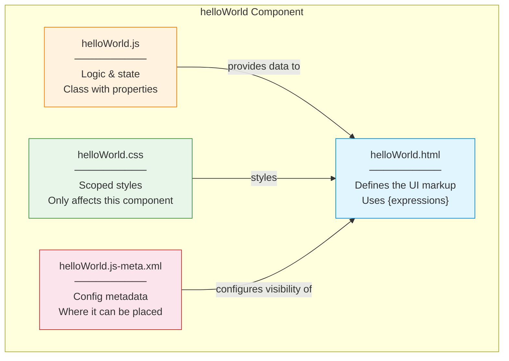
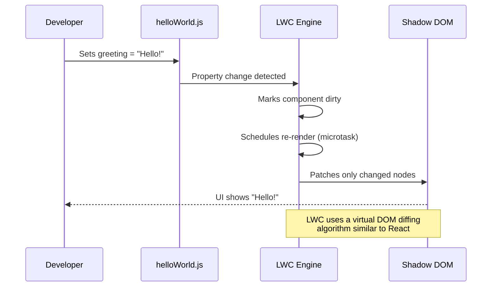

# 01 — 🌍 Hello World Component

> Your first Lightning Web Component — from zero to "Hello World" on screen.

---

## 🧠 What You'll Learn

| Concept | Description |
|---------|-------------|
| Component anatomy | The 4 files every LWC has |
| Template syntax | How `<template>` works |
| Reactive properties | Properties that auto-update the UI |
| `@api` decorator | Exposing public properties |
| Meta XML | Making the component visible in App Builder |

---

## 📐 Component Architecture



---

## ✅ Example 1: The Simplest Hello World

### 📄 helloWorld.html

```html
<!-- helloWorld.html -->
<!-- Every LWC template MUST be wrapped in a <template> tag -->
<!-- This is the root element — you cannot have anything outside it -->
<template>
    <!-- 
        {greeting} is a JavaScript expression.
        It reads the 'greeting' property from the JS class.
        Curly braces = one-way data binding (JS → HTML).
    -->
    <lightning-card title="Hello World" icon-name="standard:default">
        <div class="slds-m-around_medium">
            <p class="greeting-text">{greeting}</p>
        </div>
    </lightning-card>
</template>
```

> [!NOTE]
> `<lightning-card>` is a base Lightning component that gives you a styled card container. The `icon-name` uses the [SLDS icon library](https://www.lightningdesignsystem.com/icons/).

### 📄 helloWorld.js

```javascript
// helloWorld.js

// 1. Import the base class from the 'lwc' module
//    LightningElement is the base class ALL LWC components extend
//    Think of it like React.Component or Angular's Component class
import { LightningElement } from 'lwc';

// 2. Export your class as the DEFAULT export
//    The class name should be PascalCase (convention, not enforced)
//    It MUST extend LightningElement
export default class HelloWorld extends LightningElement {

    // 3. Declare a reactive property
    //    In LWC, any class field is automatically REACTIVE
    //    When this value changes, the template RE-RENDERS
    greeting = 'Hello, World! 🌍';

    // That's it! The framework handles:
    //   - Creating the component
    //   - Rendering the template
    //   - Binding {greeting} to this.greeting
    //   - Re-rendering if greeting ever changes
}
```

> [!IMPORTANT]
> **Reactive by default**: Unlike React (where you need `useState`) or Angular (where you need change detection), LWC class fields are automatically reactive. Change the value → UI updates.

### 📄 helloWorld.css

```css
/* helloWorld.css */

/*
 * CSS in LWC is SCOPED automatically.
 * These styles ONLY apply to helloWorld — they cannot leak
 * into parent, child, or sibling components.
 *
 * Under the hood, LWC uses Shadow DOM (or Synthetic Shadow)
 * to enforce style isolation.
 */

/* Style the greeting text */
.greeting-text {
    font-size: 24px;
    font-weight: bold;
    color: #032d60;                /* Salesforce dark blue */
    text-align: center;
    padding: 20px;
}

/* 
 * You can use :host to style the component's outer element itself.
 * :host is like styling the <c-hello-world> tag from inside.
 */
:host {
    display: block;
}
```

### 📄 helloWorld.js-meta.xml

```xml
<?xml version="1.0" encoding="UTF-8"?>
<!-- 
    This metadata file tells Salesforce WHERE this component can be used.
    Without this file, the component won't show up anywhere.
-->
<LightningComponentBundle xmlns="http://soap.sforce.com/2006/04/metadata">
    
    <!-- API version determines which Salesforce features are available -->
    <apiVersion>62.0</apiVersion>

    <!-- isExposed=true means it will appear in Lightning App Builder -->
    <isExposed>true</isExposed>

    <!-- targets = WHERE the component can be placed -->
    <targets>
        <!-- Lightning App Builder pages -->
        <target>lightning__AppPage</target>
        <!-- Record detail pages -->
        <target>lightning__RecordPage</target>
        <!-- Home page -->
        <target>lightning__HomePage</target>
    </targets>
</LightningComponentBundle>
```

---

## 🧪 How to Deploy and Test

### Step 1: Create the component

```bash
sf lightning generate component --type lwc --name helloWorld \
  --output-dir force-app/main/default/lwc
```

### Step 2: Replace file contents with the code above

### Step 3: Deploy

```bash
sf project deploy start --source-dir force-app/main/default/lwc/helloWorld
```

### Step 4: Add to a page

1. `sf org open`
2. **Setup → Lightning App Builder → New → App Page**
3. Choose "One Column"
4. Drag **helloWorld** from the Custom section
5. **Save → Activate → Assign to Apps → Save**

---

## ✅ Example 2: With Public Properties (`@api`)

This version accepts a `name` property from a parent component or App Builder.

### 📄 helloWorldConfigurable.html

```html
<template>
    <lightning-card title="Configurable Hello" icon-name="standard:greeting_channel">
        <div class="slds-m-around_medium">
            <!-- 
                {greeting} is a computed value (getter) 
                that combines a prefix with the name property.
            -->
            <p class="greeting-text">{greeting}</p>

            <!-- 
                lightning-input fires the 'change' event.
                onchange calls our handleNameChange method.
            -->
            <lightning-input
                label="Enter your name"
                value={name}
                onchange={handleNameChange}
                class="slds-m-top_medium"
            ></lightning-input>
        </div>
    </lightning-card>
</template>
```

### 📄 helloWorldConfigurable.js

```javascript
// helloWorldConfigurable.js
import { LightningElement, api } from 'lwc';
//                           ^^^ Import the @api decorator

export default class HelloWorldConfigurable extends LightningElement {

    // @api makes this property PUBLIC
    // - It can be set by a parent component: <c-hello-world-configurable name="Alice">
    // - It can be set in Lightning App Builder (see the meta XML targetConfigs)
    // - It's part of the component's public API (contract)
    @api name = 'World';

    // A GETTER acts as a computed property
    // It recalculates every time a dependency (this.name) changes
    // Getters are READ-ONLY — you cannot set them
    get greeting() {
        return `Hello, ${this.name}! 👋`;
    }

    // Event handler for the lightning-input
    // The event object contains the new value at event.target.value
    handleNameChange(event) {
        // NOTE: We cannot set an @api property from inside the component.
        // @api props are READ-ONLY from the child's perspective.
        // So we use a private backing field pattern OR just track it differently.
        // For simplicity here, we'll use a private property:
        this._internalName = event.target.value;
    }

    // Updated getter that checks the internal override first
    // (This pattern is common when you want both external and internal control)
}
```

> [!WARNING]
> **Never assign to an `@api` property from inside the component.** The `@api` decorator creates a property that the *parent* owns. If you need to modify it internally, use a private backing property (`_name`) and update it there.

### 📄 helloWorldConfigurable.js-meta.xml

```xml
<?xml version="1.0" encoding="UTF-8"?>
<LightningComponentBundle xmlns="http://soap.sforce.com/2006/04/metadata">
    <apiVersion>62.0</apiVersion>
    <isExposed>true</isExposed>

    <targets>
        <target>lightning__AppPage</target>
        <target>lightning__RecordPage</target>
        <target>lightning__HomePage</target>
    </targets>

    <!-- targetConfigs lets you define App Builder properties -->
    <targetConfigs>
        <!-- This config applies to App Pages -->
        <targetConfig targets="lightning__AppPage">
            <!-- 
                'name' becomes a field in the App Builder property panel.
                Admins can set this without writing code!
            -->
            <property name="name" type="String" label="Recipient Name" default="World"
                      description="The name to greet" />
        </targetConfig>

        <!-- You can have different configs for different targets -->
        <targetConfig targets="lightning__RecordPage">
            <property name="name" type="String" label="Recipient Name" default="World" />
            <!-- On record pages, you can also filter by object -->
            <objects>
                <object>Account</object>
                <object>Contact</object>
            </objects>
        </targetConfig>
    </targetConfigs>
</LightningComponentBundle>
```

---

## ✅ Example 3: With Styled Variations

### 📄 helloWorldStyled.html

```html
<template>
    <lightning-card title="Styled Hello World" icon-name="standard:canvas">
        <div class="slds-m-around_medium">
            <!-- Dynamic CSS class binding using a getter -->
            <div class={cardClass}>
                <p class="greeting">{greeting}</p>
                <p class="subtitle">Built with Lightning Web Components ⚡</p>
            </div>

            <!-- Buttons to switch theme -->
            <div class="slds-m-top_medium button-group">
                <lightning-button
                    label="Default Theme"
                    onclick={handleDefaultTheme}
                    variant="neutral"
                ></lightning-button>
                <lightning-button
                    label="Success Theme"
                    onclick={handleSuccessTheme}
                    variant="brand"
                    class="slds-m-left_x-small"
                ></lightning-button>
                <lightning-button
                    label="Warning Theme"
                    onclick={handleWarningTheme}
                    variant="destructive"
                    class="slds-m-left_x-small"
                ></lightning-button>
            </div>
        </div>
    </lightning-card>
</template>
```

### 📄 helloWorldStyled.js

```javascript
// helloWorldStyled.js
import { LightningElement } from 'lwc';

export default class HelloWorldStyled extends LightningElement {

    greeting = 'Hello, Beautiful World! 🌈';

    // Private reactive property tracking the current theme
    currentTheme = 'default';

    // Getter that returns a CSS class string based on the current theme
    // This is the LWC pattern for dynamic styling
    get cardClass() {
        // Template literals build the class string
        return `card-container theme-${this.currentTheme}`;
    }

    handleDefaultTheme() {
        this.currentTheme = 'default';
    }

    handleSuccessTheme() {
        this.currentTheme = 'success';
    }

    handleWarningTheme() {
        this.currentTheme = 'warning';
    }
}
```

### 📄 helloWorldStyled.css

```css
/* helloWorldStyled.css */

/* Base card container */
.card-container {
    padding: 30px;
    border-radius: 12px;
    text-align: center;
    transition: all 0.3s ease;        /* Smooth theme transitions */
}

/* Theme: Default — Salesforce blue */
.theme-default {
    background: linear-gradient(135deg, #1b96ff, #032d60);
    color: white;
}

/* Theme: Success — Green */
.theme-success {
    background: linear-gradient(135deg, #2e844a, #194d23);
    color: white;
}

/* Theme: Warning — Orange/Red */
.theme-warning {
    background: linear-gradient(135deg, #fe5c4c, #ba0517);
    color: white;
}

.greeting {
    font-size: 28px;
    font-weight: bold;
    margin-bottom: 8px;
}

.subtitle {
    font-size: 14px;
    opacity: 0.85;
}

.button-group {
    text-align: center;
}

:host {
    display: block;
}
```

---

## 🔬 Deep Dive: How LWC Rendering Works



> [!TIP]
> LWC batches multiple property changes into a single re-render. If you set `this.greeting = 'Hi'` and `this.name = 'Alice'` in the same synchronous block, the template re-renders only once.

---

## 📝 Practice Exercises

1. **Modify the greeting** to include the current date using `new Date().toLocaleDateString()`
2. **Add a button** that changes the greeting when clicked
3. **Add a counter** that shows how many times the button was clicked
4. **Create a "dark mode" toggle** using dynamic CSS classes

---

## 🔑 Key Takeaways

| Concept | Key Point |
|---------|-----------|
| **Template** | Must be wrapped in `<template>` — it's the single root |
| **Reactive fields** | Class fields are reactive by default — change value = re-render |
| **`@api`** | Makes properties public (settable by parent or App Builder) |
| **Getters** | Act as computed properties — recalculate when dependencies change |
| **CSS scoping** | Styles are automatically scoped — no leaking in or out |
| **Meta XML** | Required for the component to appear in Lightning App Builder |
| **`:host`** | Styles the component's own outer element from inside |

---

*Next: [02 — Data Binding →](./02-data-binding.md)*
