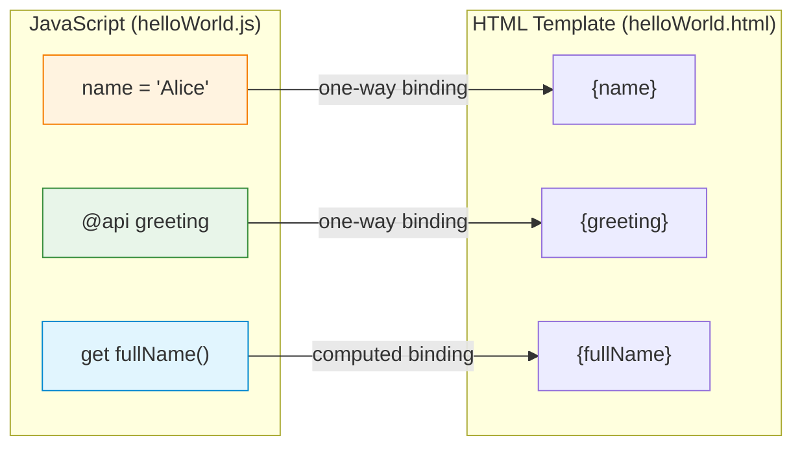
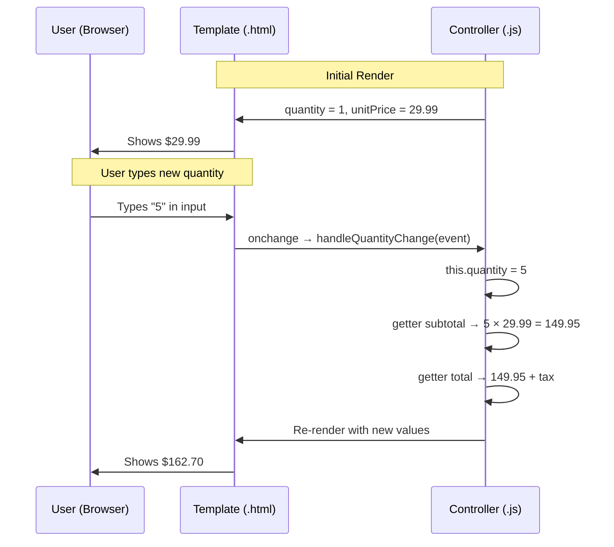

# 02 — 🔗 Data Binding

> Understanding how data flows from JavaScript to HTML — the backbone of every LWC.

---

## 🧠 What You'll Learn

| Concept | Description |
|---------|-------------|
| One-way binding | How `{expression}` renders data from JS → HTML |
| `@api` properties | Public properties set by a parent or App Builder |
| Reactive fields | Private properties that trigger re-renders |
| Computed properties | Getters that derive values from other properties |
| Dynamic styling | Binding CSS classes and inline styles dynamically |

---

## 📐 Data Binding Model



> [!IMPORTANT]
> LWC uses **one-way data binding** only (JS → HTML). There is no two-way binding like Angular's `[(ngModel)]`. To get data from HTML back to JS, you use **event handlers** (e.g., `onchange`).

---

## ✅ Example 1: One-Way Binding with `@api`

A child component that receives data from its parent.

### 📄 userCard.html

```html
<!-- userCard.html -->
<template>
    <lightning-card title="User Card" icon-name="standard:user">
        <div class="slds-m-around_medium">
            <!-- 
                {firstName} and {lastName} are @api properties.
                The PARENT component sets these values.
                The child only READS them — never assigns to them.
            -->
            <div class="user-info">
                <p class="user-name">{firstName} {lastName}</p>
                <p class="user-role">{role}</p>

                <!-- 
                    {email} is directly bound.
                    If the parent changes email, this re-renders automatically.
                -->
                <p class="user-email">
                    <lightning-icon icon-name="utility:email" size="x-small"></lightning-icon>
                    &nbsp; {email}
                </p>
            </div>

            <!-- 
                {initials} is a GETTER (computed property).
                It derives its value from firstName and lastName.
            -->
            <div class="avatar">
                <span class="avatar-text">{initials}</span>
            </div>
        </div>
    </lightning-card>
</template>
```

### 📄 userCard.js

```javascript
// userCard.js
import { LightningElement, api } from 'lwc';

export default class UserCard extends LightningElement {

    // ─── @api properties (PUBLIC) ──────────────────────────────
    // These form the component's PUBLIC API.
    // A parent component passes values to them:
    //   <c-user-card first-name="Alice" last-name="Smith"></c-user-card>
    //
    // NOTE: camelCase in JS → kebab-case in HTML
    //   firstName → first-name
    //   lastName  → last-name

    @api firstName = '';
    @api lastName = '';
    @api email = '';
    @api role = 'User';

    // ─── Computed property (GETTER) ────────────────────────────
    // Getters are recalculated every time the component re-renders.
    // They should be PURE functions (no side effects).
    get initials() {
        const first = this.firstName ? this.firstName.charAt(0) : '';
        const last = this.lastName ? this.lastName.charAt(0) : '';
        return `${first}${last}`.toUpperCase();
    }

    // You can have getters that depend on OTHER getters
    get hasEmail() {
        return this.email && this.email.length > 0;
    }

    get displayRole() {
        // Derived from @api role with formatting
        return this.role ? this.role.toUpperCase() : 'N/A';
    }
}
```

### 📄 userCard.css

```css
/* userCard.css */
.user-info {
    display: flex;
    flex-direction: column;
    gap: 4px;
}

.user-name {
    font-size: 20px;
    font-weight: bold;
    color: #032d60;
}

.user-role {
    font-size: 12px;
    color: #706e6b;
    text-transform: uppercase;
    letter-spacing: 1px;
}

.user-email {
    font-size: 14px;
    color: #0176d3;
    display: flex;
    align-items: center;
}

.avatar {
    width: 60px;
    height: 60px;
    border-radius: 50%;
    background: linear-gradient(135deg, #1b96ff, #032d60);
    display: flex;
    align-items: center;
    justify-content: center;
    position: absolute;
    top: 20px;
    right: 20px;
}

.avatar-text {
    color: white;
    font-size: 20px;
    font-weight: bold;
}

:host {
    display: block;
    position: relative;
}
```

### 📄 userCard.js-meta.xml

```xml
<?xml version="1.0" encoding="UTF-8"?>
<LightningComponentBundle xmlns="http://soap.sforce.com/2006/04/metadata">
    <apiVersion>62.0</apiVersion>
    <isExposed>true</isExposed>
    <targets>
        <target>lightning__AppPage</target>
        <target>lightning__RecordPage</target>
        <target>lightning__HomePage</target>
    </targets>
    <targetConfigs>
        <targetConfig targets="lightning__AppPage,lightning__HomePage">
            <property name="firstName" type="String" label="First Name" default="Jane" />
            <property name="lastName" type="String" label="Last Name" default="Doe" />
            <property name="email" type="String" label="Email" default="jane@example.com" />
            <property name="role" type="String" label="Role" default="Administrator" />
        </targetConfig>
    </targetConfigs>
</LightningComponentBundle>
```

### Parent Component Usage

```html
<!-- parentApp.html -->
<template>
    <!-- 
        Note: camelCase JS properties → kebab-case HTML attributes.
        firstName → first-name
    -->
    <c-user-card
        first-name="Alice"
        last-name="Johnson"
        email="alice@example.com"
        role="Senior Developer"
    ></c-user-card>
</template>
```

---

## ✅ Example 2: Reactive Properties & Computed Getters

A pricing calculator that demonstrates reactive property chains.

### 📄 pricingCalculator.html

```html
<!-- pricingCalculator.html -->
<template>
    <lightning-card title="Pricing Calculator 💰" icon-name="standard:price_book_entry">
        <div class="slds-m-around_medium">

            <!-- Input: Quantity -->
            <lightning-input
                type="number"
                label="Quantity"
                value={quantity}
                min="1"
                onchange={handleQuantityChange}
            ></lightning-input>

            <!-- Input: Unit Price -->
            <lightning-input
                type="number"
                label="Unit Price ($)"
                value={unitPrice}
                min="0"
                step="0.01"
                formatter="currency"
                onchange={handlePriceChange}
                class="slds-m-top_small"
            ></lightning-input>

            <!-- Input: Discount -->
            <lightning-slider
                label={discountLabel}
                value={discountPercent}
                min="0"
                max="50"
                step="5"
                onchange={handleDiscountChange}
                class="slds-m-top_small"
            ></lightning-slider>

            <!-- Output: All computed values displayed -->
            <div class="results slds-m-top_medium">
                <div class="result-row">
                    <span>Subtotal:</span>
                    <span class="amount">{formattedSubtotal}</span>
                </div>
                <div class="result-row discount-row">
                    <span>Discount ({discountPercent}%):</span>
                    <span class="amount">-{formattedDiscount}</span>
                </div>
                <div class="result-row">
                    <span>Tax (8.5%):</span>
                    <span class="amount">{formattedTax}</span>
                </div>
                <div class="result-row total-row">
                    <span>Total:</span>
                    <span class="amount total">{formattedTotal}</span>
                </div>
            </div>
        </div>
    </lightning-card>
</template>
```

### 📄 pricingCalculator.js

```javascript
// pricingCalculator.js
import { LightningElement } from 'lwc';

// Constants — define outside the class for clarity
const TAX_RATE = 0.085; // 8.5%

export default class PricingCalculator extends LightningElement {

    // ─── Reactive properties ───────────────────────────────────
    // These are the "source of truth". All computed values derive from these.
    quantity = 1;
    unitPrice = 29.99;
    discountPercent = 0;

    // ─── Event handlers (HTML → JS) ───────────────────────────
    // These are the ONLY way to get data from the template back into JS.
    handleQuantityChange(event) {
        this.quantity = parseInt(event.target.value, 10) || 0;
        // When this.quantity changes, ALL dependent getters are re-evaluated
    }

    handlePriceChange(event) {
        this.unitPrice = parseFloat(event.target.value) || 0;
    }

    handleDiscountChange(event) {
        this.discountPercent = parseInt(event.detail.value, 10);
        // Note: lightning-slider uses event.detail.value, not event.target.value
    }

    // ─── Computed properties (GETTERS) ─────────────────────────
    // These form a DEPENDENCY CHAIN:
    //   quantity + unitPrice → subtotal → discount → afterDiscount → tax → total
    //
    // When ANY reactive property changes, ALL getters that depend on it
    // are automatically recalculated.

    get subtotal() {
        return this.quantity * this.unitPrice;
    }

    get discountAmount() {
        return this.subtotal * (this.discountPercent / 100);
    }

    get afterDiscount() {
        return this.subtotal - this.discountAmount;
    }

    get taxAmount() {
        return this.afterDiscount * TAX_RATE;
    }

    get total() {
        return this.afterDiscount + this.taxAmount;
    }

    // ─── Formatted getters for display ─────────────────────────
    // Separate formatting from calculation for clean code

    get formattedSubtotal() {
        return `$${this.subtotal.toFixed(2)}`;
    }

    get formattedDiscount() {
        return `$${this.discountAmount.toFixed(2)}`;
    }

    get formattedTax() {
        return `$${this.taxAmount.toFixed(2)}`;
    }

    get formattedTotal() {
        return `$${this.total.toFixed(2)}`;
    }

    get discountLabel() {
        return `Discount: ${this.discountPercent}%`;
    }
}
```

### 📄 pricingCalculator.css

```css
/* pricingCalculator.css */

.results {
    background-color: #f3f3f3;
    border-radius: 8px;
    padding: 16px;
}

.result-row {
    display: flex;
    justify-content: space-between;
    padding: 8px 0;
    font-size: 14px;
    color: #444;
}

.result-row + .result-row {
    border-top: 1px solid #e0e0e0;
}

.discount-row {
    color: #2e844a;
}

.total-row {
    border-top: 2px solid #032d60 !important;
    padding-top: 12px;
    margin-top: 4px;
}

.amount {
    font-weight: 600;
    font-family: 'SF Mono', 'Courier New', monospace;
}

.total {
    font-size: 20px;
    color: #032d60;
}

:host {
    display: block;
}
```

### 📄 pricingCalculator.js-meta.xml

```xml
<?xml version="1.0" encoding="UTF-8"?>
<LightningComponentBundle xmlns="http://soap.sforce.com/2006/04/metadata">
    <apiVersion>62.0</apiVersion>
    <isExposed>true</isExposed>
    <targets>
        <target>lightning__AppPage</target>
        <target>lightning__HomePage</target>
    </targets>
</LightningComponentBundle>
```

---

## ✅ Example 3: Dynamic Styling

A component that changes its appearance based on data.

### 📄 statusBadge.html

```html
<!-- statusBadge.html -->
<template>
    <div class={badgeClasses}>
        <!-- 
            Dynamic class binding: the getter badgeClasses 
            returns different class strings based on this.status.
        -->
        <lightning-icon icon-name={iconName} size="x-small"></lightning-icon>
        <span class="badge-label">{status}</span>
    </div>
</template>
```

### 📄 statusBadge.js

```javascript
// statusBadge.js
import { LightningElement, api } from 'lwc';

// Map status values to visual properties
const STATUS_CONFIG = {
    new:        { class: 'status-new',      icon: 'utility:new' },
    open:       { class: 'status-open',     icon: 'utility:open_folder' },
    closed:     { class: 'status-closed',   icon: 'utility:check' },
    escalated:  { class: 'status-escalated', icon: 'utility:warning' },
};

export default class StatusBadge extends LightningElement {

    // Public property — parent sets the status
    @api status = 'new';

    // Dynamic class getter
    // Returns a space-separated string of CSS classes
    get badgeClasses() {
        const config = STATUS_CONFIG[this.status.toLowerCase()] || STATUS_CONFIG.new;
        // Combine the base class with the status-specific class
        return `badge ${config.class}`;
    }

    // Dynamic icon getter
    get iconName() {
        const config = STATUS_CONFIG[this.status.toLowerCase()] || STATUS_CONFIG.new;
        return config.icon;
    }
}
```

### 📄 statusBadge.css

```css
/* statusBadge.css */

.badge {
    display: inline-flex;
    align-items: center;
    gap: 6px;
    padding: 4px 12px;
    border-radius: 16px;
    font-size: 12px;
    font-weight: 600;
    text-transform: uppercase;
}

.status-new {
    background-color: #e1f5fe;
    color: #01579b;
}

.status-open {
    background-color: #fff3e0;
    color: #e65100;
}

.status-closed {
    background-color: #e8f5e9;
    color: #1b5e20;
}

.status-escalated {
    background-color: #fce4ec;
    color: #b71c1c;
}
```

### 📄 statusBadge.js-meta.xml

```xml
<?xml version="1.0" encoding="UTF-8"?>
<LightningComponentBundle xmlns="http://soap.sforce.com/2006/04/metadata">
    <apiVersion>62.0</apiVersion>
    <isExposed>true</isExposed>
    <targets>
        <target>lightning__AppPage</target>
    </targets>
    <targetConfigs>
        <targetConfig targets="lightning__AppPage">
            <property name="status" type="String" label="Status" default="New"
                      datasource="New,Open,Closed,Escalated" />
        </targetConfig>
    </targetConfigs>
</LightningComponentBundle>
```

---

## 🔬 Data Binding Flow Diagram



---

## ⚠️ Common Mistakes

| Mistake | Why It Fails | Fix |
|---------|-------------|-----|
| `this.apiProp = 'x'` inside child | `@api` props are read-only from child | Use a private backing field |
| `{method()}` in template | Templates don't support method calls | Use a getter instead |
| `style={dynamicStyle}` | Inline styles are restricted | Use dynamic class binding |
| Mutating objects directly | LWC can't detect deep mutations | Reassign with spread: `this.obj = {...this.obj, key: val}` |

> [!CAUTION]
> **Object/array mutation trap**: If you have `this.items = [{name:'A'}]` and do `this.items[0].name = 'B'`, the UI **will not update**. You must create a new reference: `this.items = [...this.items]` after the mutation, or reassign the whole array.

---

## 🔑 Key Takeaways

| Concept | Key Point |
|---------|-----------|
| **One-way binding** | Data flows JS → HTML only. Use events for HTML → JS. |
| **`@api`** | Public property, set by parent, read-only from child |
| **Reactive fields** | Any class field triggers re-render when reassigned |
| **Getters** | Computed properties that auto-recalculate |
| **Dynamic classes** | Return class string from getter; no inline `style` binding |
| **Deep mutations** | Reassign arrays/objects — don't mutate in place |

---

*Previous: [01 — Hello World ←](./01-hello-world.md) · Next: [03 — Conditional Rendering →](./03-conditional-rendering.md)*
