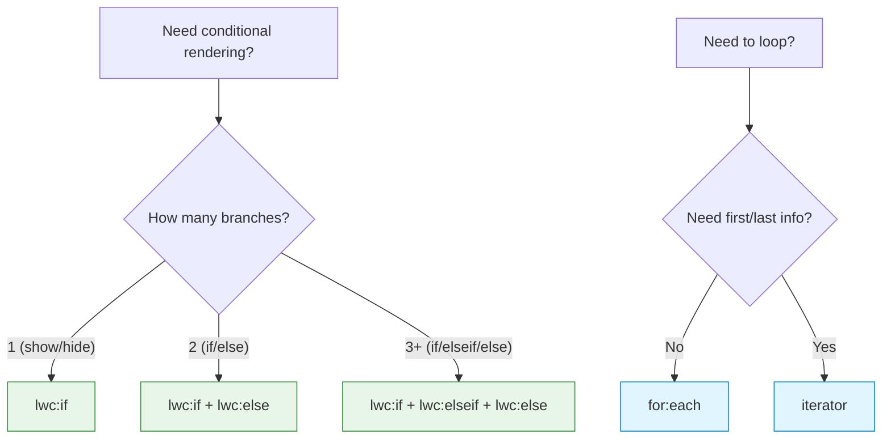
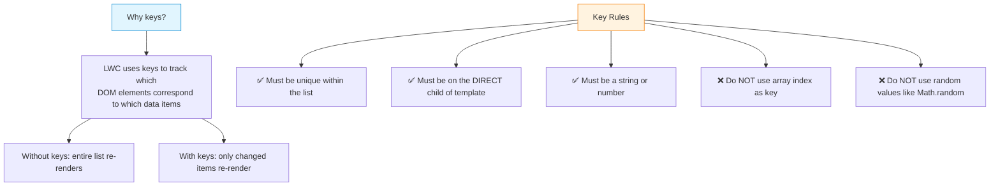

# 03 — 🔀 Conditional Rendering & Iteration

> Show, hide, and loop through elements — the building blocks of dynamic UIs.

---

## 🧠 What You'll Learn

| Concept | Description |
|---------|-------------|
| `lwc:if` / `lwc:elseif` / `lwc:else` | Modern conditional rendering (Spring '23+) |
| `if:true` / `if:false` | Legacy conditional rendering |
| `for:each` | Standard list iteration |
| `iterator` | Iteration with first/last awareness |
| `key` directive | Why and how to use keys |
| Nested loops | Lists within lists |

---

## 📐 Conditional Rendering Decision Tree



---

## ✅ Example 1: Modern Conditional Rendering (`lwc:if`)

### 📄 conditionalDemo.html

```html
<!-- conditionalDemo.html -->
<template>
    <lightning-card title="Conditional Rendering" icon-name="standard:flow">
        <div class="slds-m-around_medium">

            <!-- 
                ╔════════════════════════════════════════════════╗
                ║  MODERN SYNTAX: lwc:if / lwc:elseif / lwc:else ║
                ║  Available since Spring '23 (API 57.0+)        ║
                ╚════════════════════════════════════════════════╝
            -->

            <!-- Toggle controls -->
            <lightning-combobox
                label="User Status"
                value={userStatus}
                options={statusOptions}
                onchange={handleStatusChange}
            ></lightning-combobox>

            <!-- 
                lwc:if, lwc:elseif, and lwc:else MUST be on 
                IMMEDIATE SIBLING elements. No other elements 
                can appear between them.
            -->
            <div class="status-display slds-m-top_medium">

                <!-- Branch 1: Active -->
                <div lwc:if={isActive} class="status-card active">
                    <lightning-icon icon-name="utility:success" variant="inverse"></lightning-icon>
                    <p>User is <strong>Active</strong> — full access granted.</p>
                </div>

                <!-- Branch 2: Suspended -->
                <div lwc:elseif={isSuspended} class="status-card suspended">
                    <lightning-icon icon-name="utility:warning" variant="inverse"></lightning-icon>
                    <p>User is <strong>Suspended</strong> — limited access.</p>
                </div>

                <!-- Branch 3: Inactive -->
                <div lwc:elseif={isInactive} class="status-card inactive">
                    <lightning-icon icon-name="utility:ban" variant="inverse"></lightning-icon>
                    <p>User is <strong>Inactive</strong> — no access.</p>
                </div>

                <!-- Default branch: Unknown -->
                <div lwc:else class="status-card unknown">
                    <lightning-icon icon-name="utility:question_mark" variant="inverse"></lightning-icon>
                    <p>Unknown status — please select a status.</p>
                </div>

            </div>

            <!-- 
                ╔════════════════════════════════════════════╗
                ║  SIMPLE SHOW/HIDE with lwc:if              ║
                ╚════════════════════════════════════════════╝
            -->
            <div class="slds-m-top_large">
                <lightning-input
                    type="toggle"
                    label="Show Details"
                    checked={showDetails}
                    onchange={handleToggleDetails}
                ></lightning-input>

                <!-- Simple conditional — no else branch needed -->
                <div lwc:if={showDetails} class="details-panel slds-m-top_small">
                    <p>🔍 Here are the detailed settings for this user...</p>
                    <p>Last login: 2 hours ago</p>
                    <p>Session timeout: 30 minutes</p>
                </div>
            </div>
        </div>
    </lightning-card>
</template>
```

### 📄 conditionalDemo.js

```javascript
// conditionalDemo.js
import { LightningElement } from 'lwc';

export default class ConditionalDemo extends LightningElement {

    // ─── Reactive properties ───────────────────────────────────
    userStatus = 'active';
    showDetails = false;

    // ─── Combobox options ──────────────────────────────────────
    get statusOptions() {
        return [
            { label: 'Active', value: 'active' },
            { label: 'Suspended', value: 'suspended' },
            { label: 'Inactive', value: 'inactive' },
            { label: 'Unknown', value: 'unknown' },
        ];
    }

    // ─── Computed booleans for lwc:if/elseif ───────────────────
    // Each getter returns a boolean that the template evaluates.
    // lwc:if={isActive} calls this getter and checks the result.

    get isActive() {
        return this.userStatus === 'active';
    }

    get isSuspended() {
        return this.userStatus === 'suspended';
    }

    get isInactive() {
        return this.userStatus === 'inactive';
    }

    // ─── Event handlers ────────────────────────────────────────
    handleStatusChange(event) {
        this.userStatus = event.detail.value;
    }

    handleToggleDetails(event) {
        this.showDetails = event.target.checked;
    }
}
```

### 📄 conditionalDemo.css

```css
/* conditionalDemo.css */
.status-card {
    display: flex;
    align-items: center;
    gap: 12px;
    padding: 16px;
    border-radius: 8px;
    color: white;
}

.active {
    background: linear-gradient(135deg, #2e844a, #1a5c2e);
}

.suspended {
    background: linear-gradient(135deg, #e65100, #bf360c);
}

.inactive {
    background: linear-gradient(135deg, #6b6b6b, #444);
}

.unknown {
    background: linear-gradient(135deg, #0176d3, #032d60);
}

.details-panel {
    background-color: #f3f3f3;
    padding: 16px;
    border-radius: 8px;
    border-left: 4px solid #0176d3;
}
```

### 📄 conditionalDemo.js-meta.xml

```xml
<?xml version="1.0" encoding="UTF-8"?>
<LightningComponentBundle xmlns="http://soap.sforce.com/2006/04/metadata">
    <apiVersion>62.0</apiVersion>
    <isExposed>true</isExposed>
    <targets>
        <target>lightning__AppPage</target>
        <target>lightning__HomePage</target>
    </targets>
</LightningComponentBundle>
```

> [!WARNING]
> **Legacy syntax `if:true` / `if:false`** is deprecated as of Spring '23. Always use `lwc:if` / `lwc:elseif` / `lwc:else` for new development. The legacy syntax does not support `elseif`.

---

## ✅ Example 2: Legacy Conditional Rendering (`if:true` / `if:false`)

```html
<!-- legacyConditional.html — FOR REFERENCE ONLY, use lwc:if instead -->
<template>
    <lightning-card title="Legacy Conditionals">
        <div class="slds-m-around_medium">
            <!-- if:true shows the element when the expression is truthy -->
            <p if:true={isLoggedIn}>Welcome back, {username}!</p>

            <!-- if:false shows the element when the expression is falsy -->
            <p if:false={isLoggedIn}>Please log in to continue.</p>

            <!-- 
                ⚠️ LIMITATIONS of legacy syntax:
                1. No elseif — you need nested if:true/if:false
                2. if:true and if:false are NOT guaranteed siblings
                3. Deprecated and will be removed in future
            -->
        </div>
    </lightning-card>
</template>
```

> [!CAUTION]
> **Do NOT use `if:true`/`if:false` in new code.** It is deprecated and the framework will remove it. Use `lwc:if`/`lwc:elseif`/`lwc:else` instead.

---

## ✅ Example 3: List Rendering with `for:each`

### 📄 taskList.html

```html
<!-- taskList.html -->
<template>
    <lightning-card title="Task List 📋" icon-name="standard:task">
        <div class="slds-m-around_medium">

            <!-- Add task form -->
            <div class="add-task-form">
                <lightning-input
                    label="New Task"
                    value={newTaskName}
                    placeholder="Enter task name..."
                    onchange={handleTaskNameChange}
                    onkeyup={handleKeyUp}
                ></lightning-input>
                <lightning-button
                    label="Add Task"
                    variant="brand"
                    onclick={handleAddTask}
                    disabled={isAddDisabled}
                    class="slds-m-top_small"
                ></lightning-button>
            </div>

            <!-- 
                ╔══════════════════════════════════════════════╗
                ║  for:each — Standard List Iteration          ║
                ╚══════════════════════════════════════════════╝
                
                for:each={arrayProperty} iterates over the array.
                for:item="variableName" assigns each element to a variable.
                key={uniqueId} is REQUIRED — tells LWC how to track elements.
            -->
            <ul class="task-list slds-m-top_medium">
                <template for:each={tasks} for:item="task">
                    <!-- 
                        key MUST be on the DIRECT child of template.
                        Use a stable, unique identifier — NOT the array index.
                    -->
                    <li key={task.id} class="task-item">
                        <lightning-input
                            type="checkbox"
                            label={task.name}
                            checked={task.completed}
                            data-id={task.id}
                            onchange={handleToggleTask}
                        ></lightning-input>
                        <lightning-button-icon
                            icon-name="utility:delete"
                            variant="bare"
                            alternative-text="Delete"
                            data-id={task.id}
                            onclick={handleDeleteTask}
                        ></lightning-button-icon>
                    </li>
                </template>
            </ul>

            <!-- Show message when list is empty -->
            <div lwc:if={isEmpty} class="empty-state slds-m-top_medium">
                <p>🎉 No tasks! Add one above.</p>
            </div>

            <!-- Summary -->
            <div lwc:if={hasTasks} class="summary slds-m-top_medium">
                <p>{completedCount} of {totalCount} tasks completed</p>
            </div>
        </div>
    </lightning-card>
</template>
```

### 📄 taskList.js

```javascript
// taskList.js
import { LightningElement } from 'lwc';

// Counter for generating unique IDs
let nextId = 1;

export default class TaskList extends LightningElement {

    // ─── Properties ────────────────────────────────────────────
    newTaskName = '';

    // Array of task objects — each MUST have a unique key field
    tasks = [
        { id: nextId++, name: 'Learn LWC basics', completed: true },
        { id: nextId++, name: 'Build first component', completed: false },
        { id: nextId++, name: 'Deploy to org', completed: false },
    ];

    // ─── Computed properties ───────────────────────────────────
    get isEmpty() {
        return this.tasks.length === 0;
    }

    get hasTasks() {
        return this.tasks.length > 0;
    }

    get totalCount() {
        return this.tasks.length;
    }

    get completedCount() {
        return this.tasks.filter(t => t.completed).length;
    }

    get isAddDisabled() {
        return !this.newTaskName || this.newTaskName.trim() === '';
    }

    // ─── Event handlers ────────────────────────────────────────
    handleTaskNameChange(event) {
        this.newTaskName = event.target.value;
    }

    handleKeyUp(event) {
        // Add task on Enter key
        if (event.keyCode === 13 && !this.isAddDisabled) {
            this.handleAddTask();
        }
    }

    handleAddTask() {
        // IMPORTANT: Create a NEW array (don't push onto existing)
        // LWC won't detect mutations to existing arrays
        this.tasks = [
            ...this.tasks,
            {
                id: nextId++,
                name: this.newTaskName.trim(),
                completed: false
            }
        ];
        this.newTaskName = ''; // Reset input
    }

    handleToggleTask(event) {
        const taskId = parseInt(event.target.dataset.id, 10);
        // Map creates a NEW array — LWC detects the change
        this.tasks = this.tasks.map(task => {
            if (task.id === taskId) {
                // Spread creates a NEW object — necessary for reactivity
                return { ...task, completed: event.target.checked };
            }
            return task;
        });
    }

    handleDeleteTask(event) {
        const taskId = parseInt(event.currentTarget.dataset.id, 10);
        // Filter creates a NEW array
        this.tasks = this.tasks.filter(task => task.id !== taskId);
    }
}
```

### 📄 taskList.css

```css
/* taskList.css */
.add-task-form {
    display: flex;
    gap: 12px;
    align-items: flex-end;
}

.task-list {
    list-style: none;
    padding: 0;
    margin: 0;
}

.task-item {
    display: flex;
    justify-content: space-between;
    align-items: center;
    padding: 8px 12px;
    border-bottom: 1px solid #e5e5e5;
    transition: background-color 0.15s;
}

.task-item:hover {
    background-color: #f7f9fb;
}

.empty-state {
    text-align: center;
    padding: 24px;
    color: #706e6b;
}

.summary {
    font-size: 13px;
    color: #706e6b;
    text-align: right;
}
```

---

## ✅ Example 4: The `iterator` Directive

Use `iterator` when you need to know if an item is the **first** or **last** in the list.

### 📄 stepWizard.html

```html
<!-- stepWizard.html -->
<template>
    <lightning-card title="Setup Wizard" icon-name="standard:steps">
        <div class="slds-m-around_medium">

            <!--
                ╔════════════════════════════════════════════════════╗
                ║  iterator:iteratorName={array}                     ║
                ║                                                    ║
                ║  iteratorName.value  → current item                ║
                ║  iteratorName.index  → current index (0-based)     ║
                ║  iteratorName.first  → true if first item          ║
                ║  iteratorName.last   → true if last item           ║
                ╚════════════════════════════════════════════════════╝
            -->
            <div class="wizard-container">
                <template iterator:step={steps}>
                    <div key={step.value.id} class="step-wrapper">

                        <!-- First item: show "START" badge -->
                        <div lwc:if={step.first} class="step-badge start-badge">
                            🚀 START
                        </div>

                        <!-- The step card itself -->
                        <div class={step.value.stepClass}>
                            <div class="step-number">{step.value.number}</div>
                            <div class="step-content">
                                <h3>{step.value.title}</h3>
                                <p>{step.value.description}</p>
                            </div>
                        </div>

                        <!-- Connector line between steps (not after last) -->
                        <div lwc:if={step.value.showConnector} class="connector"></div>

                        <!-- Last item: show "FINISH" badge -->
                        <div lwc:if={step.last} class="step-badge finish-badge">
                            🏁 FINISH
                        </div>
                    </div>
                </template>
            </div>
        </div>
    </lightning-card>
</template>
```

### 📄 stepWizard.js

```javascript
// stepWizard.js
import { LightningElement } from 'lwc';

export default class StepWizard extends LightningElement {

    currentStep = 2; // Which step is currently active (1-based)

    rawSteps = [
        { id: '1', number: 1, title: 'Create Project', description: 'Set up your SFDX project' },
        { id: '2', number: 2, title: 'Write Component', description: 'Build your first LWC' },
        { id: '3', number: 3, title: 'Deploy', description: 'Push to your Salesforce org' },
        { id: '4', number: 4, title: 'Test', description: 'Verify in the browser' },
    ];

    // Enrich raw steps with computed visual properties
    get steps() {
        return this.rawSteps.map((step, index) => {
            const isCompleted = step.number < this.currentStep;
            const isCurrent = step.number === this.currentStep;
            const isLast = index === this.rawSteps.length - 1;

            let stepClass = 'step';
            if (isCompleted) stepClass += ' step-completed';
            else if (isCurrent) stepClass += ' step-current';
            else stepClass += ' step-pending';

            return {
                ...step,
                stepClass,
                showConnector: !isLast, // No line after the last step
            };
        });
    }
}
```

### 📄 stepWizard.css

```css
/* stepWizard.css */
.wizard-container {
    display: flex;
    flex-direction: column;
    align-items: stretch;
}

.step-wrapper {
    display: flex;
    flex-direction: column;
    align-items: center;
}

.step {
    display: flex;
    align-items: center;
    gap: 16px;
    padding: 16px;
    border-radius: 8px;
    width: 100%;
    transition: all 0.3s;
}

.step-completed {
    background-color: #e8f5e9;
    border: 2px solid #2e844a;
}

.step-current {
    background-color: #e1f5fe;
    border: 2px solid #0176d3;
    box-shadow: 0 2px 8px rgba(1, 118, 211, 0.25);
}

.step-pending {
    background-color: #f3f3f3;
    border: 2px solid #ccc;
    opacity: 0.7;
}

.step-number {
    width: 36px;
    height: 36px;
    border-radius: 50%;
    background: #032d60;
    color: white;
    display: flex;
    align-items: center;
    justify-content: center;
    font-weight: bold;
    flex-shrink: 0;
}

.step-content h3 {
    margin: 0;
    font-size: 16px;
}

.step-content p {
    margin: 4px 0 0;
    font-size: 13px;
    color: #706e6b;
}

.connector {
    width: 2px;
    height: 20px;
    background-color: #ccc;
}

.step-badge {
    padding: 4px 12px;
    border-radius: 12px;
    font-size: 12px;
    font-weight: bold;
    margin: 8px 0;
}

.start-badge {
    background-color: #e8f5e9;
    color: #2e844a;
}

.finish-badge {
    background-color: #e1f5fe;
    color: #0176d3;
}
```

### 📄 stepWizard.js-meta.xml

```xml
<?xml version="1.0" encoding="UTF-8"?>
<LightningComponentBundle xmlns="http://soap.sforce.com/2006/04/metadata">
    <apiVersion>62.0</apiVersion>
    <isExposed>true</isExposed>
    <targets>
        <target>lightning__AppPage</target>
    </targets>
</LightningComponentBundle>
```

---

## ✅ Example 5: Nested Loops

Rendering a list of categories, each with its own list of items.

### 📄 Nested Loop Template (nestedList.html)

```html
<!-- nestedList.html -->
<template>
    <lightning-card title="Product Catalog" icon-name="standard:product">
        <div class="slds-m-around_medium">
            <!-- Outer loop: categories -->
            <template for:each={categories} for:item="category">
                <div key={category.id} class="category-section">
                    <h2 class="category-title">{category.name}</h2>
                    <p class="category-desc">{category.description}</p>

                    <!-- Inner loop: products within each category -->
                    <ul class="product-list">
                        <template for:each={category.products} for:item="product">
                            <li key={product.id} class="product-item">
                                <span class="product-name">{product.name}</span>
                                <span class="product-price">{product.price}</span>
                            </li>
                        </template>
                    </ul>

                    <!-- Show message if category is empty -->
                    <p lwc:if={category.isEmpty} class="empty-msg">
                        No products in this category.
                    </p>
                </div>
            </template>
        </div>
    </lightning-card>
</template>
```

### 📄 Nested Loop JS (nestedList.js)

```javascript
// nestedList.js
import { LightningElement } from 'lwc';

export default class NestedList extends LightningElement {

    categories = [
        {
            id: 'cat1',
            name: 'Electronics',
            description: 'Gadgets and devices',
            isEmpty: false,
            products: [
                { id: 'p1', name: 'Laptop', price: '$999' },
                { id: 'p2', name: 'Headphones', price: '$149' },
                { id: 'p3', name: 'Tablet', price: '$499' },
            ]
        },
        {
            id: 'cat2',
            name: 'Books',
            description: 'Knowledge at your fingertips',
            isEmpty: false,
            products: [
                { id: 'p4', name: 'LWC Guide', price: '$39' },
                { id: 'p5', name: 'Apex Patterns', price: '$45' },
            ]
        },
        {
            id: 'cat3',
            name: 'Coming Soon',
            description: 'Stay tuned!',
            isEmpty: true,
            products: []
        }
    ];
}
```

---

## 🔑 Key Management Rules



> [!TIP]
> **Best practice for keys**: Use a database ID (like `record.Id`), a unique field, or a monotonically increasing counter. Never use array indices because they shift when items are added or removed, causing unnecessary re-renders and potential bugs.

---

## ⚠️ Common Mistakes

| Mistake | Problem | Fix |
|---------|---------|-----|
| Missing `key` on `for:each` | Runtime error | Add `key={item.id}` on direct child |
| `key` on wrong element | Key must be on template's direct child | Move `key` to the first element inside `<template for:each>` |
| Elements between `lwc:if` siblings | `lwc:elseif`/`lwc:else` must be adjacent | Remove any elements between if/elseif/else |
| `lwc:else` with a value | `lwc:else` takes no value | Use `lwc:else` not `lwc:else={something}` |
| Array index as key | Causes re-render bugs on add/remove | Use a stable unique ID |
| `{array.length}` in template | Works! But `{array.length > 0}` doesn't | Use a getter for comparisons |

---

## 📊 `for:each` vs `iterator` Comparison

| Feature | `for:each` | `iterator` |
|---------|-----------|-----------|
| Basic iteration | ✅ | ✅ |
| Access to current item | `for:item="x"` → `{x.field}` | `iterator:x` → `{x.value.field}` |
| Access to index | ❌ (use getter) | `{x.index}` |
| First item detection | ❌ | `{x.first}` |
| Last item detection | ❌ | `{x.last}` |
| Syntax complexity | Simpler | Slightly more verbose |
| **Recommendation** | Default choice | Only when you need first/last |

---

## 🔑 Key Takeaways

| Concept | Key Point |
|---------|-----------|
| **`lwc:if`** | Modern conditional — use this, not `if:true` |
| **`lwc:elseif` / `lwc:else`** | Must be immediate siblings of `lwc:if` |
| **`for:each`** | Default choice for list iteration |
| **`iterator`** | Use when you need `.first` or `.last` |
| **`key`** | Required, unique, stable — never use array index |
| **Nested loops** | Each loop needs its own `for:each` and `key` |
| **Template expressions** | Cannot do comparisons (`>`, `===`) in template — use getters |

---

*Previous: [02 — Data Binding ←](./02-data-binding.md) · Next: [04 — Event Handling →](./04-event-handling.md)*
