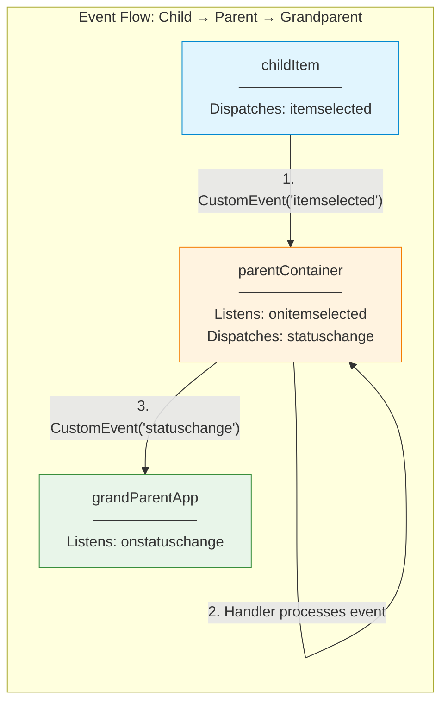
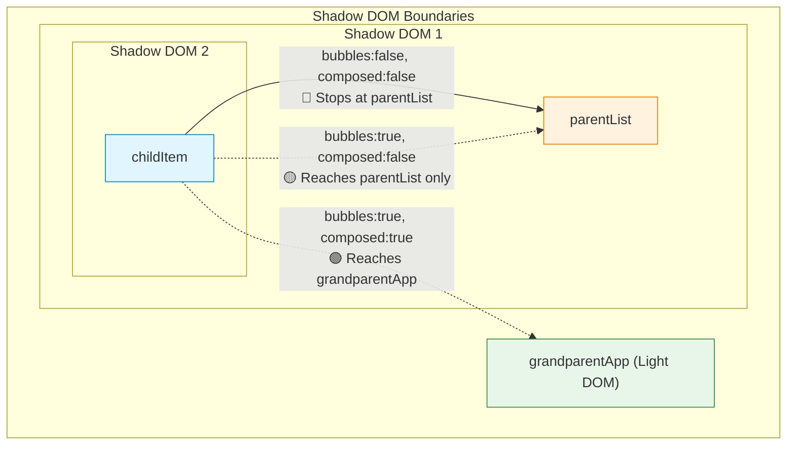
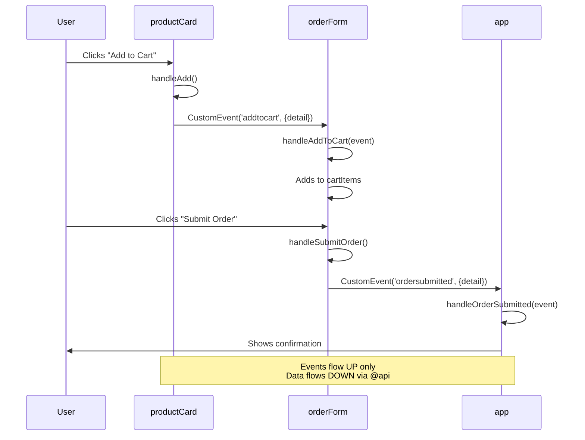

# 04 — ⚡ Event Handling

> Master the event system — the primary mechanism for child-to-parent communication in LWC.

---

## 🧠 What You'll Learn

| Concept | Description |
|---------|-------------|
| DOM event handling | Responding to clicks, changes, keypresses |
| Custom events | Creating and dispatching your own events |
| Event bubbling | How events travel up the DOM tree |
| Event composition | Whether events cross Shadow DOM boundaries |
| Data payloads | Passing data through `event.detail` |
| Parent–child events | Complete communication patterns |

---

## 📐 Event Flow Architecture



> [!IMPORTANT]
> Events in LWC flow **upward only** (child → parent). To send data downward, use `@api` properties. This is the fundamental communication pattern of LWC.

---

## ✅ Example 1: Inline Event Handling (DOM Events)

### 📄 eventBasics.html

```html
<!-- eventBasics.html -->
<template>
    <lightning-card title="Event Basics" icon-name="standard:event">
        <div class="slds-m-around_medium">

            <!-- 
                onclick is a standard DOM event handler.
                The handler name MUST start with 'on' in HTML.
                In JS, you define the method WITHOUT the 'on' prefix.
                
                HTML: onclick={handleClick}
                JS:   handleClick(event) { ... }
            -->
            <lightning-button
                label={buttonLabel}
                variant="brand"
                onclick={handleClick}
            ></lightning-button>

            <!-- 
                onchange fires when an input value changes.
                The new value is at event.target.value for native inputs
                or event.detail.value for lightning-combobox/slider.
            -->
            <lightning-input
                type="text"
                label="Your Name"
                value={userName}
                onchange={handleNameChange}
                class="slds-m-top_medium"
            ></lightning-input>

            <!-- 
                onkeyup fires on every key release.
                Useful for keyboard shortcuts (Enter, Escape, etc.)
            -->
            <lightning-input
                type="search"
                label="Search (press Enter)"
                value={searchTerm}
                onkeyup={handleKeyUp}
                class="slds-m-top_medium"
            ></lightning-input>

            <!-- 
                onfocus and onblur track focus state.
            -->
            <lightning-input
                type="text"
                label="Focus Tracker"
                onfocus={handleFocus}
                onblur={handleBlur}
                class="slds-m-top_medium"
            ></lightning-input>

            <!-- Event log display -->
            <div class="event-log slds-m-top_medium">
                <h3 class="log-title">Event Log:</h3>
                <template for:each={eventLog} for:item="entry">
                    <p key={entry.id} class="log-entry">{entry.message}</p>
                </template>
            </div>
        </div>
    </lightning-card>
</template>
```

### 📄 eventBasics.js

```javascript
// eventBasics.js
import { LightningElement } from 'lwc';

let logId = 0;

export default class EventBasics extends LightningElement {

    clickCount = 0;
    userName = '';
    searchTerm = '';
    eventLog = [];

    get buttonLabel() {
        return `Clicked ${this.clickCount} times`;
    }

    // ─── Standard DOM Event Handlers ───────────────────────────

    handleClick(event) {
        // event.target — the element that dispatched the event
        // event.currentTarget — the element the handler is attached to
        // event.type — 'click'
        this.clickCount++;
        this.addLog(`🖱️ Click #${this.clickCount} on ${event.target.tagName}`);
    }

    handleNameChange(event) {
        // For lightning-input, the value is on event.target.value
        this.userName = event.target.value;
        this.addLog(`✏️ Name changed to: "${this.userName}"`);
    }

    handleKeyUp(event) {
        this.searchTerm = event.target.value;

        // Check for Enter key
        if (event.key === 'Enter' || event.keyCode === 13) {
            this.addLog(`🔍 Search submitted: "${this.searchTerm}"`);
        }
    }

    handleFocus() {
        this.addLog('🎯 Input focused');
    }

    handleBlur() {
        this.addLog('💨 Input blurred');
    }

    // ─── Helper ────────────────────────────────────────────────
    addLog(message) {
        // Prepend new entries, keep last 10
        this.eventLog = [
            { id: logId++, message: `[${new Date().toLocaleTimeString()}] ${message}` },
            ...this.eventLog.slice(0, 9)
        ];
    }
}
```

### 📄 eventBasics.css

```css
/* eventBasics.css */
.event-log {
    background-color: #1e1e1e;
    color: #d4d4d4;
    padding: 16px;
    border-radius: 8px;
    font-family: 'SF Mono', 'Courier New', monospace;
    font-size: 12px;
    max-height: 200px;
    overflow-y: auto;
}

.log-title {
    color: #569cd6;
    margin-bottom: 8px;
}

.log-entry {
    margin: 2px 0;
    padding: 2px 0;
    border-bottom: 1px solid #333;
}
```

### 📄 eventBasics.js-meta.xml

```xml
<?xml version="1.0" encoding="UTF-8"?>
<LightningComponentBundle xmlns="http://soap.sforce.com/2006/04/metadata">
    <apiVersion>62.0</apiVersion>
    <isExposed>true</isExposed>
    <targets>
        <target>lightning__AppPage</target>
        <target>lightning__HomePage</target>
    </targets>
</LightningComponentBundle>
```

---

## ✅ Example 2: Custom Event Creation & Dispatch

A child component that notifies its parent when something happens.

### Child Component: `ratingPicker`

#### 📄 ratingPicker.html

```html
<!-- ratingPicker.html -->
<template>
    <div class="rating-container">
        <span class="label">Rating:</span>
        <!-- Render 5 stars as buttons -->
        <template for:each={stars} for:item="star">
            <button
                key={star.value}
                class={star.cssClass}
                data-value={star.value}
                onclick={handleStarClick}
                onmouseenter={handleStarHover}
                onmouseleave={handleStarLeave}
            >
                ★
            </button>
        </template>
        <span class="rating-text">{ratingText}</span>
    </div>
</template>
```

#### 📄 ratingPicker.js

```javascript
// ratingPicker.js
import { LightningElement, api } from 'lwc';

const RATING_LABELS = ['', 'Poor', 'Fair', 'Good', 'Very Good', 'Excellent'];

export default class RatingPicker extends LightningElement {

    @api rating = 0;          // Current rating (set by parent)
    @api readonly = false;    // Disable interaction

    hoverRating = 0;          // Track mouse hover state

    get stars() {
        const displayRating = this.hoverRating || this.rating;
        return [1, 2, 3, 4, 5].map(value => ({
            value,
            cssClass: value <= displayRating ? 'star star-filled' : 'star star-empty'
        }));
    }

    get ratingText() {
        return RATING_LABELS[this.rating] || '';
    }

    handleStarClick(event) {
        if (this.readonly) return;

        const selectedRating = parseInt(event.target.dataset.value, 10);

        // ╔════════════════════════════════════════════════════════╗
        // ║  CREATING AND DISPATCHING A CUSTOM EVENT               ║
        // ╠════════════════════════════════════════════════════════╣
        // ║  new CustomEvent(eventName, options)                    ║
        // ║                                                        ║
        // ║  eventName: lowercase, no spaces, no 'on' prefix       ║
        // ║    ✅ 'ratingchange'                                    ║
        // ║    ❌ 'onRatingChange' (wrong)                          ║
        // ║    ❌ 'rating-change' (wrong — no hyphens)              ║
        // ║                                                        ║
        // ║  options:                                               ║
        // ║    detail: any data to pass (object, string, number)    ║
        // ║    bubbles: should it travel up the DOM? (default: false)║
        // ║    composed: can it cross shadow DOM? (default: false)   ║
        // ╚════════════════════════════════════════════════════════╝

        const ratingEvent = new CustomEvent('ratingchange', {
            detail: {
                rating: selectedRating,
                label: RATING_LABELS[selectedRating]
            }
            // bubbles and composed default to false
            // This means ONLY the direct parent can catch it
        });

        // Dispatch the event — the parent catches it with onratingchange
        this.dispatchEvent(ratingEvent);
    }

    handleStarHover(event) {
        if (!this.readonly) {
            this.hoverRating = parseInt(event.target.dataset.value, 10);
        }
    }

    handleStarLeave() {
        this.hoverRating = 0;
    }
}
```

#### 📄 ratingPicker.css

```css
/* ratingPicker.css */
.rating-container {
    display: flex;
    align-items: center;
    gap: 4px;
}

.label {
    font-size: 14px;
    color: #444;
    margin-right: 8px;
}

.star {
    background: none;
    border: none;
    font-size: 28px;
    cursor: pointer;
    transition: transform 0.15s, color 0.15s;
    padding: 0 2px;
}

.star:hover {
    transform: scale(1.3);
}

.star-filled {
    color: #f5a623;
}

.star-empty {
    color: #ccc;
}

.rating-text {
    font-size: 13px;
    color: #706e6b;
    margin-left: 8px;
}
```

#### 📄 ratingPicker.js-meta.xml

```xml
<?xml version="1.0" encoding="UTF-8"?>
<LightningComponentBundle xmlns="http://soap.sforce.com/2006/04/metadata">
    <apiVersion>62.0</apiVersion>
    <isExposed>false</isExposed>
    <!-- isExposed=false because this is meant to be used 
         inside other components, not directly in App Builder -->
</LightningComponentBundle>
```

### Parent Component: `reviewForm`

#### 📄 reviewForm.html

```html
<!-- reviewForm.html -->
<template>
    <lightning-card title="Write a Review ✍️" icon-name="standard:feedback">
        <div class="slds-m-around_medium">

            <lightning-input
                label="Product Name"
                value={productName}
                onchange={handleProductChange}
            ></lightning-input>

            <!-- 
                The parent catches the child's custom event:
                - Child dispatches: 'ratingchange'
                - Parent listens with: onratingchange
                - Convention: on + eventName
            -->
            <div class="slds-m-top_medium">
                <c-rating-picker
                    rating={selectedRating}
                    onratingchange={handleRatingChange}
                ></c-rating-picker>
            </div>

            <lightning-textarea
                label="Your Review"
                value={reviewText}
                onchange={handleReviewChange}
                class="slds-m-top_medium"
            ></lightning-textarea>

            <lightning-button
                label="Submit Review"
                variant="brand"
                onclick={handleSubmit}
                class="slds-m-top_medium"
            ></lightning-button>

            <!-- Display submitted review -->
            <div lwc:if={isSubmitted} class="submitted-review slds-m-top_large">
                <h3>✅ Review Submitted!</h3>
                <p><strong>{productName}</strong></p>
                <p>Rating: {'★'.repeat(selectedRating)}{'☆'.repeat(5 - selectedRating)} ({ratingLabel})</p>
                <p>{reviewText}</p>
            </div>
        </div>
    </lightning-card>
</template>
```

#### 📄 reviewForm.js

```javascript
// reviewForm.js
import { LightningElement } from 'lwc';

export default class ReviewForm extends LightningElement {

    productName = '';
    selectedRating = 0;
    ratingLabel = '';
    reviewText = '';
    isSubmitted = false;

    handleProductChange(event) {
        this.productName = event.target.value;
    }

    // Catch the child's custom event
    handleRatingChange(event) {
        // event.detail contains the data the child sent
        this.selectedRating = event.detail.rating;
        this.ratingLabel = event.detail.label;
    }

    handleReviewChange(event) {
        this.productName = event.target.value;
    }

    handleSubmit() {
        this.isSubmitted = true;
    }
}
```

---

## ✅ Example 3: Event Bubbling & Composition



### Event Options Quick Reference

| `bubbles` | `composed` | Behavior |
|-----------|-----------|----------|
| `false` | `false` | **Default.** Only direct parent's handler fires. Most common. |
| `true` | `false` | Bubbles up but stops at the Shadow DOM boundary. |
| `true` | `true` | Bubbles across Shadow DOM boundaries to any ancestor. Use sparingly. |
| `false` | `true` | Doesn't bubble — unusual combination, rarely used. |

### 📄 bubblingDemo.js (Child)

```javascript
// bubblingDemo.js — demonstrates all 3 configurations

export default class BubblingDemo extends LightningElement {

    // Default: only direct parent catches this
    fireDefault() {
        this.dispatchEvent(new CustomEvent('notify', {
            detail: { message: 'Default event (no bubbling)' }
            // bubbles: false (default)
            // composed: false (default)
        }));
    }

    // Bubbles within shadow: reaches parent but not grandparent
    fireBubbling() {
        this.dispatchEvent(new CustomEvent('notify', {
            detail: { message: 'Bubbling event (shadow boundary)' },
            bubbles: true,
            composed: false  // Stops at shadow DOM boundary
        }));
    }

    // Bubbles everywhere: crosses shadow DOM boundaries
    fireComposed() {
        this.dispatchEvent(new CustomEvent('notify', {
            detail: { message: 'Composed event (crosses shadow)' },
            bubbles: true,
            composed: true  // Crosses shadow DOM boundaries
        }));
    }
}
```

> [!WARNING]
> **Use `composed: true` sparingly.** It makes events cross Shadow DOM boundaries, which breaks encapsulation. The recommended pattern is to catch events at each level and re-dispatch them if needed.

---

## ✅ Example 4: Grandparent Communication (Event Re-Dispatch)

The recommended pattern for multi-level communication:

### 📄 Grandparent (app.html)

```html
<!-- app.html -->
<template>
    <!-- onordersubmitted is re-dispatched by the parent -->
    <c-order-form onordersubmitted={handleOrderSubmitted}></c-order-form>
    
    <div lwc:if={orderConfirmation}>
        <p>Order #{orderConfirmation.orderId} confirmed!</p>
    </div>
</template>
```

### 📄 Parent (orderForm.html)

```html
<!-- orderForm.html -->
<template>
    <!-- onaddtocart is dispatched by the child -->
    <c-product-card 
        name="Widget Pro" 
        price="49.99"
        onaddtocart={handleAddToCart}
    ></c-product-card>

    <lightning-button
        label="Submit Order"
        onclick={handleSubmitOrder}
    ></lightning-button>
</template>
```

### 📄 Parent (orderForm.js)

```javascript
// orderForm.js
import { LightningElement } from 'lwc';

export default class OrderForm extends LightningElement {
    cartItems = [];

    handleAddToCart(event) {
        // Catch child event
        this.cartItems = [...this.cartItems, event.detail];
    }

    handleSubmitOrder() {
        // RE-DISPATCH a NEW event to the grandparent
        // Don't just forward the child's event — create a new one
        // with a different name and enriched data
        this.dispatchEvent(new CustomEvent('ordersubmitted', {
            detail: {
                orderId: Date.now(),
                items: this.cartItems,
                total: this.cartItems.reduce((sum, item) => sum + item.price, 0)
            }
        }));
    }
}
```

### 📄 Child (productCard.js)

```javascript
// productCard.js
import { LightningElement, api } from 'lwc';

export default class ProductCard extends LightningElement {
    @api name;
    @api price;

    handleAdd() {
        this.dispatchEvent(new CustomEvent('addtocart', {
            detail: {
                name: this.name,
                price: parseFloat(this.price)
            }
        }));
    }
}
```

---

## 📐 Complete Event Flow Diagram



---

## ⚠️ Common Mistakes

| Mistake | Why It Fails | Fix |
|---------|-------------|-----|
| `onRatingChange` in HTML | Must be all lowercase | `onratingchange` |
| `new CustomEvent('on-change')` | No `on` prefix, no hyphens | `new CustomEvent('change')` |
| Reading `event.target.value` on custom event | Custom events use `detail` | `event.detail.value` |
| Forgetting to dispatch | Event created but never sent | `this.dispatchEvent(event)` |
| Sending complex objects in detail | Detail is not cloned by default | Keep payloads simple, or spread |

> [!TIP]
> **Event naming convention**: Use lowercase, no hyphens, no `on` prefix. The parent adds the `on` prefix automatically. Custom event `'ratingchange'` → parent listens with `onratingchange`.

---

## 🔑 Key Takeaways

| Concept | Key Point |
|---------|-----------|
| **DOM events** | Use standard `onclick`, `onchange`, `onkeyup` handlers |
| **Custom events** | `new CustomEvent('name', { detail: data })` |
| **Event flow** | Always upward: child → parent (never parent → child) |
| **`detail`** | The standard way to pass data with custom events |
| **Bubbling** | Usually keep `bubbles: false` (the default) |
| **`composed: true`** | Crosses Shadow DOM — use sparingly |
| **Re-dispatch pattern** | Catch at parent, create new event, dispatch up |
| **Naming** | Event names are lowercase, no prefix, no hyphens |

---

*Previous: [03 — Conditional Rendering ←](./03-conditional-rendering.md) · Next: [05 — Wire Service →](./05-wire-service.md)*
