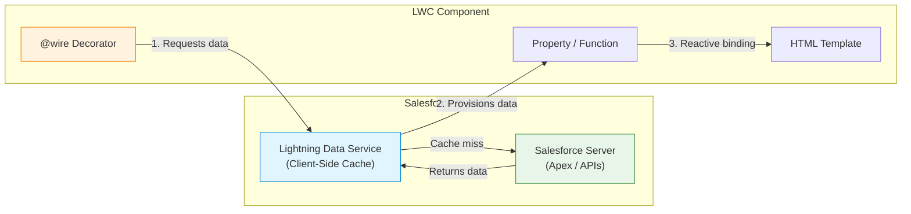
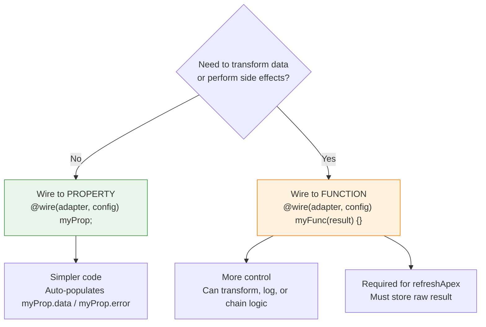

# 05 — 🔌 Wire Service

> The declarative way to fetch Salesforce data — reactive, cacheable, and efficient.

---

## 🧠 What You'll Learn

| Concept | Description |
|---------|-------------|
| `@wire` decorator | Declarative data fetching |
| Wire to property | Auto-populate a property with data |
| Wire to function | Handle data and error in a function |
| Dynamic parameters | Wire reacts to changing `$param` values |
| `getFieldValue` | Safely extract field values from wire results |
| Error handling | Graceful error display with wire |
| `refreshApex` | Force re-fetch of cached wire data |

---

## 📐 Wire Service Data Flow



> [!IMPORTANT]
> The wire service uses **Lightning Data Service (LDS)** as a caching layer. Multiple components requesting the same record share one cache entry. Changes to a record in one component automatically update all components wired to that record.

---

## ✅ Example 1: Wire to Property — `getRecord`

The simplest wire pattern. Data is placed directly onto a property.

### 📄 accountDetail.html

```html
<!-- accountDetail.html -->
<template>
    <lightning-card title="Account Detail (Wire to Property)" icon-name="standard:account">
        <div class="slds-m-around_medium">

            <!-- Loading state -->
            <div lwc:if={isLoading} class="loading">
                <lightning-spinner alternative-text="Loading..." size="small"></lightning-spinner>
                <p>Loading account data...</p>
            </div>

            <!-- Success state: data exists -->
            <div lwc:elseif={hasData}>
                <div class="detail-grid">
                    <div class="detail-row">
                        <span class="detail-label">Account Name</span>
                        <span class="detail-value">{accountName}</span>
                    </div>
                    <div class="detail-row">
                        <span class="detail-label">Industry</span>
                        <span class="detail-value">{industry}</span>
                    </div>
                    <div class="detail-row">
                        <span class="detail-label">Annual Revenue</span>
                        <span class="detail-value">{annualRevenue}</span>
                    </div>
                    <div class="detail-row">
                        <span class="detail-label">Phone</span>
                        <span class="detail-value">{phone}</span>
                    </div>
                </div>
            </div>

            <!-- Error state -->
            <div lwc:elseif={hasError} class="error-panel">
                <lightning-icon icon-name="utility:error" variant="error"></lightning-icon>
                <p>{errorMessage}</p>
            </div>

        </div>
    </lightning-card>
</template>
```

### 📄 accountDetail.js

```javascript
// accountDetail.js
import { LightningElement, api, wire } from 'lwc';

// Import the wire adapter — getRecord fetches a single record
import { getRecord, getFieldValue } from 'lightning/uiRecordApi';

// Import field references — type-safe field access
// Format: OBJECT_NAME.FIELD_NAME
import ACCOUNT_NAME from '@salesforce/schema/Account.Name';
import ACCOUNT_INDUSTRY from '@salesforce/schema/Account.Industry';
import ACCOUNT_REVENUE from '@salesforce/schema/Account.AnnualRevenue';
import ACCOUNT_PHONE from '@salesforce/schema/Account.Phone';

// Collect fields into an array for cleaner code
const FIELDS = [ACCOUNT_NAME, ACCOUNT_INDUSTRY, ACCOUNT_REVENUE, ACCOUNT_PHONE];

export default class AccountDetail extends LightningElement {

    // recordId is automatically set when the component is on a Record Page
    // The Lightning framework injects the current record's ID
    @api recordId;

    // ╔════════════════════════════════════════════════════════════╗
    // ║  @wire to PROPERTY                                         ║
    // ╠════════════════════════════════════════════════════════════╣
    // ║  Syntax: @wire(adapter, config) propertyName;              ║
    // ║                                                            ║
    // ║  The wire provisions an object with two shapes:            ║
    // ║    { data: <value>, error: undefined }  ← success          ║
    // ║    { data: undefined, error: <error> }  ← failure          ║
    // ║                                                            ║
    // ║  $recordId means this wire is REACTIVE:                    ║
    // ║  When recordId changes, the wire automatically re-fetches. ║
    // ╚════════════════════════════════════════════════════════════╝
    @wire(getRecord, { recordId: '$recordId', fields: FIELDS })
    account;
    //  ↑ This will be { data: {...}, error: undefined } on success
    //    or           { data: undefined, error: {...} } on failure

    // ─── Computed properties reading from the wire result ──────

    get isLoading() {
        // While wire is fetching, both data and error are undefined
        return !this.account.data && !this.account.error;
    }

    get hasData() {
        return !!this.account.data;
    }

    get hasError() {
        return !!this.account.error;
    }

    // ─── Field value extraction with getFieldValue ─────────────
    // getFieldValue safely reads a field from the wire result.
    // It handles null checks and nested relationships for you.
    // ALWAYS prefer getFieldValue over direct property access.

    get accountName() {
        return getFieldValue(this.account.data, ACCOUNT_NAME);
    }

    get industry() {
        return getFieldValue(this.account.data, ACCOUNT_INDUSTRY) || 'Not specified';
    }

    get annualRevenue() {
        const revenue = getFieldValue(this.account.data, ACCOUNT_REVENUE);
        if (revenue) {
            return new Intl.NumberFormat('en-US', {
                style: 'currency',
                currency: 'USD'
            }).format(revenue);
        }
        return 'Not specified';
    }

    get phone() {
        return getFieldValue(this.account.data, ACCOUNT_PHONE) || 'Not specified';
    }

    get errorMessage() {
        if (this.account.error) {
            // Wire errors have a body array with messages
            return this.account.error.body?.message
                || 'An unknown error occurred';
        }
        return '';
    }
}
```

### 📄 accountDetail.css

```css
/* accountDetail.css */
.detail-grid {
    display: flex;
    flex-direction: column;
    gap: 0;
}

.detail-row {
    display: flex;
    padding: 12px 0;
    border-bottom: 1px solid #e5e5e5;
}

.detail-label {
    flex: 0 0 150px;
    font-size: 12px;
    color: #706e6b;
    text-transform: uppercase;
    letter-spacing: 0.5px;
}

.detail-value {
    font-size: 14px;
    color: #032d60;
    font-weight: 500;
}

.loading {
    display: flex;
    align-items: center;
    gap: 12px;
    padding: 24px;
    justify-content: center;
}

.error-panel {
    display: flex;
    align-items: center;
    gap: 12px;
    padding: 16px;
    background-color: #fce4ec;
    border-radius: 8px;
    color: #b71c1c;
}

:host {
    display: block;
}
```

### 📄 accountDetail.js-meta.xml

```xml
<?xml version="1.0" encoding="UTF-8"?>
<LightningComponentBundle xmlns="http://soap.sforce.com/2006/04/metadata">
    <apiVersion>62.0</apiVersion>
    <isExposed>true</isExposed>
    <targets>
        <!-- Record pages — so @api recordId gets auto-populated -->
        <target>lightning__RecordPage</target>
    </targets>
    <targetConfigs>
        <targetConfig targets="lightning__RecordPage">
            <objects>
                <object>Account</object>
            </objects>
        </targetConfig>
    </targetConfigs>
</LightningComponentBundle>
```

---

## ✅ Example 2: Wire to Function — More Control

Wire to a function when you need to transform data or perform side effects.

### 📄 contactList.html

```html
<!-- contactList.html -->
<template>
    <lightning-card title="Related Contacts" icon-name="standard:contact">
        <div class="slds-m-around_medium">

            <!-- Refresh button -->
            <div class="header-actions" slot="actions">
                <lightning-button
                    label="Refresh"
                    icon-name="utility:refresh"
                    onclick={handleRefresh}
                ></lightning-button>
            </div>

            <!-- Loading spinner -->
            <lightning-spinner
                lwc:if={isLoading}
                alternative-text="Loading..."
                size="small"
            ></lightning-spinner>

            <!-- Contact list -->
            <template lwc:if={hasContacts}>
                <ul class="contact-list">
                    <template for:each={contacts} for:item="contact">
                        <li key={contact.Id} class="contact-item">
                            <lightning-icon icon-name="standard:contact" size="small"></lightning-icon>
                            <div class="contact-info">
                                <span class="contact-name">{contact.Name}</span>
                                <span class="contact-email">{contact.Email}</span>
                            </div>
                        </li>
                    </template>
                </ul>
            </template>

            <!-- Empty state -->
            <div lwc:elseif={noContacts} class="empty-state">
                <p>No contacts found for this account.</p>
            </div>

            <!-- Error state -->
            <div lwc:if={error} class="error-panel">
                <p>{error}</p>
            </div>
        </div>
    </lightning-card>
</template>
```

### 📄 contactList.js

```javascript
// contactList.js
import { LightningElement, api, wire } from 'lwc';
import { refreshApex } from '@salesforce/apex';

// Import a custom Apex method
import getContactsByAccountId from '@salesforce/apex/ContactController.getContactsByAccountId';

export default class ContactList extends LightningElement {

    @api recordId;

    // Properties to track state
    contacts = [];
    error;
    isLoading = true;

    // Store the raw wire result for refreshApex
    _wiredContactsResult;

    // ╔════════════════════════════════════════════════════════════╗
    // ║  @wire to FUNCTION                                         ║
    // ╠════════════════════════════════════════════════════════════╣
    // ║  Syntax: @wire(adapter, config) functionName({data, error})║
    // ║                                                            ║
    // ║  The function is called:                                   ║
    // ║    1. Initially with { data: undefined, error: undefined } ║
    // ║    2. When data arrives: { data: <value>, error: undefined }║
    // ║    3. On error: { data: undefined, error: <error> }        ║
    // ║    4. When reactive params ($recordId) change              ║
    // ║                                                            ║
    // ║  Use wire-to-function when you need to:                    ║
    // ║    - Transform data before storing it                      ║
    // ║    - Perform side effects (logging, state updates)         ║
    // ║    - Store the result for refreshApex                      ║
    // ╚════════════════════════════════════════════════════════════╝

    @wire(getContactsByAccountId, { accountId: '$recordId' })
    wiredContacts(result) {
        // Store the ENTIRE result for refreshApex
        this._wiredContactsResult = result;

        const { data, error } = result;

        if (data) {
            // Transform the data — add computed fields, format, etc.
            this.contacts = data.map(contact => ({
                ...contact,
                // Add a computed field
                initials: `${contact.FirstName?.[0] || ''}${contact.LastName?.[0] || ''}`,
            }));
            this.error = undefined;
            this.isLoading = false;
        } else if (error) {
            this.contacts = [];
            this.error = error.body?.message || 'Failed to load contacts';
            this.isLoading = false;
        }
    }

    // ─── Computed properties ───────────────────────────────────
    get hasContacts() {
        return this.contacts.length > 0;
    }

    get noContacts() {
        return !this.isLoading && this.contacts.length === 0 && !this.error;
    }

    // ─── Refresh handler ───────────────────────────────────────
    // refreshApex forces a re-fetch from the server,
    // bypassing the LDS cache.
    async handleRefresh() {
        this.isLoading = true;
        try {
            await refreshApex(this._wiredContactsResult);
        } finally {
            this.isLoading = false;
        }
    }
}
```

### Supporting Apex Class

```java
// ContactController.cls
public with sharing class ContactController {

    /**
     * @wire-compatible method.
     * @AuraEnabled(cacheable=true) is REQUIRED for wire compatibility.
     * - cacheable=true means LDS can cache the results
     * - Cacheable methods cannot perform DML (insert/update/delete)
     */
    @AuraEnabled(cacheable=true)
    public static List<Contact> getContactsByAccountId(Id accountId) {
        return [
            SELECT Id, FirstName, LastName, Name, Email, Phone, Title
            FROM Contact
            WHERE AccountId = :accountId
            ORDER BY LastName ASC
            LIMIT 50
        ];
    }
}
```

### 📄 contactList.css

```css
/* contactList.css */
.contact-list {
    list-style: none;
    padding: 0;
    margin: 0;
}

.contact-item {
    display: flex;
    align-items: center;
    gap: 12px;
    padding: 12px;
    border-bottom: 1px solid #e5e5e5;
    transition: background-color 0.15s;
}

.contact-item:hover {
    background-color: #f7f9fb;
}

.contact-info {
    display: flex;
    flex-direction: column;
}

.contact-name {
    font-weight: 600;
    color: #032d60;
}

.contact-email {
    font-size: 12px;
    color: #706e6b;
}

.empty-state {
    text-align: center;
    padding: 32px;
    color: #706e6b;
}

.error-panel {
    padding: 12px;
    background: #fce4ec;
    border-radius: 8px;
    color: #b71c1c;
}
```

### 📄 contactList.js-meta.xml

```xml
<?xml version="1.0" encoding="UTF-8"?>
<LightningComponentBundle xmlns="http://soap.sforce.com/2006/04/metadata">
    <apiVersion>62.0</apiVersion>
    <isExposed>true</isExposed>
    <targets>
        <target>lightning__RecordPage</target>
    </targets>
    <targetConfigs>
        <targetConfig targets="lightning__RecordPage">
            <objects>
                <object>Account</object>
            </objects>
        </targetConfig>
    </targetConfigs>
</LightningComponentBundle>
```

---

## ✅ Example 3: Wire with Dynamic Parameters

Wire adapters automatically re-fetch when a reactive parameter (prefixed with `$`) changes.

### 📄 dynamicSearch.html

```html
<!-- dynamicSearch.html -->
<template>
    <lightning-card title="Dynamic Account Search" icon-name="standard:search">
        <div class="slds-m-around_medium">

            <!-- Search input — changing this triggers the wire to re-fire -->
            <lightning-input
                type="search"
                label="Search Accounts"
                value={searchKey}
                onchange={handleSearchChange}
                placeholder="Type to search..."
            ></lightning-input>

            <!-- Results count -->
            <p lwc:if={hasResults} class="result-count slds-m-top_small">
                Found {resultCount} account(s)
            </p>

            <!-- Results list -->
            <ul lwc:if={hasResults} class="results-list">
                <template for:each={accounts} for:item="acct">
                    <li key={acct.Id} class="result-item">
                        <span class="acct-name">{acct.Name}</span>
                        <span class="acct-industry">{acct.Industry}</span>
                    </li>
                </template>
            </ul>

            <p lwc:if={noResults} class="no-results">No accounts found.</p>
        </div>
    </lightning-card>
</template>
```

### 📄 dynamicSearch.js

```javascript
// dynamicSearch.js
import { LightningElement, wire } from 'lwc';
import searchAccounts from '@salesforce/apex/AccountSearchController.searchAccounts';

export default class DynamicSearch extends LightningElement {

    // This property is used as a REACTIVE PARAMETER in the wire.
    // When it changes, the wire automatically re-fires.
    searchKey = '';

    accounts = [];
    error;

    // ─── Debounced input handler ───────────────────────────────
    // We don't want to fire a wire call on every keystroke.
    // Use a debounce pattern to wait for the user to stop typing.
    _searchTimeout;

    handleSearchChange(event) {
        const value = event.target.value;

        // Clear any pending timeout
        clearTimeout(this._searchTimeout);

        // Wait 300ms after the user stops typing
        this._searchTimeout = setTimeout(() => {
            this.searchKey = value;
            // When searchKey changes, the wire adapter below
            // automatically detects the change and re-fetches
        }, 300);
    }

    // ─── Wire with dynamic parameter ───────────────────────────
    // '$searchKey' means: watch this.searchKey for changes.
    // When it changes, re-invoke the Apex method with the new value.
    @wire(searchAccounts, { searchTerm: '$searchKey' })
    wiredAccounts({ data, error }) {
        if (data) {
            this.accounts = data;
            this.error = undefined;
        } else if (error) {
            this.accounts = [];
            this.error = error.body?.message;
        }
    }

    get hasResults() {
        return this.accounts.length > 0;
    }

    get noResults() {
        return this.searchKey && this.accounts.length === 0 && !this.error;
    }

    get resultCount() {
        return this.accounts.length;
    }
}
```

### Supporting Apex Class

```java
// AccountSearchController.cls
public with sharing class AccountSearchController {

    @AuraEnabled(cacheable=true)
    public static List<Account> searchAccounts(String searchTerm) {
        if (String.isBlank(searchTerm) || searchTerm.length() < 2) {
            return new List<Account>();
        }

        String likeKey = '%' + String.escapeSingleQuotes(searchTerm) + '%';
        return [
            SELECT Id, Name, Industry, Phone, AnnualRevenue
            FROM Account
            WHERE Name LIKE :likeKey
            ORDER BY Name ASC
            LIMIT 20
        ];
    }
}
```

---

## 📐 Wire to Property vs Wire to Function



| Feature | Wire to Property | Wire to Function |
|---------|-----------------|-----------------|
| Simplicity | ✅ Simpler | ❌ More code |
| Data access | `this.prop.data` | Custom properties |
| Data transformation | ❌ Not possible | ✅ Transform in handler |
| Side effects | ❌ Not possible | ✅ Logging, state updates |
| `refreshApex` | ❌ Harder to use | ✅ Store result, pass to `refreshApex` |
| Error handling | `this.prop.error` | Custom error handling |

---

## ⚠️ Common Wire Mistakes

| Mistake | Why It Fails | Fix |
|---------|-------------|-----|
| Missing `$` in parameter | Won't react to changes | `{ recordId: '$recordId' }` |
| Non-cacheable Apex with wire | Wire requires cacheable | Add `cacheable=true` |
| Calling DML in cacheable Apex | Cacheable = read-only | Use imperative Apex for DML |
| `refreshApex` with property wire | Needs the raw result object | Wire to function, store result |
| Accessing `data` before it arrives | `data` is undefined initially | Always null-check or use `lwc:if` |

> [!CAUTION]
> **Wire methods fire immediately** when the component loads — you cannot control when they fire. If you need to control when data is fetched (e.g., after a button click), use **imperative Apex** instead (see [06 — Imperative Apex](./06-imperative-apex.md)).

---

## 🔑 Key Takeaways

| Concept | Key Point |
|---------|-----------|
| **`@wire` to property** | Simplest approach — auto-populates `.data` and `.error` |
| **`@wire` to function** | More control — transform data, handle side effects |
| **Reactive params (`$`)** | Wire re-fires when the `$param` property changes |
| **`getFieldValue`** | Safe field extraction — handles null and relationships |
| **`refreshApex`** | Force re-fetch; pass the stored wire result |
| **`cacheable=true`** | Required on Apex methods used with `@wire`; no DML allowed |
| **Schema imports** | `import FIELD from '@salesforce/schema/Object.Field'` for type safety |

---

*Previous: [04 — Event Handling ←](./04-event-handling.md) · Next: [06 — Imperative Apex →](./06-imperative-apex.md)*
