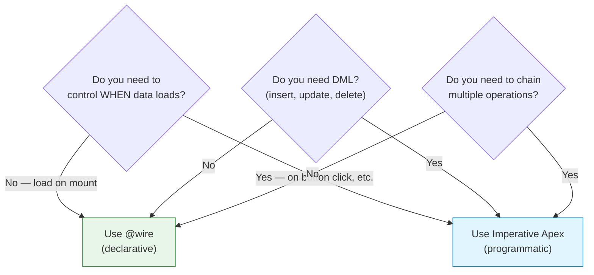
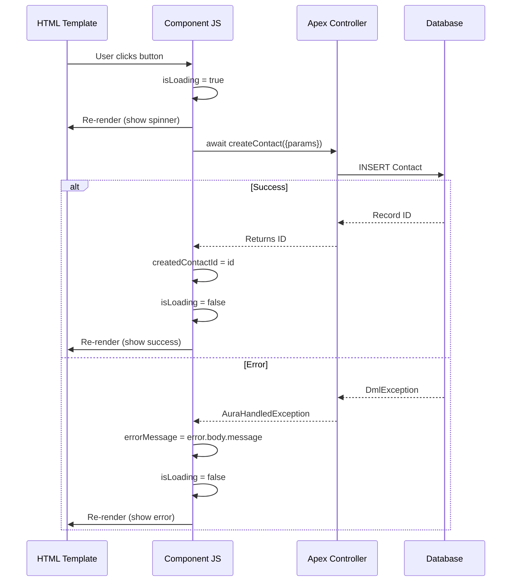

# 06 — 🚀 Imperative Apex

> Call Apex methods on-demand — when you need full control over timing and DML operations.

---

## 🧠 What You'll Learn

| Concept | Description |
|---------|-------------|
| Imperative Apex calls | Invoking Apex methods programmatically |
| Parameter passing | Sending data to Apex methods |
| Error handling | Try/catch with user-friendly messages |
| Loading state | Managing spinners and UI feedback |
| Chaining calls | Sequential Apex operations |
| `@AuraEnabled` | Writing wire- and imperative-compatible Apex |

---

## 📐 Wire vs Imperative — When to Use Which



| Feature | `@wire` (Declarative) | Imperative Apex |
|---------|----------------------|-----------------|
| When it fires | Automatically on load & param change | Only when YOU call it |
| DML support | ❌ (cacheable = read-only) | ✅ (insert, update, delete) |
| Caching | ✅ Automatic via LDS cache | ❌ No caching (unless you build it) |
| Error handling | Via `.error` property | Via `try/catch` |
| Loading state | Manual check of data/error | Full control with `isLoading` |

---

## ✅ Example 1: Basic Imperative Call

### 📄 contactCreator.html

```html
<!-- contactCreator.html -->
<template>
    <lightning-card title="Create Contact" icon-name="standard:contact">
        <div class="slds-m-around_medium">

            <!-- Form inputs -->
            <lightning-input
                label="First Name"
                value={firstName}
                onchange={handleFirstNameChange}
                required
            ></lightning-input>

            <lightning-input
                label="Last Name"
                value={lastName}
                onchange={handleLastNameChange}
                required
                class="slds-m-top_small"
            ></lightning-input>

            <lightning-input
                type="email"
                label="Email"
                value={email}
                onchange={handleEmailChange}
                class="slds-m-top_small"
            ></lightning-input>

            <lightning-input
                type="tel"
                label="Phone"
                value={phone}
                onchange={handlePhoneChange}
                class="slds-m-top_small"
            ></lightning-input>

            <!-- Submit button with loading state -->
            <div class="slds-m-top_medium">
                <lightning-button
                    label={submitButtonLabel}
                    variant="brand"
                    onclick={handleCreateContact}
                    disabled={isSubmitDisabled}
                ></lightning-button>
            </div>

            <!-- Success message -->
            <div lwc:if={createdContactId} class="success-panel slds-m-top_medium">
                <lightning-icon icon-name="utility:success" variant="success"></lightning-icon>
                <div>
                    <p class="success-title">Contact Created Successfully! 🎉</p>
                    <p class="success-id">Record ID: {createdContactId}</p>
                </div>
            </div>

            <!-- Error message -->
            <div lwc:if={errorMessage} class="error-panel slds-m-top_medium">
                <lightning-icon icon-name="utility:error" variant="error"></lightning-icon>
                <p>{errorMessage}</p>
            </div>
        </div>
    </lightning-card>
</template>
```

### 📄 contactCreator.js

```javascript
// contactCreator.js
import { LightningElement } from 'lwc';

// Import the toast message for user notifications
import { ShowToastEvent } from 'lightning/platformShowToastEvent';

// ╔════════════════════════════════════════════════════════════════╗
// ║  Import Apex methods                                           ║
// ║  Format: import methodName from '@salesforce/apex/Class.method' ║
// ║                                                                ║
// ║  The imported function returns a PROMISE.                      ║
// ║  Call it with await or .then()/.catch()                        ║
// ╚════════════════════════════════════════════════════════════════╝
import createContact from '@salesforce/apex/ContactController.createContact';

export default class ContactCreator extends LightningElement {

    // ─── Form state ────────────────────────────────────────────
    firstName = '';
    lastName = '';
    email = '';
    phone = '';

    // ─── UI state ──────────────────────────────────────────────
    isLoading = false;
    createdContactId = null;
    errorMessage = null;

    // ─── Computed properties ───────────────────────────────────
    get submitButtonLabel() {
        return this.isLoading ? 'Creating...' : 'Create Contact';
    }

    get isSubmitDisabled() {
        return this.isLoading || !this.firstName || !this.lastName;
    }

    // ─── Event handlers ────────────────────────────────────────
    handleFirstNameChange(event) {
        this.firstName = event.target.value;
    }

    handleLastNameChange(event) {
        this.lastName = event.target.value;
    }

    handleEmailChange(event) {
        this.email = event.target.value;
    }

    handlePhoneChange(event) {
        this.phone = event.target.value;
    }

    // ╔════════════════════════════════════════════════════════════╗
    // ║  IMPERATIVE APEX CALL                                      ║
    // ╠════════════════════════════════════════════════════════════╣
    // ║  1. Call the imported function with parameters              ║
    // ║  2. It returns a Promise — use async/await                 ║
    // ║  3. Wrap in try/catch for error handling                   ║
    // ║  4. Manage loading state manually                          ║
    // ╚════════════════════════════════════════════════════════════╝
    async handleCreateContact() {
        // Guard clause
        if (this.isSubmitDisabled) return;

        // Set loading state
        this.isLoading = true;
        this.errorMessage = null;
        this.createdContactId = null;

        try {
            // Call the Apex method with parameters
            // Parameter names MUST match the Apex method's parameter names
            const result = await createContact({
                firstName: this.firstName,
                lastName: this.lastName,
                email: this.email,
                phone: this.phone
            });

            // Success! Store the created record ID
            this.createdContactId = result;

            // Show success toast
            this.dispatchEvent(new ShowToastEvent({
                title: 'Success',
                message: 'Contact created successfully',
                variant: 'success'
            }));

            // Reset form
            this.resetForm();

        } catch (error) {
            // ─── Error handling ────────────────────────────────
            // Apex errors come in different shapes:
            //   - error.body.message (most common)
            //   - error.body.fieldErrors (field-level validation)
            //   - error.body.pageErrors (page-level errors)
            this.errorMessage = this.extractErrorMessage(error);

            // Show error toast
            this.dispatchEvent(new ShowToastEvent({
                title: 'Error Creating Contact',
                message: this.errorMessage,
                variant: 'error',
                mode: 'sticky'  // Stays visible until dismissed
            }));

        } finally {
            // ALWAYS reset loading state, even on error
            this.isLoading = false;
        }
    }

    // ─── Helper: Extract error message ─────────────────────────
    extractErrorMessage(error) {
        // Handle different error formats
        if (typeof error === 'string') return error;
        if (error.body) {
            if (error.body.message) return error.body.message;
            if (error.body.fieldErrors) {
                return Object.values(error.body.fieldErrors)
                    .flat()
                    .map(e => e.message)
                    .join(', ');
            }
            if (error.body.pageErrors) {
                return error.body.pageErrors.map(e => e.message).join(', ');
            }
        }
        return 'An unexpected error occurred.';
    }

    resetForm() {
        this.firstName = '';
        this.lastName = '';
        this.email = '';
        this.phone = '';
    }
}
```

### 📄 contactCreator.css

```css
/* contactCreator.css */
.success-panel {
    display: flex;
    align-items: center;
    gap: 12px;
    padding: 16px;
    background-color: #e8f5e9;
    border-radius: 8px;
    border-left: 4px solid #2e844a;
}

.success-title {
    font-weight: bold;
    color: #1b5e20;
}

.success-id {
    font-size: 12px;
    color: #706e6b;
    font-family: 'SF Mono', monospace;
}

.error-panel {
    display: flex;
    align-items: center;
    gap: 12px;
    padding: 16px;
    background-color: #fce4ec;
    border-radius: 8px;
    border-left: 4px solid #c62828;
    color: #b71c1c;
}

:host {
    display: block;
}
```

### 📄 contactCreator.js-meta.xml

```xml
<?xml version="1.0" encoding="UTF-8"?>
<LightningComponentBundle xmlns="http://soap.sforce.com/2006/04/metadata">
    <apiVersion>62.0</apiVersion>
    <isExposed>true</isExposed>
    <targets>
        <target>lightning__AppPage</target>
        <target>lightning__RecordPage</target>
        <target>lightning__HomePage</target>
    </targets>
</LightningComponentBundle>
```

---

## ✅ Example 2: Apex Class with Multiple Methods

### 📄 ContactController.cls

```java
// ContactController.cls
public with sharing class ContactController {

    /**
     * WIRE-COMPATIBLE method (cacheable=true).
     * Used with @wire or imperative calls.
     * CANNOT perform DML.
     */
    @AuraEnabled(cacheable=true)
    public static List<Contact> getContactsByAccountId(Id accountId) {
        return [
            SELECT Id, FirstName, LastName, Name, Email, Phone, Title,
                   Account.Name
            FROM Contact
            WHERE AccountId = :accountId
            ORDER BY LastName ASC
            LIMIT 50
        ];
    }

    /**
     * IMPERATIVE-ONLY method (no cacheable).
     * Can perform DML operations.
     * Returns the new Contact's Id.
     */
    @AuraEnabled
    public static Id createContact(
        String firstName,
        String lastName,
        String email,
        String phone
    ) {
        // Validate required fields
        if (String.isBlank(lastName)) {
            throw new AuraHandledException('Last Name is required.');
        }

        Contact newContact = new Contact(
            FirstName = firstName,
            LastName = lastName,
            Email = email,
            Phone = phone
        );

        try {
            insert newContact;
            return newContact.Id;
        } catch (DmlException e) {
            // Wrap DML errors in AuraHandledException
            // so LWC can display them properly
            throw new AuraHandledException(e.getMessage());
        }
    }

    /**
     * Update a contact's fields.
     * Demonstrates parameterized DML.
     */
    @AuraEnabled
    public static void updateContact(Id contactId, Map<String, Object> fieldsToUpdate) {
        Contact con = new Contact(Id = contactId);

        for (String fieldName : fieldsToUpdate.keySet()) {
            con.put(fieldName, fieldsToUpdate.get(fieldName));
        }

        try {
            update con;
        } catch (DmlException e) {
            throw new AuraHandledException(e.getMessage());
        }
    }

    /**
     * Delete a contact.
     */
    @AuraEnabled
    public static void deleteContact(Id contactId) {
        try {
            delete [SELECT Id FROM Contact WHERE Id = :contactId LIMIT 1];
        } catch (DmlException e) {
            throw new AuraHandledException(e.getMessage());
        }
    }
}
```

> [!NOTE]
> **`@AuraEnabled` vs `@AuraEnabled(cacheable=true)`**
> - `@AuraEnabled` — Can do DML. Used with imperative calls only.
> - `@AuraEnabled(cacheable=true)` — Read-only (no DML). Can be used with `@wire` OR imperative calls. Results are cached by LDS.

---

## ✅ Example 3: Chaining Apex Calls

When you need to perform multiple sequential operations.

### 📄 bulkOperation.js

```javascript
// bulkOperation.js
import { LightningElement } from 'lwc';
import { ShowToastEvent } from 'lightning/platformShowToastEvent';

import validateContacts from '@salesforce/apex/BulkOperationController.validateContacts';
import processContacts from '@salesforce/apex/BulkOperationController.processContacts';
import sendNotifications from '@salesforce/apex/BulkOperationController.sendNotifications';

export default class BulkOperation extends LightningElement {

    // ─── State ─────────────────────────────────────────────────
    isProcessing = false;
    currentStep = '';
    progress = 0;
    results = null;
    errorMessage = null;

    get progressPercentage() {
        return this.progress;
    }

    get stepLabel() {
        return this.currentStep || 'Ready';
    }

    // ╔════════════════════════════════════════════════════════════╗
    // ║  CHAINING APEX CALLS with async/await                      ║
    // ║                                                            ║
    // ║  Each call must complete before the next begins.           ║
    // ║  If any step fails, the catch block handles it.            ║
    // ║  The finally block ALWAYS runs (cleanup).                  ║
    // ╚════════════════════════════════════════════════════════════╝
    async handleBulkProcess() {
        this.isProcessing = true;
        this.errorMessage = null;
        this.results = null;

        try {
            // ─── Step 1: Validate ──────────────────────────────
            this.currentStep = 'Step 1/3: Validating contacts...';
            this.progress = 10;

            const validationResult = await validateContacts({
                accountId: this.recordId
            });

            if (!validationResult.isValid) {
                throw new Error(`Validation failed: ${validationResult.message}`);
            }

            this.progress = 33;

            // ─── Step 2: Process ───────────────────────────────
            this.currentStep = 'Step 2/3: Processing contacts...';

            const processResult = await processContacts({
                contactIds: validationResult.contactIds,
                operation: 'update'
            });

            this.progress = 66;

            // ─── Step 3: Notify ────────────────────────────────
            this.currentStep = 'Step 3/3: Sending notifications...';

            const notifyResult = await sendNotifications({
                processedIds: processResult.successIds,
                templateName: 'Contact_Update_Notification'
            });

            this.progress = 100;
            this.currentStep = 'Complete! ✅';

            // Aggregate results
            this.results = {
                validated: validationResult.contactIds.length,
                processed: processResult.successIds.length,
                failed: processResult.failedIds.length,
                notified: notifyResult.sentCount
            };

            this.dispatchEvent(new ShowToastEvent({
                title: 'Bulk Operation Complete',
                message: `Successfully processed ${this.results.processed} contacts.`,
                variant: 'success'
            }));

        } catch (error) {
            this.errorMessage = this.extractErrorMessage(error);
            this.currentStep = 'Failed ❌';

            this.dispatchEvent(new ShowToastEvent({
                title: 'Bulk Operation Failed',
                message: this.errorMessage,
                variant: 'error',
                mode: 'sticky'
            }));

        } finally {
            this.isProcessing = false;
        }
    }

    extractErrorMessage(error) {
        if (error.body?.message) return error.body.message;
        if (error.message) return error.message;
        return 'An unexpected error occurred.';
    }
}
```

### 📄 bulkOperation.html

```html
<!-- bulkOperation.html -->
<template>
    <lightning-card title="Bulk Contact Operation" icon-name="standard:data_integration_hub">
        <div class="slds-m-around_medium">

            <!-- Progress -->
            <div lwc:if={isProcessing}>
                <p class="step-label">{stepLabel}</p>
                <lightning-progress-bar
                    value={progressPercentage}
                    size="large"
                    class="slds-m-top_small"
                ></lightning-progress-bar>
            </div>

            <!-- Start button -->
            <lightning-button
                lwc:if={isReady}
                label="Start Bulk Operation"
                variant="brand"
                onclick={handleBulkProcess}
                icon-name="utility:play"
            ></lightning-button>

            <!-- Results -->
            <div lwc:if={results} class="results slds-m-top_medium">
                <h3>Results:</h3>
                <p>✅ Validated: {results.validated}</p>
                <p>✅ Processed: {results.processed}</p>
                <p>❌ Failed: {results.failed}</p>
                <p>📧 Notified: {results.notified}</p>
            </div>

            <!-- Error -->
            <div lwc:if={errorMessage} class="error-panel slds-m-top_medium">
                <p>{errorMessage}</p>
            </div>
        </div>
    </lightning-card>
</template>
```

---

## 📐 Imperative Call Lifecycle



---

## ✅ Example 4: Imperative Call with `refreshApex`

After creating/updating data imperatively, refresh a wired list.

```javascript
// contactManager.js
import { LightningElement, api, wire } from 'lwc';
import { refreshApex } from '@salesforce/apex';
import { ShowToastEvent } from 'lightning/platformShowToastEvent';
import getContacts from '@salesforce/apex/ContactController.getContactsByAccountId';
import createContact from '@salesforce/apex/ContactController.createContact';

export default class ContactManager extends LightningElement {

    @api recordId;
    contacts = [];
    _wiredResult;

    // Wire to function — so we can refresh later
    @wire(getContacts, { accountId: '$recordId' })
    wiredContacts(result) {
        this._wiredResult = result;
        if (result.data) {
            this.contacts = result.data;
        }
    }

    // Create a contact imperatively, then refresh the wired list
    async handleCreate() {
        try {
            await createContact({
                firstName: 'New',
                lastName: 'Contact',
                email: 'new@example.com',
                phone: '555-0100'
            });

            // After DML, refresh the wired data
            // This forces a re-fetch from the server
            await refreshApex(this._wiredResult);

            this.dispatchEvent(new ShowToastEvent({
                title: 'Success',
                message: 'Contact created and list refreshed!',
                variant: 'success'
            }));

        } catch (error) {
            this.dispatchEvent(new ShowToastEvent({
                title: 'Error',
                message: error.body?.message || 'Failed to create contact',
                variant: 'error'
            }));
        }
    }
}
```

> [!TIP]
> **Pattern**: Use `@wire` to load the initial list, then use imperative Apex for DML operations, and call `refreshApex` to update the wired list after the DML succeeds.

---

## ⚠️ Common Imperative Apex Mistakes

| Mistake | Why It Fails | Fix |
|---------|-------------|-----|
| Forgetting `@AuraEnabled` | Method invisible to LWC | Add `@AuraEnabled` annotation |
| Wrong parameter names | JS param names must match Apex | Ensure exact name match |
| Not handling errors | Unhandled promise rejection | Wrap in try/catch |
| No loading state | UI freezes with no feedback | Set `isLoading` before/after |
| Using `cacheable=true` with DML | Cache-only methods can't do DML | Remove `cacheable=true` |
| Not using `with sharing` | Security review failure | Always use `with sharing` |

---

## 🔑 Key Takeaways

| Concept | Key Point |
|---------|-----------|
| **When to use** | Button clicks, DML operations, sequential logic |
| **Import syntax** | `import method from '@salesforce/apex/Class.method'` |
| **Calling** | `const result = await method({ param1: value1 })` |
| **Error handling** | Always use `try/catch/finally` |
| **Loading state** | Set before call, reset in `finally` block |
| **Chaining** | Use `async/await` for sequential calls |
| **`refreshApex`** | Refresh wired data after imperative DML |
| **Apex annotation** | `@AuraEnabled` for DML, `@AuraEnabled(cacheable=true)` for read-only |
| **Error wrapping** | Use `AuraHandledException` in Apex for clean error messages |

---

*Previous: [05 — Wire Service ←](./05-wire-service.md) · Next: [07 — Navigation →](./07-navigation.md)*
