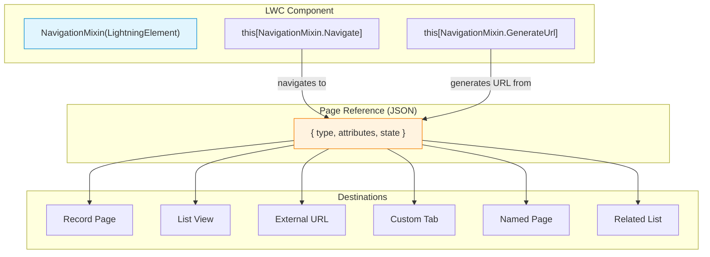
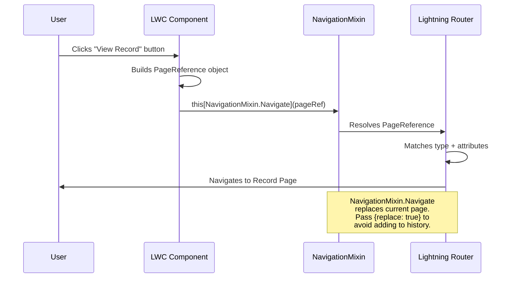

# 07 — 🧭 Navigation

> Navigate between pages, records, lists, and external URLs using `NavigationMixin`.

---

## 🧠 What You'll Learn

| Concept | Description |
|---------|-------------|
| `NavigationMixin` | The mixin that enables navigation in LWC |
| Page references | JSON objects that describe navigation targets |
| Record page navigation | Navigate to view, edit, or create records |
| List view navigation | Navigate to object list views |
| Web page navigation | Open external URLs |
| `CurrentPageReference` | Read the current page's context |
| URL generation | Create URLs without navigating |

---

## 📐 Navigation Architecture



---

## ✅ Example 1: Complete Navigation Hub

### 📄 navigationHub.html

```html
<!-- navigationHub.html -->
<template>
    <lightning-card title="Navigation Hub 🧭" icon-name="standard:link">
        <div class="slds-m-around_medium">

            <!-- Record ID input for record-based navigation -->
            <lightning-input
                label="Account Record ID"
                value={targetRecordId}
                onchange={handleRecordIdChange}
                placeholder="Enter an Account ID..."
                class="slds-m-bottom_medium"
            ></lightning-input>

            <!-- Navigation buttons grid -->
            <div class="nav-grid">

                <!-- 1. Navigate to Record (View) -->
                <div class="nav-card" onclick={navigateToRecordView}>
                    <lightning-icon icon-name="standard:account" size="medium"></lightning-icon>
                    <h3>View Record</h3>
                    <p>Opens the record detail page</p>
                </div>

                <!-- 2. Navigate to Record (Edit) -->
                <div class="nav-card" onclick={navigateToRecordEdit}>
                    <lightning-icon icon-name="utility:edit" size="medium"></lightning-icon>
                    <h3>Edit Record</h3>
                    <p>Opens the record in edit mode</p>
                </div>

                <!-- 3. Navigate to New Record -->
                <div class="nav-card" onclick={navigateToNewRecord}>
                    <lightning-icon icon-name="utility:new" size="medium"></lightning-icon>
                    <h3>New Contact</h3>
                    <p>Opens the new Contact form</p>
                </div>

                <!-- 4. Navigate to List View -->
                <div class="nav-card" onclick={navigateToListView}>
                    <lightning-icon icon-name="standard:list_view" size="medium"></lightning-icon>
                    <h3>Account List</h3>
                    <p>Opens the Account list view</p>
                </div>

                <!-- 5. Navigate to Related List -->
                <div class="nav-card" onclick={navigateToRelatedList}>
                    <lightning-icon icon-name="standard:related_list" size="medium"></lightning-icon>
                    <h3>Related Contacts</h3>
                    <p>Opens the related contacts list</p>
                </div>

                <!-- 6. Navigate to External URL -->
                <div class="nav-card" onclick={navigateToWebPage}>
                    <lightning-icon icon-name="utility:world" size="medium"></lightning-icon>
                    <h3>External URL</h3>
                    <p>Opens Salesforce Developer Docs</p>
                </div>

                <!-- 7. Navigate to Named Page -->
                <div class="nav-card" onclick={navigateToHomePage}>
                    <lightning-icon icon-name="standard:home" size="medium"></lightning-icon>
                    <h3>Home Page</h3>
                    <p>Navigates to the Home tab</p>
                </div>

                <!-- 8. Navigate to Custom Tab -->
                <div class="nav-card" onclick={navigateToCustomTab}>
                    <lightning-icon icon-name="standard:custom" size="medium"></lightning-icon>
                    <h3>Custom Tab</h3>
                    <p>Opens a custom Lightning tab</p>
                </div>
            </div>

            <!-- Generated URL display -->
            <div lwc:if={generatedUrl} class="url-display slds-m-top_medium">
                <p class="url-label">Generated URL:</p>
                <a href={generatedUrl} class="url-link">{generatedUrl}</a>
            </div>
        </div>
    </lightning-card>
</template>
```

### 📄 navigationHub.js

```javascript
// navigationHub.js
import { LightningElement, api } from 'lwc';

// ╔════════════════════════════════════════════════════════════════╗
// ║  NavigationMixin                                               ║
// ╠════════════════════════════════════════════════════════════════╣
// ║  1. Import NavigationMixin from 'lightning/navigation'         ║
// ║  2. Apply it to your class: NavigationMixin(LightningElement)  ║
// ║  3. Use this[NavigationMixin.Navigate](pageRef) to navigate    ║
// ║  4. Use this[NavigationMixin.GenerateUrl](pageRef) for URLs    ║
// ╚════════════════════════════════════════════════════════════════╝
import { NavigationMixin } from 'lightning/navigation';

// The class extends NavigationMixin(LightningElement)
// This WRAPS LightningElement with navigation capabilities
export default class NavigationHub extends NavigationMixin(LightningElement) {

    @api recordId;   // Auto-populated on record pages

    targetRecordId = '';
    generatedUrl = '';

    handleRecordIdChange(event) {
        this.targetRecordId = event.target.value;
    }

    // Helper to get the record ID (from input or from page context)
    get effectiveRecordId() {
        return this.targetRecordId || this.recordId;
    }

    // ╔════════════════════════════════════════════════════════════╗
    // ║  1. NAVIGATE TO RECORD — View Mode                         ║
    // ╚════════════════════════════════════════════════════════════╝
    navigateToRecordView() {
        this[NavigationMixin.Navigate]({
            type: 'standard__recordPage',
            attributes: {
                recordId: this.effectiveRecordId,
                objectApiName: 'Account',
                actionName: 'view'     // 'view' = read-only detail page
            }
        });
    }

    // ╔════════════════════════════════════════════════════════════╗
    // ║  2. NAVIGATE TO RECORD — Edit Mode                         ║
    // ╚════════════════════════════════════════════════════════════╝
    navigateToRecordEdit() {
        this[NavigationMixin.Navigate]({
            type: 'standard__recordPage',
            attributes: {
                recordId: this.effectiveRecordId,
                objectApiName: 'Account',
                actionName: 'edit'     // 'edit' = opens edit modal/page
            }
        });
    }

    // ╔════════════════════════════════════════════════════════════╗
    // ║  3. NAVIGATE TO NEW RECORD                                 ║
    // ╚════════════════════════════════════════════════════════════╝
    navigateToNewRecord() {
        this[NavigationMixin.Navigate]({
            type: 'standard__objectPage',
            attributes: {
                objectApiName: 'Contact',
                actionName: 'new'      // 'new' = opens create form
            },
            // state allows you to pre-fill field values
            state: {
                // Pre-fill fields using field API names
                // Format: field API name as key, value as string
                defaultFieldValues: 'AccountId=' + this.effectiveRecordId
            }
        });
    }

    // ╔════════════════════════════════════════════════════════════╗
    // ║  4. NAVIGATE TO LIST VIEW                                  ║
    // ╚════════════════════════════════════════════════════════════╝
    navigateToListView() {
        this[NavigationMixin.Navigate]({
            type: 'standard__objectPage',
            attributes: {
                objectApiName: 'Account',
                actionName: 'list'     // 'list' = object list view
            },
            state: {
                // Specify which list view to show
                filterName: 'Recent'   // 'Recent', 'All', or a custom list view ID
            }
        });
    }

    // ╔════════════════════════════════════════════════════════════╗
    // ║  5. NAVIGATE TO RELATED LIST                               ║
    // ╚════════════════════════════════════════════════════════════╝
    navigateToRelatedList() {
        this[NavigationMixin.Navigate]({
            type: 'standard__recordRelationshipPage',
            attributes: {
                recordId: this.effectiveRecordId,
                objectApiName: 'Account',
                relationshipApiName: 'Contacts',  // Child relationship name
                actionName: 'view'
            }
        });
    }

    // ╔════════════════════════════════════════════════════════════╗
    // ║  6. NAVIGATE TO WEB PAGE (External URL)                    ║
    // ╚════════════════════════════════════════════════════════════╝
    navigateToWebPage() {
        this[NavigationMixin.Navigate]({
            type: 'standard__webPage',
            attributes: {
                url: 'https://developer.salesforce.com/docs/platform/lwc/guide'
            }
        });
    }

    // ╔════════════════════════════════════════════════════════════╗
    // ║  7. NAVIGATE TO NAMED PAGE (Home, Chatter, etc.)           ║
    // ╚════════════════════════════════════════════════════════════╝
    navigateToHomePage() {
        this[NavigationMixin.Navigate]({
            type: 'standard__namedPage',
            attributes: {
                pageName: 'home'
                // Other options: 'chatter', 'today', 'dataAssessment',
                //                'filePreview'
            }
        });
    }

    // ╔════════════════════════════════════════════════════════════╗
    // ║  8. NAVIGATE TO CUSTOM TAB                                 ║
    // ╚════════════════════════════════════════════════════════════╝
    navigateToCustomTab() {
        this[NavigationMixin.Navigate]({
            type: 'standard__navItemPage',
            attributes: {
                apiName: 'MyCustomTab'  // API name of the custom tab
            }
        });
    }

    // ╔════════════════════════════════════════════════════════════╗
    // ║  GENERATE URL — Get a URL string without navigating        ║
    // ╚════════════════════════════════════════════════════════════╝
    // Useful for creating hyperlinks in the template
    connectedCallback() {
        if (this.recordId) {
            this[NavigationMixin.GenerateUrl]({
                type: 'standard__recordPage',
                attributes: {
                    recordId: this.recordId,
                    actionName: 'view'
                }
            }).then(url => {
                this.generatedUrl = url;
            });
        }
    }
}
```

### 📄 navigationHub.css

```css
/* navigationHub.css */
.nav-grid {
    display: grid;
    grid-template-columns: repeat(auto-fill, minmax(200px, 1fr));
    gap: 16px;
}

.nav-card {
    display: flex;
    flex-direction: column;
    align-items: center;
    gap: 8px;
    padding: 20px;
    border: 1px solid #e5e5e5;
    border-radius: 12px;
    cursor: pointer;
    transition: all 0.2s;
    text-align: center;
}

.nav-card:hover {
    border-color: #0176d3;
    background-color: #f7f9fb;
    transform: translateY(-2px);
    box-shadow: 0 4px 12px rgba(0, 0, 0, 0.1);
}

.nav-card h3 {
    font-size: 14px;
    font-weight: 600;
    color: #032d60;
    margin: 0;
}

.nav-card p {
    font-size: 12px;
    color: #706e6b;
    margin: 0;
}

.url-display {
    background-color: #f3f3f3;
    padding: 12px;
    border-radius: 8px;
}

.url-label {
    font-size: 12px;
    color: #706e6b;
    margin-bottom: 4px;
}

.url-link {
    font-family: 'SF Mono', monospace;
    font-size: 13px;
    color: #0176d3;
    word-break: break-all;
}

:host {
    display: block;
}
```

### 📄 navigationHub.js-meta.xml

```xml
<?xml version="1.0" encoding="UTF-8"?>
<LightningComponentBundle xmlns="http://soap.sforce.com/2006/04/metadata">
    <apiVersion>62.0</apiVersion>
    <isExposed>true</isExposed>
    <targets>
        <target>lightning__AppPage</target>
        <target>lightning__RecordPage</target>
        <target>lightning__HomePage</target>
    </targets>
    <targetConfigs>
        <targetConfig targets="lightning__RecordPage">
            <objects>
                <object>Account</object>
            </objects>
        </targetConfig>
    </targetConfigs>
</LightningComponentBundle>
```

---

## ✅ Example 2: Using `CurrentPageReference`

Read the current page context — useful for getting URL parameters and state.

### 📄 pageInfo.html

```html
<!-- pageInfo.html -->
<template>
    <lightning-card title="Current Page Info 📍" icon-name="standard:location">
        <div class="slds-m-around_medium">

            <div lwc:if={currentPageReference}>
                <div class="info-grid">
                    <div class="info-row">
                        <span class="info-label">Page Type</span>
                        <span class="info-value">{pageType}</span>
                    </div>
                    <div class="info-row">
                        <span class="info-label">Object API Name</span>
                        <span class="info-value">{objectApiName}</span>
                    </div>
                    <div class="info-row">
                        <span class="info-label">Record ID</span>
                        <span class="info-value">{pageRecordId}</span>
                    </div>
                    <div class="info-row">
                        <span class="info-label">Action</span>
                        <span class="info-value">{actionName}</span>
                    </div>
                </div>

                <!-- Raw JSON -->
                <div class="raw-json slds-m-top_medium">
                    <h3>Raw PageReference:</h3>
                    <pre>{pageReferenceJson}</pre>
                </div>
            </div>
        </div>
    </lightning-card>
</template>
```

### 📄 pageInfo.js

```javascript
// pageInfo.js
import { LightningElement, wire } from 'lwc';

// Import CurrentPageReference — a wire adapter
import { CurrentPageReference } from 'lightning/navigation';

export default class PageInfo extends LightningElement {

    // ╔════════════════════════════════════════════════════════════╗
    // ║  @wire(CurrentPageReference)                               ║
    // ║                                                            ║
    // ║  Automatically populated with the current page's context.  ║
    // ║  Returns an object with:                                   ║
    // ║    - type: page type (e.g., 'standard__recordPage')        ║
    // ║    - attributes: { recordId, objectApiName, actionName }   ║
    // ║    - state: URL query parameters                           ║
    // ║                                                            ║
    // ║  Updates reactively when the page reference changes        ║
    // ║  (e.g., navigating to a different record).                 ║
    // ╚════════════════════════════════════════════════════════════╝
    @wire(CurrentPageReference)
    currentPageReference;

    get pageType() {
        return this.currentPageReference?.type || 'N/A';
    }

    get objectApiName() {
        return this.currentPageReference?.attributes?.objectApiName || 'N/A';
    }

    get pageRecordId() {
        return this.currentPageReference?.attributes?.recordId || 'N/A';
    }

    get actionName() {
        return this.currentPageReference?.attributes?.actionName || 'N/A';
    }

    get pageReferenceJson() {
        return JSON.stringify(this.currentPageReference, null, 2);
    }
}
```

### 📄 pageInfo.css

```css
/* pageInfo.css */
.info-grid {
    display: flex;
    flex-direction: column;
}

.info-row {
    display: flex;
    padding: 10px 0;
    border-bottom: 1px solid #e5e5e5;
}

.info-label {
    flex: 0 0 160px;
    font-size: 12px;
    color: #706e6b;
    text-transform: uppercase;
}

.info-value {
    font-size: 14px;
    color: #032d60;
    font-family: 'SF Mono', monospace;
}

.raw-json {
    background: #1e1e1e;
    color: #d4d4d4;
    padding: 16px;
    border-radius: 8px;
    overflow-x: auto;
}

.raw-json pre {
    margin: 0;
    font-size: 12px;
    font-family: 'SF Mono', monospace;
}
```

---

## 📋 Page Reference Types — Quick Reference

| Type | Purpose | Key Attributes |
|------|---------|---------------|
| `standard__recordPage` | View/Edit a record | `recordId`, `objectApiName`, `actionName` |
| `standard__objectPage` | List view / New record | `objectApiName`, `actionName` |
| `standard__recordRelationshipPage` | Related list | `recordId`, `relationshipApiName` |
| `standard__webPage` | External URL | `url` |
| `standard__namedPage` | System pages (home, chatter) | `pageName` |
| `standard__navItemPage` | Custom tabs | `apiName` |
| `standard__component` | Lightning component (Aura) | `componentName` |

---

## 📐 Navigation Flow



---

## ⚠️ Common Navigation Mistakes

| Mistake | Why It Fails | Fix |
|---------|-------------|-----|
| Extending `LightningElement` directly | Navigation methods not available | Extend `NavigationMixin(LightningElement)` |
| Using `window.location.href` | Breaks SPA navigation, security risk | Use `NavigationMixin.Navigate` |
| Wrong `type` string | Typo in page reference type | Use the exact strings from documentation |
| Missing `objectApiName` for records | Required for record page navigation | Always include `objectApiName` |
| `actionName: 'create'` | Not valid — the correct value is `'new'` | Use `actionName: 'new'` |

> [!WARNING]
> **Never use `window.location.href`** for navigation in LWC. It breaks the single-page application architecture, bypasses security checks, and doesn't work in Lightning Experience. Always use `NavigationMixin`.

---

## 🔑 Key Takeaways

| Concept | Key Point |
|---------|-----------|
| **NavigationMixin** | Must extend `NavigationMixin(LightningElement)` |
| **Page reference** | JSON object with `type`, `attributes`, `state` |
| **Navigate** | `this[NavigationMixin.Navigate](pageRef)` |
| **GenerateUrl** | Returns a Promise resolving to a URL string |
| **CurrentPageReference** | Wire adapter for reading current page context |
| **No `window.location`** | Always use NavigationMixin for navigation |
| **`state`** | URL parameters and default field values |

---

*Previous: [06 — Imperative Apex ←](./06-imperative-apex.md) · Next: [08 — Parent-Child →](./08-parent-child.md)*
