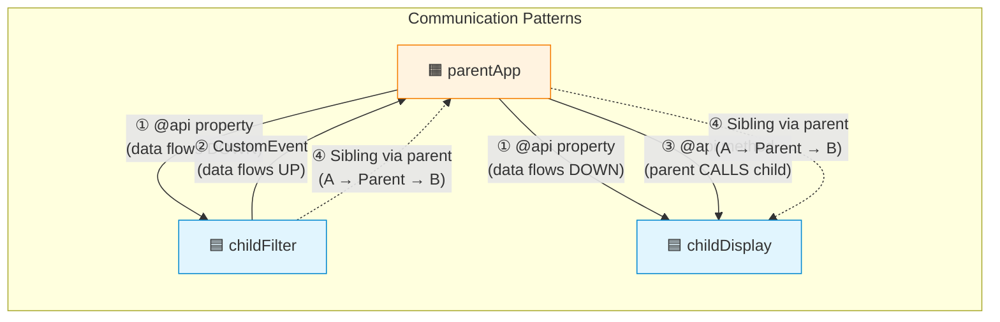
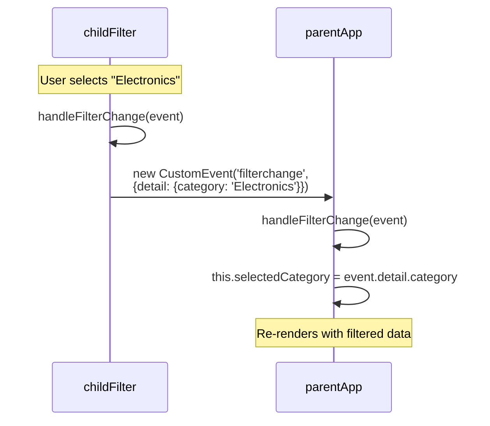

# 08 — 👨‍👧‍👦 Parent-Child Communication

> All four communication patterns — down via `@api`, up via events, methods via `@api`, and siblings via parent.

---

## 🧠 What You'll Learn

| Concept | Description |
|---------|-------------|
| `@api` properties | Parent passes data DOWN to child |
| `@api` methods | Parent calls methods ON a child |
| Custom events | Child sends data UP to parent |
| Sibling communication | Two children communicate VIA parent |

---

## 📐 All Communication Patterns



---

## ✅ Pattern 1: Parent Passing Data to Child (`@api` Properties)

### Child: `userProfile`

#### 📄 userProfile.html

```html
<!-- userProfile.html -->
<template>
    <div class="profile-card">
        <div class="avatar" style={avatarStyle}>
            {initials}
        </div>
        <div class="profile-info">
            <!-- All these values come from @api properties set by the parent -->
            <h2 class="profile-name">{fullName}</h2>
            <p class="profile-title">{title}</p>
            <p class="profile-dept">{department}</p>

            <!-- Conditional rendering based on @api property -->
            <div lwc:if={showContactInfo}>
                <p class="profile-email">📧 {email}</p>
                <p class="profile-phone">📞 {phone}</p>
            </div>
        </div>
    </div>
</template>
```

#### 📄 userProfile.js

```javascript
// userProfile.js
import { LightningElement, api } from 'lwc';

export default class UserProfile extends LightningElement {

    // ╔════════════════════════════════════════════════════════════╗
    // ║  @api PROPERTIES — The component's public interface       ║
    // ╠════════════════════════════════════════════════════════════╣
    // ║  • Set by the PARENT component or App Builder             ║
    // ║  • READ-ONLY from inside this child component             ║
    // ║  • camelCase in JS → kebab-case in HTML                   ║
    // ║  • Changing the parent's value auto-updates the child     ║
    // ╚════════════════════════════════════════════════════════════╝

    @api firstName = '';
    @api lastName = '';
    @api title = 'Employee';
    @api department = '';
    @api email = '';
    @api phone = '';
    @api avatarColor = '#032d60';   // Custom color for avatar

    // Boolean @api property — controls visibility
    @api showContactInfo = false;

    // ─── Computed properties ───────────────────────────────────
    get fullName() {
        return `${this.firstName} ${this.lastName}`.trim() || 'Unknown User';
    }

    get initials() {
        const f = this.firstName ? this.firstName[0] : '';
        const l = this.lastName ? this.lastName[0] : '';
        return `${f}${l}`.toUpperCase() || '?';
    }

    get avatarStyle() {
        return `background-color: ${this.avatarColor}`;
    }
}
```

#### 📄 userProfile.css

```css
/* userProfile.css */
.profile-card {
    display: flex;
    gap: 16px;
    padding: 20px;
    border: 1px solid #e5e5e5;
    border-radius: 12px;
    background: white;
}

.avatar {
    width: 64px;
    height: 64px;
    border-radius: 50%;
    display: flex;
    align-items: center;
    justify-content: center;
    color: white;
    font-size: 24px;
    font-weight: bold;
    flex-shrink: 0;
}

.profile-name {
    font-size: 18px;
    font-weight: bold;
    color: #032d60;
    margin: 0;
}

.profile-title {
    font-size: 14px;
    color: #706e6b;
    margin: 4px 0 0;
}

.profile-dept {
    font-size: 12px;
    color: #0176d3;
    margin: 2px 0 8px;
}

.profile-email,
.profile-phone {
    font-size: 13px;
    color: #444;
    margin: 2px 0;
}
```

#### 📄 userProfile.js-meta.xml

```xml
<?xml version="1.0" encoding="UTF-8"?>
<LightningComponentBundle xmlns="http://soap.sforce.com/2006/04/metadata">
    <apiVersion>62.0</apiVersion>
    <isExposed>false</isExposed>
</LightningComponentBundle>
```

### Parent Usage

```html
<!-- parentApp.html -->
<template>
    <lightning-card title="Team Directory">
        <div class="slds-m-around_medium">
            <!-- 
                Parent passes data DOWN to child via attributes.
                camelCase @api props → kebab-case HTML attributes:
                  firstName → first-name
                  showContactInfo → show-contact-info
            -->
            <c-user-profile
                first-name="Alice"
                last-name="Johnson"
                title="Senior Developer"
                department="Engineering"
                email="alice@example.com"
                phone="555-0101"
                avatar-color="#2e844a"
                show-contact-info
            ></c-user-profile>

            <c-user-profile
                first-name="Bob"
                last-name="Smith"
                title="Product Manager"
                department="Product"
                avatar-color="#e65100"
                class="slds-m-top_medium"
            ></c-user-profile>
        </div>
    </lightning-card>
</template>
```

> [!TIP]
> **Boolean attributes**: In HTML, the presence of a boolean attribute means `true`, and absence means `false`. So `show-contact-info` (no value) sets it to `true`, and omitting it keeps the default `false`.

---

## ✅ Pattern 2: Parent Calling Child Method (`@api` Methods)

### Child: `formValidator`

#### 📄 formValidator.html

```html
<!-- formValidator.html -->
<template>
    <div class="form-section">
        <lightning-input
            label="Full Name"
            value={name}
            onchange={handleNameChange}
            required
            class="input-field"
        ></lightning-input>

        <lightning-input
            type="email"
            label="Email Address"
            value={email}
            onchange={handleEmailChange}
            required
            class="input-field"
        ></lightning-input>

        <lightning-input
            type="tel"
            label="Phone Number"
            value={phone}
            onchange={handlePhoneChange}
            class="input-field"
        ></lightning-input>

        <!-- Validation message -->
        <div lwc:if={validationMessage} class={validationClass}>
            <p>{validationMessage}</p>
        </div>
    </div>
</template>
```

#### 📄 formValidator.js

```javascript
// formValidator.js
import { LightningElement, api } from 'lwc';

export default class FormValidator extends LightningElement {

    name = '';
    email = '';
    phone = '';
    validationMessage = '';
    isValid = false;

    // ─── Event handlers ────────────────────────────────────────
    handleNameChange(event) { this.name = event.target.value; }
    handleEmailChange(event) { this.email = event.target.value; }
    handlePhoneChange(event) { this.phone = event.target.value; }

    // ╔════════════════════════════════════════════════════════════╗
    // ║  @api METHODS — Callable by the parent component          ║
    // ╠════════════════════════════════════════════════════════════╣
    // ║  • Decorated with @api to make them public                ║
    // ║  • Parent calls them via this.template.querySelector()    ║
    // ║  • Can accept parameters and return values                ║
    // ║  • Useful for imperative actions (validate, reset, focus) ║
    // ╚════════════════════════════════════════════════════════════╝

    @api
    validate() {
        // Check all lightning-input fields for validity
        const allInputs = this.template.querySelectorAll('lightning-input');
        let allValid = true;

        allInputs.forEach(input => {
            // reportValidity shows error messages on invalid fields
            if (!input.reportValidity()) {
                allValid = false;
            }
        });

        // Custom validation logic
        if (allValid && !this.name.trim()) {
            allValid = false;
            this.validationMessage = '❌ Name cannot be empty.';
        } else if (allValid) {
            this.validationMessage = '✅ All fields are valid!';
        }

        this.isValid = allValid;
        return allValid;
    }

    @api
    getFormData() {
        // Return the current form data as an object
        return {
            name: this.name,
            email: this.email,
            phone: this.phone
        };
    }

    @api
    resetForm() {
        // Reset all fields
        this.name = '';
        this.email = '';
        this.phone = '';
        this.validationMessage = '';
        this.isValid = false;

        // Clear any validation errors shown on inputs
        this.template.querySelectorAll('lightning-input').forEach(input => {
            input.value = '';
        });
    }

    @api
    focusFirstField() {
        // Programmatically focus the first input
        const firstInput = this.template.querySelector('lightning-input');
        if (firstInput) {
            firstInput.focus();
        }
    }

    // ─── Computed ──────────────────────────────────────────────
    get validationClass() {
        return this.isValid
            ? 'validation-msg valid'
            : 'validation-msg invalid';
    }
}
```

#### 📄 formValidator.css

```css
/* formValidator.css */
.form-section {
    padding: 16px;
    border: 1px solid #e5e5e5;
    border-radius: 8px;
}

.input-field {
    margin-top: 12px;
}

.validation-msg {
    padding: 12px;
    border-radius: 8px;
    margin-top: 16px;
    font-weight: 500;
}

.valid {
    background-color: #e8f5e9;
    color: #1b5e20;
    border-left: 4px solid #2e844a;
}

.invalid {
    background-color: #fce4ec;
    color: #b71c1c;
    border-left: 4px solid #c62828;
}
```

### Parent: Calling `@api` Methods

```html
<!-- parentForm.html -->
<template>
    <lightning-card title="Registration Form" icon-name="standard:form">
        <div class="slds-m-around_medium">
            <!-- The child component -->
            <c-form-validator></c-form-validator>

            <div class="slds-m-top_medium">
                <lightning-button
                    label="Validate"
                    variant="brand"
                    onclick={handleValidate}
                ></lightning-button>
                <lightning-button
                    label="Submit"
                    variant="success"
                    onclick={handleSubmit}
                    class="slds-m-left_small"
                ></lightning-button>
                <lightning-button
                    label="Reset"
                    onclick={handleReset}
                    class="slds-m-left_small"
                ></lightning-button>
            </div>
        </div>
    </lightning-card>
</template>
```

```javascript
// parentForm.js
import { LightningElement } from 'lwc';
import { ShowToastEvent } from 'lightning/platformShowToastEvent';

export default class ParentForm extends LightningElement {

    // ╔════════════════════════════════════════════════════════════╗
    // ║  CALLING @api METHODS ON A CHILD                           ║
    // ╠════════════════════════════════════════════════════════════╣
    // ║  1. Use this.template.querySelector('c-component-name')    ║
    // ║  2. Call the @api method on the returned element           ║
    // ║  3. The method can return values                           ║
    // ╚════════════════════════════════════════════════════════════╝

    handleValidate() {
        // querySelector finds the child component in the template
        const formComponent = this.template.querySelector('c-form-validator');
        
        // Call the @api method
        const isValid = formComponent.validate();

        if (isValid) {
            this.dispatchEvent(new ShowToastEvent({
                title: 'Valid!',
                message: 'All form fields are valid.',
                variant: 'success'
            }));
        }
    }

    handleSubmit() {
        const formComponent = this.template.querySelector('c-form-validator');

        // First validate
        if (formComponent.validate()) {
            // Then get the data
            const formData = formComponent.getFormData();
            console.log('Form data:', JSON.stringify(formData));

            // Process the data...
            this.dispatchEvent(new ShowToastEvent({
                title: 'Submitted!',
                message: `Registered ${formData.name}`,
                variant: 'success'
            }));
        }
    }

    handleReset() {
        const formComponent = this.template.querySelector('c-form-validator');
        formComponent.resetForm();
        formComponent.focusFirstField();
    }
}
```

> [!WARNING]
> **`this.template.querySelector` only finds elements in the component's own template**, not in child components' templates. You can't reach inside a child's Shadow DOM — that's the whole point of encapsulation.

---

## ✅ Pattern 3: Child Dispatching Events to Parent

*(Covered in detail in [04 — Event Handling](./04-event-handling.md). Here's a concise summary.)*



### Quick Example

```javascript
// childFilter.js — dispatches an event
handleFilterChange(event) {
    this.dispatchEvent(new CustomEvent('filterchange', {
        detail: { category: event.target.value }
    }));
}
```

```html
<!-- parentApp.html — catches the event -->
<c-child-filter onfilterchange={handleFilterChange}></c-child-filter>
```

```javascript
// parentApp.js — handles the event
handleFilterChange(event) {
    this.selectedCategory = event.detail.category;
}
```

---

## ✅ Pattern 4: Sibling Communication via Parent

Two sibling components can't talk directly. They communicate through the parent.

### 📄 teamDashboard.html (Parent)

```html
<!-- teamDashboard.html — The PARENT orchestrates sibling communication -->
<template>
    <lightning-card title="Team Dashboard" icon-name="standard:dashboard">
        <div class="slds-m-around_medium">
            <div class="dashboard-layout">

                <!-- Sibling A: Filter panel -->
                <!-- onfilterchange bubbles UP from Sibling A to Parent -->
                <div class="sidebar">
                    <c-team-filter
                        ondepartmentchange={handleDepartmentChange}
                        onstatuschange={handleStatusChange}
                    ></c-team-filter>
                </div>

                <!-- Sibling B: Team member list -->
                <!-- Parent pushes filter values DOWN to Sibling B via @api -->
                <div class="main-content">
                    <c-team-list
                        department={selectedDepartment}
                        status={selectedStatus}
                    ></c-team-list>
                </div>
            </div>
        </div>
    </lightning-card>
</template>
```

### 📄 teamDashboard.js (Parent — the mediator)

```javascript
// teamDashboard.js
import { LightningElement } from 'lwc';

export default class TeamDashboard extends LightningElement {

    // State managed by the parent — shared between siblings
    selectedDepartment = 'All';
    selectedStatus = 'All';

    // ─── Event handlers from Sibling A ─────────────────────────
    // Sibling A fires events UP to the parent.
    // The parent updates its state.
    // Sibling B receives the updated state via @api props.

    handleDepartmentChange(event) {
        this.selectedDepartment = event.detail.department;
        // When this changes, Sibling B's @api department prop updates
        // and Sibling B re-renders with filtered data
    }

    handleStatusChange(event) {
        this.selectedStatus = event.detail.status;
    }
}
```

### 📄 teamFilter.js (Sibling A — fires events)

```javascript
// teamFilter.js
import { LightningElement } from 'lwc';

export default class TeamFilter extends LightningElement {

    handleDeptChange(event) {
        // Fire event UP to parent
        this.dispatchEvent(new CustomEvent('departmentchange', {
            detail: { department: event.detail.value }
        }));
    }

    handleStatusToggle(event) {
        this.dispatchEvent(new CustomEvent('statuschange', {
            detail: { status: event.detail.value }
        }));
    }
}
```

### 📄 teamList.js (Sibling B — receives @api props)

```javascript
// teamList.js
import { LightningElement, api } from 'lwc';

export default class TeamList extends LightningElement {

    // These props are set by the parent and automatically update
    @api department = 'All';
    @api status = 'All';

    allMembers = [
        { id: 1, name: 'Alice', department: 'Engineering', status: 'Active' },
        { id: 2, name: 'Bob', department: 'Product', status: 'Active' },
        { id: 3, name: 'Carol', department: 'Engineering', status: 'On Leave' },
        { id: 4, name: 'Dave', department: 'Design', status: 'Active' },
    ];

    // Getter filters the list based on @api props
    get filteredMembers() {
        return this.allMembers.filter(member => {
            const deptMatch = this.department === 'All' || member.department === this.department;
            const statusMatch = this.status === 'All' || member.status === this.status;
            return deptMatch && statusMatch;
        });
    }
}
```

---

## 📐 Complete Communication Pattern Summary

```mermaid
graph TD
    subgraph "Pattern 1: Data Down (@api)"
        P1["Parent"] -- "@api props" --> C1["Child"]
    end

    subgraph "Pattern 2: Actions Down (@api method)"
        P2["Parent"] -- "querySelector + method()" --> C2["Child"]
    end

    subgraph "Pattern 3: Events Up (CustomEvent)"
        C3["Child"] -- "this.dispatchEvent()" --> P3["Parent"]
    end

    subgraph "Pattern 4: Siblings via Parent"
        SA["Sibling A"] -- "event" --> PM["Parent (mediator)"]
        PM -- "@api" --> SB["Sibling B"]
    end

    style P1 fill:#fff3e0,stroke:#f57c00
    style P2 fill:#fff3e0,stroke:#f57c00
    style P3 fill:#fff3e0,stroke:#f57c00
    style PM fill:#fff3e0,stroke:#f57c00
    style C1 fill:#e1f5fe,stroke:#0288d1
    style C2 fill:#e1f5fe,stroke:#0288d1
    style C3 fill:#e1f5fe,stroke:#0288d1
    style SA fill:#e1f5fe,stroke:#0288d1
    style SB fill:#e1f5fe,stroke:#0288d1
```



| Pattern | Direction | Mechanism | When to Use |
|---------|-----------|-----------|-------------|
| **Data Down** | Parent → Child | `@api` properties | Pass configuration, data, state |
| **Actions Down** | Parent → Child | `@api` methods + `querySelector` | Validate, reset, focus, refresh |
| **Events Up** | Child → Parent | `CustomEvent` + `dispatchEvent` | Notify parent of user actions |
| **Siblings** | Child ↔ Child | Events up + Props down (via parent) | Coordinate independent components |

---

## ⚠️ Common Mistakes

| Mistake | Fix |
|---------|-----|
| Assigning to `@api` prop in child | Use a private backing property |
| `querySelector` returns `null` | Check element exists; component may not be rendered yet |
| Forgetting `on` prefix in HTML handler | `onmyevent` not `myevent` |
| Reaching into child's Shadow DOM | You can't — use `@api` methods instead |
| Using `document.querySelector` | Use `this.template.querySelector` (scoped to component) |

---

## 🔑 Key Takeaways

| Concept | Key Point |
|---------|-----------|
| **Data down** | `@api` properties are the primary way to pass data to children |
| **Events up** | `CustomEvent` + `dispatchEvent` is the only way to notify parents |
| **@api methods** | Use for imperative parent-to-child actions (validate, reset) |
| **querySelector** | `this.template.querySelector('c-child')` to get a child reference |
| **Sibling communication** | Always goes through the parent as mediator |
| **Encapsulation** | You cannot access a child's internal DOM or state |

---

*Previous: [07 — Navigation ←](./07-navigation.md) · Next: [09 — Lightning Data Service →](./09-lightning-data-service.md)*
