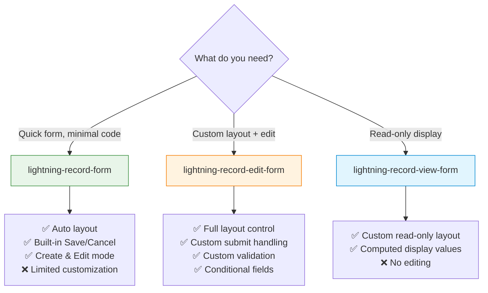
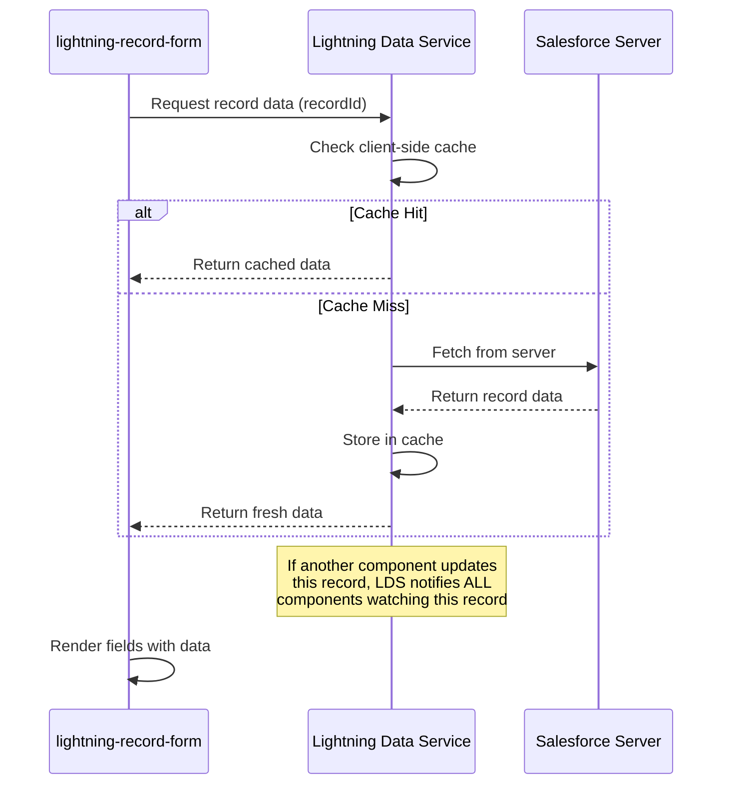

# 09 — 📝 Lightning Data Service (Record Forms)

> The no-Apex way to create, read, and update records — using built-in form components.

---

## 🧠 What You'll Learn

| Concept | Description |
|---------|-------------|
| `lightning-record-form` | Simplest — auto layout, create/view/edit |
| `lightning-record-edit-form` | Custom layout with full control |
| `lightning-record-view-form` | Read-only with custom layout |
| Custom validation | Adding validation beyond standard rules |
| Dynamic record types | Handling different record types |

---

## 📐 Comparing the Three Form Components



| Feature | `record-form` | `record-edit-form` | `record-view-form` |
|---------|:---:|:---:|:---:|
| Auto field layout | ✅ | ❌ | ❌ |
| Custom field layout | ❌ | ✅ | ✅ |
| Create records | ✅ | ✅ | ❌ |
| Edit records | ✅ | ✅ | ❌ |
| View records | ✅ | ❌ | ✅ |
| Custom submit logic | ❌ | ✅ | N/A |
| Custom validation | ❌ | ✅ | N/A |
| Apex needed | ❌ | ❌ | ❌ |
| Complexity | Low | Medium | Low |

---

## ✅ Example 1: `lightning-record-form` — The Simplest Form

### 📄 simpleRecordForm.html

```html
<!-- simpleRecordForm.html -->
<template>
    <lightning-card title="Simple Record Form" icon-name="standard:account">
        <div class="slds-m-around_medium">

            <!--
                ╔════════════════════════════════════════════════════════════╗
                ║  lightning-record-form                                     ║
                ╠════════════════════════════════════════════════════════════╣
                ║  • Simplest approach — minimal code needed                ║
                ║  • Automatically handles Create, Edit, and View modes     ║
                ║  • Built-in Save and Cancel buttons                       ║
                ║  • Uses the standard Salesforce field layout              ║
                ║  • No custom submit handling possible                     ║
                ╚════════════════════════════════════════════════════════════╝

                Key Attributes:
                - record-id: if provided → Edit/View mode
                             if omitted  → Create mode
                - object-api-name: the sObject (e.g., Account)
                - fields: array of field API names to display
                - mode: 'view', 'edit', or 'readonly'
                - columns: number of columns (1 or 2)
            -->

            <!-- Toggle between Create and Edit mode -->
            <lightning-button-group class="slds-m-bottom_medium">
                <lightning-button
                    label="Create Mode"
                    onclick={handleCreateMode}
                    variant={createVariant}
                ></lightning-button>
                <lightning-button
                    label="Edit Mode"
                    onclick={handleEditMode}
                    variant={editVariant}
                ></lightning-button>
            </lightning-button-group>

            <!-- CREATE MODE: No record-id → creates a new record -->
            <lightning-record-form
                lwc:if={isCreateMode}
                object-api-name="Account"
                fields={accountFields}
                columns="2"
                onsuccess={handleSuccess}
                onerror={handleError}
            ></lightning-record-form>

            <!-- EDIT MODE: With record-id → edits existing record -->
            <lightning-record-form
                lwc:if={isEditMode}
                record-id={recordId}
                object-api-name="Account"
                fields={accountFields}
                mode="edit"
                columns="2"
                onsuccess={handleSuccess}
                onerror={handleError}
            ></lightning-record-form>

        </div>
    </lightning-card>
</template>
```

### 📄 simpleRecordForm.js

```javascript
// simpleRecordForm.js
import { LightningElement, api } from 'lwc';
import { ShowToastEvent } from 'lightning/platformShowToastEvent';

// Import field references for type safety
import NAME_FIELD from '@salesforce/schema/Account.Name';
import INDUSTRY_FIELD from '@salesforce/schema/Account.Industry';
import PHONE_FIELD from '@salesforce/schema/Account.Phone';
import WEBSITE_FIELD from '@salesforce/schema/Account.Website';
import REVENUE_FIELD from '@salesforce/schema/Account.AnnualRevenue';
import EMPLOYEES_FIELD from '@salesforce/schema/Account.NumberOfEmployees';

export default class SimpleRecordForm extends LightningElement {

    @api recordId;  // Auto-populated on record pages

    mode = 'create';

    // Fields to display in the form
    accountFields = [
        NAME_FIELD,
        INDUSTRY_FIELD,
        PHONE_FIELD,
        WEBSITE_FIELD,
        REVENUE_FIELD,
        EMPLOYEES_FIELD
    ];

    get isCreateMode() { return this.mode === 'create'; }
    get isEditMode() { return this.mode === 'edit'; }
    get createVariant() { return this.isCreateMode ? 'brand' : 'neutral'; }
    get editVariant() { return this.isEditMode ? 'brand' : 'neutral'; }

    handleCreateMode() { this.mode = 'create'; }
    handleEditMode() { this.mode = 'edit'; }

    // Built-in success handler
    handleSuccess(event) {
        const recordId = event.detail.id;
        this.dispatchEvent(new ShowToastEvent({
            title: 'Success!',
            message: `Record ${this.isCreateMode ? 'created' : 'updated'}: ${recordId}`,
            variant: 'success'
        }));
    }

    // Built-in error handler
    handleError(event) {
        this.dispatchEvent(new ShowToastEvent({
            title: 'Error',
            message: event.detail.message || 'An error occurred',
            variant: 'error'
        }));
    }
}
```

### 📄 simpleRecordForm.css

```css
/* simpleRecordForm.css */
:host {
    display: block;
}
```

### 📄 simpleRecordForm.js-meta.xml

```xml
<?xml version="1.0" encoding="UTF-8"?>
<LightningComponentBundle xmlns="http://soap.sforce.com/2006/04/metadata">
    <apiVersion>62.0</apiVersion>
    <isExposed>true</isExposed>
    <targets>
        <target>lightning__AppPage</target>
        <target>lightning__RecordPage</target>
        <target>lightning__HomePage</target>
    </targets>
    <targetConfigs>
        <targetConfig targets="lightning__RecordPage">
            <objects>
                <object>Account</object>
            </objects>
        </targetConfig>
    </targetConfigs>
</LightningComponentBundle>
```

---

## ✅ Example 2: `lightning-record-edit-form` — Custom Layout with Validation

### 📄 customEditForm.html

```html
<!-- customEditForm.html -->
<template>
    <lightning-card title="Custom Contact Form" icon-name="standard:contact">
        <div class="slds-m-around_medium">
            <!--
                ╔════════════════════════════════════════════════════════════╗
                ║  lightning-record-edit-form                                ║
                ╠════════════════════════════════════════════════════════════╣
                ║  • Full control over field layout                         ║
                ║  • Use lightning-input-field for each field                ║
                ║  • Custom submit handling (onsubmit event)                ║
                ║  • Custom validation before submit                        ║
                ║  • Can mix with regular HTML/lightning components          ║
                ╚════════════════════════════════════════════════════════════╝
            -->
            <lightning-record-edit-form
                record-id={recordId}
                object-api-name="Contact"
                onsuccess={handleSuccess}
                onerror={handleError}
                onsubmit={handleSubmit}
            >
                <!-- Custom layout with sections -->
                <div class="form-section">
                    <h2 class="section-title">Personal Information</h2>
                    <div class="slds-grid slds-gutters">
                        <div class="slds-col slds-size_1-of-2">
                            <!-- 
                                lightning-input-field automatically:
                                - Shows the correct input type for the field
                                - Applies standard validation rules
                                - Handles picklist options
                                - Respects FLS (Field Level Security)
                            -->
                            <lightning-input-field
                                field-name="FirstName"
                            ></lightning-input-field>
                        </div>
                        <div class="slds-col slds-size_1-of-2">
                            <lightning-input-field
                                field-name="LastName"
                                required
                            ></lightning-input-field>
                        </div>
                    </div>
                    <div class="slds-grid slds-gutters">
                        <div class="slds-col slds-size_1-of-2">
                            <lightning-input-field
                                field-name="Email"
                            ></lightning-input-field>
                        </div>
                        <div class="slds-col slds-size_1-of-2">
                            <lightning-input-field
                                field-name="Phone"
                            ></lightning-input-field>
                        </div>
                    </div>
                </div>

                <div class="form-section slds-m-top_medium">
                    <h2 class="section-title">Company Details</h2>
                    <div class="slds-grid slds-gutters">
                        <div class="slds-col slds-size_1-of-2">
                            <lightning-input-field
                                field-name="AccountId"
                            ></lightning-input-field>
                        </div>
                        <div class="slds-col slds-size_1-of-2">
                            <lightning-input-field
                                field-name="Title"
                            ></lightning-input-field>
                        </div>
                    </div>
                    <lightning-input-field
                        field-name="Department"
                    ></lightning-input-field>
                </div>

                <!-- Custom input (not a Salesforce field) for validation -->
                <div class="form-section slds-m-top_medium">
                    <h2 class="section-title">Additional Verification</h2>
                    <lightning-input
                        type="text"
                        label="Verification Code"
                        value={verificationCode}
                        onchange={handleVerificationChange}
                        placeholder="Enter 6-digit code"
                        required
                        pattern="[0-9]{6}"
                        message-when-pattern-mismatch="Must be exactly 6 digits"
                    ></lightning-input>
                </div>

                <!-- Custom message area -->
                <lightning-messages></lightning-messages>

                <!-- Custom button area -->
                <div class="button-area slds-m-top_medium">
                    <lightning-button
                        type="submit"
                        label={submitLabel}
                        variant="brand"
                        disabled={isSubmitting}
                    ></lightning-button>
                    <lightning-button
                        label="Reset"
                        onclick={handleReset}
                        class="slds-m-left_small"
                    ></lightning-button>
                </div>
            </lightning-record-edit-form>
        </div>
    </lightning-card>
</template>
```

### 📄 customEditForm.js

```javascript
// customEditForm.js
import { LightningElement, api } from 'lwc';
import { ShowToastEvent } from 'lightning/platformShowToastEvent';

export default class CustomEditForm extends LightningElement {

    @api recordId;    // If provided, edits existing record

    verificationCode = '';
    isSubmitting = false;

    get submitLabel() {
        return this.isSubmitting ? 'Saving...' : (this.recordId ? 'Update Contact' : 'Create Contact');
    }

    handleVerificationChange(event) {
        this.verificationCode = event.target.value;
    }

    // ╔════════════════════════════════════════════════════════════╗
    // ║  CUSTOM SUBMIT HANDLER                                     ║
    // ╠════════════════════════════════════════════════════════════╣
    // ║  The onsubmit event fires BEFORE the record is saved.     ║
    // ║  You can:                                                  ║
    // ║    1. Validate custom fields                               ║
    // ║    2. Modify field values before save                      ║
    // ║    3. Prevent submission with event.preventDefault()        ║
    // ║    4. Add/remove fields from the payload                   ║
    // ╚════════════════════════════════════════════════════════════╝
    handleSubmit(event) {
        // PREVENT the default submit — we'll handle it manually
        event.preventDefault();

        // Custom validation
        if (!this.validateVerificationCode()) {
            this.dispatchEvent(new ShowToastEvent({
                title: 'Validation Error',
                message: 'Please enter a valid 6-digit verification code.',
                variant: 'error'
            }));
            return;
        }

        // Get the submitted fields
        const fields = event.detail.fields;

        // Modify fields before saving
        // You can add computed values, transform data, etc.
        fields.Description = `Verified with code: ${this.verificationCode}`;

        this.isSubmitting = true;

        // Submit the form with modified fields
        this.template
            .querySelector('lightning-record-edit-form')
            .submit(fields);
    }

    validateVerificationCode() {
        const codePattern = /^[0-9]{6}$/;
        return codePattern.test(this.verificationCode);
    }

    handleSuccess(event) {
        this.isSubmitting = false;
        const recordId = event.detail.id;

        this.dispatchEvent(new ShowToastEvent({
            title: 'Success!',
            message: `Contact saved: ${recordId}`,
            variant: 'success'
        }));
    }

    handleError(event) {
        this.isSubmitting = false;
        this.dispatchEvent(new ShowToastEvent({
            title: 'Error',
            message: event.detail.message,
            variant: 'error',
            mode: 'sticky'
        }));
    }

    handleReset() {
        // Reset all lightning-input-field elements
        const inputFields = this.template.querySelectorAll('lightning-input-field');
        if (inputFields) {
            inputFields.forEach(field => {
                field.reset();
            });
        }
        this.verificationCode = '';
    }
}
```

### 📄 customEditForm.css

```css
/* customEditForm.css */
.form-section {
    padding: 16px;
    background-color: #f7f9fb;
    border-radius: 8px;
    border: 1px solid #e5e5e5;
}

.section-title {
    font-size: 14px;
    font-weight: 700;
    color: #032d60;
    margin-bottom: 12px;
    text-transform: uppercase;
    letter-spacing: 0.5px;
    border-bottom: 2px solid #0176d3;
    padding-bottom: 8px;
}

.button-area {
    display: flex;
    justify-content: flex-end;
}

:host {
    display: block;
}
```

### 📄 customEditForm.js-meta.xml

```xml
<?xml version="1.0" encoding="UTF-8"?>
<LightningComponentBundle xmlns="http://soap.sforce.com/2006/04/metadata">
    <apiVersion>62.0</apiVersion>
    <isExposed>true</isExposed>
    <targets>
        <target>lightning__AppPage</target>
        <target>lightning__RecordPage</target>
    </targets>
    <targetConfigs>
        <targetConfig targets="lightning__RecordPage">
            <objects>
                <object>Contact</object>
            </objects>
        </targetConfig>
    </targetConfigs>
</LightningComponentBundle>
```

---

## ✅ Example 3: `lightning-record-view-form` — Read-Only Display

### 📄 contactViewer.html

```html
<!-- contactViewer.html -->
<template>
    <lightning-card title="Contact Details" icon-name="standard:contact">
        <div class="slds-m-around_medium">

            <!--
                ╔════════════════════════════════════════════════════════════╗
                ║  lightning-record-view-form                                ║
                ╠════════════════════════════════════════════════════════════╣
                ║  • Read-only display with custom layout                   ║
                ║  • Uses lightning-output-field for each field              ║
                ║  • Automatically formats field values (dates, currencies)  ║
                ║  • Respects FLS — hidden fields are not shown             ║
                ║  • No submit/save — purely for display                    ║
                ╚════════════════════════════════════════════════════════════╝
            -->
            <lightning-record-view-form
                record-id={recordId}
                object-api-name="Contact"
            >
                <!-- Custom two-column layout -->
                <div class="view-container">
                    <div class="view-section">
                        <h3 class="section-header">👤 Personal</h3>
                        <div class="slds-grid slds-gutters slds-wrap">
                            <div class="slds-col slds-size_1-of-2">
                                <!-- 
                                    lightning-output-field renders the field value
                                    in the appropriate format:
                                    - Text → plain text
                                    - Currency → formatted with symbol
                                    - Date → localized date format
                                    - Lookup → clickable link
                                    - Picklist → display value
                                -->
                                <lightning-output-field field-name="FirstName"></lightning-output-field>
                            </div>
                            <div class="slds-col slds-size_1-of-2">
                                <lightning-output-field field-name="LastName"></lightning-output-field>
                            </div>
                            <div class="slds-col slds-size_1-of-2">
                                <lightning-output-field field-name="Email"></lightning-output-field>
                            </div>
                            <div class="slds-col slds-size_1-of-2">
                                <lightning-output-field field-name="Phone"></lightning-output-field>
                            </div>
                        </div>
                    </div>

                    <div class="view-section slds-m-top_medium">
                        <h3 class="section-header">🏢 Company</h3>
                        <div class="slds-grid slds-gutters slds-wrap">
                            <div class="slds-col slds-size_1-of-2">
                                <lightning-output-field field-name="AccountId"></lightning-output-field>
                            </div>
                            <div class="slds-col slds-size_1-of-2">
                                <lightning-output-field field-name="Title"></lightning-output-field>
                            </div>
                            <div class="slds-col slds-size_1-of-1">
                                <lightning-output-field field-name="MailingAddress"></lightning-output-field>
                            </div>
                        </div>
                    </div>

                    <div class="view-section slds-m-top_medium">
                        <h3 class="section-header">📅 System</h3>
                        <div class="slds-grid slds-gutters">
                            <div class="slds-col slds-size_1-of-2">
                                <lightning-output-field field-name="CreatedDate"></lightning-output-field>
                            </div>
                            <div class="slds-col slds-size_1-of-2">
                                <lightning-output-field field-name="LastModifiedDate"></lightning-output-field>
                            </div>
                        </div>
                    </div>
                </div>
            </lightning-record-view-form>
        </div>
    </lightning-card>
</template>
```

### 📄 contactViewer.js

```javascript
// contactViewer.js
import { LightningElement, api } from 'lwc';

export default class ContactViewer extends LightningElement {
    @api recordId;
    // That's it! lightning-record-view-form handles everything.
    // No Apex, no wire, no data fetching code needed.
}
```

### 📄 contactViewer.css

```css
/* contactViewer.css */
.view-container {
    padding: 8px 0;
}

.view-section {
    padding: 16px;
    background: #f7f9fb;
    border-radius: 8px;
    border: 1px solid #e5e5e5;
}

.section-header {
    font-size: 14px;
    font-weight: 700;
    color: #032d60;
    margin-bottom: 12px;
    padding-bottom: 8px;
    border-bottom: 2px solid #0176d3;
}

:host {
    display: block;
}
```

### 📄 contactViewer.js-meta.xml

```xml
<?xml version="1.0" encoding="UTF-8"?>
<LightningComponentBundle xmlns="http://soap.sforce.com/2006/04/metadata">
    <apiVersion>62.0</apiVersion>
    <isExposed>true</isExposed>
    <targets>
        <target>lightning__RecordPage</target>
    </targets>
    <targetConfigs>
        <targetConfig targets="lightning__RecordPage">
            <objects>
                <object>Contact</object>
            </objects>
        </targetConfig>
    </targetConfigs>
</LightningComponentBundle>
```

> [!TIP]
> `lightning-record-view-form` is the **lightest weight** option for displaying record data. It requires no Apex, no wire service, and no JavaScript beyond the `recordId`. It automatically respects Field Level Security (FLS) and sharing rules.

---

## ✅ Example 4: Dynamic Record Type Handling

### 📄 dynamicForm.js

```javascript
// dynamicForm.js
import { LightningElement, api, wire } from 'lwc';
import { getObjectInfo } from 'lightning/uiObjectInfoApi';
import ACCOUNT_OBJECT from '@salesforce/schema/Account';

export default class DynamicForm extends LightningElement {
    @api recordId;

    recordTypeId;
    recordTypeOptions = [];

    // Wire to get object metadata, including record types
    @wire(getObjectInfo, { objectApiName: ACCOUNT_OBJECT })
    wiredObjectInfo({ data, error }) {
        if (data) {
            const rtInfos = data.recordTypeInfos;
            this.recordTypeOptions = Object.values(rtInfos)
                .filter(rt => rt.available && !rt.master)
                .map(rt => ({
                    label: rt.name,
                    value: rt.recordTypeId
                }));

            // Set default record type
            const defaultRT = Object.values(rtInfos).find(rt => rt.defaultRecordTypeMapping);
            if (defaultRT) {
                this.recordTypeId = defaultRT.recordTypeId;
            }
        }
    }

    handleRecordTypeChange(event) {
        this.recordTypeId = event.detail.value;
    }

    // Fields may vary by record type — this getter adjusts them
    get formFields() {
        // Base fields for all record types
        const baseFields = ['Name', 'Industry', 'Phone'];
        // Additional fields for specific record types
        // (In a real app, you'd map record type IDs to field sets)
        return baseFields;
    }
}
```

```html
<!-- dynamicForm.html -->
<template>
    <lightning-card title="Dynamic Form" icon-name="standard:record">
        <div class="slds-m-around_medium">
            <!-- Record type selector -->
            <lightning-combobox
                lwc:if={hasRecordTypes}
                label="Record Type"
                value={recordTypeId}
                options={recordTypeOptions}
                onchange={handleRecordTypeChange}
                class="slds-m-bottom_medium"
            ></lightning-combobox>

            <!-- Form adapts to selected record type -->
            <lightning-record-form
                lwc:if={recordTypeId}
                object-api-name="Account"
                record-type-id={recordTypeId}
                fields={formFields}
                columns="2"
            ></lightning-record-form>
        </div>
    </lightning-card>
</template>
```

---

## 📐 LDS Data Flow



---

## ⚠️ Common LDS Form Mistakes

| Mistake | Fix |
|---------|-----|
| Using field name string instead of import | Import from `@salesforce/schema/Object.Field` |
| Missing `record-id` on edit form | Required to edit existing records |
| Forgetting `<lightning-messages>` on edit form | Add it to show server-side errors |
| Not handling `onsuccess` event | Always handle to show user feedback |
| Using `record-edit-form` for read-only | Use `record-view-form` instead |

---

## 🔑 Key Takeaways

| Concept | Key Point |
|---------|-----------|
| **`record-form`** | Simplest option — auto layout, minimal code |
| **`record-edit-form`** | Full control — custom layout, validation, submit |
| **`record-view-form`** | Read-only display — lightest weight |
| **`lightning-input-field`** | Used inside `record-edit-form` for editable fields |
| **`lightning-output-field`** | Used inside `record-view-form` for display fields |
| **No Apex needed** | LDS handles all data fetching and caching |
| **FLS respected** | Fields the user can't see are automatically hidden |
| **`onsubmit`** | Custom validation and field modification before save |
| **`<lightning-messages>`** | Required inside edit forms to show server errors |

---

*Previous: [08 — Parent-Child ←](./08-parent-child.md) · Next: [10 — Datatable →](./10-datatable.md)*
