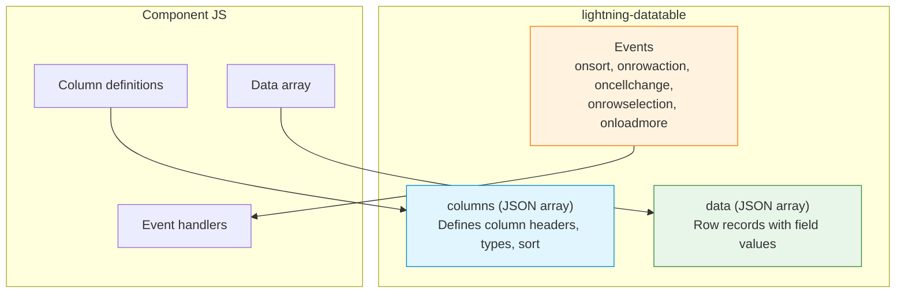

# 10 — 📊 Datatable

> Build feature-rich data tables with sorting, row actions, inline editing, and infinite scrolling.

---

## 🧠 What You'll Learn

| Concept | Description |
|---------|-------------|
| Basic datatable | Defining columns and binding data |
| Sortable columns | Client-side sorting with click handlers |
| Row actions | Dropdown menus on each row |
| Inline editing | Edit cells directly in the table |
| Infinite scrolling | Load more data as the user scrolls |
| Selection handling | Single and multi-row selection |
| Custom data types | Rendering custom cell content |

---

## 📐 Datatable Architecture



---

## ✅ Example 1: Basic Datatable with Columns

### 📄 basicDatatable.html

```html
<!-- basicDatatable.html -->
<template>
    <lightning-card title="Account Directory" icon-name="standard:account">
        <div class="slds-m-around_medium">

            <!-- Search filter -->
            <lightning-input
                type="search"
                label="Search"
                placeholder="Filter accounts..."
                onchange={handleSearch}
                class="slds-m-bottom_medium"
            ></lightning-input>

            <!--
                ╔════════════════════════════════════════════════════════════╗
                ║  lightning-datatable                                       ║
                ╠════════════════════════════════════════════════════════════╣
                ║  key-field: unique identifier field (usually 'Id')        ║
                ║  data: array of record objects                            ║
                ║  columns: array of column definition objects              ║
                ║  hide-checkbox-column: removes selection checkboxes       ║
                ╚════════════════════════════════════════════════════════════╝
            -->
            <lightning-datatable
                key-field="id"
                data={filteredData}
                columns={columns}
                hide-checkbox-column
            ></lightning-datatable>

            <!-- Record count -->
            <p class="record-count slds-m-top_small">
                Showing {recordCount} records
            </p>
        </div>
    </lightning-card>
</template>
```

### 📄 basicDatatable.js

```javascript
// basicDatatable.js
import { LightningElement } from 'lwc';

// ╔════════════════════════════════════════════════════════════════╗
// ║  COLUMN DEFINITIONS                                            ║
// ╠════════════════════════════════════════════════════════════════╣
// ║  Each column object defines:                                   ║
// ║    label: header text                                          ║
// ║    fieldName: key in the data objects to display                ║
// ║    type: data type (text, number, currency, percent,           ║
// ║          date, boolean, url, email, phone, etc.)                ║
// ║    typeAttributes: type-specific formatting options             ║
// ║    sortable: whether the column can be sorted                  ║
// ║    cellAttributes: styling for cells                           ║
// ╚════════════════════════════════════════════════════════════════╝
const COLUMNS = [
    {
        label: 'Account Name',
        fieldName: 'name',
        type: 'text',
        sortable: true,
        cellAttributes: {
            class: { fieldName: 'nameClass' }    // Dynamic cell class
        }
    },
    {
        label: 'Industry',
        fieldName: 'industry',
        type: 'text',
        sortable: true
    },
    {
        label: 'Revenue',
        fieldName: 'revenue',
        type: 'currency',
        sortable: true,
        typeAttributes: {
            currencyCode: 'USD',
            minimumFractionDigits: 0,
            maximumFractionDigits: 0
        },
        cellAttributes: { alignment: 'right' }
    },
    {
        label: 'Employees',
        fieldName: 'employees',
        type: 'number',
        sortable: true,
        cellAttributes: { alignment: 'right' }
    },
    {
        label: 'Website',
        fieldName: 'website',
        type: 'url',
        typeAttributes: {
            label: { fieldName: 'websiteLabel' },  // Display text
            target: '_blank'                         // Open in new tab
        }
    },
    {
        label: 'Created',
        fieldName: 'createdDate',
        type: 'date',
        typeAttributes: {
            year: 'numeric',
            month: 'short',
            day: '2-digit'
        },
        sortable: true
    }
];

export default class BasicDatatable extends LightningElement {

    columns = COLUMNS;
    searchTerm = '';

    // Sample data — in production, this comes from @wire or imperative Apex
    allData = [
        { id: '001', name: 'Acme Corp', industry: 'Technology', revenue: 5000000,
          employees: 250, website: 'https://acme.com', websiteLabel: 'acme.com',
          createdDate: '2024-01-15', nameClass: 'slds-text-title_bold' },
        { id: '002', name: 'Global Industries', industry: 'Manufacturing', revenue: 12000000,
          employees: 1200, website: 'https://global.com', websiteLabel: 'global.com',
          createdDate: '2024-02-20', nameClass: '' },
        { id: '003', name: 'Tech Solutions', industry: 'Technology', revenue: 3500000,
          employees: 180, website: 'https://techsol.com', websiteLabel: 'techsol.com',
          createdDate: '2024-03-10', nameClass: '' },
        { id: '004', name: 'Green Energy Co', industry: 'Energy', revenue: 8000000,
          employees: 450, website: 'https://greenenergy.com', websiteLabel: 'greenenergy.com',
          createdDate: '2024-04-05', nameClass: '' },
        { id: '005', name: 'City Finance', industry: 'Finance', revenue: 20000000,
          employees: 3000, website: 'https://cityfinance.com', websiteLabel: 'cityfinance.com',
          createdDate: '2024-05-22', nameClass: 'slds-text-title_bold' },
    ];

    // Filtered data based on search
    get filteredData() {
        if (!this.searchTerm) return this.allData;
        const term = this.searchTerm.toLowerCase();
        return this.allData.filter(row =>
            row.name.toLowerCase().includes(term) ||
            row.industry.toLowerCase().includes(term)
        );
    }

    get recordCount() {
        return this.filteredData.length;
    }

    handleSearch(event) {
        this.searchTerm = event.target.value;
    }
}
```

### 📄 basicDatatable.css

```css
/* basicDatatable.css */
.record-count {
    font-size: 12px;
    color: #706e6b;
    text-align: right;
}

:host {
    display: block;
}
```

### 📄 basicDatatable.js-meta.xml

```xml
<?xml version="1.0" encoding="UTF-8"?>
<LightningComponentBundle xmlns="http://soap.sforce.com/2006/04/metadata">
    <apiVersion>62.0</apiVersion>
    <isExposed>true</isExposed>
    <targets>
        <target>lightning__AppPage</target>
        <target>lightning__HomePage</target>
    </targets>
</LightningComponentBundle>
```

---

## ✅ Example 2: Sortable Columns

### 📄 sortableDatatable.html

```html
<!-- sortableDatatable.html -->
<template>
    <lightning-card title="Sortable Table" icon-name="standard:list_view">
        <div class="slds-m-around_medium">
            <lightning-datatable
                key-field="id"
                data={sortedData}
                columns={columns}
                sorted-by={sortedBy}
                sorted-direction={sortedDirection}
                onsort={handleSort}
                hide-checkbox-column
            ></lightning-datatable>
        </div>
    </lightning-card>
</template>
```

### 📄 sortableDatatable.js

```javascript
// sortableDatatable.js
import { LightningElement } from 'lwc';

const COLUMNS = [
    { label: 'Name', fieldName: 'name', type: 'text', sortable: true },
    { label: 'Revenue', fieldName: 'revenue', type: 'currency', sortable: true,
      typeAttributes: { currencyCode: 'USD' } },
    { label: 'Employees', fieldName: 'employees', type: 'number', sortable: true },
    { label: 'Rating', fieldName: 'rating', type: 'text', sortable: true },
];

export default class SortableDatatable extends LightningElement {

    columns = COLUMNS;

    // Sort state
    sortedBy = 'name';
    sortedDirection = 'asc';

    data = [
        { id: '1', name: 'Alpha Inc', revenue: 5000000, employees: 200, rating: 'Hot' },
        { id: '2', name: 'Beta Corp', revenue: 3000000, employees: 150, rating: 'Warm' },
        { id: '3', name: 'Gamma LLC', revenue: 8000000, employees: 500, rating: 'Hot' },
        { id: '4', name: 'Delta Co', revenue: 1000000, employees: 50, rating: 'Cold' },
        { id: '5', name: 'Epsilon Ltd', revenue: 12000000, employees: 1000, rating: 'Hot' },
    ];

    // ╔════════════════════════════════════════════════════════════╗
    // ║  SORT HANDLER                                              ║
    // ╠════════════════════════════════════════════════════════════╣
    // ║  The onsort event fires when a sortable column is clicked. ║
    // ║  event.detail.fieldName — which column was clicked         ║
    // ║  event.detail.sortDirection — 'asc' or 'desc'             ║
    // ║                                                            ║
    // ║  YOU must implement the sorting logic.                     ║
    // ║  The datatable only renders the sort arrows.               ║
    // ╚════════════════════════════════════════════════════════════╝
    handleSort(event) {
        const { fieldName, sortDirection } = event.detail;
        this.sortedBy = fieldName;
        this.sortedDirection = sortDirection;
    }

    // Getter returns a NEW sorted array (never mutate the original)
    get sortedData() {
        const data = [...this.data];
        const field = this.sortedBy;
        const direction = this.sortedDirection === 'asc' ? 1 : -1;

        data.sort((a, b) => {
            let valA = a[field] || '';
            let valB = b[field] || '';

            // Handle string vs number comparison
            if (typeof valA === 'string') {
                valA = valA.toLowerCase();
                valB = (valB || '').toLowerCase();
                return direction * valA.localeCompare(valB);
            }
            return direction * (valA - valB);
        });

        return data;
    }
}
```

---

## ✅ Example 3: Row Actions

### 📄 rowActionsDatatable.js

```javascript
// rowActionsDatatable.js
import { LightningElement } from 'lwc';
import { ShowToastEvent } from 'lightning/platformShowToastEvent';
import { NavigationMixin } from 'lightning/navigation';

// Row action definitions
const ROW_ACTIONS = [
    { label: 'View', name: 'view' },
    { label: 'Edit', name: 'edit' },
    { label: 'Clone', name: 'clone' },
    { label: 'Delete', name: 'delete' },
];

const COLUMNS = [
    { label: 'Name', fieldName: 'name', type: 'text' },
    { label: 'Email', fieldName: 'email', type: 'email' },
    { label: 'Phone', fieldName: 'phone', type: 'phone' },
    { label: 'Status', fieldName: 'status', type: 'text' },
    {
        // ╔════════════════════════════════════════════════════════╗
        // ║  ROW ACTIONS COLUMN                                    ║
        // ║  type: 'action' creates a dropdown menu per row        ║
        // ║  typeAttributes.rowActions = array of action objects    ║
        // ╚════════════════════════════════════════════════════════╝
        type: 'action',
        typeAttributes: {
            rowActions: ROW_ACTIONS,
            menuAlignment: 'right'
        }
    }
];

export default class RowActionsDatatable extends NavigationMixin(LightningElement) {

    columns = COLUMNS;

    data = [
        { id: '1', name: 'Alice Johnson', email: 'alice@example.com',
          phone: '555-0101', status: 'Active' },
        { id: '2', name: 'Bob Smith', email: 'bob@example.com',
          phone: '555-0102', status: 'Inactive' },
        { id: '3', name: 'Carol Williams', email: 'carol@example.com',
          phone: '555-0103', status: 'Active' },
    ];

    // ╔════════════════════════════════════════════════════════════╗
    // ║  ROW ACTION HANDLER                                        ║
    // ╠════════════════════════════════════════════════════════════╣
    // ║  event.detail.action.name — which action was clicked       ║
    // ║  event.detail.row — the data object for the clicked row    ║
    // ╚════════════════════════════════════════════════════════════╝
    handleRowAction(event) {
        const actionName = event.detail.action.name;
        const row = event.detail.row;

        switch (actionName) {
            case 'view':
                this.handleView(row);
                break;
            case 'edit':
                this.handleEdit(row);
                break;
            case 'clone':
                this.handleClone(row);
                break;
            case 'delete':
                this.handleDelete(row);
                break;
            default:
                break;
        }
    }

    handleView(row) {
        // Navigate to the record page
        this[NavigationMixin.Navigate]({
            type: 'standard__recordPage',
            attributes: {
                recordId: row.id,
                actionName: 'view'
            }
        });
    }

    handleEdit(row) {
        this[NavigationMixin.Navigate]({
            type: 'standard__recordPage',
            attributes: {
                recordId: row.id,
                actionName: 'edit'
            }
        });
    }

    handleClone(row) {
        this.dispatchEvent(new ShowToastEvent({
            title: 'Clone',
            message: `Cloning ${row.name}...`,
            variant: 'info'
        }));
    }

    handleDelete(row) {
        // Remove from data array (in production, call Apex)
        this.data = this.data.filter(item => item.id !== row.id);
        this.dispatchEvent(new ShowToastEvent({
            title: 'Deleted',
            message: `${row.name} has been removed.`,
            variant: 'success'
        }));
    }
}
```

```html
<!-- rowActionsDatatable.html -->
<template>
    <lightning-card title="Contacts with Actions" icon-name="standard:contact">
        <div class="slds-m-around_medium">
            <lightning-datatable
                key-field="id"
                data={data}
                columns={columns}
                onrowaction={handleRowAction}
                hide-checkbox-column
            ></lightning-datatable>
        </div>
    </lightning-card>
</template>
```

---

## ✅ Example 4: Inline Editing

### 📄 inlineEditDatatable.html

```html
<!-- inlineEditDatatable.html -->
<template>
    <lightning-card title="Inline Edit Table" icon-name="standard:opportunity">

        <!-- Save button (appears when there are draft values) -->
        <div slot="actions">
            <lightning-button
                lwc:if={hasDraftValues}
                label="Save Changes"
                variant="brand"
                onclick={handleSave}
            ></lightning-button>
            <lightning-button
                lwc:if={hasDraftValues}
                label="Cancel"
                onclick={handleCancel}
                class="slds-m-left_x-small"
            ></lightning-button>
        </div>

        <div class="slds-m-around_medium">
            <lightning-datatable
                key-field="id"
                data={data}
                columns={columns}
                draft-values={draftValues}
                oncellchange={handleCellChange}
                onsave={handleSave}
                oncancel={handleCancel}
                hide-checkbox-column
                show-row-number-column
            ></lightning-datatable>
        </div>
    </lightning-card>
</template>
```

### 📄 inlineEditDatatable.js

```javascript
// inlineEditDatatable.js
import { LightningElement } from 'lwc';
import { ShowToastEvent } from 'lightning/platformShowToastEvent';

const COLUMNS = [
    { label: 'Name', fieldName: 'name', type: 'text', editable: true },
    { label: 'Stage', fieldName: 'stage', type: 'text', editable: true },
    {
        label: 'Amount',
        fieldName: 'amount',
        type: 'currency',
        editable: true,                              // ← Makes this cell editable
        typeAttributes: { currencyCode: 'USD' }
    },
    {
        label: 'Close Date',
        fieldName: 'closeDate',
        type: 'date',
        editable: true,
        typeAttributes: { year: 'numeric', month: 'short', day: '2-digit' }
    },
    { label: 'Probability', fieldName: 'probability', type: 'percent',
      typeAttributes: { maximumFractionDigits: 0 } },
];

export default class InlineEditDatatable extends LightningElement {

    columns = COLUMNS;

    // ╔════════════════════════════════════════════════════════════╗
    // ║  DRAFT VALUES                                              ║
    // ╠════════════════════════════════════════════════════════════╣
    // ║  draftValues holds unsaved changes.                        ║
    // ║  Format: [{ id: 'rowId', fieldName: 'newValue' }, ...]    ║
    // ║  The datatable shows a yellow indicator for edited cells.   ║
    // ║  Clear draftValues after saving or cancelling.              ║
    // ╚════════════════════════════════════════════════════════════╝
    draftValues = [];

    data = [
        { id: '1', name: 'Big Deal', stage: 'Prospecting', amount: 100000,
          closeDate: '2025-03-15', probability: 0.10 },
        { id: '2', name: 'Medium Opp', stage: 'Qualification', amount: 50000,
          closeDate: '2025-04-20', probability: 0.25 },
        { id: '3', name: 'Small Win', stage: 'Closed Won', amount: 15000,
          closeDate: '2025-02-01', probability: 1.00 },
        { id: '4', name: 'Enterprise Deal', stage: 'Negotiation', amount: 500000,
          closeDate: '2025-06-30', probability: 0.60 },
    ];

    get hasDraftValues() {
        return this.draftValues.length > 0;
    }

    // Fires when a user edits a cell
    handleCellChange(event) {
        // event.detail.draftValues contains all pending changes
        this.draftValues = event.detail.draftValues;
    }

    // Save all draft values
    async handleSave() {
        // In production, send draftValues to Apex:
        // await updateRecords({ records: this.draftValues });

        // Apply draft values to the data array
        const updatedData = [...this.data];
        this.draftValues.forEach(draft => {
            const index = updatedData.findIndex(row => row.id === draft.id);
            if (index !== -1) {
                updatedData[index] = { ...updatedData[index], ...draft };
            }
        });

        this.data = updatedData;
        this.draftValues = [];  // Clear drafts

        this.dispatchEvent(new ShowToastEvent({
            title: 'Saved!',
            message: 'All changes have been saved.',
            variant: 'success'
        }));
    }

    handleCancel() {
        // Clear all draft values — reverts the table
        this.draftValues = [];
    }
}
```

---

## ✅ Example 5: Infinite Scrolling

### 📄 infiniteScrollDatatable.html

```html
<!-- infiniteScrollDatatable.html -->
<template>
    <lightning-card title="Infinite Scroll Table" icon-name="standard:data_streams">
        <div class="slds-m-around_medium">
            <p class="record-count slds-m-bottom_small">
                Loaded {loadedCount} of {totalCount} records
            </p>

            <!--
                enable-infinite-loading: activates the onloadmore event
                onloadmore: fires when user scrolls near the bottom
                is-loading: shows a spinner at the bottom while loading
            -->
            <div class="table-container">
                <lightning-datatable
                    key-field="id"
                    data={data}
                    columns={columns}
                    enable-infinite-loading={hasMoreData}
                    onloadmore={handleLoadMore}
                    is-loading={isLoadingMore}
                    hide-checkbox-column
                ></lightning-datatable>
            </div>
        </div>
    </lightning-card>
</template>
```

### 📄 infiniteScrollDatatable.js

```javascript
// infiniteScrollDatatable.js
import { LightningElement } from 'lwc';
// In production: import getRecords from '@salesforce/apex/...';

const COLUMNS = [
    { label: '#', fieldName: 'index', type: 'number', fixedWidth: 60 },
    { label: 'Name', fieldName: 'name', type: 'text' },
    { label: 'Category', fieldName: 'category', type: 'text' },
    { label: 'Amount', fieldName: 'amount', type: 'currency',
      typeAttributes: { currencyCode: 'USD' } },
    { label: 'Date', fieldName: 'date', type: 'date' },
];

const PAGE_SIZE = 20;
const TOTAL_RECORDS = 200;

export default class InfiniteScrollDatatable extends LightningElement {

    columns = COLUMNS;
    data = [];
    isLoadingMore = false;
    totalCount = TOTAL_RECORDS;

    get loadedCount() {
        return this.data.length;
    }

    get hasMoreData() {
        return this.data.length < TOTAL_RECORDS;
    }

    // Load initial data
    connectedCallback() {
        this.loadData();
    }

    // ╔════════════════════════════════════════════════════════════╗
    // ║  INFINITE SCROLL HANDLER                                   ║
    // ╠════════════════════════════════════════════════════════════╣
    // ║  Fires when user scrolls near the bottom.                  ║
    // ║  Load the next page and append to existing data.           ║
    // ║  Set enable-infinite-loading=false when done.              ║
    // ╚════════════════════════════════════════════════════════════╝
    handleLoadMore() {
        if (this.isLoadingMore || !this.hasMoreData) return;

        this.isLoadingMore = true;

        // Simulate network delay (replace with actual Apex call)
        // eslint-disable-next-line @lwc/lwc/no-async-operation
        setTimeout(() => {
            this.loadData();
            this.isLoadingMore = false;
        }, 500);
    }

    loadData() {
        const categories = ['Electronics', 'Books', 'Clothing', 'Food', 'Sports'];
        const startIndex = this.data.length;
        const newRecords = [];

        for (let i = 0; i < PAGE_SIZE && (startIndex + i) < TOTAL_RECORDS; i++) {
            const idx = startIndex + i;
            newRecords.push({
                id: `rec-${idx}`,
                index: idx + 1,
                name: `Product ${idx + 1}`,
                category: categories[idx % categories.length],
                amount: Math.round(Math.random() * 10000) / 100,
                date: new Date(2024, idx % 12, (idx % 28) + 1).toISOString(),
            });
        }

        // APPEND to existing data (don't replace!)
        this.data = [...this.data, ...newRecords];
    }
}
```

### 📄 infiniteScrollDatatable.css

```css
/* infiniteScrollDatatable.css */
.table-container {
    height: 400px;        /* Fixed height enables scrolling */
    overflow: hidden;     /* The datatable handles its own scroll */
}

.record-count {
    font-size: 13px;
    color: #706e6b;
}

:host {
    display: block;
}
```

---

## ✅ Example 6: Selection Handling

### 📄 selectableDatatable.js

```javascript
// selectableDatatable.js
import { LightningElement } from 'lwc';

const COLUMNS = [
    { label: 'Name', fieldName: 'name', type: 'text' },
    { label: 'Email', fieldName: 'email', type: 'email' },
    { label: 'Department', fieldName: 'department', type: 'text' },
];

export default class SelectableDatatable extends LightningElement {

    columns = COLUMNS;
    selectedRows = [];      // Array of selected row IDs
    selectedCount = 0;

    data = [
        { id: '1', name: 'Alice', email: 'alice@test.com', department: 'Engineering' },
        { id: '2', name: 'Bob', email: 'bob@test.com', department: 'Product' },
        { id: '3', name: 'Carol', email: 'carol@test.com', department: 'Design' },
        { id: '4', name: 'Dave', email: 'dave@test.com', department: 'Engineering' },
        { id: '5', name: 'Eve', email: 'eve@test.com', department: 'Marketing' },
    ];

    // ╔════════════════════════════════════════════════════════════╗
    // ║  SELECTION HANDLER                                         ║
    // ╠════════════════════════════════════════════════════════════╣
    // ║  event.detail.selectedRows — array of selected row objects ║
    // ║  To pre-select rows, set selected-rows attribute           ║
    // ║  max-row-selection="1" for single select                   ║
    // ╚════════════════════════════════════════════════════════════╝
    handleRowSelection(event) {
        const selectedRows = event.detail.selectedRows;
        this.selectedCount = selectedRows.length;
        this.selectedRows = selectedRows.map(row => row.id);
    }

    handleBulkAction() {
        if (this.selectedCount === 0) return;
        // Process selected rows...
        console.log('Selected IDs:', JSON.stringify(this.selectedRows));
    }
}
```

```html
<!-- selectableDatatable.html -->
<template>
    <lightning-card title="Select Contacts">
        <div slot="actions">
            <lightning-button
                label="Process Selected ({selectedCount})"
                variant="brand"
                onclick={handleBulkAction}
                disabled={noSelection}
            ></lightning-button>
        </div>
        <div class="slds-m-around_medium">
            <!-- 
                Remove hide-checkbox-column to show checkboxes.
                max-row-selection="1" → single select mode.
                selected-rows={preSelectedIds} → pre-select rows.
            -->
            <lightning-datatable
                key-field="id"
                data={data}
                columns={columns}
                onrowselection={handleRowSelection}
                selected-rows={selectedRows}
            ></lightning-datatable>
        </div>
    </lightning-card>
</template>
```

---

## 📋 Column Type Quick Reference

| Type | Renders As | `typeAttributes` |
|------|-----------|-----------------|
| `text` | Plain text | — |
| `number` | Formatted number | `minimumFractionDigits`, `maximumFractionDigits` |
| `currency` | Currency symbol + number | `currencyCode`, `minimumFractionDigits` |
| `percent` | Number + % | `minimumFractionDigits` |
| `date` | Formatted date | `year`, `month`, `day`, `hour`, `minute` |
| `date-local` | Local date (no TZ conversion) | Same as `date` |
| `boolean` | Checkbox | — |
| `email` | Clickable mailto link | — |
| `phone` | Clickable tel link | — |
| `url` | Clickable hyperlink | `label`, `target`, `tooltip` |
| `action` | Dropdown menu | `rowActions`, `menuAlignment` |
| `button` | Clickable button | `label`, `variant`, `name` |
| `button-icon` | Icon button | `iconName`, `name`, `variant` |

---

## ⚠️ Common Datatable Mistakes

| Mistake | Fix |
|---------|-----|
| Missing `key-field` | Required — must be a unique field in each row |
| Mutating data array in place | Create a new array with spread: `this.data = [...]` |
| Sorting in template | Sort in JS getter; datatable doesn't sort for you |
| `editable: true` without `oncellchange` | Must handle the event to capture changes |
| Infinite scroll without fixed height | The container needs a fixed height for scroll detection |
| Forgetting `onsave`/`oncancel` for inline edit | Must handle both events to clear draft values |

---

## 🔑 Key Takeaways

| Concept | Key Point |
|---------|-----------|
| **Columns** | JSON array defining label, fieldName, type, and options |
| **`key-field`** | Required unique identifier — usually `Id` or `id` |
| **Sorting** | Datatable fires `onsort` — YOU implement the sort logic |
| **Row actions** | `type: 'action'` column with `rowActions` array |
| **Inline editing** | Set `editable: true` on columns; handle `oncellchange` |
| **Draft values** | Unsaved edits — clear them after save or cancel |
| **Infinite scroll** | `enable-infinite-loading` + `onloadmore` handler |
| **Selection** | `onrowselection` event returns selected row objects |
| **Immutability** | Always create NEW arrays — never mutate `this.data` directly |

---

*Previous: [09 — Lightning Data Service ←](./09-lightning-data-service.md) · Back to [README →](./README.md)*
