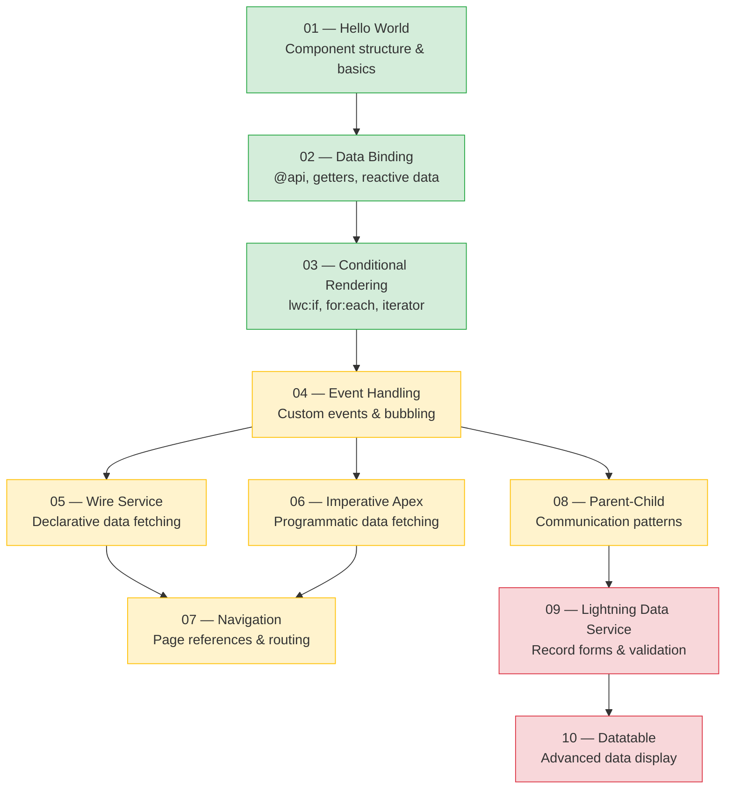
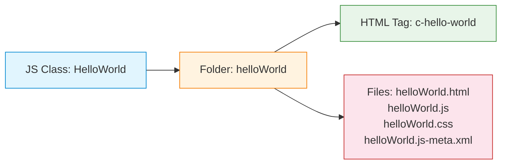

# 📚 LWC Code Examples — Complete Reference

> [!NOTE]
> Every example in this guide is **complete and deployable**. Each includes all four LWC files (`.html`, `.js`, `.css`, `.xml`) with inline comments explaining every line.

---

## 🗂️ Example Index

| # | Example | Difficulty | Key Concepts | File |
|---|---------|-----------|--------------|------|
| 01 | Hello World | 🟢 Beginner | Component structure, decorators, basic rendering | [01-hello-world.md](./01-hello-world.md) |
| 02 | Data Binding | 🟢 Beginner | `@api`, `@track`, getters, reactive properties | [02-data-binding.md](./02-data-binding.md) |
| 03 | Conditional Rendering | 🟢 Beginner | `lwc:if`, `lwc:elseif`, `for:each`, `iterator`, keys | [03-conditional-rendering.md](./03-conditional-rendering.md) |
| 04 | Event Handling | 🟡 Intermediate | Custom events, bubbling, composition, payloads | [04-event-handling.md](./04-event-handling.md) |
| 05 | Wire Service | 🟡 Intermediate | `@wire`, `getRecord`, reactive params, refresh | [05-wire-service.md](./05-wire-service.md) |
| 06 | Imperative Apex | 🟡 Intermediate | `@AuraEnabled`, error handling, chaining, loading | [06-imperative-apex.md](./06-imperative-apex.md) |
| 07 | Navigation | 🟡 Intermediate | `NavigationMixin`, page references, URL generation | [07-navigation.md](./07-navigation.md) |
| 08 | Parent–Child Communication | 🟡 Intermediate | `@api` props, `@api` methods, events, sibling comm | [08-parent-child.md](./08-parent-child.md) |
| 09 | Lightning Data Service | 🔴 Advanced | Record forms, custom validation, dynamic record types | [09-lightning-data-service.md](./09-lightning-data-service.md) |
| 10 | Datatable | 🔴 Advanced | Sorting, row actions, inline edit, infinite scroll | [10-datatable.md](./10-datatable.md) |

---

## 🗺️ Concept Progression

Follow the examples in order — each one builds on concepts from the previous:



---

## 🚀 How to Deploy These Examples

### Prerequisites

| Tool | Purpose | Install Command |
|------|---------|-----------------|
| **Salesforce CLI (sf)** | Deploy to org | `npm install -g @salesforce/cli` |
| **VS Code** | Code editor | [Download](https://code.visualstudio.com/) |
| **Salesforce Extensions for VS Code** | LWC tooling | Install from Extensions Marketplace |
| **A Salesforce Developer Org or Scratch Org** | Runtime | [Sign up free](https://developer.salesforce.com/signup) |

### Step-by-Step Deployment

#### 1️⃣ Create an SFDX Project (if you don't have one)

```bash
# Create a new Salesforce DX project
sf project generate --name lwc-examples --template standard

# Navigate into the project
cd lwc-examples
```

#### 2️⃣ Authorize Your Org

```bash
# For a Developer org (login via browser)
sf org login web --alias myDevOrg --set-default

# For a Scratch org (requires a Dev Hub)
sf org login web --alias myDevHub --set-default-dev-hub
sf org create scratch --definition-file config/project-scratch-def.json --alias myScratchOrg --set-default --duration-days 30
```

#### 3️⃣ Create a Component from an Example

```bash
# Create the component scaffold
sf lightning generate component --type lwc --name helloWorld --output-dir force-app/main/default/lwc
```

Then copy the code from the example into the generated files.

#### 4️⃣ Deploy to Your Org

```bash
# Deploy a single component
sf project deploy start --source-dir force-app/main/default/lwc/helloWorld

# Deploy everything
sf project deploy start --source-dir force-app/main/default
```

#### 5️⃣ Add to a Lightning Page

1. Open your org: `sf org open`
2. Go to **Setup → Lightning App Builder**
3. Create or edit a page
4. Drag your component from the **Custom** section onto the canvas
5. **Save** and **Activate**

> [!TIP]
> For quick testing, use **Setup → Lightning App Builder → New → App Page**. This is the fastest way to see your component in action.

### Project File Structure

```
lwc-examples/
├── force-app/
│   └── main/
│       └── default/
│           ├── lwc/
│           │   ├── helloWorld/
│           │   │   ├── helloWorld.html
│           │   │   ├── helloWorld.js
│           │   │   ├── helloWorld.css
│           │   │   └── helloWorld.js-meta.xml
│           │   ├── dataBinding/
│           │   │   ├── dataBinding.html
│           │   │   ├── dataBinding.js
│           │   │   ├── dataBinding.css
│           │   │   └── dataBinding.js-meta.xml
│           │   └── ... (more components)
│           └── classes/
│               ├── ContactController.cls        ← Apex class
│               └── ContactController.cls-meta.xml
├── sfdx-project.json
└── README.md
```

> [!IMPORTANT]
> The **folder name** must match the **component name** exactly (camelCase). The folder name becomes the HTML tag: `helloWorld` → `<c-hello-world>`.

---

## 🧩 Component Naming Convention



| What You Write | Convention | Example |
|----------------|-----------|---------|
| JS class name | PascalCase | `HelloWorld` |
| Folder & file name | camelCase | `helloWorld/` |
| HTML tag in markup | kebab-case with namespace | `<c-hello-world>` |
| API property | camelCase → kebab-case in HTML | `@api myProp` → `my-prop="..."` |

---

## 📋 Quick-Reference: LWC File Types

| File | Purpose | Required? |
|------|---------|-----------|
| `component.html` | Template — defines the UI markup | ✅ Yes |
| `component.js` | Controller — logic, state, and event handlers | ✅ Yes |
| `component.css` | Styles — scoped to this component only | ❌ Optional |
| `component.js-meta.xml` | Configuration — where the component can be used | ✅ Yes |
| `__tests__/component.test.js` | Jest unit tests | ❌ Optional |

---

## 🔑 Key Takeaways

- Start with **Hello World** and progress through in order
- Every example is **self-contained** and can be deployed independently
- The naming convention (camelCase folder → kebab-case tag) is critical
- Always include the `.js-meta.xml` file — without it, your component won't appear in Lightning App Builder
- Use the **Lightning App Builder** for the fastest way to test components
- All Apex classes needed for examples 05–06 are provided inline

---

*Happy coding! 🚀 Proceed to [01 — Hello World](./01-hello-world.md) to get started.*
