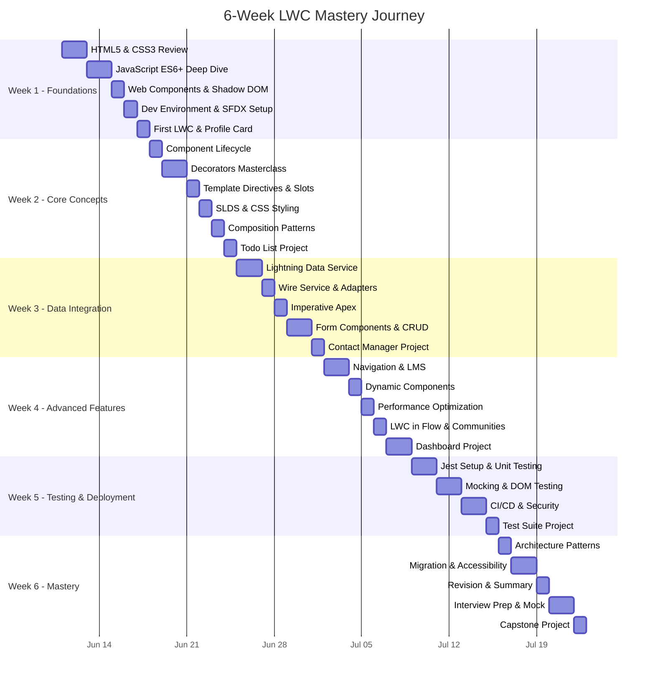
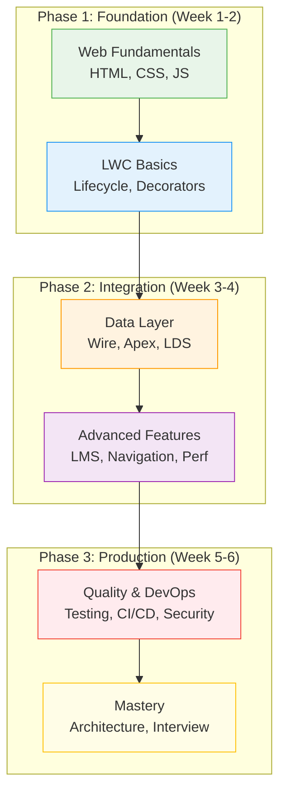

# 🎯 6-Week Comprehensive Study Plan: Salesforce Lightning Web Components

> **From Zero to LWC Hero** — A structured, project-based learning path designed to take you from web fundamentals to production-ready LWC development and interview mastery.

---

## 📋 Plan Overview

| Aspect | Details |
|---|---|
| **Duration** | 6 Weeks (flexible self-paced) |
| **Daily Commitment** | 2–3 hours weekdays, 4–5 hours weekends |
| **Total Hours** | ~100–120 hours |
| **Prerequisites** | Basic programming knowledge |
| **Outcome** | Production-ready LWC skills + Interview readiness |

> [!TIP]
> This plan is designed for focused, daily learning. Consistency beats intensity — 2 hours every day is better than 10 hours on weekends alone.

---

## 🗓️ 6-Week Progression

---

## 📅 Detailed Weekly Schedule

### Week 1: Web Foundations & LWC Setup
📁 [Week 1 Materials →](./week-1-foundations/README.md)

| Day | Topic | Hours | Deliverable |
|-----|-------|-------|-------------|
| Day 1 | HTML5 Essentials — Semantic HTML, forms, accessibility | 2.5 | Semantic page markup exercise |
| Day 2 | CSS3 — Flexbox, Grid, Custom Properties, animations | 2.5 | Responsive layout exercise |
| Day 3 | JavaScript ES6+ — Classes, modules, destructuring | 3 | Module-based calculator |
| Day 4 | JavaScript ES6+ — Promises, async/await, spread/rest | 3 | Async data fetcher exercise |
| Day 5 | Web Components standard, Shadow DOM, LWC architecture | 2.5 | Vanilla web component demo |
| Day 6 | Dev environment setup, SFDX project structure | 3 | Working SFDX project |
| Day 7 | First LWC + **Mini Project: Profile Card** | 4 | Deployed profile card component |

**Learning Objectives:**
- ✅ Master HTML5 semantic elements and form APIs
- ✅ Build responsive layouts with CSS Grid and Flexbox
- ✅ Write modern JavaScript using ES6+ features fluently
- ✅ Understand Web Components and Shadow DOM
- ✅ Set up a complete Salesforce DX development environment
- ✅ Create, deploy, and debug your first LWC

---

### Week 2: Core LWC Concepts
📁 [Week 2 Materials →](./week-2-core-concepts/README.md)

| Day | Topic | Hours | Deliverable |
|-----|-------|-------|-------------|
| Day 1 | Component lifecycle hooks deep-dive | 2.5 | Lifecycle logger component |
| Day 2 | `@api` and `@track` decorators masterclass | 3 | Configurable widget |
| Day 3 | `@wire` decorator + reactive properties | 3 | Wired data display component |
| Day 4 | Template directives (lwc:if, for:each, iterator) | 2.5 | Conditional rendering demo |
| Day 5 | Slots, composition patterns, component communication | 3 | Composed card layout |
| Day 6 | SLDS deep-dive + CSS styling in LWC | 3 | Styled component library |
| Day 7 | **Mini Project: Todo List Application** | 4 | Full CRUD todo app |

**Learning Objectives:**
- ✅ Master the complete LWC lifecycle from construction to disconnection
- ✅ Use decorators correctly for data flow and reactivity
- ✅ Build dynamic templates with conditional and list rendering
- ✅ Compose complex UIs using slots and component patterns
- ✅ Style components using SLDS and scoped CSS

---

### Week 3: Data & Server Integration
📁 [Week 3 Materials →](./week-3-data-integration/README.md)

| Day | Topic | Hours | Deliverable |
|-----|-------|-------|-------------|
| Day 1 | Lightning Data Service architecture | 2.5 | LDS-powered record viewer |
| Day 2 | Wire service — adapters catalog & data flow | 3 | Multi-adapter dashboard |
| Day 3 | Wire to property vs. function patterns | 2.5 | Searchable list with wire |
| Day 4 | Imperative Apex call patterns | 3 | Apex-driven data table |
| Day 5 | Form components (record-form, record-edit-form) | 3 | Dynamic form builder |
| Day 6 | Error handling, validation, and toast messages | 2.5 | Robust error handling layer |
| Day 7 | **Mini Project: Contact Manager CRUD App** | 4 | Full contact manager |

**Learning Objectives:**
- ✅ Understand Lightning Data Service caching and architecture
- ✅ Use wire adapters for declarative data access
- ✅ Call Apex methods imperatively with proper error handling
- ✅ Build forms with validation using lightning form components
- ✅ Implement full CRUD operations

---

### Week 4: Advanced LWC Features
📁 [Week 4 Materials →](./week-4-advanced/README.md)

| Day | Topic | Hours | Deliverable |
|-----|-------|-------|-------------|
| Day 1 | NavigationMixin — all navigation scenarios | 2.5 | Multi-page navigation demo |
| Day 2 | Lightning Message Service (LMS) | 3 | Cross-component messenger |
| Day 3 | Dynamic components + third-party libraries | 3 | Dynamic tab container |
| Day 4 | Performance optimization techniques | 3 | Optimized data list |
| Day 5 | LWC in Flow, Experience Cloud, Lightning Out | 2.5 | Flow-embedded LWC |
| Day 6-7 | **Mini Project: Multi-Component Dashboard** | 6 | Dashboard with LMS |

**Learning Objectives:**
- ✅ Navigate between pages, records, and apps programmatically
- ✅ Implement cross-DOM communication with Lightning Message Service
- ✅ Create components dynamically and integrate third-party libraries
- ✅ Apply performance optimization patterns
- ✅ Use LWC in Flows, Communities, and Lightning Out

---

### Week 5: Testing, Debugging & Deployment
📁 [Week 5 Materials →](./week-5-testing-deployment/README.md)

| Day | Topic | Hours | Deliverable |
|-----|-------|-------|-------------|
| Day 1 | Jest testing framework setup + first tests | 3 | Test suite scaffold |
| Day 2 | Writing unit tests — DOM queries, events | 3 | Component test suite |
| Day 3 | Mocking wire adapters and Apex calls | 3 | Mock-powered tests |
| Day 4 | Debugging — Chrome DevTools + VS Code | 2.5 | Debugging workflow doc |
| Day 5 | Deployment — SF CLI, packages (1GP vs 2GP) | 3 | Package deployment script |
| Day 6 | CI/CD with GitHub Actions + Security (LWS) | 3 | GitHub Actions pipeline |
| Day 7 | **Mini Project: Comprehensive Test Suite** | 4 | 90%+ coverage tests |

**Learning Objectives:**
- ✅ Set up and configure Jest for LWC testing
- ✅ Write unit tests covering DOM, events, and data flow
- ✅ Mock wire adapters and Apex calls in tests
- ✅ Debug LWC using Chrome DevTools and VS Code
- ✅ Deploy using Salesforce CLI and understand package development
- ✅ Implement CI/CD pipelines and understand LWC security

---

### Week 6: Mastery & Interview Preparation
📁 [Week 6 Materials →](./week-6-mastery-interview/README.md)

| Day | Topic | Hours | Deliverable |
|-----|-------|-------|-------------|
| Day 1 | Architecture patterns + system design | 3 | Architecture document |
| Day 2 | Aura-to-LWC migration strategies | 2.5 | Migration checklist |
| Day 3 | Accessibility (a11y) + Internationalization (i18n) | 3 | Accessible component |
| Day 4 | Complete revision — summary tables for all weeks | 3 | Revision cheat sheets |
| Day 5 | Interview prep — 30 rapid-fire questions | 3 | Interview answer bank |
| Day 6 | Mock interview simulation | 3 | Mock interview recording |
| Day 7 | **Capstone Project Planning & Start** | 4 | Capstone project MVP |

**Learning Objectives:**
- ✅ Design scalable LWC architectures for enterprise apps
- ✅ Plan and execute Aura-to-LWC migrations
- ✅ Build accessible, internationalized components
- ✅ Confidently answer LWC interview questions
- ✅ Complete a capstone project demonstrating mastery

---

## 🏗️ Weekly Projects

```mermaid
flowchart LR
    W1["Week 1\nProfile Card"]
    W2["Week 2\nTodo List"]
    W3["Week 3\nContact Manager"]
    W4["Week 4\nDashboard"]
    W5["Week 5\nTest Suite"]
    W6["Week 6\nCapstone"]

    W1 -->|"adds data flow"| W2
    W2 -->|"adds server data"| W3
    W3 -->|"adds navigation"| W4
    W4 -->|"adds testing"| W5
    W5 -->|"combines all"| W6

    style W1 fill:#4CAF50,color:#fff
    style W2 fill:#2196F3,color:#fff
    style W3 fill:#FF9800,color:#fff
    style W4 fill:#9C27B0,color:#fff
    style W5 fill:#F44336,color:#fff
    style W6 fill:#FFD700,color:#000
```

| Week | Project | Key Skills Practiced |
|------|---------|---------------------|
| 1 | **Profile Card Component** | HTML, CSS, basic LWC structure, deployment |
| 2 | **Todo List Application** | Lifecycle, decorators, template directives, events |
| 3 | **Contact Manager CRUD** | Wire service, Apex, LDS, forms, error handling |
| 4 | **Multi-Component Dashboard** | LMS, navigation, dynamic components, performance |
| 5 | **Comprehensive Test Suite** | Jest, mocking, DOM testing, CI/CD |
| 6 | **Capstone Project** | All skills combined, architecture, accessibility |

---

## 📊 Assessment Strategy

### Continuous Assessment (Each Week)
- **20 Practice Questions** — Mix of multiple choice, code analysis, and scenario-based
- **Mini Project** — Hands-on application of weekly concepts
- **Self-Review Checklist** — Track learning objectives completion

### Assessment Scoring Guide

| Score Range | Level | Action |
|-------------|-------|--------|
| 18–20 / 20 | 🏆 Expert | Move on confidently |
| 14–17 / 20 | ✅ Proficient | Review missed topics briefly |
| 10–13 / 20 | ⚠️ Developing | Re-study specific sections |
| Below 10 | 🔄 Needs Review | Revisit the entire week |

### Final Assessment (Week 6)
- 30 rapid-fire revision questions covering all weeks
- Mock interview simulation (behavioral + technical)
- Capstone project evaluation

---

## 💡 Tips for Self-Paced Learning

> [!IMPORTANT]
> **Active Learning > Passive Reading** — Always type out code examples yourself. Never copy-paste without understanding every line.

### 🎯 Maximize Your Learning

1. **Code Along, Don't Just Read**
   - Type every code example into VS Code
   - Modify examples to test your understanding
   - Break things intentionally to learn error handling

2. **Use the Pomodoro Technique**
   - 25 minutes focused study → 5 minute break
   - After 4 pomodoros → 15-30 minute break
   - Track your pomodoros to measure progress

3. **Build a Knowledge Base**
   - Take notes in your own words
   - Create flashcards for key concepts
   - Maintain a "TIL" (Today I Learned) journal

4. **Practice Spaced Repetition**
   - Review Week 1 material briefly during Week 3
   - Revisit Week 2 during Week 4
   - The quizzes are designed for this

5. **Join the Community**
   - Post questions on Salesforce StackExchange
   - Join the Trailblazer Community
   - Share your projects on GitHub

### 🚧 Common Pitfalls to Avoid

| Pitfall | Solution |
|---------|----------|
| Skipping fundamentals (Week 1) | Web foundations make LWC concepts click faster |
| Not deploying to a real org | Get a free Developer Edition org on Day 1 |
| Memorizing without understanding | Focus on *why* before *how* |
| Ignoring testing (Week 5) | Tests are required in real projects and interviews |
| Not building projects | Projects cement knowledge better than reading |

---

## 🔗 Essential Resources

### Official Documentation
| Resource | URL | Purpose |
|----------|-----|---------|
| LWC Developer Guide | [developer.salesforce.com/docs/component-library](https://developer.salesforce.com/docs/component-library/documentation/en/lwc) | Primary reference |
| Component Reference | [developer.salesforce.com/docs/component-library](https://developer.salesforce.com/docs/component-library/overview/components) | Base component catalog |
| Trailhead LWC Module | [trailhead.salesforce.com](https://trailhead.salesforce.com/en/content/learn/trails/build-lightning-web-components) | Guided learning |
| LWC Recipes | [github.com/trailheadapps/lwc-recipes](https://github.com/trailheadapps/lwc-recipes) | Code examples |
| SLDS | [lightningdesignsystem.com](https://www.lightningdesignsystem.com/) | Styling reference |

### Development Tools
| Tool | Purpose |
|------|---------|
| [VS Code](https://code.visualstudio.com/) | Primary IDE |
| [Salesforce Extension Pack](https://marketplace.visualstudio.com/items?itemName=salesforce.salesforcedx-vscode) | VS Code extension for SF development |
| [Salesforce CLI](https://developer.salesforce.com/tools/salesforcecli) | Command-line deployment and org management |
| [Developer Edition Org](https://developer.salesforce.com/signup) | Free practice environment |

### Supplementary Learning
| Resource | Type | Best For |
|----------|------|----------|
| [LWC Playground](https://developer.salesforce.com/docs/component-library/tools/playground) | Interactive | Quick experiments |
| [Apex Developer Guide](https://developer.salesforce.com/docs/atlas.en-us.apexcode.meta/apexcode/) | Documentation | Server-side code |
| [Salesforce StackExchange](https://salesforce.stackexchange.com/) | Q&A Forum | Troubleshooting |
| [Unofficial SF Podcast](https://unofficialsf.com/) | Podcast | Staying current |

---

## 🗺️ Learning Path Architecture

---

## ✅ Pre-Study Checklist

Before starting Week 1, make sure you have:

- [ ] A computer with VS Code installed
- [ ] A free [Salesforce Developer Edition](https://developer.salesforce.com/signup) org
- [ ] [Salesforce CLI](https://developer.salesforce.com/tools/salesforcecli) installed
- [ ] [Salesforce Extension Pack](https://marketplace.visualstudio.com/items?itemName=salesforce.salesforcedx-vscode) for VS Code
- [ ] A GitHub account for version control
- [ ] Node.js (v18+) and npm installed
- [ ] Bookmarked the resources listed above
- [ ] Blocked 2-3 hours daily on your calendar

> [!NOTE]
> **Ready to start?** Head to [Week 1: Web Foundations & LWC Setup →](./week-1-foundations/README.md) and begin your journey!

---

*Created for the Salesforce LWC Study Guide — a comprehensive, self-paced learning resource.*
