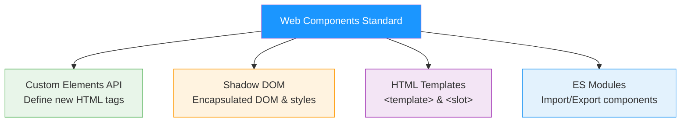
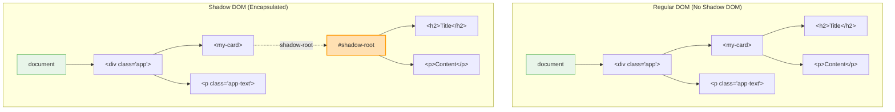
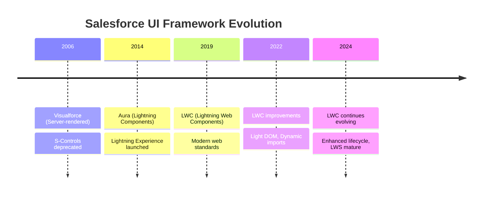
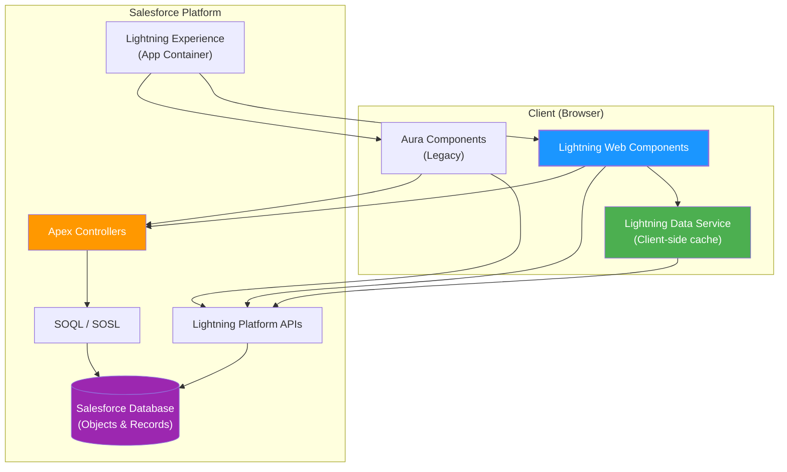

# 📦 Week 1: Web Foundations & LWC Setup

> **Goal:** Build a rock-solid foundation in modern web technologies and get your first Lightning Web Component deployed to a Salesforce org.

---

## 📑 Table of Contents

1. [HTML5 Essentials Review](#-html5-essentials-review)
2. [CSS3 Review](#-css3-review)
3. [JavaScript ES6+ Review](#-javascript-es6-review)
4. [Web Components Standard](#-web-components-standard)
5. [Shadow DOM Deep Dive](#-shadow-dom-deep-dive)
6. [LWC vs Aura vs Visualforce](#-lwc-vs-aura-vs-visualforce)
7. [Salesforce Platform Overview](#-salesforce-platform-overview-for-lwc)
8. [Dev Environment Setup](#-setting-up-your-development-environment)
9. [SFDX Project Structure](#-sfdx-project-structure-deep-dive)
10. [Your First LWC](#-creating-deploying-and-debugging-your-first-lwc)
11. [Practice Questions](#-practice-questions)
12. [Mini Project: Profile Card](#-mini-project-profile-card-component)

---

## 🏗️ HTML5 Essentials Review

### Why HTML Matters for LWC
LWC templates are HTML files. Every `<template>` tag you write in LWC is standard HTML enhanced with LWC-specific directives. If your HTML foundation is shaky, your components will be fragile.

> [!IMPORTANT]
> LWC enforces valid HTML. Unlike some frameworks that allow shortcuts, LWC templates must be well-formed HTML with properly closed tags and correct nesting.

### Semantic HTML Elements

Semantic elements give meaning to your markup. Screen readers, search engines, and your future self will thank you.

```html
<!-- ❌ Non-semantic: divs everywhere -->
<div class="header">
    <div class="nav">
        <div class="nav-item">Home</div>
    </div>
</div>
<div class="main">
    <div class="article">
        <div class="title">My Post</div>
    </div>
</div>

<!-- ✅ Semantic: meaningful structure -->
<header>
    <nav>
        <a href="/home">Home</a>
    </nav>
</header>
<main>
    <article>
        <h1>My Post</h1>
        <p>Content goes here...</p>
    </article>
</main>
<footer>
    <p>&copy; 2026 My Company</p>
</footer>
```

### Key Semantic Elements Reference

| Element | Purpose | LWC Relevance |
|---------|---------|---------------|
| `<header>` | Introductory content | Card headers, component titles |
| `<nav>` | Navigation links | Tab bars, breadcrumbs |
| `<main>` | Primary content | Component main content area |
| `<section>` | Thematic grouping | Logical sections within a component |
| `<article>` | Self-contained content | Individual records, feed items |
| `<aside>` | Tangentially related | Sidebars, supplementary info |
| `<footer>` | Footer content | Card footers, copyright |
| `<figure>` / `<figcaption>` | Illustrations | Images with captions |

### HTML5 Forms

Forms are critical in LWC. You'll build record forms, search forms, and input interfaces constantly.

```html
<template>
    <!-- LWC form example using HTML5 inputs -->
    <form onsubmit={handleSubmit}>
        <!-- Text input with validation -->
        <label for="fullName">Full Name</label>
        <input 
            type="text" 
            id="fullName" 
            name="fullName"
            required 
            minlength="2" 
            maxlength="100"
            pattern="[A-Za-z\s]+"
            placeholder="Jane Doe"
        />

        <!-- Email with built-in validation -->
        <input type="email" name="email" required />

        <!-- Phone with pattern -->
        <input type="tel" name="phone" pattern="[0-9]{3}-[0-9]{3}-[0-9]{4}" />

        <!-- Date picker -->
        <input type="date" name="birthdate" min="1900-01-01" max="2026-12-31" />

        <!-- Range slider -->
        <input type="range" name="rating" min="1" max="10" value="5" />

        <!-- Select dropdown -->
        <select name="priority">
            <option value="">--Select Priority--</option>
            <option value="high">High</option>
            <option value="medium">Medium</option>
            <option value="low">Low</option>
        </select>

        <button type="submit">Submit</button>
    </form>
</template>
```

### Accessibility Essentials

> [!WARNING]
> Accessibility isn't optional in Salesforce development. Salesforce mandates WCAG 2.1 AA compliance. Components that fail accessibility standards will not pass security review for AppExchange.

```html
<!-- Accessibility best practices in LWC -->
<template>
    <!-- Always use labels with inputs -->
    <label for="search-input">Search Contacts</label>
    <input 
        type="search" 
        id="search-input" 
        aria-describedby="search-help"
        role="searchbox"
    />
    <span id="search-help" class="slds-assistive-text">
        Type a name to search contacts
    </span>

    <!-- Use ARIA for dynamic content -->
    <div aria-live="polite" aria-atomic="true">
        {searchResultsMessage}
    </div>

    <!-- Keyboard navigable buttons -->
    <button onclick={handleClick} aria-label="Delete contact record">
        <lightning-icon icon-name="utility:delete" size="small"></lightning-icon>
    </button>
</template>
```

---

## 🎨 CSS3 Review

### Flexbox — The 1D Layout King

Think of Flexbox as a **single conveyor belt** — items flow in one direction (row or column).

```css
/* Flexbox cheat sheet */
.container {
    display: flex;
    
    /* Direction */
    flex-direction: row;          /* → default */
    flex-direction: column;       /* ↓ */
    
    /* Alignment on main axis */
    justify-content: flex-start;  /* Pack to start */
    justify-content: center;      /* Center items */
    justify-content: space-between; /* Equal space between */
    justify-content: space-around;  /* Equal space around */
    
    /* Alignment on cross axis */
    align-items: stretch;         /* Fill height (default) */
    align-items: center;          /* Center vertically */
    align-items: flex-start;      /* Align to top */
    
    /* Wrapping */
    flex-wrap: wrap;              /* Allow wrapping */
    gap: 1rem;                    /* Space between items */
}

.item {
    flex: 1;                      /* Grow equally */
    flex: 0 0 200px;              /* Fixed width, no grow/shrink */
    flex-grow: 2;                 /* Grow twice as much */
    flex-shrink: 0;               /* Don't shrink */
}
```

### CSS Grid — The 2D Layout System

Think of Grid as a **spreadsheet** — you define rows AND columns simultaneously.

```css
/* Grid layout for a dashboard */
.dashboard {
    display: grid;
    grid-template-columns: 250px 1fr 1fr;    /* Sidebar + 2 equal columns */
    grid-template-rows: 60px 1fr 40px;        /* Header + content + footer */
    grid-template-areas:
        "header  header  header"
        "sidebar main    aside"
        "footer  footer  footer";
    gap: 16px;
    height: 100vh;
}

.header  { grid-area: header; }
.sidebar { grid-area: sidebar; }
.main    { grid-area: main; }
.aside   { grid-area: aside; }
.footer  { grid-area: footer; }

/* Responsive: stack on mobile */
@media (max-width: 768px) {
    .dashboard {
        grid-template-columns: 1fr;
        grid-template-areas:
            "header"
            "main"
            "sidebar"
            "aside"
            "footer";
    }
}
```

### CSS Custom Properties (Variables)

CSS variables are essential in LWC for theming. LWC components use `--lwc-*` custom properties from SLDS.

```css
/* Define variables */
:host {
    --card-bg: #ffffff;
    --card-border: #d8dde6;
    --card-shadow: 0 2px 4px rgba(0, 0, 0, 0.1);
    --card-radius: 8px;
    --text-primary: #16325c;
    --text-secondary: #54698d;
    --spacing-sm: 0.5rem;
    --spacing-md: 1rem;
    --spacing-lg: 1.5rem;
}

.card {
    background: var(--card-bg);
    border: 1px solid var(--card-border);
    box-shadow: var(--card-shadow);
    border-radius: var(--card-radius);
    padding: var(--spacing-md);
}

.card__title {
    color: var(--text-primary);
    margin-bottom: var(--spacing-sm);
}

.card__body {
    color: var(--text-secondary);
}
```

### CSS Animations

```css
/* Keyframe animation */
@keyframes slideInFromLeft {
    0% {
        transform: translateX(-100%);
        opacity: 0;
    }
    100% {
        transform: translateX(0);
        opacity: 1;
    }
}

.card-enter {
    animation: slideInFromLeft 0.3s ease-out forwards;
}

/* Transition for hover effects */
.card {
    transition: transform 0.2s ease, box-shadow 0.2s ease;
}

.card:hover {
    transform: translateY(-2px);
    box-shadow: 0 4px 12px rgba(0, 0, 0, 0.15);
}

/* Spinner animation */
@keyframes spin {
    from { transform: rotate(0deg); }
    to { transform: rotate(360deg); }
}

.spinner {
    animation: spin 1s linear infinite;
}
```

---

## ⚡ JavaScript ES6+ Review

### Classes — The Blueprint for LWC Components

Every LWC component is a JavaScript class that extends `LightningElement`. Understanding classes is non-negotiable.

```javascript
// ES6 Class fundamentals
class Animal {
    // Constructor — runs when you create an instance
    constructor(name, sound) {
        this.name = name;
        this.sound = sound;
    }

    // Method
    speak() {
        return `${this.name} says ${this.sound}!`;
    }

    // Getter — computed property
    get description() {
        return `A ${this.name} that goes "${this.sound}"`;
    }

    // Static method — called on the class, not instances
    static kingdom() {
        return 'Animalia';
    }
}

// Inheritance — this is EXACTLY how LWC works
class Dog extends Animal {
    constructor(name) {
        super(name, 'Woof');  // Call parent constructor
        this.tricks = [];
    }

    learn(trick) {
        this.tricks.push(trick);
    }
}

const buddy = new Dog('Buddy');
buddy.speak();        // "Buddy says Woof!"
buddy.learn('sit');
Dog.kingdom();        // "Animalia" — static method
```

> [!TIP]
> **LWC Connection:** Every component you create will use `export default class MyComponent extends LightningElement`. The `constructor()`, `connectedCallback()`, and `renderedCallback()` are all class methods.

### Modules — Import/Export

LWC uses ES modules extensively. Every component, utility, and Apex method is imported.

```javascript
// utils.js — Named exports
export function formatCurrency(amount) {
    return new Intl.NumberFormat('en-US', {
        style: 'currency',
        currency: 'USD'
    }).format(amount);
}

export function formatDate(dateString) {
    return new Intl.DateTimeFormat('en-US', {
        year: 'numeric',
        month: 'long',
        day: 'numeric'
    }).format(new Date(dateString));
}

export const MAX_RECORDS = 50;

// Default export
export default class DataService {
    // ...
}
```

```javascript
// consumer.js — Importing
import DataService from './dataService';                    // Default import
import { formatCurrency, formatDate } from './utils';       // Named imports
import { formatCurrency as fc } from './utils';             // Aliased import
import * as Utils from './utils';                           // Namespace import

// In LWC specifically:
import { LightningElement, api, wire } from 'lwc';         // Framework imports
import getAccounts from '@salesforce/apex/AccountCtrl.getAccounts'; // Apex
import ACCOUNT_NAME from '@salesforce/schema/Account.Name';  // Schema
```

### Promises and Async/Await

LWC communicates with servers asynchronously. Every Apex call, every wire adapter result — it's all async.

```javascript
// Promise — the foundation
function fetchContact(id) {
    return new Promise((resolve, reject) => {
        // Simulating an API call
        setTimeout(() => {
            if (id) {
                resolve({ id, name: 'Jane Doe', email: 'jane@example.com' });
            } else {
                reject(new Error('Contact ID is required'));
            }
        }, 1000);
    });
}

// Promise chaining
fetchContact('003xx000004Tyf8')
    .then(contact => {
        console.log('Found:', contact.name);
        return fetchRelatedOpps(contact.id);
    })
    .then(opps => {
        console.log('Opportunities:', opps.length);
    })
    .catch(error => {
        console.error('Error:', error.message);
    })
    .finally(() => {
        console.log('Operation complete');
    });

// Async/Await — cleaner syntax for the same thing
async function loadContactData(contactId) {
    try {
        const contact = await fetchContact(contactId);
        console.log('Found:', contact.name);

        const opps = await fetchRelatedOpps(contact.id);
        console.log('Opportunities:', opps.length);

        return { contact, opps };
    } catch (error) {
        console.error('Error:', error.message);
        throw error;  // Re-throw if needed
    } finally {
        console.log('Operation complete');
    }
}

// Parallel async operations
async function loadDashboardData() {
    const [accounts, contacts, opportunities] = await Promise.all([
        fetchAccounts(),
        fetchContacts(),
        fetchOpportunities()
    ]);
    return { accounts, contacts, opportunities };
}
```

### Destructuring

```javascript
// Object destructuring
const contact = { 
    Name: 'Jane Doe', 
    Email: 'jane@example.com', 
    Phone: '555-0100',
    Account: { Name: 'Acme Corp' }
};

const { Name, Email, Phone } = contact;           // Basic
const { Name: fullName } = contact;               // Rename
const { Address = 'N/A' } = contact;              // Default value
const { Account: { Name: accountName } } = contact; // Nested

// Array destructuring
const [first, second, ...rest] = [1, 2, 3, 4, 5];
// first = 1, second = 2, rest = [3, 4, 5]

// Function parameter destructuring (very common in LWC)
handleContactUpdate({ detail }) {
    const { recordId, fields } = detail;
    // Use recordId and fields directly
}

// Wire adapter destructuring
@wire(getRecord, { recordId: '$recordId', fields: FIELDS })
wiredRecord({ error, data }) {
    if (data) {
        this.contact = data;
    } else if (error) {
        this.error = error;
    }
}
```

### Template Literals

```javascript
// Basic interpolation
const greeting = `Hello, ${contact.Name}!`;

// Multi-line strings
const query = `
    SELECT Id, Name, Email
    FROM Contact
    WHERE AccountId = '${accountId}'
    ORDER BY Name ASC
    LIMIT ${maxRecords}
`;

// Tagged template literals (advanced)
function highlight(strings, ...values) {
    return strings.reduce((result, str, i) => {
        const value = values[i] ? `<mark>${values[i]}</mark>` : '';
        return result + str + value;
    }, '');
}

const message = highlight`Found ${count} records for ${searchTerm}`;
```

### Arrow Functions

```javascript
// Traditional function
function add(a, b) {
    return a + b;
}

// Arrow function equivalents
const add = (a, b) => a + b;                    // Expression body
const greet = name => `Hello, ${name}!`;         // Single param
const getTimestamp = () => Date.now();            // No params
const processData = (data) => {                  // Block body
    const filtered = data.filter(item => item.active);
    return filtered.map(item => item.name);
};

// CRITICAL: Arrow functions don't have their own `this`
class MyComponent extends LightningElement {
    name = 'World';

    connectedCallback() {
        // ✅ Arrow function inherits `this` from class
        setTimeout(() => {
            console.log(this.name);  // "World"
        }, 1000);

        // ❌ Regular function has its own `this`
        setTimeout(function() {
            console.log(this.name);  // undefined!
        }, 1000);
    }
}
```

### Spread and Rest Operators

```javascript
// Spread — expand an array/object
const arr1 = [1, 2, 3];
const arr2 = [...arr1, 4, 5];          // [1, 2, 3, 4, 5]

const defaults = { theme: 'light', lang: 'en', pageSize: 20 };
const userPrefs = { theme: 'dark', pageSize: 50 };
const config = { ...defaults, ...userPrefs };
// { theme: 'dark', lang: 'en', pageSize: 50 } — later spread wins

// IMPORTANT for LWC: Creating new array/object references for reactivity
this.contacts = [...this.contacts, newContact];     // Triggers re-render
this.filters = { ...this.filters, status: 'Active' }; // Triggers re-render

// Rest — collect remaining elements
function logActivity(type, ...details) {
    console.log(`[${type}]`, ...details);
}
logActivity('INFO', 'User logged in', 'from mobile', 'IP: 1.2.3.4');
```

---

## 🧩 Web Components Standard

### What Are Web Components?

Web Components is a suite of browser-native technologies that let you create **reusable, encapsulated custom HTML elements**. Think of them as building blocks — just like `<video>` or `<select>`, but ones you define yourself.



### Vanilla Web Component Example

```javascript
// A native web component — no framework needed
class GreetingCard extends HTMLElement {
    constructor() {
        super();
        // Attach Shadow DOM for encapsulation
        const shadow = this.attachShadow({ mode: 'open' });

        // Create template
        shadow.innerHTML = `
            <style>
                :host {
                    display: block;
                    font-family: sans-serif;
                }
                .card {
                    border: 1px solid #ddd;
                    border-radius: 8px;
                    padding: 16px;
                    background: white;
                }
                h2 { color: #16325c; margin: 0 0 8px 0; }
                p  { color: #54698d; margin: 0; }
            </style>
            <div class="card">
                <h2></h2>
                <p><slot></slot></p>
            </div>
        `;
    }

    // Observed attributes for reactive updates
    static get observedAttributes() {
        return ['name'];
    }

    attributeChangedCallback(attr, oldVal, newVal) {
        if (attr === 'name') {
            this.shadowRoot.querySelector('h2').textContent = `Hello, ${newVal}!`;
        }
    }

    connectedCallback() {
        console.log('Component added to DOM');
    }

    disconnectedCallback() {
        console.log('Component removed from DOM');
    }
}

// Register the custom element
customElements.define('greeting-card', GreetingCard);
```

```html
<!-- Usage in HTML -->
<greeting-card name="Developer">
    Welcome to Web Components!
</greeting-card>
```

> [!NOTE]
> **LWC builds on this standard.** When you create an LWC component, Salesforce compiles it into an optimized web component. The lifecycle hooks (`connectedCallback`, `disconnectedCallback`) come directly from the Web Components spec.

---

## 🌑 Shadow DOM Deep Dive

### What is Shadow DOM?

Shadow DOM creates a **scoped, isolated DOM tree** inside your component. Styles defined inside the shadow tree don't leak out, and external styles don't bleed in. It's like a component living in its own apartment — it has its own walls, furniture, and rules.



### Shadow DOM in LWC

LWC uses **synthetic Shadow DOM** by default (and native Shadow DOM optionally). This means:

| Feature | Synthetic Shadow DOM (Default) | Native Shadow DOM |
|---------|-------------------------------|-------------------|
| Style encapsulation | ✅ Emulated via attribute selectors | ✅ True browser encapsulation |
| Performance | Slightly slower (extra attributes) | Faster (native browser) |
| Global CSS leakage | Partial (some global styles leak) | Complete isolation |
| Third-party CSS | Can sometimes affect component | Fully blocked |
| `querySelector` from outside | Works (but not recommended) | Blocked |

```javascript
// Enabling native Shadow DOM in LWC
// In your component's .js file:
import { LightningElement } from 'lwc';

export default class MyComponent extends LightningElement {
    static shadowDomMode = 'native'; // Opt into native shadow DOM
}
```

> [!TIP]
> For most LWC development, the default synthetic shadow DOM works fine. Only opt into native shadow DOM when you need strict style isolation or are building components for third-party distribution.

---

## ⚔️ LWC vs Aura vs Visualforce

Understanding where LWC fits in the Salesforce UI evolution helps you appreciate its design decisions.



### Comprehensive Comparison

| Feature | Visualforce | Aura | LWC |
|---------|------------|------|-----|
| **Year Introduced** | 2006 | 2014 | 2019 |
| **Architecture** | Server-rendered (MVC) | Client-side (proprietary) | Client-side (Web Standards) |
| **Rendering** | Server-side | Client-side | Client-side |
| **Language** | Apex + Markup | JavaScript + Markup | Modern JavaScript + HTML |
| **Component Model** | None (pages) | Proprietary | Web Components standard |
| **Data Binding** | Two-way | Two-way | One-way (parent → child) |
| **DOM** | Regular DOM | Proprietary DOM | Shadow DOM |
| **Style Encapsulation** | None | Partial | Full (Shadow DOM) |
| **Performance** | ⭐⭐ | ⭐⭐⭐ | ⭐⭐⭐⭐⭐ |
| **Bundle Size** | N/A (server) | ~250KB framework | ~7KB framework |
| **Learning Curve** | Moderate | Steep | Moderate |
| **Reusability** | Low (pages) | Medium (components) | High (web standards) |
| **Testing** | Limited | Limited | Jest (full unit testing) |
| **Future Direction** | Maintenance mode | Maintenance mode | Active development |
| **Mobile Support** | Limited | Yes | Yes (optimized) |
| **Community Support** | Declining | Moderate | Growing |

> [!IMPORTANT]
> **Salesforce's recommendation:** Build all new UI with LWC. Aura is in maintenance mode. Visualforce is legacy. Existing Aura components can contain LWC components, but not vice versa.

---

## ☁️ Salesforce Platform Overview for LWC

### Where LWC Lives in the Platform



### LWC Surfaces — Where Components Can Appear

| Surface | Description | Config Needed |
|---------|-------------|---------------|
| **Lightning App Page** | App Builder pages (Home, Record, App) | `<target>lightning__AppPage</target>` |
| **Record Page** | Object record detail pages | `<target>lightning__RecordPage</target>` |
| **Home Page** | Lightning Experience home page | `<target>lightning__HomePage</target>` |
| **Utility Bar** | Always-visible utility bar items | `<target>lightning__UtilityBar</target>` |
| **Flow Screen** | Embedded in Flow screens | `<target>lightning__FlowScreen</target>` |
| **Experience Cloud** | Community/portal pages | `<target>lightningCommunity__Page</target>` |
| **Quick Action** | Record-level quick actions | `<target>lightning__RecordAction</target>` |
| **Tab** | Custom tab content | `<target>lightning__Tab</target>` |

---

## 🛠️ Setting Up Your Development Environment

### Step-by-Step Setup

#### 1. Install VS Code
Download from [code.visualstudio.com](https://code.visualstudio.com/). This is your primary IDE.

#### 2. Install Salesforce CLI
```bash
# macOS (using npm)
npm install @salesforce/cli --global

# Verify installation
sf --version
# Should output: @salesforce/cli/2.x.x ...

# Alternative: Download the installer from
# https://developer.salesforce.com/tools/salesforcecli
```

#### 3. Install Salesforce Extension Pack for VS Code
Search for "Salesforce Extension Pack" in VS Code Extensions, or install from the command line:
```bash
code --install-extension salesforce.salesforcedx-vscode
```

This installs:
- Salesforce CLI Integration
- Apex Language Server
- Lightning Web Components support
- Apex Debugger
- SOQL Builder

#### 4. Sign Up for a Developer Edition Org
Go to [developer.salesforce.com/signup](https://developer.salesforce.com/signup) and create a free org.

#### 5. Authorize Your Org
```bash
# Open browser login to your Dev org
sf org login web --set-default --alias myDevOrg

# Verify connection
sf org list
```

#### 6. Install Node.js (for Jest testing later)
```bash
# Verify Node.js is installed
node --version   # Should be v18+
npm --version
```

---

## 📂 SFDX Project Structure Deep-Dive

### Create a New Project

```bash
sf project generate --name lwc-study-project --template standard
cd lwc-study-project
```

### Project Anatomy

```
lwc-study-project/
├── .forceignore                    # Files to ignore during deploy
├── .prettierrc                     # Code formatting rules
├── .prettierignore                 # Files prettier should skip
├── jest.config.js                  # Jest test configuration
├── package.json                    # Node.js dependencies (for Jest)
├── sfdx-project.json               # ★ Project configuration
│
├── config/
│   └── project-scratch-def.json    # Scratch org definition
│
├── force-app/
│   └── main/
│       └── default/
│           ├── lwc/                # ★ Lightning Web Components
│           │   └── myComponent/
│           │       ├── myComponent.html      # Template
│           │       ├── myComponent.js        # Logic
│           │       ├── myComponent.css       # Styles
│           │       ├── myComponent.js-meta.xml # Metadata config
│           │       └── __tests__/
│           │           └── myComponent.test.js # Jest tests
│           │
│           ├── classes/            # Apex classes
│           │   ├── MyController.cls
│           │   └── MyController.cls-meta.xml
│           │
│           ├── objects/            # Custom objects & fields
│           ├── layouts/            # Page layouts
│           ├── tabs/               # Custom tabs
│           └── permissionsets/     # Permission sets
│
└── scripts/
    └── apex/                       # Anonymous Apex scripts
```

### sfdx-project.json Explained

```json
{
    "packageDirectories": [
        {
            "path": "force-app",
            "default": true
        }
    ],
    "name": "lwc-study-project",
    "namespace": "",
    "sfdcLoginUrl": "https://login.salesforce.com",
    "sourceApiVersion": "61.0"
}
```

### The Component Bundle

Every LWC component is a folder containing related files that share the same name:

| File | Required | Purpose |
|------|----------|---------|
| `myComponent.html` | Yes* | HTML template |
| `myComponent.js` | Yes | JavaScript controller |
| `myComponent.css` | No | Component styles |
| `myComponent.js-meta.xml` | Yes | Metadata configuration |
| `__tests__/myComponent.test.js` | No | Jest unit tests |
| `myComponent.svg` | No | Custom icon |

> [!NOTE]
> *The HTML file is technically optional — you can create render-less components that only export JavaScript logic. But 99% of components need a template.

### Metadata Configuration Deep-Dive

```xml
<?xml version="1.0" encoding="UTF-8"?>
<LightningComponentBundle xmlns="http://soap.sforce.com/2006/04/metadata">
    <!-- API version — always use the latest stable -->
    <apiVersion>61.0</apiVersion>
    
    <!-- Is this component visible in Lightning App Builder? -->
    <isExposed>true</isExposed>
    
    <!-- Human-readable label in App Builder -->
    <masterLabel>My Awesome Component</masterLabel>
    
    <!-- Description shown in App Builder -->
    <description>A reusable component that displays account information</description>
    
    <!-- Where can this component be placed? -->
    <targets>
        <target>lightning__RecordPage</target>
        <target>lightning__AppPage</target>
        <target>lightning__HomePage</target>
        <target>lightning__FlowScreen</target>
    </targets>
    
    <!-- Configurable properties in App Builder -->
    <targetConfigs>
        <targetConfig targets="lightning__RecordPage">
            <!-- Only show on Account and Contact pages -->
            <objects>
                <object>Account</object>
                <object>Contact</object>
            </objects>
            <!-- Admin-configurable property -->
            <property name="cardTitle" type="String" label="Card Title" 
                      default="Account Details" 
                      description="The title displayed on the card header"/>
            <property name="maxRecords" type="Integer" label="Max Records" 
                      default="10" min="1" max="100"/>
            <property name="showHeader" type="Boolean" label="Show Header" 
                      default="true"/>
        </targetConfig>
    </targetConfigs>
</LightningComponentBundle>
```

---

## 🚀 Creating, Deploying, and Debugging Your First LWC

### Step 1: Create the Component

```bash
# Using Salesforce CLI
sf lightning generate component --name helloWorld --output-dir force-app/main/default/lwc
```

### Step 2: Write the Component

**helloWorld.html**
```html
<template>
    <lightning-card title="Hello World" icon-name="custom:custom14">
        <div class="slds-p-around_medium">
            <p class="greeting">Hello, {name}! 👋</p>
            
            <lightning-input 
                label="Your Name" 
                value={name} 
                onchange={handleNameChange}
                placeholder="Enter your name"
            ></lightning-input>

            <div class="slds-m-top_small">
                <lightning-badge label={uppercaseName}></lightning-badge>
            </div>
        </div>
    </lightning-card>
</template>
```

**helloWorld.js**
```javascript
import { LightningElement } from 'lwc';

export default class HelloWorld extends LightningElement {
    // Reactive property — template re-renders when this changes
    name = 'World';

    // Getter — computed property for the template
    get uppercaseName() {
        return this.name.toUpperCase();
    }

    // Event handler — called when input value changes
    handleNameChange(event) {
        this.name = event.target.value;
    }
}
```

**helloWorld.css**
```css
.greeting {
    font-size: 1.5rem;
    font-weight: 700;
    color: var(--lwc-colorTextDefault, #16325c);
    margin-bottom: 1rem;
}
```

**helloWorld.js-meta.xml**
```xml
<?xml version="1.0" encoding="UTF-8"?>
<LightningComponentBundle xmlns="http://soap.sforce.com/2006/04/metadata">
    <apiVersion>61.0</apiVersion>
    <isExposed>true</isExposed>
    <masterLabel>Hello World</masterLabel>
    <targets>
        <target>lightning__AppPage</target>
        <target>lightning__RecordPage</target>
        <target>lightning__HomePage</target>
    </targets>
</LightningComponentBundle>
```

### Step 3: Deploy to Your Org

```bash
# Deploy the specific component
sf project deploy start --source-dir force-app/main/default/lwc/helloWorld

# OR deploy everything
sf project deploy start

# Check deployment status
sf project deploy report
```

### Step 4: Add to a Page
1. Go to your Salesforce org
2. Navigate to **Setup** → **Lightning App Builder**
3. Create a new **App Page**
4. Drag your "Hello World" component from the custom components panel
5. **Save** and **Activate**

### Step 5: Debug

```javascript
// Debugging techniques in your component
export default class HelloWorld extends LightningElement {
    name = 'World';

    handleNameChange(event) {
        // 1. Console logging
        console.log('Input value:', event.target.value);
        console.log('Event details:', JSON.stringify(event.detail));
        
        // 2. Debugger statement (opens DevTools)
        debugger;
        
        this.name = event.target.value;
        
        // 3. Log component state
        console.table({
            name: this.name,
            uppercaseName: this.uppercaseName
        });
    }
}
```

> [!TIP]
> **Chrome DevTools Tip:** In your Salesforce org, press F12 to open DevTools. Go to **Sources** tab → **Page** → search for your component name. You can set breakpoints directly in the browser.

---

## 📝 Practice Questions

### Questions 1–5: HTML & CSS

**Q1.** Which HTML5 element should you use for the primary navigation of a component?

A) `<div class="nav">`  
B) `<nav>`  
C) `<menu>`  
D) `<navigation>`

**Q2.** What CSS property creates a 3-column layout where the first column is 200px, the second takes remaining space, and the third is 150px?

A) `grid-template-columns: 200px auto 150px;`  
B) `grid-template-columns: 200px 1fr 150px;`  
C) `flex-columns: 200px 1fr 150px;`  
D) `columns: 200px auto 150px;`

**Q3.** In CSS Flexbox, which property controls the alignment of items along the cross axis?

A) `justify-content`  
B) `align-content`  
C) `align-items`  
D) `flex-align`

**Q4.** What does the `:host` selector target in a Shadow DOM context?

A) The `<body>` element  
B) The shadow root element  
C) The custom element itself  
D) The parent component

**Q5.** Which CSS property would you use to create a variable accessible to child components?

A) `--my-color: blue;` on `:host`  
B) `$my-color: blue;`  
C) `@variable my-color: blue;`  
D) `var my-color = blue;`

---

### Questions 6–10: JavaScript

**Q6.** What is the output?
```javascript
const { a, b: renamed, c = 'default' } = { a: 1, b: 2 };
console.log(a, renamed, c);
```

A) `1 2 'default'`  
B) `1 undefined 'default'`  
C) `1 2 undefined`  
D) Error: `b` is not defined

**Q7.** What's the key difference between `Promise.all()` and `Promise.allSettled()`?

A) `all()` runs sequentially; `allSettled()` runs in parallel  
B) `all()` rejects on first failure; `allSettled()` waits for all to complete  
C) `all()` returns an array; `allSettled()` returns an object  
D) They are functionally identical

**Q8.** What does the spread operator do in `this.items = [...this.items, newItem]`?

A) Modifies the original array in place  
B) Creates a new array with all existing items plus the new one  
C) Replaces all items with the new item  
D) Throws an error because arrays are immutable

**Q9.** Why do arrow functions matter in LWC event handlers?

A) They are faster than regular functions  
B) They inherit `this` from the enclosing scope (the component class)  
C) They are required by the LWC compiler  
D) They prevent memory leaks

**Q10.** What is the output?
```javascript
async function fetchData() {
    return 42;
}
const result = fetchData();
console.log(typeof result);
```

A) `"number"`  
B) `"object"` (a Promise)  
C) `"undefined"`  
D) `"function"`

---

### Questions 11–15: Web Components & Shadow DOM

**Q11.** Which Web Components API is used to define a new HTML tag?

A) `document.registerElement()`  
B) `customElements.define()`  
C) `HTMLElement.create()`  
D) `window.addComponent()`

**Q12.** In Shadow DOM, what does `mode: 'open'` mean?

A) The shadow DOM is visible in DevTools only  
B) The shadow root can be accessed via `element.shadowRoot`  
C) External styles can penetrate the shadow boundary  
D) The component renders without encapsulation

**Q13.** What lifecycle callback fires when a web component is removed from the DOM?

A) `removedCallback()`  
B) `destroyCallback()`  
C) `disconnectedCallback()`  
D) `unmountCallback()`

**Q14.** How does LWC's synthetic Shadow DOM differ from native Shadow DOM?

A) Synthetic uses CSS attributes for scoping; native uses browser encapsulation  
B) Synthetic is faster than native  
C) Synthetic doesn't support slots  
D) There is no difference

**Q15.** What is the `<slot>` element used for in Web Components?

A) Defining event handlers  
B) Creating a placeholder for content projection from parent to child  
C) Declaring component properties  
D) Importing external stylesheets

---

### Questions 16–20: LWC & Salesforce

**Q16.** What command creates a new LWC component using Salesforce CLI?

A) `sf lwc create --name myComponent`  
B) `sf lightning generate component --name myComponent --output-dir force-app/main/default/lwc`  
C) `sfdx force:lightning:component:create -n myComponent`  
D) Both B and C are valid (depending on CLI version)

**Q17.** Which file in an LWC bundle controls where the component can be placed?

A) `component.html`  
B) `component.js`  
C) `component.css`  
D) `component.js-meta.xml`

**Q18.** In LWC, how do you make a property reactive (trigger re-render when changed)?

A) Use `@reactive` decorator  
B) Fields are reactive by default  
C) Use `this.setState()`  
D) Wrap in `setTimeout()`

**Q19.** What happens when you access `{name}` in an LWC template?

A) It creates a two-way binding to the `name` property  
B) It reads the `name` property from the component class (one-way)  
C) It looks up `name` in the global scope  
D) It accesses the `name` attribute from the HTML tag

**Q20.** Which is NOT a valid target for an LWC component?

A) `lightning__RecordPage`  
B) `lightning__AppPage`  
C) `lightning__VisualforcePage`  
D) `lightning__FlowScreen`

---

### 🔑 Answers

<details>
<summary><strong>Click to reveal answers</strong></summary>

| # | Answer | Explanation |
|---|--------|-------------|
| 1 | **B** | `<nav>` is the semantic HTML5 element for navigation sections. |
| 2 | **B** | `1fr` means "one fractional unit" — it takes the remaining space. `auto` sizes to content. |
| 3 | **C** | `align-items` controls cross-axis alignment. `justify-content` is for main axis. |
| 4 | **C** | `:host` selects the custom element (component host) itself in Shadow DOM. |
| 5 | **A** | CSS custom properties use the `--name: value` syntax on `:host` and are inherited by children. |
| 6 | **A** | `a` gets 1, `b` is renamed to `renamed` and gets 2, `c` uses the default `'default'`. |
| 7 | **B** | `Promise.all()` short-circuits on first rejection. `Promise.allSettled()` always waits for all. |
| 8 | **B** | Spread creates a NEW array (important for LWC reactivity), containing old items plus new one. |
| 9 | **B** | Arrow functions don't have their own `this` — they inherit from the class, so `this` refers to the component. |
| 10 | **B** | `async` functions always return a Promise. `typeof Promise` is `"object"`. |
| 11 | **B** | `customElements.define('tag-name', Class)` registers a custom element. |
| 12 | **B** | `mode: 'open'` means external JavaScript can access the shadow root via `element.shadowRoot`. |
| 13 | **C** | `disconnectedCallback()` is the Web Components standard callback for removal from DOM. |
| 14 | **A** | Synthetic shadow uses CSS attribute selectors (e.g., `[data-lwc-xxx]`) to scope styles. |
| 15 | **B** | `<slot>` is a placeholder where parent-provided content is projected (content projection/transclusion). |
| 16 | **D** | Both are valid — B is the new `sf` CLI syntax, C is the legacy `sfdx` syntax. |
| 17 | **D** | The `.js-meta.xml` file contains `<targets>` that define where the component can appear. |
| 18 | **B** | In LWC, class fields are reactive by default. Changing them triggers re-render. |
| 19 | **B** | `{name}` in LWC templates creates a one-way binding reading the JS property. |
| 20 | **C** | `lightning__VisualforcePage` is not a valid target. VF and LWC are separate frameworks. |

</details>

---

## 🎨 Mini Project: Profile Card Component

### Project Requirements

Build a **Profile Card** component that displays:
- Profile picture (from a URL)
- Name and title
- Contact information (email, phone)
- Social media links
- A "Connect" button with click animation
- Responsive design (works on mobile and desktop)

### Implementation

**profileCard.html**
```html
<template>
    <lightning-card>
        <div class="profile-card">
            <!-- Profile Header -->
            <div class="profile-header">
                <div class="avatar-container">
                    
                </div>
                <h1 class="profile-name">{fullName}</h1>
                <p class="profile-title">{title}</p>
            </div>

            <!-- Stats Section -->
            <div class="profile-stats">
                <div class="stat">
                    <span class="stat-value">{projectCount}</span>
                    <span class="stat-label">Projects</span>
                </div>
                <div class="stat">
                    <span class="stat-value">{certCount}</span>
                    <span class="stat-label">Certifications</span>
                </div>
                <div class="stat">
                    <span class="stat-value">{yearsExp}</span>
                    <span class="stat-label">Years Exp</span>
                </div>
            </div>

            <!-- Contact Info -->
            <div class="profile-contact">
                <template lwc:if={email}>
                    <div class="contact-item">
                        <lightning-icon 
                            icon-name="utility:email" 
                            size="x-small"
                        ></lightning-icon>
                        <a href={emailLink}>{email}</a>
                    </div>
                </template>
                <template lwc:if={phone}>
                    <div class="contact-item">
                        <lightning-icon 
                            icon-name="utility:call" 
                            size="x-small"
                        ></lightning-icon>
                        <a href={phoneLink}>{phone}</a>
                    </div>
                </template>
            </div>

            <!-- Skills Tags -->
            <div class="profile-skills">
                <template for:each={skills} for:item="skill">
                    <lightning-badge 
                        key={skill} 
                        label={skill} 
                        class="skill-badge"
                    ></lightning-badge>
                </template>
            </div>

            <!-- Action Button -->
            <div class="profile-actions">
                <lightning-button 
                    variant="brand" 
                    label={buttonLabel}
                    onclick={handleConnect}
                    icon-name="utility:add"
                    class="connect-btn"
                ></lightning-button>
            </div>
        </div>
    </lightning-card>
</template>
```

**profileCard.js**
```javascript
import { LightningElement, api } from 'lwc';

export default class ProfileCard extends LightningElement {
    @api fullName = 'Jane Doe';
    @api title = 'Senior Salesforce Developer';
    @api email = 'jane.doe@example.com';
    @api phone = '+1 (555) 123-4567';
    @api avatarUrl = 'https://via.placeholder.com/150';
    @api projectCount = '42';
    @api certCount = '7';
    @api yearsExp = '8';

    isConnected = false;

    skills = [
        'Lightning Web Components',
        'Apex',
        'SOQL',
        'JavaScript',
        'Integration',
        'Flow'
    ];

    // Computed properties
    get altText() {
        return `Profile photo of ${this.fullName}`;
    }

    get emailLink() {
        return `mailto:${this.email}`;
    }

    get phoneLink() {
        return `tel:${this.phone}`;
    }

    get buttonLabel() {
        return this.isConnected ? 'Connected ✓' : 'Connect';
    }

    // Event handlers
    handleConnect() {
        this.isConnected = !this.isConnected;
        
        // Dispatch custom event for parent components
        const connectEvent = new CustomEvent('connect', {
            detail: {
                name: this.fullName,
                connected: this.isConnected
            }
        });
        this.dispatchEvent(connectEvent);
    }

    handleImageError(event) {
        // Fallback to initials if image fails to load
        event.target.src = `https://ui-avatars.com/api/?name=${encodeURIComponent(this.fullName)}&size=150&background=1B96FF&color=fff`;
    }
}
```

**profileCard.css**
```css
:host {
    --card-max-width: 360px;
    --avatar-size: 120px;
    --color-primary: #1B96FF;
    --color-text: #16325c;
    --color-text-light: #54698d;
}

.profile-card {
    max-width: var(--card-max-width);
    margin: 0 auto;
    text-align: center;
    padding: 2rem 1.5rem;
}

/* Avatar */
.avatar-container {
    margin-bottom: 1rem;
}

.avatar {
    width: var(--avatar-size);
    height: var(--avatar-size);
    border-radius: 50%;
    object-fit: cover;
    border: 4px solid var(--color-primary);
    box-shadow: 0 4px 12px rgba(27, 150, 255, 0.3);
    transition: transform 0.3s ease;
}

.avatar:hover {
    transform: scale(1.05);
}

/* Name & Title */
.profile-name {
    font-size: 1.5rem;
    font-weight: 700;
    color: var(--color-text);
    margin: 0 0 0.25rem 0;
}

.profile-title {
    font-size: 0.9rem;
    color: var(--color-text-light);
    margin: 0 0 1.5rem 0;
}

/* Stats */
.profile-stats {
    display: flex;
    justify-content: space-around;
    padding: 1rem 0;
    border-top: 1px solid #e5e5e5;
    border-bottom: 1px solid #e5e5e5;
    margin-bottom: 1.5rem;
}

.stat {
    display: flex;
    flex-direction: column;
    align-items: center;
}

.stat-value {
    font-size: 1.25rem;
    font-weight: 700;
    color: var(--color-primary);
}

.stat-label {
    font-size: 0.75rem;
    color: var(--color-text-light);
    text-transform: uppercase;
    letter-spacing: 0.05em;
}

/* Contact */
.profile-contact {
    margin-bottom: 1.5rem;
}

.contact-item {
    display: flex;
    align-items: center;
    justify-content: center;
    gap: 0.5rem;
    margin-bottom: 0.5rem;
}

.contact-item a {
    color: var(--color-primary);
    text-decoration: none;
    font-size: 0.9rem;
}

.contact-item a:hover {
    text-decoration: underline;
}

/* Skills */
.profile-skills {
    display: flex;
    flex-wrap: wrap;
    justify-content: center;
    gap: 0.5rem;
    margin-bottom: 1.5rem;
}

/* Actions */
.profile-actions {
    padding-top: 0.5rem;
}

.connect-btn {
    transition: transform 0.2s ease;
}

.connect-btn:active {
    transform: scale(0.95);
}
```

**profileCard.js-meta.xml**
```xml
<?xml version="1.0" encoding="UTF-8"?>
<LightningComponentBundle xmlns="http://soap.sforce.com/2006/04/metadata">
    <apiVersion>61.0</apiVersion>
    <isExposed>true</isExposed>
    <masterLabel>Profile Card</masterLabel>
    <description>A beautiful profile card component showing developer info</description>
    <targets>
        <target>lightning__AppPage</target>
        <target>lightning__RecordPage</target>
        <target>lightning__HomePage</target>
    </targets>
    <targetConfigs>
        <targetConfig targets="lightning__AppPage,lightning__HomePage">
            <property name="fullName" type="String" label="Full Name" default="Jane Doe"/>
            <property name="title" type="String" label="Job Title" default="Salesforce Developer"/>
            <property name="email" type="String" label="Email"/>
            <property name="phone" type="String" label="Phone"/>
            <property name="avatarUrl" type="String" label="Avatar URL"/>
        </targetConfig>
    </targetConfigs>
</LightningComponentBundle>
```

### Deployment & Testing

```bash
# Deploy the component
sf project deploy start --source-dir force-app/main/default/lwc/profileCard

# Open your org to test
sf org open

# View deployment status
sf project deploy report
```

### 🎯 Stretch Goals

Once the basic card works, try these enhancements:
1. Add a "flip" animation to show a back-of-card view with a bio
2. Make the skills list configurable via `@api`
3. Add a loading skeleton animation while data loads
4. Create a `profileCardList` parent component that displays multiple cards

---

## 📌 Key Takeaways

| Topic | Key Concept |
|-------|-------------|
| **HTML5** | Use semantic elements; forms have built-in validation; accessibility is mandatory |
| **CSS3** | Flexbox = 1D layout, Grid = 2D layout, Custom Properties = theming |
| **JavaScript** | Classes are the foundation of LWC; modules for code organization; async/await for server calls |
| **Web Components** | Browser-native standard for reusable UI; includes Custom Elements, Shadow DOM, Templates |
| **Shadow DOM** | Provides style and DOM encapsulation; LWC uses synthetic by default |
| **LWC vs Others** | LWC is standards-based, performant, and Salesforce's future; Aura/VF are legacy |
| **Dev Environment** | VS Code + Salesforce Extension Pack + SF CLI = your toolkit |
| **SFDX Project** | Component bundle = html + js + css + meta.xml; metadata controls placement |

---

> **Next up:** [Week 2: Core LWC Concepts →](../week-2-core-concepts/README.md) — Dive deep into lifecycle hooks, decorators, and component composition.
