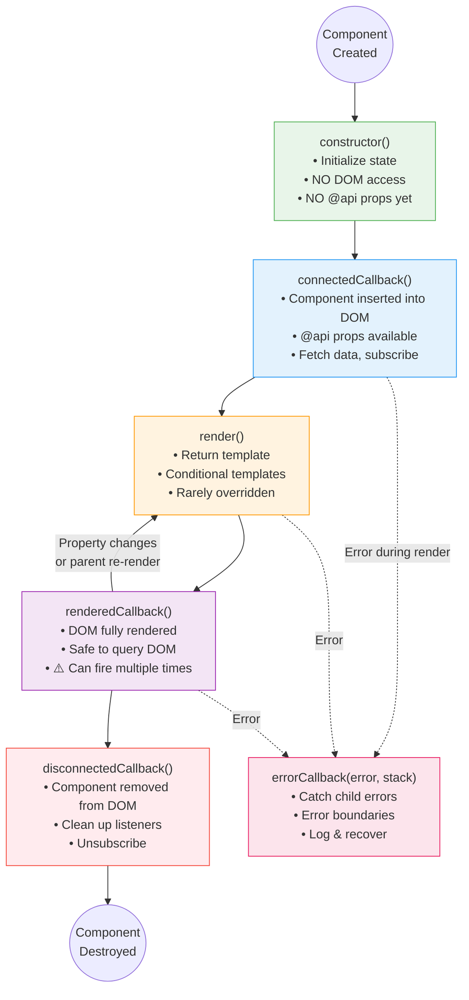
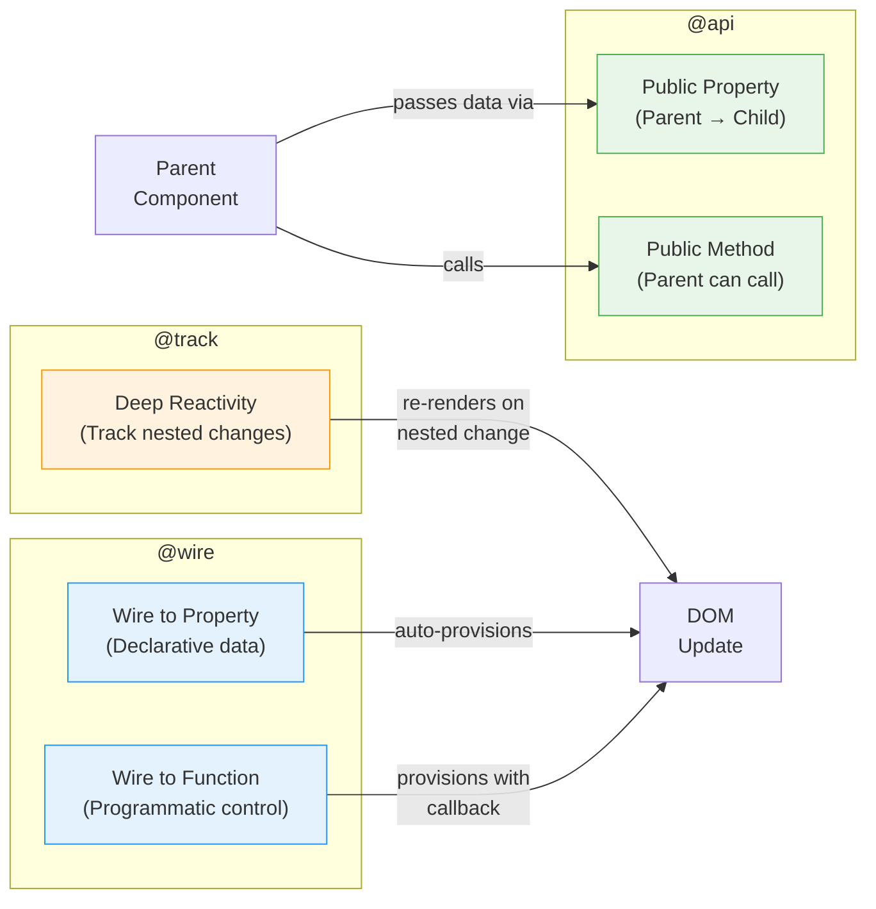
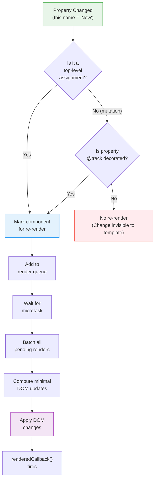
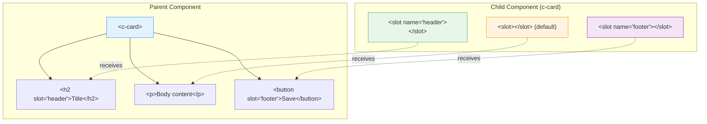
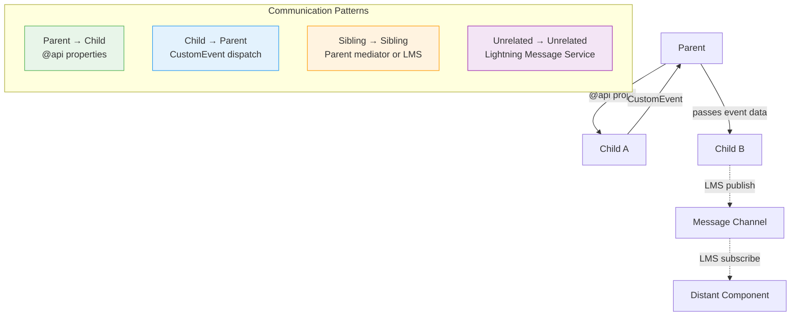

# ⚙️ Week 2: Core LWC Concepts

> **Goal:** Master the internal mechanics of LWC — lifecycle hooks, decorators, template directives, component composition, and styling with SLDS.

---

## 📑 Table of Contents

1. [Component Lifecycle Deep-Dive](#-component-lifecycle-deep-dive)
2. [Lifecycle Hooks with Real Examples](#-all-lifecycle-hooks-with-real-examples)
3. [Decorators Masterclass](#-decorators-masterclass)
4. [Reactive Properties](#-reactive-properties-internal-mechanism)
5. [Template Directives](#-template-directives)
6. [Slots and Composition](#-slots-and-composition-patterns)
7. [SLDS Deep-Dive](#-slds-deep-dive)
8. [CSS Styling in LWC](#-css-styling-in-lwc)
9. [Practice Questions](#-practice-questions)
10. [Mini Project: Todo List](#-mini-project-todo-list-application)

---

## 🔄 Component Lifecycle Deep-Dive

### The Lifecycle Flow

Every LWC component goes through a predictable sequence of phases — from creation to destruction. Understanding this flow is like understanding the heartbeat of your component.



### Lifecycle Rules Summary

| Hook | Called | DOM Available | @api Available | Common Use |
|------|--------|---------------|----------------|------------|
| `constructor()` | Once | ❌ No | ❌ No | Initialize private state |
| `connectedCallback()` | Once* | ❌ No** | ✅ Yes | Fetch data, subscribe, initialize |
| `render()` | Multiple | ❌ No | ✅ Yes | Return different templates |
| `renderedCallback()` | Multiple | ✅ Yes | ✅ Yes | DOM manipulation, third-party libs |
| `disconnectedCallback()` | Once* | ✅ Yes | ✅ Yes | Cleanup, unsubscribe |
| `errorCallback()` | Multiple | ✅ Yes | ✅ Yes | Error boundaries, logging |

> [!WARNING]
> **`*` asterisk note:** `connectedCallback` and `disconnectedCallback` can fire multiple times if the component is moved within the DOM (rare but possible). Always code defensively.
> 
> **`**` double asterisk:** While the component is in the DOM during `connectedCallback`, child elements from the template are NOT yet rendered. Use `renderedCallback` for DOM queries.

---

## 🔗 All Lifecycle Hooks with Real Examples

### constructor()

The constructor is the first code that runs. Think of it as the component's birth — it exists but hasn't been placed anywhere yet.

```javascript
import { LightningElement } from 'lwc';

export default class LifecycleDemo extends LightningElement {
    items = [];
    isInitialized = false;

    constructor() {
        super(); // MUST call super() first — always!
        
        // ✅ Initialize default state
        this.items = [];
        this.isInitialized = false;
        this.startTime = Date.now();

        // ❌ DON'T do these in constructor:
        // this.template.querySelector('div'); // DOM doesn't exist
        // this.recordId; // @api props not set yet
        // this.dispatchEvent(new CustomEvent('init')); // No DOM = no events
    }
}
```

> [!CAUTION]
> **Always call `super()` first** in the constructor. Forgetting this throws an error. Also, you cannot access `this.template` or any `@api` properties in the constructor.

### connectedCallback()

Called when the component is inserted into the DOM. This is your **primary initialization hook** — the "onReady" of LWC.

```javascript
import { LightningElement, api } from 'lwc';
import { subscribe, MessageContext } from 'lightning/messageService';
import RECORD_SELECTED from '@salesforce/messageChannel/Record_Selected__c';

export default class DataDashboard extends LightningElement {
    @api recordId;
    subscription = null;
    resizeObserver = null;

    connectedCallback() {
        console.log('Component connected. Record ID:', this.recordId); // ✅ @api available

        // ✅ Subscribe to Lightning Message Service
        this.subscription = subscribe(
            this.messageContext,
            RECORD_SELECTED,
            (message) => this.handleRecordSelected(message)
        );

        // ✅ Add window event listeners
        this.handleResize = this.handleResize.bind(this);
        window.addEventListener('resize', this.handleResize);

        // ✅ Start data fetch
        this.loadInitialData();

        // ✅ Set up intervals/timers
        this.refreshInterval = setInterval(() => {
            this.refreshData();
        }, 30000); // Refresh every 30 seconds
    }

    handleResize() {
        // Handle window resize
    }

    loadInitialData() {
        // Fetch data from server
    }

    refreshData() {
        // Periodic data refresh
    }
}
```

### render()

Rarely used — only when you need to return different templates based on conditions.

```javascript
import { LightningElement, api } from 'lwc';
import desktopTemplate from './desktopView.html';
import mobileTemplate from './mobileView.html';
import errorTemplate from './errorView.html';

export default class ResponsiveComponent extends LightningElement {
    @api viewMode = 'desktop'; // 'desktop', 'mobile', 'error'

    render() {
        switch (this.viewMode) {
            case 'mobile':
                return mobileTemplate;
            case 'error':
                return errorTemplate;
            default:
                return desktopTemplate;
        }
    }
}
```

> [!NOTE]
> **Multiple templates** require separate `.html` files in the same component bundle. The primary template is always `componentName.html`. Additional templates can have any name.

### renderedCallback()

Fires after every render. This is where you can safely touch the DOM.

```javascript
import { LightningElement } from 'lwc';

export default class ChartComponent extends LightningElement {
    chartInitialized = false;
    
    renderedCallback() {
        // ⚠️ Use a flag to prevent infinite loops!
        if (this.chartInitialized) {
            return;
        }
        
        const canvas = this.template.querySelector('canvas.chart');
        if (canvas) {
            this.chartInitialized = true;
            this.initializeChart(canvas);
        }
    }

    initializeChart(canvas) {
        // Initialize Chart.js or D3 visualization
        const ctx = canvas.getContext('2d');
        // ... chart setup code
    }
}
```

> [!WARNING]
> **Infinite loop danger!** If `renderedCallback` modifies reactive properties, it triggers a re-render, which calls `renderedCallback` again → infinite loop. Always use guard flags.

### disconnectedCallback()

The cleanup hook. Remove everything you set up in `connectedCallback`.

```javascript
disconnectedCallback() {
    // ✅ Remove window event listeners
    window.removeEventListener('resize', this.handleResize);

    // ✅ Unsubscribe from message service
    if (this.subscription) {
        unsubscribe(this.subscription);
        this.subscription = null;
    }

    // ✅ Clear intervals and timeouts
    if (this.refreshInterval) {
        clearInterval(this.refreshInterval);
    }

    // ✅ Disconnect observers
    if (this.resizeObserver) {
        this.resizeObserver.disconnect();
    }

    console.log('Component disconnected. Cleaned up resources.');
}
```

### errorCallback(error, stack)

Creates an **error boundary** — catches errors from child components.

```javascript
import { LightningElement } from 'lwc';

export default class ErrorBoundary extends LightningElement {
    error;
    errorStack;

    errorCallback(error, stack) {
        // Log the error
        console.error('Child component error:', error.message);
        console.error('Stack:', stack);

        // Store for display
        this.error = error;
        this.errorStack = stack;

        // Report to monitoring service
        this.reportError(error, stack);
    }

    reportError(error, stack) {
        // Send to your error tracking service
    }

    handleRetry() {
        // Clear error state to re-render children
        this.error = undefined;
        this.errorStack = undefined;
    }
}
```

```html
<!-- errorBoundary.html -->
<template>
    <template lwc:if={error}>
        <div class="error-container">
            <lightning-icon icon-name="utility:error" variant="error"></lightning-icon>
            <h2>Something went wrong</h2>
            <p>{error.message}</p>
            <lightning-button label="Try Again" onclick={handleRetry}></lightning-button>
        </div>
    </template>
    <template lwc:else>
        <slot></slot>
    </template>
</template>
```

---

## 🎭 Decorators Masterclass

### The Three Decorators

LWC has exactly three decorators. Each serves a distinct purpose:



### @api — Public API

The `@api` decorator marks a property or method as **public** — accessible from parent components or Lightning App Builder.

```javascript
import { LightningElement, api } from 'lwc';

export default class UserCard extends LightningElement {
    // ✅ Public PROPERTY — parent can set this via attribute
    @api userName = 'Guest';
    @api userRole = 'Viewer';
    @api showActions = false;

    // ✅ Public read-only property (with getter only)
    _status = 'active';
    @api
    get status() {
        return this._status;
    }

    // ✅ Public property with validation (getter + setter)
    _maxItems = 10;
    @api
    get maxItems() {
        return this._maxItems;
    }
    set maxItems(value) {
        const num = parseInt(value, 10);
        if (num > 0 && num <= 100) {
            this._maxItems = num;
        } else {
            console.warn(`maxItems must be between 1 and 100. Got: ${value}`);
            this._maxItems = 10; // fallback to default
        }
    }

    // ✅ Public METHOD — parent can call this
    @api
    refresh() {
        // Re-fetch data
        return this.loadData();
    }

    @api
    focus() {
        const input = this.template.querySelector('lightning-input');
        if (input) {
            input.focus();
        }
    }

    @api
    validate() {
        const isValid = this.template
            .querySelectorAll('lightning-input')
            .forEach(input => input.reportValidity());
        return isValid;
    }
}
```

```html
<!-- Parent component using UserCard -->
<template>
    <c-user-card
        user-name="Jane Doe"
        user-role="Admin"
        show-actions
        max-items="25"
        onrefresh={handleRefresh}
    ></c-user-card>

    <lightning-button label="Refresh Card" onclick={refreshChild}></lightning-button>
</template>
```

```javascript
// Parent component JS
export default class ParentApp extends LightningElement {
    refreshChild() {
        // Call public method on child
        this.template.querySelector('c-user-card').refresh();
    }
}
```

> [!IMPORTANT]
> **Naming Convention:** Property names in JavaScript use camelCase (`maxItems`), but in HTML they use kebab-case (`max-items`). LWC converts automatically.

### @track — Deep Reactivity

By default, LWC tracks changes to the **top-level reference** of a property. `@track` enables tracking **nested property changes** within objects and arrays.

```javascript
import { LightningElement, track } from 'lwc';

export default class TrackDemo extends LightningElement {
    // ✅ Without @track — only top-level reassignment triggers re-render
    address = { street: '123 Main St', city: 'SF', state: 'CA' };

    updateCityBroken() {
        // ❌ This does NOT trigger re-render (mutation, not reassignment)
        this.address.city = 'New York';
    }

    updateCityFixed() {
        // ✅ This triggers re-render (new object reference)
        this.address = { ...this.address, city: 'New York' };
    }

    // ✅ With @track — nested mutations DO trigger re-render
    @track addressTracked = { street: '123 Main St', city: 'SF', state: 'CA' };

    updateCityTracked() {
        // ✅ This DOES trigger re-render with @track
        this.addressTracked.city = 'New York';
    }
}
```

> [!TIP]
> **When to use `@track`:** In modern LWC (API v40+), you rarely need `@track`. Instead, create new object/array references using the spread operator. This is more explicit and follows React/functional programming patterns.
> 
> ```javascript
> // Preferred pattern (no @track needed)
> this.items = [...this.items, newItem];           // New array
> this.config = { ...this.config, theme: 'dark' }; // New object
> ```

### @wire — Declarative Data Access

The `@wire` decorator connects your component to a data source (wire adapter). Data flows reactively — when inputs change, the wire re-fires automatically.

```javascript
import { LightningElement, api, wire } from 'lwc';
import { getRecord, getFieldValue } from 'lightning/uiRecordApi';
import NAME_FIELD from '@salesforce/schema/Account.Name';
import INDUSTRY_FIELD from '@salesforce/schema/Account.Industry';
import REVENUE_FIELD from '@salesforce/schema/Account.AnnualRevenue';

const FIELDS = [NAME_FIELD, INDUSTRY_FIELD, REVENUE_FIELD];

export default class AccountViewer extends LightningElement {
    @api recordId;

    // === WIRE TO PROPERTY ===
    // Data is stored directly in the property
    @wire(getRecord, { recordId: '$recordId', fields: FIELDS })
    account;  // { data: {...}, error: {...} }

    get accountName() {
        return getFieldValue(this.account.data, NAME_FIELD);
    }

    get hasError() {
        return !!this.account.error;
    }

    // === WIRE TO FUNCTION ===
    // You get a callback to process data
    accountData;
    errorMessage;

    @wire(getRecord, { recordId: '$recordId', fields: FIELDS })
    wiredAccount({ error, data }) {
        if (data) {
            this.accountData = data;
            this.errorMessage = undefined;
            // Can do additional processing here
            this.processAccountData(data);
        } else if (error) {
            this.errorMessage = error.body?.message || 'Unknown error';
            this.accountData = undefined;
        }
    }

    processAccountData(data) {
        // Custom processing, filtering, formatting...
        console.log('Processing:', getFieldValue(data, NAME_FIELD));
    }
}
```

**Wire to Property vs. Wire to Function:**

| Aspect | Wire to Property | Wire to Function |
|--------|-----------------|------------------|
| Syntax | `@wire(adapter, config) prop;` | `@wire(adapter, config) method({data, error}){}` |
| Data Access | `this.prop.data` / `this.prop.error` | Via destructured parameters |
| Post-processing | Limited (use getters) | Full control in the function |
| When to Use | Simple data display | Need to transform/filter data |
| Re-renders | Automatic when data arrives | Manual via property assignment |

---

## ⚡ Reactive Properties Internal Mechanism

### How Reactivity Works Under the Hood



### Reactivity Rules

```javascript
export default class ReactivityDemo extends LightningElement {
    // ✅ Rule 1: Primitive reassignment = reactive
    name = 'World';
    changeName() {
        this.name = 'Salesforce';  // ✅ Triggers re-render
    }

    // ✅ Rule 2: Object/Array reassignment = reactive
    user = { name: 'Jane', age: 30 };
    updateUser() {
        this.user = { ...this.user, age: 31 };  // ✅ New reference = re-render
    }

    // ❌ Rule 3: Object mutation (without @track) = NOT reactive
    config = { theme: 'light' };
    updateThemeBroken() {
        this.config.theme = 'dark';  // ❌ Mutation = no re-render
    }

    // ✅ Rule 4: Array operations that create new arrays = reactive
    items = ['a', 'b', 'c'];
    addItem() {
        this.items = [...this.items, 'd'];  // ✅ New array = re-render
    }
    removeItem(index) {
        this.items = this.items.filter((_, i) => i !== index);  // ✅
    }
    sortItems() {
        this.items = [...this.items].sort();  // ✅ Spread first, then sort
    }

    // ❌ Rule 5: In-place array operations = NOT reactive
    addItemBroken() {
        this.items.push('d');  // ❌ push() mutates in place = no re-render
    }
}
```

---

## 📋 Template Directives

### Conditional Rendering

```html
<template>
    <!-- Modern directives (recommended, API v55+) -->
    <template lwc:if={isLoading}>
        <lightning-spinner alternative-text="Loading"></lightning-spinner>
    </template>
    <template lwc:elseif={hasError}>
        <div class="error-panel">
            <p>Error: {errorMessage}</p>
        </div>
    </template>
    <template lwc:else>
        <div class="content">
            <p>Data loaded successfully!</p>
        </div>
    </template>

    <!-- Legacy directives (still work but deprecated) -->
    <!-- 
    <template if:true={isLoading}>...</template>
    <template if:false={isLoading}>...</template>
    -->
</template>
```

> [!IMPORTANT]
> **Use `lwc:if`, `lwc:elseif`, `lwc:else`** (available since API v55). The legacy `if:true` / `if:false` still work but are deprecated. The new directives support `elseif` chains, which the old ones don't.

### List Rendering — for:each

```html
<template>
    <!-- for:each — most common list rendering -->
    <ul class="slds-list_dotted">
        <template for:each={contacts} for:item="contact" for:index="idx">
            <li key={contact.Id} class="slds-item">
                <span class="index">{idx}.</span>
                <span class="name">{contact.Name}</span>
                <span class="email">{contact.Email}</span>
                <lightning-button-icon
                    icon-name="utility:delete"
                    alternative-text="Delete"
                    data-id={contact.Id}
                    onclick={handleDelete}
                ></lightning-button-icon>
            </li>
        </template>
    </ul>
</template>
```

### List Rendering — iterator

Use `iterator` when you need to know if an item is first or last (for special styling).

```html
<template>
    <!-- iterator — access to first/last flags -->
    <div class="contact-list">
        <template iterator:it={contacts}>
            <div key={it.value.Id} 
                 class={it.value.cssClass}>
                
                <!-- First item gets a special header -->
                <template lwc:if={it.first}>
                    <div class="list-header">Top Contact</div>
                </template>

                <p>{it.value.Name} — {it.value.Email}</p>

                <!-- Divider between items (not after last) -->
                <template lwc:if={it.last}>
                    <div class="list-footer">End of list ({contactCount} total)</div>
                </template>
                <template lwc:else>
                    <hr class="divider" />
                </template>
            </div>
        </template>
    </div>
</template>
```

```javascript
// Supporting JavaScript
export default class ContactList extends LightningElement {
    contacts = [
        { Id: '001', Name: 'Jane Doe', Email: 'jane@example.com' },
        { Id: '002', Name: 'John Smith', Email: 'john@example.com' },
        { Id: '003', Name: 'Bob Wilson', Email: 'bob@example.com' }
    ];

    get contactCount() {
        return this.contacts.length;
    }

    handleDelete(event) {
        const contactId = event.target.dataset.id;
        this.contacts = this.contacts.filter(c => c.Id !== contactId);
    }
}
```

> [!TIP]
> **Key attribute is mandatory** in list rendering. Use a unique, stable identifier (like a Salesforce Id). Never use the array index as the key — it causes bugs when items are reordered or deleted.

---

## 🧱 Slots and Composition Patterns

### What Are Slots?

Slots are **placeholders** in a child component where parent-provided content is projected. Think of a slot as a "window" in the child's template that the parent can fill with custom content.



### Slot Implementation

**card.html (Child with slots)**
```html
<template>
    <div class="card">
        <!-- Named slot: header -->
        <div class="card-header">
            <slot name="header">
                <span>Default Header</span>
            </slot>
        </div>

        <!-- Default (unnamed) slot: body -->
        <div class="card-body">
            <slot>
                <p>No content provided</p>
            </slot>
        </div>

        <!-- Named slot: footer -->
        <div class="card-footer">
            <slot name="footer"></slot>
        </div>
    </div>
</template>
```

**Parent using the card**
```html
<template>
    <c-card>
        <!-- Goes to named slot "header" -->
        <h2 slot="header">Account Details</h2>

        <!-- Goes to default slot (no slot attribute) -->
        <p>Name: {accountName}</p>
        <p>Industry: {industry}</p>

        <!-- Goes to named slot "footer" -->
        <div slot="footer">
            <lightning-button label="Edit" onclick={handleEdit}></lightning-button>
            <lightning-button label="Delete" variant="destructive" onclick={handleDelete}></lightning-button>
        </div>
    </c-card>
</template>
```

### Composition Patterns

#### Pattern 1: Container / Presentational

```html
<!-- Container (Smart) — handles data and logic -->
<template>
    <c-account-card 
        account-name={account.Name}
        industry={account.Industry}
        revenue={account.AnnualRevenue}
        onEdit={handleEdit}
    ></c-account-card>
</template>
```

```html
<!-- Presentational (Dumb) — only renders UI -->
<template>
    <lightning-card title={accountName}>
        <p>{industry}</p>
        <p>{formattedRevenue}</p>
        <lightning-button label="Edit" onclick={fireEdit}></lightning-button>
    </lightning-card>
</template>
```

#### Pattern 2: Component Communication



#### Child → Parent Communication (Custom Events)

```javascript
// Child component — dispatches events UP
export default class SearchBox extends LightningElement {
    searchTerm = '';

    handleInputChange(event) {
        this.searchTerm = event.target.value;
    }

    handleSearch() {
        // Create and dispatch custom event
        const searchEvent = new CustomEvent('search', {
            detail: { 
                searchTerm: this.searchTerm,
                timestamp: Date.now()
            },
            bubbles: false,    // Don't bubble beyond parent
            composed: false    // Don't cross shadow DOM boundaries
        });
        this.dispatchEvent(searchEvent);
    }
}
```

```html
<!-- Parent component — listens for events -->
<template>
    <c-search-box onsearch={handleSearch}></c-search-box>
    
    <template lwc:if={searchResults}>
        <c-results-list results={searchResults}></c-results-list>
    </template>
</template>
```

```javascript
// Parent component JS
export default class SearchContainer extends LightningElement {
    searchResults;

    handleSearch(event) {
        const { searchTerm, timestamp } = event.detail;
        console.log(`Search for "${searchTerm}" at ${timestamp}`);
        this.performSearch(searchTerm);
    }

    async performSearch(term) {
        // Fetch results from server
        this.searchResults = await searchContacts({ searchKey: term });
    }
}
```

---

## 🎨 SLDS Deep-Dive

### Salesforce Lightning Design System (SLDS)

SLDS provides the styling framework for all Salesforce UI. In LWC, SLDS base classes are available automatically.

### Grid System

```html
<template>
    <!-- 12-column responsive grid -->
    <div class="slds-grid slds-wrap slds-gutters">
        <!-- Full width on mobile, half on medium, third on large -->
        <div class="slds-col slds-size_1-of-1 slds-medium-size_1-of-2 slds-large-size_1-of-3">
            <c-metric-card title="Open Cases" value="42"></c-metric-card>
        </div>
        <div class="slds-col slds-size_1-of-1 slds-medium-size_1-of-2 slds-large-size_1-of-3">
            <c-metric-card title="Closed Today" value="15"></c-metric-card>
        </div>
        <div class="slds-col slds-size_1-of-1 slds-medium-size_1-of-1 slds-large-size_1-of-3">
            <c-metric-card title="Avg Resolution" value="2.3 days"></c-metric-card>
        </div>
    </div>

    <!-- Horizontal alignment -->
    <div class="slds-grid slds-grid_align-center">
        <div class="slds-col slds-size_1-of-2">Centered content</div>
    </div>

    <!-- Vertical alignment -->
    <div class="slds-grid slds-grid_vertical-align-center" style="height: 200px;">
        <div class="slds-col">Vertically centered</div>
    </div>
</template>
```

### Common SLDS Utilities

| Class | Purpose | Example |
|-------|---------|---------|
| `slds-p-around_medium` | Padding all sides | Content spacing |
| `slds-m-top_small` | Margin top | Spacing between elements |
| `slds-text-heading_large` | Large heading text | Section headers |
| `slds-text-color_error` | Red error text | Error messages |
| `slds-truncate` | Truncate with ellipsis | Long text in tables |
| `slds-hide` | Hide element | Conditional visibility |
| `slds-assistive-text` | Screen reader only text | Accessibility |
| `slds-align_absolute-center` | Center absolute | Spinners, overlays |
| `slds-border_bottom` | Bottom border | Dividers |
| `slds-theme_default` | Default background | Section backgrounds |

---

## 🎭 CSS Styling in LWC

### Scoped Styles

All CSS in LWC is scoped to the component. Styles don't leak out, and parent styles don't leak in (mostly).

```css
/* myComponent.css */

/* :host — style the component host element itself */
:host {
    display: block;
    padding: 1rem;
    border: 1px solid #d8dde6;
    border-radius: 0.25rem;
}

/* :host with context selector */
:host(.compact) {
    padding: 0.5rem;
}

/* Standard element and class selectors (scoped) */
h2 {
    color: #16325c;
    font-size: 1.25rem;
}

.highlight {
    background-color: #ffffcc;
    padding: 2px 4px;
}

/* Using SLDS design tokens as CSS custom properties */
.card-title {
    color: var(--lwc-colorTextDefault, #16325c);
    font-size: var(--lwc-fontSize5, 1rem);
    font-family: var(--lwc-fontFamily, 'Salesforce Sans', Arial);
}
```

### Sharing CSS Across Components

Create a shared CSS module and import it in multiple components.

```
force-app/main/default/lwc/
├── cssShared/                    # CSS-only module (no .html or .js)
│   └── cssShared.css
├── componentA/
│   ├── componentA.html
│   ├── componentA.js
│   └── componentA.css
└── componentB/
    ├── componentB.html
    ├── componentB.js
    └── componentB.css
```

**cssShared/cssShared.css**
```css
/* Shared styles */
.card {
    border-radius: 8px;
    box-shadow: 0 2px 8px rgba(0, 0, 0, 0.1);
    padding: 1.5rem;
    background: white;
}

.badge {
    display: inline-block;
    padding: 0.25rem 0.75rem;
    border-radius: 1rem;
    font-size: 0.75rem;
    font-weight: 600;
}

.badge-success { background: #e8f5e9; color: #2e7d32; }
.badge-warning { background: #fff3e0; color: #e65100; }
.badge-error   { background: #ffebee; color: #c62828; }
```

**componentA.js** (importing shared CSS)
```javascript
import { LightningElement } from 'lwc';
import sharedStyles from 'c/cssShared';  // Import shared CSS module

export default class ComponentA extends LightningElement {
    static styles = [sharedStyles]; // Apply shared + local styles
}
```

### Custom Properties for Theming

```css
/* Parent sets custom properties */
:host {
    --brand-color: #1B96FF;
    --brand-color-dark: #0176D3;
    --card-padding: 1.5rem;
}

/* Child uses them */
.button-brand {
    background-color: var(--brand-color);
    padding: var(--card-padding);
}

.button-brand:hover {
    background-color: var(--brand-color-dark);
}
```

---

## 📝 Practice Questions

**Q1.** In which lifecycle hook should you add window event listeners?

A) `constructor()`  
B) `connectedCallback()`  
C) `renderedCallback()`  
D) `render()`

**Q2.** What is the primary risk of modifying reactive properties in `renderedCallback()`?

A) Properties become read-only  
B) Infinite rendering loop  
C) Component is destroyed  
D) Styles are lost

**Q3.** What does `@api` NOT do?

A) Make a property settable from a parent component  
B) Make a method callable from a parent component  
C) Enable deep reactivity tracking for objects  
D) Expose a property in Lightning App Builder

**Q4.** What is the output when a parent sets `<c-child max-items="25"></c-child>`?

```javascript
// In child component
@api maxItems;
connectedCallback() {
    console.log(typeof this.maxItems);
}
```

A) `"number"`  
B) `"string"`  
C) `"undefined"`  
D) `"object"`

**Q5.** Which directive should you use for conditional rendering in API v55+?

A) `if:true={condition}`  
B) `lwc:if={condition}`  
C) `ng-if={condition}`  
D) `v-if={condition}`

**Q6.** Why is the `key` attribute required in `for:each` loops?

A) For CSS styling purposes  
B) To help LWC's rendering engine track and efficiently update list items  
C) To create unique CSS selectors  
D) It's optional, not required

**Q7.** What happens to content placed in a parent component's tags if the child has no `<slot>`?

A) It renders after the child component  
B) It is silently discarded  
C) It throws a runtime error  
D) It renders before the child component

**Q8.** How do you dispatch a custom event from a child to a parent?

A) `this.emit('eventName', data)`  
B) `this.dispatchEvent(new CustomEvent('eventname', { detail: data }))`  
C) `this.fireEvent('eventName', data)`  
D) `this.parent.handleEvent(data)`

**Q9.** In the SLDS grid system, what class makes a column take up one-third of the row on large screens?

A) `slds-col_1-of-3`  
B) `slds-large-size_1-of-3`  
C) `slds-col-lg-4`  
D) `slds-grid_thirds`

**Q10.** What selector is used to style the component's host element in LWC CSS?

A) `:root`  
B) `:this`  
C) `:host`  
D) `self`

**Q11.** When would you use `@track` in modern LWC?

A) For all public properties  
B) When you need to track changes to nested object/array properties via mutation  
C) To make properties reactive (required for any reactivity)  
D) To track component performance metrics

**Q12.** Which is NOT a valid way to trigger a re-render in LWC?

A) Reassigning a property: `this.name = 'New'`  
B) Creating a new array: `this.items = [...this.items, item]`  
C) Calling `this.forceUpdate()`  
D) Mutating a `@track` property: `this.trackedObj.key = 'value'`

**Q13.** What does `composed: true` do in a CustomEvent?

A) Makes the event asynchronous  
B) Allows the event to cross shadow DOM boundaries  
C) Composes the event with other events  
D) Prevents event bubbling

**Q14.** How can you share CSS styles across multiple LWC components?

A) Use global CSS files  
B) Create a CSS-only module and import it  
C) Use `!important` in styles  
D) CSS cannot be shared between LWC components

**Q15.** What's the difference between `for:each` and `iterator`?

A) `iterator` is faster  
B) `iterator` provides `first` and `last` boolean flags  
C) `for:each` only works with arrays of objects  
D) There is no difference

**Q16.** In `errorCallback(error, stack)`, which errors does it catch?

A) Only errors in the current component  
B) Errors in descendant (child/grandchild) components  
C) All errors in the entire page  
D) Only Apex errors

**Q17.** What is the naming convention difference between JS property names and HTML attribute names?

A) No difference  
B) JS uses camelCase, HTML uses kebab-case  
C) JS uses snake_case, HTML uses camelCase  
D) JS uses PascalCase, HTML uses lowercase

**Q18.** Can you use `querySelector` in `connectedCallback` to access template elements?

A) Yes, always  
B) No, child elements aren't rendered yet  
C) Only for lightning base components  
D) Only with `@track` properties

**Q19.** What happens if you forget `super()` in a component's constructor?

A) Nothing, it's optional  
B) A ReferenceError is thrown  
C) The component renders without state  
D) Lifecycle hooks are skipped

**Q20.** Which event property should you use to pass data in a custom event?

A) `event.data`  
B) `event.payload`  
C) `event.detail`  
D) `event.value`

---

### 🔑 Answers

<details>
<summary><strong>Click to reveal answers</strong></summary>

| # | Answer | Explanation |
|---|--------|-------------|
| 1 | **B** | `connectedCallback` is the correct place for event listeners. Remember to remove them in `disconnectedCallback`. |
| 2 | **B** | Modifying reactive properties in `renderedCallback` causes a re-render → `renderedCallback` fires again → infinite loop. |
| 3 | **C** | `@api` makes properties/methods public. Deep reactivity tracking is `@track`'s job. |
| 4 | **B** | HTML attributes are always strings. If you need a number, parse it: `parseInt(this.maxItems, 10)`. |
| 5 | **B** | `lwc:if` is the modern directive (API v55+). `if:true` is legacy/deprecated. |
| 6 | **B** | The `key` helps LWC's virtual DOM diffing algorithm track which items changed, were added, or removed. |
| 7 | **B** | Without a `<slot>`, projected content is silently discarded. No error. |
| 8 | **B** | `this.dispatchEvent(new CustomEvent('eventname', { detail: data }))` — note lowercase event name convention. |
| 9 | **B** | SLDS uses `slds-large-size_1-of-3` for responsive column sizing. |
| 10 | **C** | `:host` targets the custom element itself in Shadow DOM CSS. |
| 11 | **B** | `@track` enables reactivity for nested mutations. Modern practice favors new references instead. |
| 12 | **C** | LWC has no `forceUpdate()` method. Reactivity is declarative. |
| 13 | **B** | `composed: true` lets events cross shadow DOM boundaries and reach ancestor components. |
| 14 | **B** | Create a CSS-only LWC module and import it using `static styles`. |
| 15 | **B** | `iterator` provides `it.first` and `it.last` booleans. `for:each` provides `for:index` but no first/last. |
| 16 | **B** | `errorCallback` catches errors from child/descendant components, creating an error boundary pattern. |
| 17 | **B** | JavaScript: `camelCase` (e.g., `maxItems`). HTML: `kebab-case` (e.g., `max-items`). |
| 18 | **B** | In `connectedCallback`, child elements from the template aren't rendered yet. Use `renderedCallback` for DOM queries. |
| 19 | **B** | Omitting `super()` in a class extending `LightningElement` throws a `ReferenceError`. |
| 20 | **C** | `event.detail` is the standard property for custom event data in the Web Components specification. |

</details>

---

## ✅ Mini Project: Todo List Application

### Project Requirements

Build a fully functional Todo List that demonstrates:
- Adding new todos with validation
- Marking todos as complete/incomplete
- Deleting todos
- Filtering (All / Active / Completed)
- Todo count display
- Local component state management

### Implementation

**todoApp.html**
```html
<template>
    <lightning-card title="Todo List" icon-name="standard:task">
        <!-- Input Section -->
        <div class="slds-p-around_medium">
            <div class="slds-grid slds-gutters">
                <div class="slds-col slds-size_10-of-12">
                    <lightning-input
                        type="text"
                        label="New Todo"
                        placeholder="What needs to be done?"
                        value={newTodoText}
                        onchange={handleInputChange}
                        onkeyup={handleKeyUp}
                        class="todo-input"
                    ></lightning-input>
                </div>
                <div class="slds-col slds-size_2-of-12 slds-grid slds-grid_vertical-align-end">
                    <lightning-button
                        variant="brand"
                        label="Add"
                        onclick={addTodo}
                        disabled={isAddDisabled}
                    ></lightning-button>
                </div>
            </div>

            <!-- Filter Buttons -->
            <div class="slds-m-top_medium slds-grid slds-grid_align-center">
                <lightning-button-group>
                    <lightning-button
                        label="All ({totalCount})"
                        variant={allVariant}
                        onclick={showAll}
                    ></lightning-button>
                    <lightning-button
                        label="Active ({activeCount})"
                        variant={activeVariant}
                        onclick={showActive}
                    ></lightning-button>
                    <lightning-button
                        label="Completed ({completedCount})"
                        variant={completedVariant}
                        onclick={showCompleted}
                    ></lightning-button>
                </lightning-button-group>
            </div>

            <!-- Todo List -->
            <div class="slds-m-top_medium">
                <template lwc:if={hasVisibleTodos}>
                    <template for:each={filteredTodos} for:item="todo">
                        <div key={todo.id} class={todo.cssClass}>
                            <div class="slds-grid slds-grid_vertical-align-center">
                                <!-- Checkbox -->
                                <div class="slds-col slds-size_1-of-12">
                                    <lightning-input
                                        type="checkbox"
                                        checked={todo.completed}
                                        data-id={todo.id}
                                        onchange={toggleTodo}
                                        label=""
                                        variant="label-hidden"
                                    ></lightning-input>
                                </div>
                                <!-- Todo text -->
                                <div class="slds-col slds-size_9-of-12">
                                    <span class={todo.textClass}>{todo.text}</span>
                                    <span class="todo-date">{todo.createdDate}</span>
                                </div>
                                <!-- Delete button -->
                                <div class="slds-col slds-size_2-of-12 slds-text-align_right">
                                    <lightning-button-icon
                                        icon-name="utility:delete"
                                        variant="bare"
                                        alternative-text="Delete"
                                        data-id={todo.id}
                                        onclick={deleteTodo}
                                    ></lightning-button-icon>
                                </div>
                            </div>
                        </div>
                    </template>
                </template>
                <template lwc:else>
                    <div class="empty-state slds-text-align_center slds-p-around_large">
                        <lightning-icon 
                            icon-name="utility:check" 
                            size="large"
                        ></lightning-icon>
                        <p class="slds-m-top_small slds-text-color_weak">
                            {emptyMessage}
                        </p>
                    </div>
                </template>
            </div>

            <!-- Footer -->
            <template lwc:if={hasTodos}>
                <div class="slds-m-top_medium slds-grid slds-grid_align-spread slds-grid_vertical-align-center">
                    <span class="slds-text-color_weak">
                        {activeCount} item(s) remaining
                    </span>
                    <template lwc:if={hasCompletedTodos}>
                        <lightning-button
                            label="Clear Completed"
                            variant="text"
                            onclick={clearCompleted}
                        ></lightning-button>
                    </template>
                </div>
            </template>
        </div>
    </lightning-card>
</template>
```

**todoApp.js**
```javascript
import { LightningElement } from 'lwc';

let nextId = 1;

export default class TodoApp extends LightningElement {
    newTodoText = '';
    todos = [];
    filter = 'all'; // 'all', 'active', 'completed'

    // --- Computed Properties ---

    get isAddDisabled() {
        return !this.newTodoText.trim();
    }

    get filteredTodos() {
        switch (this.filter) {
            case 'active':
                return this.todos.filter(t => !t.completed);
            case 'completed':
                return this.todos.filter(t => t.completed);
            default:
                return this.todos;
        }
    }

    get hasVisibleTodos() {
        return this.filteredTodos.length > 0;
    }

    get hasTodos() {
        return this.todos.length > 0;
    }

    get totalCount() {
        return this.todos.length;
    }

    get activeCount() {
        return this.todos.filter(t => !t.completed).length;
    }

    get completedCount() {
        return this.todos.filter(t => t.completed).length;
    }

    get hasCompletedTodos() {
        return this.completedCount > 0;
    }

    get emptyMessage() {
        if (this.todos.length === 0) return 'No todos yet. Add one above!';
        if (this.filter === 'active') return 'No active todos!';
        if (this.filter === 'completed') return 'No completed todos yet.';
        return 'No todos to display.';
    }

    // Button variants for active state
    get allVariant() { return this.filter === 'all' ? 'brand' : 'neutral'; }
    get activeVariant() { return this.filter === 'active' ? 'brand' : 'neutral'; }
    get completedVariant() { return this.filter === 'completed' ? 'brand' : 'neutral'; }

    // --- Event Handlers ---

    handleInputChange(event) {
        this.newTodoText = event.target.value;
    }

    handleKeyUp(event) {
        if (event.key === 'Enter' && !this.isAddDisabled) {
            this.addTodo();
        }
    }

    addTodo() {
        const text = this.newTodoText.trim();
        if (!text) return;

        const newTodo = {
            id: `todo-${nextId++}`,
            text: text,
            completed: false,
            createdDate: new Date().toLocaleDateString(),
            get cssClass() {
                return `todo-item slds-p-around_small slds-m-bottom_xx-small ${
                    this.completed ? 'todo-completed' : ''
                }`;
            },
            get textClass() {
                return this.completed ? 'text-completed' : 'text-active';
            }
        };

        this.todos = [newTodo, ...this.todos];
        this.newTodoText = '';
    }

    toggleTodo(event) {
        const todoId = event.target.dataset.id;
        this.todos = this.todos.map(todo => {
            if (todo.id === todoId) {
                return {
                    ...todo,
                    completed: !todo.completed,
                    get cssClass() {
                        return `todo-item slds-p-around_small slds-m-bottom_xx-small ${
                            this.completed ? 'todo-completed' : ''
                        }`;
                    },
                    get textClass() {
                        return this.completed ? 'text-completed' : 'text-active';
                    }
                };
            }
            return todo;
        });
    }

    deleteTodo(event) {
        const todoId = event.target.dataset.id;
        this.todos = this.todos.filter(todo => todo.id !== todoId);
    }

    clearCompleted() {
        this.todos = this.todos.filter(todo => !todo.completed);
    }

    showAll()       { this.filter = 'all'; }
    showActive()    { this.filter = 'active'; }
    showCompleted() { this.filter = 'completed'; }
}
```

**todoApp.css**
```css
:host {
    display: block;
}

.todo-item {
    border-radius: 4px;
    border: 1px solid #e5e5e5;
    transition: background-color 0.2s ease, opacity 0.2s ease;
}

.todo-item:hover {
    background-color: #f4f6f9;
}

.todo-completed {
    background-color: #f9f9f9;
    opacity: 0.7;
}

.text-completed {
    text-decoration: line-through;
    color: #999;
}

.text-active {
    color: #16325c;
    font-weight: 500;
}

.todo-date {
    display: block;
    font-size: 0.75rem;
    color: #999;
    margin-top: 2px;
}

.empty-state {
    color: #999;
    padding: 2rem;
}
```

**todoApp.js-meta.xml**
```xml
<?xml version="1.0" encoding="UTF-8"?>
<LightningComponentBundle xmlns="http://soap.sforce.com/2006/04/metadata">
    <apiVersion>61.0</apiVersion>
    <isExposed>true</isExposed>
    <masterLabel>Todo List Application</masterLabel>
    <description>A fully functional todo list built with LWC</description>
    <targets>
        <target>lightning__AppPage</target>
        <target>lightning__HomePage</target>
        <target>lightning__Tab</target>
    </targets>
</LightningComponentBundle>
```

---

## 📌 Key Takeaways

| Topic | Key Concept |
|-------|-------------|
| **Lifecycle** | `constructor` → `connectedCallback` → `render` → `renderedCallback` → `disconnectedCallback` |
| **constructor** | Call `super()` first; no DOM, no `@api` access |
| **connectedCallback** | Primary init hook; `@api` available, DOM children not rendered yet |
| **renderedCallback** | DOM available; fires multiple times; use guard flags |
| **@api** | Public interface — properties from parents, methods callable by parents |
| **@track** | Deep reactivity — tracks nested mutations; prefer spread instead |
| **@wire** | Declarative data access — reactive to input changes |
| **Template Directives** | `lwc:if`/`lwc:elseif`/`lwc:else` for conditionals; `for:each` for lists |
| **Slots** | Content projection from parent into child component placeholders |
| **Communication** | Parent→Child via `@api`; Child→Parent via `CustomEvent`; Unrelated via LMS |
| **SLDS** | 12-column grid; utility classes for spacing, text, borders |
| **CSS Scoping** | Styles scoped by default; `:host` for host element; shared via CSS modules |

---

> **Next up:** [Week 3: Data & Server Integration →](../week-3-data-integration/README.md) — Master the wire service, Apex calls, and Lightning Data Service.
