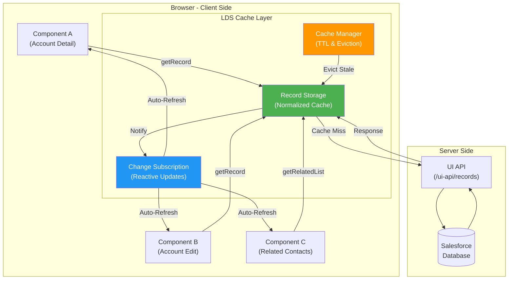
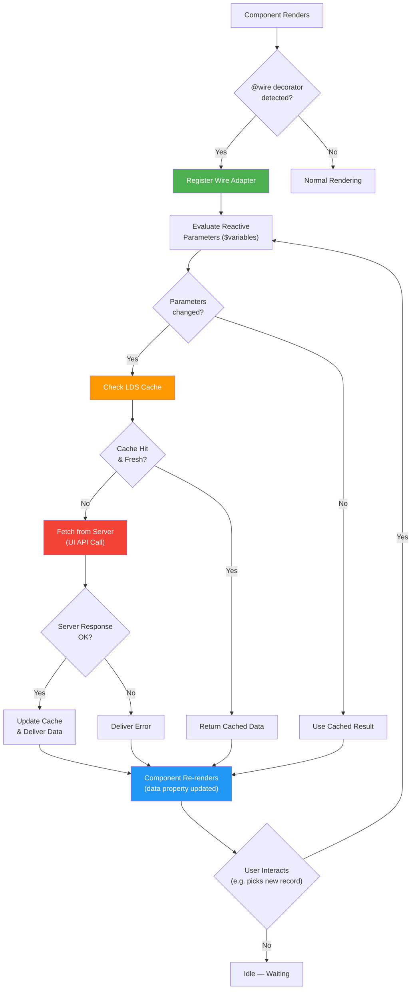
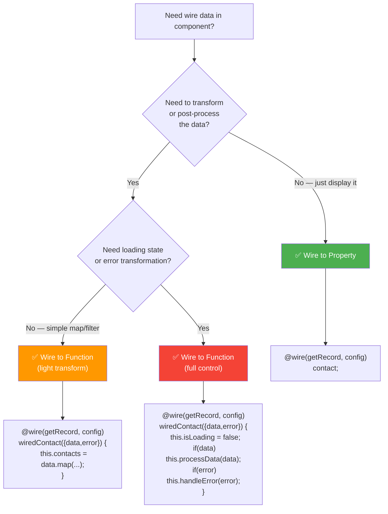
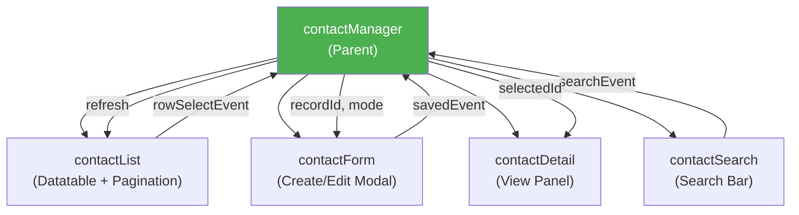

# 📡 Week 3: Data & Server Integration

> **Goal:** Master Lightning Data Service, Wire Service, Apex integration, form components, and data patterns that power real-world Salesforce LWC applications.

---

## Table of Contents

1. [Lightning Data Service (LDS) Architecture](#1-lightning-data-service-lds-architecture)
2. [Wire Service Internals](#2-wire-service-internals)
3. [Wire Adapters Catalog](#3-wire-adapters-catalog)
4. [Wire to Property vs Wire to Function](#4-wire-to-property-vs-wire-to-function)
5. [Imperative Apex Calls](#5-imperative-apex-calls)
6. [Error Handling Strategies](#6-error-handling-strategies)
7. [CRUD Operations with LDS](#7-crud-operations-with-lds)
8. [Form Components Deep-Dive](#8-form-components-deep-dive)
9. [Custom Form Validation](#9-custom-form-validation)
10. [Pagination Patterns](#10-pagination-patterns)
11. [Practice Questions](#11-practice-questions)
12. [Mini Project: Contact Manager CRUD](#12-mini-project-contact-manager-crud)

---

## 1. Lightning Data Service (LDS) Architecture

Lightning Data Service (LDS) is Salesforce's **client-side data layer** — think of it as a smart librarian that sits between your components and the server. Instead of every component making its own trip to the Salesforce database, LDS manages a **shared cache** so that multiple components looking at the same record all get the same data without redundant network calls.

### 🏗️ How LDS Works Under the Hood



### Key LDS Concepts

| Concept | Description | Real-World Analogy |
|---------|-------------|-------------------|
| **Normalized Cache** | Records are stored once and shared across components | A library book — one copy, many readers |
| **Auto-refresh** | When one component updates a record, all components see it | A shared Google Doc — edits appear for everyone |
| **TTL (Time-to-Live)** | Cache entries expire after a set time | Milk with an expiration date |
| **Optimistic UI** | UI updates immediately, server sync follows | Writing a check — your balance appears changed before the bank processes it |
| **No Apex Required** | Basic CRUD without server-side code | Self-service checkout vs. full-service |

> [!IMPORTANT]
> LDS respects **FLS (Field-Level Security)** and **CRUD permissions** automatically. You never need to check `isAccessible()` in Apex when using LDS — it's handled for you.

---

## 2. Wire Service Internals

The wire service is a **reactive data-binding engine** that connects your component to data sources. When the input parameters of a wire change, the framework automatically re-fetches the data. Think of it as setting up a "subscription" — whenever the channel (parameters) changes, you get a new broadcast (data).

### ⚙️ Reactive Wire Engine Flowchart



### Wire Service Rules

1. **Wire is provisioned at render time** — you can't call it imperatively.
2. **Reactive parameters** use the `$` prefix (e.g., `$recordId`). When the property changes, the wire re-fires.
3. **Wire results are read-only** — never modify the data or error objects directly.
4. **Wire can target a property or a function** — each has different use cases (covered below).

---

## 3. Wire Adapters Catalog

### 3.1 `getRecord` — Read a Single Record

```javascript
// contactDetail.js
import { LightningElement, api, wire } from 'lwc';
import { getRecord, getFieldValue } from 'lightning/uiRecordApi';
import CONTACT_NAME from '@salesforce/schema/Contact.Name';
import CONTACT_EMAIL from '@salesforce/schema/Contact.Email';
import CONTACT_PHONE from '@salesforce/schema/Contact.Phone';
import CONTACT_TITLE from '@salesforce/schema/Contact.Title';

const FIELDS = [CONTACT_NAME, CONTACT_EMAIL, CONTACT_PHONE, CONTACT_TITLE];

export default class ContactDetail extends LightningElement {
    @api recordId;

    // Wire to property — simplest pattern
    @wire(getRecord, { recordId: '$recordId', fields: FIELDS })
    contact;

    // Use getFieldValue helper to extract field values safely
    get contactName() {
        return getFieldValue(this.contact.data, CONTACT_NAME);
    }

    get contactEmail() {
        return getFieldValue(this.contact.data, CONTACT_EMAIL);
    }

    get hasError() {
        return !!this.contact.error;
    }
}
```

```html
<!-- contactDetail.html -->
<template>
    <lightning-card title="Contact Detail" icon-name="standard:contact">
        <template if:true={contact.data}>
            <div class="slds-p-around_medium">
                <p><strong>Name:</strong> {contactName}</p>
                <p><strong>Email:</strong> {contactEmail}</p>
            </div>
        </template>
        <template if:true={hasError}>
            <p class="slds-text-color_error">Error loading contact.</p>
        </template>
    </lightning-card>
</template>
```

### 3.2 `getFieldValue` & `getFieldDisplayValue`

```javascript
import { getFieldValue, getFieldDisplayValue } from 'lightning/uiRecordApi';
import ANNUAL_REVENUE from '@salesforce/schema/Account.AnnualRevenue';

// getFieldValue  → raw value:     1500000
// getFieldDisplayValue → formatted: "$1,500,000.00"

get revenue() {
    return getFieldValue(this.account.data, ANNUAL_REVENUE);
}

get revenueFormatted() {
    return getFieldDisplayValue(this.account.data, ANNUAL_REVENUE);
}
```

### 3.3 `createRecord`

```javascript
// createContact.js
import { LightningElement } from 'lwc';
import { createRecord } from 'lightning/uiRecordApi';
import { ShowToastEvent } from 'lightning/platformShowToastEvent';
import CONTACT_OBJECT from '@salesforce/schema/Contact';
import FIRST_NAME_FIELD from '@salesforce/schema/Contact.FirstName';
import LAST_NAME_FIELD from '@salesforce/schema/Contact.LastName';
import EMAIL_FIELD from '@salesforce/schema/Contact.Email';

export default class CreateContact extends LightningElement {
    firstName = '';
    lastName = '';
    email = '';

    handleFirstNameChange(event) {
        this.firstName = event.target.value;
    }

    handleLastNameChange(event) {
        this.lastName = event.target.value;
    }

    handleEmailChange(event) {
        this.email = event.target.value;
    }

    async handleCreate() {
        const fields = {};
        fields[FIRST_NAME_FIELD.fieldApiName] = this.firstName;
        fields[LAST_NAME_FIELD.fieldApiName] = this.lastName;
        fields[EMAIL_FIELD.fieldApiName] = this.email;

        try {
            const record = await createRecord({ apiName: CONTACT_OBJECT.objectApiName, fields });
            this.dispatchEvent(
                new ShowToastEvent({
                    title: 'Success',
                    message: `Contact created with Id: ${record.id}`,
                    variant: 'success'
                })
            );
            // Reset form
            this.firstName = '';
            this.lastName = '';
            this.email = '';
        } catch (error) {
            this.dispatchEvent(
                new ShowToastEvent({
                    title: 'Error creating contact',
                    message: error.body?.message || 'Unknown error',
                    variant: 'error'
                })
            );
        }
    }
}
```

### 3.4 `updateRecord`

```javascript
// updateContact.js
import { LightningElement, api, wire } from 'lwc';
import { getRecord, updateRecord } from 'lightning/uiRecordApi';
import { ShowToastEvent } from 'lightning/platformShowToastEvent';
import ID_FIELD from '@salesforce/schema/Contact.Id';
import EMAIL_FIELD from '@salesforce/schema/Contact.Email';

export default class UpdateContact extends LightningElement {
    @api recordId;
    email = '';

    @wire(getRecord, { recordId: '$recordId', fields: ['Contact.Email'] })
    wiredContact({ data, error }) {
        if (data) {
            this.email = data.fields.Email.value || '';
        }
    }

    handleEmailChange(event) {
        this.email = event.target.value;
    }

    async handleUpdate() {
        const fields = {};
        fields[ID_FIELD.fieldApiName] = this.recordId;
        fields[EMAIL_FIELD.fieldApiName] = this.email;

        try {
            await updateRecord({ fields });
            this.dispatchEvent(
                new ShowToastEvent({ title: 'Success', message: 'Contact updated', variant: 'success' })
            );
        } catch (error) {
            this.dispatchEvent(
                new ShowToastEvent({ title: 'Error', message: error.body?.message, variant: 'error' })
            );
        }
    }
}
```

### 3.5 `deleteRecord`

```javascript
// deleteContact.js
import { LightningElement, api } from 'lwc';
import { deleteRecord } from 'lightning/uiRecordApi';
import { ShowToastEvent } from 'lightning/platformShowToastEvent';
import { NavigationMixin } from 'lightning/navigation';

export default class DeleteContact extends NavigationMixin(LightningElement) {
    @api recordId;

    async handleDelete() {
        try {
            await deleteRecord(this.recordId);
            this.dispatchEvent(
                new ShowToastEvent({ title: 'Deleted', message: 'Contact deleted', variant: 'success' })
            );
            // Navigate back to the list view
            this[NavigationMixin.Navigate]({
                type: 'standard__objectPage',
                attributes: {
                    objectApiName: 'Contact',
                    actionName: 'list'
                }
            });
        } catch (error) {
            this.dispatchEvent(
                new ShowToastEvent({ title: 'Error', message: error.body?.message, variant: 'error' })
            );
        }
    }
}
```

---

## 4. Wire to Property vs Wire to Function

### Quick Comparison

| Aspect | Wire to Property | Wire to Function |
|--------|-----------------|-----------------|
| **Syntax** | `@wire(adapter, config) myProp;` | `@wire(adapter, config) myMethod({data, error}) {}` |
| **Data Access** | `this.myProp.data` / `this.myProp.error` | Via destructured params inside function |
| **Post-processing** | Not possible at wire time | ✅ Transform, filter, sort data before storing |
| **When to use** | Simple display — just show data | Need to massage data before rendering |
| **Re-assignment** | ❌ Cannot reassign `this.myProp` | ✅ Can store in any tracked property |
| **Multiple states** | Single `{data, error}` object | Can set loading flags, counters, etc. |

### Decision Flowchart



### Wire to Function Example (Post-processing)

```javascript
// accountList.js
import { LightningElement, wire } from 'lwc';
import getAccounts from '@salesforce/apex/AccountController.getAccounts';

export default class AccountList extends LightningElement {
    accounts = [];
    error;
    isLoading = true;
    totalRevenue = 0;

    @wire(getAccounts)
    wiredAccounts({ data, error }) {
        this.isLoading = false;
        if (data) {
            // Post-process: add a computed "tier" field
            this.accounts = data.map(acc => ({
                ...acc,
                tier: acc.AnnualRevenue > 1000000 ? 'Enterprise' : 'SMB',
                revenueFormatted: `$${(acc.AnnualRevenue || 0).toLocaleString()}`
            }));
            this.totalRevenue = data.reduce((sum, acc) => sum + (acc.AnnualRevenue || 0), 0);
            this.error = undefined;
        } else if (error) {
            this.error = error;
            this.accounts = [];
        }
    }
}
```

---

## 5. Imperative Apex Calls

Imperative Apex is used when you need to **call server methods on demand** (e.g., on button click), rather than reactively through wire. Think of wire as a newspaper subscription (data comes to you), while imperative Apex is buying a newspaper at the stand (you go get it when you want it).

### `@AuraEnabled(cacheable=true)` vs `@AuraEnabled(cacheable=false)`

| Feature | `cacheable=true` | `cacheable=false` (default) |
|---------|------------------|----------------------------|
| **Usable with @wire** | ✅ Yes | ❌ No |
| **Client-side caching** | ✅ Cached for ~5 min | ❌ No caching |
| **DML allowed** | ❌ No (read-only) | ✅ Yes |
| **Use case** | Read operations | Create/Update/Delete |
| **Refresh mechanism** | `refreshApex()` | Re-invoke the function |

### Apex Controller

```java
// AccountController.cls
public with sharing class AccountController {
    
    @AuraEnabled(cacheable=true)
    public static List<Account> getAccounts(String searchTerm) {
        String searchKey = '%' + String.escapeSingleQuotes(searchTerm) + '%';
        return [
            SELECT Id, Name, Industry, AnnualRevenue, Phone
            FROM Account
            WHERE Name LIKE :searchKey
            WITH SECURITY_ENFORCED
            ORDER BY Name
            LIMIT 50
        ];
    }

    @AuraEnabled
    public static Account createAccount(String name, String industry) {
        Account acc = new Account(Name = name, Industry = industry);
        insert acc;
        return acc;
    }
}
```

### Imperative Call from LWC

```javascript
// accountSearch.js
import { LightningElement } from 'lwc';
import getAccounts from '@salesforce/apex/AccountController.getAccounts';
import createAccount from '@salesforce/apex/AccountController.createAccount';
import { ShowToastEvent } from 'lightning/platformShowToastEvent';

export default class AccountSearch extends LightningElement {
    accounts = [];
    searchTerm = '';
    isLoading = false;
    error;

    handleSearchChange(event) {
        this.searchTerm = event.target.value;
    }

    // Imperative call on button click
    async handleSearch() {
        this.isLoading = true;
        try {
            this.accounts = await getAccounts({ searchTerm: this.searchTerm });
            this.error = undefined;
        } catch (error) {
            this.error = error;
            this.accounts = [];
        } finally {
            this.isLoading = false;
        }
    }

    // Imperative call for DML
    async handleCreateAccount() {
        try {
            const result = await createAccount({ name: 'Acme Corp', industry: 'Technology' });
            this.dispatchEvent(
                new ShowToastEvent({
                    title: 'Created',
                    message: `Account ${result.Name} created!`,
                    variant: 'success'
                })
            );
        } catch (error) {
            this.dispatchEvent(
                new ShowToastEvent({
                    title: 'Error',
                    message: error.body?.message || 'Unknown error',
                    variant: 'error'
                })
            );
        }
    }
}
```

### Refreshing Wired Apex Data

```javascript
import { refreshApex } from '@salesforce/apex';

// Store the wired result for refreshing later
_wiredAccountsResult;

@wire(getAccounts, { searchTerm: '$searchTerm' })
wiredAccounts(result) {
    this._wiredAccountsResult = result; // Store full result (including provisioning info)
    const { data, error } = result;
    if (data) {
        this.accounts = data;
    } else if (error) {
        this.error = error;
    }
}

// Call this after a DML operation to refresh the wire
async handleRefresh() {
    await refreshApex(this._wiredAccountsResult);
}
```

> [!WARNING]
> You must pass the **entire wired result object** to `refreshApex()`, not just the `data` property. Storing `result` in a separate property (like `_wiredAccountsResult`) is the standard pattern.

---

## 6. Error Handling Strategies

### 6.1 Try/Catch for Imperative Calls

```javascript
async handleSave() {
    try {
        await saveRecord({ /* fields */ });
        this.showToast('Success', 'Record saved!', 'success');
    } catch (error) {
        // Salesforce errors have a specific shape
        let message = 'Unknown error';
        if (Array.isArray(error.body)) {
            // UI API validation errors
            message = error.body.map(e => e.message).join(', ');
        } else if (error.body && error.body.message) {
            // Single Apex error
            message = error.body.message;
        } else if (typeof error.message === 'string') {
            // JS error
            message = error.message;
        }
        this.showToast('Error', message, 'error');
    }
}
```

### 6.2 Wire Error Handling

```javascript
@wire(getRecord, { recordId: '$recordId', fields: FIELDS })
wiredRecord({ data, error }) {
    if (data) {
        this.record = data;
        this.error = undefined;
    } else if (error) {
        this.record = undefined;
        this.error = this.reduceErrors(error);
    }
}

// Utility: reduce complex error objects into string array
reduceErrors(errors) {
    if (!Array.isArray(errors)) {
        errors = [errors];
    }
    return errors
        .filter(error => !!error)
        .map(error => {
            if (Array.isArray(error.body)) {
                return error.body.map(e => e.message);
            } else if (error.body && typeof error.body.message === 'string') {
                return error.body.message;
            } else if (typeof error.message === 'string') {
                return error.message;
            }
            return error.statusText || 'Unknown error';
        })
        .flat();
}
```

### 6.3 Centralized Toast Utility

```javascript
// utils/toastHelper.js (imported by components)
import { ShowToastEvent } from 'lightning/platformShowToastEvent';

export function showToast(component, title, message, variant = 'info') {
    component.dispatchEvent(
        new ShowToastEvent({ title, message, variant })
    );
}

// Usage in a component:
// import { showToast } from 'c/toastHelper';
// showToast(this, 'Success', 'Record saved', 'success');
```

---

## 7. CRUD Operations with LDS

### Complete CRUD Lifecycle Example

```javascript
// contactCrud.js
import { LightningElement, wire, track } from 'lwc';
import { createRecord, updateRecord, deleteRecord, getRecord } from 'lightning/uiRecordApi';
import { refreshApex } from '@salesforce/apex';
import { ShowToastEvent } from 'lightning/platformShowToastEvent';
import CONTACT_OBJECT from '@salesforce/schema/Contact';
import ID_FIELD from '@salesforce/schema/Contact.Id';
import NAME_FIELD from '@salesforce/schema/Contact.Name';
import EMAIL_FIELD from '@salesforce/schema/Contact.Email';
import PHONE_FIELD from '@salesforce/schema/Contact.Phone';

export default class ContactCrud extends LightningElement {
    selectedContactId;
    contactName;
    contactEmail;
    contactPhone;
    mode = 'view'; // 'view' | 'create' | 'edit'

    @wire(getRecord, { recordId: '$selectedContactId', fields: [NAME_FIELD, EMAIL_FIELD, PHONE_FIELD] })
    wiredContact({ data, error }) {
        if (data) {
            this.contactName = data.fields.Name?.value;
            this.contactEmail = data.fields.Email?.value;
            this.contactPhone = data.fields.Phone?.value;
        }
    }

    // ── CREATE ──
    async handleCreate() {
        const fields = {};
        fields[NAME_FIELD.fieldApiName] = this.contactName;
        fields[EMAIL_FIELD.fieldApiName] = this.contactEmail;
        fields[PHONE_FIELD.fieldApiName] = this.contactPhone;

        const record = await createRecord({ apiName: CONTACT_OBJECT.objectApiName, fields });
        this.selectedContactId = record.id;
        this.mode = 'view';
        this.showToast('Created', 'Contact created successfully', 'success');
    }

    // ── UPDATE ──
    async handleUpdate() {
        const fields = {};
        fields[ID_FIELD.fieldApiName] = this.selectedContactId;
        fields[EMAIL_FIELD.fieldApiName] = this.contactEmail;
        fields[PHONE_FIELD.fieldApiName] = this.contactPhone;

        await updateRecord({ fields });
        this.mode = 'view';
        this.showToast('Updated', 'Contact updated successfully', 'success');
    }

    // ── DELETE ──
    async handleDelete() {
        await deleteRecord(this.selectedContactId);
        this.selectedContactId = undefined;
        this.mode = 'view';
        this.showToast('Deleted', 'Contact deleted', 'success');
    }

    showToast(title, message, variant) {
        this.dispatchEvent(new ShowToastEvent({ title, message, variant }));
    }
}
```

---

## 8. Form Components Deep-Dive

Salesforce provides three built-in form components so you can build record forms without writing Apex:

### Comparison Table

| Feature | `lightning-record-form` | `lightning-record-edit-form` | `lightning-record-view-form` |
|---------|------------------------|-----------------------------|-----------------------------|
| **Purpose** | Auto-switching view/edit | Editable form only | Read-only display |
| **Layout control** | ❌ Automatic | ✅ Full (`lightning-input-field`) | ✅ Full (`lightning-output-field`) |
| **Custom validation** | ❌ Limited | ✅ Full | N/A |
| **Custom buttons** | ❌ Built-in | ✅ Yes | N/A |
| **Use case** | Quick prototyping | Production forms | Detail pages |
| **Columns** | `columns` attribute | Manual layout | Manual layout |
| **Events** | `onsuccess`, `onerror` | `onsuccess`, `onsubmit`, `onerror` | None |

### 8.1 `lightning-record-form` (Quick & Easy)

```html
<!-- quickForm.html -->
<template>
    <lightning-record-form
        record-id={recordId}
        object-api-name="Contact"
        fields={fields}
        columns="2"
        mode="edit"
        onsuccess={handleSuccess}
        onerror={handleError}>
    </lightning-record-form>
</template>
```

```javascript
// quickForm.js
import { LightningElement, api } from 'lwc';
import NAME_FIELD from '@salesforce/schema/Contact.Name';
import EMAIL_FIELD from '@salesforce/schema/Contact.Email';
import PHONE_FIELD from '@salesforce/schema/Contact.Phone';
import { ShowToastEvent } from 'lightning/platformShowToastEvent';

export default class QuickForm extends LightningElement {
    @api recordId;
    fields = [NAME_FIELD, EMAIL_FIELD, PHONE_FIELD];

    handleSuccess() {
        this.dispatchEvent(
            new ShowToastEvent({ title: 'Saved!', variant: 'success' })
        );
    }

    handleError(event) {
        console.error('Form error:', JSON.stringify(event.detail));
    }
}
```

### 8.2 `lightning-record-edit-form` (Full Control)

```html
<!-- editForm.html -->
<template>
    <lightning-record-edit-form
        record-id={recordId}
        object-api-name="Contact"
        onsubmit={handleSubmit}
        onsuccess={handleSuccess}
        onerror={handleError}>

        <lightning-messages></lightning-messages>

        <div class="slds-grid slds-wrap slds-gutters">
            <div class="slds-col slds-size_1-of-2">
                <lightning-input-field field-name="FirstName"></lightning-input-field>
            </div>
            <div class="slds-col slds-size_1-of-2">
                <lightning-input-field field-name="LastName" required></lightning-input-field>
            </div>
            <div class="slds-col slds-size_1-of-2">
                <lightning-input-field field-name="Email"></lightning-input-field>
            </div>
            <div class="slds-col slds-size_1-of-2">
                <lightning-input-field field-name="Phone"></lightning-input-field>
            </div>
        </div>

        <div class="slds-m-top_medium">
            <lightning-button type="submit" variant="brand" label="Save Contact"></lightning-button>
            <lightning-button label="Reset" onclick={handleReset} class="slds-m-left_x-small"></lightning-button>
        </div>
    </lightning-record-edit-form>
</template>
```

```javascript
// editForm.js
import { LightningElement, api } from 'lwc';
import { ShowToastEvent } from 'lightning/platformShowToastEvent';

export default class EditForm extends LightningElement {
    @api recordId;

    handleSubmit(event) {
        event.preventDefault(); // Stop default submission
        const fields = event.detail.fields;
        
        // Custom validation
        if (!fields.Email && !fields.Phone) {
            this.dispatchEvent(
                new ShowToastEvent({
                    title: 'Validation Error',
                    message: 'Please provide either Email or Phone.',
                    variant: 'warning'
                })
            );
            return;
        }
        
        // Modify fields before submit
        fields.Description = `Updated via LWC on ${new Date().toISOString()}`;
        this.template.querySelector('lightning-record-edit-form').submit(fields);
    }

    handleSuccess(event) {
        this.dispatchEvent(
            new ShowToastEvent({
                title: 'Success',
                message: `Contact ${event.detail.id} saved!`,
                variant: 'success'
            })
        );
    }

    handleError(event) {
        console.error('Save error:', event.detail);
    }

    handleReset() {
        const fields = this.template.querySelectorAll('lightning-input-field');
        fields.forEach(field => field.reset());
    }
}
```

### 8.3 `lightning-record-view-form`

```html
<!-- viewForm.html -->
<template>
    <lightning-record-view-form record-id={recordId} object-api-name="Contact">
        <div class="slds-grid slds-wrap">
            <div class="slds-col slds-size_1-of-2">
                <lightning-output-field field-name="Name"></lightning-output-field>
                <lightning-output-field field-name="Email"></lightning-output-field>
            </div>
            <div class="slds-col slds-size_1-of-2">
                <lightning-output-field field-name="Phone"></lightning-output-field>
                <lightning-output-field field-name="Account.Name"></lightning-output-field>
            </div>
        </div>
    </lightning-record-view-form>
</template>
```

---

## 9. Custom Form Validation

```javascript
// validatedForm.js
import { LightningElement } from 'lwc';

export default class ValidatedForm extends LightningElement {
    email = '';
    phone = '';

    handleEmailChange(event) {
        this.email = event.target.value;
    }

    handlePhoneChange(event) {
        this.phone = event.target.value;
    }

    validateForm() {
        // Check all lightning-input components
        const allValid = [
            ...this.template.querySelectorAll('lightning-input')
        ].reduce((validSoFar, inputCmp) => {
            inputCmp.reportValidity();     // Show validation message
            return validSoFar && inputCmp.checkValidity();
        }, true);

        return allValid;
    }

    handleSave() {
        if (!this.validateForm()) {
            return; // Validation failed — messages already visible
        }

        // Custom cross-field validation
        if (!this.email && !this.phone) {
            // Set custom validity on a specific field
            const emailInput = this.template.querySelector('[data-field="email"]');
            emailInput.setCustomValidity('Provide at least email or phone');
            emailInput.reportValidity();
            return;
        }

        // Proceed with save
        this.saveRecord();
    }

    saveRecord() {
        // ... save logic ...
    }
}
```

```html
<!-- validatedForm.html -->
<template>
    <lightning-card title="New Contact">
        <div class="slds-p-around_medium">
            <lightning-input 
                label="Email" 
                type="email" 
                value={email}
                data-field="email"
                onchange={handleEmailChange}
                message-when-pattern-mismatch="Enter a valid email">
            </lightning-input>
            <lightning-input 
                label="Phone" 
                type="tel" 
                value={phone}
                data-field="phone"
                pattern="[0-9]{10}"
                onchange={handlePhoneChange}
                message-when-pattern-mismatch="Enter a 10-digit phone number">
            </lightning-input>
            <lightning-button 
                label="Save" 
                variant="brand" 
                onclick={handleSave}
                class="slds-m-top_medium">
            </lightning-button>
        </div>
    </lightning-card>
</template>
```

---

## 10. Pagination Patterns

### 10.1 Offset-Based Pagination

```java
// PaginationController.cls
public with sharing class PaginationController {
    
    @AuraEnabled(cacheable=true)
    public static PaginationResult getContacts(Integer pageSize, Integer pageNumber) {
        Integer offset = (pageNumber - 1) * pageSize;
        
        PaginationResult result = new PaginationResult();
        result.totalRecords = [SELECT COUNT() FROM Contact];
        result.records = [
            SELECT Id, Name, Email, Phone
            FROM Contact
            WITH SECURITY_ENFORCED
            ORDER BY Name
            LIMIT :pageSize
            OFFSET :offset
        ];
        result.pageNumber = pageNumber;
        result.pageSize = pageSize;
        result.totalPages = (Integer) Math.ceil((Decimal) result.totalRecords / pageSize);
        return result;
    }

    public class PaginationResult {
        @AuraEnabled public List<Contact> records;
        @AuraEnabled public Integer totalRecords;
        @AuraEnabled public Integer pageNumber;
        @AuraEnabled public Integer pageSize;
        @AuraEnabled public Integer totalPages;
    }
}
```

```javascript
// paginatedList.js
import { LightningElement, track } from 'lwc';
import getContacts from '@salesforce/apex/PaginationController.getContacts';

export default class PaginatedList extends LightningElement {
    contacts = [];
    pageNumber = 1;
    pageSize = 10;
    totalRecords = 0;
    totalPages = 0;
    isLoading = false;

    connectedCallback() {
        this.loadContacts();
    }

    async loadContacts() {
        this.isLoading = true;
        try {
            const result = await getContacts({
                pageSize: this.pageSize,
                pageNumber: this.pageNumber
            });
            this.contacts = result.records;
            this.totalRecords = result.totalRecords;
            this.totalPages = result.totalPages;
        } catch (error) {
            console.error('Error loading contacts', error);
        } finally {
            this.isLoading = false;
        }
    }

    get isFirstPage() {
        return this.pageNumber <= 1;
    }

    get isLastPage() {
        return this.pageNumber >= this.totalPages;
    }

    get pageInfo() {
        return `Page ${this.pageNumber} of ${this.totalPages} (${this.totalRecords} records)`;
    }

    handlePrevious() {
        if (!this.isFirstPage) {
            this.pageNumber--;
            this.loadContacts();
        }
    }

    handleNext() {
        if (!this.isLastPage) {
            this.pageNumber++;
            this.loadContacts();
        }
    }
}
```

```html
<!-- paginatedList.html -->
<template>
    <lightning-card title="Contacts" icon-name="standard:contact">
        <template if:true={isLoading}>
            <lightning-spinner alternative-text="Loading"></lightning-spinner>
        </template>

        <lightning-datatable
            key-field="Id"
            data={contacts}
            columns={columns}
            hide-checkbox-column>
        </lightning-datatable>

        <div class="slds-align_absolute-center slds-p-around_small">
            <lightning-button
                label="Previous"
                icon-name="utility:chevronleft"
                onclick={handlePrevious}
                disabled={isFirstPage}>
            </lightning-button>
            <span class="slds-m-horizontal_small">{pageInfo}</span>
            <lightning-button
                label="Next"
                icon-name="utility:chevronright"
                icon-position="right"
                onclick={handleNext}
                disabled={isLastPage}>
            </lightning-button>
        </div>
    </lightning-card>
</template>
```

### 10.2 Cursor-Based Pagination (for large datasets)

```java
// CursorPaginationController.cls
public with sharing class CursorPaginationController {
    
    @AuraEnabled(cacheable=true)
    public static CursorResult getContactsCursor(String lastId, Integer pageSize) {
        CursorResult result = new CursorResult();
        
        if (String.isBlank(lastId)) {
            result.records = [
                SELECT Id, Name, Email FROM Contact
                WITH SECURITY_ENFORCED
                ORDER BY Id
                LIMIT :pageSize
            ];
        } else {
            result.records = [
                SELECT Id, Name, Email FROM Contact
                WHERE Id > :lastId
                WITH SECURITY_ENFORCED
                ORDER BY Id
                LIMIT :pageSize
            ];
        }
        
        result.hasMore = result.records.size() == pageSize;
        if (!result.records.isEmpty()) {
            result.lastId = result.records[result.records.size() - 1].Id;
        }
        return result;
    }

    public class CursorResult {
        @AuraEnabled public List<Contact> records;
        @AuraEnabled public String lastId;
        @AuraEnabled public Boolean hasMore;
    }
}
```

> [!TIP]
> **Cursor-based pagination** avoids the SOQL `OFFSET` limit of 2,000 rows and performs better on large datasets because it uses an indexed `WHERE Id > :lastId` clause instead of skipping rows.

---

## 11. Practice Questions

### Question 1
**What does LDS stand for and what is its primary benefit?**

<details><summary>✅ Answer</summary>

**Lightning Data Service**. Its primary benefit is providing a **shared client-side cache** that allows multiple components to access the same record data without redundant server calls. It also automatically handles FLS/CRUD security, record change notifications, and optimistic UI updates.
</details>

### Question 2
**Which wire adapter would you use to fetch a single record by its Id?**

- A) `getRecords`
- B) `getRecord`
- C) `fetchRecord`
- D) `loadRecord`

<details><summary>✅ Answer</summary>

**B) `getRecord`** — imported from `lightning/uiRecordApi`. It accepts `recordId` and `fields` (or `optionalFields`) as parameters.
</details>

### Question 3
**What is the difference between `getFieldValue` and `getFieldDisplayValue`?**

<details><summary>✅ Answer</summary>

- `getFieldValue` returns the **raw value** (e.g., `1500000`)
- `getFieldDisplayValue` returns the **formatted/localized value** (e.g., `"$1,500,000.00"`)

Use `getFieldDisplayValue` when showing values in the UI, and `getFieldValue` when performing calculations.
</details>

### Question 4
**True or False: You can use `@wire` with an Apex method marked `@AuraEnabled` (without `cacheable=true`).**

<details><summary>✅ Answer</summary>

**False.** The `@wire` decorator only works with Apex methods marked `@AuraEnabled(cacheable=true)`. Non-cacheable methods must be called imperatively.
</details>

### Question 5
**What happens when a reactive parameter (prefixed with `$`) in a wire adapter changes?**

<details><summary>✅ Answer</summary>

The wire service **automatically re-invokes** the wire adapter with the new parameter value and provisions new data to the component. This is the "reactive" nature of the wire service — the component re-renders with fresh data without any explicit code.
</details>

### Question 6
**In which scenario should you choose "Wire to Function" over "Wire to Property"?**

<details><summary>✅ Answer</summary>

Use **Wire to Function** when you need to **post-process, transform, or enrich** the data before storing it. Examples include: adding computed fields, filtering results, setting loading flags, or performing error transformation. Wire to Property only gives you a `{data, error}` object with no opportunity to modify it at provision time.
</details>

### Question 7
**What must you pass to `refreshApex()` to refresh wired data?**

- A) The `data` property
- B) The `error` property
- C) The entire wired result object
- D) The wire adapter name

<details><summary>✅ Answer</summary>

**C) The entire wired result object.** You must store the full result (which includes internal provisioning metadata) in a separate property and pass that to `refreshApex()`.

```javascript
_wiredResult;
@wire(getAccounts) wired(result) {
    this._wiredResult = result;
}
// Later: await refreshApex(this._wiredResult);
```
</details>

### Question 8
**Which form component gives you the MOST control over layout and validation?**

<details><summary>✅ Answer</summary>

**`lightning-record-edit-form`**. It lets you place individual `lightning-input-field` components anywhere, add custom buttons, intercept `onsubmit` to perform custom validation, and modify field values before submission.
</details>

### Question 9
**How do you prevent the default submission in `lightning-record-edit-form`?**

<details><summary>✅ Answer</summary>

Call `event.preventDefault()` in the `onsubmit` handler, then manually call `this.template.querySelector('lightning-record-edit-form').submit(fields)` after your custom logic.
</details>

### Question 10
**What is the SOQL OFFSET limit, and how does cursor-based pagination solve it?**

<details><summary>✅ Answer</summary>

The SOQL `OFFSET` clause has a maximum of **2,000** rows. Cursor-based pagination avoids this by using a `WHERE Id > :lastId` clause, which leverages the indexed `Id` field and has no row-skip limit.
</details>

### Question 11
**Write the import statement to reference the Account.Name schema field.**

<details><summary>✅ Answer</summary>

```javascript
import ACCOUNT_NAME from '@salesforce/schema/Account.Name';
```
</details>

### Question 12
**What does `WITH SECURITY_ENFORCED` do in a SOQL query?**

<details><summary>✅ Answer</summary>

It enforces **Field-Level Security (FLS)** and **object-level permissions**. If the running user doesn't have access to a field or object in the query, a `System.QueryException` is thrown at runtime. It's the declarative alternative to manual `isAccessible()` checks.
</details>

### Question 13
**True or False: `createRecord` from `lightning/uiRecordApi` requires an Apex controller.**

<details><summary>✅ Answer</summary>

**False.** `createRecord` works entirely through the UI API on the client side. No Apex is needed. It automatically respects FLS and CRUD permissions.
</details>

### Question 14
**What component should you include inside `lightning-record-edit-form` to display server-side validation errors?**

<details><summary>✅ Answer</summary>

**`<lightning-messages>`** — it automatically catches and displays error messages from the server when a record save fails inside a `lightning-record-edit-form`.
</details>

### Question 15
**How do you reset all `lightning-input-field` components in a form?**

<details><summary>✅ Answer</summary>

```javascript
const fields = this.template.querySelectorAll('lightning-input-field');
fields.forEach(field => field.reset());
```
</details>

### Question 16
**What is the difference between `fields` and `optionalFields` in `getRecord`?**

<details><summary>✅ Answer</summary>

- **`fields`**: Required fields. If the user doesn't have FLS access to any of these fields, the entire `getRecord` call fails with an error.
- **`optionalFields`**: Best-effort fields. If the user lacks access to any of these, those fields are simply omitted from the result — no error is thrown.
</details>

### Question 17
**In an imperative Apex call, where do you find the error message?**

<details><summary>✅ Answer</summary>

In the `catch` block, the error object has this structure:
- **Single error**: `error.body.message`
- **Multiple validation errors**: `error.body` is an array; iterate with `error.body.map(e => e.message)`
- **JS errors**: `error.message`
</details>

### Question 18
**Why shouldn't you modify `data` or `error` from a wire result directly?**

<details><summary>✅ Answer</summary>

Wire results are **read-only (frozen objects)**. Attempting to modify them throws a runtime error. Instead, spread or clone the data into a new tracked property:
```javascript
this.myData = [...data]; // clone array
this.myRecord = { ...data.fields }; // clone object
```
</details>

### Question 19
**Which pagination approach would you use for a dataset with 100,000+ records?**

<details><summary>✅ Answer</summary>

**Cursor-based pagination**. It avoids the 2,000-row OFFSET limit, uses indexed queries (`WHERE Id > :lastId`), and performs consistently regardless of how deep into the dataset you paginate.
</details>

### Question 20
**Write a `@wire` decorator call to get an Account record's Name and Industry fields using imported schema references.**

<details><summary>✅ Answer</summary>

```javascript
import { getRecord } from 'lightning/uiRecordApi';
import NAME_FIELD from '@salesforce/schema/Account.Name';
import INDUSTRY_FIELD from '@salesforce/schema/Account.Industry';

@wire(getRecord, { recordId: '$recordId', fields: [NAME_FIELD, INDUSTRY_FIELD] })
account;
```
</details>

---

## 12. Mini Project: Contact Manager CRUD

### 📋 Project Specification

**Build a Contact Manager** that demonstrates all the data integration concepts from this week.

#### Requirements

| Feature | Details |
|---------|---------|
| **List View** | Display contacts in a `lightning-datatable` with pagination (10 per page) |
| **Create** | Modal with `lightning-record-edit-form`, custom validation (require email OR phone) |
| **Read** | Click a row to see full details using `getRecord` and `lightning-output-field` |
| **Update** | Inline edit with `lightning-record-edit-form`, pre-populated fields |
| **Delete** | Delete button with confirmation dialog |
| **Search** | Search bar that filters contacts by name (imperative Apex) |
| **Refresh** | After any CRU/D, refresh the list using `refreshApex` |
| **Error Handling** | Toast messages for all success/error states |

#### Component Architecture



#### Apex Controller Needed

```java
public with sharing class ContactManagerController {
    @AuraEnabled(cacheable=true)
    public static ContactResult getContacts(String searchTerm, Integer pageSize, Integer pageNumber) {
        // Implement search + pagination
    }

    @AuraEnabled
    public static void deleteContact(Id contactId) {
        delete [SELECT Id FROM Contact WHERE Id = :contactId WITH SECURITY_ENFORCED];
    }
}
```

#### Meta Configuration

```xml
<!-- contactManager.js-meta.xml -->
<?xml version="1.0" encoding="UTF-8"?>
<LightningComponentBundle xmlns="http://soap.sforce.com/2006/04/metadata">
    <apiVersion>59.0</apiVersion>
    <isExposed>true</isExposed>
    <targets>
        <target>lightning__AppPage</target>
        <target>lightning__RecordPage</target>
        <target>lightning__HomePage</target>
    </targets>
</LightningComponentBundle>
```

---

## 🔑 Key Takeaways

| Concept | Remember |
|---------|----------|
| **LDS** | Shared cache, no Apex needed for basic CRUD, auto FLS/CRUD |
| **Wire** | Reactive, re-fires on `$param` change, read-only results |
| **Wire to Property** | Simple display; Wire to Function = post-processing |
| **Imperative Apex** | On-demand calls; use `async/await` with `try/catch` |
| **cacheable=true** | Required for `@wire`; no DML allowed; refresh with `refreshApex` |
| **Form Components** | `record-form` = quick; `record-edit-form` = full control; `record-view-form` = read-only |
| **Pagination** | Offset for small sets; Cursor for 2,000+ records |
| **Error Handling** | Use `reduceErrors` utility; always show user-friendly messages |
