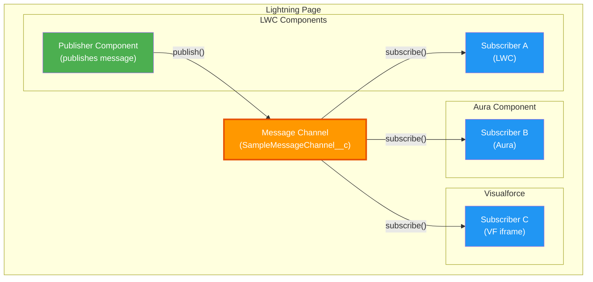
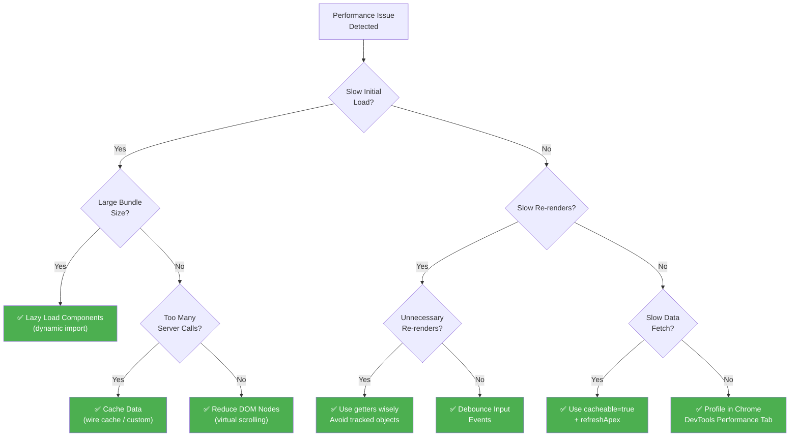
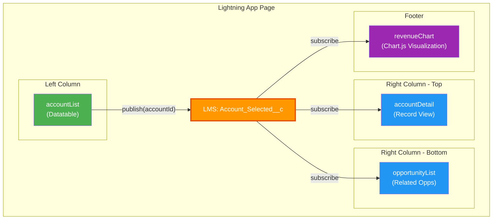

# 🚀 Week 4: Advanced LWC Features

> **Goal:** Master navigation, cross-component communication via Lightning Message Service, dynamic component creation, performance optimization, and platform-specific patterns for Experience Cloud, Flows, and LWC OSS.

---

## Table of Contents

1. [NavigationMixin Deep-Dive](#1-navigationmixin-deep-dive)
2. [Lightning Message Service (LMS)](#2-lightning-message-service-lms)
3. [Platform Events in LWC](#3-platform-events-in-lwc)
4. [Dynamic Component Creation](#4-dynamic-component-creation)
5. [Third-Party Library Integration](#5-third-party-library-integration)
6. [Performance Optimization](#6-performance-optimization)
7. [Lazy Loading](#7-lazy-loading)
8. [Caching Strategies](#8-caching-strategies)
9. [LWC in Experience Cloud](#9-lwc-in-experience-cloud)
10. [LWC in Screen Flows](#10-lwc-in-screen-flows)
11. [LWC Open Source (OSS)](#11-lwc-open-source-oss)
12. [Practice Questions](#12-practice-questions)
13. [Mini Project: Multi-Component Dashboard](#13-mini-project-multi-component-dashboard)

---

## 1. NavigationMixin Deep-Dive

The `NavigationMixin` is a mixin (a design pattern that adds behavior to a class) that provides **declarative navigation** to your LWC. Instead of manually constructing URLs, you describe *where* you want to go using a **Page Reference** object, and the framework handles the routing.

### How to Use NavigationMixin

```javascript
// Step 1: Import
import { NavigationMixin } from 'lightning/navigation';

// Step 2: Extend your class with the mixin
export default class MyComponent extends NavigationMixin(LightningElement) {
    // Step 3: Use this[NavigationMixin.Navigate](pageRef) to navigate
    // Or use this[NavigationMixin.GenerateUrl](pageRef) to get a URL
}
```

### Complete Page Reference Types

| Page Type | `type` Value | Description | Key Attributes |
|-----------|-------------|-------------|----------------|
| Record Page | `standard__recordPage` | View/Edit a record | `recordId`, `objectApiName`, `actionName` |
| Object Page | `standard__objectPage` | List view / new record | `objectApiName`, `actionName` |
| Named Page | `standard__namedPage` | Standard pages (Home, Chatter) | `pageName` |
| Nav Item Page | `standard__navItemPage` | Custom tab | `apiName` |
| Web Page | `standard__webPage` | External URL | `url` (in `attributes`) |
| Lightning Component | `standard__component` | Navigate to Aura component | `componentName` |
| Knowledge Article | `standard__knowledgeArticlePage` | Knowledge article | `articleType`, `urlName` |
| Custom Tab | `standard__navItemPage` | Custom tab page | `apiName` |
| Related List | `standard__recordRelationshipPage` | Related list of a record | `recordId`, `objectApiName`, `relationshipApiName`, `actionName` |

### Navigation Examples

```javascript
// navigatorDemo.js
import { LightningElement, api } from 'lwc';
import { NavigationMixin } from 'lightning/navigation';

export default class NavigatorDemo extends NavigationMixin(LightningElement) {
    @api recordId;

    // ── Navigate to a Record Page ──
    navigateToRecord() {
        this[NavigationMixin.Navigate]({
            type: 'standard__recordPage',
            attributes: {
                recordId: this.recordId,
                objectApiName: 'Account',
                actionName: 'view'  // 'view' | 'edit' | 'clone'
            }
        });
    }

    // ── Navigate to Create New Record ──
    navigateToNewContact() {
        this[NavigationMixin.Navigate]({
            type: 'standard__objectPage',
            attributes: {
                objectApiName: 'Contact',
                actionName: 'new'
            },
            state: {
                // Pre-fill fields using default field values
                defaultFieldValues: 'AccountId=' + this.recordId + ',Rating=Hot'
            }
        });
    }

    // ── Navigate to List View ──
    navigateToListView() {
        this[NavigationMixin.Navigate]({
            type: 'standard__objectPage',
            attributes: {
                objectApiName: 'Account',
                actionName: 'list'
            },
            state: {
                filterName: 'Recent'  // 'All', 'Recent', or a custom list view Id
            }
        });
    }

    // ── Navigate to External URL ──
    navigateToExternalUrl() {
        this[NavigationMixin.Navigate]({
            type: 'standard__webPage',
            attributes: {
                url: 'https://developer.salesforce.com'
            }
        });
    }

    // ── Navigate to Named Page (Home) ──
    navigateToHome() {
        this[NavigationMixin.Navigate]({
            type: 'standard__namedPage',
            attributes: {
                pageName: 'home'
            }
        });
    }

    // ── Navigate to Related List ──
    navigateToRelatedList() {
        this[NavigationMixin.Navigate]({
            type: 'standard__recordRelationshipPage',
            attributes: {
                recordId: this.recordId,
                objectApiName: 'Account',
                relationshipApiName: 'Contacts',
                actionName: 'view'
            }
        });
    }

    // ── Generate URL (without navigating) ──
    recordUrl;

    connectedCallback() {
        this[NavigationMixin.GenerateUrl]({
            type: 'standard__recordPage',
            attributes: {
                recordId: this.recordId,
                actionName: 'view'
            }
        }).then(url => {
            this.recordUrl = url;
        });
    }
}
```

```html
<!-- navigatorDemo.html -->
<template>
    <lightning-card title="Navigation Demo">
        <div class="slds-p-around_medium">
            <lightning-button label="View Record" onclick={navigateToRecord}></lightning-button>
            <lightning-button label="New Contact" onclick={navigateToNewContact}></lightning-button>
            <lightning-button label="List View" onclick={navigateToListView}></lightning-button>
            <lightning-button label="Salesforce Docs" onclick={navigateToExternalUrl}></lightning-button>
            <lightning-button label="Home" onclick={navigateToHome}></lightning-button>

            <template if:true={recordUrl}>
                <p class="slds-m-top_medium">
                    <a href={recordUrl}>Generated Record Link</a>
                </p>
            </template>
        </div>
    </lightning-card>
</template>
```

> [!NOTE]
> `NavigationMixin.Navigate` performs an actual page navigation (full page load). If you just need a URL string (e.g., for an `<a>` tag), use `NavigationMixin.GenerateUrl` instead.

---

## 2. Lightning Message Service (LMS)

Lightning Message Service enables communication between **any components on the same Lightning page** — even across different DOM trees, namespaces, and frameworks (LWC, Aura, Visualforce). It's like a radio broadcast: one component publishes a message on a channel, and any component subscribed to that channel receives it.

### 🏗️ LMS Architecture



### Step 1: Create the Message Channel

```xml
<!-- force-app/main/default/messageChannels/Record_Selected.messageChannel-meta.xml -->
<?xml version="1.0" encoding="UTF-8"?>
<LightningMessageChannel xmlns="http://soap.sforce.com/2006/04/metadata">
    <masterLabel>Record Selected</masterLabel>
    <description>Message channel for record selection events</description>
    <isExposed>true</isExposed>
    <lightningMessageFields>
        <fieldName>recordId</fieldName>
        <description>The Id of the selected record</description>
    </lightningMessageFields>
    <lightningMessageFields>
        <fieldName>recordName</fieldName>
        <description>The name of the selected record</description>
    </lightningMessageFields>
    <lightningMessageFields>
        <fieldName>source</fieldName>
        <description>Identifier of the publishing component</description>
    </lightningMessageFields>
</LightningMessageChannel>
```

### Step 2: Publisher Component

```javascript
// lmsPublisher.js
import { LightningElement, wire } from 'lwc';
import { publish, MessageContext } from 'lightning/messageService';
import RECORD_SELECTED_CHANNEL from '@salesforce/messageChannel/Record_Selected__c';

export default class LmsPublisher extends LightningElement {
    
    @wire(MessageContext)
    messageContext;

    handleAccountSelect(event) {
        const recordId = event.detail.row.Id;
        const recordName = event.detail.row.Name;

        // Publish the message
        const payload = {
            recordId: recordId,
            recordName: recordName,
            source: 'lmsPublisher'
        };

        publish(this.messageContext, RECORD_SELECTED_CHANNEL, payload);
    }
}
```

### Step 3: Subscriber Component

```javascript
// lmsSubscriber.js
import { LightningElement, wire } from 'lwc';
import { subscribe, unsubscribe, APPLICATION_SCOPE, MessageContext } from 'lightning/messageService';
import RECORD_SELECTED_CHANNEL from '@salesforce/messageChannel/Record_Selected__c';

export default class LmsSubscriber extends LightningElement {
    selectedRecordId;
    selectedRecordName;
    subscription = null;

    @wire(MessageContext)
    messageContext;

    connectedCallback() {
        this.subscribeToChannel();
    }

    subscribeToChannel() {
        if (!this.subscription) {
            this.subscription = subscribe(
                this.messageContext,
                RECORD_SELECTED_CHANNEL,
                (message) => this.handleMessage(message),
                { scope: APPLICATION_SCOPE }  // Receive messages from ANY page
            );
        }
    }

    handleMessage(message) {
        this.selectedRecordId = message.recordId;
        this.selectedRecordName = message.recordName;
        console.log(`Received from: ${message.source}`);
    }

    disconnectedCallback() {
        unsubscribe(this.subscription);
        this.subscription = null;
    }
}
```

```html
<!-- lmsSubscriber.html -->
<template>
    <lightning-card title="Selected Record" icon-name="standard:record">
        <div class="slds-p-around_medium">
            <template if:true={selectedRecordId}>
                <p><strong>ID:</strong> {selectedRecordId}</p>
                <p><strong>Name:</strong> {selectedRecordName}</p>
            </template>
            <template if:false={selectedRecordId}>
                <p class="slds-text-color_weak">No record selected. Click a row in the list.</p>
            </template>
        </div>
    </lightning-card>
</template>
```

### LMS Scoping

| Scope | Constant | Behavior |
|-------|----------|----------|
| **Default (no scope)** | — | Receives messages only from components on the **same page** |
| **Application Scope** | `APPLICATION_SCOPE` | Receives messages from **any component in the entire app**, even across tabs/pages |

> [!WARNING]
> Use `APPLICATION_SCOPE` carefully — it can cause unintended side effects if multiple pages publish to the same channel. Always include a `source` field in your payload so subscribers can filter.

---

## 3. Platform Events in LWC

Platform Events allow real-time communication from the **server to the client**. Use the **Streaming API** via the `lightning/empApi` module to subscribe to platform events, Change Data Capture (CDC), and generic streaming channels.

```javascript
// platformEventSubscriber.js
import { LightningElement } from 'lwc';
import { subscribe, unsubscribe, onError, setDebugFlag } from 'lightning/empApi';

export default class PlatformEventSubscriber extends LightningElement {
    subscription = null;
    channelName = '/event/Order_Event__e'; // Platform event channel
    messages = [];

    connectedCallback() {
        // Register error listener
        this.registerErrorListener();
        this.handleSubscribe();
    }

    handleSubscribe() {
        const messageCallback = (response) => {
            const eventData = response.data.payload;
            this.messages = [
                ...this.messages,
                {
                    id: Date.now(),
                    orderId: eventData.Order_Id__c,
                    status: eventData.Status__c,
                    timestamp: new Date().toLocaleTimeString()
                }
            ];
        };

        subscribe(this.channelName, -1, messageCallback).then((response) => {
            this.subscription = response;
            console.log('Subscribed to:', JSON.stringify(response.channel));
        });
    }

    handleUnsubscribe() {
        unsubscribe(this.subscription, (response) => {
            console.log('Unsubscribed:', JSON.stringify(response));
            this.subscription = null;
        });
    }

    registerErrorListener() {
        onError((error) => {
            console.error('Streaming API error:', JSON.stringify(error));
        });
    }

    disconnectedCallback() {
        if (this.subscription) {
            this.handleUnsubscribe();
        }
    }
}
```

```html
<!-- platformEventSubscriber.html -->
<template>
    <lightning-card title="Live Order Events" icon-name="utility:connected_apps">
        <div class="slds-p-around_medium">
            <lightning-badge label={messages.length} class="slds-m-bottom_small"></lightning-badge>
            <template for:each={messages} for:item="msg">
                <div key={msg.id} class="slds-box slds-m-bottom_x-small">
                    <p><strong>Order:</strong> {msg.orderId}</p>
                    <p><strong>Status:</strong> {msg.status}</p>
                    <p class="slds-text-color_weak">{msg.timestamp}</p>
                </div>
            </template>
            <template if:false={messages.length}>
                <p>Waiting for events...</p>
            </template>
        </div>
    </lightning-card>
</template>
```

> [!TIP]
> The `-1` in `subscribe(channel, -1, callback)` is the **replay ID**. Use `-1` to receive only new events, `-2` to replay the last 24 hours of events, or a specific replay ID to resume from a known point.

---

## 4. Dynamic Component Creation

LWC supports dynamically instantiating components at runtime using `lwc:component` with the `lwc:is` directive. This is the LWC equivalent of a factory pattern — choose which component to render based on data.

### Using `lwc:component` and `lwc:is`

```javascript
// dynamicLoader.js
import { LightningElement } from 'lwc';

export default class DynamicLoader extends LightningElement {
    selectedComponent;
    
    componentMap = {
        chart: () => import('c/chartWidget'),
        table: () => import('c/tableWidget'),
        kpi: () => import('c/kpiWidget')
    };

    handleWidgetChange(event) {
        const widgetType = event.detail.value;
        if (this.componentMap[widgetType]) {
            this.componentMap[widgetType]().then(({ default: ctor }) => {
                this.selectedComponent = ctor;
            });
        }
    }
}
```

```html
<!-- dynamicLoader.html -->
<template>
    <lightning-card title="Dynamic Widget Loader">
        <div class="slds-p-around_medium">
            <lightning-combobox
                label="Select Widget"
                options={widgetOptions}
                onchange={handleWidgetChange}>
            </lightning-combobox>

            <div class="slds-m-top_medium">
                <template if:true={selectedComponent}>
                    <lwc:component lwc:is={selectedComponent}></lwc:component>
                </template>
            </div>
        </div>
    </lightning-card>
</template>
```

```javascript
// dynamicLoader.js (continued - getter for options)
get widgetOptions() {
    return [
        { label: 'Chart', value: 'chart' },
        { label: 'Table', value: 'table' },
        { label: 'KPI Card', value: 'kpi' }
    ];
}
```

> [!IMPORTANT]
> `lwc:is` only accepts a **constructor** (the default export from a dynamic `import()`). You cannot pass a string name like in Aura's `$A.createComponent()`.

---

## 5. Third-Party Library Integration

### Loading Static Resources

```javascript
// chartComponent.js
import { LightningElement } from 'lwc';
import { loadScript, loadStyle } from 'lightning/platformResourceLoader';
import chartJs from '@salesforce/resourceUrl/chartjs';  // Uploaded as Static Resource

export default class ChartComponent extends LightningElement {
    chartInitialized = false;

    async renderedCallback() {
        if (this.chartInitialized) return;
        this.chartInitialized = true;

        try {
            await loadScript(this, chartJs + '/Chart.min.js');
            // Library is now available globally
            this.initializeChart();
        } catch (error) {
            console.error('Error loading Chart.js', error);
        }
    }

    initializeChart() {
        const canvas = this.template.querySelector('canvas.chart');
        const ctx = canvas.getContext('2d');

        new window.Chart(ctx, {
            type: 'bar',
            data: {
                labels: ['Q1', 'Q2', 'Q3', 'Q4'],
                datasets: [{
                    label: 'Revenue',
                    data: [12000, 19000, 15000, 25000],
                    backgroundColor: '#0176D3'
                }]
            },
            options: {
                responsive: true
            }
        });
    }
}
```

```html
<!-- chartComponent.html -->
<template>
    <lightning-card title="Revenue Chart">
        <div class="slds-p-around_medium">
            <canvas class="chart" lwc:dom="manual"></canvas>
        </div>
    </lightning-card>
</template>
```

> [!CAUTION]
> The `lwc:dom="manual"` directive tells the LWC engine that you will manipulate the DOM inside this element directly (e.g., for Chart.js canvas rendering). Without it, the framework may overwrite your DOM changes on re-render. Use this sparingly — manual DOM manipulation bypasses LWC's reactivity.

---

## 6. Performance Optimization

### 🌳 Performance Optimization Decision Tree



### Key Optimization Techniques

#### 1. Debouncing User Input

```javascript
// searchWithDebounce.js
import { LightningElement } from 'lwc';
import searchAccounts from '@salesforce/apex/AccountController.searchAccounts';

export default class SearchWithDebounce extends LightningElement {
    searchTerm = '';
    results = [];
    _debounceTimer;

    handleSearchInput(event) {
        // Clear previous timer
        clearTimeout(this._debounceTimer);
        const value = event.target.value;

        // Wait 300ms after user stops typing
        this._debounceTimer = setTimeout(() => {
            this.searchTerm = value;
            this.performSearch();
        }, 300);
    }

    async performSearch() {
        if (this.searchTerm.length >= 2) {
            this.results = await searchAccounts({ searchTerm: this.searchTerm });
        }
    }
}
```

#### 2. Conditional Rendering vs CSS Hiding

```html
<!-- GOOD: Conditional rendering — element not in DOM when hidden -->
<template if:true={showPanel}>
    <c-heavy-component></c-heavy-component>
</template>

<!-- LESS GOOD: CSS hiding — element still in DOM, consuming memory -->
<div class={panelClass}>
    <c-heavy-component></c-heavy-component>
</div>
```

> [!TIP]
> Use `template if:true` to **remove elements from the DOM** when not visible. Use CSS `display:none` only when you need to preserve the component's state (e.g., a tab panel that should remember user input).

#### 3. Efficient List Rendering with `key`

```html
<!-- Always use a unique, stable key — NEVER use array index -->
<template for:each={accounts} for:item="acc">
    <div key={acc.Id} class="slds-box">
        <p>{acc.Name}</p>
    </div>
</template>
```

#### 4. Avoiding Getter Side Effects

```javascript
// ❌ BAD: Getter does heavy computation on every render cycle
get processedData() {
    return this.rawData.map(item => {
        // Expensive transformation on EVERY re-render
        return { ...item, score: this.calculateScore(item) };
    });
}

// ✅ GOOD: Pre-compute once and store the result
@wire(getData)
wiredData({ data }) {
    if (data) {
        this.processedData = data.map(item => ({
            ...item,
            score: this.calculateScore(item)
        }));
    }
}
```

---

## 7. Lazy Loading

### Lazy Loading Components

```javascript
// dashboardContainer.js
import { LightningElement } from 'lwc';

export default class DashboardContainer extends LightningElement {
    activeTab = 'summary';
    tabComponents = {};

    async handleTabSelect(event) {
        this.activeTab = event.target.value;

        // Only load the component when the tab is first selected
        if (!this.tabComponents[this.activeTab]) {
            switch (this.activeTab) {
                case 'analytics':
                    const { default: Analytics } = await import('c/analyticsPanel');
                    this.tabComponents.analytics = Analytics;
                    break;
                case 'reports':
                    const { default: Reports } = await import('c/reportsPanel');
                    this.tabComponents.reports = Reports;
                    break;
            }
        }
    }

    get currentTabComponent() {
        return this.tabComponents[this.activeTab] || null;
    }
}
```

### Lazy Loading Data (Infinite Scroll)

```javascript
// infiniteScrollList.js
import { LightningElement } from 'lwc';
import getRecords from '@salesforce/apex/InfiniteScrollController.getRecords';

export default class InfiniteScrollList extends LightningElement {
    records = [];
    lastId = null;
    isLoading = false;
    hasMore = true;

    connectedCallback() {
        this.loadMore();
    }

    async loadMore() {
        if (this.isLoading || !this.hasMore) return;
        this.isLoading = true;

        try {
            const result = await getRecords({ lastId: this.lastId, pageSize: 20 });
            this.records = [...this.records, ...result.records];
            this.lastId = result.lastId;
            this.hasMore = result.hasMore;
        } catch (error) {
            console.error('Error:', error);
        } finally {
            this.isLoading = false;
        }
    }

    handleScroll(event) {
        const target = event.target;
        const scrollThreshold = target.scrollHeight - target.scrollTop - target.clientHeight;
        if (scrollThreshold < 100) {
            this.loadMore();
        }
    }
}
```

```html
<!-- infiniteScrollList.html -->
<template>
    <div class="scroll-container" onscroll={handleScroll} style="height: 400px; overflow-y: auto;">
        <template for:each={records} for:item="rec">
            <div key={rec.Id} class="slds-box slds-m-bottom_x-small">
                <p>{rec.Name}</p>
            </div>
        </template>
        <template if:true={isLoading}>
            <lightning-spinner alternative-text="Loading more..."></lightning-spinner>
        </template>
    </div>
</template>
```

---

## 8. Caching Strategies

| Strategy | Mechanism | TTL | Best For |
|----------|-----------|-----|----------|
| **Wire cache** | Automatic via `cacheable=true` | ~5 minutes | Standard data reads |
| **Browser Storage** | `sessionStorage` / `localStorage` | Session / Persistent | User preferences, UI state |
| **Custom JS cache** | Module-level Map or variable | Component lifecycle | Expensive computations |
| **refreshApex** | Invalidates wire cache | On-demand | Force fresh data after DML |

### Custom Module-Level Cache

```javascript
// services/accountCache.js
const cache = new Map();
const CACHE_TTL = 5 * 60 * 1000; // 5 minutes

export function getCachedAccount(accountId) {
    const entry = cache.get(accountId);
    if (entry && Date.now() - entry.timestamp < CACHE_TTL) {
        return entry.data;
    }
    return null;
}

export function setCachedAccount(accountId, data) {
    cache.set(accountId, { data, timestamp: Date.now() });
}

export function invalidateAccount(accountId) {
    cache.delete(accountId);
}
```

---

## 9. LWC in Experience Cloud

When deploying LWC components in **Experience Cloud** (formerly Communities), several differences apply:

### Key Differences from Lightning Experience

| Aspect | Lightning Experience | Experience Cloud |
|--------|---------------------|------------------|
| **Navigation** | `NavigationMixin` | `NavigationMixin` (but some page types differ) |
| **Toast** | `ShowToastEvent` works | ❌ **Not supported** — use custom toast component |
| **User Info** | `@salesforce/user/Id` | Same, but context is guest/community user |
| **Base URL** | Internal org URL | Community URL (custom domain) |
| **CSS** | SLDS via framework | May need explicit `@import` |
| **Caching** | CDN caching | Community-level caching + CDN |
| **Targets** | `lightning__AppPage`, etc. | `lightningCommunity__Page`, `lightningCommunity__Default` |

### Meta Configuration for Experience Cloud

```xml
<?xml version="1.0" encoding="UTF-8"?>
<LightningComponentBundle xmlns="http://soap.sforce.com/2006/04/metadata">
    <apiVersion>59.0</apiVersion>
    <isExposed>true</isExposed>
    <targets>
        <target>lightningCommunity__Page</target>
        <target>lightningCommunity__Default</target>
    </targets>
    <targetConfigs>
        <targetConfig targets="lightningCommunity__Default">
            <property name="heading" type="String" default="Welcome" label="Heading Text"/>
            <property name="showSearch" type="Boolean" default="true" label="Show Search Bar"/>
        </targetConfig>
    </targetConfigs>
</LightningComponentBundle>
```

### Custom Toast for Experience Cloud

```javascript
// customToast.js (since ShowToastEvent doesn't work in communities)
import { LightningElement, api } from 'lwc';

export default class CustomToast extends LightningElement {
    @api message = '';
    @api variant = 'info'; // 'info' | 'success' | 'warning' | 'error'
    isVisible = false;

    @api
    show(message, variant = 'info', duration = 3000) {
        this.message = message;
        this.variant = variant;
        this.isVisible = true;
        // Auto-hide after duration
        setTimeout(() => { this.isVisible = false; }, duration);
    }

    get toastClass() {
        return `slds-notify slds-notify_toast slds-theme_${this.variant} ${this.isVisible ? '' : 'slds-hide'}`;
    }
}
```

---

## 10. LWC in Screen Flows

LWC components can be embedded in **Screen Flows** for rich custom UI. The component communicates with the flow engine through `@api` properties marked with `FlowAttributeChangeEvent`.

### Flow Screen Component Example

```javascript
// flowContactPicker.js
import { LightningElement, api } from 'lwc';
import { FlowAttributeChangeEvent, FlowNavigationNextEvent } from 'lightning/flowSupport';

export default class FlowContactPicker extends LightningElement {
    // Input property from Flow (set by the admin in Flow Builder)
    @api accountId;
    
    // Output property to Flow
    @api selectedContactId;

    // Available actions from the flow (Next, Back, Finish, etc.)
    @api availableActions = [];

    contacts = [];

    handleContactSelect(event) {
        this.selectedContactId = event.detail.value;
        // Notify the flow that an output attribute changed
        this.dispatchEvent(new FlowAttributeChangeEvent('selectedContactId', this.selectedContactId));
    }

    handleNext() {
        if (this.availableActions.includes('NEXT')) {
            this.dispatchEvent(new FlowNavigationNextEvent());
        }
    }

    get canGoNext() {
        return this.availableActions.includes('NEXT') && !!this.selectedContactId;
    }
}
```

### Meta Configuration for Flows

```xml
<?xml version="1.0" encoding="UTF-8"?>
<LightningComponentBundle xmlns="http://soap.sforce.com/2006/04/metadata">
    <apiVersion>59.0</apiVersion>
    <isExposed>true</isExposed>
    <targets>
        <target>lightning__FlowScreen</target>
    </targets>
    <targetConfigs>
        <targetConfig targets="lightning__FlowScreen">
            <property name="accountId" type="String" label="Account ID" role="inputOnly"/>
            <property name="selectedContactId" type="String" label="Selected Contact ID" role="outputOnly"/>
        </targetConfig>
    </targetConfigs>
</LightningComponentBundle>
```

> [!NOTE]
> Flow properties have three roles: `inputOnly` (set by the flow admin), `outputOnly` (returned to the flow), or no role (both input and output). This is set in the `<targetConfig>` metadata.

---

## 11. LWC Open Source (OSS)

LWC OSS is the **open-source version** of Lightning Web Components that can run outside of Salesforce — on any Node.js server or even as a static site.

### LWC OSS vs LWC on Salesforce

| Feature | LWC (Salesforce) | LWC OSS |
|---------|-----------------|---------|
| **Runtime** | Salesforce Platform | Node.js / any web server |
| **Data** | Wire service, Apex, LDS | Your own APIs (REST, GraphQL) |
| **Base Components** | `lightning-*` (full library) | `lightning-base-components` (subset) |
| **Security** | LWS / Locker Service | Standard web security |
| **Deployment** | Salesforce CLI | npm, Docker, Heroku, etc. |
| **Use Case** | Salesforce apps | Standalone web apps, PWAs |

### Quick Start with LWC OSS

```bash
# Create a new LWC OSS project
npx create-lwc-app my-lwc-app
cd my-lwc-app
npm install

# Run the development server
npm run watch
```

---

## 12. Practice Questions

### Question 1
**How do you import and use the NavigationMixin in an LWC?**

<details><summary>✅ Answer</summary>

```javascript
import { NavigationMixin } from 'lightning/navigation';

export default class MyComponent extends NavigationMixin(LightningElement) {
    navigate() {
        this[NavigationMixin.Navigate](pageReference);
    }
}
```
The class extends `NavigationMixin(LightningElement)` (not just `LightningElement`), and navigation is invoked via `this[NavigationMixin.Navigate](pageRef)`.
</details>

### Question 2
**What is the difference between `NavigationMixin.Navigate` and `NavigationMixin.GenerateUrl`?**

<details><summary>✅ Answer</summary>

- `Navigate` performs an **actual page navigation** (changes the URL and loads the new page)
- `GenerateUrl` returns a **Promise** that resolves to a URL string, without navigating. Useful for generating `<a href>` links.
</details>

### Question 3
**What three files are needed to create a Lightning Message Channel?**

<details><summary>✅ Answer</summary>

Only **one file** is needed: the `.messageChannel-meta.xml` file placed in the `force-app/main/default/messageChannels/` directory. It defines the channel name, fields, and whether it's exposed.
</details>

### Question 4
**What does `APPLICATION_SCOPE` do in an LMS subscription?**

<details><summary>✅ Answer</summary>

`APPLICATION_SCOPE` allows the subscriber to receive messages from **any component in the entire application**, not just components on the same page. Without it, only same-page messages are received.
</details>

### Question 5
**How do you subscribe to a Platform Event in LWC?**

<details><summary>✅ Answer</summary>

Use the `lightning/empApi` module:
```javascript
import { subscribe, unsubscribe, onError } from 'lightning/empApi';

// Subscribe
subscribe('/event/My_Event__e', -1, (response) => {
    console.log(response.data.payload);
}).then(subscription => { this.subscription = subscription; });
```
</details>

### Question 6
**What does the `lwc:dom="manual"` directive do?**

<details><summary>✅ Answer</summary>

It tells the LWC engine that the component will **manually manipulate the DOM** inside that element (e.g., for third-party libraries like Chart.js). Without it, the framework may overwrite manual DOM changes during re-renders.
</details>

### Question 7
**What is the correct way to dynamically render a component using `lwc:is`?**

<details><summary>✅ Answer</summary>

```javascript
// Import dynamically
const { default: MyComp } = await import('c/myComponent');
this.selectedComponent = MyComp; // Store the constructor

// In template:
// <lwc:component lwc:is={selectedComponent}></lwc:component>
```
`lwc:is` accepts a **component constructor**, not a string name.
</details>

### Question 8
**Why does `ShowToastEvent` not work in Experience Cloud?**

<details><summary>✅ Answer</summary>

`ShowToastEvent` is only supported in **Lightning Experience** and the **Salesforce mobile app**. Experience Cloud (Communities) has a different rendering engine that doesn't support the native toast container. You need to build a **custom toast component**.
</details>

### Question 9
**What is debouncing and why is it important for search inputs?**

<details><summary>✅ Answer</summary>

Debouncing delays the execution of a function until a specified time has passed since the last invocation. For search inputs, it prevents sending a server request on **every keystroke** — instead, it waits until the user pauses typing (e.g., 300ms), reducing server load and improving performance.
</details>

### Question 10
**How do you load a third-party JavaScript library in LWC?**

<details><summary>✅ Answer</summary>

1. Upload the library as a **Static Resource** in Salesforce
2. Import `loadScript` from `lightning/platformResourceLoader`
3. Import the static resource reference
4. Call `await loadScript(this, resourceRef)` in `renderedCallback()` with a guard flag

```javascript
import { loadScript } from 'lightning/platformResourceLoader';
import myLib from '@salesforce/resourceUrl/myLib';

async renderedCallback() {
    if (this._initialized) return;
    this._initialized = true;
    await loadScript(this, myLib + '/myLib.min.js');
}
```
</details>

### Question 11
**What are the three property roles available in Flow screen component metadata?**

<details><summary>✅ Answer</summary>

1. **`inputOnly`** — Set by the Flow admin, read-only in the component
2. **`outputOnly`** — Set by the component, passed back to the Flow
3. **No role (default)** — Both input and output; the Flow can set it, and the component can update it
</details>

### Question 12
**How do you notify a Flow that an output attribute has changed?**

<details><summary>✅ Answer</summary>

Dispatch a `FlowAttributeChangeEvent`:
```javascript
import { FlowAttributeChangeEvent } from 'lightning/flowSupport';
this.dispatchEvent(new FlowAttributeChangeEvent('attributeName', newValue));
```
</details>

### Question 13
**True or False: LMS can communicate between LWC and Visualforce components.**

<details><summary>✅ Answer</summary>

**True.** Lightning Message Service works across LWC, Aura, and Visualforce components on the same Lightning page.
</details>

### Question 14
**What replay ID value should you pass to `empApi.subscribe()` to only receive new events?**

<details><summary>✅ Answer</summary>

**`-1`** — receives only new events from the point of subscription. Use `-2` to replay events from the last 24 hours.
</details>

### Question 15
**Why should you use `template if:true` instead of CSS `display:none` for heavy components?**

<details><summary>✅ Answer</summary>

`template if:true` completely **removes the component from the DOM** when the condition is false, freeing memory and stopping any lifecycle hooks. CSS `display:none` keeps the component in the DOM, consuming memory and processing resources. Use CSS hiding only when you need to preserve component state.
</details>

### Question 16
**What is the difference between LWC OSS and Salesforce LWC?**

<details><summary>✅ Answer</summary>

| Aspect | LWC (Salesforce) | LWC OSS |
|--------|-----------------|---------|
| Runtime | Salesforce Platform | Any Node.js server |
| Data | Wire/Apex/LDS | Custom APIs |
| Components | Full `lightning-*` | Limited subset |
| Security | LWS/Locker | Standard web security |
</details>

### Question 17
**What must you do in `disconnectedCallback` when using LMS subscriptions?**

<details><summary>✅ Answer</summary>

Call `unsubscribe()` to clean up the subscription and prevent memory leaks:
```javascript
disconnectedCallback() {
    unsubscribe(this.subscription);
    this.subscription = null;
}
```
</details>

### Question 18
**How would you pre-fill a field when navigating to a "New Record" page?**

<details><summary>✅ Answer</summary>

Use the `state.defaultFieldValues` in the page reference:
```javascript
this[NavigationMixin.Navigate]({
    type: 'standard__objectPage',
    attributes: {
        objectApiName: 'Contact',
        actionName: 'new'
    },
    state: {
        defaultFieldValues: 'AccountId=001XXXX,Email=test@example.com'
    }
});
```
</details>

### Question 19
**What is the purpose of the `key` attribute in `for:each` loops?**

<details><summary>✅ Answer</summary>

The `key` attribute helps the LWC rendering engine **efficiently track and update** DOM elements when the list changes. It should be a **unique, stable identifier** (like a record Id), never an array index. Without proper keys, the engine may re-render the entire list instead of just the changed items.
</details>

### Question 20
**Name two caching strategies available in LWC and when to use each.**

<details><summary>✅ Answer</summary>

1. **Wire cache** (`cacheable=true`) — Automatic ~5-minute caching for Apex read operations. Use for standard data queries.
2. **Browser sessionStorage** — Persists for the browser session. Use for user preferences or UI state that shouldn't trigger server calls.
3. **Custom JS Map cache** — Module-level JavaScript cache with custom TTL. Use for expensive computations or frequently accessed reference data.
</details>

---

## 13. Mini Project: Multi-Component Dashboard

### 📋 Project Specification

**Build a Sales Dashboard** with multiple independent components that communicate via Lightning Message Service.

#### Architecture Diagram



#### Requirements

| Component | Functionality |
|-----------|--------------|
| **accountList** | Display accounts in datatable; on row click, publish `Account_Selected__c` via LMS |
| **accountDetail** | Subscribe to LMS; display account details using `getRecord` |
| **opportunityList** | Subscribe to LMS; display related opportunities via Apex |
| **revenueChart** | Subscribe to LMS; render a revenue chart using Chart.js (loaded from static resource) |

#### Message Channel

```xml
<!-- Account_Selected.messageChannel-meta.xml -->
<LightningMessageChannel xmlns="http://soap.sforce.com/2006/04/metadata">
    <masterLabel>Account Selected</masterLabel>
    <isExposed>true</isExposed>
    <lightningMessageFields>
        <fieldName>accountId</fieldName>
    </lightningMessageFields>
    <lightningMessageFields>
        <fieldName>accountName</fieldName>
    </lightningMessageFields>
</LightningMessageChannel>
```

#### Stretch Goals

- Add a **Platform Event** subscriber that shows real-time opportunity stage changes
- Implement **lazy loading** for the chart component (only load Chart.js when the tab is active)
- Add a **search bar** with debouncing in the account list

---

## 🔑 Key Takeaways

| Concept | Remember |
|---------|----------|
| **NavigationMixin** | Extend class, use `this[NavigationMixin.Navigate](pageRef)` |
| **LMS** | Cross-framework pub/sub; deploy `.messageChannel-meta.xml`; always `unsubscribe` in `disconnectedCallback` |
| **Platform Events** | Use `lightning/empApi`; replay `-1` for new only, `-2` for 24h replay |
| **Dynamic Components** | `lwc:is` takes a constructor from `import()`, not a string |
| **Third-party Libs** | Upload as Static Resource; load in `renderedCallback` with guard; use `lwc:dom="manual"` |
| **Performance** | Debounce inputs, conditional render vs CSS hide, avoid getter side effects |
| **Experience Cloud** | No `ShowToastEvent`; use community-specific targets |
| **Screen Flows** | `FlowAttributeChangeEvent` to push data back; use `role` in metadata |
| **LWC OSS** | Same component model, no Salesforce services, runs on Node.js |
