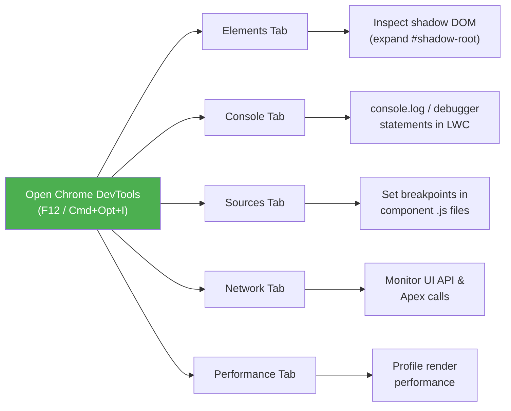
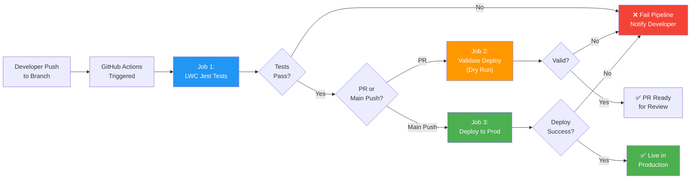
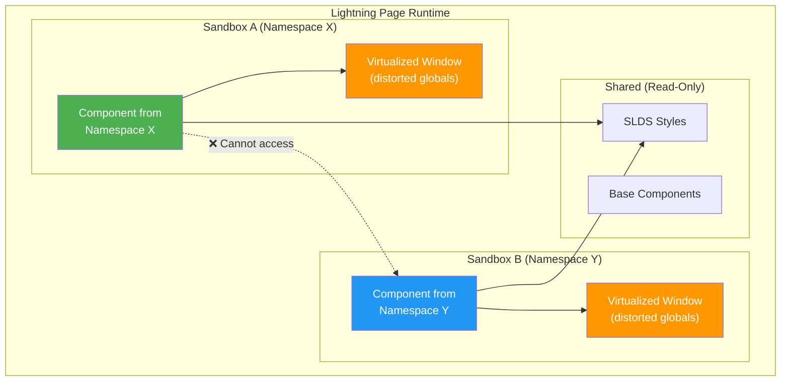

# 🧪 Week 5: Testing, Debugging & Deployment

> **Goal:** Master Jest testing for LWC, debugging techniques, Salesforce CLI deployment workflows, package development, CI/CD pipelines, and Lightning Web Security.

---

## Table of Contents

1. [Jest Testing Framework Setup](#1-jest-testing-framework-setup)
2. [Writing Unit Tests](#2-writing-unit-tests)
3. [Mocking Wire Adapters](#3-mocking-wire-adapters)
4. [Mocking Apex Calls](#4-mocking-apex-calls)
5. [Testing Navigation and Toast Events](#5-testing-navigation-and-toast-events)
6. [Code Coverage Requirements](#6-code-coverage-requirements)
7. [Debugging Techniques](#7-debugging-techniques)
8. [Salesforce CLI Deployment](#8-salesforce-cli-deployment)
9. [Package Development: 1GP vs 2GP](#9-package-development-1gp-vs-2gp)
10. [CI/CD Pipeline with GitHub Actions](#10-cicd-pipeline-with-github-actions)
11. [Security: LWS vs Locker Service](#11-security-lws-vs-locker-service)
12. [Content Security Policy (CSP)](#12-content-security-policy-csp)
13. [Practice Questions](#13-practice-questions)
14. [Mini Project: Jest Test Suite](#14-mini-project-jest-test-suite)

---

## 1. Jest Testing Framework Setup

LWC uses **Jest** (a popular JavaScript testing framework from Meta) with a Salesforce-specific extension called `@salesforce/sfdx-lwc-jest`. This gives you LWC-aware DOM rendering, mock providers for wire adapters and Apex, and component lifecycle simulation.

### Step-by-Step Setup

```bash
# Step 1: Ensure you have a Salesforce DX project
sf project generate --name my-lwc-project

# Step 2: Install sfdx-lwc-jest (adds Jest + LWC test utilities)
sf lightning generate test --name myComponent

# Or install manually:
npm install --save-dev @salesforce/sfdx-lwc-jest

# Step 3: Add test script to package.json
# (should already be there if you used sf generate)
```

```json
// package.json (relevant section)
{
  "scripts": {
    "test:unit": "sfdx-lwc-jest",
    "test:unit:watch": "sfdx-lwc-jest --watch",
    "test:unit:debug": "sfdx-lwc-jest --debug",
    "test:unit:coverage": "sfdx-lwc-jest --coverage"
  },
  "devDependencies": {
    "@salesforce/sfdx-lwc-jest": "^5.1.0"
  }
}
```

### Test File Structure

```
force-app/
└── main/
    └── default/
        └── lwc/
            └── myComponent/
                ├── myComponent.html
                ├── myComponent.js
                ├── myComponent.js-meta.xml
                └── __tests__/
                    └── myComponent.test.js   ← Tests go here
```

### Running Tests

```bash
# Run all tests
npm run test:unit

# Run tests for a specific component
npm run test:unit -- --testPathPattern=myComponent

# Run in watch mode (re-runs on file change)
npm run test:unit:watch

# Run with coverage report
npm run test:unit:coverage

# Debug tests (attach Chrome DevTools debugger)
npm run test:unit:debug
```

> [!NOTE]
> Jest tests run in **jsdom** (a Node.js DOM emulation), not a real browser. This means some browser APIs may not be available. LWC test utilities handle the component lifecycle (connectedCallback, renderedCallback, etc.) automatically.

---

## 2. Writing Unit Tests

### 2.1 Testing Rendered DOM

```javascript
// greeting.js
import { LightningElement, api } from 'lwc';

export default class Greeting extends LightningElement {
    @api name = 'World';

    get greetingMessage() {
        return `Hello, ${this.name}!`;
    }
}
```

```html
<!-- greeting.html -->
<template>
    <h1 class="greeting">{greetingMessage}</h1>
    <p class="subtitle">Welcome to Lightning Web Components</p>
</template>
```

```javascript
// __tests__/greeting.test.js
import { createElement } from 'lwc';
import Greeting from 'c/greeting';

describe('c-greeting', () => {
    // Clean up the DOM after each test
    afterEach(() => {
        while (document.body.firstChild) {
            document.body.removeChild(document.body.firstChild);
        }
    });

    it('displays default greeting', () => {
        // Create and attach the component
        const element = createElement('c-greeting', { is: Greeting });
        document.body.appendChild(element);

        // Query the rendered DOM
        const heading = element.shadowRoot.querySelector('h1.greeting');
        expect(heading.textContent).toBe('Hello, World!');
    });

    it('displays custom name when set', () => {
        const element = createElement('c-greeting', { is: Greeting });
        element.name = 'Salesforce';
        document.body.appendChild(element);

        const heading = element.shadowRoot.querySelector('h1.greeting');
        expect(heading.textContent).toBe('Hello, Salesforce!');
    });

    it('renders the subtitle paragraph', () => {
        const element = createElement('c-greeting', { is: Greeting });
        document.body.appendChild(element);

        const subtitle = element.shadowRoot.querySelector('p.subtitle');
        expect(subtitle).not.toBeNull();
        expect(subtitle.textContent).toBe('Welcome to Lightning Web Components');
    });
});
```

### 2.2 Testing Properties and Reactivity

```javascript
// __tests__/greeting.test.js (continued)
describe('c-greeting reactivity', () => {
    afterEach(() => {
        while (document.body.firstChild) {
            document.body.removeChild(document.body.firstChild);
        }
    });

    it('updates greeting when name property changes', async () => {
        const element = createElement('c-greeting', { is: Greeting });
        element.name = 'Alice';
        document.body.appendChild(element);

        // Verify initial render
        let heading = element.shadowRoot.querySelector('h1.greeting');
        expect(heading.textContent).toBe('Hello, Alice!');

        // Change the property
        element.name = 'Bob';

        // Wait for re-render (microtask flush)
        await Promise.resolve();

        // Verify updated render
        heading = element.shadowRoot.querySelector('h1.greeting');
        expect(heading.textContent).toBe('Hello, Bob!');
    });
});
```

> [!IMPORTANT]
> After changing a reactive property, you must **wait for the microtask queue to flush** before asserting on the DOM. Use `await Promise.resolve()` or `await flushPromises()` (a common helper) to wait for the component to re-render.

### 2.3 Testing Events

```javascript
// counterButton.js
import { LightningElement } from 'lwc';

export default class CounterButton extends LightningElement {
    count = 0;

    handleIncrement() {
        this.count++;
        this.dispatchEvent(new CustomEvent('countchange', {
            detail: { count: this.count }
        }));
    }
}
```

```javascript
// __tests__/counterButton.test.js
import { createElement } from 'lwc';
import CounterButton from 'c/counterButton';

describe('c-counter-button', () => {
    afterEach(() => {
        while (document.body.firstChild) {
            document.body.removeChild(document.body.firstChild);
        }
    });

    it('fires countchange event on button click', async () => {
        const element = createElement('c-counter-button', { is: CounterButton });
        document.body.appendChild(element);

        // Create a mock event handler
        const handler = jest.fn();
        element.addEventListener('countchange', handler);

        // Simulate button click
        const button = element.shadowRoot.querySelector('lightning-button');
        button.click();

        // Verify the event was fired with correct detail
        expect(handler).toHaveBeenCalledTimes(1);
        expect(handler.mock.calls[0][0].detail.count).toBe(1);
    });

    it('increments count on each click', async () => {
        const element = createElement('c-counter-button', { is: CounterButton });
        document.body.appendChild(element);

        const handler = jest.fn();
        element.addEventListener('countchange', handler);

        const button = element.shadowRoot.querySelector('lightning-button');
        button.click();
        button.click();
        button.click();

        expect(handler).toHaveBeenCalledTimes(3);
        expect(handler.mock.calls[2][0].detail.count).toBe(3);
    });
});
```

### Flush Promises Helper

```javascript
// Create a reusable helper: __tests__/utils/flushPromises.js
export default function flushPromises() {
    return new Promise((resolve) => setTimeout(resolve, 0));
}

// Usage in tests:
// import flushPromises from './utils/flushPromises';
// await flushPromises();
```

---

## 3. Mocking Wire Adapters

When your component uses `@wire`, you need to **mock the wire adapter** in your test because there's no Salesforce server in the test environment.

### Mocking `getRecord`

```javascript
// contactDetail.js
import { LightningElement, api, wire } from 'lwc';
import { getRecord, getFieldValue } from 'lightning/uiRecordApi';
import NAME_FIELD from '@salesforce/schema/Contact.Name';
import EMAIL_FIELD from '@salesforce/schema/Contact.Email';

const FIELDS = [NAME_FIELD, EMAIL_FIELD];

export default class ContactDetail extends LightningElement {
    @api recordId;

    @wire(getRecord, { recordId: '$recordId', fields: FIELDS })
    contact;

    get contactName() {
        return getFieldValue(this.contact.data, NAME_FIELD);
    }

    get contactEmail() {
        return getFieldValue(this.contact.data, EMAIL_FIELD);
    }

    get hasError() {
        return !!this.contact.error;
    }
}
```

```javascript
// __tests__/contactDetail.test.js
import { createElement } from 'lwc';
import ContactDetail from 'c/contactDetail';
import { getRecord } from 'lightning/uiRecordApi';

// Mock data
const mockContactRecord = {
    fields: {
        Name: { value: 'John Doe' },
        Email: { value: 'john@example.com' }
    }
};

describe('c-contact-detail with wire', () => {
    afterEach(() => {
        while (document.body.firstChild) {
            document.body.removeChild(document.body.firstChild);
        }
    });

    it('renders contact data when wire returns data', async () => {
        const element = createElement('c-contact-detail', { is: ContactDetail });
        element.recordId = '003XXXXXXXXXXXX';
        document.body.appendChild(element);

        // Emit mock data through the wire adapter
        getRecord.emit(mockContactRecord);

        // Wait for re-render
        await Promise.resolve();

        // Assert on rendered output
        const nameEl = element.shadowRoot.querySelector('[data-id="name"]');
        expect(nameEl.textContent).toBe('John Doe');
    });

    it('renders error state when wire returns error', async () => {
        const element = createElement('c-contact-detail', { is: ContactDetail });
        element.recordId = '003XXXXXXXXXXXX';
        document.body.appendChild(element);

        // Emit an error through the wire adapter
        getRecord.error({ message: 'Record not found' });

        await Promise.resolve();

        const errorEl = element.shadowRoot.querySelector('.error-message');
        expect(errorEl).not.toBeNull();
    });
});
```

> [!TIP]
> The `@salesforce/sfdx-lwc-jest` package auto-registers mock implementations for standard wire adapters like `getRecord`, `getFieldValue`, etc. You just import and call `.emit()` or `.error()` on them. No manual mock setup needed!

---

## 4. Mocking Apex Calls

### Mocking a Wired Apex Method

```javascript
// accountList.js
import { LightningElement, wire } from 'lwc';
import getAccounts from '@salesforce/apex/AccountController.getAccounts';

export default class AccountList extends LightningElement {
    accounts = [];
    error;

    @wire(getAccounts)
    wiredAccounts({ data, error }) {
        if (data) {
            this.accounts = data;
            this.error = undefined;
        } else if (error) {
            this.error = error;
            this.accounts = [];
        }
    }
}
```

```javascript
// __tests__/accountList.test.js
import { createElement } from 'lwc';
import AccountList from 'c/accountList';
import getAccounts from '@salesforce/apex/AccountController.getAccounts';

// Tell Jest to use the manual mock for the Apex call
jest.mock(
    '@salesforce/apex/AccountController.getAccounts',
    () => {
        const { createApexTestWireAdapter } = require('@salesforce/sfdx-lwc-jest');
        return { default: createApexTestWireAdapter(jest.fn()) };
    },
    { virtual: true }
);

const MOCK_ACCOUNTS = [
    { Id: '001AAAAAAAAAAAA', Name: 'Acme Corp', Industry: 'Technology' },
    { Id: '001BBBBBBBBBBB', Name: 'Global Inc', Industry: 'Finance' }
];

describe('c-account-list with wired Apex', () => {
    afterEach(() => {
        while (document.body.firstChild) {
            document.body.removeChild(document.body.firstChild);
        }
    });

    it('renders accounts when Apex returns data', async () => {
        const element = createElement('c-account-list', { is: AccountList });
        document.body.appendChild(element);

        // Emit data through the mocked wire adapter
        getAccounts.emit(MOCK_ACCOUNTS);
        await Promise.resolve();

        const rows = element.shadowRoot.querySelectorAll('.account-row');
        expect(rows.length).toBe(2);
    });

    it('shows error when Apex fails', async () => {
        const element = createElement('c-account-list', { is: AccountList });
        document.body.appendChild(element);

        getAccounts.error({ body: { message: 'Server error' } });
        await Promise.resolve();

        const errorEl = element.shadowRoot.querySelector('.error');
        expect(errorEl).not.toBeNull();
    });
});
```

### Mocking an Imperative Apex Call

```javascript
// __tests__/accountSearch.test.js
import { createElement } from 'lwc';
import AccountSearch from 'c/accountSearch';
import searchAccounts from '@salesforce/apex/AccountController.searchAccounts';

// Mock the imperative Apex method
jest.mock(
    '@salesforce/apex/AccountController.searchAccounts',
    () => ({ default: jest.fn() }),
    { virtual: true }
);

describe('c-account-search imperative Apex', () => {
    afterEach(() => {
        while (document.body.firstChild) {
            document.body.removeChild(document.body.firstChild);
        }
        jest.clearAllMocks();
    });

    it('calls Apex and displays results on search', async () => {
        // Set up the mock to resolve with data
        searchAccounts.mockResolvedValue([
            { Id: '001AAA', Name: 'Acme' }
        ]);

        const element = createElement('c-account-search', { is: AccountSearch });
        document.body.appendChild(element);

        // Simulate user input and search button click
        const input = element.shadowRoot.querySelector('lightning-input');
        input.value = 'Acme';
        input.dispatchEvent(new CustomEvent('change'));

        const button = element.shadowRoot.querySelector('lightning-button');
        button.click();

        // Wait for async Apex call to resolve
        await Promise.resolve();
        await Promise.resolve(); // Second flush for re-render after state update

        // Verify Apex was called with correct params
        expect(searchAccounts).toHaveBeenCalledWith({ searchTerm: 'Acme' });
    });

    it('handles Apex error gracefully', async () => {
        searchAccounts.mockRejectedValue({ body: { message: 'Error' } });

        const element = createElement('c-account-search', { is: AccountSearch });
        document.body.appendChild(element);

        const button = element.shadowRoot.querySelector('lightning-button');
        button.click();

        await Promise.resolve();
        await Promise.resolve();

        const errorEl = element.shadowRoot.querySelector('.error-message');
        expect(errorEl).not.toBeNull();
    });
});
```

---

## 5. Testing Navigation and Toast Events

### Testing NavigationMixin

```javascript
// __tests__/navigatorButton.test.js
import { createElement } from 'lwc';
import NavigatorButton from 'c/navigatorButton';
import { getNavigateCalledWith } from 'lightning/navigation';

// The jest mock for NavigationMixin is auto-registered

describe('c-navigator-button', () => {
    afterEach(() => {
        while (document.body.firstChild) {
            document.body.removeChild(document.body.firstChild);
        }
    });

    it('navigates to record page on click', () => {
        const element = createElement('c-navigator-button', { is: NavigatorButton });
        element.recordId = '001XXXXXXXXXXXX';
        document.body.appendChild(element);

        const button = element.shadowRoot.querySelector('lightning-button');
        button.click();

        const { pageReference } = getNavigateCalledWith();
        expect(pageReference.type).toBe('standard__recordPage');
        expect(pageReference.attributes.recordId).toBe('001XXXXXXXXXXXX');
        expect(pageReference.attributes.actionName).toBe('view');
    });
});
```

### Testing ShowToastEvent

```javascript
// __tests__/toastComponent.test.js
import { createElement } from 'lwc';
import ToastComponent from 'c/toastComponent';
import { ShowToastEventName } from 'lightning/platformShowToastEvent';

describe('c-toast-component', () => {
    afterEach(() => {
        while (document.body.firstChild) {
            document.body.removeChild(document.body.firstChild);
        }
    });

    it('dispatches success toast on save', async () => {
        const element = createElement('c-toast-component', { is: ToastComponent });
        document.body.appendChild(element);

        // Listen for the toast event
        const handler = jest.fn();
        element.addEventListener(ShowToastEventName, handler);

        // Trigger the save action
        const saveButton = element.shadowRoot.querySelector('[data-id="save-btn"]');
        saveButton.click();

        await Promise.resolve();

        expect(handler).toHaveBeenCalledTimes(1);
        const toastDetail = handler.mock.calls[0][0].detail;
        expect(toastDetail.title).toBe('Success');
        expect(toastDetail.variant).toBe('success');
    });
});
```

---

## 6. Code Coverage Requirements

### Salesforce Requirements

| Context | Minimum Coverage | Notes |
|---------|-----------------|-------|
| **Production Deployment** | 75% overall Apex coverage | Apex classes and triggers combined |
| **Managed Package** | 75% overall Apex coverage | Per-class coverage also matters |
| **LWC Jest Tests** | No minimum enforced by Salesforce | But you should aim for 80%+ |
| **Individual Apex Class** | No minimum per class | But 0% triggers a warning |

### Best Practices

```javascript
// Test naming conventions
describe('c-my-component', () => {
    // ✅ Good: Descriptive test names that explain the behavior
    it('displays error message when record not found', () => {});
    it('navigates to account page on row click', () => {});
    it('disables save button when required fields empty', () => {});

    // ❌ Bad: Vague test names
    it('works correctly', () => {});
    it('test 1', () => {});
    it('should render', () => {});
});
```

### Coverage Report

```bash
# Generate an HTML coverage report
npm run test:unit:coverage

# The report is saved to:
# coverage/lwc/index.html
```

> [!TIP]
> Focus on testing **behavior, not implementation**. Test what the user sees and interacts with (rendered DOM, events fired, navigation), not internal method calls or private property values.

---

## 7. Debugging Techniques

### 7.1 Chrome DevTools for LWC



#### Key DevTools Tips

1. **Shadow DOM inspection**: In the Elements tab, expand `#shadow-root (open)` to see your component's rendered HTML.
2. **Component tree**: Use the custom "Lightning" panel (if available) to see the LWC component hierarchy.
3. **Source maps**: LWC automatically generates source maps, so you can set breakpoints in your original `.js` files (not the compiled output) under the `Sources` tab → `webpack://` or `lightning/` folder.
4. **Network filtering**: Filter by `/ui-api/` to see Lightning Data Service calls, or `/apex/` for Apex calls.

### 7.2 Using the `debugger` Statement

```javascript
handleClick(event) {
    debugger; // Execution pauses here when DevTools is open
    const value = event.target.value;
    this.processValue(value);
}
```

### 7.3 VS Code Debugging

```json
// .vscode/launch.json
{
    "version": "0.2.0",
    "configurations": [
        {
            "type": "node",
            "request": "launch",
            "name": "Debug LWC Jest Tests",
            "program": "${workspaceFolder}/node_modules/.bin/sfdx-lwc-jest",
            "args": [
                "--runInBand",
                "--testPathPattern",
                "${fileBasenameNoExtension}"
            ],
            "console": "integratedTerminal",
            "internalConsoleOptions": "neverOpen"
        }
    ]
}
```

### 7.4 Debug Logs in Salesforce

```bash
# Start debug log tracing for the current user
sf apex tail log --color

# Set trace flags
sf apex log get --number 5    # Get last 5 logs
sf apex log list               # List recent logs
```

---

## 8. Salesforce CLI Deployment

### Common Deployment Commands

```bash
# ── Deploy source to an org ──
sf project deploy start --source-dir force-app

# Deploy specific components
sf project deploy start --source-dir force-app/main/default/lwc/myComponent

# Deploy with test execution
sf project deploy start --source-dir force-app --test-level RunLocalTests

# ── Check deployment (validate without deploying) ──
sf project deploy validate --source-dir force-app

# ── Retrieve from an org ──
sf project retrieve start --source-dir force-app

# Retrieve specific metadata
sf project retrieve start --metadata LightningComponentBundle:myComponent

# ── Deploy using a manifest ──
sf project deploy start --manifest manifest/package.xml

# ── View deployment status ──
sf project deploy report --job-id 0AfXXXXXXXXXXXX

# ── Quick deploy (after validation) ──
sf project deploy quick --job-id 0AfXXXXXXXXXXXX
```

### Test Level Options

| Level | Description | When to Use |
|-------|-------------|-------------|
| `NoTestRun` | No tests executed | Non-production deployments |
| `RunSpecifiedTests` | Run specific test classes | When you know which tests cover your changes |
| `RunLocalTests` | All local tests (no managed package tests) | Most production deployments |
| `RunAllTestsInOrg` | Every test in the org | Required for some managed package scenarios |

### Manifest File (package.xml)

```xml
<?xml version="1.0" encoding="UTF-8"?>
<Package xmlns="http://soap.sforce.com/2006/04/metadata">
    <types>
        <members>contactManager</members>
        <members>contactList</members>
        <members>contactDetail</members>
        <name>LightningComponentBundle</name>
    </types>
    <types>
        <members>ContactController</members>
        <name>ApexClass</name>
    </types>
    <types>
        <members>Record_Selected__c</members>
        <name>LightningMessageChannel</name>
    </types>
    <version>59.0</version>
</Package>
```

---

## 9. Package Development: 1GP vs 2GP

### Comparison Table

| Feature | 1GP (First-Generation) | 2GP (Second-Generation) |
|---------|----------------------|------------------------|
| **Development Model** | Org-based (develop in a packaging org) | Source-based (develop in scratch orgs) |
| **Version Control** | ❌ Not inherent | ✅ Git-centric (source of truth) |
| **CI/CD** | ❌ Difficult | ✅ Built for CI/CD pipelines |
| **Dependency Management** | Manual | ✅ `sfdx-project.json` dependencies |
| **Scratch Org Support** | ❌ No | ✅ Yes |
| **Namespace** | Required | Optional (unlocked packages) |
| **Ancestor Versioning** | N/A | ✅ Ancestor package version tracking |
| **Package Types** | Managed, Unmanaged | Managed 2GP, Unlocked |
| **ISV Distribution** | ✅ AppExchange | ✅ AppExchange (Managed 2GP) |
| **Internal Use** | Unmanaged packages | ✅ Unlocked packages |
| **Create Command** | Salesforce UI | `sf package create` |
| **CLI Support** | Limited | Full (`sf package version create`) |

### 2GP Commands

```bash
# Create a package
sf package create --name "My LWC Package" --package-type Unlocked --path force-app

# Create a package version
sf package version create --package "My LWC Package" --installation-key MyKey123 --wait 30

# Install a package version
sf package install --package 04tXXXXXXXXXXXX --target-org myOrg --installation-key MyKey123

# List package versions
sf package version list --packages "My LWC Package"

# Promote to released (immutable)
sf package version promote --package 04tXXXXXXXXXXXX
```

---

## 10. CI/CD Pipeline with GitHub Actions

### Sample GitHub Actions Workflow

```yaml
# .github/workflows/salesforce-ci.yml
name: Salesforce CI/CD

on:
  push:
    branches: [main, develop]
  pull_request:
    branches: [main]

env:
  SALESFORCE_CLI_VERSION: latest
  NODE_VERSION: 18

jobs:
  # ── Job 1: LWC Unit Tests ──
  lwc-tests:
    name: LWC Jest Tests
    runs-on: ubuntu-latest
    steps:
      - name: Checkout code
        uses: actions/checkout@v4

      - name: Setup Node.js
        uses: actions/setup-node@v4
        with:
          node-version: ${{ env.NODE_VERSION }}
          cache: 'npm'

      - name: Install dependencies
        run: npm ci

      - name: Run LWC Jest tests
        run: npm run test:unit:coverage

      - name: Upload coverage report
        uses: actions/upload-artifact@v4
        with:
          name: lwc-coverage
          path: coverage/

  # ── Job 2: Validate Deployment ──
  validate-deployment:
    name: Validate Deployment
    runs-on: ubuntu-latest
    needs: lwc-tests  # Only run after tests pass
    if: github.event_name == 'pull_request'
    steps:
      - name: Checkout code
        uses: actions/checkout@v4

      - name: Install Salesforce CLI
        run: npm install -g @salesforce/cli@${{ env.SALESFORCE_CLI_VERSION }}

      - name: Authenticate to org
        run: |
          echo "${{ secrets.SFDX_AUTH_URL }}" > authfile.txt
          sf org login sfdx-url --sfdx-url-file authfile.txt --set-default --alias ci-org
          rm authfile.txt

      - name: Validate deployment (dry run)
        run: sf project deploy validate --source-dir force-app --test-level RunLocalTests --wait 30

  # ── Job 3: Deploy to Production ──
  deploy:
    name: Deploy to Production
    runs-on: ubuntu-latest
    needs: [lwc-tests, validate-deployment]
    if: github.ref == 'refs/heads/main' && github.event_name == 'push'
    steps:
      - name: Checkout code
        uses: actions/checkout@v4

      - name: Install Salesforce CLI
        run: npm install -g @salesforce/cli@${{ env.SALESFORCE_CLI_VERSION }}

      - name: Authenticate to production
        run: |
          echo "${{ secrets.PROD_SFDX_AUTH_URL }}" > authfile.txt
          sf org login sfdx-url --sfdx-url-file authfile.txt --set-default --alias prod-org
          rm authfile.txt

      - name: Deploy to production
        run: sf project deploy start --source-dir force-app --test-level RunLocalTests --wait 60

      - name: Notify on success
        if: success()
        run: echo "✅ Deployment successful!"

      - name: Notify on failure
        if: failure()
        run: echo "❌ Deployment failed!"
```

### CI/CD Pipeline Visualization



---

## 11. Security: LWS vs Locker Service

### Detailed Comparison

| Feature | Locker Service (Legacy) | Lightning Web Security (LWS) |
|---------|------------------------|------------------------------|
| **Isolation Mechanism** | Secure wrappers (Proxy objects) | Browser-native `ShadowRealm` + `Sandbox` |
| **Performance** | ❌ Slower (wrapper overhead) | ✅ Faster (near-native speed) |
| **DOM Access** | Component's own DOM only | Component's own DOM only |
| **Global Objects** | Heavily wrapped (`window`, `document`) | Distorted but lightweight virtualization |
| **Third-party Libs** | ❌ Often broken by wrappers | ✅ Better compatibility |
| **`eval()` / `Function()`** | ❌ Blocked | ❌ Blocked (CSP) |
| **Cross-namespace Access** | ❌ Blocked | ❌ Blocked |
| **Same-namespace Access** | ⚠️ Limited | ✅ Better interop |
| **Browser APIs** | Many restricted | More permissive |
| **Introduced** | 2016 (Aura era) | 2022 (LWC-first) |
| **Status** | Being deprecated | ✅ Current standard |
| **API Version** | < 59.0 | ≥ 59.0 (default for new components) |

### How LWS Works



> [!WARNING]
> If you're migrating from Locker Service to LWS, test your third-party libraries thoroughly. While LWS is more permissive, some patterns that accidentally worked under Locker (by exploiting wrapper quirks) may fail under LWS's different isolation model.

---

## 12. Content Security Policy (CSP)

CSP controls which external resources your components can load and execute.

### Salesforce CSP Rules

| Resource Type | Allowed Sources | How to Add |
|---------------|----------------|------------|
| **Scripts** | Same origin only | Upload as Static Resource |
| **Styles** | Same origin + SLDS CDN | Upload as Static Resource |
| **Images** | Same origin + CSP Trusted Sites | Setup → CSP Trusted Sites |
| **Fonts** | Same origin + CSP Trusted Sites | Setup → CSP Trusted Sites |
| **API calls (fetch/XHR)** | Same origin + Remote Site Settings | Setup → Remote Site Settings |
| **iframes** | CSP Trusted Sites with `frame-src` | Setup → CSP Trusted Sites |
| **Inline scripts** | ❌ Always blocked | N/A |
| **`eval()`** | ❌ Always blocked | N/A |

### Adding CSP Trusted Sites

```
Setup → Security → CSP Trusted Sites → New Trusted Site

  Name: GoogleFonts
  URL: https://fonts.googleapis.com
  Context: All
  Directives: ☑ font-src  ☑ style-src
```

> [!CAUTION]
> Never use `unsafe-inline` or `unsafe-eval` in CSP directives. These defeat the purpose of CSP. If a third-party library requires `eval()`, find an alternative library that doesn't.

---

## 13. Practice Questions

### Question 1
**What testing framework does LWC use?**

<details><summary>✅ Answer</summary>

**Jest** — specifically with the `@salesforce/sfdx-lwc-jest` extension that provides LWC-aware rendering, mock wire adapters, and Salesforce module stubs.
</details>

### Question 2
**Where should you place test files for an LWC component?**

<details><summary>✅ Answer</summary>

In a `__tests__/` directory inside the component folder:
```
force-app/main/default/lwc/myComponent/__tests__/myComponent.test.js
```
</details>

### Question 3
**How do you clean up the DOM between tests?**

<details><summary>✅ Answer</summary>

In an `afterEach` block, remove all child elements from `document.body`:
```javascript
afterEach(() => {
    while (document.body.firstChild) {
        document.body.removeChild(document.body.firstChild);
    }
});
```
</details>

### Question 4
**Why do you need `await Promise.resolve()` after changing a reactive property in a test?**

<details><summary>✅ Answer</summary>

LWC re-renders asynchronously via the **microtask queue**. After changing a tracked property, the DOM update is scheduled as a microtask. `await Promise.resolve()` flushes the microtask queue, ensuring the DOM has been updated before your assertion runs.
</details>

### Question 5
**How do you mock a wired Apex method in a Jest test?**

<details><summary>✅ Answer</summary>

```javascript
jest.mock(
    '@salesforce/apex/MyController.myMethod',
    () => {
        const { createApexTestWireAdapter } = require('@salesforce/sfdx-lwc-jest');
        return { default: createApexTestWireAdapter(jest.fn()) };
    },
    { virtual: true }
);
```
Then use `myMethod.emit(data)` to provide mock data or `myMethod.error(err)` for errors.
</details>

### Question 6
**How do you mock an imperative Apex call in Jest?**

<details><summary>✅ Answer</summary>

```javascript
jest.mock(
    '@salesforce/apex/MyController.myMethod',
    () => ({ default: jest.fn() }),
    { virtual: true }
);

// In the test:
myMethod.mockResolvedValue(mockData);   // For success
myMethod.mockRejectedValue(mockError);  // For error
```
</details>

### Question 7
**What is the Salesforce minimum Apex code coverage for production deployment?**

<details><summary>✅ Answer</summary>

**75% overall** across all Apex classes and triggers. There is no per-class minimum, but individual classes with 0% coverage will trigger warnings.
</details>

### Question 8
**What CLI command validates a deployment without actually deploying?**

<details><summary>✅ Answer</summary>

```bash
sf project deploy validate --source-dir force-app --test-level RunLocalTests
```
This performs a "dry run" — checks for errors, runs tests, but doesn't commit the changes to the org.
</details>

### Question 9
**What is the difference between 1GP and 2GP packaging?**

<details><summary>✅ Answer</summary>

- **1GP**: Org-based development, developed directly in a packaging org, limited CI/CD support
- **2GP**: Source-based development, uses scratch orgs, full CLI support, Git-centric workflow, supports unlocked and managed packages

2GP is the modern approach recommended for new projects.
</details>

### Question 10
**What does `sf project deploy start --test-level RunLocalTests` do?**

<details><summary>✅ Answer</summary>

It deploys the source to the target org and runs **all local test classes** (excluding tests from managed packages). This is the most common test level for production deployments.
</details>

### Question 11
**What is Lightning Web Security (LWS) and how does it differ from Locker Service?**

<details><summary>✅ Answer</summary>

LWS is the modern security architecture for LWC that uses **browser-native sandboxing** instead of Locker Service's proxy wrappers. Key differences:
- **Performance**: LWS is faster (near-native speed)
- **Compatibility**: LWS works better with third-party libraries
- **Mechanism**: LWS uses virtualized globals; Locker uses proxy wrappers
- **Status**: LWS is the current standard; Locker is being deprecated
</details>

### Question 12
**Can you use `eval()` in LWC?**

<details><summary>✅ Answer</summary>

**No.** Both LWS and Locker Service block `eval()` and `new Function()`. This is enforced by Content Security Policy (CSP). If a third-party library requires `eval()`, it will not work in LWC.
</details>

### Question 13
**How do you add an external API endpoint to the allowed list in Salesforce?**

<details><summary>✅ Answer</summary>

Go to **Setup → Security → Remote Site Settings** and add the external API's URL. For CSP-related resources (fonts, images, styles), use **Setup → Security → CSP Trusted Sites**.
</details>

### Question 14
**What command generates a coverage report for LWC tests?**

<details><summary>✅ Answer</summary>

```bash
npm run test:unit:coverage
# or directly:
npx sfdx-lwc-jest --coverage
```
The HTML report is generated at `coverage/lwc/index.html`.
</details>

### Question 15
**How do you test that a component fires a custom event?**

<details><summary>✅ Answer</summary>

```javascript
const handler = jest.fn();
element.addEventListener('myevent', handler);

// Trigger the action that fires the event
button.click();

expect(handler).toHaveBeenCalledTimes(1);
expect(handler.mock.calls[0][0].detail).toEqual({ /* expected detail */ });
```
</details>

### Question 16
**What is the purpose of `{ virtual: true }` in `jest.mock()`?**

<details><summary>✅ Answer</summary>

`{ virtual: true }` tells Jest that the module being mocked **doesn't exist on disk** — it's a Salesforce-specific module path (like `@salesforce/apex/...`) that only exists in the Salesforce runtime. Without `virtual: true`, Jest would try to find the actual file and fail.
</details>

### Question 17
**What debugging tool lets you see real-time Apex debug logs from the CLI?**

<details><summary>✅ Answer</summary>

```bash
sf apex tail log --color
```
This streams debug logs in real-time to your terminal with color-coded log levels.
</details>

### Question 18
**In a CI/CD pipeline, what is a "validation deployment"?**

<details><summary>✅ Answer</summary>

A validation deployment (or dry-run) checks that the deployment **would succeed** without actually committing changes to the org. It compiles the code, runs specified tests, and verifies dependencies — but rolls everything back at the end. Use `sf project deploy validate` for this.
</details>

### Question 19
**What is the recommended approach for testing components that use `NavigationMixin`?**

<details><summary>✅ Answer</summary>

Import `getNavigateCalledWith` from the auto-mocked `lightning/navigation` module. After triggering the navigation in your test, call `getNavigateCalledWith()` to inspect the `pageReference` object:

```javascript
import { getNavigateCalledWith } from 'lightning/navigation';

button.click();
const { pageReference } = getNavigateCalledWith();
expect(pageReference.type).toBe('standard__recordPage');
```
</details>

### Question 20
**How do you set up VS Code to debug LWC Jest tests?**

<details><summary>✅ Answer</summary>

Add a launch configuration in `.vscode/launch.json`:
```json
{
    "type": "node",
    "request": "launch",
    "name": "Debug LWC Jest Tests",
    "program": "${workspaceFolder}/node_modules/.bin/sfdx-lwc-jest",
    "args": ["--runInBand", "--testPathPattern", "${fileBasenameNoExtension}"],
    "console": "integratedTerminal"
}
```
Then open the test file and press F5 to start debugging with breakpoints.
</details>

---

## 14. Mini Project: Jest Test Suite

### 📋 Project Specification

**Write a comprehensive Jest test suite** for a `contactManager` component that includes:

#### Component Under Test

```javascript
// contactManager.js (the component to test)
import { LightningElement, wire } from 'lwc';
import getContacts from '@salesforce/apex/ContactController.getContacts';
import deleteContact from '@salesforce/apex/ContactController.deleteContact';
import { NavigationMixin } from 'lightning/navigation';
import { ShowToastEvent } from 'lightning/platformShowToastEvent';
import { refreshApex } from '@salesforce/apex';

export default class ContactManager extends NavigationMixin(LightningElement) {
    contacts = [];
    error;
    _wiredResult;

    @wire(getContacts)
    wiredContacts(result) {
        this._wiredResult = result;
        if (result.data) {
            this.contacts = result.data;
        } else if (result.error) {
            this.error = result.error;
        }
    }

    handleRowClick(event) {
        this[NavigationMixin.Navigate]({
            type: 'standard__recordPage',
            attributes: {
                recordId: event.detail.row.Id,
                actionName: 'view'
            }
        });
    }

    async handleDelete(event) {
        const contactId = event.detail.row.Id;
        try {
            await deleteContact({ contactId });
            this.dispatchEvent(
                new ShowToastEvent({ title: 'Deleted', message: 'Contact deleted', variant: 'success' })
            );
            await refreshApex(this._wiredResult);
        } catch (error) {
            this.dispatchEvent(
                new ShowToastEvent({ title: 'Error', message: error.body.message, variant: 'error' })
            );
        }
    }
}
```

#### Required Test Cases

| # | Test Case | What to Assert |
|---|-----------|---------------|
| 1 | Component renders with no data | Empty state message visible |
| 2 | Component renders contact list | Correct number of rows |
| 3 | Wire error displays error state | Error message visible |
| 4 | Row click navigates to record | Correct pageReference |
| 5 | Delete success shows toast | Toast title = 'Deleted', variant = 'success' |
| 6 | Delete error shows error toast | Toast variant = 'error' |
| 7 | Delete success refreshes list | `refreshApex` was called |
| 8 | Component cleans up properly | No DOM leaks after removal |

#### Expected Test File Structure

```javascript
// __tests__/contactManager.test.js
import { createElement } from 'lwc';
import ContactManager from 'c/contactManager';
import getContacts from '@salesforce/apex/ContactController.getContacts';
import deleteContact from '@salesforce/apex/ContactController.deleteContact';
import { getNavigateCalledWith } from 'lightning/navigation';
import { ShowToastEventName } from 'lightning/platformShowToastEvent';

jest.mock(/* ... wire mock ... */);
jest.mock(/* ... imperative mock ... */);

const MOCK_CONTACTS = [
    { Id: '003AAA', Name: 'Alice', Email: 'alice@test.com' },
    { Id: '003BBB', Name: 'Bob', Email: 'bob@test.com' }
];

describe('c-contact-manager', () => {
    afterEach(() => { /* cleanup */ });

    // Write all 8 test cases here
});
```

---

## 🔑 Key Takeaways

| Concept | Remember |
|---------|----------|
| **Jest Setup** | `@salesforce/sfdx-lwc-jest`; tests go in `__tests__/` folder |
| **DOM Testing** | `element.shadowRoot.querySelector()`; always clean up in `afterEach` |
| **Async Testing** | `await Promise.resolve()` after property changes before asserting |
| **Wire Mocking** | `getRecord.emit(data)` / `getRecord.error(err)` |
| **Apex Mocking** | `createApexTestWireAdapter` for wired; `jest.fn()` with `mockResolvedValue` for imperative |
| **Navigation Testing** | `getNavigateCalledWith()` returns the page reference |
| **Deployment** | `sf project deploy start`; validate with `deploy validate`; `RunLocalTests` for prod |
| **2GP Packages** | Source-driven, scratch-org friendly, CLI-managed; preferred over 1GP |
| **CI/CD** | GitHub Actions with test → validate → deploy pipeline |
| **LWS** | Modern security; browser-native sandboxing; faster than Locker; default for ≥ 59.0 |
| **CSP** | No `eval()`, no inline scripts; add external URLs to Trusted Sites or Remote Site Settings |
