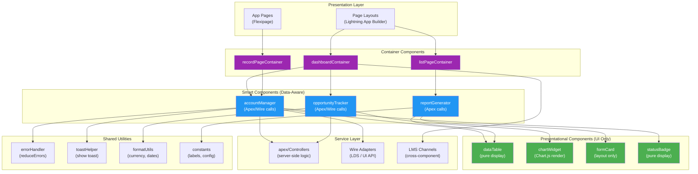
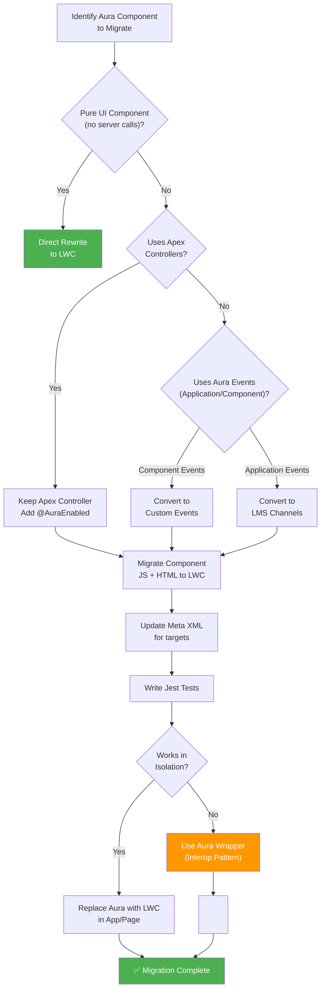

# 🏆 Week 6: Mastery & Interview Preparation

> **Goal:** Consolidate everything from Weeks 1–5, master architecture patterns, learn migration strategies, accessibility, and internationalization — then prepare intensively for interviews with mock questions and capstone projects.

---

## Table of Contents

1. [Architecture Patterns for Large LWC Applications](#1-architecture-patterns-for-large-lwc-applications)
2. [Real-World Project Structure](#2-real-world-project-structure)
3. [Common Mistakes and Anti-Patterns](#3-common-mistakes-and-anti-patterns)
4. [Aura to LWC Migration](#4-aura-to-lwc-migration)
5. [Accessibility (a11y)](#5-accessibility-a11y)
6. [Internationalization (i18n)](#6-internationalization-i18n)
7. [Complete 6-Week Revision Summary](#7-complete-6-week-revision-summary)
8. [Interview Preparation Strategy](#8-interview-preparation-strategy)
9. [30 Rapid-Fire Revision Questions](#9-30-rapid-fire-revision-questions)
10. [Full Mock Interview Simulation](#10-full-mock-interview-simulation)
11. [Capstone Project Ideas](#11-capstone-project-ideas)

---

## 1. Architecture Patterns for Large LWC Applications

When building enterprise-grade Salesforce applications with LWC, architecture matters. A well-architected app separates concerns, communicates predictably, and scales without painful refactors. Below is a reference architecture for a large LWC application.

### 🏗️ Enterprise LWC Architecture



### Architecture Principles

| Principle | Description | Implementation |
|-----------|-------------|----------------|
| **Container / Presentational** | Separate data-fetching from rendering | Smart components hold state; dumb components receive via `@api` |
| **Single Responsibility** | Each component does one thing well | `statusBadge` only renders a badge; `accountManager` only manages account data |
| **Shared Services** | Reusable utility modules | `errorHandler.js`, `toastHelper.js` imported across components |
| **Event-Driven Communication** | Decouple components via events | Parent-child: Custom Events; Sibling/Unrelated: LMS |
| **Centralized State** | Avoid scattered data fetching | One "manager" component owns the data; children receive via `@api` |

### Smart vs Presentational Components

```javascript
// ── SMART Component: Knows about Apex, handles state ──
// accountManager.js
import { LightningElement, wire } from 'lwc';
import getAccounts from '@salesforce/apex/AccountController.getAccounts';
import { reduceErrors } from 'c/errorHandler';

export default class AccountManager extends LightningElement {
    accounts = [];
    error;

    @wire(getAccounts)
    wiredAccounts({ data, error }) {
        if (data) this.accounts = data;
        if (error) this.error = reduceErrors(error);
    }
}
```

```html
<!-- accountManager.html — delegates rendering to child -->
<template>
    <c-data-table
        records={accounts}
        columns={tableColumns}
        onrowselect={handleRowSelect}>
    </c-data-table>
</template>
```

```javascript
// ── PRESENTATIONAL Component: Receives data, renders, fires events ──
// dataTable.js
import { LightningElement, api } from 'lwc';

export default class DataTable extends LightningElement {
    @api records = [];
    @api columns = [];

    handleRowClick(event) {
        // Fires event up to the parent — doesn't know WHERE the data came from
        this.dispatchEvent(new CustomEvent('rowselect', {
            detail: { recordId: event.currentTarget.dataset.id }
        }));
    }
}
```

---

## 2. Real-World Project Structure

```
force-app/
├── main/
│   └── default/
│       ├── lwc/
│       │   ├── app/                          # App shell / container components
│       │   │   ├── dashboardApp/
│       │   │   └── recordApp/
│       │   ├── features/                     # Feature-specific smart components
│       │   │   ├── accountManager/
│       │   │   ├── contactManager/
│       │   │   └── opportunityTracker/
│       │   ├── shared/                       # Reusable presentational components
│       │   │   ├── dataTable/
│       │   │   ├── modal/
│       │   │   ├── searchBar/
│       │   │   ├── statusBadge/
│       │   │   └── emptyState/
│       │   └── utils/                        # Utility modules (no template)
│       │       ├── errorHandler/
│       │       ├── toastHelper/
│       │       ├── formatUtils/
│       │       └── constants/
│       ├── classes/                           # Apex controllers
│       │   ├── AccountController.cls
│       │   ├── ContactController.cls
│       │   └── UtilityController.cls
│       ├── messageChannels/                   # LMS channels
│       │   └── Record_Selected.messageChannel-meta.xml
│       └── staticresources/                   # Third-party libraries
│           └── chartjs/
├── scripts/                                   # Utility scripts
│   └── apex/
│       └── seed-data.apex
└── config/                                    # Scratch org definition
    └── project-scratch-def.json
```

> [!TIP]
> Organize components by **feature or concern**, not by file type. Group a feature's smart component, its children, and related tests together. Keep shared/reusable components separate in a `shared/` directory.

---

## 3. Common Mistakes and Anti-Patterns

### Anti-Pattern Table

| # | ❌ Anti-Pattern | ✅ Correct Approach | Why? |
|---|----------------|---------------------|------|
| 1 | Mutating wire results directly | Clone with spread: `[...data]` | Wire results are frozen; mutation throws errors |
| 2 | Calling Apex in `connectedCallback` for cacheable data | Use `@wire` with `cacheable=true` | Wire leverages the LDS cache automatically |
| 3 | Using `querySelector` across component boundaries | Use `@api` properties and events | Shadow DOM prevents cross-component DOM access |
| 4 | Storing record IDs as plain strings | Import schema references: `@salesforce/schema/` | Schema imports enable compile-time validation and dependency tracking |
| 5 | Giant monolithic components (500+ lines) | Split into smart + presentational components | Easier to test, maintain, reuse |
| 6 | Using `setTimeout` instead of proper lifecycle hooks | Use `renderedCallback`, `connectedCallback` | Lifecycle hooks are deterministic; timeouts are unreliable |
| 7 | Not cleaning up subscriptions | Always `unsubscribe` in `disconnectedCallback` | Memory leaks and phantom event handlers |
| 8 | Using `track` decorator on everything | Only use `@track` for deeply nested object reactivity | Primitive properties are reactive by default since API 55+ |
| 9 | Hardcoding labels and messages | Use Custom Labels: `@salesforce/label/` | Labels enable i18n and admin-manageable text |
| 10 | Forgetting error handling on Apex calls | Always wrap in try/catch with user-friendly toast | Unhandled errors crash the component silently |

### Code Examples

```javascript
// ❌ ANTI-PATTERN: Mutating wire results
@wire(getAccounts)
wiredAccounts({ data }) {
    if (data) {
        data[0].Name = 'Modified'; // 💥 TypeError: Cannot assign to read only property
    }
}

// ✅ CORRECT: Clone first
@wire(getAccounts)
wiredAccounts({ data }) {
    if (data) {
        this.accounts = data.map(acc => ({ ...acc, Name: acc.Name.toUpperCase() }));
    }
}
```

```javascript
// ❌ ANTI-PATTERN: Reaching into child component's DOM
handleClick() {
    const childInput = this.template.querySelector('c-child-component')
        .shadowRoot.querySelector('lightning-input'); // 💥 Won't work — shadow DOM!
}

// ✅ CORRECT: Use @api methods on the child
// In child: @api validate() { return this.template.querySelector('lightning-input').checkValidity(); }
// In parent: this.template.querySelector('c-child-component').validate();
```

```javascript
// ❌ ANTI-PATTERN: Not cleaning up LMS subscription
connectedCallback() {
    this.subscription = subscribe(this.messageContext, CHANNEL, handler);
    // Missing disconnectedCallback cleanup!
}

// ✅ CORRECT: Always unsubscribe
disconnectedCallback() {
    unsubscribe(this.subscription);
    this.subscription = null;
}
```

---

## 4. Aura to LWC Migration

### Migration Strategy Flowchart



### Aura ↔ LWC Concept Mapping

| Aura Concept | LWC Equivalent | Notes |
|-------------|----------------|-------|
| `<aura:attribute>` | `@api` property | LWC uses decorators instead of markup |
| `<aura:handler>` | Template event binding (`onclick`) | LWC uses standard DOM events |
| `component.get('v.myAttr')` | `this.myProp` | Direct property access — no get/set wrappers |
| `component.set('v.myAttr', val)` | `this.myProp = val` | Assignment triggers reactivity |
| `$A.createComponent()` | `lwc:component` + dynamic `import()` | Constructor-based, not string-based |
| `Component Event` | `CustomEvent` | `this.dispatchEvent(new CustomEvent(...))` |
| `Application Event` | Lightning Message Service (LMS) | Publish/subscribe across DOM boundaries |
| `<aura:if>` | `template if:true` / `lwc:if` | Same concept, different syntax |
| `<aura:iteration>` | `template for:each` / `for:item` | Similar iteration pattern |
| `{!v.myAttr}` | `{myProp}` | No `!` or `v.` prefix needed |
| `helper.js` | Methods inside the class | No separate helper file |
| `controller.js` + `helper.js` | Single `.js` file | One class, one file |
| `init` handler | `connectedCallback()` | Standard lifecycle hook |
| `renderer` | `renderedCallback()` | Called after every render |
| `$A.enqueueAction()` | `await apexMethod()` | Async/await with imported Apex |

### Step-by-Step Migration

#### Step 1: Map the Aura Component

```html
<!-- OLD: Aura Component (accountCard.cmp) -->
<aura:component controller="AccountController" implements="flexipage:availableForAllPageTypes">
    <aura:attribute name="recordId" type="String" />
    <aura:attribute name="account" type="Object" />
    <aura:handler name="init" value="{!this}" action="{!c.doInit}" />
    
    <lightning:card title="{!v.account.Name}">
        <p>{!v.account.Industry}</p>
        <lightning:button label="View" onclick="{!c.handleView}" />
    </lightning:card>
</aura:component>
```

```javascript
// OLD: Aura Controller (accountCardController.js)
({
    doInit: function(component, event, helper) {
        var action = component.get("c.getAccount");
        action.setParams({ accountId: component.get("v.recordId") });
        action.setCallback(this, function(response) {
            if (response.getState() === "SUCCESS") {
                component.set("v.account", response.getReturnValue());
            }
        });
        $A.enqueueAction(action);
    },
    handleView: function(component, event, helper) {
        var navEvt = $A.get("e.force:navigateToSObject");
        navEvt.setParams({ "recordId": component.get("v.recordId") });
        navEvt.fire();
    }
})
```

#### Step 2: Rewrite as LWC

```javascript
// NEW: LWC Component (accountCard.js)
import { LightningElement, api, wire } from 'lwc';
import { NavigationMixin } from 'lightning/navigation';
import { getRecord, getFieldValue } from 'lightning/uiRecordApi';
import NAME_FIELD from '@salesforce/schema/Account.Name';
import INDUSTRY_FIELD from '@salesforce/schema/Account.Industry';

export default class AccountCard extends NavigationMixin(LightningElement) {
    @api recordId;

    @wire(getRecord, { recordId: '$recordId', fields: [NAME_FIELD, INDUSTRY_FIELD] })
    account;

    get accountName() {
        return getFieldValue(this.account.data, NAME_FIELD);
    }

    get accountIndustry() {
        return getFieldValue(this.account.data, INDUSTRY_FIELD);
    }

    handleView() {
        this[NavigationMixin.Navigate]({
            type: 'standard__recordPage',
            attributes: {
                recordId: this.recordId,
                actionName: 'view'
            }
        });
    }
}
```

```html
<!-- NEW: LWC Template (accountCard.html) -->
<template>
    <lightning-card title={accountName}>
        <template if:true={account.data}>
            <p class="slds-p-horizontal_small">{accountIndustry}</p>
            <lightning-button label="View" onclick={handleView}></lightning-button>
        </template>
    </lightning-card>
</template>
```

```xml
<!-- NEW: Meta XML (accountCard.js-meta.xml) -->
<?xml version="1.0" encoding="UTF-8"?>
<LightningComponentBundle xmlns="http://soap.sforce.com/2006/04/metadata">
    <apiVersion>59.0</apiVersion>
    <isExposed>true</isExposed>
    <targets>
        <target>lightning__RecordPage</target>
        <target>lightning__AppPage</target>
        <target>lightning__HomePage</target>
    </targets>
</LightningComponentBundle>
```

> [!IMPORTANT]
> **Interop Pattern:** If your Aura app has components you can't migrate yet, you can embed LWC inside Aura. The reverse (Aura inside LWC) is **not supported**. Plan your migration bottom-up: migrate leaf/child components first, then containers.

---

## 5. Accessibility (a11y)

Accessibility ensures your components work for **all users**, including those using screen readers, keyboard navigation, or assistive technologies. Salesforce requires components on AppExchange to meet WCAG 2.1 AA standards.

### ARIA Attributes

```html
<!-- accessibleComponent.html -->
<template>
    <!-- Landmark role for screen readers -->
    <section role="region" aria-label="Account Summary">
        
        <!-- Accessible heading hierarchy -->
        <h2 id="summary-heading">Account Summary</h2>
        
        <!-- Live region for dynamic updates -->
        <div role="status" aria-live="polite" aria-atomic="true">
            {statusMessage}
        </div>
        
        <!-- Accessible table -->
        <table role="grid" aria-labelledby="summary-heading">
            <thead>
                <tr>
                    <th scope="col">Name</th>
                    <th scope="col">Industry</th>
                    <th scope="col" aria-sort={nameSortDirection}>Revenue</th>
                </tr>
            </thead>
            <tbody>
                <template for:each={accounts} for:item="acc">
                    <tr key={acc.Id} role="row">
                        <td role="gridcell">{acc.Name}</td>
                        <td role="gridcell">{acc.Industry}</td>
                        <td role="gridcell">{acc.Revenue}</td>
                    </tr>
                </template>
            </tbody>
        </table>
        
        <!-- Accessible button with icon -->
        <lightning-button-icon
            icon-name="utility:delete"
            alternative-text="Delete this account"
            title="Delete"
            onclick={handleDelete}>
        </lightning-button-icon>
        
        <!-- Custom combobox with ARIA -->
        <div role="combobox" aria-expanded={isDropdownOpen} aria-haspopup="listbox">
            <input
                type="text"
                role="searchbox"
                aria-autocomplete="list"
                aria-controls="dropdown-list"
                aria-activedescendant={activeOptionId}
                placeholder="Search accounts..."
                onkeydown={handleKeydown}
                oninput={handleInput}
            />
            <ul id="dropdown-list" role="listbox" aria-label="Search results">
                <template for:each={filteredOptions} for:item="opt">
                    <li key={opt.id}
                        role="option"
                        id={opt.id}
                        aria-selected={opt.isSelected}
                        onclick={handleOptionClick}>
                        {opt.label}
                    </li>
                </template>
            </ul>
        </div>
    </section>
</template>
```

### Keyboard Navigation

```javascript
// keyboardNav.js
import { LightningElement } from 'lwc';

export default class KeyboardNav extends LightningElement {
    activeIndex = 0;
    items = ['Item 1', 'Item 2', 'Item 3', 'Item 4'];

    handleKeydown(event) {
        switch (event.key) {
            case 'ArrowDown':
                event.preventDefault();
                this.activeIndex = Math.min(this.activeIndex + 1, this.items.length - 1);
                this.focusItem(this.activeIndex);
                break;
            case 'ArrowUp':
                event.preventDefault();
                this.activeIndex = Math.max(this.activeIndex - 1, 0);
                this.focusItem(this.activeIndex);
                break;
            case 'Enter':
            case ' ':
                event.preventDefault();
                this.selectItem(this.activeIndex);
                break;
            case 'Escape':
                this.closeDropdown();
                break;
            case 'Home':
                event.preventDefault();
                this.activeIndex = 0;
                this.focusItem(0);
                break;
            case 'End':
                event.preventDefault();
                this.activeIndex = this.items.length - 1;
                this.focusItem(this.activeIndex);
                break;
        }
    }

    focusItem(index) {
        const items = this.template.querySelectorAll('[role="option"]');
        if (items[index]) {
            items[index].focus();
        }
    }

    selectItem(index) {
        this.dispatchEvent(new CustomEvent('select', {
            detail: { value: this.items[index] }
        }));
    }
}
```

### Focus Management

```javascript
// modalWithFocus.js
import { LightningElement, api } from 'lwc';

export default class ModalWithFocus extends LightningElement {
    _previouslyFocused;

    @api
    open() {
        // Remember what was focused before the modal opened
        this._previouslyFocused = document.activeElement;
        this.isOpen = true;

        // Move focus to the first focusable element in the modal
        // Use requestAnimationFrame to ensure the DOM has rendered
        requestAnimationFrame(() => {
            const firstInput = this.template.querySelector('lightning-input, lightning-button, [tabindex="0"]');
            if (firstInput) firstInput.focus();
        });
    }

    @api
    close() {
        this.isOpen = false;
        // Restore focus to the element that opened the modal
        if (this._previouslyFocused) {
            this._previouslyFocused.focus();
        }
    }

    // Trap focus inside the modal (prevent tabbing out)
    handleKeydown(event) {
        if (event.key === 'Tab') {
            const focusableElements = this.template.querySelectorAll(
                'lightning-input, lightning-button, lightning-combobox, [tabindex="0"], a[href]'
            );
            const first = focusableElements[0];
            const last = focusableElements[focusableElements.length - 1];

            if (event.shiftKey && document.activeElement === first) {
                event.preventDefault();
                last.focus();
            } else if (!event.shiftKey && document.activeElement === last) {
                event.preventDefault();
                first.focus();
            }
        }

        if (event.key === 'Escape') {
            this.close();
        }
    }
}
```

### Accessibility Checklist

| Category | Requirement | How |
|----------|-------------|-----|
| **Text alternatives** | Images have alt text | `alternative-text` on `lightning-icon`, `alt` on `` |
| **Keyboard access** | All interactive elements reachable via Tab | Use native elements or `tabindex="0"` |
| **Focus management** | Modals trap focus; restored on close | Track previous focus, use `requestAnimationFrame` |
| **Color contrast** | 4.5:1 for normal text, 3:1 for large text | Use SLDS tokens; test with DevTools contrast checker |
| **Live regions** | Dynamic updates announced by screen readers | `aria-live="polite"` on status containers |
| **Labels** | Every input has a label | `label` attribute on `lightning-input` |
| **Headings** | Logical heading hierarchy | `h1` → `h2` → `h3` (no skipping levels) |

---

## 6. Internationalization (i18n)

### Using Custom Labels

```javascript
// i18nComponent.js
import { LightningElement } from 'lwc';
import greeting from '@salesforce/label/c.Greeting_Message';
import saveButton from '@salesforce/label/c.Save_Button';
import cancelButton from '@salesforce/label/c.Cancel_Button';
import recordsFound from '@salesforce/label/c.Records_Found';

export default class I18nComponent extends LightningElement {
    labels = {
        greeting,
        saveButton,
        cancelButton,
        recordsFound
    };

    recordCount = 42;

    get recordsFoundMessage() {
        // Custom Labels support merge fields: "{0} records found"
        return this.labels.recordsFound.replace('{0}', this.recordCount);
    }
}
```

```html
<!-- i18nComponent.html -->
<template>
    <lightning-card title={labels.greeting}>
        <div class="slds-p-around_medium">
            <p>{recordsFoundMessage}</p>
            <div class="slds-m-top_medium">
                <lightning-button label={labels.saveButton} variant="brand"></lightning-button>
                <lightning-button label={labels.cancelButton} class="slds-m-left_x-small"></lightning-button>
            </div>
        </div>
    </lightning-card>
</template>
```

### Number and Date Formatting

```javascript
// formattingDemo.js
import { LightningElement } from 'lwc';
import LOCALE from '@salesforce/i18n/locale';
import CURRENCY from '@salesforce/i18n/currency';
import TIMEZONE from '@salesforce/i18n/timeZone';

export default class FormattingDemo extends LightningElement {
    rawNumber = 1500000.5;
    rawDate = new Date().toISOString();

    // These respect the user's locale settings
    get formattedCurrency() {
        return new Intl.NumberFormat(LOCALE, {
            style: 'currency',
            currency: CURRENCY
        }).format(this.rawNumber);
    }

    get formattedDate() {
        return new Intl.DateTimeFormat(LOCALE, {
            year: 'numeric',
            month: 'long',
            day: 'numeric',
            timeZone: TIMEZONE
        }).format(new Date(this.rawDate));
    }

    get formattedPercent() {
        return new Intl.NumberFormat(LOCALE, {
            style: 'percent',
            minimumFractionDigits: 1
        }).format(0.856);
    }
}
```

```html
<!-- formattingDemo.html — use base components for automatic formatting -->
<template>
    <div class="slds-p-around_medium">
        <!-- These base components auto-format based on user locale -->
        <lightning-formatted-number value={rawNumber} format-style="currency" currency-code="USD">
        </lightning-formatted-number>

        <lightning-formatted-date-time value={rawDate} year="numeric" month="long" day="numeric">
        </lightning-formatted-date-time>

        <lightning-formatted-number value="0.856" format-style="percent" minimum-fraction-digits="1">
        </lightning-formatted-number>

        <!-- Or use manually formatted values -->
        <p>Manual: {formattedCurrency}</p>
        <p>Manual: {formattedDate}</p>
    </div>
</template>
```

> [!TIP]
> Always prefer **base `lightning-formatted-*` components** over manual `Intl` formatting. Base components automatically handle the user's locale, timezone, and currency settings from their Salesforce profile.

---

## 7. Complete 6-Week Revision Summary

### Week 1: Foundations

| Topic | Key Points |
|-------|------------|
| **Web Components Standard** | Custom Elements, Shadow DOM, HTML Templates, ES Modules |
| **LWC Architecture** | Extends Web Components standard; compiled to optimized output |
| **Component Structure** | `.html` (template), `.js` (logic), `.css` (styles), `.js-meta.xml` (config) |
| **Decorators** | `@api` (public), `@track` (deep reactivity), `@wire` (data binding) |
| **Lifecycle Hooks** | `constructor` → `connectedCallback` → `renderedCallback` → `disconnectedCallback` |
| **Template Syntax** | `{property}`, `if:true/false`, `lwc:if/elseif/else`, `for:each`, `for:item` |

### Week 2: Component Interaction

| Topic | Key Points |
|-------|------------|
| **Parent → Child** | `@api` properties; parent sets attributes in template |
| **Child → Parent** | `CustomEvent` + `dispatchEvent`; parent handles with `on<eventname>` |
| **Sibling / Unrelated** | Lightning Message Service (LMS) pub/sub |
| **Slots** | Default and named slots for content projection |
| **CSS Styling** | Scoped by shadow DOM; `:host`, CSS custom properties for theming |

### Week 3: Data & Server Integration

| Topic | Key Points |
|-------|------------|
| **LDS** | Shared cache, no Apex needed for basic CRUD, auto FLS/CRUD |
| **Wire Service** | Reactive; `$param` re-triggers; results are read-only |
| **Wire Adapters** | `getRecord`, `createRecord`, `updateRecord`, `deleteRecord` |
| **Imperative Apex** | `async/await`; `cacheable=true` for wire; `refreshApex` for re-fetch |
| **Form Components** | `record-form` (quick), `record-edit-form` (full control), `record-view-form` (read) |
| **Pagination** | Offset (LIMIT/OFFSET) for small sets; Cursor (WHERE Id > :last) for large |

### Week 4: Advanced Features

| Topic | Key Points |
|-------|------------|
| **NavigationMixin** | Page references; `Navigate()` to go; `GenerateUrl()` for links |
| **LMS** | `.messageChannel-meta.xml`; `publish`/`subscribe`; cross-framework |
| **Platform Events** | `lightning/empApi`; replay `-1` (new) / `-2` (24h); `onError` listener |
| **Dynamic Components** | `lwc:component` + `lwc:is`; accepts constructor from `import()` |
| **Performance** | Debounce, conditional render, avoid getter side effects, efficient keys |
| **Experience Cloud** | No toast; community targets; guest user context |
| **Screen Flows** | `FlowAttributeChangeEvent`; `role` metadata (`inputOnly`/`outputOnly`) |

### Week 5: Testing & Deployment

| Topic | Key Points |
|-------|------------|
| **Jest Testing** | `@salesforce/sfdx-lwc-jest`; `createElement`; `shadowRoot.querySelector` |
| **Mocking** | `.emit()` for wire; `mockResolvedValue` for imperative; `virtual: true` |
| **Debugging** | Chrome DevTools (shadow DOM), `debugger` statement, `sf apex tail log` |
| **Deployment** | `sf project deploy start`; test levels; `package.xml` manifest |
| **Packages** | 1GP (org-based, legacy) vs 2GP (source-based, modern) |
| **CI/CD** | GitHub Actions: test → validate → deploy pipeline |
| **Security** | LWS (modern, fast) vs Locker (legacy, wrapped); CSP blocks `eval()` |

### Week 6: Mastery

| Topic | Key Points |
|-------|------------|
| **Architecture** | Container/Presentational split; service layer; shared utilities |
| **Anti-patterns** | Don't mutate wire data; don't reach into child DOM; clean up subscriptions |
| **Migration** | Aura → LWC: bottom-up; interop via embedding LWC in Aura wrapper |
| **Accessibility** | ARIA, keyboard nav, focus trapping, color contrast, live regions |
| **i18n** | Custom Labels; `@salesforce/i18n/locale`; `lightning-formatted-*` components |

---

## 8. Interview Preparation Strategy

### 2-Week Interview Prep Timeline

| Day | Focus Area | Activity |
|-----|-----------|----------|
| **Day 1–2** | Fundamentals Review | Re-read Weeks 1-2; practice explaining lifecycle hooks, decorators |
| **Day 3–4** | Data Patterns | Re-read Week 3; build a CRUD app from memory |
| **Day 5–6** | Advanced Features | Re-read Week 4; explain LMS and Navigation from memory |
| **Day 7** | Testing & Security | Re-read Week 5; write a Jest test without looking at notes |
| **Day 8–9** | Architecture | Whiteboard a large LWC app architecture; explain design decisions |
| **Day 10** | Mock Interview #1 | Have a friend ask you 10 random questions from this guide |
| **Day 11** | Coding Challenges | Build 2 components from scratch within time limits |
| **Day 12** | Mock Interview #2 | Full mock with behavioral + technical + coding |
| **Day 13** | Weak Areas | Focus on whatever you struggled with in mocks |
| **Day 14** | Light Review | Skim summary tables; get good rest |

### Interview Answer Framework: STAR for Technical

| Step | Description | Example |
|------|-------------|---------|
| **S**ituation | What was the context? | "In my last project, we had 50+ Aura components..." |
| **T**ask | What needed to be done? | "I led the migration of the most critical 15 components to LWC..." |
| **A**ction | What did you do (technically)? | "I created a migration playbook, converted Application Events to LMS..." |
| **R**esult | What was the outcome? | "We reduced page load time by 40% and improved test coverage to 85%." |

---

## 9. 30 Rapid-Fire Revision Questions

### Questions & Short Answers

| # | Question | Answer |
|---|----------|--------|
| 1 | What are the four files in an LWC component? | `.html`, `.js`, `.css`, `.js-meta.xml` |
| 2 | What does `@api` do? | Makes a property public (accessible by parent) |
| 3 | What does `@wire` do? | Reactively provisions data from a wire adapter |
| 4 | Name three lifecycle hooks. | `connectedCallback`, `renderedCallback`, `disconnectedCallback` |
| 5 | How do you pass data from child to parent? | `CustomEvent` + `dispatchEvent` |
| 6 | What is LDS? | Lightning Data Service — client-side data cache layer |
| 7 | What does `cacheable=true` enable? | Wire support + client-side caching (no DML) |
| 8 | How do you refresh wired data? | `refreshApex(wiredResultObject)` |
| 9 | What is LMS? | Lightning Message Service — cross-component pub/sub |
| 10 | What scope receives messages from all pages? | `APPLICATION_SCOPE` |
| 11 | How do you navigate in LWC? | `NavigationMixin` with page references |
| 12 | What is `lwc:dom="manual"` for? | Allows direct DOM manipulation (e.g., Chart.js canvas) |
| 13 | How do you load a third-party library? | `loadScript` from `lightning/platformResourceLoader` |
| 14 | What testing framework does LWC use? | Jest (via `@salesforce/sfdx-lwc-jest`) |
| 15 | How do you mock a wire adapter in tests? | `.emit(data)` or `.error(err)` on the imported adapter |
| 16 | What is the minimum Apex coverage for deployment? | 75% overall |
| 17 | What is 2GP? | Second-Generation Packaging — source-driven, CLI-managed |
| 18 | What replaced Locker Service? | Lightning Web Security (LWS) |
| 19 | Can you use `eval()` in LWC? | No — blocked by CSP |
| 20 | How do you create a custom label reference? | `import label from '@salesforce/label/c.MyLabel'` |
| 21 | What is a presentational component? | A component that only renders UI — no data fetching |
| 22 | How do you embed LWC in a Flow? | Target `lightning__FlowScreen` in meta XML |
| 23 | Does `ShowToastEvent` work in Experience Cloud? | No — build a custom toast |
| 24 | What does `$` prefix mean in wire params? | Reactive — wire re-fires when the property changes |
| 25 | Name two form components. | `lightning-record-form`, `lightning-record-edit-form` |
| 26 | How do you debounce input? | `clearTimeout` + `setTimeout` pattern |
| 27 | What is `getFieldDisplayValue`? | Returns the formatted/localized value of a field |
| 28 | Can you embed Aura inside LWC? | No — only LWC inside Aura |
| 29 | What is `FlowAttributeChangeEvent`? | Notifies the Flow engine of output property changes |
| 30 | What does `aria-live="polite"` do? | Screen reader announces changes when idle |

---

## 10. Full Mock Interview Simulation

### Part A: Behavioral Questions (5)

#### Q1: "Tell me about a complex LWC project you worked on."

<details><summary>📝 Model Answer</summary>

"In my last role, I built an enterprise lead management dashboard using LWC. The system had 12 interconnected components across 3 Lightning app pages. The main challenge was real-time communication between components — for example, selecting a lead in a list needed to update a detail panel, a related activities timeline, and a score chart simultaneously.

I implemented Lightning Message Service with a `Lead_Selected` channel, which decoupled the components and made them independently testable. For the chart, I integrated Chart.js via static resources with `lwc:dom='manual'`. I also built a custom pagination system using cursor-based pagination for the 100K+ lead records.

The result was a 60% reduction in page load time compared to the previous Visualforce solution, and the component-based architecture made it easy for other developers to extend."
</details>

#### Q2: "Describe a time you had to debug a difficult issue in LWC."

<details><summary>📝 Model Answer</summary>

"We had a component that randomly lost data after saving. It worked fine in most tests but failed intermittently in production. Using Chrome DevTools Network tab, I discovered that our `refreshApex` call was racing with the UI API auto-refresh. The wire adapter was receiving stale data before the server had committed the DML operation.

The root cause was that we were calling `refreshApex` immediately after `updateRecord` without awaiting the update. I fixed it by properly chaining the promises: `await updateRecord({fields}); await refreshApex(this._wiredResult);`. I also added error handling that had been missing. We then wrote a Jest test specifically to verify the refresh sequence, which prevented the issue from recurring."
</details>

#### Q3: "How do you handle disagreements about technical approaches?"

<details><summary>📝 Model Answer</summary>

"In a recent project, a colleague wanted to use Application Events in Aura for cross-component communication, while I advocated for migrating to LMS in LWC. Instead of insisting, I proposed a spike: I built a small proof-of-concept with LMS that demonstrated both approaches side by side. The LMS version had 40% less code, was framework-agnostic (worked with the remaining Aura components too), and was significantly easier to test with Jest. After seeing the concrete comparison, the team agreed on LMS, and we documented the decision in our architecture decision record (ADR)."
</details>

#### Q4: "How do you stay current with Salesforce platform updates?"

<details><summary>📝 Model Answer</summary>

"I follow a multi-channel approach: I subscribe to the Salesforce Release Notes for each seasonal release, follow the LWC GitHub repository for new features and proposals, participate in the Salesforce Developer community (Trailblazer groups), and regularly complete relevant Trailhead modules. I also maintain a personal sandbox where I prototype new features as soon as they hit preview — for example, I experimented with `lwc:if/elseif/else` as soon as it was announced and documented migration patterns for my team."
</details>

#### Q5: "Describe your approach to component reusability."

<details><summary>📝 Model Answer</summary>

"I follow the smart/presentational component pattern. Presentational components are pure UI — they receive data via `@api` and emit events. They know nothing about Apex or wire adapters. This makes them reusable across different contexts.

For example, I built a generic `dataTable` component that accepts `records`, `columns`, and fires `rowselect` events. It's used in our account management page, contact list, and opportunity pipeline — three completely different features — with zero code duplication. The smart components that wrap it handle the data fetching and business logic specific to each feature.

I also extract common utilities into service modules — error handlers, formatting functions, label constants — and share them across the project."
</details>

---

### Part B: Technical Questions (10)

#### Q1: "Explain the LWC component lifecycle in order."

<details><summary>📝 Model Answer</summary>

1. **`constructor()`** — Component instance created. Don't access DOM or public properties here. Call `super()` first.
2. **`connectedCallback()`** — Component inserted into the DOM. Safe to access `this.template` but not guaranteed to have rendered children. Good for initializations, event subscriptions.
3. **`render()`** — (Optional) Returns which HTML template to use. Rarely overridden.
4. **`renderedCallback()`** — Called after every render cycle (initial and re-renders). Use for post-render DOM operations. Use a guard flag to prevent infinite loops.
5. **`disconnectedCallback()`** — Component removed from DOM. Clean up event listeners, timers, LMS subscriptions.
6. **`errorCallback(error, stack)`** — Catches errors from child components. Works like a JS error boundary.
</details>

#### Q2: "What's the difference between `@api`, `@track`, and `@wire`?"

<details><summary>📝 Model Answer</summary>

- **`@api`**: Makes a property **public**. Parent components can set it. Changes trigger re-rendering. Also used for public methods.
- **`@track`**: Makes an object/array property **deeply reactive**. As of API 55+, primitive properties are reactive by default, so `@track` is only needed for detecting changes to nested object properties (e.g., `this.obj.nested.value = 'x'`).
- **`@wire`**: **Binds a property or function to a data source** (wire adapter or Apex method). When reactive parameters change (`$param`), the wire re-provisions data automatically.
</details>

#### Q3: "How does Shadow DOM work in LWC and why does it matter?"

<details><summary>📝 Model Answer</summary>

LWC uses Shadow DOM to create an **encapsulation boundary** around each component. This means:
1. **CSS isolation** — Styles defined in a component don't leak out, and external styles don't bleed in.
2. **DOM isolation** — `querySelector` from outside the component can't reach into its shadow root.
3. **Event retargeting** — Custom events with `composed: false` stop at the shadow boundary.

This matters because it makes components truly modular — you can drop them into any page without worrying about CSS conflicts or accidental DOM manipulation from other components.
</details>

#### Q4: "Explain the difference between Lightning Data Service and Apex for data access."

<details><summary>📝 Model Answer</summary>

| Aspect | LDS | Apex |
|--------|-----|------|
| **Server code** | None needed | Requires @AuraEnabled class |
| **Security** | Auto FLS/CRUD | Manual (WITH SECURITY_ENFORCED or check) |
| **Caching** | Shared across components | Per-wire with cacheable=true |
| **Use case** | Single record CRUD, simple reads | Complex queries, bulk operations, custom logic |
| **DML** | `createRecord`, `updateRecord`, `deleteRecord` | Full DML in Apex |
| **Performance** | Better (shared cache, no Apex overhead) | More server roundtrips |

Use LDS when working with single records and standard CRUD. Use Apex for complex queries, business logic, bulk operations, or when you need aggregate queries.
</details>

#### Q5: "How would you implement communication between two components that have no parent-child relationship?"

<details><summary>📝 Model Answer</summary>

Use **Lightning Message Service (LMS)**:
1. Create a `.messageChannel-meta.xml` defining the channel name and fields.
2. In the publisher: import `publish` and `MessageContext`, call `publish(this.messageContext, CHANNEL, payload)`.
3. In the subscriber: import `subscribe`, `unsubscribe`, and `MessageContext`. Subscribe in `connectedCallback`, unsubscribe in `disconnectedCallback`.

LMS is preferred over other approaches because it works across frameworks (LWC, Aura, Visualforce) and doesn't require DOM proximity. For same-DOM-hierarchy communication, custom events bubbling up to a common ancestor is simpler.
</details>

#### Q6: "What happens when you call `refreshApex()`?"

<details><summary>📝 Model Answer</summary>

`refreshApex()` invalidates the cached data for a specific wired Apex call and forces a fresh server request. You pass it the **entire wired result object** (not just `data`). The wire adapter re-provisions new data, which triggers a re-render. It returns a Promise, so you should `await` it. This is the standard pattern after performing a DML operation to ensure the UI shows the latest data.
</details>

#### Q7: "How would you optimize a component that renders 10,000 items?"

<details><summary>📝 Model Answer</summary>

Several strategies:
1. **Server-side pagination** — Only fetch 50-100 records at a time (cursor-based for large datasets).
2. **Infinite scroll** — Load more records as the user scrolls down, appending to the existing array.
3. **Virtual scrolling** — Only render the DOM elements visible in the viewport (~30-50 items), and recycle DOM nodes as the user scrolls.
4. **Search/filter first** — Reduce the dataset before rendering by adding a search/filter before the query.
5. **`lightning-datatable`** — It has built-in virtualization for large datasets.
6. **Debounce** — If filtering client-side, debounce the filter input to avoid recalculating on every keystroke.
</details>

#### Q8: "Explain how you would test a component that uses `@wire(getRecord)` in Jest."

<details><summary>📝 Model Answer</summary>

1. Import `getRecord` from `'lightning/uiRecordApi'` — sfdx-lwc-jest auto-mocks it.
2. Create the component with `createElement` and append to `document.body`.
3. Call `getRecord.emit(mockData)` to simulate a successful wire response.
4. `await Promise.resolve()` to flush the microtask queue.
5. Query the shadow DOM to verify the rendered output.
6. For error cases, call `getRecord.error(mockError)` and verify error state rendering.
7. Always clean up DOM in `afterEach`.
</details>

#### Q9: "What is Lightning Web Security and how does it differ from Locker Service?"

<details><summary>📝 Model Answer</summary>

LWS is the modern security model that uses **browser-native sandboxing** (virtualized JavaScript environments) instead of Locker's heavy proxy wrappers. Key differences:
- **Performance**: LWS is near-native speed; Locker added significant overhead.
- **Third-party compatibility**: LWS works with more libraries since it doesn't wrap every object.
- **Isolation**: Both prevent cross-namespace DOM access, but LWS does it more elegantly.
- **Status**: LWS is the default for API 59.0+; Locker is deprecated.
</details>

#### Q10: "How would you approach migrating an Aura application to LWC?"

<details><summary>📝 Model Answer</summary>

I'd use a **bottom-up migration strategy**:
1. **Inventory** — Catalog all Aura components, their dependencies, and communication patterns.
2. **Prioritize** — Start with leaf components (no children), then move to parents.
3. **Migrate** — Rewrite each component: `aura:attribute` → `@api`, Component Events → Custom Events, Application Events → LMS, `$A.enqueueAction` → `@wire` or `import apex`.
4. **Interop** — Wrap LWC in an Aura wrapper where needed (LWC inside Aura works; reverse doesn't).
5. **Test** — Write Jest tests for every migrated LWC component.
6. **Deploy incrementally** — Replace Aura components one at a time; validate with each deployment.
</details>

---

### Part C: Coding Questions (5)

#### Coding Q1: "Build a search bar with debounced Apex search."

<details><summary>📝 Model Answer</summary>

```javascript
// searchBar.js
import { LightningElement } from 'lwc';
import searchAccounts from '@salesforce/apex/AccountController.searchAccounts';

export default class SearchBar extends LightningElement {
    results = [];
    isLoading = false;
    _timer;

    handleInput(event) {
        clearTimeout(this._timer);
        const searchTerm = event.target.value;
        
        this._timer = setTimeout(async () => {
            if (searchTerm.length < 2) {
                this.results = [];
                return;
            }
            this.isLoading = true;
            try {
                this.results = await searchAccounts({ searchTerm });
            } catch (e) {
                this.results = [];
            } finally {
                this.isLoading = false;
            }
        }, 300);
    }
}
```

```html
<!-- searchBar.html -->
<template>
    <lightning-input label="Search Accounts" oninput={handleInput}></lightning-input>
    <template if:true={isLoading}>
        <lightning-spinner alternative-text="Searching" size="small"></lightning-spinner>
    </template>
    <template for:each={results} for:item="acc">
        <p key={acc.Id}>{acc.Name} — {acc.Industry}</p>
    </template>
</template>
```
</details>

#### Coding Q2: "Create a parent-child component pair where the child fires an event and the parent handles it."

<details><summary>📝 Model Answer</summary>

```javascript
// childTile.js
import { LightningElement, api } from 'lwc';

export default class ChildTile extends LightningElement {
    @api record;

    handleSelect() {
        this.dispatchEvent(new CustomEvent('select', {
            detail: { recordId: this.record.Id, recordName: this.record.Name }
        }));
    }
}
```

```html
<!-- childTile.html -->
<template>
    <div class="slds-box" onclick={handleSelect}>
        <p><strong>{record.Name}</strong></p>
    </div>
</template>
```

```javascript
// parentList.js
import { LightningElement } from 'lwc';

export default class ParentList extends LightningElement {
    records = [
        { Id: '001', Name: 'Acme' },
        { Id: '002', Name: 'Global' }
    ];
    selectedName = '';

    handleRecordSelect(event) {
        this.selectedName = event.detail.recordName;
    }
}
```

```html
<!-- parentList.html -->
<template>
    <p>Selected: {selectedName}</p>
    <template for:each={records} for:item="rec">
        <c-child-tile key={rec.Id} record={rec} onselect={handleRecordSelect}></c-child-tile>
    </template>
</template>
```
</details>

#### Coding Q3: "Write a Jest test for a component that calls `NavigationMixin.Navigate`."

<details><summary>📝 Model Answer</summary>

```javascript
// __tests__/navButton.test.js
import { createElement } from 'lwc';
import NavButton from 'c/navButton';
import { getNavigateCalledWith } from 'lightning/navigation';

describe('c-nav-button', () => {
    afterEach(() => {
        while (document.body.firstChild) {
            document.body.removeChild(document.body.firstChild);
        }
    });

    it('navigates to account record on click', () => {
        const element = createElement('c-nav-button', { is: NavButton });
        element.recordId = '001TESTRECORD';
        document.body.appendChild(element);

        const button = element.shadowRoot.querySelector('lightning-button');
        button.click();

        const { pageReference } = getNavigateCalledWith();
        expect(pageReference.type).toBe('standard__recordPage');
        expect(pageReference.attributes.recordId).toBe('001TESTRECORD');
        expect(pageReference.attributes.objectApiName).toBe('Account');
        expect(pageReference.attributes.actionName).toBe('view');
    });
});
```
</details>

#### Coding Q4: "Create a component that uses `lightning-record-edit-form` with custom validation."

<details><summary>📝 Model Answer</summary>

```html
<!-- validatedEditForm.html -->
<template>
    <lightning-record-edit-form object-api-name="Contact" onsubmit={handleSubmit} onsuccess={handleSuccess}>
        <lightning-messages></lightning-messages>
        <lightning-input-field field-name="FirstName"></lightning-input-field>
        <lightning-input-field field-name="LastName" required></lightning-input-field>
        <lightning-input-field field-name="Email" class="email-field"></lightning-input-field>
        <lightning-input-field field-name="Phone" class="phone-field"></lightning-input-field>
        <lightning-button type="submit" label="Save" variant="brand"></lightning-button>
    </lightning-record-edit-form>
</template>
```

```javascript
// validatedEditForm.js
import { LightningElement } from 'lwc';
import { ShowToastEvent } from 'lightning/platformShowToastEvent';

export default class ValidatedEditForm extends LightningElement {
    handleSubmit(event) {
        event.preventDefault();
        const fields = event.detail.fields;

        if (!fields.Email && !fields.Phone) {
            this.dispatchEvent(new ShowToastEvent({
                title: 'Validation Error',
                message: 'Provide at least Email or Phone',
                variant: 'error'
            }));
            return;
        }

        this.template.querySelector('lightning-record-edit-form').submit(fields);
    }

    handleSuccess() {
        this.dispatchEvent(new ShowToastEvent({
            title: 'Success',
            message: 'Contact saved!',
            variant: 'success'
        }));
    }
}
```
</details>

#### Coding Q5: "Implement a simple pub/sub using Lightning Message Service."

<details><summary>📝 Model Answer</summary>

```xml
<!-- messageChannels/Counter_Update.messageChannel-meta.xml -->
<?xml version="1.0" encoding="UTF-8"?>
<LightningMessageChannel xmlns="http://soap.sforce.com/2006/04/metadata">
    <masterLabel>Counter Update</masterLabel>
    <isExposed>true</isExposed>
    <lightningMessageFields>
        <fieldName>count</fieldName>
    </lightningMessageFields>
</LightningMessageChannel>
```

```javascript
// lmsPublisher.js
import { LightningElement, wire } from 'lwc';
import { publish, MessageContext } from 'lightning/messageService';
import COUNTER_CHANNEL from '@salesforce/messageChannel/Counter_Update__c';

export default class LmsPublisher extends LightningElement {
    count = 0;
    @wire(MessageContext) messageContext;

    handleIncrement() {
        this.count++;
        publish(this.messageContext, COUNTER_CHANNEL, { count: this.count });
    }
}
```

```javascript
// lmsSubscriber.js
import { LightningElement, wire } from 'lwc';
import { subscribe, unsubscribe, MessageContext } from 'lightning/messageService';
import COUNTER_CHANNEL from '@salesforce/messageChannel/Counter_Update__c';

export default class LmsSubscriber extends LightningElement {
    receivedCount = 0;
    subscription;
    @wire(MessageContext) messageContext;

    connectedCallback() {
        this.subscription = subscribe(this.messageContext, COUNTER_CHANNEL, (msg) => {
            this.receivedCount = msg.count;
        });
    }

    disconnectedCallback() {
        unsubscribe(this.subscription);
    }
}
```
</details>

---

## 11. Capstone Project Ideas

### 🎯 Project 1: Employee Directory

**Build a searchable, filterable employee directory with profile cards.**

| Requirement | Details |
|-------------|---------|
| **Object** | Custom `Employee__c` object with fields: Name, Department, Title, Photo URL, Skills (multi-select) |
| **Components** | `employeeDirectory` (container), `employeeSearch` (search + filters), `employeeCard` (profile tile), `employeeDetail` (modal with full profile) |
| **Features** | Real-time search with debouncing, department filter, skill tag filtering, paginated card grid, click-to-view modal |
| **Data** | Wire adapter for list, imperative Apex for search, LDS for single record detail |
| **Communication** | Parent-child events for card selection, LMS optional for cross-section updates |
| **Testing** | Jest tests for: search debouncing, card rendering, event dispatch, modal open/close, wire mock |
| **Accessibility** | Keyboard navigation through cards, ARIA labels on search, focus trap in modal |

### 🎯 Project 2: Project Tracker Kanban Board

**Build a drag-and-drop Kanban board for project task management.**

| Requirement | Details |
|-------------|---------|
| **Object** | Custom `Task__c` with fields: Title, Description, Status (picklist: To Do, In Progress, Review, Done), Priority, Assignee, Due Date |
| **Components** | `kanbanBoard` (container), `kanbanColumn` (column per status), `kanbanCard` (draggable task card), `taskForm` (create/edit modal) |
| **Features** | Drag and drop between columns (HTML5 DnD API with `lwc:dom="manual"`), create new task, edit task inline, filter by assignee, sort by priority |
| **Data** | Wire for initial load, imperative Apex for status updates (DML), `refreshApex` after moves |
| **Communication** | Custom events for card selection and column drops, LMS for sidebar filters |
| **Testing** | Jest tests for: drag events, column rendering, status update calls, error handling |
| **Extra** | Platform Event subscription for real-time updates when another user moves a card |

### 🎯 Project 3: Sales Pipeline Analytics Dashboard

**Build a multi-panel analytics dashboard with charts and real-time data.**

| Requirement | Details |
|-------------|---------|
| **Objects** | Standard Account, Opportunity, Contact objects |
| **Components** | `dashboardContainer` (layout), `pipelineChart` (Chart.js bar chart), `revenueGauge` (KPI card), `topDeals` (datatable), `activityFeed` (Platform Event subscriber) |
| **Features** | Revenue by stage chart, quarterly pipeline comparison, top 10 deals table, real-time activity feed, date range filter |
| **Data** | Aggregate SOQL via Apex, wire for individual records, Platform Events for live feed |
| **Third-party** | Chart.js for visualizations (loaded from Static Resource) |
| **Communication** | LMS `Date_Range_Changed__c` channel — all panels update when filter changes |
| **Testing** | Jest tests for: chart initialization, LMS subscription, datatable rendering, aggregate calculation |
| **Performance** | Lazy load chart component, debounce date filter, cache aggregate data |

---

## 🔑 Key Takeaways

| Concept | Remember |
|---------|----------|
| **Architecture** | Container/Presentational pattern; shared utilities; service layer |
| **Anti-Patterns** | Don't mutate wire data, reach into child DOM, or skip subscription cleanup |
| **Migration** | Bottom-up (leaves first); LWC in Aura (not reverse); LMS replaces App Events |
| **Accessibility** | ARIA, keyboard nav, focus trapping, `aria-live` for dynamic updates |
| **i18n** | Custom Labels + `@salesforce/i18n/*` + `lightning-formatted-*` components |
| **Interview Prep** | STAR framework for behavioral; whiteboard for architecture; code on demand |
| **Capstone** | Build a complete app combining all weeks' concepts for portfolio/practice |
