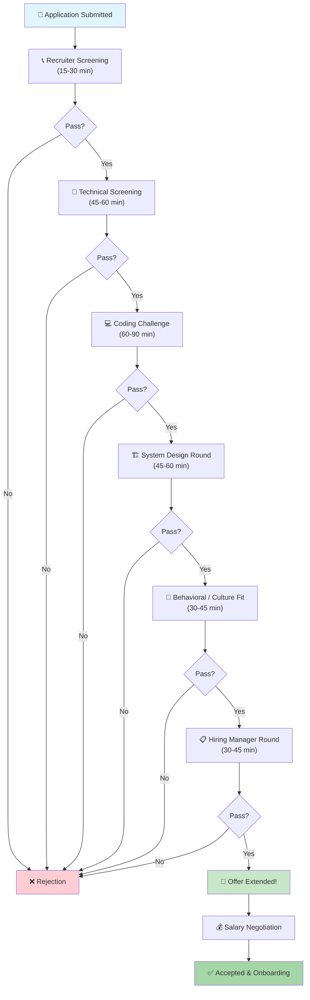
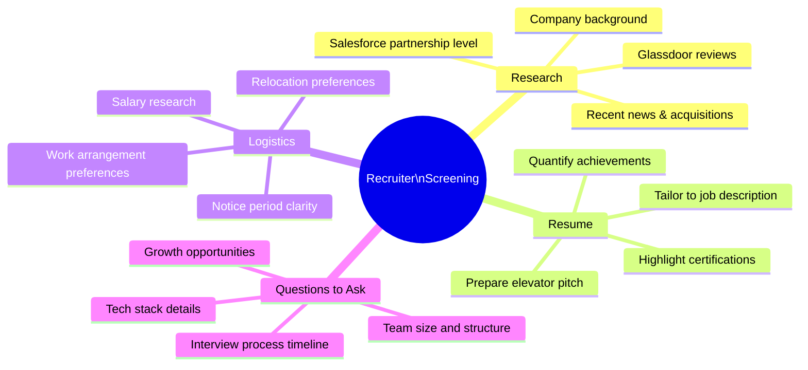
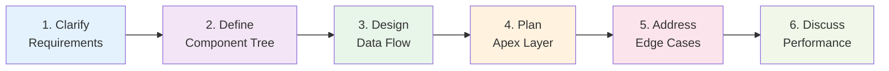
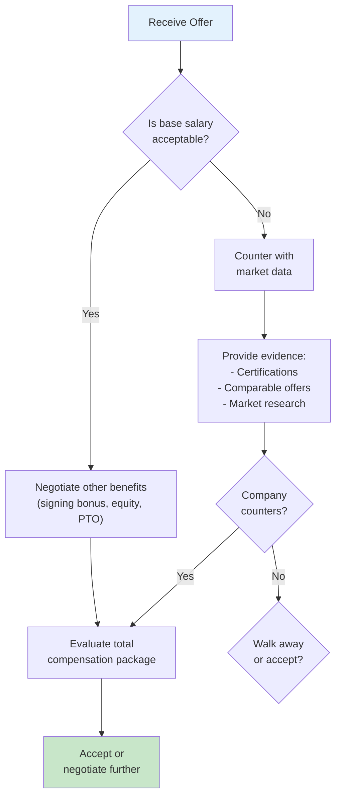

# 🎯 Salesforce LWC Interview Preparation Guide

> Your comprehensive roadmap to acing Salesforce Lightning Web Components interviews — from screening calls to system design rounds.

---

## 📋 Table of Contents

- [Interview Process Overview](#-interview-process-overview)
- [Types of Interview Rounds](#-types-of-interview-rounds)
- [How to Prepare for Each Round](#-how-to-prepare-for-each-round)
- [Tips for Each Round](#-tips-for-each-round)
- [Common Mistakes to Avoid](#-common-mistakes-to-avoid)
- [Salary Negotiation Tips](#-salary-negotiation-tips)
- [Resource Links](#-resource-links)
- [Study Plan](#-30-day-study-plan)

---

## 🔄 Interview Process Overview

The Salesforce developer interview process typically consists of 4-6 rounds spread over 2-4 weeks. Here's the typical flow:



> [!NOTE]
> Not all companies follow every round. Startups may combine rounds, while large enterprises (Salesforce, Deloitte, Accenture) tend to have more structured processes. Some companies also include a take-home assignment instead of a live coding round.

---

## 🎭 Types of Interview Rounds

### Round 1: Recruiter / HR Screening

| Aspect | Details |
|--------|---------|
| **Duration** | 15–30 minutes |
| **Format** | Phone or video call |
| **Interviewer** | Recruiter or HR representative |
| **Focus** | Resume review, motivation, salary expectations, availability |

**What to Expect:**
- Walk through your resume and Salesforce experience
- Questions about your interest in the company and role
- Discussion about salary expectations and notice period
- Overview of the interview process and timeline
- Basic questions about Salesforce certifications

---

### Round 2: Technical Screening

| Aspect | Details |
|--------|---------|
| **Duration** | 45–60 minutes |
| **Format** | Video call (sometimes phone) |
| **Interviewer** | Senior developer or technical lead |
| **Focus** | Salesforce fundamentals, LWC concepts, architecture knowledge |

**What to Expect:**
- Core LWC concepts: decorators, lifecycle hooks, reactivity
- Differences between LWC and Aura
- Wire service, Lightning Data Service, and Apex integration
- Security model: LWS vs Locker Service
- Salesforce platform knowledge (governor limits, SOQL, triggers)
- Questions about your past projects and technical decisions

---

### Round 3: Coding Challenge

| Aspect | Details |
|--------|---------|
| **Format Options** | Live coding, take-home assignment, or pair programming |
| **Duration** | 60–90 minutes (live) or 2–4 hours (take-home) |
| **Interviewer** | Senior developer or architect |
| **Focus** | Practical LWC development, code quality, problem-solving |

**What to Expect:**
- Build a functional LWC component from scratch
- Implement specific features (search, filtering, pagination)
- Handle Apex integration and error scenarios
- Write clean, maintainable, and well-structured code
- Sometimes includes Jest test writing

**Common Challenge Types:**
1. Build a searchable list with Apex data
2. Create a reusable component with parent-child communication
3. Implement a multi-step wizard or form
4. Build a custom lookup/combobox component
5. Create a component with real-time updates

---

### Round 4: System Design

| Aspect | Details |
|--------|---------|
| **Duration** | 45–60 minutes |
| **Format** | Whiteboard or virtual whiteboard |
| **Interviewer** | Architect or senior technical lead |
| **Focus** | Scalable architecture, integration patterns, design decisions |

**What to Expect:**
- Design a complex LWC application (e.g., dashboard, case management)
- Component hierarchy and communication patterns
- Data flow architecture
- Performance considerations at scale
- Integration with external systems
- Security and sharing model considerations

**Sample Design Problems:**
- Design a real-time collaborative case management dashboard
- Architect a multi-org data synchronization UI
- Design a configurable survey builder with analytics
- Build a file management system with preview and versioning

---

### Round 5: Behavioral / Culture Fit

| Aspect | Details |
|--------|---------|
| **Duration** | 30–45 minutes |
| **Format** | Video call or in-person |
| **Interviewer** | Hiring manager, team lead, or HR |
| **Focus** | Soft skills, teamwork, conflict resolution, Salesforce ecosystem passion |

**What to Expect:**
- STAR method questions (Situation, Task, Action, Result)
- Questions about teamwork and collaboration
- How you handle deadlines and pressure
- Your approach to learning new technologies
- Questions about your career goals and growth aspirations
- Cultural fit and values alignment

---

## 📚 How to Prepare for Each Round

### Recruiter Screening Preparation



**Key Actions:**
1. **Research the company** — Know their Salesforce implementation, industry, and recent news
2. **Prepare your elevator pitch** — 60-second summary of your experience and what you bring
3. **Know your numbers** — Research salary ranges on Glassdoor, Levels.fyi, and LinkedIn
4. **Prepare questions** — Show genuine interest with thoughtful questions about the role

---

### Technical Screening Preparation

> [!TIP]
> Create flashcards for the top 50 LWC questions. Review them daily for 2 weeks before your interview. Focus on understanding *why*, not just *what*.

**Study Checklist:**

- [ ] LWC component structure and lifecycle (all 8 hooks)
- [ ] Decorators: `@api`, `@track`, `@wire` — deep understanding
- [ ] Reactivity system and when re-renders occur
- [ ] Wire service: configuration, dynamic parameters, error handling
- [ ] Imperative Apex: when and how to use
- [ ] Custom events: bubbling, composed, detail patterns
- [ ] Lightning Message Service: pub-sub across DOM boundaries
- [ ] Navigation service and URL generation
- [ ] Lightning Data Service: adapters, caching, DML operations
- [ ] Shadow DOM, Light DOM, and LWC styling
- [ ] LWS vs Locker Service security models
- [ ] Performance optimization strategies
- [ ] Jest testing fundamentals
- [ ] Aura-to-LWC migration strategies
- [ ] Governor limits and how they affect LWC/Apex
- [ ] SLDS (Salesforce Lightning Design System) usage

---

### Coding Challenge Preparation

> [!IMPORTANT]
> Practice coding LWC components from scratch without IDE auto-completion. Many interviews use basic editors or whiteboard-style tools.

**Practice Plan:**
1. **Week 1:** Build 2 components per day (search list, modal, form)
2. **Week 2:** Tackle complex challenges (pagination, drag-and-drop, wizard)
3. **Week 3:** Practice under timed conditions (60 minutes per challenge)
4. **Week 4:** Review, refactor, and practice explaining your code

**Must-Practice Patterns:**
```
✅ Parent-child communication (props down, events up)
✅ Apex data fetching with error handling
✅ Conditional rendering and template iteration
✅ Form validation and submission
✅ Dynamic CSS classes and styling
✅ Debounced search input
✅ Loading states and error boundaries
✅ Reusable/composable components with slots
```

---

### System Design Preparation

**Framework for System Design Answers:**



1. **Clarify Requirements** — Ask about user count, data volume, real-time needs
2. **Component Hierarchy** — Draw the component tree with clear responsibilities
3. **Data Flow** — Show how data moves between components and Apex
4. **Apex Architecture** — Service layer, selectors, domain classes
5. **Edge Cases** — Error handling, offline scenarios, concurrent edits
6. **Performance** — Caching, lazy loading, pagination strategies

---

### Behavioral Preparation

**Prepare 5-7 STAR Stories Covering:**

| Theme | Example Story |
|-------|---------------|
| **Technical Challenge** | Solved a complex data loading performance issue |
| **Teamwork** | Collaborated across teams for a Salesforce integration |
| **Conflict Resolution** | Disagreed with architect on component design |
| **Leadership** | Led LWC migration initiative |
| **Failure & Learning** | Deployed a bug to production and recovery process |
| **Innovation** | Introduced a new pattern or tool to the team |
| **Deadline Pressure** | Delivered a critical release under tight timeline |

---

## 💡 Tips for Each Round

### 📞 Recruiter Screening Tips

1. **Be enthusiastic** — Show genuine interest in both the company and the role
2. **Be concise** — Answer questions in 2-3 minutes max
3. **Don't discuss salary first** — Let the recruiter bring it up, or give a range
4. **Mention certifications early** — Platform Developer I/II, JavaScript Developer I
5. **Ask about the team** — Shows you care about culture and collaboration

### 🧠 Technical Screening Tips

1. **Think out loud** — Explain your reasoning, not just the answer
2. **Use correct terminology** — "Reactive property" not "magic variable"
3. **Give examples from experience** — "In my last project, we used LMS because..."
4. **Admit when you don't know** — "I'm not sure, but I'd approach it by..."
5. **Draw connections** — Link LWC concepts to broader web standards

### 💻 Coding Challenge Tips

1. **Read requirements carefully** — Ask clarifying questions before coding
2. **Start with structure** — Plan your component hierarchy first
3. **Handle edge cases** — Empty states, loading, errors
4. **Write clean code** — Meaningful names, proper indentation, comments
5. **Test as you go** — Don't wait until the end to validate
6. **Communicate constantly** — Explain what you're doing and why

### 🏗️ System Design Tips

1. **Start broad, then deep** — Don't jump into implementation details
2. **Ask questions first** — Clarify requirements before designing
3. **Draw diagrams** — Visual communication is powerful
4. **Discuss trade-offs** — Every design decision has pros and cons
5. **Consider scale** — "This works for 100 users, but for 10,000..."
6. **Mention security** — FLS, CRUD, sharing rules, XSS prevention

### 🤝 Behavioral Tips

1. **Use STAR format** — Situation → Task → Action → Result
2. **Be specific** — Use concrete numbers and outcomes
3. **Show growth** — What you learned from each experience
4. **Be authentic** — Don't fabricate stories
5. **Prepare 2-minute versions** — Keep stories concise and impactful

---

## ❌ Common Mistakes to Avoid

### Technical Mistakes

| Mistake | Why It's Bad | What to Do Instead |
|---------|-------------|-------------------|
| Confusing `@track` with `@api` | Shows fundamental misunderstanding | Explain: `@api` is public, `@track` was for object/array reactivity (now auto-tracked) |
| Not knowing lifecycle hook order | Core concept gap | Memorize: `constructor → connectedCallback → renderedCallback → disconnectedCallback` |
| Saying "LWC uses two-way data binding" | LWC uses one-way binding | Explain: "Data flows down via `@api`, events flow up" |
| Ignoring error handling | Shows inexperience | Always mention try-catch, error UI states, and wire error handling |
| Not mentioning security | Critical in Salesforce | Always discuss FLS checks, CRUD, sharing rules |
| Mixing Aura and LWC syntax | Shows lack of focus | Practice pure LWC syntax until it's second nature |

### Behavioral Mistakes

| Mistake | Impact | Better Approach |
|---------|--------|----------------|
| Badmouthing previous employer | Huge red flag | Focus on what you learned and how you grew |
| Being too vague | "I worked on Salesforce" means nothing | Quantify: "I built 15 LWC components serving 500+ users" |
| Not asking questions | Seems disinterested | Prepare 3-5 thoughtful questions for each round |
| Rambling answers | Loses interviewer attention | Use STAR format, keep to 2-3 minutes |
| Not researching the company | Shows lack of effort | Spend 30 minutes researching before each interview |

### Process Mistakes

> [!CAUTION]
> These mistakes can disqualify you regardless of technical ability:
> - **Arriving late** (even for virtual calls — test your setup 15 minutes early)
> - **Not following up** with a thank-you email within 24 hours
> - **Applying without reading the job description** carefully
> - **Negotiating aggressively too early** in the process
> - **Ghosting** after receiving an offer — always communicate professionally

---

## 💰 Salary Negotiation Tips for Salesforce Developers

### Salary Ranges (2025-2026 US Market)

| Role | Experience | Base Salary Range (USD) |
|------|-----------|------------------------|
| Junior LWC Developer | 0-2 years | $75,000 – $100,000 |
| Mid-Level LWC Developer | 2-5 years | $100,000 – $140,000 |
| Senior LWC Developer | 5-8 years | $140,000 – $180,000 |
| Lead/Staff Developer | 8+ years | $170,000 – $220,000 |
| Salesforce Architect | 10+ years | $200,000 – $280,000 |

> [!NOTE]
> Rates vary significantly by location, company size, and industry. Consulting firms often pay 10-20% more. Remote-first companies may pay based on your location or a national average.

### Negotiation Strategies



**Key Negotiation Tips:**

1. **Never give a number first** — Let the company make the initial offer
2. **Research thoroughly** — Use Glassdoor, Levels.fyi, LinkedIn Salary, and Salesforce-specific surveys
3. **Consider total compensation** — Base + bonus + equity + benefits + learning budget
4. **Leverage certifications** — Each Salesforce cert adds $10K-$20K in market value
5. **Have competing offers** — Even the possibility increases your leverage
6. **Negotiate in writing** — Follow up verbal conversations with email summaries
7. **Be professional** — Negotiation should be collaborative, not adversarial
8. **Know your walk-away number** — Decide your minimum before negotiating

**Certifications That Boost Salary:**

| Certification | Typical Salary Boost |
|--------------|---------------------|
| Platform Developer I | +$10K – $15K |
| Platform Developer II | +$15K – $25K |
| JavaScript Developer I | +$10K – $20K |
| Application Architect | +$25K – $40K |
| System Architect | +$30K – $50K |
| B2C Commerce Developer | +$15K – $25K |

---

## 🔗 Resource Links

### Official Salesforce Resources

| Resource | URL | Purpose |
|----------|-----|---------|
| LWC Developer Guide | [developer.salesforce.com/docs/component-library](https://developer.salesforce.com/docs/component-library) | Official documentation |
| Trailhead LWC Modules | [trailhead.salesforce.com](https://trailhead.salesforce.com/en/content/learn/trails/build-lightning-web-components) | Hands-on learning |
| LWC Recipes | [github.com/trailheadapps/lwc-recipes](https://github.com/trailheadapps/lwc-recipes) | Code examples |
| E-Bikes Demo App | [github.com/trailheadapps/ebikes-lwc](https://github.com/trailheadapps/ebikes-lwc) | Full app example |
| LWC Playground | [developer.salesforce.com/docs/component-library/tools/playground](https://developer.salesforce.com/docs/component-library/tools/playground) | Quick prototyping |

### Community Resources

| Resource | URL | Purpose |
|----------|-----|---------|
| Salesforce Stack Exchange | [salesforce.stackexchange.com](https://salesforce.stackexchange.com) | Q&A community |
| Salesforce Developers Blog | [developer.salesforce.com/blogs](https://developer.salesforce.com/blogs) | Latest updates |
| SFDC Monkey | [sfdcmonkey.com](https://www.sfdcmonkey.com) | LWC tutorials |
| Apex Hours | [apexhours.com](https://www.apexhours.com) | Video learning |
| SalesforceBen | [salesforceben.com](https://www.salesforceben.com) | Career & salary guides |

### Practice and Preparation

| Resource | Purpose |
|----------|---------|
| [LeetCode](https://leetcode.com) | General coding practice (JavaScript) |
| [HackerRank](https://www.hackerrank.com) | JavaScript and problem-solving |
| [Focus on Force](https://focusonforce.com) | Certification exam prep |
| [Salesforce Ben Salary Survey](https://www.salesforceben.com/salesforce-salary-survey/) | Salary benchmarking |

---

## 📅 30-Day Study Plan

> [!TIP]
> This plan assumes 2-3 hours of daily study. Adjust based on your experience level and target role.

### Week 1: Foundations (Days 1-7)

| Day | Focus Area | Activities |
|-----|-----------|------------|
| 1 | LWC Architecture | Review component lifecycle, decorators, reactivity model |
| 2 | Data Binding & Events | Practice `@api`, `@track`, custom events, event propagation |
| 3 | Wire Service | Study wire adapters, dynamic wire, caching behavior |
| 4 | Apex Integration | Imperative calls, cacheable methods, error handling |
| 5 | Lightning Data Service | Record forms, wire adapters, DML operations |
| 6 | Styling & SLDS | Shadow DOM, CSS custom properties, SLDS patterns |
| 7 | Review & Quiz | Take the quiz in `top-50-questions.md`, identify gaps |

### Week 2: Intermediate Concepts (Days 8-14)

| Day | Focus Area | Activities |
|-----|-----------|------------|
| 8 | Navigation & Routing | NavigationMixin, URL generation, page references |
| 9 | Lightning Message Service | Cross-component communication patterns |
| 10 | Forms & Validation | Input handling, custom validation, error display |
| 11 | Composition & Slots | Named slots, default slots, composable components |
| 12 | Security Model | LWS, Locker, FLS, CRUD checks, sharing |
| 13 | Testing Basics | Jest setup, unit tests, mocking wire adapters |
| 14 | Coding Challenge #1 | Build searchable list + modal component (timed) |

### Week 3: Advanced Topics (Days 15-21)

| Day | Focus Area | Activities |
|-----|-----------|------------|
| 15 | Performance Optimization | Lazy loading, virtual scrolling, render optimization |
| 16 | Design Patterns | Singleton, Observer, Strategy in LWC context |
| 17 | Dynamic Components | `lwc:dynamic`, lazy loading, conditional rendering |
| 18 | Aura-to-LWC Migration | Coexistence patterns, wrapper components, migration plan |
| 19 | Platform Events & Streaming | Emp API, CDC, platform event handling |
| 20 | System Design Practice | Design a case management dashboard |
| 21 | Coding Challenge #2-4 | Build paginated table, wizard form, lookup |

### Week 4: Interview Simulation (Days 22-30)

| Day | Focus Area | Activities |
|-----|-----------|------------|
| 22-23 | Mock Technical Interview | Practice with a friend or record yourself |
| 24-25 | Scenario Questions | Work through all 15 scenario-based questions |
| 26-27 | Behavioral Prep | Prepare and rehearse 7 STAR stories |
| 28 | System Design Mock | Practice designing a complex LWC application |
| 29 | Salary Research | Research market rates, prepare negotiation strategy |
| 30 | Final Review | Review weak areas, rest, and prepare logistics |

---

## 📁 Study Guide Contents

| File | Description |
|------|-------------|
| [📝 Top 50 Interview Questions](./top-50-questions.md) | Comprehensive Q&A covering beginner to advanced topics |
| [💻 Coding Challenges](./coding-challenges.md) | 10 hands-on coding problems with solutions |
| [🧩 Scenario-Based Questions](./scenario-based-questions.md) | 15 real-world scenarios with detailed solutions |
| [🤝 Behavioral Questions](./behavioral-questions.md) | 20 behavioral questions with STAR-format answers |

---

## 🔑 Key Takeaways

1. **Preparation is systematic** — Follow the 30-day plan and cover all round types
2. **Technical depth matters** — Understand *why* things work, not just *what* they do
3. **Practice coding under pressure** — Timed challenges simulate real interview conditions
4. **Soft skills are equally important** — Many candidates fail on behavioral rounds
5. **Know your worth** — Research salary data and negotiate confidently
6. **Stay current** — Salesforce releases 3 times a year; know the latest features
7. **Certifications are leverage** — They boost both your credibility and compensation

> [!IMPORTANT]
> The best interview preparation is building real projects. If you haven't already, deploy a Salesforce DX project with multiple LWC components to a scratch org or developer edition. Nothing beats hands-on experience.

---

*Good luck with your interview! 🍀 Remember: every interview is also a learning opportunity, regardless of the outcome.*
