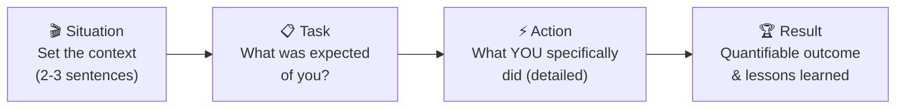

# 🤝 Behavioral Interview Questions for Salesforce Developers

> [!NOTE]
> Behavioral questions evaluate your **soft skills, teamwork, and problem-solving mindset**. Companies hire for culture fit as much as technical ability. The STAR method (Situation, Task, Action, Result) gives your answers structure and impact. Customize these templates with your real experiences before the interview.

## The STAR Method Explained

| Component | Tips | Common Mistakes |
|-----------|------|-----------------|
| **Situation** | Be specific: project, team size, timeline | Too vague ("once at a job...") |
| **Task** | Focus on YOUR responsibility, not the team's | Describing someone else's role |
| **Action** | Use "I" not "we" — highlight YOUR contribution | Being too general |
| **Result** | Quantify when possible (%, $, time saved) | No measurable outcome |

---

## Question 1: Tell Me About a Challenging Salesforce Project You Worked On

### 📋 The Question
*"Tell me about the most challenging Salesforce project you've worked on. What made it difficult, and how did you handle it?"*

### 🎯 What the Interviewer is Looking For
- Your ability to handle **complexity and ambiguity**
- How you break down large problems into manageable pieces
- Whether you can identify technical risks early
- Your resilience when things don't go as planned
- Communication skills when explaining technical challenges

### 📝 STAR Method Framework

| Component | Your Template |
|-----------|---------------|
| **Situation** | "I was working on a [project type] for [client/team]. The project involved [scope]. The team size was [X], and the timeline was [Y]." |
| **Task** | "My responsibility was to [specific role]. The challenge was [what made it hard — data volume, integration complexity, changing requirements, etc.]." |
| **Action** | "I approached this by [specific steps]. First, I [step 1]. Then I [step 2]. When [obstacle] arose, I [how you adapted]." |
| **Result** | "The project was delivered [on time / X weeks early / within budget]. We saw [specific metrics — performance improvement, user adoption, etc.]. I learned [key takeaway]." |

### 💡 Sample Answer

"At my previous company, I was the lead developer on a Salesforce CPQ implementation for a manufacturing client with over 10,000 product configurations. The complexity was extreme — they had nested product bundles, dynamic pricing rules that depended on volume tiers, and a legacy ERP system that needed real-time price sync. The original timeline was 12 weeks, but the requirements kept evolving as we uncovered edge cases in their pricing logic.

My role was to design the pricing engine architecture and build the custom LWC configurator. I started by mapping all 47 pricing scenarios with the business analyst and creating a decision matrix. When I realized the standard CPQ price rules couldn't handle their nested tier logic, I designed a custom Apex pricing service with a strategy pattern that could evaluate rules in a configurable sequence. I also implemented a caching layer using Platform Cache to avoid redundant calculation, which reduced configuration load time from 8 seconds to under 2 seconds.

The project was delivered 2 weeks late but fully functional, with zero critical bugs in the first month of production. The client's sales team reported a 60% reduction in quote generation time. The biggest lesson I took away was the importance of prototyping complex business logic early — I now always build a proof-of-concept for the hardest requirement first, before committing to the full architecture."

---

## Question 2: Describe a Time You Had to Learn a New Technology Quickly

### 📋 The Question
*"Tell me about a time you had to learn a new technology or framework quickly to meet a project deadline."*

### 🎯 What the Interviewer is Looking For
- **Learning agility** — how fast you ramp up on new things
- Your approach to self-directed learning
- Whether you're comfortable with discomfort and uncertainty
- Resourcefulness in finding answers (Trailhead, docs, community)
- How you balance learning with delivering

### 📝 STAR Method Framework

| Component | Your Template |
|-----------|---------------|
| **Situation** | "Our team was tasked with [project] that required [new technology]. I had [level of experience] with it." |
| **Task** | "I needed to become proficient in [technology] within [timeframe] to deliver [specific deliverable]." |
| **Action** | "I created a learning plan: [specific resources, practice projects, mentors consulted]. I [how you applied learning in real-time]." |
| **Result** | "I was able to [deliver the feature/lead the team]. My approach to learning [technology] is now [how it benefited you long-term]." |

### 💡 Sample Answer

"When Salesforce announced that Lightning Web Components would replace Aura as the recommended framework, our team had a large Aura component library with about 30 components. My manager asked me to lead the migration effort, but I had zero LWC experience at the time. We had 8 weeks before a major release that needed the first batch of migrated components.

I built a structured learning plan: I completed the LWC Trailhead modules in the first week while simultaneously reading the official documentation. In week two, I converted our simplest Aura component (a reusable modal) to LWC as a proof of concept, documenting every Aura-to-LWC pattern I discovered. I created a migration guide for the team with side-by-side comparisons of event handling, data binding, and lifecycle hooks. I also joined the Salesforce Developer Community group and posted questions when I hit edge cases, particularly around the reactivity system and shadow DOM styling limitations.

By week four, I was the team's go-to LWC resource. We successfully migrated 12 of the 30 components for the release, and I had built enough expertise to conduct code reviews for the other developers' LWC work. That experience taught me that the fastest way to learn isn't just reading — it's building something real from day one and documenting your discoveries for others."

---

## Question 3: How Do You Handle Tight Deadlines on a Salesforce Project?

### 📋 The Question
*"How do you manage your work when you have tight deadlines? Give me a specific example."*

### 🎯 What the Interviewer is Looking For
- **Time management** and prioritization skills
- How you communicate about timeline risks
- Whether you cut corners or maintain quality
- Your ability to negotiate scope when necessary
- Stress management and composure

### 📝 STAR Method Framework

| Component | Your Template |
|-----------|---------------|
| **Situation** | "We had a [deliverable] due in [timeframe]. The challenge was [why it was tight — scope, team size, dependencies]." |
| **Task** | "I was responsible for [your specific deliverables]. The risk was [what could go wrong]." |
| **Action** | "I [prioritization strategy]. I communicated [what, to whom, when]. I made trade-off decisions about [scope/quality/features]." |
| **Result** | "We delivered [outcome]. The client/stakeholder response was [reaction]. I learned [lesson about deadline management]." |

### 💡 Sample Answer

"During a sprint where we had two major feature deliverables, our team lost a developer who went on emergency leave. I was responsible for building a complex multi-step wizard form with Apex integration, and the sprint deadline was non-negotiable because it aligned with the client's go-live date.

I immediately re-assessed the scope with my scrum master. I identified the wizard's core flow — the 3 required steps with validation — as the must-have and the optional advanced features (auto-save drafts, progress bar animations) as nice-to-haves. I communicated this to the product owner transparently: 'I can deliver a fully functional wizard by Friday, but the polish features will need to move to the next sprint.' They agreed. I then time-boxed my work: mornings for coding, afternoons for testing, and I set daily check-in messages with the team to flag blockers immediately rather than waiting for standup.

I delivered the core wizard on Thursday, one day early, with full test coverage. The advanced features were completed in the next sprint. The product owner appreciated the early communication and the fact that I never compromised on code quality or test coverage despite the pressure. I now always build a 'MoSCoW' priority list (Must, Should, Could, Won't) at the start of any time-constrained work."

---

## Question 4: Tell Me About a Time You Had a Disagreement With a Team Member

### 📋 The Question
*"Describe a time you had a technical disagreement with a colleague. How did you resolve it?"*

### 🎯 What the Interviewer is Looking For
- **Conflict resolution** skills
- Whether you're collaborative or combative
- Your ability to separate personal ego from technical decisions
- How you advocate for your position with data/evidence
- Maturity and professionalism

### 📝 STAR Method Framework

| Component | Your Template |
|-----------|---------------|
| **Situation** | "During [project], my colleague and I disagreed on [technical decision — architecture, technology choice, approach]." |
| **Task** | "We needed to reach a decision on [what] because [why it mattered — deadline, architecture impact]." |
| **Action** | "I [how you handled the conversation]. I [presented evidence/data]. We [how you reached resolution]." |
| **Result** | "We went with [decision]. The outcome was [what happened]. Our working relationship [how it was affected]." |

### 💡 Sample Answer

"On a recent project, a senior developer on my team and I disagreed about how to implement cross-component communication in a new Lightning page. He wanted to use a shared JavaScript module with an observer pattern — something he'd built before and was comfortable with. I advocated for Lightning Message Service (LMS), which was the platform-standard approach.

Rather than just insisting I was right, I proposed we both spend 30 minutes building a small proof of concept. I created a quick demo showing LMS working across Aura and LWC components on the same page, and he built his observer pattern version. We then compared them on a whiteboard against four criteria: maintainability, testability, framework support, and future compatibility. LMS won on three of the four — it was platform-supported, worked across frameworks, and was testable with standard mocking. His approach was slightly better for performance in a single-framework scenario, which was a fair point.

We agreed on LMS for the project since we had both Aura and LWC components. Importantly, I acknowledged his approach was valid and would be a good choice for a pure-LWC project. He ended up becoming a strong LMS advocate himself. The experience reinforced that the best way to resolve technical disagreements is to make them about evidence and criteria, not opinions."

---

## Question 5: How Do You Stay Updated With Salesforce Releases?

### 📋 The Question
*"Salesforce has three major releases per year. How do you stay current with new features and changes?"*

### 🎯 What the Interviewer is Looking For
- **Continuous learning** mindset
- Proactive vs. reactive approach to platform changes
- Whether you contribute to the community (not just consume)
- How you evaluate which new features to adopt
- Your professional development discipline

### 📝 STAR Method Framework

| Component | Your Template |
|-----------|---------------|
| **Situation** | "Salesforce's rapid release cycle means [challenge of staying current]." |
| **Task** | "As a developer, I need to [what you need to stay on top of]." |
| **Action** | "My approach includes [specific habits, resources, communities]." |
| **Result** | "This has helped me [specific example where staying current paid off]." |

### 💡 Sample Answer

"I've built a systematic approach to staying current. For each of the three annual releases, I follow a three-phase process. Phase one is 'Scout' — when the release notes drop (usually 6-8 weeks before GA), I read through the LWC, Apex, and platform sections and create a summary of features relevant to our team. Phase two is 'Experiment' — I spin up a pre-release scratch org and test the features that look promising. Phase three is 'Share' — I present a 15-minute 'Release Highlights' session to my team during our sprint review.

Beyond releases, I subscribe to the Salesforce Developers blog, follow key Salesforce MVPs on LinkedIn and X, and participate in the Trailblazer Community forums. I'm also active on StackExchange's Salesforce community where I both ask and answer questions. I complete at least one Trailhead superbadge per quarter to stay hands-on with areas outside my daily work.

This approach paid off significantly last year when the Spring release introduced `lightning-record-picker`. Because I'd already experimented with it in the pre-release org, I was able to replace three custom lookup components in our codebase within the first week of the release going GA, saving about 400 lines of custom code and gaining built-in accessibility for free."

---

## Question 6: Describe a Bug That Was Difficult to Find and Fix

### 📋 The Question
*"Tell me about a particularly tricky bug you encountered. How did you find the root cause and fix it?"*

### 🎯 What the Interviewer is Looking For
- **Debugging methodology** — systematic vs. random
- Patience and persistence
- Tool proficiency (debug logs, Dev Tools, etc.)
- Root cause analysis (not just symptom fixing)
- Whether you document and share learnings

### 📝 STAR Method Framework

| Component | Your Template |
|-----------|---------------|
| **Situation** | "In [project/environment], users reported [symptom]. Initial investigation showed [initial findings]." |
| **Task** | "I needed to find and fix the bug within [timeframe] because [business impact]." |
| **Action** | "I [debugging steps]. I used [tools/techniques]. The root cause turned out to be [what was actually wrong]." |
| **Result** | "The fix was [what you changed]. It resolved [impact]. I [preventive measures you put in place]." |

### 💡 Sample Answer

"We had a production issue where a custom LWC form would intermittently lose data on step 3 of a 4-step wizard. Users would fill in all fields, click 'Next,' and the data from step 2 would sometimes be blank. It happened maybe 1 in 10 times, making it incredibly hard to reproduce locally.

I started by adding detailed `console.log` statements at each step transition to track the form state object. When I couldn't reproduce it in my sandbox, I realized it might be timing-related. I used Chrome DevTools' Performance tab to record a slow session and noticed that the component's reactive property was being overwritten during a race condition: the `@wire` decorator was re-provisioning data at the exact moment the step transition was updating the form state, and because the wired result handler was reassigning the entire form data object, it was clobbering the user's input.

The root cause was that the wired Apex method was tagged `cacheable=true` but the cache was being invalidated by another component on the page that called `refreshApex`. The fix was straightforward: I separated the wire result data from the form input data into two distinct properties instead of merging them. I also added a `renderedCallback` guard to ensure the wire handler only sets initial data, not overwrite user changes. After deploying the fix, the issue never recurred. I wrote a team wiki article about 'Wire Service Gotchas with Form State' so others wouldn't hit the same trap."

---

## Question 7: How Do You Prioritize Tasks When You Have Multiple Deliverables?

### 📋 The Question
*"Imagine you have three tasks due this week: a critical bug fix, a feature for the next sprint demo, and a code review for a teammate. How do you prioritize?"*

### 🎯 What the Interviewer is Looking For
- **Prioritization framework** (urgency vs. importance)
- Communication with stakeholders about priorities
- Collaboration mindset (not neglecting team responsibilities)
- Ability to estimate effort accurately
- How you handle being overcommitted

### 📝 STAR Method Framework

| Component | Your Template |
|-----------|---------------|
| **Situation** | "I had [multiple competing priorities] with [constraints — deadline, dependencies, team impact]." |
| **Task** | "I needed to determine the optimal order and communicate expectations." |
| **Action** | "I used [prioritization method]. I communicated [what, to whom]. I [how you managed time]." |
| **Result** | "I completed [what, in what order]. The outcome was [impact on team/project]." |

### 💡 Sample Answer

"I use a modified Eisenhower Matrix tailored for Salesforce development. I categorize tasks along two axes: urgency (blocking others / production impact) and importance (business value / technical debt). For the scenario you described, the critical bug fix is urgent AND important — it likely affects production users. That's my first priority. The code review for my teammate is urgent but lower effort — it probably takes 30 minutes and unblocks them, so I do it right after the bug fix or during a compile/deploy wait. The feature for the sprint demo is important but has a few more days, so it gets my focused afternoon block.

In practice, I had a similar situation last quarter. I had a governor limit bug in production affecting 200 users, a teammate's PR awaiting review, and a new Apex trigger to write for the next demo. I messaged my scrum master immediately: 'Production bug is priority one today, I'll have the fix deployed by lunch. I'll review Jake's PR during my deployment wait. The trigger is my PM focus — I'll have it demo-ready by Thursday.' That transparency meant no one was surprised, the bug was fixed by 11 AM, Jake's PR was approved by noon, and the trigger was done by Wednesday. Clear communication turns priority conflicts into manageable sequences."

---

## Question 8: Tell Me About a Time You Improved a Process or Codebase

### 📋 The Question
*"Describe a time you identified an opportunity to improve an existing process or codebase. What did you do?"*

### 🎯 What the Interviewer is Looking For
- **Proactive improvement** mindset (not just firefighting)
- Ability to identify technical debt and process inefficiencies
- How you build consensus for changes
- Whether you measure the impact of improvements
- Balance between improvement and feature work

### 📝 STAR Method Framework

| Component | Your Template |
|-----------|---------------|
| **Situation** | "I noticed that [process/code/architecture] had [specific inefficiency or problem]." |
| **Task** | "I wanted to [improve what] to achieve [specific benefit]." |
| **Action** | "I [proposed/built/piloted] the improvement. I [how you got buy-in]. The change involved [technical details]." |
| **Result** | "The improvement resulted in [quantified benefit — time saved, bugs reduced, performance gain]." |

### 💡 Sample Answer

"Our team's deployment process was painful — every release took 4-6 hours of manual work: running tests locally, packaging changes into a change set, deploying, running tests again in the target org, and manually verifying. Developers dreaded release days, and we averaged two deployment failures per month due to human error (missing components, wrong order of operations).

I proposed implementing a CI/CD pipeline using Salesforce CLI and GitHub Actions. I spent two weekends building a proof of concept: a GitHub workflow that ran on every PR merge to main. It automatically validated the deployment against a staging sandbox, ran all Apex tests, checked code coverage thresholds, and deployed to production with a single approval step. I presented the POC to the team with a side-by-side comparison: 4-6 hours manual vs. 15 minutes automated, plus the elimination of human error in component selection.

After getting team buy-in, I paired with each developer to onboard them to the SFDX project structure (we were still using change sets). Within a month, deployments went from a dreaded 4-hour ordeal to a 15-minute automated pipeline. Deployment failures dropped from two per month to zero in the first quarter. The team's velocity increased by about 20% because developers were no longer spending half a day on deployments. That initiative also became a template that two other teams in the company adopted."

---

## Question 9: How Do You Handle Scope Creep in a Project?

### 📋 The Question
*"Tell me about a time when project requirements kept changing or expanding. How did you manage it?"*

### 🎯 What the Interviewer is Looking For
- **Change management** skills
- Assertiveness balanced with flexibility
- How you protect the team from burnout
- Whether you document and communicate impacts
- Understanding of agile vs. waterfall scope management

### 📝 STAR Method Framework

| Component | Your Template |
|-----------|---------------|
| **Situation** | "During [project], the [stakeholder/client] started requesting [additional features/changes]." |
| **Task** | "I needed to manage expectations while being responsive to legitimate needs." |
| **Action** | "I [how you tracked changes, communicated impact, negotiated scope]." |
| **Result** | "The project was delivered with [outcome]. The relationship with the stakeholder [how it was affected]." |

### 💡 Sample Answer

"On a Service Cloud implementation, we had clearly defined requirements in Sprint 1 for a custom case management LWC. By Sprint 2, the business analyst started bringing new 'small asks' — a field here, a conditional section there. Each one was genuinely small, but collectively they were adding 30% more work than planned. The team was starting to work evenings to keep up.

I implemented what I call the 'Change Impact Log.' Every new request, no matter how small, got documented with three things: estimated hours, impact on existing timeline, and what it would delay. I created a simple spreadsheet and shared it with the BA and project manager in our weekly sync. When the BA brought the next 'quick add,' I'd say: 'Absolutely, we can do that. It's about 4 hours. If we add it to this sprint, the email template feature will slip by two days. Shall we make that trade, or would you prefer this in the next sprint?'

This changed the dynamic entirely. The BA started prioritizing their own requests because they could see the trade-offs visually. We ended up delivering the core product on time with about 60% of the additional requests included in later sprints. The PM later told me the Change Impact Log was adopted as a standard practice across all their Salesforce projects. The key lesson: scope creep isn't a problem of saying 'no' — it's a problem of visibility. When stakeholders see the trade-offs clearly, they self-manage."

---

## Question 10: Describe Your Experience Working With Non-Technical Stakeholders

### 📋 The Question
*"How do you explain technical concepts to non-technical stakeholders? Give me an example."*

### 🎯 What the Interviewer is Looking For
- **Communication skills** — translating technical to business language
- Patience and empathy
- Whether you can align technical decisions with business value
- Use of analogies, visuals, and demos
- Ability to listen and understand business context

### 📝 STAR Method Framework

| Component | Your Template |
|-----------|---------------|
| **Situation** | "I needed to explain [technical concept] to [who — VP, client, business user]." |
| **Task** | "They needed to understand [what] to make a decision about [business decision]." |
| **Action** | "I used [analogy/demo/visual] to explain. I focused on [business impact, not technical details]." |
| **Result** | "They understood the concept and decided [decision]. This led to [business outcome]." |

### 💡 Sample Answer

"I was working with a VP of Sales who wanted to understand why we couldn't just 'make the page faster' — our custom LWC dashboard was loading slowly because it was making 8 separate API calls to Salesforce. The VP didn't understand why consolidating the calls mattered and thought we should 'just add more servers.'

Instead of talking about governor limits and transaction contexts, I used a restaurant analogy. I said: 'Imagine you're at a restaurant and instead of giving the waiter your full order at once, you call them over 8 separate times — once for the appetizer, once for the drink, once for the entrée, etc. Each trip to the kitchen takes time, and the kitchen has a rule that each waiter can only carry 100 items per shift. If every table does this, the waiters hit their limit and the kitchen stops. Consolidating our API calls is like giving one complete order — the kitchen processes it efficiently in one trip.'

The VP immediately got it. They approved the two-sprint refactoring effort, and when I delivered the consolidated dashboard with a 3x performance improvement, I showed them the before/after load times side by side. They became one of our biggest advocates for technical debt reduction. The lesson: business stakeholders don't care about the technology — they care about the outcome. Frame everything in terms of user impact, time saved, and revenue affected."

---

## Question 11: Tell Me About a Time You Mentored Someone

### 📋 The Question
*"Have you mentored a junior developer or helped a team member grow? Tell me about that experience."*

### 🎯 What the Interviewer is Looking For
- **Leadership potential** and desire to develop others
- Teaching ability and patience
- Whether you invest in team growth, not just personal achievement
- Your mentoring approach (hands-on vs. coaching)
- Ability to scale your impact through others

### 📝 STAR Method Framework

| Component | Your Template |
|-----------|---------------|
| **Situation** | "A [junior developer/new team member] joined the team and needed support with [what]." |
| **Task** | "I took on the role of [mentor/buddy/lead] to help them [specific goal]." |
| **Action** | "I [specific mentoring activities — pair programming, code reviews, knowledge sharing]." |
| **Result** | "Within [timeframe], they were able to [specific achievement]. Their growth also [how it benefited the team]." |

### 💡 Sample Answer

"When a junior Salesforce developer joined our team, she had strong Apex skills from Trailhead but had never built an LWC or worked in an agile team. I volunteered to be her onboarding buddy. Rather than just sending her documentation links, I structured a 4-week ramp-up plan.

Week one was pair programming — we built a simple LWC together, and I explained every decision aloud: why I chose a getter over a tracked property, why the event name was lowercase, why we use imperative Apex here but wire there. Week two, she built a component solo while I was available for questions. I reviewed her code not just for correctness but with teaching comments: 'This works, but consider this pattern for scalability — here's why.' Week three, I had her review MY code and asked her to find improvements. This was powerful because it shifted her from learner to peer. By week four, she presented her first LWC at the team's demo.

Within three months, she was independently delivering features and had become the team's go-to person for LWC accessibility questions (a topic she dove deep into during her learning). Mentoring her also improved my own skills — explaining 'why' to someone forced me to examine assumptions I'd never questioned. The experience convinced me that the ROI of investing time in mentoring is enormous for the team's overall velocity."

---

## Question 12: How Do You Approach Code Reviews?

### 📋 The Question
*"What do you look for in a code review? How do you give feedback?"*

### 🎯 What the Interviewer is Looking For
- **Code quality standards** you value
- Whether you're constructive or critical
- Balance between perfectionism and pragmatism
- How you handle receiving feedback on your own code
- Knowledge of Salesforce-specific code review concerns

### 📝 STAR Method Framework

| Component | Your Template |
|-----------|---------------|
| **Situation** | "In my team, code reviews are part of [your PR/review process]." |
| **Task** | "I review code to ensure [quality, security, performance, maintainability]." |
| **Action** | "I follow a structured approach: [your review checklist]. I give feedback by [your communication style]." |
| **Result** | "This has led to [fewer bugs, team skill improvement, consistent codebase]." |

### 💡 Sample Answer

"I approach code reviews with a checklist mindset but a coaching tone. My review covers five areas in priority order: security first (CRUD/FLS enforcement, SOQL injection, XSS), then correctness (does it actually solve the problem?), then performance (bulk-safe triggers, efficient SOQL), then maintainability (naming, structure, comments), and finally style (formatting, consistency with team conventions).

For feedback tone, I follow three rules. First, I start with something positive — even if it's small, recognizing good work sets a collaborative tone. Second, I frame suggestions as questions: 'Have you considered using a Set instead of a List here for dedup? It would make the lookup O(1)' rather than 'This is wrong, use a Set.' Third, I distinguish between blocking issues (security vulnerabilities, bugs) and suggestions (style preferences) using labels like 'nit:' for minor suggestions and 'blocker:' for must-fix items.

One specific example: I caught a SOQL injection vulnerability in a teammate's code during review — they were concatenating user input directly into a dynamic query. Instead of just flagging it, I linked to the Salesforce security documentation, showed them the `String.escapeSingleQuotes()` fix, and explained the attack vector. They thanked me for the learning opportunity rather than feeling criticized. Good code reviews aren't gatekeeping — they're knowledge transfer in both directions."

---

## Question 13: Describe a Time You Had to Make a Technical Trade-Off

### 📋 The Question
*"Tell me about a time you had to make a trade-off between two technically valid approaches. How did you decide?"*

### 🎯 What the Interviewer is Looking For
- **Decision-making process** under ambiguity
- Awareness of trade-offs (performance vs. maintainability, speed vs. quality)
- Whether you involve the right stakeholders in decisions
- How you document and communicate trade-off rationale
- Pragmatism over perfectionism

### 📝 STAR Method Framework

| Component | Your Template |
|-----------|---------------|
| **Situation** | "I had to choose between [Option A] and [Option B] for [what feature/problem]." |
| **Task** | "Both approaches had merit. Option A offered [advantage], Option B offered [different advantage]." |
| **Action** | "I evaluated based on [criteria]. I [built prototypes / consulted team / analyzed data]. I chose [which] because [rationale]." |
| **Result** | "The decision proved [correct/needed adjustment] because [what happened]. I'd [change/keep] my approach for next time." |

### 💡 Sample Answer

"We needed to implement real-time notifications in our LWC app. Two options: Platform Events (native, streaming-based) or a polling approach (imperative Apex called every 5 seconds). Platform Events offered true real-time delivery and was the 'right' architectural answer. Polling was simpler to implement, easier to debug, and had no daily event delivery limits.

I created a decision matrix with the team: latency (Platform Events wins — instant vs. 5s delay), reliability (polling wins — no streaming connection issues), scalability (Platform Events wins — server pushes vs. client pulls), implementation time (polling wins — 2 hours vs. 2 days), and operational cost (Platform Events wins — no redundant API calls).

We went with Platform Events because our use case — alerting loan officers about new application assignments — required sub-second notification. A 5-second delay could mean two officers working the same application simultaneously. However, I built a polling-based fallback that activates if the streaming connection drops, giving us the reliability benefit of polling as a safety net. The dual approach added a day of development but eliminated the reliability concern entirely. The lesson: trade-offs don't always have to be either/or — sometimes the best decision is a hybrid."

---

## Question 14: How Do You Ensure Code Quality in Your Projects?

### 📋 The Question
*"What practices do you follow to maintain high code quality across a team?"*

### 🎯 What the Interviewer is Looking For
- **Quality assurance** mindset beyond just testing
- Knowledge of testing strategies (unit, integration, E2E)
- Automation and tooling usage
- Team-wide quality culture vs. individual effort
- Salesforce-specific quality concerns (governor limits, bulk testing)

### 📝 STAR Method Framework

| Component | Your Template |
|-----------|---------------|
| **Situation** | "In [my team/project], code quality was [initial state — good, inconsistent, lacking]." |
| **Task** | "I wanted to establish [quality standards, testing practices, automation]." |
| **Action** | "I implemented [specific practices — PMD, Jest, CI/CD, code review standards]." |
| **Result** | "Code quality improved as measured by [metrics — bug rate, test coverage, deployment success rate]." |

### 💡 Sample Answer

"I follow a 'quality layers' approach. Layer one is prevention: we use Salesforce Code Analyzer (PMD rules) in our IDE and CI pipeline to catch common issues — unused variables, hardcoded IDs, SOQL in loops — before code even reaches review. Layer two is testing: every Apex class has unit tests with at minimum 85% coverage, but more importantly, tests cover positive, negative, and bulk scenarios (200+ records). For LWC, we write Jest tests for component logic and interaction behavior. Layer three is review: every PR requires at least one approval, and we have a security-focused checklist for any code touching user input.

Layer four is monitoring: in production, I set up debug log monitoring for governor limit warnings and built a dashboard tracking API usage, test failures, and deployment success rates. When a test starts failing intermittently, we treat it as a P2 bug — flaky tests erode trust in the entire test suite.

The most impactful practice I introduced was 'test scenario documentation.' Before writing code, the developer writes down 3-5 test scenarios as acceptance criteria. This simple practice reduced our post-deployment bug rate by about 40% because developers were thinking about edge cases before writing the first line of code."

---

## Question 15: Tell Me About a Project Where You Had to Integrate With External Systems

### 📋 The Question
*"Describe your experience integrating Salesforce with external systems. What challenges did you face?"*

### 🎯 What the Interviewer is Looking For
- **Integration architecture** knowledge
- Experience with APIs (REST, SOAP), middleware, events
- Error handling and retry strategies
- Security considerations (OAuth, certificates, named credentials)
- Data mapping and transformation experience

### 📝 STAR Method Framework

| Component | Your Template |
|-----------|---------------|
| **Situation** | "We needed to integrate Salesforce with [external system] for [business purpose]." |
| **Task** | "My role was to design and implement the [integration pattern — sync, async, batch]." |
| **Action** | "I [technical steps — API design, authentication, error handling, mapping]." |
| **Result** | "The integration processes [volume] records [frequency] with [reliability metric]." |

### 💡 Sample Answer

"I designed and built a bi-directional integration between Salesforce and a custom ERP system for a manufacturing client. The ERP needed to push order updates to Salesforce in near-real-time, and Salesforce needed to push new customer records to the ERP when accounts were created.

For ERP-to-Salesforce, I built a REST API endpoint using an Apex REST resource class that the ERP called via webhook. I used Named Credentials for authentication (OAuth 2.0 client credentials flow) and implemented idempotency by checking for duplicate external IDs before creating records. For Salesforce-to-ERP, I used a Platform Event-triggered flow that called the ERP's REST API via an Apex callout, with retry logic: if the callout failed, the event was requeued with exponential backoff up to 3 retries.

The biggest challenge was data mapping — the ERP used proprietary status codes that didn't match Salesforce picklist values. I built a Custom Metadata Type-based mapping table so the business team could update mappings without code changes. I also implemented comprehensive error logging using a custom `Integration_Log__c` object that tracked every request/response pair with status, payload, and error details. The integration processes about 500 transactions daily with 99.7% success rate, and the error log has been invaluable for debugging the remaining 0.3%."

---

## Question 16: How Do You Handle Production Issues or Outages?

### 📋 The Question
*"Walk me through how you'd handle a critical production issue affecting users right now."*

### 🎯 What the Interviewer is Looking For
- **Incident response** process and composure
- Communication during crisis
- Prioritization (fix now, investigate later)
- Root cause analysis discipline
- Preventive measures after resolution

### 📝 STAR Method Framework

| Component | Your Template |
|-----------|---------------|
| **Situation** | "A critical [issue type] was reported in production affecting [scope of impact]." |
| **Task** | "I needed to [contain/fix] the issue while keeping stakeholders informed." |
| **Action** | "I followed [incident process]. I [triage steps, fix, communication]." |
| **Result** | "The issue was resolved in [timeframe]. Post-mortem revealed [root cause]. We prevented recurrence by [what you changed]." |

### 💡 Sample Answer

"Last year, our custom approval process LWC stopped working in production on a Monday morning. Users couldn't approve or reject requests, which was blocking $2M in pending purchase orders. I was the first developer to respond.

My immediate actions followed our incident playbook: first, I posted in the #incidents Slack channel with what I knew, who was affected, and that I was investigating. Second, I checked the deployment log — a release had gone out Friday evening. I compared the Friday deployment's components against the approval LWC and found that a utility class it depended on had been modified by another developer. Third, I narrowed the issue to a null reference in the utility class when handling a specific approval step type that the other developer hadn't tested against. The fix was a 3-line null check.

Rather than waiting for a full regression test, I hotfixed the utility class directly in production (with my tech lead's approval), verified the fix with two test approvals, and posted an all-clear in Slack. Total downtime: 47 minutes. That afternoon, I led a blameless post-mortem. We identified two process gaps: no cross-component dependency testing in our CI pipeline, and no Friday evening deployments (we adopted a 'no deploys after Wednesday' rule for that sprint). The post-mortem document became a training case study for new team members."

---

## Question 17: Describe Your Approach to Documentation

### 📋 The Question
*"How do you approach documentation for your code and projects?"*

### 🎯 What the Interviewer is Looking For
- Whether you value documentation (many developers don't)
- **Practical documentation** — useful, not bureaucratic
- Understanding of different audiences (developer vs. admin vs. user)
- Self-documenting code principles
- Knowledge transfer mindset

### 📝 STAR Method Framework

| Component | Your Template |
|-----------|---------------|
| **Situation** | "Documentation in [my team/project] was [initial state]." |
| **Task** | "I wanted to create documentation that [was actually useful / saved onboarding time / reduced support questions]." |
| **Action** | "I created [types of docs]. My approach to documentation includes [principles]." |
| **Result** | "This documentation [specific impact — reduced onboarding, fewer repeated questions]." |

### 💡 Sample Answer

"I follow the principle that documentation should live as close to the code as possible. My approach has four layers. First, **self-documenting code**: meaningful variable names, small focused methods, and clear component naming. If someone needs a comment to understand what `getFilteredActiveContacts()` does, the name needs work, not a comment. Second, **JSDoc/ApexDoc headers** on every public method and API property: parameter descriptions, return types, and a brief usage example. Third, **README files** in each component directory explaining the component's purpose, where it's used, and any non-obvious dependencies. Fourth, **architectural decision records (ADRs)** for significant design choices — a short document explaining what we decided, what we considered, and why we chose this path.

I don't write documentation for documentation's sake. I apply the 'bus factor' test: if I got hit by a bus tomorrow, could someone take over this component from my documentation alone? If the answer is no, I add what's missing. For end-user documentation, I create short Loom video walkthroughs — users prefer 2-minute videos over 5-page guides. This approach cut our new developer onboarding time from 3 weeks to 1 week because they could understand any component by reading its README and JSDoc."

---

## Question 18: Tell Me About a Time You Worked Under Minimal Supervision

### 📋 The Question
*"Describe a project where you had to work independently with little guidance. How did you manage?"*

### 🎯 What the Interviewer is Looking For
- **Self-direction** and initiative
- How you handle ambiguity without hand-holding
- Whether you seek help when needed vs. spinning your wheels
- Decision-making confidence
- Ability to scope and plan your own work

### 📝 STAR Method Framework

| Component | Your Template |
|-----------|---------------|
| **Situation** | "I was assigned [project/task] with [minimal direction — new team, solo developer, remote]." |
| **Task** | "I needed to [deliver what] without [what was missing — clear requirements, daily oversight, technical spec]." |
| **Action** | "I [how you created structure for yourself]. I [how you stayed on track]. I [when and how you escalated]." |
| **Result** | "I delivered [outcome]. The experience [what it taught you about working independently]." |

### 💡 Sample Answer

"I was the sole Salesforce developer on a 3-month project for a nonprofit. My manager was a project manager with no Salesforce background, and the nearest Salesforce architect was in another timezone with limited availability. The project was to build a donor management system with a custom LWC portal.

I created my own structure: first, I wrote a technical design document outlining the data model, component hierarchy, and integration points, then shared it with the architect for a 30-minute review call — her feedback in that single call saved me weeks of rework. I broke the project into 2-week milestones with demo checkpoints, so even without daily oversight, my PM could see progress regularly. I set a personal rule: if I'm stuck on something for more than 2 hours, I ask for help — pride isn't worth lost time. I used the Trailblazer Community and Stack Exchange for technical questions and kept a decision log so I could explain my reasoning later.

I delivered the system 1 week ahead of schedule with full documentation. The nonprofit's executive director told my company it was the smoothest implementation they'd experienced. Working independently taught me that the key isn't having all the answers — it's having a system: structure your own work, communicate proactively, and know when to ask for help."

---

## Question 19: How Do You Approach Estimating Project Timelines?

### 📋 The Question
*"How do you estimate the time needed for Salesforce development tasks? How accurate are your estimates?"*

### 🎯 What the Interviewer is Looking For
- **Estimation methodology** (not just guessing)
- Awareness of common estimation pitfalls
- Buffer management for unknowns
- Track record of delivery against estimates
- Honesty about estimation difficulty

### 📝 STAR Method Framework

| Component | Your Template |
|-----------|---------------|
| **Situation** | "I was asked to estimate [project/feature set] for [stakeholder/planning purpose]." |
| **Task** | "I needed to provide [realistic timeline] that accounted for [unknowns, risks, dependencies]." |
| **Action** | "I used [estimation technique]. I [how you handled uncertainty]. I [how you communicated confidence levels]." |
| **Result** | "The estimate was [accuracy]. I've refined my process to [how you've improved]." |

### 💡 Sample Answer

"I've learned that estimation is both science and art. My approach starts with decomposition: I break every feature into tasks no larger than half a day. If I can't break it down, I don't understand it well enough to estimate it. For each task, I estimate three values: optimistic (everything goes right), realistic (normal friction), and pessimistic (major unknown uncovered). I typically commit to the realistic estimate and use the pessimistic as my buffer communication.

For Salesforce specifically, I've built a personal reference library: I know a standard CRUD Apex controller with test class takes me about 3 hours, a medium-complexity LWC with wire adapters takes 4-6 hours, and integration work gets a 50% buffer because external systems are unpredictable. I also add what I call 'invisible time' — code review cycles, deployment issues, environment setup — which typically adds 20% to any estimate.

I track my estimates vs. actuals in a spreadsheet. Over the past year, my estimates are within 15% of actual time about 80% of the time. The 20% where I miss are almost always integration work or features where requirements changed mid-development. I'm transparent about this with stakeholders: 'My estimate is 3 weeks with medium confidence. If we discover that the legacy API has undocumented limitations, it could stretch to 4 weeks.' Stakeholders consistently tell me they prefer honest ranges over confidently wrong deadlines."

---

## Question 20: Where Do You See Yourself in 3-5 Years as a Salesforce Developer?

### 📋 The Question
*"Where do you see your career heading in the next 3-5 years?"*

### 🎯 What the Interviewer is Looking For
- **Career ambition** aligned with the company's growth
- Whether you'll stay long enough to justify the investment in hiring
- Awareness of Salesforce career paths (technical architect, tech lead, consultant)
- Continuous learning commitment
- Leadership aspirations (not just technical depth)

### 📝 STAR Method Framework

This question doesn't follow STAR strictly, but structure your answer around:

| Component | Your Template |
|-----------|---------------|
| **Current State** | "Currently, I'm a [role] with expertise in [skills]. I'm passionate about [what]." |
| **Short-Term (1-2 years)** | "In the near term, I want to [deepen skill / earn certification / lead project]." |
| **Medium-Term (3-5 years)** | "By year 3-5, I see myself [role aspiration] because [why]." |
| **How This Role Fits** | "This position at [company] aligns because [specific connection]." |

### 💡 Sample Answer

"Right now, I'm a strong mid-level Salesforce developer with deep expertise in LWC and Apex. In the next 1-2 years, I want to round out my platform knowledge — I'm currently pursuing the Application Architect certification because I want to make not just good code decisions but good platform decisions. I also want to gain more experience with Salesforce's AI capabilities, particularly Einstein Copilot and prompt engineering, because I believe AI-assisted development will fundamentally change how we build on the platform.

In 3-5 years, I see myself in a Technical Architect or Principal Developer role. I don't want to leave coding behind entirely, but I want to be the person who designs the overall solution architecture, mentors a team of developers, and makes the technical decisions that shape the product for years. I've seen too many architects who are disconnected from the codebase — I want to stay hands-on enough to review code meaningfully and prototype solutions personally.

What attracts me to this role at your company is the complexity of your Salesforce implementation and the size of the engineering team. I'd have both the technical challenges to grow and the opportunity to mentor junior developers. I also noticed your company contributes to open-source Salesforce tooling, which is something I'd love to be part of. I want to grow with a team that values both technical excellence and community contribution."

---

## 📊 Question Category Summary

| Category | Questions | What They Measure |
|----------|-----------|-------------------|
| **Project Experience** | 1, 6, 15 | Technical depth, problem-solving |
| **Learning & Growth** | 2, 5 | Adaptability, curiosity |
| **Time Management** | 3, 7, 19 | Organization, prioritization |
| **Teamwork** | 4, 10, 11, 12 | Collaboration, communication |
| **Process & Quality** | 8, 9, 14, 17 | Craftsmanship, continuous improvement |
| **Decision Making** | 13, 16, 18 | Judgment, independence |
| **Career** | 20 | Ambition, alignment |

> [!TIP]
> **Preparation Checklist:**
> - ✅ Prepare 6-8 real stories from your experience that can be adapted to different questions
> - ✅ Practice each story aloud (not just in your head) — timing should be 2-3 minutes per answer
> - ✅ Quantify results wherever possible ("reduced by 40%", "saved 4 hours/week", "zero bugs in 3 months")
> - ✅ Have a "failure" story ready — showing what you learned from a mistake demonstrates maturity
> - ✅ Research the company beforehand and connect your answers to their values/challenges

> [!IMPORTANT]
> **The #1 Rule of Behavioral Interviews**: Use **specific stories, not generalizations**. "I always prioritize testing" is weak. "On Project X, I implemented a testing strategy that reduced post-deployment bugs by 40%" is strong. Specificity builds credibility.

> [!WARNING]
> **Common Pitfalls to Avoid:**
> - ❌ Bad-mouthing previous employers or colleagues
> - ❌ Taking credit for team achievements (say "I" for YOUR contributions, "we" for team wins)
> - ❌ Giving answers that are too short (30 seconds) or too long (5+ minutes)
> - ❌ Not having questions prepared for the interviewer
> - ❌ Memorizing answers word-for-word (it sounds robotic — know the story, not the script)
