# 🎯 Scenario-Based LWC Interview Questions

> [!NOTE]
> Scenario-based questions test your **architectural thinking** and ability to solve real-world problems. Interviewers are evaluating your thought process, not just the final answer. Think out loud, discuss trade-offs, and propose alternatives.

## How Interviewers Evaluate Your Answers

| Criteria | What They Look For |
|----------|--------------------|
| **Problem Analysis** | Do you ask clarifying questions before jumping to a solution? |
| **Architecture** | Can you design a scalable, maintainable solution? |
| **Trade-offs** | Do you acknowledge pros/cons of your approach? |
| **Salesforce Knowledge** | Do you leverage platform features vs. custom code? |
| **Performance** | Do you consider governor limits, rendering, network? |
| **Security** | Do you think about FLS, CRUD, sharing rules? |

---

## Scenario 1: Display 10,000+ Records Efficiently in a List

### 🎯 The Scenario

> *"Your client has a custom object `Inventory_Item__c` with over 50,000 records. They want a Lightning page that displays all items with search and filter capabilities. Users complain the current Visualforce page is slow. Design an LWC solution that handles this volume efficiently."*

### 🤔 Key Considerations

- **SOQL Governor Limits**: A single SOQL query can return at most 50,000 rows, but fetching all 50K at once is impractical
- **Browser Memory**: Rendering 50K DOM nodes will freeze the browser
- **Network Payload**: Transferring 50K records over the wire is slow
- **User Experience**: Users rarely need to see all records at once
- **Search Strategy**: Client-side vs. server-side search at this volume

### ✅ Recommended Approach

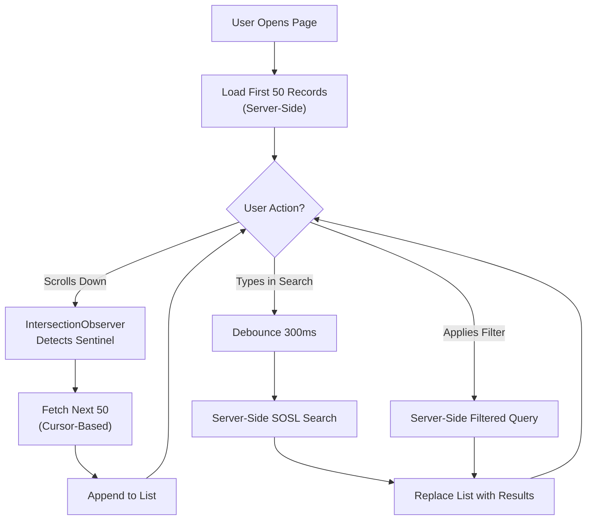

**Strategy: Server-Side Pagination + Server-Side Search + Virtual Rendering**

1. **Never fetch all records** — use cursor-based pagination (keyset) instead of OFFSET
2. **Server-side search** — use SOSL for full-text search, not client-side filtering
3. **Virtual scrolling** — only render DOM elements visible in the viewport
4. **Debounce user input** — prevent API call storms on every keystroke

### 💻 Code Example

```java
// Apex Controller — Cursor-based pagination (avoids OFFSET 2000 limit)
public with sharing class InventoryController {
    @AuraEnabled
    public static InventoryResult getItems(String lastId, Integer pageSize, String searchTerm) {
        List<Inventory_Item__c> items;

        if (String.isNotBlank(searchTerm)) {
            // SOSL for full-text search
            String searchQuery = searchTerm + '*';
            List<List<SObject>> results = [
                FIND :searchQuery IN ALL FIELDS
                RETURNING Inventory_Item__c(
                    Id, Name, SKU__c, Category__c, Quantity__c
                    ORDER BY Name LIMIT :pageSize
                )
            ];
            items = results[0];
        } else if (String.isNotBlank(lastId)) {
            // Cursor-based pagination
            items = [
                SELECT Id, Name, SKU__c, Category__c, Quantity__c
                FROM Inventory_Item__c
                WHERE Id > :lastId
                ORDER BY Id
                LIMIT :pageSize
            ];
        } else {
            // First page
            items = [
                SELECT Id, Name, SKU__c, Category__c, Quantity__c
                FROM Inventory_Item__c
                ORDER BY Id
                LIMIT :pageSize
            ];
        }

        return new InventoryResult(items, items.size() == pageSize);
    }

    public class InventoryResult {
        @AuraEnabled public List<Inventory_Item__c> records;
        @AuraEnabled public Boolean hasMore;

        public InventoryResult(List<Inventory_Item__c> records, Boolean hasMore) {
            this.records = records;
            this.hasMore = hasMore;
        }
    }
}
```

```javascript
// LWC — Infinite scroll with debounced search
import { LightningElement } from 'lwc';
import getItems from '@salesforce/apex/InventoryController.getItems';

export default class InventoryList extends LightningElement {
    records = [];
    lastId = null;
    hasMore = true;
    isLoading = false;
    searchTerm = '';
    _debounceTimer;
    _observer;

    connectedCallback() {
        this.loadMore();
    }

    renderedCallback() {
        this.setupObserver();
    }

    setupObserver() {
        const sentinel = this.template.querySelector('[data-id="sentinel"]');
        if (!sentinel || this._observer) return;

        this._observer = new IntersectionObserver((entries) => {
            if (entries[0].isIntersecting && !this.isLoading && this.hasMore) {
                this.loadMore();
            }
        }, { rootMargin: '200px' });

        this._observer.observe(sentinel);
    }

    async loadMore() {
        if (this.isLoading) return;
        this.isLoading = true;

        try {
            const result = await getItems({
                lastId: this.lastId,
                pageSize: 50,
                searchTerm: this.searchTerm
            });

            this.records = [...this.records, ...result.records];
            this.hasMore = result.hasMore;

            if (result.records.length > 0) {
                this.lastId = result.records[result.records.length - 1].Id;
            }
        } catch (error) {
            console.error(error);
        } finally {
            this.isLoading = false;
        }
    }

    handleSearch(event) {
        clearTimeout(this._debounceTimer);
        this._debounceTimer = setTimeout(() => {
            this.searchTerm = event.target.value;
            this.records = [];
            this.lastId = null;
            this.hasMore = true;
            this.loadMore();
        }, 300);
    }
}
```

### 🔄 Follow-up Questions

1. **"Why cursor-based over offset-based pagination?"** — OFFSET has a 2,000 limit and performs poorly at high offsets (the database still scans skipped rows). Cursor-based uses `WHERE Id > :lastId` which leverages the index.
2. **"How would you implement virtual scrolling?"** — Calculate visible items based on scroll position and item height. Render only those items plus a buffer, using `transform: translateY()` to position them correctly in a container with the total expected height.
3. **"What about using `lightning-datatable` with infinite loading?"** — `lightning-datatable` supports `enable-infinite-loading` and `onloadmore` event natively, which is the preferred approach when the table layout suffices.

---

## Scenario 2: Child Component Needs to Notify Its Grandparent

### 🎯 The Scenario

> *"You have a component hierarchy: `OrderPage` > `OrderDetails` > `LineItem`. When a user deletes a line item in the `LineItem` component, the `OrderPage` (grandparent) needs to refresh the order total. How do you implement this communication?"*

### 🤔 Key Considerations

- Custom events only bubble one level by default
- Event bubbling with `bubbles: true` crosses shadow DOM boundaries with `composed: true`
- Lightning Message Service works across unrelated components but is heavier
- Each approach has trade-offs in coupling, testability, and maintainability

### ✅ Recommended Approach

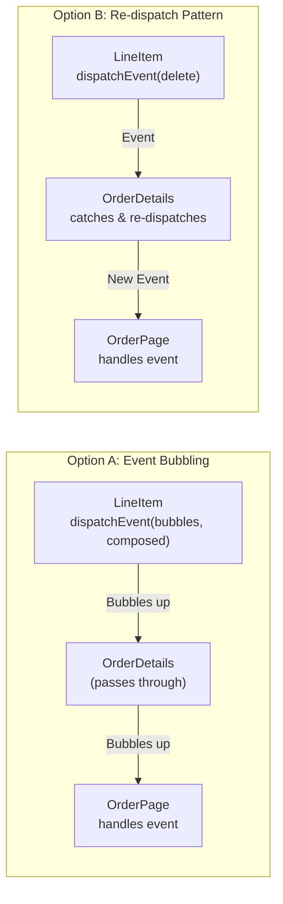

**Recommended: Option B — Re-dispatch Pattern** for most cases.

While event bubbling with `bubbles: true, composed: true` is simpler code-wise, the re-dispatch pattern is preferred because:
- Each component layer can transform or enrich the event data
- Components remain independently testable
- The contract between each parent-child pair is explicit

### 💻 Code Example

```javascript
// LineItem.js (grandchild)
handleDelete() {
    this.dispatchEvent(new CustomEvent('deleteitem', {
        detail: { lineItemId: this.lineItem.Id }
    }));
}

// OrderDetails.js (child) — catches and re-dispatches
// In template: <c-line-item ondeleteitem={handleLineItemDelete}>
handleLineItemDelete(event) {
    const lineItemId = event.detail.lineItemId;

    // Optionally enrich with context only this component knows
    this.dispatchEvent(new CustomEvent('lineitemdeleted', {
        detail: {
            lineItemId,
            orderDetailId: this.orderDetail.Id,
            remainingItems: this.lineItems.length - 1
        }
    }));
}

// OrderPage.js (grandparent)
// In template: <c-order-details onlineitemdeleted={handleLineItemDeleted}>
handleLineItemDeleted(event) {
    const { lineItemId, remainingItems } = event.detail;
    this.refreshOrderTotal();
}
```

```javascript
// ALTERNATIVE: Bubbling approach (simpler but tighter coupling)
// LineItem.js
handleDelete() {
    this.dispatchEvent(new CustomEvent('deleteitem', {
        detail: { lineItemId: this.lineItem.Id },
        bubbles: true,   // Bubble through DOM
        composed: true    // Cross shadow DOM boundaries
    }));
}

// OrderPage.js — listens directly (OrderDetails does nothing)
// Must use addEventListener, not template attribute:
connectedCallback() {
    this.template.addEventListener('deleteitem', this.handleDelete.bind(this));
}
```

### 🔄 Follow-up Questions

1. **"When would you use LMS instead?"** — When components aren't in the same DOM hierarchy (e.g., on different regions of a Lightning page), or when the communication pattern is publish/subscribe with multiple listeners.
2. **"What about `pubsub` pattern?"** — The old `pubsub` utility library is deprecated. Use Lightning Message Service for cross-component communication in modern LWC.
3. **"Does `composed: true` have security implications?"** — Yes, it exposes the event outside the shadow DOM boundary, making the internal implementation visible to any ancestor. This breaks encapsulation.

---

## Scenario 3: Share State Across Unrelated Components on the Same Lightning Page

### 🎯 The Scenario

> *"You have a Lightning Record Page with three independent LWCs: a `ContactFilter` component in the sidebar, a `ContactList` component in the main area, and a `ContactMap` component showing locations. When the user selects a filter, both the list and map should update. These components are not in a parent-child relationship."*

### 🤔 Key Considerations

- Components are siblings placed independently on a Lightning Page via App Builder
- No shared parent component to mediate communication
- Need a pub/sub mechanism that works across component boundaries
- State synchronization must be consistent across all subscribers

### ✅ Recommended Approach

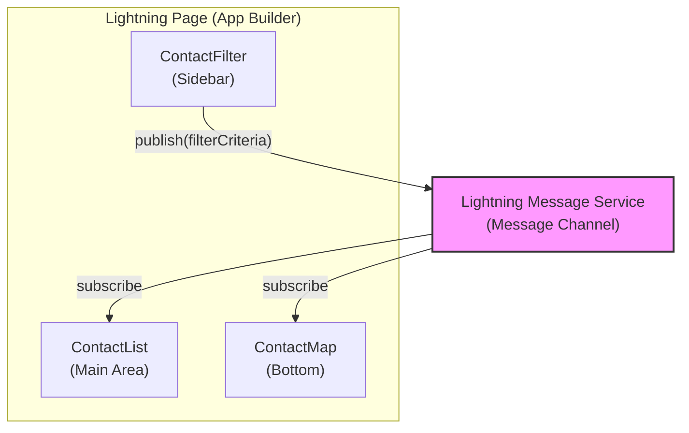

**Use Lightning Message Service (LMS)** — the platform-recommended solution for cross-component communication.

### 💻 Code Example

**Step 1: Create the Message Channel** (deploy as metadata)
```xml
<!-- force-app/main/default/messageChannels/ContactFilters.messageChannel-meta.xml -->
<?xml version="1.0" encoding="UTF-8"?>
<LightningMessageChannel xmlns="http://soap.sforce.com/2006/04/metadata">
    <masterLabel>Contact Filters</masterLabel>
    <isExposed>true</isExposed>
    <description>Publishes contact filter criteria across components</description>
    <lightningMessageFields>
        <fieldName>filterCriteria</fieldName>
        <description>JSON string of filter criteria</description>
    </lightningMessageFields>
    <lightningMessageFields>
        <fieldName>source</fieldName>
        <description>Source component identifier</description>
    </lightningMessageFields>
</LightningMessageChannel>
```

**Step 2: Publisher (ContactFilter)**
```javascript
import { LightningElement, wire } from 'lwc';
import { publish, MessageContext } from 'lightning/messageService';
import CONTACT_FILTERS from '@salesforce/messageChannel/ContactFilters__c';

export default class ContactFilter extends LightningElement {
    @wire(MessageContext)
    messageContext;

    selectedDepartment = '';
    selectedCity = '';

    handleFilterChange() {
        const payload = {
            filterCriteria: JSON.stringify({
                department: this.selectedDepartment,
                city: this.selectedCity
            }),
            source: 'contactFilter'
        };

        publish(this.messageContext, CONTACT_FILTERS, payload);
    }
}
```

**Step 3: Subscriber (ContactList)**
```javascript
import { LightningElement, wire } from 'lwc';
import { subscribe, unsubscribe, MessageContext } from 'lightning/messageService';
import CONTACT_FILTERS from '@salesforce/messageChannel/ContactFilters__c';
import getFilteredContacts from '@salesforce/apex/ContactController.getFilteredContacts';

export default class ContactList extends LightningElement {
    @wire(MessageContext)
    messageContext;

    contacts = [];
    subscription = null;

    connectedCallback() {
        this.subscribeToChannel();
    }

    disconnectedCallback() {
        this.unsubscribeFromChannel();
    }

    subscribeToChannel() {
        this.subscription = subscribe(
            this.messageContext,
            CONTACT_FILTERS,
            (message) => this.handleFilterMessage(message)
        );
    }

    unsubscribeFromChannel() {
        unsubscribe(this.subscription);
        this.subscription = null;
    }

    async handleFilterMessage(message) {
        const criteria = JSON.parse(message.filterCriteria);
        try {
            this.contacts = await getFilteredContacts({
                department: criteria.department,
                city: criteria.city
            });
        } catch (error) {
            console.error('Filter error:', error);
        }
    }
}
```

### 🔄 Follow-up Questions

1. **"Can LMS work between an LWC and an Aura component?"** — Yes! LMS is framework-agnostic. Aura components use `lightning:messageChannel` in their markup to subscribe.
2. **"What about using a shared service/store module instead?"** — A shared JS module with an observable pattern works but doesn't survive component destruction/re-creation. LMS is lifecycle-aware and platform-managed.
3. **"How do you test LMS in Jest?"** — Import `@salesforce/messageChannel/ChannelName__c` and mock it. Use `publish` and `subscribe` from `lightning/messageService` stubs. LWC Jest utilities include built-in support.

---

## Scenario 4: Migrate an Aura Component with App/Component Events to LWC

### 🎯 The Scenario

> *"Your team has an Aura component library with 15 components that heavily use Application Events and Component Events. Management wants to migrate to LWC. How do you plan and execute this migration?"*

### 🤔 Key Considerations

- Aura Application Events → no direct LWC equivalent (use LMS)
- Aura Component Events → LWC Custom Events
- `aura:method` → `@api` methods
- `v.body` and facets → slots
- Aura lifecycle (`init`, `render`, `afterRender`) → LWC lifecycle hooks
- Aura doesn't support gradual migration natively, but LWC can be wrapped in Aura

### ✅ Recommended Approach

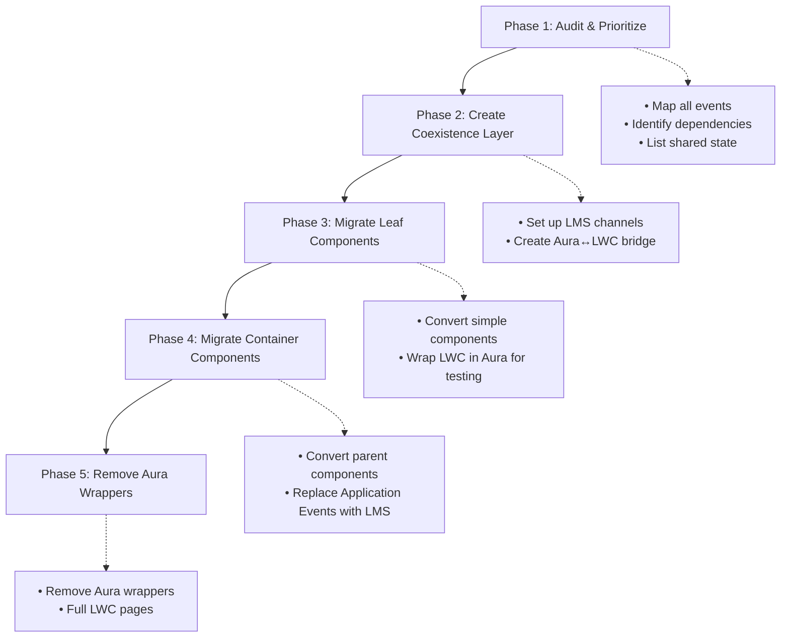

### 💻 Code Example

**Aura to LWC Event Mapping:**

| Aura Pattern | LWC Equivalent |
|-------------|----------------|
| `$A.get("e.c:MyAppEvent").fire()` | `publish(messageContext, CHANNEL, payload)` |
| `<aura:registerEvent name="notify" type="c:NotifyEvent"/>` | `this.dispatchEvent(new CustomEvent('notify'))` |
| `<aura:handler event="c:MyAppEvent" action="{!c.handleIt}"/>` | `subscribe(messageContext, CHANNEL, handler)` |
| `<aura:method name="refresh"/>` | `@api refresh() { }` |
| `{!v.body}` | `<slot></slot>` |
| `component.get("v.myAttr")` | `this.myProp` (reactive property) |

**Wrapping LWC in Aura (coexistence):**
```html
<!-- auraWrapper.cmp — allows LWC to be used where Aura is expected -->
<aura:component>
    <aura:attribute name="recordId" type="String" />
    <aura:registerEvent name="appEvent" type="c:MyAppEvent" />

    <c:myNewLwcComponent
        record-id="{!v.recordId}"
        onnotify="{!c.handleNotify}">
    </c:myNewLwcComponent>
</aura:component>
```

```javascript
// auraWrapperController.js — bridges LWC event to Aura application event
({
    handleNotify: function(component, event) {
        var appEvent = $A.get("e.c:MyAppEvent");
        appEvent.setParams({ data: event.getParam("detail") });
        appEvent.fire();
    }
})
```

### 🔄 Follow-up Questions

1. **"Can you embed an Aura component inside LWC?"** — No. LWC can be embedded in Aura, but not the reverse. This is why you migrate leaf components first.
2. **"How do you handle `force:navigateToComponent` in LWC?"** — Use `NavigationMixin` from `lightning/navigation`. Aura navigation events have no direct LWC equivalent.
3. **"What about Aura design tokens and styles?"** — Use SLDS design tokens and CSS custom properties in LWC. Aura-specific tokens (from `.tokens` files) need to be mapped to CSS variables.

---

## Scenario 5: Build an LWC That Works in Both Lightning Experience and Experience Cloud

### 🎯 The Scenario

> *"You need to build a case submission form that works in both Lightning Experience (for internal agents) and Experience Cloud (for external customers). The form should adapt its behavior based on the context — agents see internal fields, customers see a simplified view."*

### 🤔 Key Considerations

- Experience Cloud has different security context (guest user, community user)
- `ShowToastEvent` doesn't work in Experience Cloud
- Navigation works differently (no `force:` events)
- CSS styling: SLDS vs. Experience Cloud themes
- Some standard Lightning base components behave differently
- `@salesforce/community/Id` to detect community context

### ✅ Recommended Approach

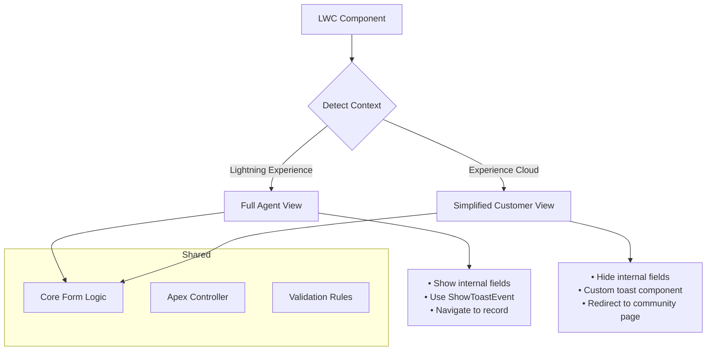

### 💻 Code Example

```javascript
import { LightningElement, api } from 'lwc';
import { NavigationMixin } from 'lightning/navigation';
import { ShowToastEvent } from 'lightning/platformShowToastEvent';
import communityId from '@salesforce/community/Id';
import isGuest from '@salesforce/user/isGuest';
import userProfileName from '@salesforce/schema/User.Profile.Name';
import submitCase from '@salesforce/apex/CaseSubmissionController.submitCase';

export default class CaseSubmissionForm extends NavigationMixin(LightningElement) {
    @api recordId;

    // Context detection
    get isExperienceCloud() {
        return !!communityId;
    }

    get isInternalUser() {
        return !this.isExperienceCloud && !isGuest;
    }

    get showInternalFields() {
        // Only show priority, internal notes to agents
        return this.isInternalUser;
    }

    // Adaptive toast notification
    showNotification(title, message, variant) {
        if (this.isExperienceCloud) {
            // Custom toast for Experience Cloud
            this.template.querySelector('c-custom-toast')?.show({
                title, message, variant
            });
        } else {
            // Standard toast for Lightning Experience
            this.dispatchEvent(new ShowToastEvent({ title, message, variant }));
        }
    }

    // Adaptive navigation
    navigateAfterSubmit(caseId) {
        if (this.isExperienceCloud) {
            // Navigate to community page
            this[NavigationMixin.Navigate]({
                type: 'comm__namedPage',
                attributes: {
                    name: 'Case_Confirmation__c'
                },
                state: {
                    caseId: caseId
                }
            });
        } else {
            // Navigate to case record page
            this[NavigationMixin.Navigate]({
                type: 'standard__recordPage',
                attributes: {
                    recordId: caseId,
                    objectApiName: 'Case',
                    actionName: 'view'
                }
            });
        }
    }

    async handleSubmit() {
        try {
            const caseId = await submitCase({
                subject: this.subject,
                description: this.description,
                priority: this.isInternalUser ? this.priority : 'Medium'
            });

            this.showNotification('Success', 'Case submitted successfully', 'success');
            this.navigateAfterSubmit(caseId);
        } catch (error) {
            this.showNotification('Error', error.body?.message, 'error');
        }
    }
}
```

### 🔄 Follow-up Questions

1. **"How do you handle different permission sets for internal vs. external users?"** — The Apex controller should enforce object and field-level security with `WITH SECURITY_ENFORCED` or `Security.stripInaccessible()`. Don't rely on the UI to hide fields.
2. **"Can you share the same component metadata for both contexts?"** — Yes, set `<target>lightning__RecordPage</target>` and `<target>lightningCommunity__Page</target>` in the `.js-meta.xml`.
3. **"How do you test both contexts?"** — Create a community (Experience Cloud site) in your scratch org and test the component in both environments. Use different user profiles in your test runs.

---

## Scenario 6: Handle Governor Limits When Making Multiple Apex Calls from LWC

### 🎯 The Scenario

> *"Your LWC dashboard makes 6 separate Apex calls on page load to fetch different widgets' data. Users report intermittent 'Too many SOQL queries' errors. How do you diagnose and fix this?"*

### 🤔 Key Considerations

- Each Apex call in a single transaction context shares governor limits
- `@wire` calls with `cacheable=true` may share a transaction
- Imperative Apex calls are separate transactions by default
- The "boxcar" optimization can batch multiple wire calls into one transaction
- Consider consolidating Apex methods

### ✅ Recommended Approach

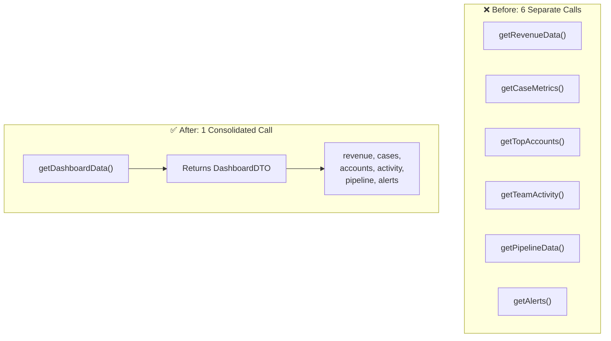

### 💻 Code Example

```java
// ❌ BEFORE: 6 separate @AuraEnabled methods, each running SOQL
// These can get boxcar'd into a single transaction, hitting the 100 SOQL limit

// ✅ AFTER: Single consolidated method
public with sharing class DashboardController {

    @AuraEnabled(cacheable=true)
    public static DashboardDTO getDashboardData() {
        DashboardDTO dto = new DashboardDTO();

        // All queries in a single transaction — controlled SOQL count
        dto.revenue = [
            SELECT SUM(Amount) total FROM Opportunity
            WHERE IsClosed = true AND CloseDate = THIS_YEAR
        ][0].get('total');

        dto.openCases = [SELECT COUNT() FROM Case WHERE IsClosed = false];

        dto.topAccounts = [
            SELECT Name, AnnualRevenue FROM Account
            ORDER BY AnnualRevenue DESC NULLS LAST LIMIT 5
        ];

        dto.recentActivities = [
            SELECT Subject, ActivityDate, Who.Name FROM Task
            WHERE OwnerId = :UserInfo.getUserId()
            ORDER BY ActivityDate DESC LIMIT 10
        ];

        dto.pipeline = [
            SELECT StageName, SUM(Amount) total
            FROM Opportunity
            WHERE IsClosed = false
            GROUP BY StageName
        ];

        dto.alerts = [
            SELECT Id, Subject, Priority FROM Case
            WHERE Priority = 'High' AND IsClosed = false
            LIMIT 5
        ];

        return dto;  // 6 SOQL queries in 1 call vs. potentially 6+ calls
    }

    public class DashboardDTO {
        @AuraEnabled public Decimal revenue;
        @AuraEnabled public Integer openCases;
        @AuraEnabled public List<Account> topAccounts;
        @AuraEnabled public List<Task> recentActivities;
        @AuraEnabled public List<AggregateResult> pipeline;
        @AuraEnabled public List<Case> alerts;
    }
}
```

```javascript
// LWC — single wire call distributes data to child components
import { LightningElement, wire } from 'lwc';
import getDashboardData from '@salesforce/apex/DashboardController.getDashboardData';

export default class Dashboard extends LightningElement {
    dashboardData;

    @wire(getDashboardData)
    wiredDashboard({ data, error }) {
        if (data) {
            this.dashboardData = data;
        }
    }

    get revenueData() { return this.dashboardData?.revenue; }
    get caseMetrics() { return this.dashboardData?.openCases; }
    get topAccounts() { return this.dashboardData?.topAccounts; }
    // ... distribute to child components via @api properties
}
```

### 🔄 Follow-up Questions

1. **"What is the 'boxcar' optimization and how does it cause this issue?"** — The LWC framework batches multiple `@wire` calls made in the same render cycle into a single Apex transaction (a "boxcar"). If each wired method runs 20 SOQL queries, 6 boxcar'd calls = 120 queries, exceeding the 100 SOQL limit.
2. **"What if different widgets need different cache strategies?"** — Use a mix of `cacheable=true` wire for static data and imperative calls for real-time data. Or split into two calls: one cached composite and one real-time.
3. **"How do you handle the response if one data source fails?"** — Use try/catch around each query block and return partial results. Set error flags in the DTO so the UI can show per-widget error states.

---

## Scenario 7: Implement Offline-Capable Functionality in a Mobile LWC

### 🎯 The Scenario

> *"Field technicians use the Salesforce mobile app in remote areas with spotty connectivity. They need to create and update Work Order records even when offline. Design an LWC solution that handles offline scenarios."*

### 🤔 Key Considerations

- Salesforce Mobile App has limited offline support natively
- LWC Offline (GA in recent releases) provides record CRUD offline
- GraphQL wire adapter works offline with draft support
- Need to handle conflict resolution when syncing
- UI must indicate online/offline status and queued changes

### ✅ Recommended Approach

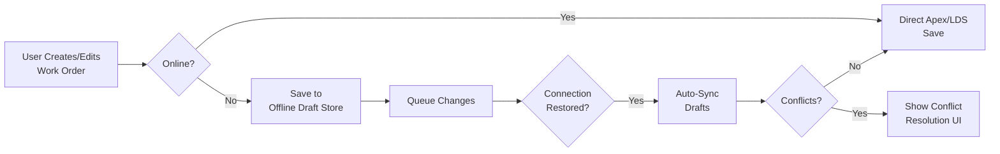

### 💻 Code Example

```javascript
// Using LWC Offline with GraphQL wire adapter (API v59+)
import { LightningElement, wire } from 'lwc';
import { gql, graphql } from 'lightning/uiGraphQLApi';
import { updateRecord } from 'lightning/uiRecordApi';
import { getRecord } from 'lightning/uiRecordApi';

// Offline-capable approach with network detection
export default class OfflineWorkOrder extends LightningElement {
    workOrderId;
    isOnline = navigator.onLine;

    connectedCallback() {
        window.addEventListener('online', () => {
            this.isOnline = true;
            this.syncDrafts();
        });
        window.addEventListener('offline', () => {
            this.isOnline = false;
        });
    }

    // Using GraphQL wire for offline-capable data access
    @wire(graphql, {
        query: gql`
            query getWorkOrders {
                uiapi {
                    query {
                        WorkOrder(
                            where: { OwnerId: { eq: $currentUserId } }
                            orderBy: { StartDate: { order: DESC } }
                            first: 20
                        ) {
                            edges {
                                node {
                                    Id
                                    Subject { value }
                                    Status { value }
                                    Description { value }
                                    StartDate { value }
                                }
                            }
                        }
                    }
                }
            }
        `,
        variables: '$graphqlVariables'
    })
    workOrders;

    async handleSave(event) {
        const fields = event.detail.fields;

        try {
            // updateRecord works offline — creates a draft
            await updateRecord({ fields });

            this.showNotification(
                this.isOnline ? 'Saved' : 'Saved Offline',
                this.isOnline
                    ? 'Work order updated successfully.'
                    : 'Changes queued. Will sync when online.',
                'success'
            );
        } catch (error) {
            console.error('Save error:', error);
        }
    }

    async syncDrafts() {
        // The platform handles draft synchronization automatically
        // when using LDS/GraphQL in offline mode.
        // Show a notification that sync is in progress.
        this.showNotification('Syncing', 'Uploading offline changes...', 'info');
    }

    get statusIndicator() {
        return this.isOnline ? '🟢 Online' : '🟠 Offline Mode';
    }
}
```

### 🔄 Follow-up Questions

1. **"What records are available offline?"** — Only records that have been primed (previously loaded) in the mobile app are available offline. You can configure offline priming with briefcase assignments.
2. **"How does conflict resolution work?"** — When a record is modified both offline and by another user, the platform surfaces a conflict. The default behavior is "last write wins," but you can implement custom conflict resolution.
3. **"What are the limitations of LWC Offline?"** — No imperative Apex calls offline, only LDS and GraphQL wire. Custom objects need to be enabled for mobile offline. Complex business logic must run on sync.

---

## Scenario 8: Debug a Wire Service That Returns Stale Data After a Record Update

### 🎯 The Scenario

> *"A developer reports that after updating a record using `updateRecord` from Lightning Data Service, a wired property on the same component still shows the old data. The user has to refresh the entire page to see the update. How do you diagnose and fix this?"*

### 🤔 Key Considerations

- `@wire` with `cacheable=true` Apex methods returns cached results
- LDS cache and Apex cache are separate systems
- `refreshApex` requires the original wire result reference
- `getRecord` (LDS wire) auto-refreshes after `updateRecord`, but custom Apex wires don't

### ✅ Recommended Approach

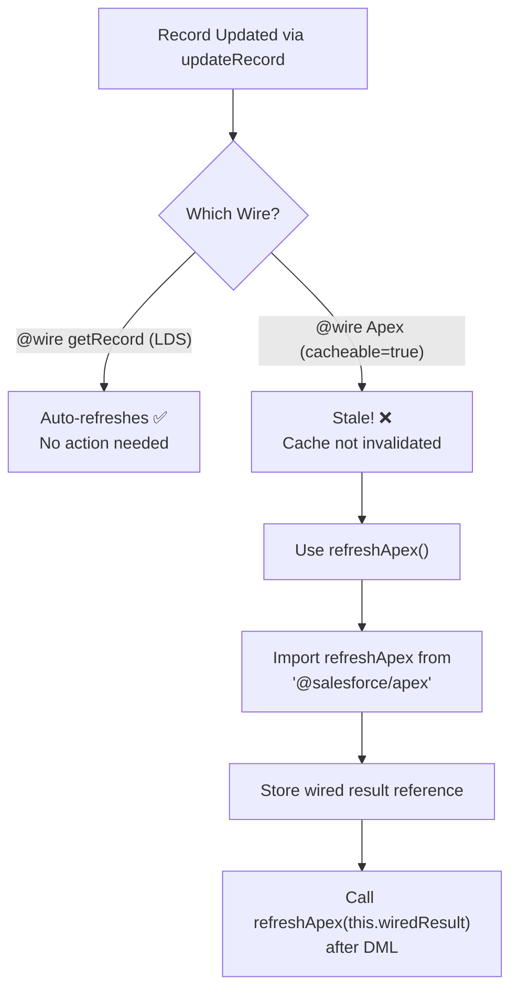

### 💻 Code Example

```javascript
// ❌ BROKEN: Stale data after update
import { LightningElement, wire } from 'lwc';
import getAccountDetails from '@salesforce/apex/AccountController.getAccountDetails';
import { updateRecord } from 'lightning/uiRecordApi';

export default class BrokenExample extends LightningElement {
    @wire(getAccountDetails, { accountId: '$recordId' })
    account; // This will be stale after updateRecord!

    async handleUpdate() {
        await updateRecord({ fields: { Id: this.recordId, Name: 'New Name' } });
        // The @wire above still shows old data!
    }
}
```

```javascript
// ✅ FIXED: Refresh Apex cache after update
import { LightningElement, api, wire } from 'lwc';
import getAccountDetails from '@salesforce/apex/AccountController.getAccountDetails';
import { updateRecord } from 'lightning/uiRecordApi';
import { refreshApex } from '@salesforce/apex';

export default class FixedExample extends LightningElement {
    @api recordId;
    _wiredResult; // Store the raw wire result

    @wire(getAccountDetails, { accountId: '$recordId' })
    wiredAccount(result) {
        // Store the ENTIRE result (including provisioned data AND error)
        this._wiredResult = result;
        if (result.data) {
            this.account = result.data;
        } else if (result.error) {
            this.error = result.error;
        }
    }

    async handleUpdate() {
        try {
            await updateRecord({
                fields: { Id: this.recordId, Name: 'New Name' }
            });

            // Force the wire to re-fetch from server
            await refreshApex(this._wiredResult);
            // Now this.account has the latest data!
        } catch (error) {
            console.error('Update failed:', error);
        }
    }
}
```

> [!WARNING]
> The most common mistake: passing the **processed data** to `refreshApex` instead of the **raw wire result**. `refreshApex(this.account)` ❌ won't work. You must pass `refreshApex(this._wiredResult)` ✅ — the original provisioned result object.

### 🔄 Follow-up Questions

1. **"Why does `getRecord` auto-refresh but Apex wire doesn't?"** — `getRecord` uses Lightning Data Service, which has an internal record cache that listens for record changes. Custom Apex methods are opaque to LDS — it doesn't know what records you queried.
2. **"Can you force a `cacheable=true` method to bypass the cache?"** — No, not with `@wire`. You can use imperative Apex (without `cacheable=true`) to always get fresh data, but you lose caching benefits.
3. **"What about `notifyRecordUpdateAvailable`?"** — Introduced in API v59+, it tells the LDS cache that specific record IDs have changed. Use it when you modify records via Apex (not LDS) and want LDS wires on those records to refresh.

---

## Scenario 9: Create a Reusable Component Library for Your Organization

### 🎯 The Scenario

> *"Your company has 8 Salesforce development teams building LWCs independently. There's a lot of duplicated code — every team has their own modal, data table wrapper, and toast utility. Management asks you to design and implement a shared component library. How do you approach this?"*

### 🤔 Key Considerations

- Packaging strategy (unlocked packages vs. unmanaged vs. 2GP)
- Versioning and backward compatibility
- Documentation and discoverability
- Code review and contribution process
- Dependency management between packages
- Testing requirements for shared components

### ✅ Recommended Approach

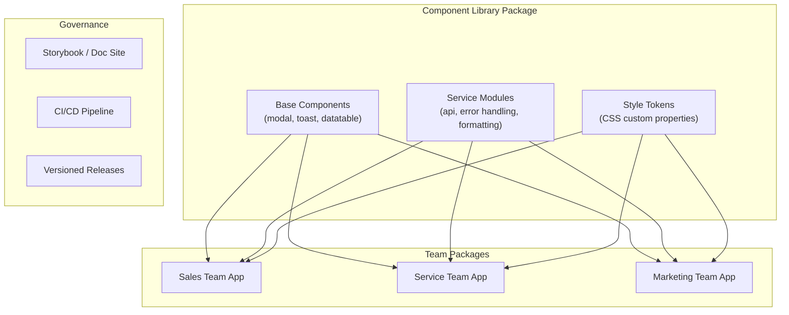

### 💻 Code Example

**Component Library — Design Principles:**

```javascript
// 1. Configurable via @api properties (not hardcoded)
// 2. Themeable via CSS custom properties
// 3. Accessible (ARIA, keyboard navigation)
// 4. Well-documented with JSDoc

/**
 * @description A configurable data table with built-in pagination,
 * sorting, and search capabilities.
 *
 * @example
 * <c-lib-data-table
 *     columns={columns}
 *     data-source="apex"
 *     apex-method="ContactController.getContacts"
 *     page-size="25"
 *     searchable
 *     sortable
 *     onselectrow={handleRowSelect}>
 * </c-lib-data-table>
 */
export default class LibDataTable extends LightningElement {
    @api columns = [];
    @api pageSize = 10;
    @api searchable = false;
    @api sortable = false;

    // CSS custom properties for theming
    static stylesheets = [];
}
```

```css
/* Theme tokens via CSS custom properties */
:host {
    --lib-primary-color: var(--lwc-brandPrimary, #0176d3);
    --lib-border-radius: var(--lwc-borderRadiusMedium, 4px);
    --lib-spacing-medium: var(--lwc-spacingMedium, 1rem);
    --lib-font-size-body: var(--lwc-fontSize3, 0.8125rem);
}

/* Consuming teams can override:
   c-lib-data-table {
       --lib-primary-color: #e74c3c;
   }
*/
```

```xml
<!-- sfdx-project.json — Unlocked package structure -->
{
    "packageDirectories": [
        {
            "path": "force-app/core-library",
            "package": "CoreComponentLibrary",
            "versionName": "Spring 2024",
            "versionNumber": "2.3.0.NEXT",
            "default": false
        }
    ],
    "namespace": "corelib",
    "packageAliases": {
        "CoreComponentLibrary": "0Ho..."
    }
}
```

### 🔄 Follow-up Questions

1. **"How do you handle breaking changes in a shared library?"** — Use semantic versioning (SemVer). Major version bumps for breaking changes. Maintain backward compatibility in minor releases. Use deprecation warnings before removal.
2. **"What's the testing strategy?"** — Library components need 85%+ code coverage with Jest unit tests AND integration tests. Include a demo/playground app for manual testing. Each team's CI pipeline should test against the latest library version.
3. **"How do teams discover and learn about available components?"** — Build a documentation site (Storybook-like) with live examples, API documentation generated from JSDoc, and a component playground. Publish release notes for each version.

---

## Scenario 10: Implement Role-Based UI Rendering in LWC

### 🎯 The Scenario

> *"Your app needs to show different UI elements based on the user's role: Admins see edit/delete buttons, Managers see approval buttons, and regular Users only see read-only views. The backend must also enforce these permissions. Design the solution."*

### 🤔 Key Considerations

- Client-side UI hiding is NOT security — always enforce in Apex
- Custom permissions are preferred over role checks for flexibility
- Wire adapters for user info vs. imperative Apex for permissions
- Performance: don't make extra round-trips for permission checks
- Avoid hardcoding role names in JavaScript

### ✅ Recommended Approach

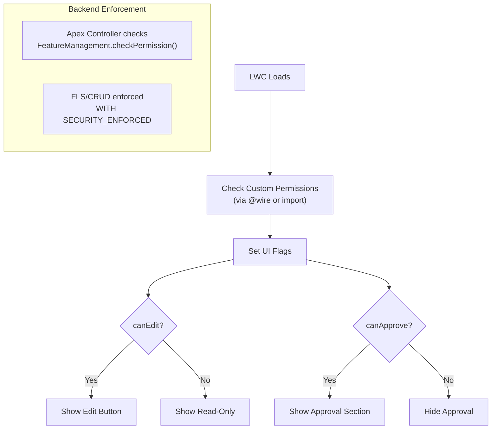

### 💻 Code Example

```javascript
// Import custom permissions — the platform-recommended approach
import hasEditPermission from '@salesforce/customPermission/Can_Edit_Records';
import hasApprovePermission from '@salesforce/customPermission/Can_Approve_Records';
import hasAdminAccess from '@salesforce/customPermission/Admin_Access';
import userProfileName from '@salesforce/schema/User.Profile.Name';

export default class RoleBasedUI extends LightningElement {
    // These are resolved at load time — no extra API call
    get canEdit() {
        return hasEditPermission || hasAdminAccess;
    }

    get canDelete() {
        return hasAdminAccess;
    }

    get canApprove() {
        return hasApprovePermission;
    }

    get isReadOnly() {
        return !this.canEdit;
    }
}
```

```html
<template>
    <!-- Conditional rendering based on permissions -->
    <template lwc:if={canEdit}>
        <lightning-button label="Edit" onclick={handleEdit}></lightning-button>
    </template>

    <template lwc:if={canDelete}>
        <lightning-button label="Delete" variant="destructive" onclick={handleDelete}></lightning-button>
    </template>

    <template lwc:if={canApprove}>
        <div class="approval-section">
            <lightning-button label="Approve" variant="success" onclick={handleApprove}></lightning-button>
            <lightning-button label="Reject" variant="destructive" onclick={handleReject}></lightning-button>
        </div>
    </template>
</template>
```

```java
// Apex — ALWAYS enforce server-side, never trust the client
public with sharing class RecordController {
    @AuraEnabled
    public static void deleteRecord(Id recordId) {
        // Double-check permission server-side
        if (!FeatureManagement.checkPermission('Admin_Access')) {
            throw new AuraHandledException('Insufficient permissions to delete.');
        }

        // Also check CRUD
        if (!Schema.sObjectType.MyObject__c.isDeletable()) {
            throw new AuraHandledException('You do not have delete access.');
        }

        delete [SELECT Id FROM MyObject__c WHERE Id = :recordId];
    }
}
```

### 🔄 Follow-up Questions

1. **"Why custom permissions over profile/role checks?"** — Custom permissions are assignable via Permission Sets, which are more flexible and follow the principle of least privilege. Role checks are brittle (role names change, hierarchies shift).
2. **"What if you need to check object-level CRUD in the UI?"** — Use `getObjectInfo` wire adapter, which returns `createable`, `updateable`, `deletable` properties for the current user on the specified object.
3. **"How do you prevent a malicious user from enabling the hidden UI via browser dev tools?"** — You can't prevent client-side manipulation. That's why server-side enforcement (Apex permission checks, `WITH SECURITY_ENFORCED`, sharing rules) is mandatory. The UI is convenience, not security.

---

## Scenario 11: Handle File Upload with Progress Tracking and Preview

### 🎯 The Scenario

> *"Users need to upload documents (PDFs, images) to a Case record. They want to see upload progress, preview images before upload, and handle errors gracefully. The files could be up to 25MB."*

### 🤔 Key Considerations

- `lightning-file-upload` has a 2GB limit but limited customization
- For progress tracking, you need a custom upload solution
- Image previews use `FileReader` API
- Content Version / Content Document Link relationships
- Chunked upload for large files (avoid heap size limits)

### ✅ Recommended Approach

### 💻 Code Example

```html
<template>
    <lightning-card title="Upload Documents" icon-name="standard:file">
        <div class="slds-p-around_medium">
            <!-- Standard Lightning File Upload (simple approach) -->
            <lightning-file-upload
                label="Attach Files"
                name="fileUploader"
                accept={acceptedFormats}
                record-id={recordId}
                onuploadfinished={handleUploadFinished}
                multiple
            ></lightning-file-upload>

            <!-- OR: Custom upload with preview and progress -->
            <div class="slds-m-top_large">
                <h3 class="slds-text-heading_small slds-m-bottom_small">Custom Upload</h3>

                <input
                    type="file"
                    accept=".pdf,.png,.jpg,.jpeg"
                    onchange={handleFileSelect}
                    class="slds-file-selector__input"
                    multiple
                />

                <!-- File Previews -->
                <template lwc:if={filePreviews.length}>
                    <div class="slds-grid slds-wrap slds-gutters slds-m-top_medium">
                        <template for:each={filePreviews} for:item="file">
                            <div key={file.name} class="slds-col slds-size_1-of-4 slds-m-bottom_small">
                                <div class="slds-box">
                                    <template lwc:if={file.isImage}>
                                        
                                    </template>
                                    <template lwc:else>
                                        <lightning-icon icon-name="doctype:pdf" size="large"></lightning-icon>
                                    </template>
                                    <p class="slds-text-body_small slds-truncate">{file.name}</p>
                                    <p class="slds-text-body_small slds-text-color_weak">{file.sizeFormatted}</p>
                                    <!-- Progress Bar -->
                                    <template lwc:if={file.uploading}>
                                        <lightning-progress-bar
                                            value={file.progress}
                                            size="small"
                                        ></lightning-progress-bar>
                                    </template>
                                </div>
                            </div>
                        </template>
                    </div>
                </template>

                <lightning-button
                    label="Upload All"
                    variant="brand"
                    onclick={handleUploadAll}
                    disabled={noFilesSelected}
                    class="slds-m-top_medium"
                ></lightning-button>
            </div>
        </div>
    </lightning-card>
</template>
```

```javascript
import { LightningElement, api } from 'lwc';
import uploadFileChunk from '@salesforce/apex/FileUploadController.uploadFileChunk';

const MAX_FILE_SIZE = 25 * 1024 * 1024; // 25MB
const CHUNK_SIZE = 750000; // ~750KB per chunk (Apex heap limit safety)

export default class FileUploadWithProgress extends LightningElement {
    @api recordId;
    filePreviews = [];

    acceptedFormats = ['.pdf', '.png', '.jpg', '.jpeg'];

    handleFileSelect(event) {
        const files = event.target.files;
        this.filePreviews = [];

        Array.from(files).forEach(file => {
            if (file.size > MAX_FILE_SIZE) {
                // Show error for oversized file
                return;
            }

            const fileObj = {
                name: file.name,
                size: file.size,
                sizeFormatted: this.formatFileSize(file.size),
                isImage: file.type.startsWith('image/'),
                preview: null,
                file: file,
                progress: 0,
                uploading: false
            };

            // Generate preview for images
            if (fileObj.isImage) {
                const reader = new FileReader();
                reader.onload = (e) => {
                    fileObj.preview = e.target.result;
                    // Trigger re-render
                    this.filePreviews = [...this.filePreviews];
                };
                reader.readAsDataURL(file);
            }

            this.filePreviews = [...this.filePreviews, fileObj];
        });
    }

    async handleUploadAll() {
        for (let i = 0; i < this.filePreviews.length; i++) {
            await this.uploadFile(i);
        }
    }

    async uploadFile(index) {
        const fileObj = this.filePreviews[index];
        fileObj.uploading = true;
        this.filePreviews = [...this.filePreviews]; // Trigger re-render

        return new Promise((resolve, reject) => {
            const reader = new FileReader();
            reader.onload = async () => {
                try {
                    const base64 = reader.result.split(',')[1];
                    const totalChunks = Math.ceil(base64.length / CHUNK_SIZE);
                    let contentVersionId = null;

                    for (let chunk = 0; chunk < totalChunks; chunk++) {
                        const start = chunk * CHUNK_SIZE;
                        const end = Math.min(start + CHUNK_SIZE, base64.length);
                        const chunkData = base64.substring(start, end);

                        contentVersionId = await uploadFileChunk({
                            parentId: this.recordId,
                            fileName: fileObj.name,
                            base64Data: chunkData,
                            contentVersionId: contentVersionId
                        });

                        // Update progress
                        const progress = Math.round(((chunk + 1) / totalChunks) * 100);
                        this.filePreviews = this.filePreviews.map((fp, idx) =>
                            idx === index ? { ...fp, progress } : fp
                        );
                    }
                    resolve(contentVersionId);
                } catch (error) {
                    reject(error);
                }
            };
            reader.readAsDataURL(fileObj.file);
        });
    }

    formatFileSize(bytes) {
        if (bytes < 1024) return bytes + ' B';
        if (bytes < 1048576) return (bytes / 1024).toFixed(1) + ' KB';
        return (bytes / 1048576).toFixed(1) + ' MB';
    }

    get noFilesSelected() {
        return this.filePreviews.length === 0;
    }
}
```

### 🔄 Follow-up Questions

1. **"Why chunked upload instead of sending the whole file?"** — Apex has a 6MB heap size limit (12MB async). Base64 encoding increases file size by ~33%. So a 4MB file becomes ~5.3MB in base64, approaching the limit. Chunking keeps each call safely within limits.
2. **"How does `lightning-file-upload` work differently?"** — It uploads directly to the platform's file storage, bypassing Apex heap limits entirely. It handles chunking internally and is the recommended approach when customization isn't needed.
3. **"How do you handle virus scanning?"** — Salesforce automatically scans uploaded files. If a file is flagged, the ContentVersion record is created but the file body is quarantined. Check `ContentVersion.FileExtension` and `ContentVersion.ContentSize` after upload.

---

## Scenario 12: Build a Responsive Layout That Works on Desktop and Mobile

### 🎯 The Scenario

> *"Your LWC needs to display a dashboard with 4 metric cards, a data table, and a chart. On desktop, cards should be in a 4-column row. On tablet, 2 columns. On mobile, stacked vertically. The data table should become a card list on mobile."*

### 🤔 Key Considerations

- SLDS Grid system supports responsive breakpoints
- No `@media` queries access in shadow DOM — use SLDS responsive classes
- `lightning-layout` and `lightning-layout-item` support `size`, `small-device-size`, `medium-device-size`, `large-device-size`
- Consider touch targets for mobile (min 44x44px)
- Data table readability on small screens

### ✅ Recommended Approach

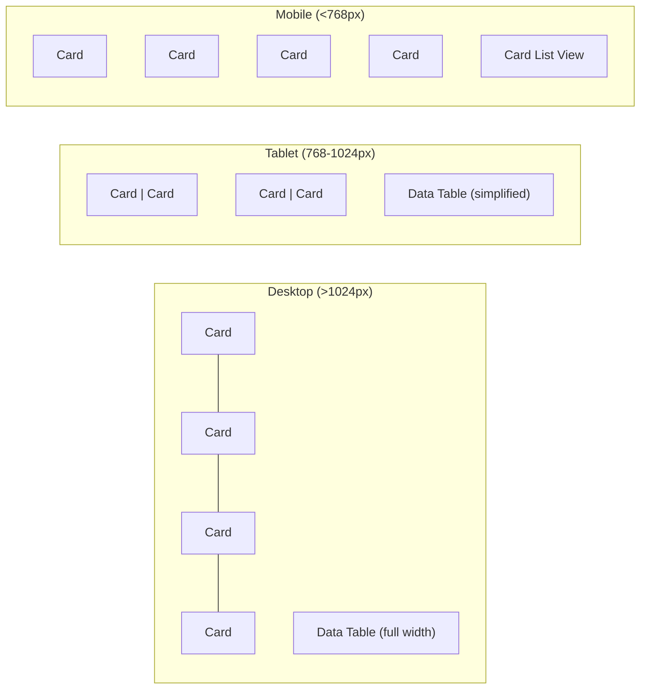

### 💻 Code Example

```html
<template>
    <lightning-card title="Sales Dashboard">
        <div class="slds-p-around_medium">
            <!-- Responsive Metric Cards using lightning-layout -->
            <lightning-layout multiple-rows>
                <template for:each={metrics} for:item="metric">
                    <lightning-layout-item
                        key={metric.id}
                        size="12"
                        small-device-size="6"
                        medium-device-size="3"
                        large-device-size="3"
                        padding="around-small"
                    >
                        <div class="slds-box slds-text-align_center slds-theme_shade">
                            <p class="slds-text-heading_large">{metric.value}</p>
                            <p class="slds-text-body_small slds-text-color_weak">{metric.label}</p>
                        </div>
                    </lightning-layout-item>
                </template>
            </lightning-layout>

            <!-- Desktop: Data Table -->
            <template lwc:if={isDesktop}>
                <lightning-datatable
                    key-field="Id"
                    data={records}
                    columns={columns}
                    class="slds-m-top_medium"
                ></lightning-datatable>
            </template>

            <!-- Mobile: Card List -->
            <template lwc:if={isMobile}>
                <div class="slds-m-top_medium">
                    <template for:each={records} for:item="record">
                        <div key={record.Id} class="slds-box slds-m-bottom_small">
                            <p class="slds-text-heading_small">{record.Name}</p>
                            <div class="slds-grid slds-m-top_x-small">
                                <div class="slds-col">
                                    <p class="slds-text-body_small slds-text-color_weak">Amount</p>
                                    <p>{record.Amount}</p>
                                </div>
                                <div class="slds-col">
                                    <p class="slds-text-body_small slds-text-color_weak">Stage</p>
                                    <p>{record.StageName}</p>
                                </div>
                            </div>
                        </div>
                    </template>
                </div>
            </template>
        </div>
    </lightning-card>
</template>
```

```javascript
import { LightningElement } from 'lwc';
import FORM_FACTOR from '@salesforce/client/formFactor';

export default class ResponsiveDashboard extends LightningElement {
    // FORM_FACTOR: 'Large' (desktop), 'Medium' (tablet), 'Small' (phone)
    formFactor = FORM_FACTOR;

    get isDesktop() {
        return this.formFactor === 'Large';
    }

    get isMobile() {
        return this.formFactor === 'Small';
    }

    get isTablet() {
        return this.formFactor === 'Medium';
    }

    metrics = [
        { id: '1', label: 'Total Revenue', value: '$1.2M' },
        { id: '2', label: 'New Leads', value: '342' },
        { id: '3', label: 'Win Rate', value: '67%' },
        { id: '4', label: 'Avg Deal Size', value: '$45K' }
    ];

    // Adapt columns based on form factor
    get columns() {
        const baseCols = [
            { label: 'Name', fieldName: 'Name' },
            { label: 'Amount', fieldName: 'Amount', type: 'currency' }
        ];

        if (this.isDesktop) {
            return [
                ...baseCols,
                { label: 'Stage', fieldName: 'StageName' },
                { label: 'Close Date', fieldName: 'CloseDate', type: 'date' },
                { label: 'Owner', fieldName: 'OwnerName' }
            ];
        }
        return baseCols; // Fewer columns on tablet
    }
}
```

### 🔄 Follow-up Questions

1. **"How does `FORM_FACTOR` differ from CSS media queries?"** — `FORM_FACTOR` is determined at page load and doesn't change on resize. It detects the device type, not the viewport width. For resize-responsive behavior, use SLDS responsive grid classes.
2. **"Can you use `@media` queries in LWC CSS?"** — Yes, but they only apply within the shadow DOM scope. They work for styling within your component but can't reference SLDS breakpoint tokens directly.
3. **"How do you handle touch events on mobile?"** — LWC supports standard DOM touch events (`touchstart`, `touchend`, `touchmove`). Ensure tap targets are at least 44x44px per WCAG guidelines.

---

## Scenario 13: Optimize an LWC Page That Has Poor Largest Contentful Paint (LCP)

### 🎯 The Scenario

> *"Your team's Lightning page takes 8+ seconds to display the main content. Performance testing shows a poor Largest Contentful Paint (LCP) score. The page has 5 LWCs, each making wire calls. Users on slower networks experience even longer delays. How do you optimize?"*

### 🤔 Key Considerations

- LCP measures when the largest content element becomes visible
- Multiple wire calls may be boxcar'd but still slow
- Component rendering order and priority
- Image optimization if applicable
- JavaScript bundle size and loading waterfall
- Consider what's "above the fold" vs. below

### ✅ Recommended Approach

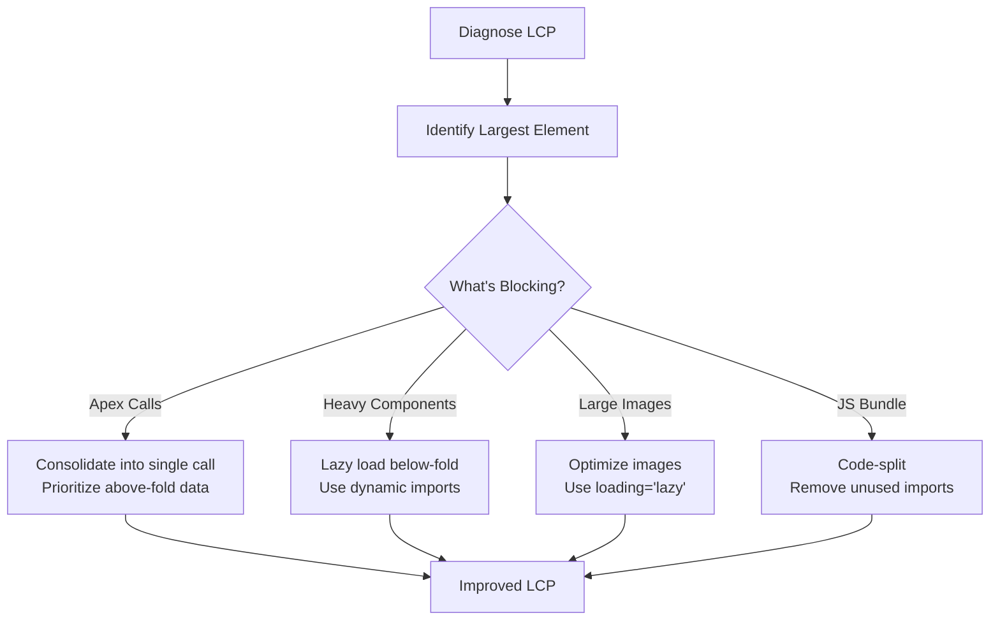

### 💻 Code Example

```javascript
// 1. LAZY LOAD below-fold components using dynamic import
import { LightningElement } from 'lwc';

export default class OptimizedPage extends LightningElement {
    showChart = false;
    showDataTable = false;
    _chartsLoaded = false;

    // Only load chart component when user scrolls to it
    renderedCallback() {
        if (!this._chartsLoaded) {
            this._chartsLoaded = true;
            this.setupLazyLoading();
        }
    }

    setupLazyLoading() {
        const observer = new IntersectionObserver((entries) => {
            entries.forEach(entry => {
                if (entry.isIntersecting) {
                    const component = entry.target.dataset.component;
                    if (component === 'chart') this.showChart = true;
                    if (component === 'datatable') this.showDataTable = true;
                    observer.unobserve(entry.target);
                }
            });
        }, { rootMargin: '100px' });

        this.template.querySelectorAll('.lazy-placeholder').forEach(el => {
            observer.observe(el);
        });
    }
}
```

```html
<template>
    <!-- ABOVE FOLD: Load immediately (critical content) -->
    <c-metric-cards data={criticalData}></c-metric-cards>

    <!-- BELOW FOLD: Lazy loaded -->
    <div class="lazy-placeholder" data-component="chart">
        <template lwc:if={showChart}>
            <c-revenue-chart></c-revenue-chart>
        </template>
        <template lwc:else>
            <div class="slds-box" style="height: 300px;">
                <!-- Placeholder skeleton -->
                <div class="slds-is-relative slds-m-around_medium">
                    <div class="skeleton-loader"></div>
                </div>
            </div>
        </template>
    </div>

    <div class="lazy-placeholder" data-component="datatable">
        <template lwc:if={showDataTable}>
            <c-paginated-table></c-paginated-table>
        </template>
    </div>
</template>
```

```css
/* Skeleton loader for perceived performance */
.skeleton-loader {
    background: linear-gradient(90deg, #f0f0f0 25%, #e0e0e0 50%, #f0f0f0 75%);
    background-size: 200% 100%;
    animation: shimmer 1.5s infinite;
    height: 20px;
    border-radius: 4px;
    margin-bottom: 8px;
}

@keyframes shimmer {
    0% { background-position: 200% 0; }
    100% { background-position: -200% 0; }
}
```

### 🔄 Follow-up Questions

1. **"How do you measure LCP in a Salesforce context?"** — Use Chrome DevTools Performance tab, Lighthouse audit, or the Salesforce Lightning Inspector. Note that LCP within the one-app container is affected by the framework's boot time, which you can't control.
2. **"What's the impact of wire service caching on LCP?"** — Cached wire results serve instantly from the client cache, dramatically improving LCP on subsequent visits. First visit is always slower. Consider priming caches with warm-up data.
3. **"How do skeleton loaders improve perceived performance?"** — They give users visual feedback that content is loading, reducing perceived wait time even though actual LCP doesn't change. Users perceive the page as faster because there's immediate visual progress.

---

## Scenario 14: Implement Undo/Redo Functionality in a Complex Form

### 🎯 The Scenario

> *"You're building a complex configuration form where users make many changes. They request an undo/redo feature so they can revert changes step-by-step. How would you implement this in LWC?"*

### 🤔 Key Considerations

- Classic Command pattern or state stack pattern
- Memory management for large state histories
- What constitutes a "step" (every keystroke vs. field blur)
- Keyboard shortcuts (Ctrl+Z, Ctrl+Y)
- Performance impact of deep cloning state

### ✅ Recommended Approach

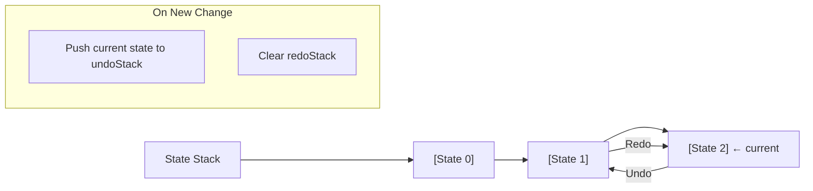

### 💻 Code Example

```javascript
import { LightningElement } from 'lwc';

const MAX_HISTORY = 50; // Limit memory usage

export default class UndoRedoForm extends LightningElement {
    // Current state
    formData = {
        name: '',
        industry: '',
        revenue: null,
        description: ''
    };

    // History stacks
    _undoStack = [];
    _redoStack = [];

    // Keyboard shortcut handler
    _keyHandler = this.handleKeyboard.bind(this);

    connectedCallback() {
        document.addEventListener('keydown', this._keyHandler);
    }

    disconnectedCallback() {
        document.removeEventListener('keydown', this._keyHandler);
    }

    handleKeyboard(event) {
        if ((event.metaKey || event.ctrlKey) && event.key === 'z') {
            event.preventDefault();
            if (event.shiftKey) {
                this.handleRedo();
            } else {
                this.handleUndo();
            }
        }
    }

    /**
     * Save current state before making a change.
     * Call this on field blur (not every keystroke) to avoid excessive history.
     */
    saveState() {
        // Deep clone current state and push to undo stack
        this._undoStack.push(JSON.parse(JSON.stringify(this.formData)));

        // Limit stack size
        if (this._undoStack.length > MAX_HISTORY) {
            this._undoStack.shift(); // Remove oldest
        }

        // Clear redo stack (new action invalidates redo history)
        this._redoStack = [];
    }

    handleFieldBlur(event) {
        const field = event.target.dataset.field;
        const newValue = event.target.value;

        // Only save state if value actually changed
        if (this.formData[field] !== newValue) {
            this.saveState();
            this.formData = { ...this.formData, [field]: newValue };
        }
    }

    handleUndo() {
        if (this._undoStack.length === 0) return;

        // Push current state to redo stack
        this._redoStack.push(JSON.parse(JSON.stringify(this.formData)));

        // Pop previous state
        this.formData = this._undoStack.pop();
    }

    handleRedo() {
        if (this._redoStack.length === 0) return;

        // Push current state to undo stack
        this._undoStack.push(JSON.parse(JSON.stringify(this.formData)));

        // Pop redo state
        this.formData = this._redoStack.pop();
    }

    get canUndo() {
        return this._undoStack.length > 0;
    }

    get canRedo() {
        return this._redoStack.length > 0;
    }

    get undoCount() {
        return this._undoStack.length;
    }

    get redoCount() {
        return this._redoStack.length;
    }
}
```

```html
<template>
    <!-- Undo/Redo Toolbar -->
    <div class="slds-button-group slds-m-bottom_medium">
        <lightning-button-icon
            icon-name="utility:undo"
            alternative-text="Undo"
            title="Undo (Ctrl+Z)"
            onclick={handleUndo}
            disabled={cannotUndo}
        ></lightning-button-icon>
        <lightning-button-icon
            icon-name="utility:redo"
            alternative-text="Redo"
            title="Redo (Ctrl+Shift+Z)"
            onclick={handleRedo}
            disabled={cannotRedo}
        ></lightning-button-icon>
        <span class="slds-text-body_small slds-m-left_small slds-align-middle">
            {undoCount} undo / {redoCount} redo available
        </span>
    </div>

    <!-- Form Fields -->
    <lightning-input
        label="Company Name"
        value={formData.name}
        data-field="name"
        onblur={handleFieldBlur}
    ></lightning-input>
    <!-- ... more fields ... -->
</template>
```

### 🔄 Follow-up Questions

1. **"Why use `JSON.parse(JSON.stringify())` for cloning?"** — It's the simplest deep clone method. For production, consider `structuredClone()` (modern browsers) or a library like lodash's `cloneDeep` for objects with dates, maps, etc.
2. **"How would you handle undo for complex changes like adding/removing list items?"** — The state-stack approach works perfectly — the entire state (including arrays) is captured. Each undo restores the complete previous state.
3. **"What about memory concerns with large forms?"** — Cap the history size (MAX_HISTORY), only store diffs instead of full state snapshots for large forms, or store only changed fields per step.

---

## Scenario 15: Design a Real-Time Collaboration Feature Using Platform Events

### 🎯 The Scenario

> *"Multiple users are editing a complex configuration record simultaneously. You need to show a 'Currently Editing' indicator (like Google Docs shows who's viewing), alert users if another user modifies a field they're working on, and prevent conflicting saves."*

### 🤔 Key Considerations

- Platform Events for real-time notifications between users
- Presence tracking (who is viewing/editing)
- Optimistic locking vs. pessimistic locking
- Conflict detection on save
- Performance: don't overuse streaming events

### ✅ Recommended Approach

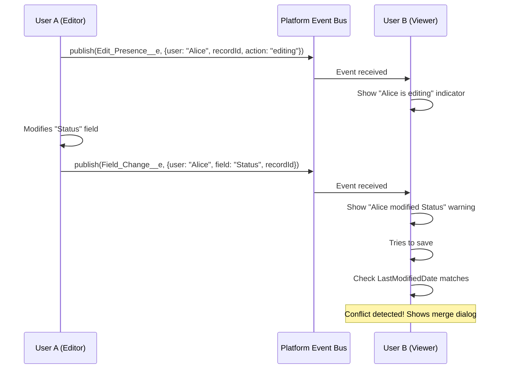

### 💻 Code Example

```javascript
import { LightningElement, api } from 'lwc';
import { subscribe, unsubscribe, onError } from 'lightning/empApi';
import publishPresence from '@salesforce/apex/CollaborationController.publishPresence';
import publishFieldChange from '@salesforce/apex/CollaborationController.publishFieldChange';
import userId from '@salesforce/user/Id';
import userName from '@salesforce/schema/User.Name';

const PRESENCE_HEARTBEAT_MS = 30000; // 30s heartbeat
const PRESENCE_TIMEOUT_MS = 60000;   // Consider user gone after 60s

export default class CollaborativeEditor extends LightningElement {
    @api recordId;
    channelName = '/event/Edit_Presence__e';
    fieldChangeChannel = '/event/Field_Change__e';

    activeUsers = new Map(); // userId -> { name, lastSeen, fields }
    _heartbeatInterval;
    _presenceSubscription;
    _fieldChangeSubscription;

    connectedCallback() {
        this.subscribeToPresence();
        this.subscribeToFieldChanges();
        this.announcePresence('joined');
        this.startHeartbeat();
    }

    disconnectedCallback() {
        this.announcePresence('left');
        clearInterval(this._heartbeatInterval);
        if (this._presenceSubscription) unsubscribe(this._presenceSubscription);
        if (this._fieldChangeSubscription) unsubscribe(this._fieldChangeSubscription);
    }

    // --- Presence Tracking ---
    subscribeToPresence() {
        subscribe(this.channelName, -1, (message) => {
            this.handlePresenceEvent(message);
        }).then(subscription => {
            this._presenceSubscription = subscription;
        });
    }

    handlePresenceEvent(message) {
        const payload = message.data.payload;
        // Ignore own events
        if (payload.User_Id__c === userId) return;
        // Ignore events for other records
        if (payload.Record_Id__c !== this.recordId) return;

        if (payload.Action__c === 'left') {
            this.activeUsers.delete(payload.User_Id__c);
        } else {
            this.activeUsers.set(payload.User_Id__c, {
                name: payload.User_Name__c,
                lastSeen: Date.now(),
                action: payload.Action__c
            });
        }

        // Trigger re-render
        this.activeUsers = new Map(this.activeUsers);
    }

    announcePresence(action) {
        publishPresence({
            recordId: this.recordId,
            action: action
        }).catch(err => console.error('Presence publish failed:', err));
    }

    startHeartbeat() {
        this._heartbeatInterval = setInterval(() => {
            this.announcePresence('active');
            this.pruneInactiveUsers();
        }, PRESENCE_HEARTBEAT_MS);
    }

    pruneInactiveUsers() {
        const now = Date.now();
        const updated = new Map(this.activeUsers);
        updated.forEach((user, id) => {
            if (now - user.lastSeen > PRESENCE_TIMEOUT_MS) {
                updated.delete(id);
            }
        });
        this.activeUsers = updated;
    }

    // --- Field Change Tracking ---
    subscribeToFieldChanges() {
        subscribe(this.fieldChangeChannel, -1, (message) => {
            this.handleFieldChangeEvent(message);
        }).then(subscription => {
            this._fieldChangeSubscription = subscription;
        });
    }

    handleFieldChangeEvent(message) {
        const payload = message.data.payload;
        if (payload.User_Id__c === userId) return;
        if (payload.Record_Id__c !== this.recordId) return;

        // Show warning that another user modified a field
        this.showConflictWarning(
            payload.User_Name__c,
            payload.Field_Name__c,
            payload.New_Value__c
        );
    }

    // When the current user changes a field, publish it
    handleFieldChange(event) {
        const field = event.target.dataset.field;
        const value = event.target.value;

        publishFieldChange({
            recordId: this.recordId,
            fieldName: field,
            newValue: value
        }).catch(err => console.error('Field change publish failed:', err));
    }

    // --- Active Users Display ---
    get activeUsersList() {
        return Array.from(this.activeUsers.values());
    }

    get hasOtherUsers() {
        return this.activeUsers.size > 0;
    }

    get otherUserCount() {
        return this.activeUsers.size;
    }

    showConflictWarning(userName, fieldName, newValue) {
        // Show inline warning near the affected field
        const field = this.template.querySelector(`[data-field="${fieldName}"]`);
        if (field) {
            field.setCustomValidity(
                `⚠️ ${userName} changed this to "${newValue}". Refresh to see latest.`
            );
            field.reportValidity();
        }
    }
}
```

```java
// CollaborationController.cls
public with sharing class CollaborationController {
    @AuraEnabled
    public static void publishPresence(Id recordId, String action) {
        Edit_Presence__e event = new Edit_Presence__e(
            Record_Id__c = recordId,
            User_Id__c = UserInfo.getUserId(),
            User_Name__c = UserInfo.getName(),
            Action__c = action
        );
        Database.SaveResult result = EventBus.publish(event);
        if (!result.isSuccess()) {
            throw new AuraHandledException('Failed to publish presence event');
        }
    }

    @AuraEnabled
    public static void publishFieldChange(Id recordId, String fieldName, String newValue) {
        Field_Change__e event = new Field_Change__e(
            Record_Id__c = recordId,
            User_Id__c = UserInfo.getUserId(),
            User_Name__c = UserInfo.getName(),
            Field_Name__c = fieldName,
            New_Value__c = newValue
        );
        EventBus.publish(event);
    }
}
```

### 🔄 Follow-up Questions

1. **"How do you handle the case where a user's browser crashes (no 'left' event sent)?"** — The heartbeat + timeout mechanism handles this. If no heartbeat is received within 60 seconds, the user is pruned from the active list.
2. **"What about Platform Event daily delivery limits?"** — High-volume events support millions of deliveries/day. For very active systems, consider batching heartbeats or using Change Data Capture instead of custom events. Monitor usage in Setup → Platform Event Usage Metrics.
3. **"How would you implement actual conflict resolution (like a merge dialog)?"** — On save, compare the record's `LastModifiedDate` with the timestamp when the user started editing. If it's newer, fetch the latest version and show a side-by-side diff dialog letting the user choose which values to keep.

---

## 📋 Scenario Quick Reference

| # | Scenario | Key Technique | Difficulty |
|---|----------|---------------|------------|
| 1 | 10K+ records | Cursor pagination, virtual scroll | Hard |
| 2 | Grandparent notification | Re-dispatch pattern or event bubbling | Medium |
| 3 | Cross-component state | Lightning Message Service | Medium |
| 4 | Aura to LWC migration | Phased migration, LMS bridge | Hard |
| 5 | Multi-context LWC | Community ID detection, adaptive UI | Medium |
| 6 | Governor limits | Consolidated Apex, DTO pattern | Medium |
| 7 | Offline mobile | LWC Offline, GraphQL wire, drafts | Hard |
| 8 | Stale wire data | refreshApex, LDS cache | Easy |
| 9 | Shared component library | Unlocked packages, theming | Medium |
| 10 | Role-based UI | Custom permissions, server enforcement | Medium |
| 11 | File upload with progress | Chunked upload, FileReader API | Medium |
| 12 | Responsive layout | SLDS grid, FORM_FACTOR, adaptive columns | Easy |
| 13 | LCP optimization | Lazy loading, skeleton screens, consolidation | Hard |
| 14 | Undo/redo | State stack pattern, keyboard shortcuts | Medium |
| 15 | Real-time collaboration | Platform Events, presence tracking, conflict resolution | Hard |

> [!TIP]
> **Interview Pro Tip**: When presented with a scenario, always start by asking clarifying questions:
> - "How many users will be using this concurrently?"
> - "What's the expected data volume?"
> - "Does this need to work on mobile?"
> - "Are there any existing components we can reuse?"
>
> This shows the interviewer you think before you code.
