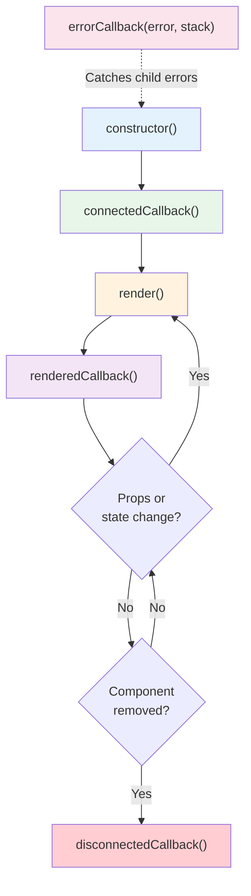
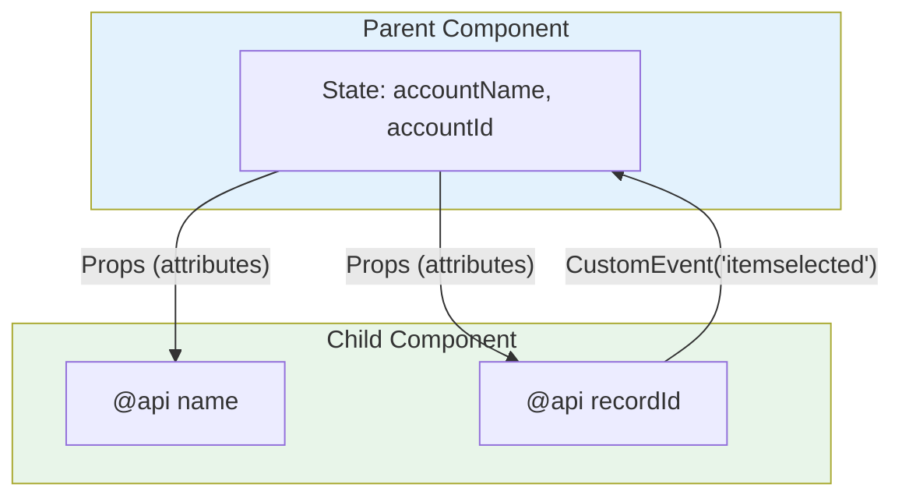
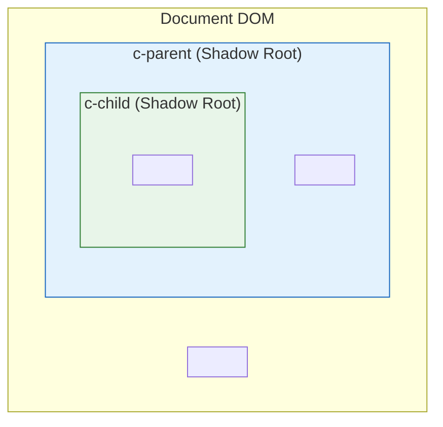
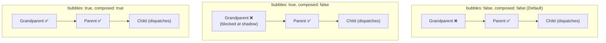
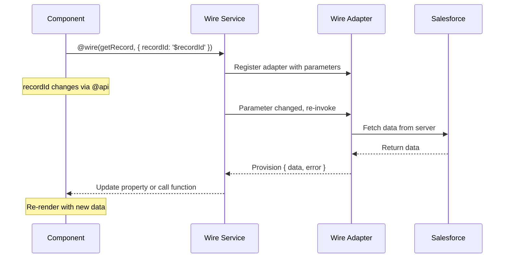
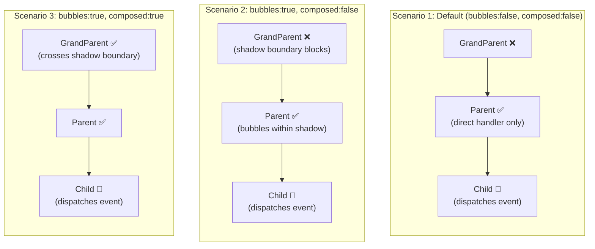
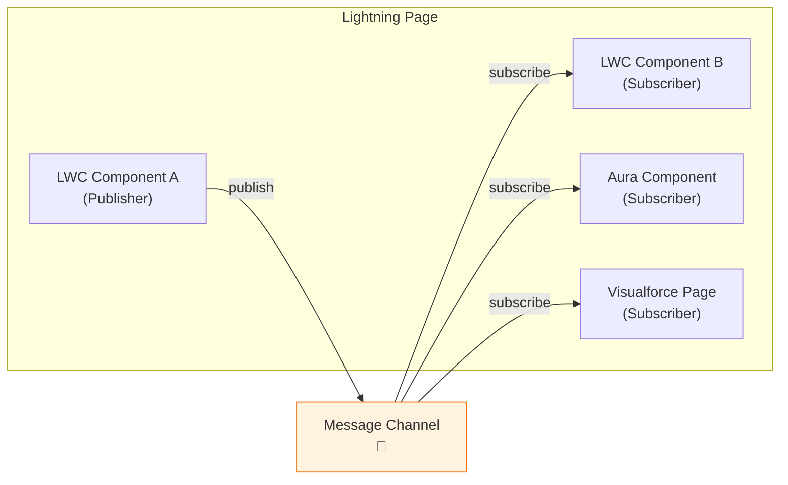
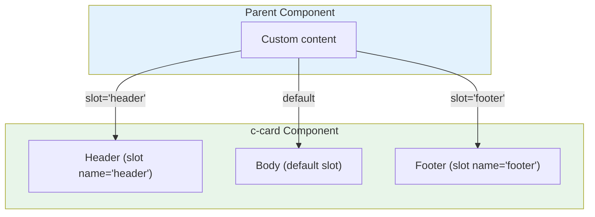
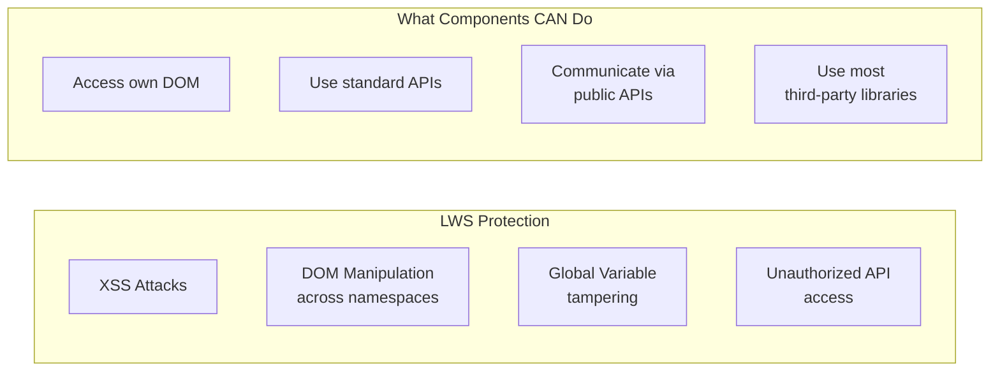

# 📝 Top 50 LWC Interview Questions & Answers

> The most frequently asked Lightning Web Components interview questions, organized by difficulty level. Each answer includes detailed explanations and code examples where applicable.

---

## 📋 Table of Contents

- [🟢 Beginner Level (Q1–Q15)](#-beginner-level-q1q15)
- [🟡 Intermediate Level (Q16–Q35)](#-intermediate-level-q16q35)
- [🔴 Advanced Level (Q36–Q50)](#-advanced-level-q36q50)

---

## 🟢 Beginner Level (Q1–Q15)

### Q1: What is Lightning Web Components (LWC)?

<details>
<summary>🔍 View Answer</summary>

**Lightning Web Components (LWC)** is Salesforce's modern UI framework built on web standards — specifically Custom Elements, Shadow DOM, Templates, and ECMAScript modules. Unlike its predecessor Aura, LWC leverages native browser APIs rather than proprietary abstractions, resulting in significantly better performance and a more familiar development experience for web developers.

LWC was introduced in **Spring '19 (API v45)** and is now the recommended framework for all new Salesforce UI development. It uses a reactive data-binding model where changes to component properties automatically trigger re-renders.

**Key Characteristics:**
- Built on **Web Components standards** (Custom Elements v1, Shadow DOM v1)
- Uses **standard JavaScript** (ES2022+) with minimal proprietary APIs
- Follows a **one-way data flow** model (parent to child via `@api`, child to parent via events)
- Supports **reactive rendering** — the framework tracks field dependencies and re-renders only when needed
- Runs within **Salesforce's security container** (Lightning Web Security or Locker Service)

```javascript
// helloWorld.js — A basic LWC component
import { LightningElement } from 'lwc';

export default class HelloWorld extends LightningElement {
    greeting = 'World';

    get formattedGreeting() {
        return `Hello, ${this.greeting}!`;
    }

    handleChange(event) {
        this.greeting = event.target.value;
    }
}
```

```html
<!-- helloWorld.html -->
<template>
    <lightning-card title="Hello World Demo">
        <div class="slds-p-around_medium">
            <lightning-input 
                label="Name" 
                value={greeting} 
                onchange={handleChange}>
            </lightning-input>
            <p class="slds-m-top_small">{formattedGreeting}</p>
        </div>
    </lightning-card>
</template>
```

**Think of it like this:** If Aura is like jQuery (lots of framework-specific magic), then LWC is like modern React/Vue — it's closer to vanilla JavaScript and leverages what browsers already know how to do.

</details>

---

### Q2: What are the key differences between LWC and Aura Components?

<details>
<summary>🔍 View Answer</summary>

LWC and Aura are both Salesforce UI frameworks, but they differ fundamentally in their architecture, performance, and development model. LWC is the modern successor to Aura, built on web standards rather than a proprietary framework.

| Feature | LWC | Aura |
|---------|-----|------|
| **Architecture** | Web standards (Custom Elements, Shadow DOM) | Proprietary framework |
| **Performance** | Faster — minimal abstraction layer | Slower — heavy framework overhead |
| **Rendering** | Native browser rendering | Custom Aura rendering engine |
| **Data Binding** | One-way (unidirectional) | Two-way (bidirectional) |
| **Event Model** | Standard DOM Events + CustomEvent | Aura Events (Component & Application) |
| **Security** | Lightning Web Security (LWS) | Locker Service |
| **Syntax** | Standard JS (ES2022+) | Aura-specific syntax + helpers |
| **Testing** | Jest (standard JS testing) | Aura Testing Service (limited) |
| **File Structure** | `.js`, `.html`, `.css`, `.xml` | `.cmp`, `.js`, `.helper`, `.renderer`, `.css`, `.design` |
| **Inter-component Comm** | `@api` props, Custom Events, LMS | Attributes, Component/Application Events |
| **Learning Curve** | Lower (standard web skills transfer) | Higher (proprietary APIs) |
| **Coexistence** | Can contain Aura components | Can contain LWC components |

**Key Differences in Code:**

```javascript
// LWC - Standard JavaScript class
import { LightningElement, api } from 'lwc';
export default class MyComponent extends LightningElement {
    @api recordId;
    
    handleClick() {
        this.dispatchEvent(new CustomEvent('select', {
            detail: { id: this.recordId }
        }));
    }
}
```

```javascript
// Aura - Proprietary syntax
({
    handleClick: function(component, event, helper) {
        var recordId = component.get("v.recordId");
        var selectEvent = component.getEvent("select");
        selectEvent.setParams({ id: recordId });
        selectEvent.fire();
    }
})
```

> [!IMPORTANT]
> Aura is in maintenance mode as of 2024. Salesforce recommends LWC for all new development. Existing Aura components should be migrated to LWC when feasible. However, some features (like URL-addressable tabs in certain configurations) may still require Aura wrappers.

</details>

---

### Q3: Describe the LWC component bundle structure. What files does it include?

<details>
<summary>🔍 View Answer</summary>

An LWC component bundle is a folder containing all the files that make up a single component. The folder name becomes the component name and must follow strict naming conventions (camelCase, starting with a lowercase letter).

**Component Bundle Structure:**

```
myComponent/
├── myComponent.html          ← Template (required)
├── myComponent.js            ← JavaScript controller (required)
├── myComponent.css           ← Styles (optional)
├── myComponent.js-meta.xml   ← Metadata config (required for org deployment)
├── myComponent.svg           ← Custom icon (optional)
├── __tests__/                ← Jest test folder (optional)
│   └── myComponent.test.js   ← Jest test file
└── additionalTemplate.html   ← Extra templates (optional, for render())
```

**File Details:**

| File | Purpose | Required? |
|------|---------|-----------|
| `*.html` | Component template with LWC template directives | Yes |
| `*.js` | JavaScript class extending `LightningElement` | Yes |
| `*.css` | Component-scoped styles (auto-scoped via Shadow DOM) | No |
| `*.js-meta.xml` | Salesforce metadata (targets, visibility, design attributes) | Yes (for deployment) |
| `*.svg` | Custom icon for Lightning App Builder | No |
| `__tests__/*.test.js` | Jest unit tests | No (but recommended) |

**Metadata Configuration Example:**

```xml
<?xml version="1.0" encoding="UTF-8"?>
<LightningComponentBundle xmlns="http://soap.sforce.com/2006/04/metadata">
    <apiVersion>62.0</apiVersion>
    <isExposed>true</isExposed>
    <masterLabel>My Component</masterLabel>
    <description>A reusable LWC component</description>
    <targets>
        <target>lightning__RecordPage</target>
        <target>lightning__AppPage</target>
        <target>lightning__HomePage</target>
        <target>lightning__FlowScreen</target>
    </targets>
    <targetConfigs>
        <targetConfig targets="lightning__RecordPage">
            <property name="title" type="String" default="My Component" />
            <property name="maxRecords" type="Integer" default="10" />
            <objects>
                <object>Account</object>
                <object>Contact</object>
            </objects>
        </targetConfig>
    </targetConfigs>
</LightningComponentBundle>
```

**Naming Conventions:**
- Folder/component name: **camelCase** (e.g., `myComponent`)
- In HTML markup: **kebab-case** with namespace (e.g., `<c-my-component>`)
- Must start with a lowercase letter
- Can contain only alphanumeric characters and underscores
- Must not contain two consecutive underscores
- Must not end with an underscore

</details>

---

### Q4: Explain the three LWC decorators: @api, @track, and @wire.

<details>
<summary>🔍 View Answer</summary>

LWC provides three decorators that control the behavior of component properties. They are imported from the `lwc` module and each serves a distinct purpose in the reactive data system.

**1. `@api` — Public Reactive Property**

The `@api` decorator exposes a property as part of the component's public API. Parent components can set these values. Changes to `@api` properties trigger re-renders.

```javascript
import { LightningElement, api } from 'lwc';

export default class ChildComponent extends LightningElement {
    @api recordId;           // Read-only from parent's perspective
    @api title = 'Default';  // Has a default value
    
    // Public method — can be called by parent via this.template.querySelector()
    @api
    refresh() {
        // Refresh component logic
    }
}
```

```html
<!-- Parent template -->
<c-child-component 
    record-id={selectedId} 
    title="My Title">
</c-child-component>
```

> [!WARNING]
> Never modify an `@api` property from within the child component. It's owned by the parent. If you need a mutable copy, create a private property in `connectedCallback` or use a getter/setter pattern.

**2. `@track` — Private Reactive Property (Legacy)**

Before Spring '20, `@track` was required to make private properties reactive. **Since Spring '20 (API v48), all fields are reactive by default.** `@track` is now only needed for deep reactivity on objects and arrays — but even that is now automatically tracked.

```javascript
import { LightningElement, track } from 'lwc';

export default class TrackExample extends LightningElement {
    // Both are reactive since Spring '20:
    name = 'John';                    // Auto-reactive (no decorator needed)
    @track address = { city: '' };   // @track makes deep changes reactive
    
    updateCity() {
        // Without @track, mutating a property on the object won't trigger re-render
        // With @track (or reassigning the object), it will
        this.address.city = 'San Francisco'; // Re-renders only with @track
        
        // Alternative without @track — create a new reference:
        // this.address = { ...this.address, city: 'San Francisco' };
    }
}
```

> [!NOTE]
> As of recent LWC versions, the framework auto-tracks deep mutations on objects and arrays. `@track` is essentially legacy. The recommended pattern is to use **plain fields** and reassign objects/arrays when you want to trigger reactivity:
> ```javascript
> this.items = [...this.items, newItem]; // Creates new reference → triggers re-render
> ```

**3. `@wire` — Wire Service Decorator**

The `@wire` decorator connects a property or function to a wire adapter, enabling reactive data fetching from Salesforce. When the wire parameters change, the framework automatically re-invokes the adapter.

```javascript
import { LightningElement, wire, api } from 'lwc';
import { getRecord, getFieldValue } from 'lightning/uiRecordApi';
import NAME_FIELD from '@salesforce/schema/Account.Name';
import INDUSTRY_FIELD from '@salesforce/schema/Account.Industry';

export default class WireExample extends LightningElement {
    @api recordId;

    // Wire to a property — result has { data, error }
    @wire(getRecord, { recordId: '$recordId', fields: [NAME_FIELD, INDUSTRY_FIELD] })
    account;

    get accountName() {
        return getFieldValue(this.account.data, NAME_FIELD);
    }

    // Wire to a function — called when data changes
    @wire(getRecord, { recordId: '$recordId', fields: [NAME_FIELD] })
    wiredAccount({ data, error }) {
        if (data) {
            this.processData(data);
        } else if (error) {
            this.handleError(error);
        }
    }
}
```

**Comparison Summary:**

| Decorator | Visibility | Reactivity | Use Case |
|-----------|-----------|------------|----------|
| `@api` | Public | Yes | Parent-to-child data passing, public methods |
| `@track` | Private | Deep object/array (legacy) | Now largely unnecessary |
| `@wire` | Private | Yes (auto-invoked) | Declarative data fetching from Salesforce |
| *(none)* | Private | Yes (primitive changes) | Internal component state |

</details>

---

### Q5: Explain all the LWC lifecycle hooks and their execution order.

<details>
<summary>🔍 View Answer</summary>

LWC provides lifecycle hooks that let you run code at specific stages of a component's existence. Understanding their order and behavior is critical for proper initialization, DOM manipulation, and cleanup.

**Lifecycle Flow:**



**Detailed Hook Descriptions:**

**1. `constructor()` — Component Created**
```javascript
constructor() {
    super(); // MUST call super() first
    // ✅ Initialize state, set default values
    // ✅ Set up private variables
    // ❌ Do NOT access DOM (this.template returns null)
    // ❌ Do NOT access @api properties (not yet set)
    // ❌ Do NOT dispatch events
    this.items = [];
    this.isLoading = false;
}
```

**2. `connectedCallback()` — Inserted into DOM**
```javascript
connectedCallback() {
    // ✅ Access @api properties (they're now set)
    // ✅ Subscribe to events, LMS channels
    // ✅ Fetch initial data (imperative Apex)
    // ✅ Add event listeners to the host element
    // ❌ Do NOT access child elements (not rendered yet)
    // ⚠️ Can fire multiple times if component moves in DOM
    console.log('Record ID:', this.recordId);
    this.subscribeToChannel();
}
```

**3. `render()` — Select Template (optional)**
```javascript
import templateA from './templateA.html';
import templateB from './templateB.html';

render() {
    // ✅ Return a different template conditionally
    // This hook is rarely used — most components have one template
    return this.showAdvanced ? templateB : templateA;
}
```

**4. `renderedCallback()` — After Render**
```javascript
renderedCallback() {
    // ✅ Access DOM elements (this.template.querySelector works)
    // ✅ Integrate third-party libraries that need DOM
    // ✅ Perform DOM measurements
    // ⚠️ Fires after EVERY render — use guards to prevent infinite loops!
    
    if (this.hasRendered) return; // Guard against repeated execution
    this.hasRendered = true;
    
    const container = this.template.querySelector('.chart-container');
    if (container) {
        this.initializeChart(container);
    }
}
```

**5. `disconnectedCallback()` — Removed from DOM**
```javascript
disconnectedCallback() {
    // ✅ Clean up subscriptions
    // ✅ Remove event listeners
    // ✅ Cancel pending timers/intervals
    // ✅ Release resources
    this.unsubscribeFromChannel();
    clearInterval(this.pollingInterval);
}
```

**6. `errorCallback(error, stack)` — Error Boundary**
```javascript
errorCallback(error, stack) {
    // ✅ Catches errors from child components
    // ✅ Log errors, show fallback UI
    // ❌ Does NOT catch errors in the same component
    this.error = error;
    console.error('Child error:', error.message);
    console.error('Stack:', stack);
}
```

**Execution Order Summary:**

| Order | Hook | Fires When | Fires Multiple Times? |
|-------|------|-----------|----------------------|
| 1 | `constructor()` | Component instantiated | No |
| 2 | `connectedCallback()` | Inserted into DOM | Yes (if moved) |
| 3 | `render()` | Before each render | Yes |
| 4 | `renderedCallback()` | After each render | Yes |
| 5 | `disconnectedCallback()` | Removed from DOM | Yes (if moved) |
| * | `errorCallback()` | Child throws error | As needed |

> [!CAUTION]
> **Common Mistake:** Modifying state in `renderedCallback()` without a guard creates an infinite loop. Always use a boolean flag or check conditions before updating reactive properties in this hook.

</details>

---

### Q6: How does data binding work in LWC? Explain with examples.

<details>
<summary>🔍 View Answer</summary>

LWC uses **one-way data binding** — data flows from parent to child via properties, and from child to parent via events. This is fundamentally different from Aura's two-way binding and is similar to React's data flow model.

**Types of Data Binding in LWC:**

**1. Property Binding (Expression Binding)**
```html
<!-- Binding a property value to markup -->
<template>
    <!-- Simple property binding -->
    <p>{greeting}</p>
    
    <!-- Computed property (getter) -->
    <p>{formattedName}</p>
    
    <!-- Binding to attributes -->
    <div class={dynamicClass}>Content</div>
    <lightning-input value={searchTerm}></lightning-input>
    
    <!-- Note: NO curly braces in attribute strings -->
    <!-- ❌ Wrong: class="slds-{size}" -->
    <!-- ✅ Right: class={computedClass} -->
</template>
```

```javascript
export default class DataBindingDemo extends LightningElement {
    greeting = 'Hello World';
    firstName = 'John';
    lastName = 'Doe';
    isActive = true;

    get formattedName() {
        return `${this.firstName} ${this.lastName}`;
    }

    get dynamicClass() {
        return this.isActive ? 'slds-text-color_success' : 'slds-text-color_error';
    }
}
```

**2. Parent-to-Child (Props Down)**
```javascript
// parentComponent.js
export default class ParentComponent extends LightningElement {
    accountName = 'Acme Corp';
    accountId = '001xx000003DGbYAAW';
}
```

```html
<!-- parentComponent.html -->
<template>
    <c-child-component
        name={accountName}
        record-id={accountId}>
    </c-child-component>
</template>
```

```javascript
// childComponent.js
import { LightningElement, api } from 'lwc';

export default class ChildComponent extends LightningElement {
    @api name;      // Receives 'Acme Corp'
    @api recordId;  // Receives the account ID
    // Note: HTML attribute "record-id" maps to JS property "recordId"
}
```

**3. Child-to-Parent (Events Up)**
```javascript
// childComponent.js
export default class ChildComponent extends LightningElement {
    handleSelect() {
        // Dispatch a custom event with data
        const selectEvent = new CustomEvent('itemselected', {
            detail: { 
                recordId: this.recordId,
                name: this.name
            },
            bubbles: false,    // Default: doesn't bubble
            composed: false    // Default: doesn't cross shadow boundary
        });
        this.dispatchEvent(selectEvent);
    }
}
```

```html
<!-- parentComponent.html -->
<template>
    <c-child-component 
        onitemselected={handleItemSelected}>
    </c-child-component>
</template>
```

```javascript
// parentComponent.js
export default class ParentComponent extends LightningElement {
    handleItemSelected(event) {
        const { recordId, name } = event.detail;
        console.log(`Selected: ${name} (${recordId})`);
    }
}
```

**Data Flow Diagram:**



> [!IMPORTANT]
> LWC does **not** support two-way data binding like Aura's `{!v.value}`. If you need a child to update a parent's state, the child must dispatch a custom event, and the parent must handle it explicitly. This makes data flow predictable and debuggable.

</details>

---

### Q7: What are template directives in LWC? List and explain each.

<details>
<summary>🔍 View Answer</summary>

Template directives are special attributes in LWC templates that control rendering logic — conditional display, iteration, and dynamic behavior. They replace traditional JavaScript DOM manipulation.

**1. `if:true` / `if:false` (Legacy) and `lwc:if` / `lwc:elseif` / `lwc:else` (Modern)**

```html
<!-- Modern conditional rendering (recommended since Spring '23) -->
<template>
    <template lwc:if={isLoading}>
        <lightning-spinner alternative-text="Loading"></lightning-spinner>
    </template>
    <template lwc:elseif={hasError}>
        <div class="slds-text-color_error">
            <p>Error: {errorMessage}</p>
        </div>
    </template>
    <template lwc:else>
        <div class="content">
            <p>{data}</p>
        </div>
    </template>
</template>

<!-- Legacy syntax (still works but not recommended) -->
<template if:true={isLoading}>
    <lightning-spinner></lightning-spinner>
</template>
<template if:false={isLoading}>
    <div>{data}</div>
</template>
```

> [!TIP]
> Always prefer `lwc:if` / `lwc:elseif` / `lwc:else` over the legacy `if:true` / `if:false`. The modern syntax supports else-if chains and is clearer.

**2. `for:each` — Iterate Over Arrays**

```html
<template>
    <ul>
        <template for:each={contacts} for:item="contact" for:index="idx">
            <li key={contact.Id}>
                {idx}. {contact.Name} — {contact.Email}
            </li>
        </template>
    </ul>
</template>
```

> [!WARNING]
> The `key` attribute is **required** on the first element inside `for:each`. It must be a unique identifier (like a record ID), not the array index. Using the index as a key causes performance issues and rendering bugs.

**3. `iterator` — Iterate with First/Last Awareness**

```html
<template>
    <ul>
        <template iterator:it={contacts}>
            <li key={it.value.Id}>
                <template lwc:if={it.first}>
                    <strong>★ First: {it.value.Name}</strong>
                </template>
                <template lwc:elseif={it.last}>
                    <em>Last: {it.value.Name}</em>
                </template>
                <template lwc:else>
                    {it.value.Name}
                </template>
            </li>
        </template>
    </ul>
</template>
```

| Property | Type | Description |
|----------|------|-------------|
| `it.value` | Object | Current item in the array |
| `it.index` | Number | Zero-based index |
| `it.first` | Boolean | True for the first item |
| `it.last` | Boolean | True for the last item |

**4. `lwc:ref` — Template References**

```html
<template>
    <div lwc:ref="container">Content</div>
    <lightning-input lwc:ref="nameInput" label="Name"></lightning-input>
</template>
```

```javascript
export default class RefExample extends LightningElement {
    handleClick() {
        // Access DOM elements via refs (cleaner than querySelector)
        const container = this.refs.container;
        const input = this.refs.nameInput;
        console.log(input.value);
    }
}
```

**5. `lwc:spread` — Spread Properties**

```html
<template>
    <!-- Spread an object of properties onto a child component -->
    <c-child-component lwc:spread={childProps}></c-child-component>
</template>
```

```javascript
export default class SpreadExample extends LightningElement {
    get childProps() {
        return {
            title: 'My Component',
            variant: 'brand',
            recordId: this.recordId
        };
    }
}
```

**6. `lwc:dynamic` — Dynamic Component Creation**

```html
<template>
    <lwc:component lwc:is={componentConstructor}></lwc:component>
</template>
```

```javascript
export default class DynamicExample extends LightningElement {
    componentConstructor;

    async connectedCallback() {
        const { default: Ctor } = await import('c/myDynamicChild');
        this.componentConstructor = Ctor;
    }
}
```

**Summary Table:**

| Directive | Purpose | Example |
|-----------|---------|---------|
| `lwc:if` / `lwc:elseif` / `lwc:else` | Conditional rendering | `<template lwc:if={show}>` |
| `for:each` | Array iteration | `<template for:each={items} for:item="item">` |
| `iterator` | Iteration with first/last | `<template iterator:it={items}>` |
| `lwc:ref` | Template references | `<div lwc:ref="myDiv">` |
| `lwc:spread` | Spread properties | `<c-child lwc:spread={props}>` |
| `lwc:is` | Dynamic components | `<lwc:component lwc:is={ctor}>` |
| `key` | Unique identifier for iteration | `<li key={item.Id}>` |

</details>

---

### Q8: How does CSS styling work in LWC? Explain Shadow DOM styling.

<details>
<summary>🔍 View Answer</summary>

LWC uses **Shadow DOM** by default to encapsulate component styles, meaning CSS defined in one component cannot leak into or be affected by another component's styles. This is a significant architectural feature for building maintainable, modular UIs.

**1. Component-Scoped CSS (Default Behavior)**

```css
/* myComponent.css — styles are automatically scoped */
:host {
    display: block;
    padding: 16px;
    border: 1px solid #d8dde6;
}

/* This .title only affects elements inside THIS component */
.title {
    font-size: 1.5rem;
    font-weight: 700;
    color: #16325c;
}

/* :host with conditional class */
:host(.active) {
    border-color: #0070d2;
    box-shadow: 0 0 8px rgba(0, 112, 210, 0.3);
}

/* You CANNOT style child component internals from a parent */
/* ❌ c-child-component .internal-class { } — won't work */
```

**2. `:host` Selector**

The `:host` selector targets the component's host element itself (the custom element tag).

```css
/* Target the host element */
:host {
    display: block;
    --primary-color: #0070d2;  /* CSS custom properties work across shadow boundary */
}

/* Conditional host styling */
:host([variant="brand"]) {
    background-color: var(--primary-color);
    color: white;
}
```

**3. CSS Custom Properties (Cross-Shadow-DOM Styling)**

CSS custom properties (variables) are the **only** way to style across shadow boundaries. They pierce through Shadow DOM.

```css
/* parent.css */
:host {
    --child-header-color: navy;
    --child-bg-color: #f4f6f9;
    --child-border-radius: 8px;
}
```

```css
/* child.css */
.header {
    color: var(--child-header-color, #333);  /* Fallback: #333 */
    background: var(--child-bg-color, white);
    border-radius: var(--child-border-radius, 4px);
}
```

**4. SLDS (Salesforce Lightning Design System)**

```html
<template>
    <!-- SLDS classes are available globally in LWC -->
    <div class="slds-card">
        <div class="slds-card__header slds-grid">
            <h2 class="slds-text-heading_medium">My Card</h2>
        </div>
        <div class="slds-card__body slds-card__body_inner">
            <p class="slds-text-body_regular">Content here</p>
        </div>
    </div>
</template>
```

**5. Importing Shared CSS (Style Modules)**

```javascript
// Create a shared CSS file: sharedStyles/sharedStyles.css
/* sharedStyles.css */
.btn-primary {
    background: #0070d2;
    color: white;
    padding: 8px 16px;
    border: none;
    border-radius: 4px;
}
```

```html
<!-- Import shared CSS into your component -->
<template>
    <div class="btn-primary">Styled Button</div>
</template>
```

```javascript
// myComponent.js — import the shared stylesheet
import { LightningElement } from 'lwc';
// In your component CSS file:
// @import 'c/sharedStyles';  ← This doesn't work in LWC

// Instead, use the CSS module pattern:
// Create sharedStyles.css as a standalone LWC component
// Then import it in your component's CSS:
```

```css
/* myComponent.css */
/* Import shared CSS module */
@import 'c/sharedStyles';

/* Your component-specific styles */
.custom-class {
    margin-top: 1rem;
}
```

**6. Light DOM (Opt-in)**

Since Winter '23, components can opt into Light DOM, which disables Shadow DOM encapsulation:

```javascript
import { LightningElement } from 'lwc';

export default class LightDomComponent extends LightningElement {
    static renderMode = 'light'; // Opt into light DOM
}
```

```css
/* Light DOM components: styles are NOT encapsulated */
/* Global CSS can affect them, and they can affect global CSS */
/* Use with caution — primarily for Experience Cloud sites */
```

**Shadow DOM vs Light DOM:**

| Feature | Shadow DOM (Default) | Light DOM |
|---------|---------------------|-----------|
| Style encapsulation | ✅ Full isolation | ❌ No isolation |
| Global CSS applies | ❌ No | ✅ Yes |
| `:host` selector | ✅ Supported | ❌ Not supported |
| CSS custom properties | ✅ Pierce shadow | ✅ Normal behavior |
| Use case | Internal org apps | Experience Cloud, CMS |
| `querySelector` from parent | ❌ Can't access child DOM | ✅ Can access |

</details>

---

### Q9: What is Shadow DOM in LWC and why is it important?

<details>
<summary>🔍 View Answer</summary>

**Shadow DOM** is a web standard that provides DOM and CSS encapsulation for web components. In LWC, each component gets its own shadow tree, meaning its internal DOM structure and styles are isolated from the rest of the page.

**Why Shadow DOM Matters:**

Think of Shadow DOM like an apartment in a building. Each apartment (component) has its own interior design (CSS), and changes in one apartment don't affect another. The building (page) provides shared infrastructure, but each unit is private.

**How LWC Uses Shadow DOM:**



```javascript
// parentComponent.js
export default class ParentComponent extends LightningElement {
    renderedCallback() {
        // Can access own shadow DOM:
        const myDiv = this.template.querySelector('.container'); // ✅ Works
        
        // Cannot directly access child's shadow DOM:
        const childP = this.template.querySelector('c-child-component')
            .template.querySelector('.container'); // ❌ Security violation in production
    }
}
```

**Key Shadow DOM Behaviors in LWC:**

| Behavior | Description |
|----------|-------------|
| **Style isolation** | CSS in one component can't affect another |
| **DOM isolation** | `document.querySelector()` can't reach into shadow trees |
| **Event retargeting** | Events from shadow DOM are retargeted to the host element |
| **Slot projection** | Content projection via `<slot>` elements |
| **CSS custom properties** | Only mechanism that crosses shadow boundaries |

**Event Behavior with Shadow DOM:**

```javascript
// Events and shadow DOM boundary
const event = new CustomEvent('myevent', {
    bubbles: true,     // Event bubbles up
    composed: true     // Event crosses shadow DOM boundaries
    // If composed: false (default), event stops at shadow boundary
});
this.dispatchEvent(event);
```

> [!NOTE]
> LWC uses **synthetic Shadow DOM** by default (a polyfill-like implementation) rather than native Shadow DOM. This allows LWC to work in older browsers and provides additional security features. You can enable native Shadow DOM for better performance in supported environments.

</details>

---

### Q10: What are the naming conventions for LWC components?

<details>
<summary>🔍 View Answer</summary>

LWC has strict naming conventions that affect how components are created, referenced, and deployed. Understanding these rules is essential because violations cause deployment errors.

**Component Name Rules:**

| Rule | Valid Example | Invalid Example |
|------|--------------|-----------------|
| Must be **camelCase** | `myComponent` | `MyComponent`, `my-component` |
| Must start with **lowercase letter** | `accountCard` | `AccountCard`, `1stCard` |
| Only **alphanumeric + underscore** | `my_component` | `my-component`, `my.component` |
| No **consecutive underscores** | `my_component` | `my__component` |
| Cannot **end with underscore** | `myComponent` | `myComponent_` |
| Maximum **65 characters** | — | — |

**How Names Map Between Contexts:**

```javascript
// File system (camelCase):
// force-app/main/default/lwc/myAwesomeCard/myAwesomeCard.js

// In HTML markup (kebab-case with namespace):
// <c-my-awesome-card></c-my-awesome-card>

// In JavaScript (camelCase):
// import MyAwesomeCard from 'c/myAwesomeCard';
```

**Namespace Prefixes:**

| Context | Prefix | Example |
|---------|--------|---------|
| Custom components (same org) | `c` | `<c-my-component>` |
| Managed package | Package namespace | `<acme-my-component>` |
| Lightning base components | `lightning` | `<lightning-button>` |

**HTML-to-JavaScript Property Mapping:**

```html
<!-- HTML attributes use kebab-case -->
<c-child-component
    record-id={myId}
    max-results={limit}
    is-active>
</c-child-component>
```

```javascript
// JavaScript properties use camelCase
export default class ChildComponent extends LightningElement {
    @api recordId;      // Maps from record-id
    @api maxResults;    // Maps from max-results
    @api isActive;      // Maps from is-active
}
```

</details>

---

### Q11: How do you handle events in LWC?

<details>
<summary>🔍 View Answer</summary>

LWC uses standard DOM `CustomEvent` for component communication. Events flow **upward** from child to parent, following the one-way data flow pattern. Understanding event configuration options (`bubbles`, `composed`) is critical.

**Creating and Dispatching Events:**

```javascript
// childComponent.js
export default class ChildComponent extends LightningElement {
    handleClick() {
        // 1. Simple event (no data)
        this.dispatchEvent(new CustomEvent('close'));

        // 2. Event with data
        this.dispatchEvent(new CustomEvent('select', {
            detail: {
                recordId: '001xx000003DGbY',
                name: 'Acme Corp'
            }
        }));

        // 3. Bubbling event (reaches ancestors beyond direct parent)
        this.dispatchEvent(new CustomEvent('notification', {
            detail: { message: 'Record saved!' },
            bubbles: true,
            composed: true  // Crosses shadow DOM boundaries
        }));
    }
}
```

**Handling Events in Parent:**

```html
<!-- parentComponent.html -->
<template>
    <!-- Handler name: "on" + event name -->
    <c-child-component
        onclose={handleClose}
        onselect={handleSelect}>
    </c-child-component>
</template>
```

```javascript
// parentComponent.js
export default class ParentComponent extends LightningElement {
    handleClose() {
        console.log('Child requested close');
    }

    handleSelect(event) {
        const { recordId, name } = event.detail;
        console.log(`Selected: ${name} (${recordId})`);
    }
}
```

**Event Configuration Options:**

| Option | Default | Description |
|--------|---------|-------------|
| `bubbles` | `false` | If `true`, event bubbles up through the DOM tree |
| `composed` | `false` | If `true`, event crosses shadow DOM boundaries |
| `cancelable` | `false` | If `true`, event can be cancelled with `preventDefault()` |
| `detail` | `null` | Data payload sent with the event |

**Event Propagation Scenarios:**



> [!TIP]
> **Best Practice:** Use `bubbles: false, composed: false` (the defaults) in most cases. Only use bubbling when you need grandparent or ancestor communication. For unrelated component communication, use **Lightning Message Service** instead.

**Naming Conventions for Events:**
- Event names must be **lowercase, no spaces, no underscores, no special characters**
- ✅ `itemselected`, `datachange`, `closerequest`
- ❌ `item-selected`, `item_selected`, `ITEM_SELECTED`

</details>

---

### Q12: How do you use `for:each` and `iterator` to render lists?

<details>
<summary>🔍 View Answer</summary>

LWC provides two directives for iterating over arrays in templates: `for:each` (simpler, most common) and `iterator` (provides first/last awareness). Both require a unique `key` attribute.

**`for:each` — Simple Iteration:**

```html
<template>
    <ul class="slds-list_dotted">
        <template for:each={contacts} for:item="contact" for:index="index">
            <li key={contact.Id} class="slds-item">
                <span class="slds-m-right_small">{index}.</span>
                <strong>{contact.Name}</strong> — {contact.Email}
            </li>
        </template>
    </ul>
</template>
```

```javascript
export default class ContactList extends LightningElement {
    contacts = [
        { Id: '003xx1', Name: 'John Doe', Email: 'john@example.com' },
        { Id: '003xx2', Name: 'Jane Smith', Email: 'jane@example.com' },
        { Id: '003xx3', Name: 'Bob Wilson', Email: 'bob@example.com' }
    ];
}
```

**`iterator` — With First/Last Detection:**

```html
<template>
    <ul class="slds-list_dotted">
        <template iterator:it={contacts}>
            <li key={it.value.Id}>
                <template lwc:if={it.first}>
                    <div class="slds-badge slds-theme_success">FIRST</div>
                </template>
                
                <span>{it.value.Name} — {it.value.Email}</span>
                
                <template lwc:if={it.last}>
                    <div class="slds-badge slds-theme_warning">LAST</div>
                </template>
                
                <!-- Divider between items (not after last) -->
                <template lwc:if={it.last}>
                    <!-- no divider -->
                </template>
                <template lwc:else>
                    <hr class="slds-m-vertical_x-small" />
                </template>
            </li>
        </template>
    </ul>
</template>
```

**Key Rules:**

```html
<!-- ✅ Correct: key on the first element inside template -->
<template for:each={items} for:item="item">
    <div key={item.Id}>{item.Name}</div>
</template>

<!-- ❌ Wrong: key on the template tag -->
<template for:each={items} for:item="item" key={item.Id}>
    <div>{item.Name}</div>
</template>

<!-- ❌ Wrong: using index as key -->
<template for:each={items} for:item="item" for:index="i">
    <div key={i}>{item.Name}</div>  <!-- Don't use index as key -->
</template>

<!-- ✅ Correct: generate a unique key if no ID exists -->
<template for:each={items} for:item="item">
    <div key={item.uniqueKey}>{item.label}</div>
</template>
```

> [!WARNING]
> The `key` must be a **string or number** that is **unique among siblings**. Using the array index as a key causes incorrect DOM recycling when the list changes. Always use a stable identifier like a record ID.

</details>

---

### Q13: What is the purpose of the `js-meta.xml` configuration file?

<details>
<summary>🔍 View Answer</summary>

The `js-meta.xml` file is the **metadata configuration file** for an LWC component. It controls where the component can be used, what properties are exposed to admins in Lightning App Builder, and how the component behaves on the Salesforce platform. Without this file, a component cannot be deployed to a Salesforce org.

**Complete Configuration Example:**

```xml
<?xml version="1.0" encoding="UTF-8"?>
<LightningComponentBundle xmlns="http://soap.sforce.com/2006/04/metadata">
    <!-- Salesforce API version -->
    <apiVersion>62.0</apiVersion>
    
    <!-- Must be true to use in App Builder, flows, etc. -->
    <isExposed>true</isExposed>
    
    <!-- Display name in App Builder -->
    <masterLabel>Account Dashboard Card</masterLabel>
    
    <!-- Description shown in App Builder -->
    <description>Displays key account metrics and recent activities</description>
    
    <!-- Where this component can be placed -->
    <targets>
        <target>lightning__RecordPage</target>
        <target>lightning__AppPage</target>
        <target>lightning__HomePage</target>
        <target>lightning__FlowScreen</target>
        <target>lightning__Tab</target>
        <target>lightning__Inbox</target>
        <target>lightningCommunity__Page</target>
        <target>lightningCommunity__Default</target>
        <target>lightning__UtilityBar</target>
        <target>lightningSnapin__ChatMessage</target>
    </targets>
    
    <!-- Configuration for specific targets -->
    <targetConfigs>
        <targetConfig targets="lightning__RecordPage">
            <!-- Design-time properties (configurable by admin) -->
            <property name="cardTitle" type="String" label="Card Title" 
                      default="Account Dashboard" description="Title shown on the card" />
            <property name="maxRecords" type="Integer" label="Max Records" 
                      default="5" min="1" max="50" />
            <property name="showChart" type="Boolean" label="Show Chart" 
                      default="true" />
            <property name="chartType" type="String" label="Chart Type" 
                      datasource="Bar,Pie,Line,Doughnut" default="Bar" />
            
            <!-- Restrict to specific objects -->
            <objects>
                <object>Account</object>
                <object>Opportunity</object>
            </objects>
            
            <!-- Small/Large region support -->
            <supportedFormFactors>
                <supportedFormFactor type="Large" />
                <supportedFormFactor type="Small" />
            </supportedFormFactors>
        </targetConfig>
        
        <targetConfig targets="lightning__FlowScreen">
            <property name="inputRecordId" type="String" role="inputOnly" />
            <property name="outputValue" type="String" role="outputOnly" />
        </targetConfig>
    </targetConfigs>
</LightningComponentBundle>
```

**Available Targets:**

| Target | Where It Can Be Used |
|--------|---------------------|
| `lightning__RecordPage` | Record detail pages |
| `lightning__AppPage` | App pages |
| `lightning__HomePage` | Home page |
| `lightning__FlowScreen` | Flow screens |
| `lightning__Tab` | Custom tabs |
| `lightning__UtilityBar` | Utility bar |
| `lightning__Inbox` | Outlook/Gmail integration |
| `lightningCommunity__Page` | Experience Cloud pages |
| `lightningCommunity__Default` | Experience Cloud default |
| `lightningSnapin__ChatMessage` | Embedded chat |

**Property Types:**

| Type | Description | Example |
|------|-------------|---------|
| `String` | Text value | `"Hello"` |
| `Integer` | Whole number | `10` |
| `Boolean` | True/false | `true` |
| `Color` | Color picker | `#FF0000` |
| `Date` | Date picker | `2024-01-15` |
| `DateTime` | Date and time | `2024-01-15T10:30:00` |

</details>

---

### Q14: How does the `@wire` decorator work? What is the wire service?

<details>
<summary>🔍 View Answer</summary>

The **Wire Service** is LWC's declarative, reactive mechanism for reading Salesforce data. The `@wire` decorator connects a component property or function to a **wire adapter**, which automatically provisions data when the component loads or when reactive parameters change.

**How Wire Service Works:**



**Wire to Property:**

```javascript
import { LightningElement, wire, api } from 'lwc';
import { getRecord } from 'lightning/uiRecordApi';
import NAME_FIELD from '@salesforce/schema/Account.Name';
import REVENUE_FIELD from '@salesforce/schema/Account.AnnualRevenue';

export default class AccountDetail extends LightningElement {
    @api recordId;

    // Wire to property — result is an object with { data, error }
    @wire(getRecord, { 
        recordId: '$recordId',       // $ prefix = reactive parameter
        fields: [NAME_FIELD, REVENUE_FIELD] 
    })
    account;
    // this.account.data → the record data
    // this.account.error → any error

    get accountName() {
        return this.account?.data?.fields?.Name?.value;
    }

    get hasError() {
        return !!this.account?.error;
    }
}
```

**Wire to Function (More Control):**

```javascript
import { LightningElement, wire, api } from 'lwc';
import getContacts from '@salesforce/apex/ContactController.getContacts';

export default class ContactList extends LightningElement {
    @api recordId;
    contacts = [];
    error;

    // Wire to function — called whenever data or parameters change
    @wire(getContacts, { accountId: '$recordId' })
    wiredContacts(result) {
        this.wiredResult = result; // Store for refreshApex()
        const { data, error } = result;
        if (data) {
            this.contacts = data;
            this.error = undefined;
        } else if (error) {
            this.error = error;
            this.contacts = [];
        }
    }

    async handleRefresh() {
        // Refresh the wire cache
        const { refreshApex } = await import('lightning/refresh');
        await refreshApex(this.wiredResult);
    }
}
```

**Key Wire Service Rules:**

| Rule | Details |
|------|---------|
| **Reactive parameters** | Prefix with `$` (e.g., `'$recordId'`) — wire re-fires when they change |
| **Immutable data** | Wire data is read-only; you must copy before modifying |
| **Caching** | Wire service uses a client-side cache; same data is shared across components |
| **`@cacheable`** | Apex methods wired must be annotated `@AuraEnabled(cacheable=true)` |
| **No DML** | Wired Apex methods cannot perform DML operations (insert, update, delete) |
| **Error handling** | Always check for both `data` and `error` in the result |

**Common Wire Adapters:**

| Adapter | Module | Purpose |
|---------|--------|---------|
| `getRecord` | `lightning/uiRecordApi` | Get a single record |
| `getRecords` | `lightning/uiRecordApi` | Get multiple records |
| `getFieldValue` | `lightning/uiRecordApi` | Extract field value |
| `getListUi` | `lightning/uiListApi` | Get list view data |
| `getObjectInfo` | `lightning/uiObjectInfoApi` | Get object metadata |
| `getPicklistValues` | `lightning/uiObjectInfoApi` | Get picklist options |
| `CurrentPageReference` | `lightning/navigation` | Get current page info |

> [!IMPORTANT]
> The `$` prefix on wire parameters is what makes them **reactive**. Without it, the parameter is treated as a static value and the wire will NOT re-fire when the property changes:
> ```javascript
> // ✅ Reactive — re-fires when recordId changes
> @wire(getRecord, { recordId: '$recordId', fields: [NAME] })
> 
> // ❌ Static — only fires once with the initial value
> @wire(getRecord, { recordId: this.recordId, fields: [NAME] })
> ```

</details>

---

### Q15: What is the difference between `this.template.querySelector()` and `this.refs`?

<details>
<summary>🔍 View Answer</summary>

Both `this.template.querySelector()` and `this.refs` are used to access DOM elements within a component's template, but they differ in syntax, performance, and use cases.

**`this.template.querySelector()` — CSS Selector-Based**

```javascript
export default class QuerySelectorExample extends LightningElement {
    renderedCallback() {
        // Select by class
        const container = this.template.querySelector('.container');
        
        // Select by data attribute
        const item = this.template.querySelector('[data-id="123"]');
        
        // Select multiple elements
        const allItems = this.template.querySelectorAll('.list-item');
        allItems.forEach(item => {
            item.classList.add('highlighted');
        });
        
        // Select a base Lightning component
        const input = this.template.querySelector('lightning-input');
        if (input) {
            input.focus();
        }
    }
}
```

**`this.refs` — Reference-Based (Modern, Recommended)**

```html
<template>
    <div lwc:ref="container">
        <lightning-input lwc:ref="nameInput" label="Name"></lightning-input>
        <lightning-input lwc:ref="emailInput" label="Email"></lightning-input>
        <lightning-button label="Submit" onclick={handleSubmit}></lightning-button>
    </div>
</template>
```

```javascript
export default class RefsExample extends LightningElement {
    handleSubmit() {
        // Direct access via refs — no DOM querying needed
        const nameInput = this.refs.nameInput;
        const emailInput = this.refs.emailInput;
        
        // Validate
        const isNameValid = nameInput.reportValidity();
        const isEmailValid = emailInput.reportValidity();
        
        if (isNameValid && isEmailValid) {
            console.log('Name:', nameInput.value);
            console.log('Email:', emailInput.value);
        }
    }
}
```

**Comparison:**

| Feature | `querySelector` | `this.refs` |
|---------|----------------|-------------|
| **Syntax** | CSS selector string | `lwc:ref` attribute |
| **Multiple elements** | `querySelectorAll` returns NodeList | One ref per name |
| **Performance** | Slightly slower (DOM traversal) | Faster (direct reference) |
| **Readability** | Less clear intent | Clear, explicit naming |
| **Available since** | LWC inception | Spring '23 (API v57) |
| **Dynamic selection** | ✅ Supports complex selectors | ❌ Must know ref name at design time |
| **Null safety** | Returns `null` if not found | Returns `undefined` if not found |

> [!TIP]
> **Prefer `this.refs`** for known, static DOM elements you need to interact with. Use `querySelector` when you need dynamic or complex CSS selectors, or when selecting multiple elements.

</details>

---

## 🟡 Intermediate Level (Q16–Q35)

### Q16: Explain the difference between imperative and declarative (wire) Apex calls.

<details>
<summary>🔍 View Answer</summary>

LWC provides two ways to call server-side Apex methods: **declarative (wire)** and **imperative**. Each has different characteristics, use cases, and trade-offs.

**Declarative (Wire Service) — Automatic & Reactive:**

```java
// ContactController.cls
public with sharing class ContactController {
    @AuraEnabled(cacheable=true)  // MUST be cacheable for wire
    public static List<Contact> getContacts(String accountId) {
        return [
            SELECT Id, Name, Email, Phone 
            FROM Contact 
            WHERE AccountId = :accountId
            WITH SECURITY_ENFORCED
            LIMIT 50
        ];
    }
}
```

```javascript
// contactList.js
import { LightningElement, wire, api } from 'lwc';
import getContacts from '@salesforce/apex/ContactController.getContacts';

export default class ContactList extends LightningElement {
    @api accountId;

    @wire(getContacts, { accountId: '$accountId' })
    contacts;
    // Automatically called when component loads
    // Automatically re-called when accountId changes
    // Data is cached by framework
    // this.contacts.data / this.contacts.error
}
```

**Imperative — Manual & Controlled:**

```java
// ContactController.cls
public with sharing class ContactController {
    @AuraEnabled  // cacheable NOT required (but can be used)
    public static Contact createContact(String firstName, String lastName, String accountId) {
        Contact c = new Contact(
            FirstName = firstName,
            LastName = lastName,
            AccountId = accountId
        );
        insert c;
        return c;
    }
}
```

```javascript
// contactForm.js
import { LightningElement, api } from 'lwc';
import createContact from '@salesforce/apex/ContactController.createContact';
import { ShowToastEvent } from 'lightning/platformShowToastEvent';

export default class ContactForm extends LightningElement {
    @api accountId;
    isLoading = false;

    async handleSave() {
        this.isLoading = true;
        try {
            const result = await createContact({
                firstName: this.firstName,
                lastName: this.lastName,
                accountId: this.accountId
            });
            this.dispatchEvent(new ShowToastEvent({
                title: 'Success',
                message: `Contact ${result.Name} created`,
                variant: 'success'
            }));
        } catch (error) {
            this.dispatchEvent(new ShowToastEvent({
                title: 'Error',
                message: error.body?.message || 'Unknown error',
                variant: 'error'
            }));
        } finally {
            this.isLoading = false;
        }
    }
}
```

**Comparison:**

| Feature | Wire (Declarative) | Imperative |
|---------|-------------------|------------|
| **Invocation** | Automatic (reactive) | Manual (you call it) |
| **Caching** | ✅ Framework-managed cache | ❌ No caching (unless `cacheable=true`) |
| **DML Support** | ❌ No (cacheable required) | ✅ Yes |
| **Timing Control** | ❌ Framework decides | ✅ You decide when |
| **Error Handling** | Property-based | try/catch / .then/.catch |
| **Re-fetch** | `refreshApex()` | Call the function again |
| **Use Case** | Read-only data display | Create/Update/Delete, conditional calls |
| **`@AuraEnabled`** | `cacheable=true` required | `cacheable` optional |

**When to Use Each:**

```
📖 Wire (Declarative):
   ✅ Displaying record data
   ✅ Loading picklist values
   ✅ Fetching read-only lists
   ✅ Data that depends on reactive parameters

✏️ Imperative:
   ✅ Creating/updating/deleting records
   ✅ Calling Apex on button click
   ✅ Conditional data fetching
   ✅ Operations with side effects
   ✅ When you need full control over timing
```

</details>

---

### Q17: How do custom events work with `bubbles` and `composed`? Explain event propagation.

<details>
<summary>🔍 View Answer</summary>

Custom events in LWC have two key configuration options that control how far they propagate through the component hierarchy: `bubbles` and `composed`. Understanding these is critical for inter-component communication.

**Event Propagation Scenarios:**



**Detailed Examples:**

```javascript
// grandchild.js
export default class Grandchild extends LightningElement {
    // Scenario 1: Default — only direct parent can handle
    fireDefault() {
        this.dispatchEvent(new CustomEvent('action', {
            detail: { type: 'default' }
            // bubbles: false (default)
            // composed: false (default)
        }));
    }

    // Scenario 2: Bubbles within shadow tree
    fireBubbling() {
        this.dispatchEvent(new CustomEvent('action', {
            detail: { type: 'bubbling' },
            bubbles: true,
            composed: false  // Stops at shadow boundary
        }));
    }

    // Scenario 3: Bubbles AND crosses shadow boundaries
    fireComposed() {
        this.dispatchEvent(new CustomEvent('action', {
            detail: { type: 'composed' },
            bubbles: true,
            composed: true  // Crosses shadow boundaries
        }));
    }
}
```

```html
<!-- parent.html -->
<template>
    <c-grandchild onaction={handleGrandchildAction}></c-grandchild>
</template>
```

```html
<!-- grandparent.html -->
<template>
    <!-- For composed events, can listen here -->
    <c-parent onaction={handleAction}></c-parent>
</template>
```

**Complete Behavior Matrix:**

| `bubbles` | `composed` | Direct Parent | Grandparent (same shadow) | Ancestor (different shadow) |
|-----------|-----------|---------------|---------------------------|----------------------------|
| `false` | `false` | ✅ | ❌ | ❌ |
| `true` | `false` | ✅ | ✅ (same shadow tree) | ❌ |
| `false` | `true` | ✅ | ❌ | ❌ |
| `true` | `true` | ✅ | ✅ | ✅ |

> [!IMPORTANT]
> **Event Retargeting:** When a composed event crosses a shadow boundary, the `event.target` is retargeted to the host element of the shadow tree. This means the grandparent sees the event as coming from the parent, not the grandchild. This is a security feature of Shadow DOM.

**Best Practices:**

| Scenario | Recommended Approach |
|----------|---------------------|
| Child → Direct Parent | Default event (`bubbles: false, composed: false`) |
| Child → Any Ancestor | `bubbles: true, composed: true` |
| Unrelated components | Lightning Message Service (LMS) |
| Same page, no DOM relationship | LMS or custom pub-sub |

</details>

---

### Q18: What is Lightning Message Service (LMS)? When would you use it?

<details>
<summary>🔍 View Answer</summary>

**Lightning Message Service (LMS)** is a publish-subscribe messaging framework that enables communication between Lightning Web Components, Aura Components, and Visualforce pages — regardless of their DOM relationship. It works across the entire page, even between components that have no parent-child or ancestor-descendant connection.

**When to Use LMS:**



**Step 1: Create a Message Channel (XML metadata)**

```xml
<!-- force-app/main/default/messageChannels/Record_Selected.messageChannel-meta.xml -->
<?xml version="1.0" encoding="UTF-8"?>
<LightningMessageChannel xmlns="http://soap.sforce.com/2006/04/metadata">
    <masterLabel>Record Selected</masterLabel>
    <description>Channel for broadcasting record selection events</description>
    <isExposed>true</isExposed>
    <lightningMessageFields>
        <fieldName>recordId</fieldName>
        <description>The ID of the selected record</description>
    </lightningMessageFields>
    <lightningMessageFields>
        <fieldName>recordName</fieldName>
        <description>The name of the selected record</description>
    </lightningMessageFields>
    <lightningMessageFields>
        <fieldName>source</fieldName>
        <description>The component that published the message</description>
    </lightningMessageFields>
</LightningMessageChannel>
```

**Step 2: Publisher Component**

```javascript
// publisher.js
import { LightningElement, wire } from 'lwc';
import { publish, MessageContext } from 'lightning/messageService';
import RECORD_SELECTED_CHANNEL from '@salesforce/messageChannel/Record_Selected__c';

export default class Publisher extends LightningElement {
    @wire(MessageContext)
    messageContext;

    handleRecordClick(event) {
        const recordId = event.currentTarget.dataset.id;
        const recordName = event.currentTarget.dataset.name;

        // Publish message to the channel
        const payload = {
            recordId: recordId,
            recordName: recordName,
            source: 'publisher-component'
        };

        publish(this.messageContext, RECORD_SELECTED_CHANNEL, payload);
    }
}
```

**Step 3: Subscriber Component**

```javascript
// subscriber.js
import { LightningElement, wire } from 'lwc';
import { subscribe, unsubscribe, APPLICATION_SCOPE, MessageContext } from 'lightning/messageService';
import RECORD_SELECTED_CHANNEL from '@salesforce/messageChannel/Record_Selected__c';

export default class Subscriber extends LightningElement {
    selectedRecordId;
    selectedRecordName;
    subscription = null;

    @wire(MessageContext)
    messageContext;

    connectedCallback() {
        this.subscribeToMessageChannel();
    }

    disconnectedCallback() {
        this.unsubscribeFromMessageChannel();
    }

    subscribeToMessageChannel() {
        if (!this.subscription) {
            this.subscription = subscribe(
                this.messageContext,
                RECORD_SELECTED_CHANNEL,
                (message) => this.handleMessage(message),
                { scope: APPLICATION_SCOPE }  // Receive from entire app
            );
        }
    }

    unsubscribeFromMessageChannel() {
        unsubscribe(this.subscription);
        this.subscription = null;
    }

    handleMessage(message) {
        this.selectedRecordId = message.recordId;
        this.selectedRecordName = message.recordName;
        console.log(`Received: ${message.recordName} from ${message.source}`);
    }
}
```

**LMS vs Custom Events vs Pub-Sub:**

| Feature | Custom Events | LMS | Custom Pub-Sub |
|---------|--------------|-----|---------------|
| **DOM relationship needed** | ✅ Parent-child | ❌ Any | ❌ Any |
| **Cross-technology** | ❌ LWC only | ✅ LWC + Aura + VF | ❌ LWC only |
| **Metadata required** | ❌ | ✅ Message Channel XML | ❌ |
| **Scope** | DOM tree | Application/Page | Module-level |
| **Salesforce supported** | ✅ | ✅ (recommended) | ⚠️ Not official |
| **Testable** | ✅ | ✅ (with mocks) | ✅ |

> [!TIP]
> Always **unsubscribe** in `disconnectedCallback()` to prevent memory leaks. Use `APPLICATION_SCOPE` when you need to receive messages from components in different DOM hierarchies (e.g., utility bar to main page).

</details>

---

### Q19: How do you navigate between pages in LWC? Explain NavigationMixin.

<details>
<summary>🔍 View Answer</summary>

The `NavigationMixin` is LWC's way of navigating to different pages, records, lists, URLs, and custom tabs within Salesforce. It extends the component class to provide `NavigateTo` and `GenerateUrl` methods.

**Setup:**

```javascript
import { LightningElement } from 'lwc';
import { NavigationMixin } from 'lightning/navigation';

// Extend BOTH LightningElement and NavigationMixin
export default class NavigationExample extends NavigationMixin(LightningElement) {
    
    // 1. Navigate to a Record Page
    navigateToRecord() {
        this[NavigationMixin.Navigate]({
            type: 'standard__recordPage',
            attributes: {
                recordId: '001xx000003DGbYAAW',
                objectApiName: 'Account',
                actionName: 'view'  // 'view', 'edit', 'clone'
            }
        });
    }

    // 2. Navigate to a List View
    navigateToListView() {
        this[NavigationMixin.Navigate]({
            type: 'standard__objectPage',
            attributes: {
                objectApiName: 'Contact',
                actionName: 'list'
            },
            state: {
                filterName: 'Recent'  // List view API name
            }
        });
    }

    // 3. Navigate to a Custom Tab / App Page
    navigateToCustomTab() {
        this[NavigationMixin.Navigate]({
            type: 'standard__navItemPage',
            attributes: {
                apiName: 'My_Custom_Tab'
            }
        });
    }

    // 4. Navigate to an External URL
    navigateToExternal() {
        this[NavigationMixin.Navigate]({
            type: 'standard__webPage',
            attributes: {
                url: 'https://developer.salesforce.com'
            }
        });
    }

    // 5. Navigate to a Related List
    navigateToRelatedList() {
        this[NavigationMixin.Navigate]({
            type: 'standard__recordRelationshipPage',
            attributes: {
                recordId: this.recordId,
                objectApiName: 'Account',
                relationshipApiName: 'Contacts',
                actionName: 'view'
            }
        });
    }

    // 6. Create a New Record
    navigateToNewRecord() {
        this[NavigationMixin.Navigate]({
            type: 'standard__objectPage',
            attributes: {
                objectApiName: 'Contact',
                actionName: 'new'
            },
            state: {
                // Pre-fill field values
                defaultFieldValues: 'AccountId=001xx000003DGbY,FirstName=John'
            }
        });
    }

    // 7. Generate a URL (without navigating)
    recordUrl;
    connectedCallback() {
        this[NavigationMixin.GenerateUrl]({
            type: 'standard__recordPage',
            attributes: {
                recordId: this.recordId,
                actionName: 'view'
            }
        }).then(url => {
            this.recordUrl = url;
        });
    }

    // 8. Navigate to a Named Page
    navigateToHomePage() {
        this[NavigationMixin.Navigate]({
            type: 'standard__namedPage',
            attributes: {
                pageName: 'home'  // 'home', 'chatter', 'today'
            }
        });
    }
}
```

**Page Reference Types:**

| Type | Use Case |
|------|----------|
| `standard__recordPage` | View/Edit/Clone a specific record |
| `standard__objectPage` | Object home, list view, new record |
| `standard__namedPage` | Home, Chatter, Today pages |
| `standard__navItemPage` | Custom tabs |
| `standard__webPage` | External URLs |
| `standard__recordRelationshipPage` | Related lists |
| `standard__component` | Aura component (requires Aura wrapper) |

> [!NOTE]
> `NavigationMixin.Navigate` replaces the current page in the browser history by default. Pass `{ replace: true }` as the second argument to replace instead of push to history stack.

</details>

---

### Q20: How do you handle errors in LWC? What are the best practices?

<details>
<summary>🔍 View Answer</summary>

Error handling in LWC spans across wire service errors, imperative Apex errors, JavaScript runtime errors, and component-level error boundaries. A robust error handling strategy addresses all these layers.

**1. Wire Service Error Handling:**

```javascript
import { LightningElement, wire, api } from 'lwc';
import getAccounts from '@salesforce/apex/AccountController.getAccounts';

export default class ErrorHandling extends LightningElement {
    accounts;
    error;

    @wire(getAccounts)
    wiredAccounts({ data, error }) {
        if (data) {
            this.accounts = data;
            this.error = undefined;
        } else if (error) {
            this.accounts = undefined;
            this.error = this.reduceErrors(error);
        }
    }

    // Utility: Extract error messages from various error formats
    reduceErrors(errors) {
        if (!Array.isArray(errors)) {
            errors = [errors];
        }
        return errors
            .filter(error => !!error)
            .map(error => {
                if (Array.isArray(error.body)) {
                    return error.body.map(e => e.message);
                }
                if (error.body && typeof error.body.message === 'string') {
                    return error.body.message;
                }
                if (typeof error.message === 'string') {
                    return error.message;
                }
                return error.statusText || 'Unknown error';
            })
            .flat();
    }
}
```

**2. Imperative Apex Error Handling:**

```javascript
import { LightningElement } from 'lwc';
import saveRecord from '@salesforce/apex/MyController.saveRecord';
import { ShowToastEvent } from 'lightning/platformShowToastEvent';

export default class ImperativeError extends LightningElement {
    async handleSave() {
        try {
            const result = await saveRecord({ data: this.formData });
            this.showToast('Success', 'Record saved successfully', 'success');
        } catch (error) {
            // Handle different error types
            if (error.body) {
                // Apex exception
                if (error.body.fieldErrors) {
                    // Field-level validation errors
                    this.handleFieldErrors(error.body.fieldErrors);
                } else if (error.body.pageErrors) {
                    // Page-level errors
                    this.handlePageErrors(error.body.pageErrors);
                } else {
                    this.showToast('Error', error.body.message, 'error');
                }
            } else {
                // Network or unknown error
                this.showToast('Error', 'An unexpected error occurred', 'error');
            }
            console.error('Save error:', JSON.stringify(error));
        }
    }

    showToast(title, message, variant) {
        this.dispatchEvent(new ShowToastEvent({ title, message, variant }));
    }
}
```

**3. Error Boundary (errorCallback):**

```javascript
// errorBoundary.js — Wrapper component that catches child errors
import { LightningElement } from 'lwc';

export default class ErrorBoundary extends LightningElement {
    error;
    errorStack;

    errorCallback(error, stack) {
        this.error = error;
        this.errorStack = stack;
        // Log to external service
        console.error('Component Error:', error.message);
        console.error('Stack:', stack);
    }
}
```

```html
<!-- errorBoundary.html -->
<template>
    <template lwc:if={error}>
        <div class="slds-box slds-theme_error">
            <h2>Something went wrong</h2>
            <p>{error.message}</p>
            <lightning-button label="Retry" onclick={handleRetry}></lightning-button>
        </div>
    </template>
    <template lwc:else>
        <slot></slot>
    </template>
</template>
```

```html
<!-- Usage: wrap any component with error boundary -->
<c-error-boundary>
    <c-risky-component></c-risky-component>
</c-error-boundary>
```

**Error Template Pattern:**

```html
<template>
    <template lwc:if={isLoading}>
        <lightning-spinner alternative-text="Loading"></lightning-spinner>
    </template>
    <template lwc:elseif={error}>
        <div class="slds-illustration slds-illustration_small">
            <div class="slds-text-longform">
                <h3 class="slds-text-heading_medium">Error Loading Data</h3>
                <p class="slds-text-body_regular">{errorMessage}</p>
            </div>
            <lightning-button 
                label="Try Again" 
                variant="brand" 
                onclick={handleRetry}>
            </lightning-button>
        </div>
    </template>
    <template lwc:else>
        <!-- Normal content -->
        <div class="content">{data}</div>
    </template>
</template>
```

> [!TIP]
> Create a reusable **error utility module** that standardizes error message extraction across your components:
> ```javascript
> // utils/errorUtils.js
> export function reduceErrors(errors) { /* ... */ }
> export function formatError(error) { /* ... */ }
> ```

</details>

---

### Q21: What is Lightning Data Service (LDS)? How does it differ from Apex?

<details>
<summary>🔍 View Answer</summary>

**Lightning Data Service (LDS)** is a client-side data layer that provides a way to read, create, update, and delete Salesforce records **without writing Apex code**. It manages a shared cache, handles CRUD/FLS security automatically, and keeps data in sync across components on the same page.

**LDS vs Apex Comparison:**

| Feature | Lightning Data Service | Custom Apex |
|---------|----------------------|-------------|
| **Apex Code Required** | ❌ No | ✅ Yes |
| **CRUD/FLS Enforcement** | ✅ Automatic | ⚠️ Manual (`WITH SECURITY_ENFORCED`) |
| **Client-Side Cache** | ✅ Shared, auto-managed | ❌ No cache (unless wired with cacheable) |
| **Cross-Component Sync** | ✅ Automatic | ❌ Manual refresh needed |
| **DML Operations** | ✅ Yes (create, update, delete) | ✅ Yes |
| **Complex Queries** | ❌ Limited (single record/simple) | ✅ Full SOQL/SOSL |
| **Aggregate Queries** | ❌ No | ✅ Yes |
| **Custom Logic** | ❌ No | ✅ Yes |
| **Cross-Object Queries** | ⚠️ Limited (spanning fields) | ✅ Full JOIN support |

**LDS Wire Adapters:**

```javascript
import { LightningElement, wire, api } from 'lwc';
import { getRecord, getFieldValue, updateRecord } from 'lightning/uiRecordApi';
import { getObjectInfo, getPicklistValues } from 'lightning/uiObjectInfoApi';
import ACCOUNT_NAME from '@salesforce/schema/Account.Name';
import ACCOUNT_INDUSTRY from '@salesforce/schema/Account.Industry';

export default class LdsExample extends LightningElement {
    @api recordId;

    // Read a record
    @wire(getRecord, { recordId: '$recordId', fields: [ACCOUNT_NAME, ACCOUNT_INDUSTRY] })
    account;

    get name() {
        return getFieldValue(this.account.data, ACCOUNT_NAME);
    }

    // Update a record (imperative)
    async handleUpdate() {
        const fields = {};
        fields.Id = this.recordId;
        fields[ACCOUNT_NAME.fieldApiName] = 'Updated Name';

        try {
            await updateRecord({ fields });
            // Cache is automatically updated — other components see the change!
        } catch (error) {
            console.error('Update failed:', error);
        }
    }
}
```

**LDS Record Forms (Zero-Apex CRUD):**

```html
<!-- View mode -->
<lightning-record-view-form record-id={recordId} object-api-name="Account">
    <lightning-output-field field-name="Name"></lightning-output-field>
    <lightning-output-field field-name="Industry"></lightning-output-field>
</lightning-record-view-form>

<!-- Edit mode with full form -->
<lightning-record-form
    record-id={recordId}
    object-api-name="Account"
    fields={fields}
    mode="edit"
    onsuccess={handleSuccess}
    onerror={handleError}>
</lightning-record-form>

<!-- Full control edit form -->
<lightning-record-edit-form 
    record-id={recordId} 
    object-api-name="Account"
    onsuccess={handleSuccess}>
    <lightning-input-field field-name="Name"></lightning-input-field>
    <lightning-input-field field-name="Industry"></lightning-input-field>
    <lightning-button type="submit" label="Save"></lightning-button>
</lightning-record-edit-form>
```

**When to Use LDS vs Apex:**

```
✅ Use LDS when:
   • Simple CRUD on a single record
   • Displaying/editing record fields
   • You want automatic CRUD/FLS
   • You need cross-component cache sync
   • You want to minimize server calls

✅ Use Apex when:
   • Complex SOQL queries (JOINs, aggregates, subqueries)
   • Bulk operations (multiple records)
   • Custom business logic on the server
   • Cross-object operations
   • Integration with external systems
   • Operations requiring DML + queries together
```

</details>

---

### Q22: How do you build forms in LWC? Compare the three form approaches.

<details>
<summary>🔍 View Answer</summary>

LWC provides three built-in form components for working with Salesforce records, plus the option to build custom forms. Each approach offers different levels of control and convenience.

**The Three Built-in Form Components:**

| Component | Control Level | Use Case |
|-----------|--------------|----------|
| `lightning-record-form` | Low (automatic) | Quick forms with minimal code |
| `lightning-record-view-form` | Medium | Read-only record display |
| `lightning-record-edit-form` | High | Custom edit forms with validation |

**1. `lightning-record-form` (Quickest)**

```html
<template>
    <lightning-record-form
        record-id={recordId}
        object-api-name="Contact"
        fields={formFields}
        mode="edit"
        columns="2"
        onsuccess={handleSuccess}
        onerror={handleError}
        oncancel={handleCancel}>
    </lightning-record-form>
</template>
```

```javascript
import { LightningElement, api } from 'lwc';
import FIRST_NAME from '@salesforce/schema/Contact.FirstName';
import LAST_NAME from '@salesforce/schema/Contact.LastName';
import EMAIL from '@salesforce/schema/Contact.Email';

export default class QuickForm extends LightningElement {
    @api recordId;
    formFields = [FIRST_NAME, LAST_NAME, EMAIL];

    handleSuccess(event) {
        console.log('Saved record:', event.detail.id);
    }
}
```

**2. `lightning-record-edit-form` (Most Control)**

```html
<template>
    <lightning-record-edit-form 
        record-id={recordId}
        object-api-name="Contact"
        onsuccess={handleSuccess}
        onerror={handleError}
        onsubmit={handleSubmit}>
        
        <lightning-messages></lightning-messages>
        
        <div class="slds-grid slds-wrap">
            <div class="slds-col slds-size_1-of-2 slds-p-around_x-small">
                <lightning-input-field field-name="FirstName"></lightning-input-field>
            </div>
            <div class="slds-col slds-size_1-of-2 slds-p-around_x-small">
                <lightning-input-field field-name="LastName"></lightning-input-field>
            </div>
            <div class="slds-col slds-size_1-of-1 slds-p-around_x-small">
                <lightning-input-field field-name="Email"></lightning-input-field>
            </div>
        </div>

        <div class="slds-m-top_medium">
            <lightning-button type="submit" variant="brand" label="Save"></lightning-button>
            <lightning-button label="Cancel" onclick={handleCancel} class="slds-m-left_small"></lightning-button>
        </div>
    </lightning-record-edit-form>
</template>
```

```javascript
export default class EditForm extends LightningElement {
    @api recordId;

    handleSubmit(event) {
        event.preventDefault(); // Stop default submission
        const fields = event.detail.fields;
        
        // Modify fields before submitting
        fields.Description = `Updated on ${new Date().toISOString()}`;
        
        // Submit the form with modified fields
        this.template.querySelector('lightning-record-edit-form').submit(fields);
    }

    handleSuccess(event) {
        const recordId = event.detail.id;
        // Show toast, navigate, etc.
    }
}
```

**3. Custom Form (Full Control, No LDS)**

```html
<template>
    <div class="slds-card">
        <div class="slds-card__body slds-card__body_inner">
            <lightning-input 
                label="First Name" 
                value={firstName}
                onchange={handleFieldChange}
                data-field="firstName"
                required>
            </lightning-input>
            <lightning-input 
                label="Last Name" 
                value={lastName}
                onchange={handleFieldChange}
                data-field="lastName"
                required>
            </lightning-input>
            <lightning-input 
                label="Email" 
                type="email"
                value={email}
                onchange={handleFieldChange}
                data-field="email"
                required>
            </lightning-input>
        </div>
        <div class="slds-card__footer">
            <lightning-button 
                label="Save" 
                variant="brand" 
                onclick={handleSave}
                disabled={isSaving}>
            </lightning-button>
        </div>
    </div>
</template>
```

```javascript
import { LightningElement } from 'lwc';
import createContact from '@salesforce/apex/ContactController.createContact';
import { ShowToastEvent } from 'lightning/platformShowToastEvent';

export default class CustomForm extends LightningElement {
    firstName = '';
    lastName = '';
    email = '';
    isSaving = false;

    handleFieldChange(event) {
        const field = event.target.dataset.field;
        this[field] = event.target.value;
    }

    async handleSave() {
        if (!this.validateForm()) return;
        
        this.isSaving = true;
        try {
            await createContact({
                firstName: this.firstName,
                lastName: this.lastName,
                email: this.email
            });
            this.dispatchEvent(new ShowToastEvent({
                title: 'Success',
                message: 'Contact created!',
                variant: 'success'
            }));
            this.resetForm();
        } catch (error) {
            this.dispatchEvent(new ShowToastEvent({
                title: 'Error',
                message: error.body?.message || 'Save failed',
                variant: 'error'
            }));
        } finally {
            this.isSaving = false;
        }
    }

    validateForm() {
        const inputs = this.template.querySelectorAll('lightning-input');
        let isValid = true;
        inputs.forEach(input => {
            if (!input.reportValidity()) {
                isValid = false;
            }
        });
        return isValid;
    }

    resetForm() {
        this.firstName = '';
        this.lastName = '';
        this.email = '';
    }
}
```

</details>

---

### Q23: What are slots in LWC? How do you create composable components?

<details>
<summary>🔍 View Answer</summary>

**Slots** are placeholders in a component's template where parent components can inject their own markup. They enable **composition** — building complex UIs by combining simpler, reusable components. This is similar to React's `children` or `props.children` pattern.

**1. Default (Unnamed) Slot:**

```html
<!-- card.html — Reusable card component -->
<template>
    <div class="slds-card">
        <div class="slds-card__header">
            <h2>{title}</h2>
        </div>
        <div class="slds-card__body">
            <slot></slot> <!-- Parent's content goes here -->
        </div>
    </div>
</template>
```

```html
<!-- Usage in parent -->
<template>
    <c-card title="My Card">
        <!-- This content fills the default slot -->
        <p>This paragraph is projected into the card body.</p>
        <lightning-button label="Click Me"></lightning-button>
    </c-card>
</template>
```

**2. Named Slots:**

```html
<!-- modal.html — Reusable modal with named slots -->
<template>
    <section class="slds-modal slds-fade-in-open" role="dialog">
        <div class="slds-modal__container">
            <header class="slds-modal__header">
                <slot name="header">
                    <h2>Default Header</h2> <!-- Fallback content -->
                </slot>
            </header>
            <div class="slds-modal__content slds-p-around_medium">
                <slot></slot> <!-- Default slot for body -->
            </div>
            <footer class="slds-modal__footer">
                <slot name="footer">
                    <lightning-button label="Close" onclick={handleClose}></lightning-button>
                </slot>
            </footer>
        </div>
    </section>
</template>
```

```html
<!-- Usage in parent -->
<template>
    <c-modal>
        <!-- Named slot: header -->
        <h2 slot="header">Confirm Deletion</h2>
        
        <!-- Default slot: body -->
        <p>Are you sure you want to delete this record?</p>
        <p class="slds-text-color_error">This action cannot be undone.</p>
        
        <!-- Named slot: footer -->
        <div slot="footer">
            <lightning-button label="Cancel" onclick={handleCancel}></lightning-button>
            <lightning-button label="Delete" variant="destructive" onclick={handleDelete}></lightning-button>
        </div>
    </c-modal>
</template>
```

**Composition Pattern Diagram:**



**Slot Event Handling:**

```javascript
// The parent component handles events from slotted content
// NOT the component that defines the slot

// cardWrapper.js (defines the slot)
export default class CardWrapper extends LightningElement {
    // ❌ This WON'T catch events from slotted content
    handleClick() { /* ... */ }
}

// parentPage.js (provides the slotted content)
export default class ParentPage extends LightningElement {
    // ✅ This WILL catch events from slotted content
    handleSlottedButtonClick() {
        console.log('Button in slot was clicked');
    }
}
```

```html
<!-- parentPage.html -->
<c-card-wrapper>
    <lightning-button 
        label="Click" 
        onclick={handleSlottedButtonClick}>
    </lightning-button>
</c-card-wrapper>
```

> [!IMPORTANT]
> **Key Rule:** Events from slotted content are handled by the component that **owns** the content (the parent), not the component that **defines** the slot. This is because slotted content remains in the parent's shadow tree.

</details>

---

### Q24: How do you use `getPicklistValues` and `getObjectInfo` wire adapters?

<details>
<summary>🔍 View Answer</summary>

These LDS wire adapters provide metadata about Salesforce objects without requiring Apex. `getObjectInfo` retrieves object metadata (fields, record types), while `getPicklistValues` fetches picklist options for a field.

```javascript
import { LightningElement, wire, api } from 'lwc';
import { getObjectInfo, getPicklistValues } from 'lightning/uiObjectInfoApi';
import CASE_OBJECT from '@salesforce/schema/Case';
import STATUS_FIELD from '@salesforce/schema/Case.Status';
import PRIORITY_FIELD from '@salesforce/schema/Case.Priority';

export default class PicklistExample extends LightningElement {
    @api recordId;
    selectedStatus;
    selectedPriority;

    // Step 1: Get Object Info (needed for record type ID)
    @wire(getObjectInfo, { objectApiName: CASE_OBJECT })
    objectInfo;

    // Step 2: Get Picklist Values (depends on objectInfo for recordTypeId)
    @wire(getPicklistValues, { 
        recordTypeId: '$objectInfo.data.defaultRecordTypeId', 
        fieldApiName: STATUS_FIELD 
    })
    statusPicklist;

    @wire(getPicklistValues, { 
        recordTypeId: '$objectInfo.data.defaultRecordTypeId', 
        fieldApiName: PRIORITY_FIELD 
    })
    priorityPicklist;

    get statusOptions() {
        if (this.statusPicklist?.data) {
            return this.statusPicklist.data.values.map(item => ({
                label: item.label,
                value: item.value
            }));
        }
        return [];
    }

    get priorityOptions() {
        return this.priorityPicklist?.data?.values || [];
    }

    handleStatusChange(event) {
        this.selectedStatus = event.detail.value;
    }
}
```

```html
<template>
    <lightning-combobox
        label="Status"
        value={selectedStatus}
        options={statusOptions}
        onchange={handleStatusChange}>
    </lightning-combobox>
    
    <lightning-combobox
        label="Priority"
        value={selectedPriority}
        options={priorityOptions}
        onchange={handlePriorityChange}>
    </lightning-combobox>
</template>
```

> [!TIP]
> `getPicklistValues` respects **record type-based picklist mappings**. If you need picklist values for a specific record type, pass that record type's ID instead of the default.

</details>

---

### Q25: How do you handle Lightning Record Pages and pass `recordId` and `objectApiName`?

<details>
<summary>🔍 View Answer</summary>

When an LWC component is placed on a **Lightning Record Page**, Salesforce automatically injects the `recordId` and `objectApiName` properties — you just need to declare them with `@api`.

```javascript
import { LightningElement, api, wire } from 'lwc';
import { getRecord } from 'lightning/uiRecordApi';

export default class RecordPageComponent extends LightningElement {
    // These are automatically populated by the Lightning Record Page
    @api recordId;        // '001xx000003DGbYAAW'
    @api objectApiName;   // 'Account'

    @wire(getRecord, { 
        recordId: '$recordId', 
        fields: ['Account.Name', 'Account.Industry'] 
    })
    record;

    get recordName() {
        return this.record?.data?.fields?.Name?.value;
    }
}
```

```xml
<!-- js-meta.xml — Must target Record Pages -->
<LightningComponentBundle xmlns="http://soap.sforce.com/2006/04/metadata">
    <apiVersion>62.0</apiVersion>
    <isExposed>true</isExposed>
    <targets>
        <target>lightning__RecordPage</target>
    </targets>
    <targetConfigs>
        <targetConfig targets="lightning__RecordPage">
            <objects>
                <object>Account</object>
                <object>Contact</object>
            </objects>
        </targetConfig>
    </targetConfigs>
</LightningComponentBundle>
```

> [!NOTE]
> `recordId` and `objectApiName` are **only** auto-injected on Record Pages. If you use the component elsewhere (App Page, Home Page), you must pass these values explicitly or handle their absence.

</details>

---

### Q26: How do you use `lightning-datatable`? What are its key features?

<details>
<summary>🔍 View Answer</summary>

`lightning-datatable` is a powerful base component for displaying tabular data with built-in support for sorting, inline editing, row actions, column resizing, and more.

```javascript
import { LightningElement, wire } from 'lwc';
import getContacts from '@salesforce/apex/ContactController.getContacts';
import { refreshApex } from '@salesforce/apex';
import { updateRecord } from 'lightning/uiRecordApi';
import { ShowToastEvent } from 'lightning/platformShowToastEvent';

const COLUMNS = [
    { 
        label: 'Name', 
        fieldName: 'nameUrl', 
        type: 'url',
        typeAttributes: { 
            label: { fieldName: 'Name' }, 
            target: '_blank' 
        },
        sortable: true 
    },
    { label: 'Email', fieldName: 'Email', type: 'email', sortable: true },
    { label: 'Phone', fieldName: 'Phone', type: 'phone' },
    { 
        label: 'Created Date', 
        fieldName: 'CreatedDate', 
        type: 'date',
        typeAttributes: {
            year: 'numeric',
            month: 'short',
            day: '2-digit'
        },
        sortable: true
    },
    {
        label: 'Annual Revenue',
        fieldName: 'AnnualRevenue',
        type: 'currency',
        editable: true,  // Inline editing
        cellAttributes: { alignment: 'left' }
    },
    {
        type: 'action',
        typeAttributes: { 
            rowActions: [
                { label: 'View', name: 'view' },
                { label: 'Edit', name: 'edit' },
                { label: 'Delete', name: 'delete' }
            ]
        }
    }
];

export default class DataTableExample extends LightningElement {
    columns = COLUMNS;
    contacts = [];
    sortedBy;
    sortedDirection = 'asc';
    draftValues = [];
    wiredResult;

    @wire(getContacts)
    wiredContacts(result) {
        this.wiredResult = result;
        if (result.data) {
            this.contacts = result.data.map(contact => ({
                ...contact,
                nameUrl: `/${contact.Id}`
            }));
        }
    }

    // Sorting
    handleSort(event) {
        this.sortedBy = event.detail.fieldName;
        this.sortedDirection = event.detail.sortDirection;
        this.sortData(this.sortedBy, this.sortedDirection);
    }

    sortData(fieldName, direction) {
        const parseData = JSON.parse(JSON.stringify(this.contacts));
        const isReverse = direction === 'asc' ? 1 : -1;
        parseData.sort((a, b) => {
            a = a[fieldName] || '';
            b = b[fieldName] || '';
            return isReverse * ((a > b) - (b > a));
        });
        this.contacts = parseData;
    }

    // Inline editing save
    async handleSave(event) {
        const updatedFields = event.detail.draftValues;
        try {
            const promises = updatedFields.map(draft => {
                const fields = { ...draft };
                return updateRecord({ fields });
            });
            await Promise.all(promises);
            this.showToast('Success', 'Records updated', 'success');
            this.draftValues = [];
            await refreshApex(this.wiredResult);
        } catch (error) {
            this.showToast('Error', 'Update failed', 'error');
        }
    }

    // Row actions
    handleRowAction(event) {
        const action = event.detail.action;
        const row = event.detail.row;
        switch (action.name) {
            case 'view':
                this.navigateToRecord(row.Id);
                break;
            case 'edit':
                this.openEditModal(row);
                break;
            case 'delete':
                this.deleteRecord(row.Id);
                break;
        }
    }
}
```

```html
<template>
    <lightning-datatable
        key-field="Id"
        data={contacts}
        columns={columns}
        sorted-by={sortedBy}
        sorted-direction={sortedDirection}
        onsort={handleSort}
        draft-values={draftValues}
        onsave={handleSave}
        onrowaction={handleRowAction}
        show-row-number-column
        enable-infinite-loading
        onloadmore={loadMoreData}>
    </lightning-datatable>
</template>
```

</details>

---

### Q27: What is `refreshApex` and when do you use it?

<details>
<summary>🔍 View Answer</summary>

`refreshApex` forces the wire service to re-fetch data from the server, bypassing the client-side cache. It's used when you know the server data has changed (after a DML operation) and you need to update the UI.

```javascript
import { LightningElement, wire } from 'lwc';
import { refreshApex } from '@salesforce/apex';
import getAccounts from '@salesforce/apex/AccountController.getAccounts';
import deleteAccount from '@salesforce/apex/AccountController.deleteAccount';

export default class RefreshExample extends LightningElement {
    accounts;
    error;
    wiredAccountsResult; // Store the full wire result

    @wire(getAccounts)
    wiredAccounts(result) {
        // IMPORTANT: Store the entire result object, not just data
        this.wiredAccountsResult = result;
        if (result.data) {
            this.accounts = result.data;
            this.error = undefined;
        } else if (result.error) {
            this.error = result.error;
            this.accounts = undefined;
        }
    }

    async handleDelete(event) {
        const accountId = event.target.dataset.id;
        try {
            await deleteAccount({ accountId });
            
            // Refresh the wired data to reflect the deletion
            await refreshApex(this.wiredAccountsResult);
            // The UI now shows the updated list without the deleted record
            
        } catch (error) {
            console.error('Delete failed:', error);
        }
    }
}
```

> [!WARNING]
> **Common Mistake:** Passing `this.accounts` (the data) instead of `this.wiredAccountsResult` (the full wire result) to `refreshApex()`. You must pass the **provisioned value** — the complete `{ data, error }` object that the wire service provided.

**Key Rules:**
- Only works with **wired properties/functions** (not imperative calls)
- The wired method must have `cacheable=true` on the Apex method
- Pass the **complete wire result**, not just the data portion
- Returns a **Promise** — use `await` or `.then()`

</details>

---

### Q28: How do you share JavaScript logic between LWC components?

<details>
<summary>🔍 View Answer</summary>

LWC supports several patterns for sharing JavaScript code between components: **ES modules (service components)**, **shared utility libraries**, and **base class inheritance**.

**1. Service Component (ES Module)**

```javascript
// utils/utils.js (create as an LWC component with no HTML)
const formatCurrency = (amount, currency = 'USD') => {
    return new Intl.NumberFormat('en-US', {
        style: 'currency',
        currency
    }).format(amount);
};

const debounce = (fn, delay = 300) => {
    let timeoutId;
    return (...args) => {
        clearTimeout(timeoutId);
        timeoutId = setTimeout(() => fn.apply(null, args), delay);
    };
};

const reduceErrors = (errors) => {
    if (!Array.isArray(errors)) errors = [errors];
    return errors
        .filter(e => !!e)
        .map(e => {
            if (Array.isArray(e.body)) return e.body.map(b => b.message);
            if (e.body?.message) return e.body.message;
            if (e.message) return e.message;
            return e.statusText || 'Unknown error';
        })
        .flat();
};

export { formatCurrency, debounce, reduceErrors };
```

```javascript
// Importing in another component
import { LightningElement } from 'lwc';
import { formatCurrency, debounce, reduceErrors } from 'c/utils';

export default class AccountCard extends LightningElement {
    get formattedRevenue() {
        return formatCurrency(this.revenue);
    }

    handleSearch = debounce((event) => {
        this.searchTerm = event.target.value;
    }, 300);
}
```

**2. Base Class (Inheritance)**

```javascript
// baseComponent/baseComponent.js
import { LightningElement } from 'lwc';
import { ShowToastEvent } from 'lightning/platformShowToastEvent';

export default class BaseComponent extends LightningElement {
    isLoading = false;
    error;

    showToast(title, message, variant = 'info') {
        this.dispatchEvent(new ShowToastEvent({ title, message, variant }));
    }

    handleError(error) {
        this.error = error;
        this.isLoading = false;
        console.error(JSON.stringify(error));
    }

    startLoading() { this.isLoading = true; }
    stopLoading() { this.isLoading = false; }
}
```

```javascript
// childComponent.js — Extends the base class
import BaseComponent from 'c/baseComponent';
import { api } from 'lwc';

export default class ChildComponent extends BaseComponent {
    @api recordId;

    async handleSave() {
        this.startLoading();
        try {
            await saveRecord({ id: this.recordId });
            this.showToast('Success', 'Record saved!', 'success');
        } catch (error) {
            this.handleError(error);
        } finally {
            this.stopLoading();
        }
    }
}
```

> [!TIP]
> **Best Practice:** Use **service components (ES modules)** for utility functions, and **base classes** for shared component behavior (toast management, loading states, error handling). Don't overuse inheritance — prefer composition over inheritance.

</details>

---

### Q29: What is the `renderedCallback` and what are common pitfalls?

<details>
<summary>🔍 View Answer</summary>

`renderedCallback()` is a lifecycle hook that fires **after every render** of the component — both the initial render and any subsequent re-renders caused by state changes. It's the appropriate place to access DOM elements and integrate third-party libraries.

**Common Pitfalls:**

```javascript
// ❌ PITFALL 1: Infinite loop — modifying state without a guard
export default class BadExample extends LightningElement {
    counter = 0;

    renderedCallback() {
        // This causes an infinite render loop!
        // Setting counter triggers re-render → renderedCallback → set counter → ...
        this.counter++; // ❌ NEVER do this without a guard
    }
}

// ✅ CORRECT: Use a guard flag
export default class GoodExample extends LightningElement {
    counter = 0;
    isRendered = false;

    renderedCallback() {
        if (this.isRendered) return; // Guard: only run once
        this.isRendered = true;
        
        // Safe to do one-time DOM setup
        const chart = this.template.querySelector('.chart');
        if (chart) {
            this.initChart(chart);
        }
    }
}
```

```javascript
// ❌ PITFALL 2: Expensive operations on every render
export default class ExpensiveRender extends LightningElement {
    renderedCallback() {
        // This runs on EVERY render — very expensive!
        this.template.querySelectorAll('.item').forEach(item => {
            item.style.color = this.calculateColor(item);  // ❌
        });
    }
}

// ✅ CORRECT: Use reactive CSS classes instead
export default class EfficientRender extends LightningElement {
    get itemClass() {
        return this.isActive ? 'item active' : 'item';
    }
}
```

**Legitimate Use Cases:**

```javascript
export default class ProperUsage extends LightningElement {
    chartInitialized = false;

    renderedCallback() {
        // Use case 1: One-time third-party library initialization
        if (!this.chartInitialized) {
            const canvas = this.template.querySelector('canvas');
            if (canvas) {
                this.chart = new Chart(canvas, this.chartConfig);
                this.chartInitialized = true;
            }
        }

        // Use case 2: Focus management (conditionally rendered elements)
        if (this.shouldFocusInput) {
            const input = this.template.querySelector('lightning-input');
            if (input) {
                input.focus();
                this.shouldFocusInput = false;
            }
        }
    }
}
```

</details>

---

### Q30: How do you use `lightning-combobox` with dependent picklists?

<details>
<summary>🔍 View Answer</summary>

Dependent picklists in LWC require fetching the controlling picklist values and then filtering the dependent values based on the selected controlling value using the `getPicklistValues` wire adapter.

```javascript
import { LightningElement, wire } from 'lwc';
import { getObjectInfo, getPicklistValues } from 'lightning/uiObjectInfoApi';
import CASE_OBJECT from '@salesforce/schema/Case';
import TYPE_FIELD from '@salesforce/schema/Case.Type';
import REASON_FIELD from '@salesforce/schema/Case.Reason';

export default class DependentPicklist extends LightningElement {
    selectedType;
    selectedReason;
    
    @wire(getObjectInfo, { objectApiName: CASE_OBJECT })
    objectInfo;

    // Controlling picklist
    @wire(getPicklistValues, {
        recordTypeId: '$objectInfo.data.defaultRecordTypeId',
        fieldApiName: TYPE_FIELD
    })
    typePicklist;

    // Dependent picklist
    @wire(getPicklistValues, {
        recordTypeId: '$objectInfo.data.defaultRecordTypeId',
        fieldApiName: REASON_FIELD
    })
    reasonPicklist;

    get typeOptions() {
        return this.typePicklist?.data?.values || [];
    }

    get reasonOptions() {
        if (!this.selectedType || !this.reasonPicklist?.data) {
            return [];
        }

        // Filter dependent values based on controlling field
        const controllerValues = this.reasonPicklist.data.controllerValues;
        const controllerIndex = controllerValues[this.selectedType];

        return this.reasonPicklist.data.values.filter(opt =>
            opt.validFor.includes(controllerIndex)
        );
    }

    handleTypeChange(event) {
        this.selectedType = event.detail.value;
        this.selectedReason = undefined; // Reset dependent
    }

    handleReasonChange(event) {
        this.selectedReason = event.detail.value;
    }
}
```

```html
<template>
    <lightning-combobox
        label="Type"
        value={selectedType}
        options={typeOptions}
        onchange={handleTypeChange}
        placeholder="Select Type">
    </lightning-combobox>
    
    <lightning-combobox
        label="Reason"
        value={selectedReason}
        options={reasonOptions}
        onchange={handleReasonChange}
        placeholder="Select Reason"
        disabled={isReasonDisabled}>
    </lightning-combobox>
</template>
```

</details>

---

### Q31: How do you implement search functionality with debouncing in LWC?

<details>
<summary>🔍 View Answer</summary>

Debouncing prevents excessive Apex calls by waiting until the user stops typing before executing the search. This is essential for performance and staying within governor limits.

```javascript
import { LightningElement, api } from 'lwc';
import searchAccounts from '@salesforce/apex/AccountController.searchAccounts';

export default class SearchWithDebounce extends LightningElement {
    searchTerm = '';
    results = [];
    isLoading = false;
    error;
    _debounceTimer;

    handleSearchChange(event) {
        const searchTerm = event.target.value;
        this.searchTerm = searchTerm;

        // Clear previous timer
        clearTimeout(this._debounceTimer);

        // Don't search for very short terms
        if (searchTerm.length < 2) {
            this.results = [];
            return;
        }

        // Set a new timer — fires after 300ms of no typing
        this._debounceTimer = setTimeout(() => {
            this.performSearch(searchTerm);
        }, 300);
    }

    async performSearch(searchTerm) {
        this.isLoading = true;
        try {
            this.results = await searchAccounts({ searchTerm });
            this.error = undefined;
        } catch (error) {
            this.error = error.body?.message || 'Search failed';
            this.results = [];
        } finally {
            this.isLoading = false;
        }
    }

    get hasResults() {
        return this.results.length > 0;
    }

    get noResults() {
        return this.searchTerm.length >= 2 && !this.isLoading && this.results.length === 0;
    }

    // Cleanup on disconnect
    disconnectedCallback() {
        clearTimeout(this._debounceTimer);
    }
}
```

```html
<template>
    <div class="slds-p-around_medium">
        <lightning-input
            type="search"
            label="Search Accounts"
            placeholder="Type at least 2 characters..."
            value={searchTerm}
            onchange={handleSearchChange}>
        </lightning-input>

        <template lwc:if={isLoading}>
            <lightning-spinner alternative-text="Searching" size="small"></lightning-spinner>
        </template>

        <template lwc:if={hasResults}>
            <ul class="slds-listbox slds-m-top_small">
                <template for:each={results} for:item="account">
                    <li key={account.Id} class="slds-listbox__item">
                        <span class="slds-truncate">{account.Name}</span>
                    </li>
                </template>
            </ul>
        </template>

        <template lwc:if={noResults}>
            <p class="slds-text-body_small slds-m-top_small">No results found.</p>
        </template>
    </div>
</template>
```

```java
// AccountController.cls
public with sharing class AccountController {
    @AuraEnabled(cacheable=true)
    public static List<Account> searchAccounts(String searchTerm) {
        String key = '%' + String.escapeSingleQuotes(searchTerm) + '%';
        return [
            SELECT Id, Name, Industry, Phone 
            FROM Account 
            WHERE Name LIKE :key
            WITH SECURITY_ENFORCED
            ORDER BY Name
            LIMIT 20
        ];
    }
}
```

</details>

---

### Q32: How do you use Toast notifications in LWC?

<details>
<summary>🔍 View Answer</summary>

Toast notifications provide feedback to users about the status of an operation. They appear briefly at the top of the screen and can indicate success, error, warning, or informational messages.

```javascript
import { LightningElement } from 'lwc';
import { ShowToastEvent } from 'lightning/platformShowToastEvent';

export default class ToastDemo extends LightningElement {
    // Basic toast
    showSuccess() {
        this.dispatchEvent(new ShowToastEvent({
            title: 'Success!',
            message: 'Record has been saved successfully.',
            variant: 'success'
        }));
    }

    showError() {
        this.dispatchEvent(new ShowToastEvent({
            title: 'Error',
            message: 'Something went wrong. Please try again.',
            variant: 'error',
            mode: 'sticky'  // Won't auto-dismiss
        }));
    }

    showWarning() {
        this.dispatchEvent(new ShowToastEvent({
            title: 'Warning',
            message: 'You have unsaved changes.',
            variant: 'warning'
        }));
    }

    // Toast with clickable link
    showToastWithLink() {
        this.dispatchEvent(new ShowToastEvent({
            title: 'Record Created',
            message: 'Contact {0} was created. {1}',
            messageData: [
                'John Doe',
                {
                    url: '/001xx000003DGbY',
                    label: 'View Record'
                }
            ],
            variant: 'success'
        }));
    }
}
```

**Toast Variants:**

| Variant | Color | Use Case | Auto-dismiss? |
|---------|-------|----------|--------------|
| `success` | Green | Successful operation | Yes (3s) |
| `error` | Red | Failed operation | Yes (3s) |
| `warning` | Yellow | Caution/advisory | Yes (3s) |
| `info` | Gray | Informational | Yes (3s) |

**Toast Modes:**

| Mode | Behavior |
|------|----------|
| `dismissible` (default) | Shows close button, auto-dismisses after 3 seconds |
| `pester` | Shows close button, auto-dismisses after 3 seconds, stacks |
| `sticky` | Shows close button, does NOT auto-dismiss |

> [!NOTE]
> Toast notifications are **not available** in Lightning Out, Experience Cloud sites, or standalone LWC apps. Use alternative notification patterns (inline alerts, custom banners) for those contexts.

</details>

---

### Q33: What is `lwc:ref` and how does it compare to `querySelector`?

<details>
<summary>🔍 View Answer</summary>

This was covered in detail in [Q15](#q15-what-is-the-difference-between-thistemplatequeryselector-and-thisrefs). The key takeaway is:

- `lwc:ref` is the modern, performant way to reference specific DOM elements
- `querySelector` is the flexible, CSS-selector-based approach for dynamic queries
- Prefer `lwc:ref` for static, known elements; use `querySelector` for dynamic/complex selection

</details>

---

### Q34: How do you work with `lightning-record-edit-form` for custom form layouts?

<details>
<summary>🔍 View Answer</summary>

This was covered in detail in [Q22](#q22-how-do-you-build-forms-in-lwc-compare-the-three-form-approaches). The `lightning-record-edit-form` provides the most control among LDS form components, allowing custom layouts, pre-submit modification, and custom validation while still leveraging LDS for security and caching.

</details>

---

### Q35: How do you use `@wire` with `CurrentPageReference`?

<details>
<summary>🔍 View Answer</summary>

`CurrentPageReference` is a wire adapter from `lightning/navigation` that provides information about the current page, including page type, attributes, and URL state (query parameters). It's essential for reading URL parameters and responding to navigation changes.

```javascript
import { LightningElement, wire } from 'lwc';
import { CurrentPageReference } from 'lightning/navigation';

export default class PageRefExample extends LightningElement {
    currentPageRef;
    recordId;
    tabName;

    @wire(CurrentPageReference)
    setCurrentPageReference(pageRef) {
        this.currentPageRef = pageRef;
        
        if (pageRef) {
            // Access URL state (query parameters)
            this.recordId = pageRef.state?.c__recordId;
            this.tabName = pageRef.state?.c__tab;
            
            // Access page attributes
            console.log('Page type:', pageRef.type);
            console.log('Attributes:', JSON.stringify(pageRef.attributes));
            console.log('State:', JSON.stringify(pageRef.state));
        }
    }
}
```

**Setting URL Parameters via Navigation:**

```javascript
import { NavigationMixin } from 'lightning/navigation';

export default class NavWithParams extends NavigationMixin(LightningElement) {
    navigateWithParams() {
        this[NavigationMixin.Navigate]({
            type: 'standard__navItemPage',
            attributes: {
                apiName: 'My_Custom_Tab'
            },
            state: {
                c__recordId: '001xx000003DGbY',
                c__tab: 'details',
                c__filter: 'active'
            }
        });
    }
}
```

> [!IMPORTANT]
> Custom URL state parameters must be prefixed with `c__` (two underscores) to distinguish them from standard Salesforce URL parameters. Without the prefix, they'll be silently dropped.

</details>

---

## 🔴 Advanced Level (Q36–Q50)

### Q36: How do you optimize LWC component performance?

<details>
<summary>🔍 View Answer</summary>

Performance optimization in LWC spans rendering, data fetching, memory management, and bundle size. Here are the key strategies:

**1. Rendering Optimization:**

```javascript
// ✅ Use getters instead of methods in templates
// Methods are called on every render; getters are cached
get filteredItems() {
    return this.items.filter(item => item.isActive);
}

// ❌ Avoid this in template: {getFilteredItems()}
// ✅ Use this in template: {filteredItems}
```

```javascript
// ✅ Use lwc:if to conditionally render heavy components
// Components inside false branches are destroyed (not just hidden)
```

```html
<!-- ✅ Good: Component is destroyed when not needed -->
<template lwc:if={showChart}>
    <c-heavy-chart-component data={chartData}></c-heavy-chart-component>
</template>

<!-- ❌ Bad: Component is hidden but still in DOM (use CSS sparingly) -->
<div class={chartVisibilityClass}>
    <c-heavy-chart-component data={chartData}></c-heavy-chart-component>
</div>
```

**2. Data Fetching Optimization:**

```javascript
// ✅ Use wire service for cacheable data (framework caching)
@wire(getAccounts)
accounts;

// ✅ Use getFieldValue instead of deep property access
import { getFieldValue } from 'lightning/uiRecordApi';
get name() {
    return getFieldValue(this.account.data, NAME_FIELD);
}

// ✅ Request only needed fields
@wire(getRecord, { 
    recordId: '$recordId', 
    fields: [NAME_FIELD]  // Don't fetch all fields
})

// ✅ Use lazy loading for non-critical data
connectedCallback() {
    // Load critical data immediately
    this.loadPrimaryData();
    
    // Defer non-critical data
    requestAnimationFrame(() => {
        this.loadSecondaryData();
    });
}
```

**3. List Rendering Optimization:**

```javascript
// ✅ Virtual scrolling for large lists
// Only render visible items + a buffer
export default class VirtualList extends LightningElement {
    allItems = []; // 10,000 items
    visibleItems = [];
    itemHeight = 40;
    bufferSize = 10;
    containerHeight = 400;

    get visibleCount() {
        return Math.ceil(this.containerHeight / this.itemHeight) + this.bufferSize;
    }

    handleScroll(event) {
        const scrollTop = event.target.scrollTop;
        const startIndex = Math.floor(scrollTop / this.itemHeight);
        this.visibleItems = this.allItems.slice(startIndex, startIndex + this.visibleCount);
    }
}
```

**4. Event Handling Optimization:**

```javascript
// ✅ Debounce search inputs
handleSearch = (() => {
    let timer;
    return (event) => {
        clearTimeout(timer);
        timer = setTimeout(() => {
            this.searchTerm = event.target.value;
            this.fetchResults();
        }, 300);
    };
})();

// ✅ Use event delegation for lists
handleListClick(event) {
    const itemId = event.target.closest('[data-id]')?.dataset.id;
    if (itemId) {
        this.selectItem(itemId);
    }
}
```

**5. Memory Management:**

```javascript
disconnectedCallback() {
    // ✅ Always clean up
    clearInterval(this.pollingTimer);
    clearTimeout(this.debounceTimer);
    this.unsubscribeFromChannel();
    
    // Release references
    this.chart?.destroy();
    this.chart = null;
}
```

**Performance Checklist:**

| Area | Optimization | Impact |
|------|-------------|--------|
| Rendering | Use `lwc:if` not CSS hiding | High |
| Rendering | Use getters, not methods in templates | Medium |
| Data | Fetch only needed fields | High |
| Data | Use wire service caching | High |
| Lists | Use `key` attribute properly | High |
| Lists | Implement pagination/virtual scroll | High |
| Events | Debounce user inputs | Medium |
| Events | Use event delegation | Low |
| Memory | Clean up in `disconnectedCallback` | Medium |
| Bundle | Use dynamic imports for large modules | Medium |

</details>

---

### Q37: Explain Lightning Web Security (LWS) vs Locker Service.

<details>
<summary>🔍 View Answer</summary>

**Lightning Web Security (LWS)** is the next-generation security architecture replacing **Locker Service**. Both provide isolation between components from different namespaces, but LWS uses modern browser features for better performance and compatibility.

**Comparison:**

| Feature | Locker Service | Lightning Web Security (LWS) |
|---------|---------------|------------------------------|
| **Architecture** | Secure wrappers around DOM APIs | JavaScript sandboxing + distortion |
| **Performance** | Slower (proxy overhead) | Faster (near-native performance) |
| **Standards compliance** | Limited (many APIs blocked) | Better (more APIs available) |
| **Third-party library support** | Poor (many libraries break) | Good (most libraries work) |
| **DOM access** | Strict — can't access other namespace's DOM | Strict — same isolation, better API |
| **`eval()` and `Function()`** | ❌ Blocked | ⚠️ Sandboxed (virtual evaluation) |
| **Cross-namespace** | Components can't access each other's DOM | Same isolation model |
| **Introduced** | 2016 | 2022 (GA) |

**What LWS Protects Against:**



```javascript
// Under LWS, these are sandboxed:
document.cookie;          // Virtualized — each namespace gets its own
localStorage.setItem();   // Virtualized — namespace-scoped
window.location;          // Distorted — restricted operations
eval('code');             // Evaluated in a sandbox

// Under Locker Service, many of these would simply throw errors
```

> [!NOTE]
> LWS is enabled per-org. As of 2025, LWS is the default for new orgs. Existing orgs may still use Locker Service. Check Setup → Session Settings → "Use Lightning Web Security for Lightning web components".

</details>

---

### Q38: How do you write Jest tests for LWC components?

<details>
<summary>🔍 View Answer</summary>

LWC uses **Jest** with the `@salesforce/sfdx-lwc-jest` package for unit testing. Tests run locally (not on the Salesforce platform) and mock all server-side interactions.

**Setup:**

```bash
# Install Jest for LWC
sf force lightning lwc test setup
# or
npm install --save-dev @salesforce/sfdx-lwc-jest
```

**Basic Test:**

```javascript
// __tests__/contactList.test.js
import { createElement } from 'lwc';
import ContactList from 'c/contactList';
import getContacts from '@salesforce/apex/ContactController.getContacts';

// Mock the Apex method
jest.mock(
    '@salesforce/apex/ContactController.getContacts',
    () => ({ default: jest.fn() }),
    { virtual: true }
);

// Mock data
const MOCK_CONTACTS = [
    { Id: '003xx1', Name: 'John Doe', Email: 'john@test.com' },
    { Id: '003xx2', Name: 'Jane Smith', Email: 'jane@test.com' }
];

describe('c-contact-list', () => {
    afterEach(() => {
        // Clean up DOM after each test
        while (document.body.firstChild) {
            document.body.removeChild(document.body.firstChild);
        }
        jest.clearAllMocks();
    });

    it('renders contact list when data is returned', async () => {
        // Arrange: Set up mock data
        getContacts.mockResolvedValue(MOCK_CONTACTS);

        // Act: Create and insert component
        const element = createElement('c-contact-list', { is: ContactList });
        document.body.appendChild(element);

        // Wait for async wire to resolve
        await Promise.resolve(); // Flush microtask queue
        await Promise.resolve(); // Second flush for wire

        // Assert: Check rendered output
        const items = element.shadowRoot.querySelectorAll('li');
        expect(items.length).toBe(2);
        expect(items[0].textContent).toContain('John Doe');
    });

    it('displays error when fetch fails', async () => {
        getContacts.mockRejectedValue(new Error('Server error'));

        const element = createElement('c-contact-list', { is: ContactList });
        document.body.appendChild(element);

        await Promise.resolve();
        await Promise.resolve();

        const errorMsg = element.shadowRoot.querySelector('.error-message');
        expect(errorMsg).not.toBeNull();
    });

    it('fires select event on item click', async () => {
        getContacts.mockResolvedValue(MOCK_CONTACTS);

        const element = createElement('c-contact-list', { is: ContactList });
        const handler = jest.fn();
        element.addEventListener('select', handler);
        document.body.appendChild(element);

        await Promise.resolve();
        await Promise.resolve();

        // Simulate click
        const item = element.shadowRoot.querySelector('[data-id="003xx1"]');
        item.click();

        expect(handler).toHaveBeenCalledTimes(1);
        expect(handler.mock.calls[0][0].detail.recordId).toBe('003xx1');
    });

    it('sets @api property correctly', () => {
        const element = createElement('c-contact-list', { is: ContactList });
        element.accountId = '001xx000003DGbY';
        document.body.appendChild(element);

        expect(element.accountId).toBe('001xx000003DGbY');
    });
});
```

**Testing Wire Adapters:**

```javascript
import { createElement } from 'lwc';
import AccountDetail from 'c/accountDetail';
import { getRecord } from 'lightning/uiRecordApi';

// Wire adapter is automatically mocked by sfdx-lwc-jest
const MOCK_RECORD = {
    fields: {
        Name: { value: 'Acme Corp' },
        Industry: { value: 'Technology' }
    }
};

describe('c-account-detail', () => {
    it('displays account name from wire', async () => {
        const element = createElement('c-account-detail', { is: AccountDetail });
        element.recordId = '001xx000003DGbY';
        document.body.appendChild(element);

        // Emit data through the wire adapter
        getRecord.emit(MOCK_RECORD);

        await Promise.resolve();

        const name = element.shadowRoot.querySelector('.account-name');
        expect(name.textContent).toBe('Acme Corp');
    });

    it('handles wire error', async () => {
        const element = createElement('c-account-detail', { is: AccountDetail });
        document.body.appendChild(element);

        // Emit error through the wire adapter
        getRecord.error();

        await Promise.resolve();

        const error = element.shadowRoot.querySelector('.error');
        expect(error).not.toBeNull();
    });
});
```

**Running Tests:**

```bash
# Run all tests
npm run test:unit

# Run specific test file
npx jest contactList

# Run with coverage
npx jest --coverage

# Watch mode
npx jest --watch
```

</details>

---

### Q39: How do you implement dynamic component creation in LWC?

<details>
<summary>🔍 View Answer</summary>

Dynamic component creation allows you to load and render components at runtime based on conditions, user choices, or configuration. LWC supports this through `lwc:is` directive and dynamic imports.

```html
<!-- dynamicContainer.html -->
<template>
    <div class="component-container">
        <lwc:component lwc:is={componentConstructor}
            record-id={recordId}
            onsave={handleSave}>
        </lwc:component>
    </div>

    <template lwc:if={isLoading}>
        <lightning-spinner alternative-text="Loading component"></lightning-spinner>
    </template>
</template>
```

```javascript
// dynamicContainer.js
import { LightningElement, api } from 'lwc';

export default class DynamicContainer extends LightningElement {
    @api recordId;
    componentConstructor;
    isLoading = false;

    @api
    async loadComponent(componentName) {
        this.isLoading = true;
        try {
            // Dynamic import — component is loaded on demand
            switch (componentName) {
                case 'accountForm':
                    this.componentConstructor = (await import('c/accountForm')).default;
                    break;
                case 'contactForm':
                    this.componentConstructor = (await import('c/contactForm')).default;
                    break;
                case 'chartView':
                    this.componentConstructor = (await import('c/chartView')).default;
                    break;
                default:
                    this.componentConstructor = (await import('c/defaultView')).default;
            }
        } catch (error) {
            console.error('Failed to load component:', error);
            this.componentConstructor = null;
        } finally {
            this.isLoading = false;
        }
    }
}
```

**Use Cases:**
- **Plugin architectures** — Load different UI components based on record type or configuration
- **Code splitting** — Reduce initial bundle size by lazy-loading rarely-used components
- **Configurable dashboards** — Let admins choose which widgets to display
- **Multi-step wizards** — Load step components dynamically

> [!IMPORTANT]
> Dynamic imports return a **module**, not a component instance. You need to access the `.default` export to get the component constructor. The component must be a valid LWC with a `.js-meta.xml` file.

</details>

---

### Q40: What design patterns are commonly used in LWC development?

<details>
<summary>🔍 View Answer</summary>

Several design patterns help create maintainable, scalable LWC applications:

**1. Container-Presentational Pattern:**

```javascript
// Container: handles data and logic
// accountListContainer.js
import { LightningElement, wire } from 'lwc';
import getAccounts from '@salesforce/apex/AccountController.getAccounts';

export default class AccountListContainer extends LightningElement {
    @wire(getAccounts)
    accounts;

    handleSelect(event) {
        // Business logic here
    }
}
```

```html
<!-- accountListContainer.html -->
<template>
    <c-account-list-view 
        accounts={accounts.data}
        error={accounts.error}
        onselect={handleSelect}>
    </c-account-list-view>
</template>
```

```javascript
// Presentational: handles rendering only
// accountListView.js
import { LightningElement, api } from 'lwc';

export default class AccountListView extends LightningElement {
    @api accounts;
    @api error;

    handleItemClick(event) {
        this.dispatchEvent(new CustomEvent('select', {
            detail: { id: event.currentTarget.dataset.id }
        }));
    }
}
```

**2. Service Layer Pattern:**

```javascript
// accountService.js — Centralized data access
import getAccounts from '@salesforce/apex/AccountController.getAccounts';
import createAccount from '@salesforce/apex/AccountController.createAccount';
import updateAccount from '@salesforce/apex/AccountController.updateAccount';

const AccountService = {
    async getAll(filters) {
        return getAccounts({ filters: JSON.stringify(filters) });
    },
    async create(accountData) {
        return createAccount({ data: JSON.stringify(accountData) });
    },
    async update(accountData) {
        return updateAccount({ data: JSON.stringify(accountData) });
    }
};

export default AccountService;
```

**3. Error Boundary Pattern:**

```javascript
// errorBoundary.js
export default class ErrorBoundary extends LightningElement {
    error;
    
    errorCallback(error, stack) {
        this.error = error;
    }

    handleRetry() {
        this.error = undefined;
    }
}
```

```html
<!-- Usage: Wrap risky components -->
<c-error-boundary>
    <c-complex-component></c-complex-component>
</c-error-boundary>
```

**4. Pub-Sub / Observer Pattern (via LMS):**

Components publish and subscribe to messages without knowing about each other — fully decoupled communication.

**5. Strategy Pattern (Dynamic Behavior):**

```javascript
// Different validation strategies based on object type
const validationStrategies = {
    Account: (data) => {
        if (!data.Name) return 'Name is required';
        if (!data.Industry) return 'Industry is required';
        return null;
    },
    Contact: (data) => {
        if (!data.LastName) return 'Last Name is required';
        if (!data.Email) return 'Email is required';
        return null;
    }
};

export default class DynamicForm extends LightningElement {
    @api objectType;

    validate(data) {
        const strategy = validationStrategies[this.objectType];
        return strategy ? strategy(data) : null;
    }
}
```

</details>

---

### Q41: How do you migrate an Aura component to LWC?

<details>
<summary>🔍 View Answer</summary>

Migration from Aura to LWC requires systematic conversion of syntax, event handling, data access, and architecture patterns. Here's the approach:

**Migration Mapping:**

| Aura Concept | LWC Equivalent |
|-------------|----------------|
| `{!v.myAttribute}` | `{myProperty}` |
| `<aura:attribute>` | `@api` property |
| `component.get("v.attr")` | `this.property` |
| `component.set("v.attr", val)` | `this.property = val` |
| `$A.createComponent()` | Dynamic imports + `lwc:is` |
| `<aura:handler name="init">` | `connectedCallback()` |
| `Component events` | `CustomEvent` |
| `Application events` | Lightning Message Service |
| `helper.js` | ES6 module imports / private methods |
| `$A.enqueueAction()` | `import method from '@salesforce/apex/...'` |
| `<aura:iteration>` | `for:each` / `iterator` |
| `<aura:if>` | `lwc:if` / `lwc:else` |

**Before (Aura):**

```xml
<!-- myComponent.cmp -->
<aura:component controller="AccountController" implements="flexipage:availableForAllPageTypes">
    <aura:attribute name="accounts" type="List" />
    <aura:attribute name="searchTerm" type="String" default="" />
    <aura:handler name="init" value="{!this}" action="{!c.doInit}" />
    
    <lightning:input label="Search" value="{!v.searchTerm}" onchange="{!c.handleSearch}" />
    
    <aura:iteration items="{!v.accounts}" var="acc">
        <p>{!acc.Name}</p>
    </aura:iteration>
</aura:component>
```

```javascript
// myComponentController.js (Aura)
({
    doInit: function(component, event, helper) {
        helper.fetchAccounts(component);
    },
    handleSearch: function(component, event, helper) {
        var searchTerm = component.get("v.searchTerm");
        helper.fetchAccounts(component, searchTerm);
    }
})

// myComponentHelper.js (Aura)
({
    fetchAccounts: function(component, searchTerm) {
        var action = component.get("c.getAccounts");
        action.setParams({ searchTerm: searchTerm || '' });
        action.setCallback(this, function(response) {
            if (response.getState() === "SUCCESS") {
                component.set("v.accounts", response.getReturnValue());
            }
        });
        $A.enqueueAction(action);
    }
})
```

**After (LWC):**

```javascript
// myComponent.js (LWC)
import { LightningElement } from 'lwc';
import getAccounts from '@salesforce/apex/AccountController.getAccounts';

export default class MyComponent extends LightningElement {
    accounts = [];
    searchTerm = '';
    _debounceTimer;

    connectedCallback() {
        this.fetchAccounts();
    }

    handleSearch(event) {
        clearTimeout(this._debounceTimer);
        this.searchTerm = event.target.value;
        this._debounceTimer = setTimeout(() => {
            this.fetchAccounts();
        }, 300);
    }

    async fetchAccounts() {
        try {
            this.accounts = await getAccounts({ searchTerm: this.searchTerm });
        } catch (error) {
            console.error('Error:', error);
        }
    }
}
```

```html
<!-- myComponent.html (LWC) -->
<template>
    <lightning-input label="Search" value={searchTerm} onchange={handleSearch}>
    </lightning-input>
    
    <template for:each={accounts} for:item="acc">
        <p key={acc.Id}>{acc.Name}</p>
    </template>
</template>
```

**Migration Strategy:**

1. **Assess** — Inventory all Aura components, prioritize by usage
2. **Coexist** — LWC and Aura can live on the same page
3. **Wrapper Pattern** — Wrap LWC in Aura for unsupported features
4. **Incremental** — Migrate one component at a time, test thoroughly
5. **Test** — Write Jest tests for the new LWC components

</details>

---

### Q42: How do you handle Platform Events in LWC using the Emp API?

<details>
<summary>🔍 View Answer</summary>

The **Emp API** (`lightning/empApi`) enables LWC components to subscribe to Platform Events, Change Data Capture (CDC) events, and PushTopic events for real-time updates.

```javascript
import { LightningElement } from 'lwc';
import { subscribe, unsubscribe, onError, setDebugFlag, isEmpEnabled } 
    from 'lightning/empApi';

export default class PlatformEventSubscriber extends LightningElement {
    channelName = '/event/Order_Event__e';
    subscription = {};
    messages = [];

    connectedCallback() {
        this.registerErrorListener();
        this.handleSubscribe();
    }

    disconnectedCallback() {
        this.handleUnsubscribe();
    }

    handleSubscribe() {
        const messageCallback = (response) => {
            const eventData = response.data.payload;
            console.log('Event received:', JSON.stringify(eventData));
            
            this.messages = [
                {
                    id: Date.now(),
                    orderId: eventData.Order_Id__c,
                    status: eventData.Status__c,
                    timestamp: new Date().toLocaleString()
                },
                ...this.messages
            ].slice(0, 50); // Keep last 50 messages
        };

        subscribe(this.channelName, -1, messageCallback).then(response => {
            this.subscription = response;
            console.log('Subscribed to:', JSON.stringify(response.channel));
        });
    }

    handleUnsubscribe() {
        unsubscribe(this.subscription, response => {
            console.log('Unsubscribed:', JSON.stringify(response));
        });
    }

    registerErrorListener() {
        onError(error => {
            console.error('Emp API error:', JSON.stringify(error));
            // Attempt to resubscribe
            setTimeout(() => this.handleSubscribe(), 5000);
        });
    }
}
```

**Change Data Capture (CDC) Example:**

```javascript
// Subscribe to Account changes
import { subscribe, unsubscribe } from 'lightning/empApi';

export default class AccountChangeListener extends LightningElement {
    channelName = '/data/AccountChangeEvent';
    
    connectedCallback() {
        subscribe(this.channelName, -1, (event) => {
            const changeType = event.data.payload.ChangeEventHeader.changeType;
            const changedFields = event.data.payload.ChangeEventHeader.changedFields;
            const recordIds = event.data.payload.ChangeEventHeader.recordIds;
            
            console.log(`${changeType} on records: ${recordIds}`);
            console.log('Changed fields:', changedFields);
            
            // Refresh your component's data
            this.refreshData();
        });
    }
}
```

> [!WARNING]
> Platform Event subscriptions don't survive page refreshes. Always subscribe in `connectedCallback()` and unsubscribe in `disconnectedCallback()`. Also handle reconnection on errors.

</details>

---

### Q43: How do you implement lazy loading and code splitting in LWC?

<details>
<summary>🔍 View Answer</summary>

Lazy loading defers the loading of non-critical components and resources until they're needed, reducing initial page load time.

```javascript
// lazyLoadContainer.js
import { LightningElement } from 'lwc';

export default class LazyLoadContainer extends LightningElement {
    chartComponent;
    reportComponent;
    isChartLoading = false;
    isReportLoading = false;

    // Load chart component only when the tab is clicked
    async handleChartTabClick() {
        if (!this.chartComponent) {
            this.isChartLoading = true;
            try {
                const { default: ChartCtor } = await import('c/heavyChartComponent');
                this.chartComponent = ChartCtor;
            } catch (e) {
                console.error('Failed to load chart:', e);
            } finally {
                this.isChartLoading = false;
            }
        }
    }

    // Load report component on demand
    async handleReportTabClick() {
        if (!this.reportComponent) {
            this.isReportLoading = true;
            try {
                const { default: ReportCtor } = await import('c/complexReportComponent');
                this.reportComponent = ReportCtor;
            } catch (e) {
                console.error('Failed to load report:', e);
            } finally {
                this.isReportLoading = false;
            }
        }
    }
}
```

```html
<template>
    <lightning-tabset>
        <lightning-tab label="Overview">
            <!-- Always loaded — lightweight -->
            <c-overview-panel record-id={recordId}></c-overview-panel>
        </lightning-tab>
        
        <lightning-tab label="Chart" onclick={handleChartTabClick}>
            <template lwc:if={isChartLoading}>
                <lightning-spinner></lightning-spinner>
            </template>
            <template lwc:elseif={chartComponent}>
                <lwc:component lwc:is={chartComponent} data={chartData}></lwc:component>
            </template>
        </lightning-tab>
        
        <lightning-tab label="Report" onclick={handleReportTabClick}>
            <template lwc:if={isReportLoading}>
                <lightning-spinner></lightning-spinner>
            </template>
            <template lwc:elseif={reportComponent}>
                <lwc:component lwc:is={reportComponent} data={reportData}></lwc:component>
            </template>
        </lightning-tab>
    </lightning-tabset>
</template>
```

**Lazy Loading Patterns:**

| Pattern | Use Case | Implementation |
|---------|----------|---------------|
| **Tab-based** | Load content per tab | Dynamic import on tab click |
| **Scroll-based** | Infinite scroll / virtual list | Intersection Observer + load more |
| **Interaction-based** | Load modal on button click | Dynamic import on user action |
| **Viewport-based** | Load when visible | Intersection Observer |

</details>

---

### Q44: How do you make LWC components accessible (a11y)?

<details>
<summary>🔍 View Answer</summary>

Accessibility (a11y) in LWC ensures components are usable by people with disabilities. Base Lightning components are accessible by default, but custom components require manual a11y implementation.

```html
<!-- Accessible component example -->
<template>
    <div role="region" aria-label="Contact Search">
        <!-- Proper labeling -->
        <lightning-input 
            label="Search Contacts"
            type="search"
            value={searchTerm}
            onchange={handleSearch}
            aria-describedby="search-help">
        </lightning-input>
        <p id="search-help" class="slds-text-body_small">
            Type at least 2 characters to search
        </p>

        <!-- Live region for screen readers -->
        <div aria-live="polite" aria-atomic="true" class="slds-assistive-text">
            {searchResultsMessage}
        </div>

        <!-- Accessible list -->
        <ul role="listbox" aria-label="Search Results">
            <template for:each={results} for:item="contact">
                <li key={contact.Id} 
                    role="option"
                    aria-selected={contact.isSelected}
                    tabindex="0"
                    onclick={handleSelect}
                    onkeydown={handleKeyDown}
                    data-id={contact.Id}>
                    <span>{contact.Name}</span>
                    <span class="slds-assistive-text">
                        Press Enter to select {contact.Name}
                    </span>
                </li>
            </template>
        </ul>
    </div>
</template>
```

```javascript
export default class AccessibleSearch extends LightningElement {
    // Keyboard navigation
    handleKeyDown(event) {
        switch (event.key) {
            case 'Enter':
            case ' ':
                event.preventDefault();
                this.handleSelect(event);
                break;
            case 'ArrowDown':
                event.preventDefault();
                this.focusNextItem(event.target);
                break;
            case 'ArrowUp':
                event.preventDefault();
                this.focusPreviousItem(event.target);
                break;
            case 'Escape':
                this.clearSearch();
                break;
        }
    }

    get searchResultsMessage() {
        if (this.isLoading) return 'Searching...';
        if (this.results.length === 0) return 'No results found';
        return `${this.results.length} results found`;
    }
}
```

**A11y Checklist:**

| Requirement | Implementation |
|------------|---------------|
| **Labels** | All inputs have `label` or `aria-label` |
| **Keyboard navigation** | All interactive elements reachable via Tab/Enter |
| **Focus management** | Focus moves logically (modals trap focus) |
| **Live regions** | Dynamic content updates announced via `aria-live` |
| **Color contrast** | 4.5:1 minimum ratio for text |
| **Alternative text** | Images have descriptive `alt` text |
| **Semantic HTML** | Use proper roles and landmarks |

</details>

---

### Q45: How do you use `getRecord` and `getRecords` wire adapters effectively?

<details>
<summary>🔍 View Answer</summary>

These wire adapters from `lightning/uiRecordApi` are the primary way to read record data using Lightning Data Service.

```javascript
import { LightningElement, wire, api } from 'lwc';
import { getRecord, getRecords, getFieldValue, getFieldDisplayValue } from 'lightning/uiRecordApi';
import NAME_FIELD from '@salesforce/schema/Account.Name';
import INDUSTRY_FIELD from '@salesforce/schema/Account.Industry';
import OWNER_NAME from '@salesforce/schema/Account.Owner.Name';
import REVENUE_FIELD from '@salesforce/schema/Account.AnnualRevenue';

export default class RecordExample extends LightningElement {
    @api recordId;

    // Single record with specific fields
    @wire(getRecord, { 
        recordId: '$recordId', 
        fields: [NAME_FIELD, INDUSTRY_FIELD, REVENUE_FIELD],
        optionalFields: [OWNER_NAME]  // Won't error if user lacks access
    })
    account;

    get accountName() {
        return getFieldValue(this.account.data, NAME_FIELD);
    }

    get industryDisplay() {
        // getFieldDisplayValue returns the display value (e.g., picklist label)
        return getFieldDisplayValue(this.account.data, INDUSTRY_FIELD);
    }

    get revenue() {
        return getFieldValue(this.account.data, REVENUE_FIELD);
    }
}
```

```javascript
// getRecords — Fetch multiple records at once
import { getRecords } from 'lightning/uiRecordApi';

export default class MultiRecordExample extends LightningElement {
    recordIds = ['001xx1', '001xx2', '001xx3'];

    @wire(getRecords, {
        records: [
            {
                recordIds: '$recordIds',
                fields: ['Account.Name', 'Account.Industry'],
                optionalFields: ['Account.AnnualRevenue']
            }
        ]
    })
    records;

    get accountList() {
        if (!this.records?.data?.results) return [];
        return this.records.data.results.map(result => ({
            id: result.result.id,
            name: result.result.fields.Name.value,
            industry: result.result.fields.Industry.value
        }));
    }
}
```

> [!TIP]
> Use `optionalFields` for fields the user might not have permission to see. With `fields`, missing FLS causes an error. With `optionalFields`, the field is simply omitted from the response.

</details>

---

### Q46: What are the differences between `lightning-record-form`, `lightning-record-view-form`, and `lightning-record-edit-form`?

<details>
<summary>🔍 View Answer</summary>

This topic was covered comprehensively in [Q22](#q22-how-do-you-build-forms-in-lwc-compare-the-three-form-approaches). Here's a quick decision matrix:

| Need | Use |
|------|-----|
| Quick form with minimal code | `lightning-record-form` |
| Read-only display with custom layout | `lightning-record-view-form` |
| Edit form with custom validation and layout | `lightning-record-edit-form` |
| Complete control over everything | Custom form with `lightning-input` |

</details>

---

### Q47: How do you handle large data sets in LWC (pagination, infinite scroll)?

<details>
<summary>🔍 View Answer</summary>

Handling large data sets requires strategies like server-side pagination, client-side pagination, infinite scrolling, or virtual scrolling.

**Server-Side Pagination:**

```java
// PaginationController.cls
public with sharing class PaginationController {
    @AuraEnabled(cacheable=true)
    public static PaginationResult getRecords(Integer pageSize, Integer pageNumber, String sortField, String sortOrder) {
        Integer offset = (pageNumber - 1) * pageSize;
        String query = 'SELECT Id, Name, Industry, AnnualRevenue FROM Account';
        query += ' WITH SECURITY_ENFORCED';
        query += ' ORDER BY ' + String.escapeSingleQuotes(sortField) + ' ' + sortOrder;
        query += ' LIMIT :pageSize OFFSET :offset';
        
        PaginationResult result = new PaginationResult();
        result.records = Database.query(query);
        result.totalRecords = [SELECT COUNT() FROM Account];
        result.pageNumber = pageNumber;
        result.pageSize = pageSize;
        result.totalPages = (Integer)Math.ceil((Decimal)result.totalRecords / pageSize);
        return result;
    }
    
    public class PaginationResult {
        @AuraEnabled public List<Account> records;
        @AuraEnabled public Integer totalRecords;
        @AuraEnabled public Integer pageNumber;
        @AuraEnabled public Integer pageSize;
        @AuraEnabled public Integer totalPages;
    }
}
```

```javascript
import { LightningElement } from 'lwc';
import getRecords from '@salesforce/apex/PaginationController.getRecords';

export default class PaginatedList extends LightningElement {
    records = [];
    pageNumber = 1;
    pageSize = 20;
    totalRecords = 0;
    totalPages = 0;
    isLoading = false;

    connectedCallback() {
        this.loadPage();
    }

    async loadPage() {
        this.isLoading = true;
        try {
            const result = await getRecords({
                pageSize: this.pageSize,
                pageNumber: this.pageNumber,
                sortField: 'Name',
                sortOrder: 'ASC'
            });
            this.records = result.records;
            this.totalRecords = result.totalRecords;
            this.totalPages = result.totalPages;
        } catch (error) {
            console.error('Pagination error:', error);
        } finally {
            this.isLoading = false;
        }
    }

    handlePrevious() {
        if (this.pageNumber > 1) {
            this.pageNumber--;
            this.loadPage();
        }
    }

    handleNext() {
        if (this.pageNumber < this.totalPages) {
            this.pageNumber++;
            this.loadPage();
        }
    }

    get isPreviousDisabled() {
        return this.pageNumber <= 1;
    }

    get isNextDisabled() {
        return this.pageNumber >= this.totalPages;
    }

    get pageInfo() {
        return `Page ${this.pageNumber} of ${this.totalPages} (${this.totalRecords} records)`;
    }
}
```

**Infinite Scroll with `lightning-datatable`:**

```html
<template>
    <lightning-datatable
        key-field="Id"
        data={records}
        columns={columns}
        enable-infinite-loading
        onloadmore={handleLoadMore}
        is-loading={isLoading}>
    </lightning-datatable>
</template>
```

```javascript
export default class InfiniteScrollTable extends LightningElement {
    records = [];
    offset = 0;
    limit = 50;
    isLoading = false;
    allLoaded = false;

    connectedCallback() {
        this.loadData();
    }

    async loadData() {
        this.isLoading = true;
        const newRecords = await getRecords({ 
            limitSize: this.limit, 
            offset: this.offset 
        });
        
        if (newRecords.length < this.limit) {
            this.allLoaded = true;
        }
        
        this.records = [...this.records, ...newRecords];
        this.offset += newRecords.length;
        this.isLoading = false;
    }

    handleLoadMore(event) {
        if (this.allLoaded) {
            event.target.enableInfiniteLoading = false;
            return;
        }
        this.loadData();
    }
}
```

</details>

---

### Q48: How do you create custom Lightning Data Table cell types?

<details>
<summary>🔍 View Answer</summary>

Custom cell types in `lightning-datatable` let you render custom components inside table cells. You create a component that extends `LightningDatatable`.

```javascript
// customDatatable.js
import LightningDatatable from 'lightning/datatable';
import progressBarTemplate from './progressBar.html';
import statusBadgeTemplate from './statusBadge.html';

export default class CustomDatatable extends LightningDatatable {
    static customTypes = {
        progressBar: {
            template: progressBarTemplate,
            typeAttributes: ['maxValue']
        },
        statusBadge: {
            template: statusBadgeTemplate,
            typeAttributes: ['variant']
        }
    };
}
```

```html
<!-- progressBar.html -->
<template>
    <div class="progress-container">
        <div class="progress-bar" style={progressStyle}>
            <span class="progress-label">{value}%</span>
        </div>
    </div>
</template>
```

```javascript
// Usage in parent
const COLUMNS = [
    { label: 'Name', fieldName: 'Name' },
    { 
        label: 'Progress', 
        fieldName: 'progress', 
        type: 'progressBar',
        typeAttributes: { maxValue: 100 }
    },
    { 
        label: 'Status', 
        fieldName: 'status', 
        type: 'statusBadge',
        typeAttributes: { variant: { fieldName: 'statusVariant' } }
    }
];
```

```html
<!-- Parent template uses custom datatable -->
<template>
    <c-custom-datatable
        key-field="Id"
        data={data}
        columns={columns}>
    </c-custom-datatable>
</template>
```

</details>

---

### Q49: How do you handle file uploads and downloads in LWC?

<details>
<summary>🔍 View Answer</summary>

LWC provides `lightning-file-upload` for uploading and custom Apex/LDS for downloading files.

```html
<template>
    <!-- File Upload -->
    <lightning-file-upload
        label="Attach Files"
        name="fileUploader"
        accept={acceptedFormats}
        record-id={recordId}
        onuploadfinished={handleUploadFinished}
        multiple>
    </lightning-file-upload>

    <!-- Display uploaded files -->
    <template lwc:if={uploadedFiles.length}>
        <ul class="slds-list_dotted">
            <template for:each={uploadedFiles} for:item="file">
                <li key={file.documentId}>
                    <a href={file.url} target="_blank">{file.name}</a>
                    <lightning-button-icon 
                        icon-name="utility:delete"
                        onclick={handleDelete}
                        data-id={file.documentId}
                        alternative-text="Delete">
                    </lightning-button-icon>
                </li>
            </template>
        </ul>
    </template>
</template>
```

```javascript
import { LightningElement, api } from 'lwc';
import { NavigationMixin } from 'lightning/navigation';

export default class FileManager extends NavigationMixin(LightningElement) {
    @api recordId;
    uploadedFiles = [];

    get acceptedFormats() {
        return ['.pdf', '.png', '.jpg', '.jpeg', '.doc', '.docx', '.xls', '.xlsx'];
    }

    handleUploadFinished(event) {
        const files = event.detail.files;
        this.uploadedFiles = [
            ...this.uploadedFiles,
            ...files.map(file => ({
                name: file.name,
                documentId: file.documentId,
                url: `/sfc/servlet.shepherd/document/download/${file.documentId}`
            }))
        ];
    }

    // Preview a file using NavigationMixin
    handlePreview(event) {
        const documentId = event.target.dataset.id;
        this[NavigationMixin.Navigate]({
            type: 'standard__namedPage',
            attributes: {
                pageName: 'filePreview'
            },
            state: {
                selectedRecordId: documentId
            }
        });
    }
}
```

</details>

---

### Q50: What's new in the latest LWC releases? How do you stay current?

<details>
<summary>🔍 View Answer</summary>

Salesforce releases three major updates per year (Spring, Summer, Winter). Staying current is essential for interviews and practical development.

**Recent Major LWC Features (2024-2026):**

| Feature | Release | Description |
|---------|---------|-------------|
| `lwc:ref` | Spring '23 | Template references (replaces querySelector) |
| `lwc:if/elseif/else` | Spring '23 | Modern conditional rendering |
| `lwc:spread` | Summer '23 | Spread props onto child components |
| Light DOM GA | Winter '23 | Opt-out of Shadow DOM |
| Mixed Shadow Mode | Summer '23 | Components choose their shadow mode |
| Lightning Web Security GA | Spring '23 | Next-gen security model |
| Reactive `@wire` improvements | Spring '24 | Better error handling, caching |
| Signals (pilot) | Summer '25 | Fine-grained reactivity system |
| Native Web Components support | Winter '25 | Use standard web components in LWC |
| `lwc:component` improvements | Spring '25 | Better dynamic component creation |

**How to Stay Current:**

1. **Salesforce Release Notes** — Read the LWC section every release
2. **Trailhead** — Complete new modules as they're released
3. **Salesforce Developers Blog** — Weekly technical articles
4. **#LWC on Twitter/X** — Follow @SalesforceDevs
5. **Dreamforce / TrailblazerDX** — Annual conferences
6. **GitHub** — Watch the lwc-recipes and ebikes-lwc repos
7. **Release Readiness Webinars** — Free Salesforce webinars each release

> [!TIP]
> **Interview Tip:** When asked "What's new in LWC?", mention 2-3 recent features with specific use cases. This shows you actively follow the platform evolution. For example: "The new `lwc:ref` directive simplifies DOM access compared to `querySelector`, and I've started using it in my projects for cleaner code."

</details>

---

## 🔑 Key Takeaways

1. **Beginner questions test fundamentals** — Know lifecycle hooks, decorators, and event handling cold
2. **Intermediate questions test practical knowledge** — Wire service, navigation, forms, and error handling
3. **Advanced questions test depth** — Performance, security, testing, and architecture patterns
4. **Code examples matter** — Be prepared to write code, not just explain concepts
5. **Understanding "why" is crucial** — Don't just memorize answers; understand the underlying principles
6. **Stay current** — Know the latest 2-3 releases and what features they introduced
7. **Practice, practice, practice** — Build real components to internalize these concepts

---

*Next: [💻 Coding Challenges](./coding-challenges.md) — Put your knowledge into practice!*
